### AYS Special from Samos — Fires, Human Rights Violations and Pushbacks

_Closing on a challenging year, let us look back at the situation on Samos island where thousands of people are still living in the informal ‘Jungle’, situated on the steep slopes above the town, in increasingly difficult and overcrowded conditions\._

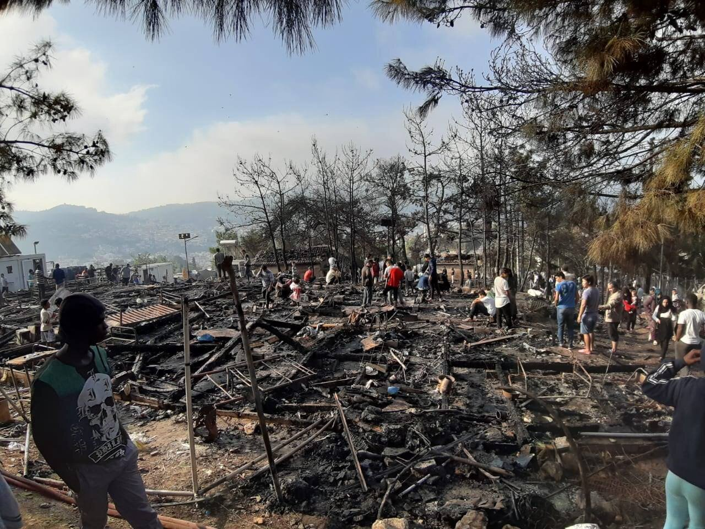

Damage from Vathy fire \(November 2020\)
#### The situation on Samos: overcrowding and health concerns

The Vathy RIC in Samos, initially built for 648 people, currently accommodates over 3,500 people — more than five times its capacity\. 2,700 of the recorded population lives outside of the RIC structure, in what is known as “The Jungle”, an amalgamation of tents sprawled on a mountain, either side of the RIC\.

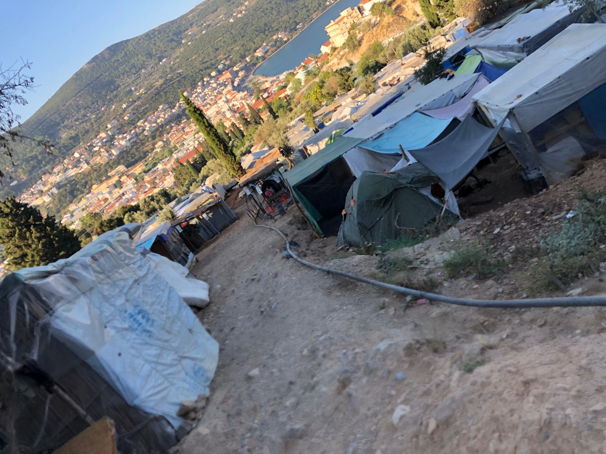

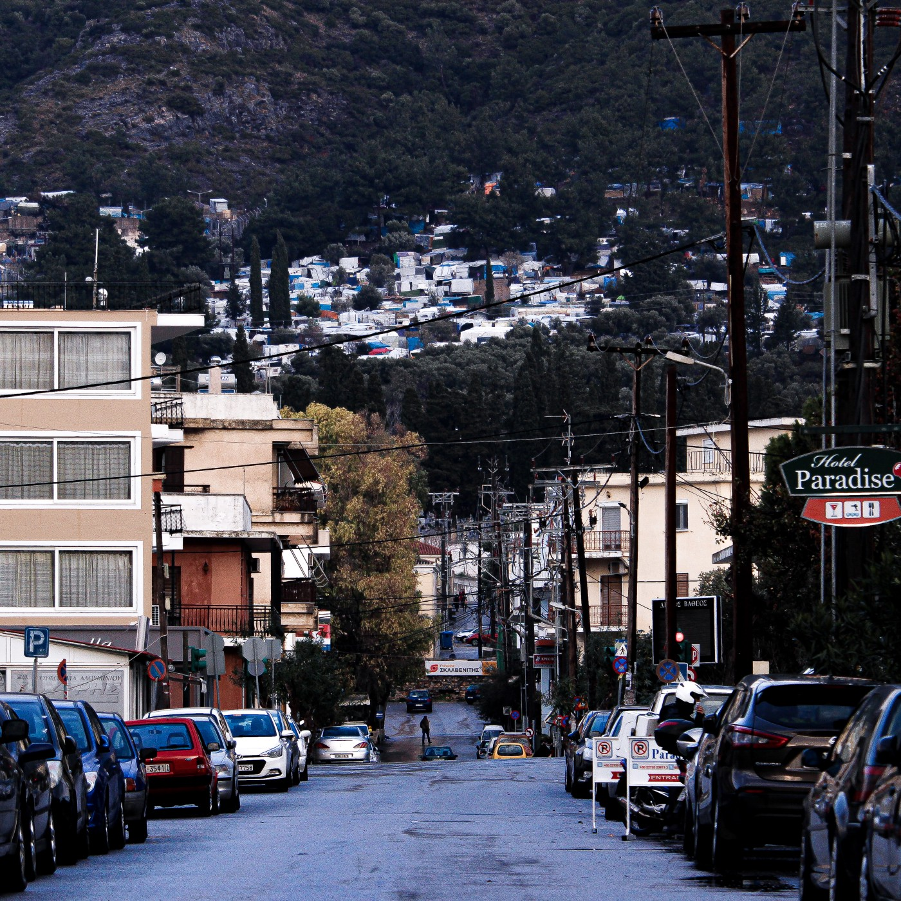

“The Jungle” — an amalgamation of tents situated on the steep slopes above Vathy town

People living in the camp are seeking asylum in Europe from various countries, though the highest numbers are from Syria, Afghanistan, the Democratic Republic of the Congo and Iraq\. According to the [latest UNHCR estimates](https://www.samosvolunteers.org/s/GRC_Samos_WeeklySnapshot_20210103_EN.pdf) \(23rd December 2020\), women account for 19% of the population, minors account for 23%, and 58% are males\. Approximately 900 individuals living in the camp are minors \(under the age of 18 years old\) — 8 out of 10 are 12 years old or younger\.

At least 100 camp residents tested positive for COVID\-19 between September and October 2020, which emphasised the [statement released by MSF](https://prezly.msf.org.uk/b-roll-and-update-horrendous-conditions-in-covid-19-quarantine-in-vathy-camp-samos) that “ _people in quarantine have very limited access to basic services including sanitation, but also food_ ” and suffered from lack of “ _communicated medical response plan from the competent authoritie_ s” during these months\.
#### Fires, earthquake and the cumulative toll on mental health

Since the beginning of the year, there have been at least seven fires in the Vathy camp: [three separate fires in April](https://www.keeptalkinggreece.com/2020/04/27/samos-fires-hotspot-videos/) , [two others in September](https://www.voanews.com/europe/greece-fire-migrant-camp-samos-island-under-control) ; another [on the 2nd November](https://www.infomigrants.net/en/post/28260/fire-outside-vathy-camp-on-samos-leaves-dozens-without-shelter) , which destroyed at least 150 people’s shelters and, one week later, a [second larger fire](https://www.facebook.com/watch/?v=718006448833663) which burnt down the RIC food\-line, isolation boxes and [500–700 people’s shelters](https://www.dailysabah.com/world/europe/fire-breaks-out-at-greeces-samos-migrant-camp-for-2nd-time-in-less-than-2-weeks) \. EuroMed Monitor [stated](https://reliefweb.int/report/greece/samos-fire-inevitable-outcome-appalling-conditions-greek-camps) plainly that the occurrence of such fires in Greek camps is an _“inevitable outcome of appalling conditions_ ’’ of the ‘hotspot approach’ on the Aegean Islands\.

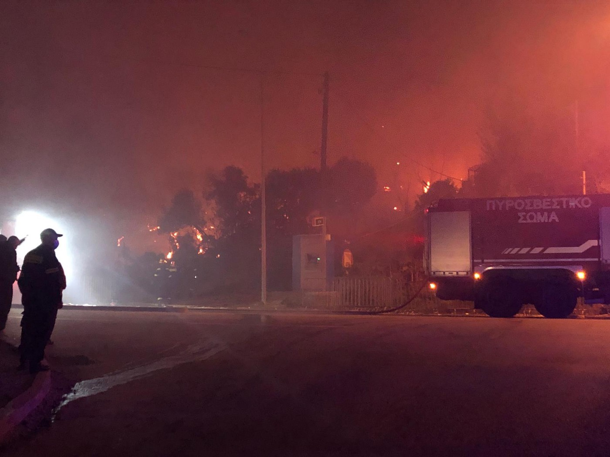

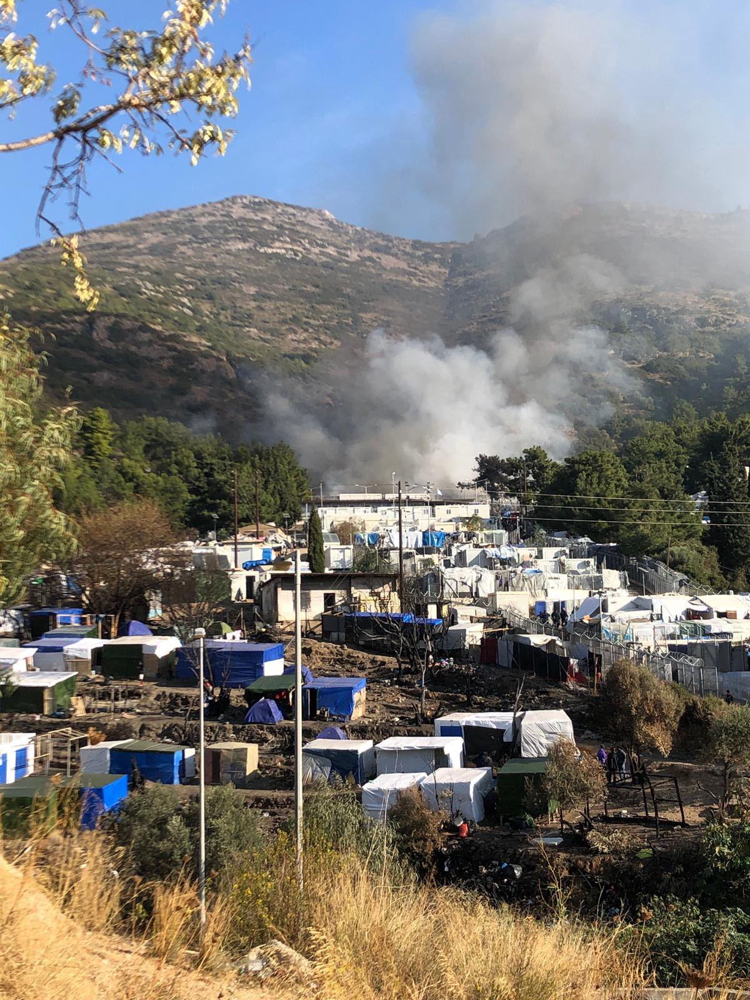

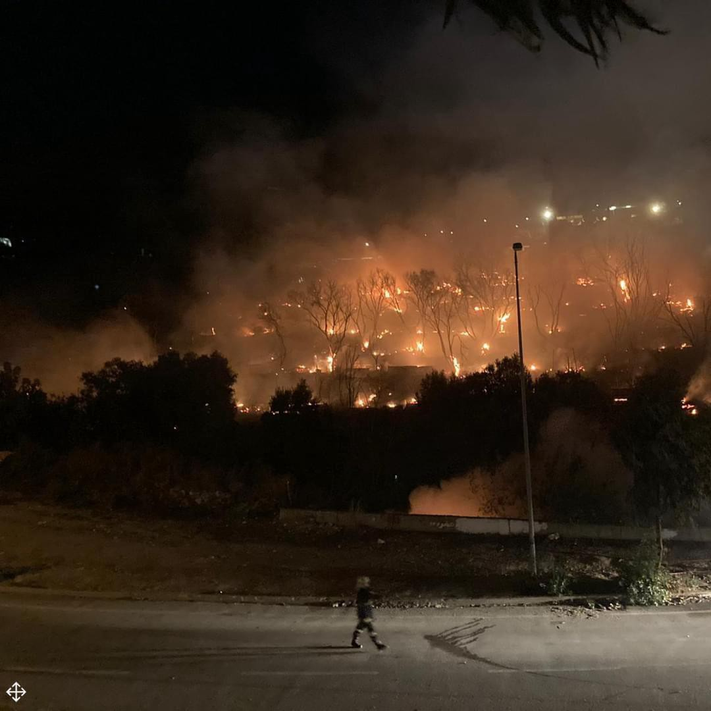

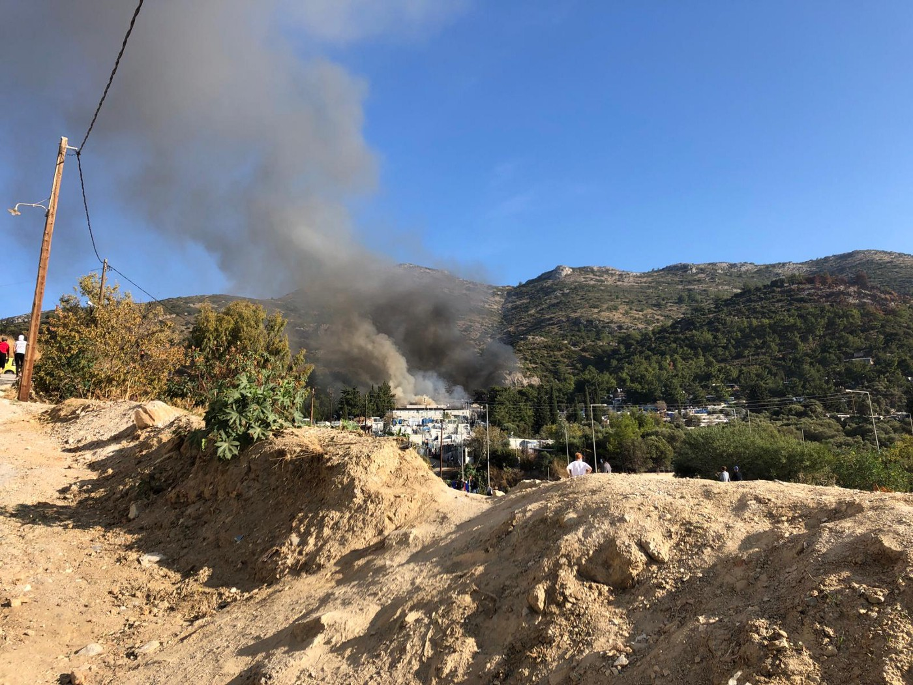

Fire in Vathy camp \(November 2020\)

International Rescue Committee \(IRC\) [published a report](https://reliefweb.int/report/greece/cruelty-containment-mental-health-toll-eu-s-hotspot-approach-greek-islands) this month to highlight the mental toll that the ‘hotspot approach’ has on people who come to Samos in search of safety, consequently demonstrating that the _“dangerous, overcrowded and inhumane living conditions”_ of the Greek camps have resulted in _“consistent accounts of severe mental health conditions”_ \.

The toll on mental health is directly linked to a diffused environment of normalised emergency and unsteadiness, which was further amplified by the powerful [6\.6–7\.0 Richter earthquake](https://www.bbc.co.uk/news/world-europe-54749509) that hit Samos on 30th October\. The earthquake was followed by a series of mini\-tsunamis that damaged buildings along the waterfront\. Since the end of October over [1,400 aftershocks have been felt,](https://reliefweb.int/report/turkey/izmir-earthquake-rapid-assessment-report-november-2020) with 43 of them measuring over 4\.0 on the Richter scale\. As [predicted](https://temblor.net/earthquake-insights/what-do-we-know-48-hours-after-the-samos-earthquake-12016/) by seismologists, even now that many months have passed, strong aftershocks continue to shake the island, meaning that the danger in Vathy and Samos remains significant as there are a large number of damaged buildings\.

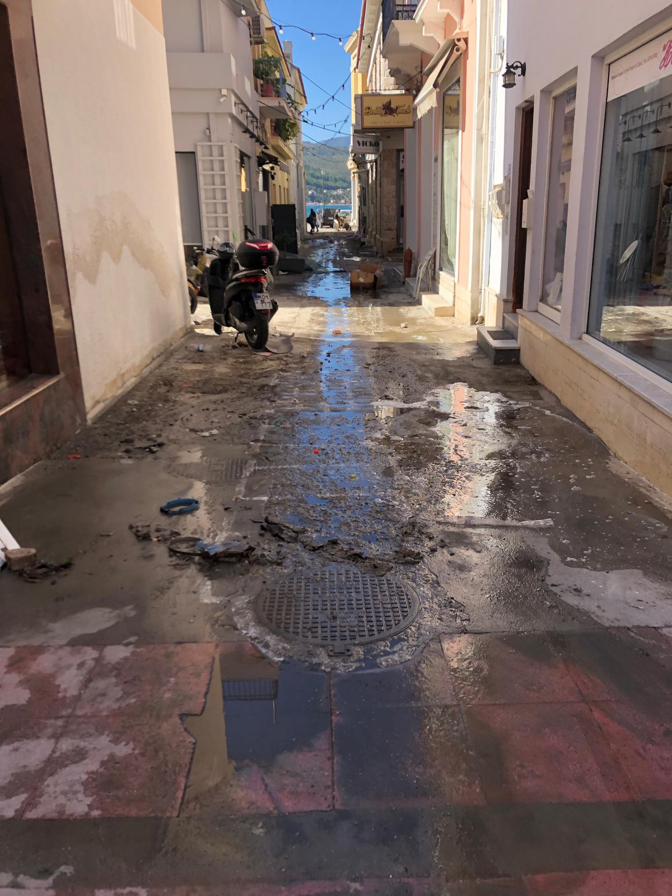

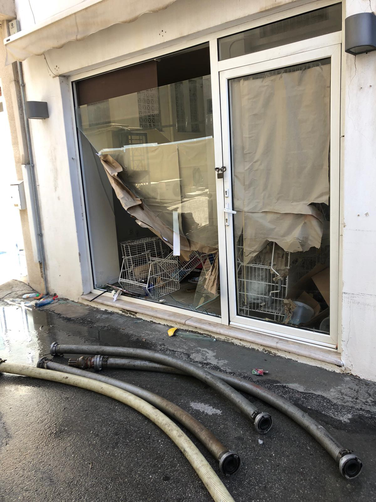

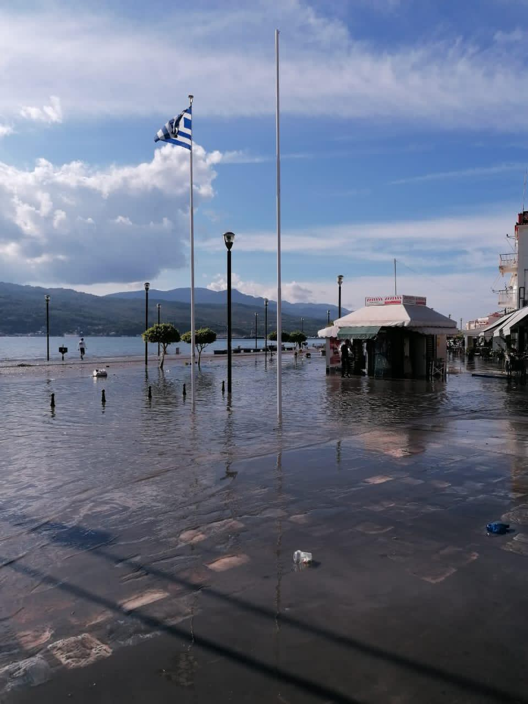

Damage in Vathy town from earthquake and mini\-Tsunami \(October/November 2020\)
#### “Strategy of deterrence”: criminalisation and pushbacks

On 8th November, a boat carrying 24 people trying to reach safety in Samos, including two pregnant women, capsized near Samos\. In this [incident](https://greece.greekreporter.com/2020/11/08/samos-one-child-dead-six-refugees-missing-as-boat-capsizes-in-aegean/) , a 6\-year\-old child lost his life\. The father of the child was arrested and subsequently [charged](https://www.facebook.com/AegeanBoatReport/posts/965785550611216) with endangering his own son’s life: he now faces a 10\-year prison [sentence](https://helprefugees.org/news/samos-tragedy/) if found guilty\. These charges are a direct attack on the right to seek asylum and raise [serious concerns](https://immigrationnews.co.uk/asylum-seeking-father-charged-with-endangering-life-in-greece/) on whether similar charges [criminalising refugees](https://www.pri.org/file/2020-11-12/migrant-father-faces-criminal-charges-after-son-drowns-sea) will be used in the future as a “strategy of deterrence” to inhibit others from seeking safety in Europe\.

Serious questions have been raised over the [significant delays](https://www.facebook.com/AegeanBoatReport/posts/964755564047548) in getting help to the people involved in this tragedy\. [According to the Aegean Boat Report](https://www.facebook.com/285298881993223/posts/973917419798029/?d=n) \(ABR\), the Hellenic Coast Guard was informed about the boat in distress and its location at 00\.05 on the morning of 8th November\. It should have taken the SAR vessels 12–15 minutes to reach the boat in distress, however, the first sign of any SAR vessel in the emergency area was reported at around 02:00 — [two hours](https://www.facebook.com/285298881993223/posts/973917419798029/?d=n) after the initial distress call\. The first rescued people, the body of the child and a severely injured pregnant woman who gave birth a few days later, were [disembarked at Vathy port at 09:30](https://www.facebook.com/285298881993223/posts/973917419798029/?d=n) — that is 7\.5 hours after the SAR rescue mission had begun\. The survivors, who had managed to reach the coast autonomously, were either [found during a foot search](https://www.facebook.com/285298881993223/posts/973917419798029/?d=n) or made their way towards Vathy during the day\.

Similarly to the other Aegean Islands, pushbacks are a [stark reality](https://rsaegean.org/en/push-backs-and-violations-of-human-rights-at-sea-a-timeline/) for many people attempting to reach Samos from Turkey\. In 2020, a [detailed investigation](https://www.bellingcat.com/news/uk-and-europe/2020/05/20/samos-and-the-anatomy-of-a-maritime-push-back/) conducted by Youri Van Der Weide and Bashar Deeb for _bellingcat_ explored a well\-documented arrival on Samos, and subsequent pushback to Turkey by the Hellenic Coast Guard in April\.

More recently, in the early hours of the 24th November, ABR and Alarmphone were [informed](https://www.facebook.com/AegeanBoatReport/posts/979018729287898) of the arrival of 27 people, including 12 children, on the coast near the southern village of Ireo\. The group was [reportedly](https://www.facebook.com/285298881993223/posts/977414962781608/?d=n) hiding in the woods for fear of being discovered by the Greek police and being immediately pushed back to Turkey\. Much like the previous pushback case of the [13th November](https://www.facebook.com/AegeanBoatReport/posts/968579806998457) , ABR [shared](https://www.facebook.com/285298881993223/posts/977414962781608/?d=n) audio\-visual material received from the group, both publicly and with the competent authorities, together with the names and ages of individuals involved\. This was done with the explicit aim of discouraging and preventing an illegal pushback of the transit group\. Nonetheless, ABR [published](https://www.facebook.com/AegeanBoatReport/posts/979018729287898) that the transit group had indeed been detained, stripped of personal belongings and illegally pushed back across the sea to Turkey the following day\.
#### Appalling living conditions in Vathy camp, continuous human rights violations and the looming threat of the new camp

In November, a referral system for human rights violations was created, which highlighted how camp residents are continually impacted by police violence, possible exclusion from health services, unlawful imprisonment and movement restrictions\.

Furthermore, people are strongly dissatisfied with the food distributed in the Samos RIC by the catering company, which has been continuously contracted for the last several years\. During this time, there have been frequent complaints regarding the poor quality of food — which is cooked on the mainland, frozen and then shipped to Samos\. These complaints include distributions of expired and mouldy food, resulting in stomach problems\. Additionally, people must stand in crowded queues daily to receive food, even during the outbreak of Covid\-19\. This has cultivated a real distrust towards the food distributed in the RIC which is amplified by the practical absence of a clear mechanism for complaints and a lack of transparency around the contracting procedures for the catering company providing food\.

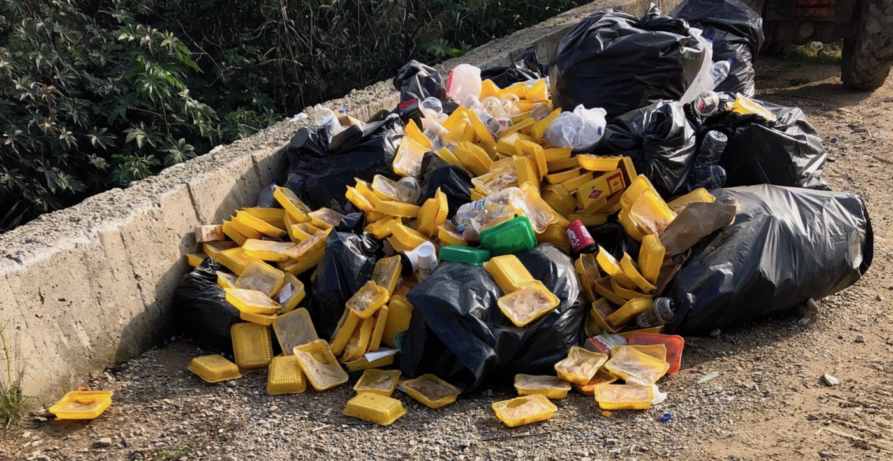

The food served to the people living in Vathy camp has been reported to be spoiled and mouldy\.

Europe Must Act’s Aegean Grassroots Report [highlighted](https://drive.google.com/file/d/1oACJGSnUPzFplCP8zQsDCLMNkdv9AdXh/view) how the Vathy RIC and Jungle meet every criteria for a UN Habitat “Slum”, due to the lack of water, sanitation, overcrowded conditions, non\-durable housing structures and lack of security of tenure\.

The appalling conditions of Vathy Camp violate international human rights law — in particular, Article 25 of the Universal Declaration of Human Rights which [affirms](https://www.ohchr.org/en/issues/health/pages/internationalstandards.aspx) that:

> “Everyone has the right to a standard of living adequate for the health and well\-being of himself and of his family, including food, clothing, housing and medical care and necessary social services, and the right to security in the event of \[…\] lack of livelihood in circumstances beyond his control”\. 

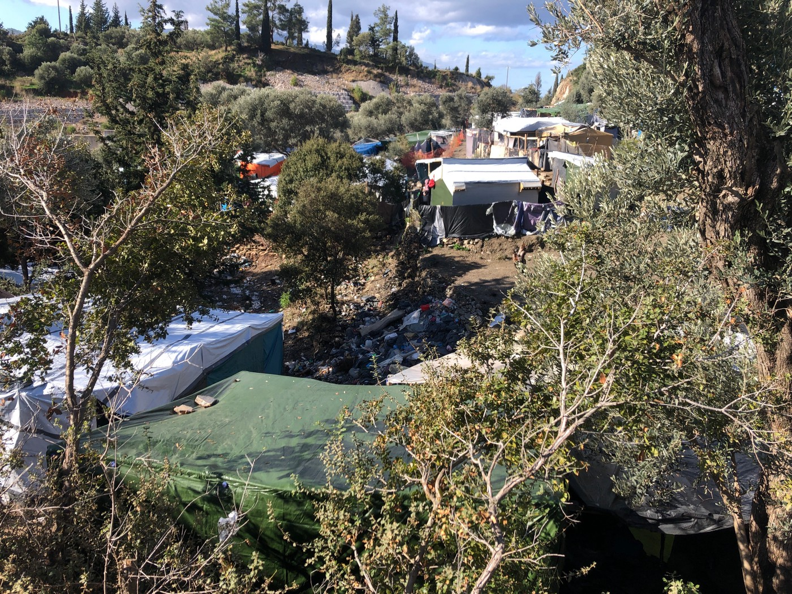

Vathy Camp

To conclude, the long\-announced opening of a new enclosed facility to host the ‘hotspot’ of Samos has once more appeared [in the local press](https://www.samos24.gr/%ce%ba%cf%85%cf%84-%ce%b6%ce%b5%cf%81%ce%b2%ce%bf%cf%8d-%ce%bc%ce%ad%cf%83%ce%b1-%cf%83%cf%84%ce%bf-%cf%80%cf%81%cf%8e%cf%84%ce%bf-%ce%b5%ce%be%ce%ac%ce%bc%ce%b7%ce%bd%ce%bf-%cf%84%ce%bf%cf%85-2021/) \. This new enclosed RIC is supposedly designed to accommodate 3,000 people and is expected to start accommodating people by mid\-2021 according to the Municipality of Eastern Samos\.

Among the humanitarian organisations and observers, the main concern regards the camp’s isolated location in Zervou, approximately 6 kilometers from the major city of Vathy, which will make it easier for the EU and other responsible bodies to turn a blind\-eye to the lives of the people living there\. This is emphasised by the fact that those who work in the new camp will be obliged to sign [non\-disclosure agreements](https://www.e-nomothesia.gr/kat-allodapoi/upourgike-apophase-23-13532-phek-5272b-30-11-2020.html) and it will be increasingly difficult for journalists and the media to cover the situation inside the premises — resulting in a lack of transparent information in what will be daily life for those transferred to the new camp\.

Without a clear sign of political will to dismantle and redesign our current European migration policies — and with the Greek government so firmly set on pursuing a [mass ‘containment’](https://interactius.ara.cat/en/reports/on-the-ground/camps-refugees-samos-europe/containment?utm_medium=social&utm_source=twitter&utm_campaign=especials) of the refugee and migrant community on national soil — the foreseeable future for the thousands of people who are in Samos and the Aegean Islands in search of safety is uncertain, with the real threat of a continued deprivation of basic services and human rights\.

**Photos and Text by activists on the ground\.**

**Find daily updates and special reports on our [Medium page](https://medium.com/are-you-syrious) \.**

**If you wish to contribute, either by writing a report or a story, or by joining the info gathering team, please let us know\.**

**We strive to echo correct news from the ground through collaboration and fairness\. Every effort has been made to credit organisations and individuals with regard to the supply of information, video, and photo material \(in cases where the source wanted to be accredited\) \. Please notify us regarding corrections\.**

**If there’s anything you want to share or comment, contact us through Facebook, Twitter or write to: areyousyrious@gmail\.com**

_Converted [Medium Post](https://medium.com/are-you-syrious/ays-special-from-samos-fires-human-rights-violations-and-pushbacks-374b8227d5af) by [ZMediumToMarkdown](https://github.com/ZhgChgLi/ZMediumToMarkdown)._
