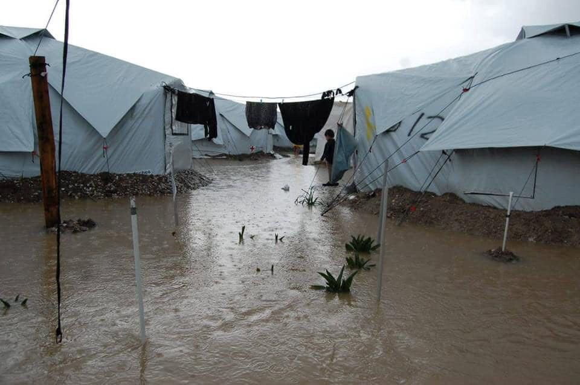
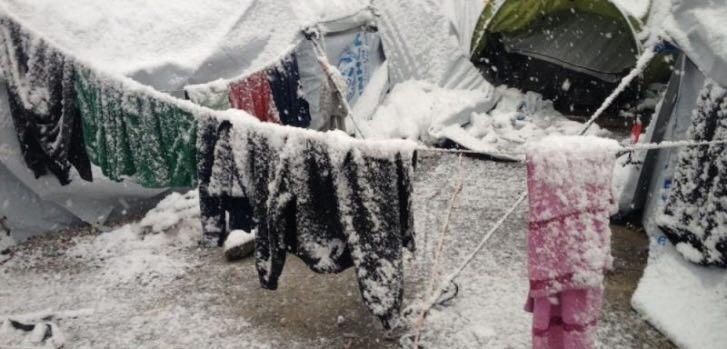
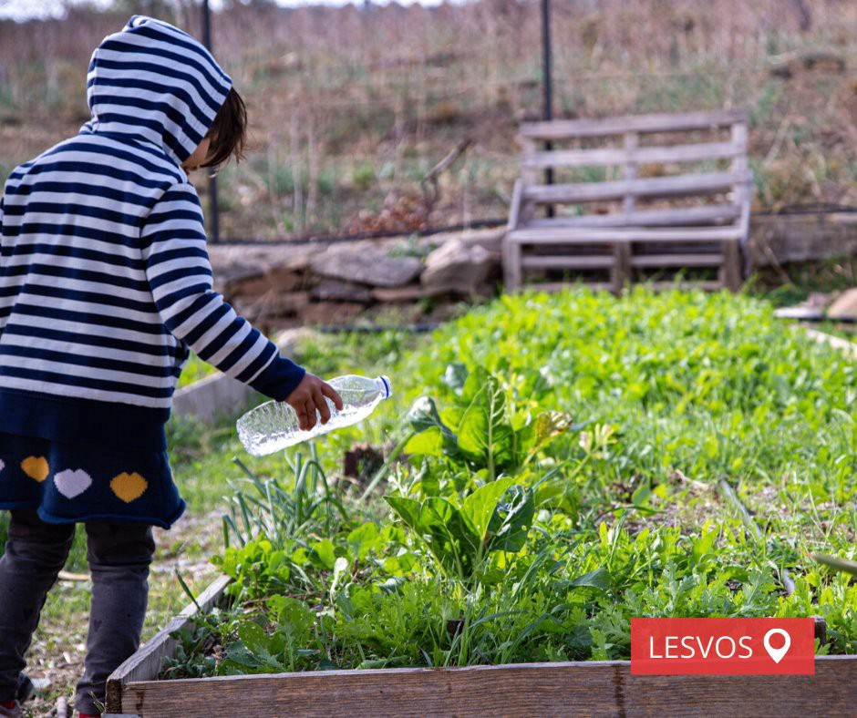
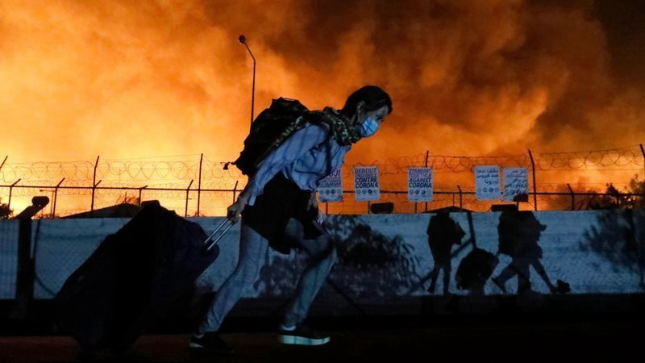
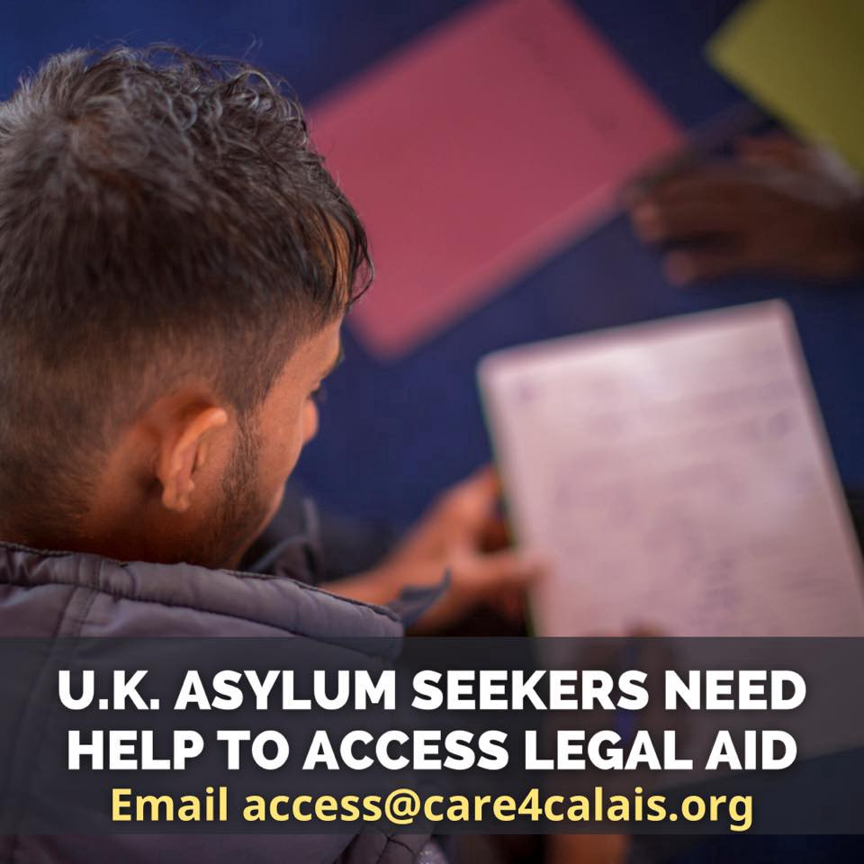

### AYS Daily Digest 18/01/21 Flooded tent living in freezing weather during a pandemic in Greece

[Are You Syrious?](?source=post_page-----f7c89d96657--------------------------------)

[Jan 19](ays-daily-digest-18-01-21-flooded-tent-living-in-freezing-weather-during-a-pandemic-in-greece-f7c89d96657?source=post_page-----f7c89d96657--------------------------------) · 11 min read

_Germany preparing for Syria deportations // 9\-year\-old dies off Spanish coast // not a single child has arrived in the Netherlands from Moria // and more…_

### FEATURE: Freezing temperatures, snow, inhumane sanitation conditions, living in a tent during Greece’s winter

Some terribly cold nights have arrived on the Aegean islands\. There are [reports](https://www.facebook.com/europemustact/posts/228821035397265) of 0 degrees at night with “snow, fires, floods, disease outbreaks, rodent infestations…the list goes on\.”

In an update from Lesvos, from [Watershed](https://www.facebook.com/watershedstiftung/posts/3823499627730048) :

> _“Over the weekend, temperatures on Lesvos have plummeted to below zero\. Snow can be seen on the mountain tops and there was even a spattering of snow on cars in Mytilene this morning\. Just down the road, over 7,000 people are living in a temporary camp, in tents… We, just like our friends and partners working in the camp, are on high alert and trying our best to keep people warm and dry, despite the impossible nature of the task\. For Watershed, this means being on call around the clock, in case of rain, sleet or snow; to ensure our flood defenses are working and that the dewatering pumps can keep running when they need to\.”_ 

In an update from Samos, from [Samos Volunteers](https://www.facebook.com/samosvolunteers/posts/1826713037506848) :

> _⚠️❄️ “This is the current weather conditions in Samos and the Aegean Islands\. Since last week temperatures have heavily dropped and the cold can really be felt, even indoors\. The concern is high at the moment, especially for the people living outside of the RIC facility\. SV and all other NGOs on Samos are now in conversations with the UNHCR, RIC management and local authorities in order to respond to the situation\. More updates will soon follow\.”_ 

In an update from Malakasa camp, near Athens, [RSA](https://twitter.com/rspaegean/status/1351078019310432262) reports:

> _“Yesterday there was snow everywhere\. It felt like a cemetery, that cold\. I went to take water from the taps outside\. I had to wait until the water started running, because in the early morning it was frozen…”, says a refugee\. “Most people live in containers, but some families with kids and single men are in tents inside a storage building\. There are more than 30 tents\. People living there have to use the showers, toilets & water taps outside\. There are mice in the building and there is no privacy\. When the snow melts, and when it rains, water enters the building and the tents that have no pallets beneath get wet\. Yet, people there are happy not to be homeless in the streets anymore\.”_ 

### LIBYA
### 156 refugees and asylum\-seekers resettled by Rwanda since COVID\-19 outbreak

According to [All Africa](https://allafrica.com/stories/202101180058.html?fbclid=IwAR0nocogNRi-c5rU4iFWGSDK_O9nupnGPV0Sv31-I5TecP-3ZuywzK-_9Z8) :

> _“The Ministry of Emergency Management \(MINEMA\) says that the outbreak of Covid\-19 did not impede the exercise of receiving and resettling refugees and asylum seekers from Libya\. According to statistics from MINEMA, 156 refugees and asylum seekers from the North African country have been resettled since mid\-March\. Of these, 87 were resettled to Sweden, 46 to Norway, 18 to Canada and five to France\._ 

> _Meanwhile, since the outbreak of the virus in the country, Rwanda has received 209 asylum seekers and refugees\. Since 2019, Rwanda has been receiving refugees and asylum seekers who were evacuated from Libya, after being stranded there, some for years, following the cutting short of efforts to make it to European countries\.”_ 

### SEA

[AlarmPhone](https://www.facebook.com/watchthemed.alarmphone/posts/2867034013570823) provided this update:

> _⚫ “9\-year\-old boy died off Canaries_ 
 

> _On 10 January, the Alarm Phone was alerted to a group of about 37 \(in the end 35\) people who went missing when travelling to the Canaries by boat\._ 
 

> _We found out yesterday that 34 travellers were rescued and brought to Gran Canaria after 5 days at sea\. Sadly, we found out that one person lost his life\. He was only 9 years old\.”_ 

In more reports from the tragic scene:

> _“The story of a girl of about twelve from Guinea Conakri has just left the members of the emergency services attending to the last of the boats arriving in the south of Gran Canaria cold: **her brother, aged nine, died only a few hours earlier, while they were lost in the Atlantic, and his fellow travellers threw his body into the sea\.**_ 
 

> _Guardamar Talía, from Salvamento Marítimo, has returned tonight to the port of Arguineguín with an unusual paterera, made up mostly of women: 21 of its 34 occupants are women, including a girl and a young pregnant woman\. The occupants of the nacelle, sub\-Saharans, say that they had been at sea for about five days when a Rescue plane found them, some 160 kilometres south of the land they now walk on\. Their state of exhaustion, dizziness, dehydration and weakness bear witness to this: most of them can hardly walk without help when they descend to the quay, several are taken off the boat on stretchers and two have gone directly to hospital\.”_ 

Read more on [Efe here](https://www.facebook.com/infoforrefugees/posts/3731559686923677) \.

Three corpses were also rescued on Monday\. They died after their boat was overturned off the coast of Almeria\. Read more [here\.](https://www.elmundo.es/espana/2021/01/18/6005780721efa0b91e8b458a.html)
### GREECE

### ITALY
### 26 people found in containers Salerno port

According to InfoMigrants: “ _Early Thursday morning \(January 14\), maritime border police at the Port of Salerno discovered 26 migrants who had entered Italy irregularly by hiding in two containers on a ship from Turkey\. The officers were awaiting the migrants as they emerged from the containers in which they had been enclosed for more than three days\. The container ship left the port of Aliaga, Turkey, on Monday evening, and arrived in Salerno on Wednesday morning\. Of the 26 migrants, six are minors_ \.” More [here](https://www.infomigrants.net/en/post/29694/italy-26-migrants-found-hidden-in-containers-in-salerno-port?fbclid=IwAR3u19mA3-lBCUMWoZAjdjUK1wBxXadzEAHWMohxXrRDY07jtJq2QbLVrv0) \.
### SPAIN
### An unaccompanied minor spent 8 days in a police camp

There was no running water, no electricity, and he had to ration food\. He had his passport proving that he was a minor, but because of “police confusion” they did not initially transfer him\. He is now with the proper unaccompanied minor overseers\. More [here\.](https://www.eldiario.es/canariasahora/migraciones/menor-pasa-ocho-dias-campamento-policial-migrantes-barranco-seco_1_6843323.html?fbclid=IwAR2-onvRcbiWsFtuiO-FzcivG7zPdfg93XDDzpt7q6ttkADXQAT9v-wt6Lw#)

Update from [No Name Kitchen:](https://www.facebook.com/NoNameKitchenBelgrade/posts/1165181837213432)

> _“ **News from Melilla**_ 
 

> _La Purisima, the centre for young boys, Gota de Leche, the centre for both boys and girls and Plaza de toros, the place for adults, remain completely closed\. The people who have been forced to live in these centres are not permitted to leave\. The authorities justify this by saying that there have been positive cases confirmed inside the centres\. PCR tests have been used, and it is therefore possible to identify who has Covid and who does not\. Despite this, even those who test negative are prevented from going outside\._ 
 

> _To add to the people imprisoned inside these centres, there are still many people living and sleeping on the streets\. With the border still closed, we continue to hear stories of people swimming from Morocco to the city of Melilla, which is, obviously, extremely dangerous\. The people we meet tell us that due to the bad winter weather, there is less visibility at sea, which makes it far more difficult for the authorities to locate people who swim by night\._ 
 

> _**As long as Plaza de Toros remains closed and continues to refuse new arrivals, everyone living on the streets is denied the right to a roof over their head, and to food\.** The fact that these political decisions have led to more people sleeping rough has led to an increase in the amount of food that our project, together with Solidary Wheels, distributes, as well as an obvious increase in cost\.”_ 

### BOSNIA AND HERZEGOVINA

If you’re a member, read the full Le Monde report [here](https://www.lemonde.fr/international/article/2021/01/18/en-bosnie-une-inhumaine-route-migratoire_6066667_3210.html) \.
### GERMANY
### Germany preparing to start deportations to Syria

According to German newspaper [Welt](https://www.welt.de/politik/deutschland/article224482368/Vorbereitungen-laufen-Bundeslaender-bereiten-Abschiebung-von-syrischen-Gefaehrdern-vor.html?wtrid=socialmedia.socialflow....socialflow_twitter) :

> _“After the general ban on deportation to Syria, several federal states are now preparing for the possibility of deportations to the country\._ 

> _‘Wherever legally and actually possible, we do everything possible to get such people out of the country\. And that must also apply to people who come to us from Syria,’ said **Baden\-Württemberg** Interior Minister Thomas Strobl \(CDU\) \.”_ 

**Bavaria’s** Interior Minister Joachim Herrmann, **Saxony’s** Interior Minister Roland Wöller, **Schleswig\-Holstein’s** Interior Minister Sabine Sütterlin\-Waack, and **Hesse’s** interior minister Peter Beuth are all looking into deportations to Syria\. Welt also says:

> _“Other interior ministries led by the Union expressed themselves cautiously: Brandenburg, Mecklenburg\-Western Pomerania, Saarland and Saxony\-Anhalt are still examining what follows from the decision of the Conference of Interior Ministers to lift the ban on deportation\._ 

> _The SPD\-led internal departments in Berlin, Bremen, Hamburg and Lower Saxony, on the other hand, do not see any requirements for deportations to Syria\. While the Minister of Integration in North Rhine\-Westphalia, Joachim Stamp \(FDP\), is open to such, his colleague Anne Spiegel \(Greens\) in Rhineland\-Palatinate and Migration Minister Dirk Adams \(Greens\) in Thuringia strictly reject it\.”_ 

### FRANCE
### The worst it has ever been for refugees in northern France

In a report by VICE World News:

> _“Humanitarian charities told VICE World News on a recent visit that the conditions faced by refugees in northern France are now ‘more precarious than ever\.’ People in Calais want to reach the UK before strict Brexit policies come into play, with many seeing the UK as providing better living conditions than those afforded in the rest of Europe\. But the rise of anti\-immigration politics, blocks on crucial NGO support and uncertainty brought on by the coronavirus pandemic and Brexit are creating a hostile atmosphere that is pushing people to the edge — and some beyond it to their deaths\._ 

> _‘The situation is catastrophic,’ said Siloé Medriane, coordinator for Utopia56, a French nonprofit supporting refugees in Calais\. ‘They are all across the city and the outskirts\. It’s a lot more difficult for us to help them because there is no longer one place with thousands of refugees but several with hundreds\. For them, it’s just about survival now\.’”_ 

### NETHERLANDS

### “Not a single child” was evacuated to the Netherlands after Moria fire

Four months ago, the cabinet promised to bring [100 of the most vulnerable people](https://www.nrc.nl/nieuws/2021/01/17/belofte-na-brand-moria-niet-ingelost-a4027974?fbclid=IwAR2CykLUqPauSnOExB4IlvIKiFPfXY61KXjTNkQ8xbS1U9Coo_c0us50mWM) to the Netherlands after the fire destroyed almost the entirety of Moria\. Fifty of them were supposed to be unaccompanied minors, 14 years old or under\. But so far, the Netherlands has not ushered in a single child from Moria, said the guardianship institution Nidos, which is responsible for overseeing unaccompanied children arriving in the country\.

> _“It turns out to be difficult to find children who are younger than fourteen years old and who also have a high chance of a residence permit in the Netherlands — these are the conditions set by the Netherlands\. In the Greek refugee camp, mainly Afghan children are said to stay, they have little chance of a residence permit in the Netherlands\. A spokesman for the Ministry of Justice also says ‘unfortunately he is dependent on the developments around Covid\-19 and restrictions that apply in the Netherlands and in Greece\.’”_ 

The other 50 were supposed to be families from Moria\. Forty\-nine people did arrive before Christmas, but apparently over half of them had never even been to Moria\. Of course welcoming any refugees, from Moria or not, is worthwhile, but it would appear that the Netherlands has so far failed in its post\-fire endeavor\.
### 50% fewer asylum applications for 2020

Compared to the 2019 total applications \(29,435\), last year only saw 19,132 applications\. Also the number of first\-time applications fell to 13,673 for 2020 compared to 22,533 for 2019\. This drop is closely related to the COVID\-19 restrictions put in place at the beginning of 2020, because from June to December, the number of applications rose significantly\. See more data [here](https://ind.nl/nieuws/Paginas/Asielinstroom-in-2020-.aspx) \.
### EU/FRONTEX

In a press release from Frontex, they say they are expanding cooperation with Operation IRINI: \(read in full [here](https://frontex.europa.eu/media-centre/news-release/frontex-to-expand-cooperation-with-operation-irini-IYCjyo?fbclid=IwAR0scsQzRj--qERarelvqVq9NqR33Ds4CwGF-u7_uFzvDTgPAx1g4uczmSc) \)

> _“Frontex, the European Border and Coast Guard Agency and Operation EUNAVFOR MED IRINI have agreed last Friday to expand their cooperation to address challenges and threats to EU security in the Central Mediterranean region\._ 

> _Under a new working arrangement, Frontex will be supporting Operation IRINI with information gathered as part of the agency’s risk analysis activities, such as tracking vessels of interest on the high seas, as well as data from its aerial surveillance in the Central Mediterranean\. The agreement also foresees the exchange of experts\. Currently, an EUNAVFOR MED expert is based at the Warsaw headquarters of Frontex to support information exchange and cooperation in search and rescue operations\.”_ 

The EU Observer is reporting that “Frontex spent €94,000 on a dinner in Warsaw\.” This event is not isolated and the agency has a consistent pattern of billing the EU taxpayer for “lavish” events it throws to celebrate its “success\.” [Manos Moschopoulos](https://twitter.com/maledictus/status/1351208708991295492) from Open Society said “I’m sure the European anti\-fraud agency investigating Frontex will have a feast \(on this news\), even if they weren’t invited to the actual dinners\.”
### UK
### “Hundreds of asylum seekers locked in ex\-military camp after Covid\-19 outbreak”

In new reporting by [the Independent](https://www.independent.co.uk/news/uk/home-news/asylum-seekers-coronavirus-napier-barracks-b1788902.html?fbclid=IwAR2Az8-CsHcmsOa7UY_A165_c2YY5IU9EXfgxtRfgKHygGciT9swgTecX6I) :

> _“Hundreds of asylum seekers have been locked in a former military barracks as part of a quarantine procedure following a coronavirus outbreak at the site, leaving many fearing for their lives\. Residents at Napier Barracks in Folkestone, Kent, received a letter on Saturday from Clearsprings, the private firm managing the facility, telling them that they would not be allowed to leave the premises, and that if they did they could face arrest\._ 

> _Last September, the former army base was turned into accommodation for asylum\-seeking men and is now said to be housing around 400 people\. A number of them are thought to be over 50, placing them at higher risk of the effects of coronavirus\. Lawyers have said the conditions at the barracks — where residents sleep metres apart, more than 20 to a room with sheets hanging between them — may breach the law, and have accused the Home Office of trying to “avoid scrutiny” of the situation\.”_ 

According to [InfoMigrants](https://www.infomigrants.net/en/post/29699/more-migrants-prevented-from-crossing-channel-report-british-and-french-police?fbclid=IwAR2as-tfkRIydCWe2Mzl9c1zOuxFfM27k1zYpq7lQBYagU3mjBOXDrOQZI4) “ _More than 60 migrants were prevented from crossing the English Channel between France and the UK at the weekend\. British police said they detained 36 people, and the French authorities arrested 27 people on Saturday\. A further 134 were prevented from crossing over the last week\._ ”

### WORTH READING
- [We Are Solomon](https://store.wearesolomon.com/notes-from-the-field/refugee-minor-in-patras-see-you-in-another-country/?fbclid=IwAR2XPRK3wnejrxdy9CEEx9HXwOYX7m9dDLSkU5sBk_adpYtLmbPy_sPpycw) just published a new Notes from the Field on **Refugee minor in Patras: “See you in another country\.”** If you want a recent look into the Patras sea route, this is a good read\.

**Find daily updates and special reports on our [Medium page](https://medium.com/are-you-syrious) \.**

**If you wish to contribute, either by writing a report or a story, or by joining the info gathering team, please let us know\.**

**We strive to echo correct news from the ground through collaboration and fairness\. Every effort has been made to credit organisations and individuals with regard to the supply of information, video, and photo material \(in cases where the source wanted to be accredited\) \. Please notify us regarding corrections\.**

**If there’s anything you want to share or comment, contact us through Facebook, Twitter or write to: areyousyrious@gmail\.com**

_Converted [Medium Post](https://medium.com/are-you-syrious/ays-daily-digest-18-01-21-flooded-tent-living-in-freezing-weather-during-a-pandemic-in-greece-f624aaf459d2) by [ZMediumToMarkdown](https://github.com/ZhgChgLi/ZMediumToMarkdown)._
