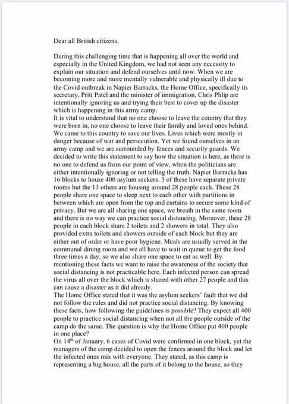
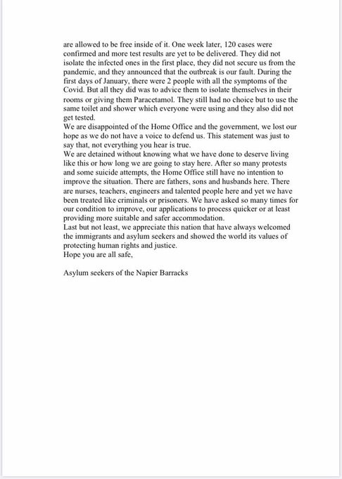

### AYS Daily Digest 21/1/21: Detention — The EU and UK’s common trait after Brexit
#### A humanitarian crisis is rapidly unfolding at Napier barracks / More lives lost to hypothermia upon arrival to the EU / Covid vaccination information in English and Arabic / Tribunal recognises ‘readmissions’ to Slovenia under bilateral agreement are illegal and grant access to victim of chain pushback / recommended reads & more

](assets/96b32229121e/0*i_sEAMfSsp9G0kE4)

Photo via [**Jack Shenker**](https://twitter.com/hackneylad)
#### FEATURED
### “We lost our hope as we do not have a voice to defend us”

A covid\-19 outbreak is spiraling out of control at the UK’s first modern\-day refugee camp, where people have nowhere to turn for help and medical assistance\.
Reportedly, up to 28 people are sharing two bedrooms and a bathroom, making social distancing impossible\. Now, after having waited for months for their claims to be processed, all of them are locked up inside, guarded by the police\. “Despite multiple warnings from humanitarian organisations that this site is completely unsuitable for asylum\-seeker accommodation, Home Office minister Chris Pilp has attempted to blame residents for the current crisis, warning that refugees ‘could face enforcement action’”, [Jack Shenker](https://twitter.com/hackneylad) reported\.

> In Folkestone’s museum hangs a painting depicting the landing of Belgian refugees down at the harbour\. 16,000 arrived on small boats during a single October day in 1914, prompting King Albert to thank the people of Folkestone for a “cordiality that will never be forgotten”\. Its artist, an Italian named Fredo Franzoni, was one of those who made the journey\. “You can see the mayor is there to welcome them, and the priests of the town, and a nurse, and a small girl offering them a tray of biscuits,” says Bridget Chapman, of the Kent Refugee Action Network\. 

> “The psychogeography of Kent is complicated, and contradictory\. But welcoming groups of tired, bedraggled people who climb out of boats — that’s a part of it\. It’s right there in our history\.” 

■■■■■■■■■■■■■■ 
> **[Jack Shenker](https://twitter.com/hackneylad) @ Twitter Says:** 

> > For more on what's happening at Napier, check out recent news stories by @[maybulman](https://twitter.com/maybulman), @[JamieGrierson](https://twitter.com/JamieGrierson) and the team at @[kentlivenews](https://twitter.com/kentlivenews), as well as updates from solidarity organisations like @[_KRAN_](https://twitter.com/_KRAN_) and @[Care4Calais](https://twitter.com/Care4Calais). My long-read on Napier for @[tortoise](https://twitter.com/tortoise) is here: [torto.se/2Xez8At](http://torto.se/2Xez8At) 

> **Tweeted at [2021-01-21 11:02:22](https://twitter.com/hackneylad/status/1352209919215337472?s=20).** 

■■■■■■■■■■■■■■ 

### COVID\-19 vaccination guide for older adults in English and Arabic

This leaflet by the [Asylum Welcome](https://www.asylum-welcome.org/news/covid-19-vaccination-guide-for-older-adults-in-english-and-arabic?fbclid=IwAR2nrEY4-FsepNjgMAQDxH8aJnOV-P9OZqS_FwPkZdmdKV3fJJsaTyfhgvg) team gives a good overview of the COVID\-19 vaccination, including who is eligible and who needs to have the vaccine to protect them from Coronavirus\. Please read and help us spread the word\.

[COVID\-19 vaccination guide for older adults, English version](https://assets.publishing.service.gov.uk/government/uploads/system/uploads/attachment_data/file/951753/PHE_COVID-19_vaccination_guide_for_older_adults_English_v2.pdf)

[COVID\-19 vaccination guide for older adults, Arabic version](https://assets.publishing.service.gov.uk/government/uploads/system/uploads/attachment_data/file/953062/PHE_COVID-19_vaccination_guide_for_older_adults_Arabic.pdf)
#### GREECE

There are continuing reports of newly arrived people on the islands, with the latest group of about 30 people arriving on Lesvos last night\.
### Freezing temperatures stress the impotence of the systems while the weakest suffer

Under extremely low temperatures that occurred after the recent snowfall in the north of Greece, two 13\-year\-old unaccompanied refugee children were left homeless in the streets\. They were discovered visibly distressed by the ARSIS team\. They are two among thousands of young people freezing across the country, and beyond, along the route to the unknown\. Organisations working with children say they have seen an increase in the number of unaccompanied minors under 14 years old, with a jump of over 15% during the last year\.

**Food team from** **Our House Soup is looking for a responsible coordinator** in order to prepare morning meals for people:

■■■■■■■■■■■■■■ 
> **[ourhousesoup](https://twitter.com/ourhousesoup) @ Twitter Says:** 

> > I started with a few homemade soups and soon dozens of people joined - we became a group of people who shared our homemade soup with our friends on the street every night at 7pm.

Then our friend Muhammed Ali Ayhan started the shift at 11 pm and we went to two shifts 
1/5 https://t.co/3n9AZM6nPW 

> **Tweeted at [2021-01-19 13:38:24](https://twitter.com/ourhousesoup/status/1351524409635442688?s=20).** 

■■■■■■■■■■■■■■ 

#### ITALY
### Chain pushbacks to Slovenia are illegal, court rules

_Tribunal recognises that ‘readmissions’ to Slovenia under bilateral agreement are illegal and grants access to the country to victim of chain pushback to Bosnia\._

A new ruling from the [Court of Rome](https://www.asgi.it/wp-content/uploads/2021/01/Tribunale-Roma_RG-564202020.pdf) has been released, finding in favour of an applicant who was subject to an illegal chain pushback from Italy, via Slovenia and Croatia, to Bosnia\-Herzegovina\. This important case was brought to the court by [Italian legal association ASGI](https://www.asgi.it/allontamento-espulsione/bosnia-diritto-asilo-italia/) \.

The case was supported by the Border Violence Monitoring Network \(BVMN\), who provided [first\-hand testimony from the applicant](https://www.borderviolence.eu/violence-reports/july-15-2020-0000-piazza-liberta-trieste/) \. The court found unequivocal evidence of violations of international law, and acknowledged the applicant’s right to enter Italy immediately, as well as the applicant’s right to full and proper access to the asylum system\. [Read more\.](https://www.borderviolence.eu/italian-court-ruling-on-chain-pushback/#more-16730)

](assets/96b32229121e/0*dIsMHaz_raWK3kFw.jpg)

[Details on the asylum data until 2020](https://viedifuga.org/asilo-in-italia-in-tutto-il-2020-40-di-richieste-lunhcr-italia-slovenia-a-rischio-il-diritto-alla-protezione/?fbclid=IwAR0uwmAMK8fIWVFv2A4P-eiqMeREUGi_9_chSUkwKqKqrJnYufmvLvVgSio)
#### FRANCE
### Protests in detention centres

At the administrative detention centre in Vincennes, people have protested and announced a hunger strike due to a lack of understanding, information and protection during the months spent there\. As the pandemic enters the centre, they “no longer know who has corona and who doesn’t\.” No support is being provided and they say they feel alone, ignored and abandoned to all sorts of risks they cannot change or escape from\. Activists have reported that the guards followed them as they went into the courtyard to protest, but avoided getting anywhere near the people as they presumably fear getting infected, They invite the journalists to document what goes on inside these centres and how they function in reality\. [Here](https://abaslescra.noblogs.org/greve-de-la-faim-au-cra-1-de-vincennes/) ’s more \(in French\) \.

](assets/96b32229121e/0*4m8W0i9-U7b6JHbb)

Photo: [@bas\_cra](https://twitter.com/bas_cra)

In the meantime, French authorities are continuing regular clearances of migrant tent camps in **Calais and Dunkirk** , despite snow and freezing conditions:

#### SPAIN
### Melilla’s mismanagement and mistreatment of asylum seekers keeps minors living on the streets in dire conditions

The situation in Melilla remains serious\. According to the local JRS, during the weekend there has been a real health emergency in the autonomous city, with people forced to stay on the street, including minors\. Those who had just left the La Purísima Children’s Centre at the age of 18 were denied a place in the Temporary Stay Centre for Immigrants \(CETI\) or in the temporary lodging space set up in Altos del Real, where those who arrive are quarantined\. Faced with this situation, the local Christian and civil society organizations mobilized so that they would not sleep in the open\.

> They requested asylum in the Police\. They were given some clothes and taken to the hospital, where they passed the antigen test\. Mal slept in chairs until police came looking for them Sunday noon\. They were taken to the door of the CETI, where they have only been given some clothes, food and a blanket, leaving them in the street\. 

Speaking to the Spanish [media](https://alfayomega.es/melilla-sjm-migrantes-calle/?fbclid=IwAR3agq3FDbKfFhtBr1eKcfgl-WfQcUUehPWgHKhR7yE4hphaFXb_GJDqgQg) , the Jesuit Josep Buades, SJM South Border coordinator, stated:

> They are doing the opposite of what the health authorities recommend\. It is irresponsible management and it is important that public opinion perceives that this mismanagement harms the whole of society\. 

### More lives lost to hypothermia upon arrival to the EU

In just the first 20 days of this year, it has been reported that ten people on the move have died trying to reach the Canary Islands\. The last two deaths were [documented](https://www.eldiario.es/canariasahora/migraciones/muerte-migrante-hierro-eleva-nueve-victimas-ruta-canaria-ano_1_6945150.html?fbclid=IwAR0GM-cosfFFQjeSLqZvk-c_427UTzX22JI5-iuEABDQk_f0p1wWiDL-nog) in El Hierro after the arrival of a boat with 52 people on board\. One of them died overnight, and the other died this Wednesday at the island’s hospital\. Another three remain hospitalized with severe hypothermia after arriving at the port of La Restinga\.
#### DENMARK
### Detained to be sent into danger

According to refugee activist Lene Kjær, a large group of Iraqis was detained and informed that they would be deported to Baghdad around January 20\. Allegedly, the Iraqi authorities have agreed to receive the group\.

> One of the detainees has not been to Iraq since the age of 3, has no family there and hardly speaks any Arabic\. 

It was [reported](https://www.nytimes.com/2021/01/21/world/middleeast/baghdad-market-bombing.html?fbclid=IwAR3fGV-QWoBvR08Y9ztlJIyYD2-aeMoD7hR5qIv6AJTIX_pFuri3_X0cAkc) that two suicide bombers detonated explosive vests in a crowded market in central Baghdad on Thursday morning, killing at least 32 people in the biggest [such attack in several years](https://www.nytimes.com/2018/01/15/world/middleeast/baghdad-bombings.html)

Seen in the light of this devastating suicide attack — among many other reasons why the country is not safe — this decision by the Danish authorities seems both unacceptable and hard to understand\.
#### WORTH READING
- [Golden Dawn Watch 2015–2020 Op](https://goldendawnwatch.org/?p=5115) erating report
- An account from a pilot project of visiting people in HMP Huntercombe following the closure of Campsfield House, drafts for future efforts:

**Find daily updates and special reports on our [Medium page](https://medium.com/are-you-syrious) \.**

**If you wish to contribute, either by writing a report or a story, or by joining the info gathering team, please let us know\.**

**We strive to echo correct news from the ground through collaboration and fairness\. Every effort has been made to credit organisations and individuals with regard to the supply of information, video, and photo material \(in cases where the source wanted to be accredited\) \. Please notify us regarding corrections\.**

**If there’s anything you want to share or comment, contact us through Facebook, Twitter or write to: areyousyrious@gmail\.com**

_Converted [Medium Post](https://medium.com/are-you-syrious/ays-daily-digest-21-1-21-detention-the-eu-and-uks-common-trait-after-brexit-96b32229121e) by [ZMediumToMarkdown](https://github.com/ZhgChgLi/ZMediumToMarkdown)._
