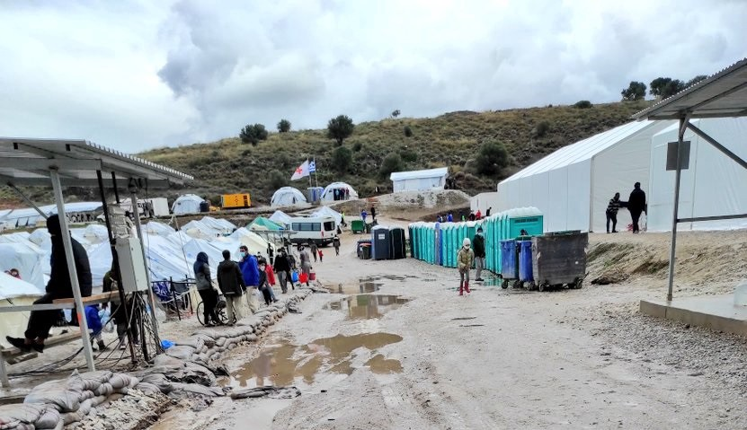

### AYS Daily Digest 22/1/21: 6\.5 Mil\. Euros for a fake NGO
### Syria: deteriorating security conditions at al\-Hol camp / Flooding in the Arsal refugee camp during strict COVID\-19 lockdown makes access to humanitarian aid difficult / refugees being threatened in Canary islands / Message from Napier barracks

[Are You Syrious?](?source=post_page-----419c308e3ae3--------------------------------)

[Jan 23](ays-daily-digest-22-1-21-6-5-mio-euros-for-a-fake-ngo-419c308e3ae3?source=post_page-----419c308e3ae3--------------------------------) · 8 min read

### FEATURED

**With 0 turnover and 497\.60 euros in cash in 2019, a virtually unknown NGO is expected to receive through its contract with the Greek state a total of at least € 6\.5 million over two years**

The Greek government awards contracts of millions to controversial NGOs, often bypassing the conditions that they themselves set\. We are Solomon [investigated](https://wearesolomon.com/mag/on-the-move-el/paixnidia-ekatomyrion-me-th-stagash-ton-prosfygon/?lang=el&fbclid=IwAR243mavzOfx5IUwHMHt1-joXqXqenXxJ4A7ecSmRuVYbjyRpiVWGZB7Kko) this case and found that it was precisely in the period during which the government commissioned the unknown NGO, without any previous experience in the refugee field, to house around 1,000 refugees and asylum seekers through the ESTIA II program, that the NGO came about at all\. Two people who appear to have had no presence in the humanitarian sector before creating an NGO claimed and won a multi\-million euro contract\.

> _What did Hopeland have then? The answer is just a Facebook page, which was created just a few days earlier, on October 13, and therefore had likes that could literally be counted on the fingers of one’s hand\._ 

At least another 196 NGOs have applied and are awaiting registration from the Government, either in the first or second stage of the process\. But of all the hundreds of refugee NGOs across Greece, the unknown Hopeland, which had no previous experience in the field, had priority registration, skipping more than 150 NGOs in the process\.

Citing irregularities from the Ministry’s side, [the investigation](https://wearesolomon.com/mag/on-the-move-el/paixnidia-ekatomyrion-me-th-stagash-ton-prosfygon/?lang=el&fbclid=IwAR243mavzOfx5IUwHMHt1-joXqXqenXxJ4A7ecSmRuVYbjyRpiVWGZB7Kko) concludes that Hopeland is expected to be allocated at least 5,394,517 euros in 2021 by the Ministry of Immigration and Asylum\.
### A wanted disaster?

Speaking to [NDR](https://daserste.ndr.de/panorama/archiv/2021/Fluechtlinge-auf-Lesbos-Die-gewollte-Not,lesbos130.html?fbclid=IwAR3S0-Q3ip157siSuPda-KSkcKkzAvzeg3vIdugHdT1CiYymsRap8xLkogE) about the horrible conditions in Greek camps such as Moria/Kara Tepe and funding from the EU, Gerald Knaus, the inventor of the EU\-Turkey deal said:

> _There is no lack of money\. Greece received more money from the EU than any other country for a relatively small number of refugees\. So, there is only one logical question: We have to assume, that this is wanted\. It is a strategic decision, to prevent other people from coming with pictures of people, who are suffering\. This is the current politics of the European Union\._ 

A thesis which is also backed by Greek officials\. Vice\-head of Nia Dimokratia, Adonis Georgiadis, said in March that people who want to come should see how bad the situation is\. But also other European countries do not do much to change the situation, as slow relocation programmes or long waiting times for family reunions show\.
### SYRIA

According to the UN facts and figures, 12 people have been murdered at the overcrowded al\-Hol camp for displaced people in northeastern Syria since the beginning of the year\. In the most recent critiques of the situation surrounding the overcrowded camp, the UN also said:

> _“The recent rise in violence among the camp population not only represents a tragic loss of life, it also jeopardises the ability for the UN and humanitarian partners to continue to safely deliver critical humanitarian assistance and services to residents”\. As one of the commeents on the recent IOM report from BiH said — the wellbeing of the professional well\-paid staff of the UN is really not everyone’s primary concern\. But, we do hope that the rhetoric brings about a change, at least to protect the UN and its partners\._ 

Temperatures in northwest Syria have dropped dramatically in recent weeks\. Still I Rise team reports: “On Wednesday, snow forced us to close Ma’an, our school in Al Dana\. School buses couldn’t get to the fields, it was too dangerous\.

The roads are collapsing\. Tents in the camps are flooded\. People are dying because of the cold\. Families do not have proper heating systems and cannot protect their children from frost\. Those who can send their children to relatives who live outside the camps, in better conditions\.”

There are growing concerns that many Syrians currently in Germany will face possible deportations back to war\-torn Syria\. However, even a temporary residence permit is not a cause for concern, ProAsyl explains:

> _As long as the protection status exists, the residence permit must also be extended, unless serious criminal offenses or similar preclude an extension\. Those affected do not have to fear that the immigration authorities will refuse them the extension of their temporary residence permit with reference to the lifted deportation freeze\._ 

Those who fall under the Dublin Regulation or have already received protection status in another EU country, e\.g\. in Bulgaria or Greece can only be deported to the corresponding EU country, not to Syria\. Read more [here](https://www.proasyl.de/news/kein-grund-zur-panik-zum-ende-des-abschiebungsstopps-nach-syrien/?fbclid=IwAR3SXoU901qJylsSSm9uPSTG6ILBq_QFyi0rn5E_aQI6tKN1eqb8YrVXArc) \.
### LEBANON

**Flooding in the Arsal refugee camp during strict COVID\-19 lockdown makes access to humanitarian aid difficult**
### LIBYA
### SEARCH AND RESCUE AT SEA

“This afternoon, an overcrowded rubber boat in distress was spotted from the bridge of the Ocean Viking\. The operation almost turned critical when two people went overboard\. They were recovered by the rescue team\. A total of approx\. 104 people were rescued as night set in,” SOS Mediteranee reported\.

At the same time, Seawatch Italy reports a pushback of about 80 people by the Libyan coastguard:
### SERBIA
### Pushbacks are illegal, court confirms

It is [reported](https://www.dw.com/en/serbia-court-confirms-illegal-pushbacks-into-the-eu/a-56312136?maca=en-Twitter-sharing&fbclid=IwAR1NnlC1SnGkRdcCmsjyHo85lDtmmxl2e9tcho1hb4hCdBvRqUOGDkFl7Qg) that Serbia’s top court has confirmed that Serbian security personnel had illegally deported asylum\-seekers from Serbia, instead of issuing proper paperwork and accommodating them in a shelter\. People were locked up in a police station in Gradina, a village near the Bulgarian border\. The rundown cell had neither running water, nor heating, nor a toilet\. And the migrants were not able to consult a lawyer\.
“Unfortunately, it is an open secret that pushbacks from Serbia are still happening, and so far nobody has been held accountable,” the lawyer who took the case to the court said\.
### SPAIN
### Kept away and threatened in an atmosphere that facilitates animosity

It is [reported](https://www.lamarea.com/2021/01/22/moros-morir-audios-cacerias-racistas-gran-canaria/?fbclid=IwAR2uxHDFucwy6Kr9fQ_760BiCM30ZktSMwLeO9jMvRO5NOFsexA0tL8hIwk) that people who have arrived on the Canary Islands as refugees are now being threatened and their lives are at risk\. The Red Cross has asked them to stay in hotels and to be cautious when leaving\. The man who had been arrested for threatening refugees with a machete is now free\. The doctor who treats people at the reception facilities denounced the fact that there were even minors living in extremely precarious conditions: scarce food and restricted showers\. The head of MdM in the Canary Islands says the current delicate situation is the result of poor reception management: _“Turning the Canary Islands into a blockade rather than a transit point, as it has always been and should be, facilitates this pressure”_
### DENMARK
### Country goal: zero people protected

The Danish Prime Minister Mette Frederiksen’s \(Soc Dem\) ambition is that exactly zero asylum seekers shall arrive in Denmark\.

She stated this on Friday in the Danish Parliament \(Folketinget\), where the Danish People’s Party’s Pia Kjærsgaard has called her for a debate\.

> _That is our goal\. Of course we can not give a promise about it\. We can not give a promise about zero asylum seekers, but we can set out the vision, namely that we want a new asylum system, and then do what we can to introduce it, says the Prime Minister\._ 

…The Prime Minister stated once more in the Parliament that the politicians of the past had made a serious mistake by making too few demands on the foreigners arriving in Denmark\. For example, that they must support themselves and adopt Danish values\.

She explains that the number is of enormous importance for Denmark and that the fabric of society is already under pressure from the number of arrivals\.
### WORTH READING
- how misery drove people into smuggling networks:

### [Western Sahara: A migrant smuggling hotspot](https://www.infomigrants.net/en/post/29818/western-sahara-a-migrant-smuggling-hotspot?fbclid=IwAR1gvp_8lzvWM992p73bJKX4xUSWIvbnPH5gmJdhgC1QMooL9IPK7nDCgA8)
### [The Western Sahara is known for its beaches and resorts; but amid a global pandemic, locals have been forced to seek…](https://www.infomigrants.net/en/post/29818/western-sahara-a-migrant-smuggling-hotspot?fbclid=IwAR1gvp_8lzvWM992p73bJKX4xUSWIvbnPH5gmJdhgC1QMooL9IPK7nDCgA8)
#### [www\.infomigrants\.net](https://www.infomigrants.net/en/post/29818/western-sahara-a-migrant-smuggling-hotspot?fbclid=IwAR1gvp_8lzvWM992p73bJKX4xUSWIvbnPH5gmJdhgC1QMooL9IPK7nDCgA8)
### [The New Pact on Migration and Asylum, for and by the European Union \(Part 2\)](https://en.solidarywheels.org/post/the-new-pact-on-migration-and-asylum-for-and-by-the-european-union-part-2?fbclid=IwAR3VM0KXFdHxiEXWzIcB5Gpqtd3lPV4XszGmzFvRnr5S37NNQB4tR1T0ECE)
### [In its proposal for a new pact, the European Commission places great emphasis on the importance of the external…\-](https://en.solidarywheels.org/post/the-new-pact-on-migration-and-asylum-for-and-by-the-european-union-part-2?fbclid=IwAR3VM0KXFdHxiEXWzIcB5Gpqtd3lPV4XszGmzFvRnr5S37NNQB4tR1T0ECE)
#### [en\.solidarywheels\.org](https://en.solidarywheels.org/post/the-new-pact-on-migration-and-asylum-for-and-by-the-european-union-part-2?fbclid=IwAR3VM0KXFdHxiEXWzIcB5Gpqtd3lPV4XszGmzFvRnr5S37NNQB4tR1T0ECE)
- IOM\-run camps in Bosnia: Structural violence is not an incident:

### [Log into Facebook](https://web.facebook.com/transbalkanskasolidarnost/posts/232191458397843?__cft__[0]=AZUzUpHJM4y404mrOeWv1v1WSAn_QQZxvS2QfryAMj9uxbyzrHT_yH_8LuP-mSY7GNB9-cC8xrEU_9if5tEybS70Qx_mInMEJRnREadK7LuyYH48XN_i20LRkcatvML5uqLFoU83BRP67LBTG0DYNHVz9wyt5aHgZq-jIKARJfKroCXahi9d0WL7lGbEsxttwa4&__tn__=R]-R)
### [Log into Facebook to start sharing and connecting with your friends, family, and people you know\.](https://web.facebook.com/transbalkanskasolidarnost/posts/232191458397843?__cft__[0]=AZUzUpHJM4y404mrOeWv1v1WSAn_QQZxvS2QfryAMj9uxbyzrHT_yH_8LuP-mSY7GNB9-cC8xrEU_9if5tEybS70Qx_mInMEJRnREadK7LuyYH48XN_i20LRkcatvML5uqLFoU83BRP67LBTG0DYNHVz9wyt5aHgZq-jIKARJfKroCXahi9d0WL7lGbEsxttwa4&__tn__=R]-R)
#### [web\.facebook\.com](https://web.facebook.com/transbalkanskasolidarnost/posts/232191458397843?__cft__[0]=AZUzUpHJM4y404mrOeWv1v1WSAn_QQZxvS2QfryAMj9uxbyzrHT_yH_8LuP-mSY7GNB9-cC8xrEU_9if5tEybS70Qx_mInMEJRnREadK7LuyYH48XN_i20LRkcatvML5uqLFoU83BRP67LBTG0DYNHVz9wyt5aHgZq-jIKARJfKroCXahi9d0WL7lGbEsxttwa4&__tn__=R]-R)
### UK

Choose Love published a message from a resident of the Napier barracks\. AYS has previously reported on the situation there\.

The British Refugee Council demands a new programme to relocate 10,000 people during the next five years\. “The global need for resettlement has never been greater,” says Andy Hewett, Head of Advocacy, reports [swlondoner](https://www.swlondoner.co.uk/life/20012021-in-limbo-government-silent-over-future-of-uk-refugee-resettlement/?fbclid=IwAR3OiPtZjfji3Keq0OrvuDM6QO9WPzDnyWoB2DMLsaATDUlBXfz3NV7ny5Y) \.

Less than half of voters in the UK want immigration to be reduced, a new survey shows\. According to the [Independent](https://www.independent.co.uk/news/uk/home-news/immigration-asylum-ipsos-home-office-b1790728.html?fbclid=IwAR20hgYQe3zc0Hm8_18YWzXuqClly39fpBs_kRC9kqoNm0xLGfo_Vq8cuOk) , sympathy for people trying to cross the channel is on the rise\.

**Worth reading:**
- When can an immigration decision involving human rights be appealed?

### [When can an immigration decision involving human rights be appealed? \| Free Movement](https://www.freemovement.org.uk/when-can-an-immigration-decision-involving-human-rights-be-appealed/?utm_source=rss&utm_medium=rss&utm_campaign=when-can-an-immigration-decision-involving-human-rights-be-appealed&fbclid=IwAR2wwDWdiKpAyPL5bkOXQ6oPms0852Z7grHeZKXGZJ6sVfd48kD1IoiAjGw)
### [The distinction between a “claim” and an “application” was at the heart of the Upper Tribunal’s recent decision in…](https://www.freemovement.org.uk/when-can-an-immigration-decision-involving-human-rights-be-appealed/?utm_source=rss&utm_medium=rss&utm_campaign=when-can-an-immigration-decision-involving-human-rights-be-appealed&fbclid=IwAR2wwDWdiKpAyPL5bkOXQ6oPms0852Z7grHeZKXGZJ6sVfd48kD1IoiAjGw)
#### [www\.freemovement\.org\.uk](https://www.freemovement.org.uk/when-can-an-immigration-decision-involving-human-rights-be-appealed/?utm_source=rss&utm_medium=rss&utm_campaign=when-can-an-immigration-decision-involving-human-rights-be-appealed&fbclid=IwAR2wwDWdiKpAyPL5bkOXQ6oPms0852Z7grHeZKXGZJ6sVfd48kD1IoiAjGw)
### EU

The [Management Board of Frontex](https://frontex.europa.eu/media-centre/management-board-updates/conclusions-of-the-management-board-s-meeting-on-20-21-january-2021-on-the-preliminary-report-of-its-working-group-on-fundamental-rights-and-legal-operational-aspects-of-operations-in-the-aegean-sea-GnFaIc?fbclid=IwAR1d-1L1fsGWkzfZAuvuxFWzPJ56ktPdErxC2vM5_qO9f3XW9R7l0qZUNKg) shows big concerns over reports of pushbacks in the Aegean and the agency’s role there\. “The Management Board takes note that five out of 13 incidents that have been examined still require further inquiry by the Working Group and additional clarifications,” the board concludes\. On eight incidents no evidence of violation of fundamental rights was found\. Still:

> _The Management Board is very concerned that the Agency missed to provide information on [three incidents](https://www.euronews.com/2021/01/22/frontex-eu-border-agency-chief-told-to-immediately-handover-details-on-3-migrant-pushback-?fbclid=IwAR1HidKHUNR_Tsgkr2kKlJBO9gGzC0n6_ofuRUyKvpS4Qfglva8wYUyV1yc) identified by the Working Group in time, so that the Working Group could not yet draw any conclusions with a view to certain cases\._ 

They urge the executive director to immediately provide the missing information and to implement the recommendations made by the board\.

**Further Reading:**

**Frontex’s growing pains**
### [Frontex’s growing pains](https://www.politico.eu/article/frontex-growing-pains-europe-migration-border-coast-guards-hiring-chaos/?fbclid=IwAR0RcTkIYKQURT3jSASopfFeWAgt_h-YYDqqJORFPdce9IGviDX0rpN2TAc)
### [Press play to listen to this article When V\.L\. received an offer to join the European Union’s newly created corps of…](https://www.politico.eu/article/frontex-growing-pains-europe-migration-border-coast-guards-hiring-chaos/?fbclid=IwAR0RcTkIYKQURT3jSASopfFeWAgt_h-YYDqqJORFPdce9IGviDX0rpN2TAc)
#### [www\.politico\.eu](https://www.politico.eu/article/frontex-growing-pains-europe-migration-border-coast-guards-hiring-chaos/?fbclid=IwAR0RcTkIYKQURT3jSASopfFeWAgt_h-YYDqqJORFPdce9IGviDX0rpN2TAc)

**Worth Reading:**

— Reforming the EU asylum policy: unilateralism, ‘coalitions of the willing’, and the new pact on migration and asylum
### [Reforming the EU asylum policy: unilateralism, ‘coalitions of the willing’, and the new pact on…](https://www.maastrichtuniversity.nl/blog/2021/01/reforming-eu-asylum-policy-unilateralism-%E2%80%98coalitions-willing%E2%80%99-and-new-pact-migration?fbclid=IwAR2S8XCKxsz86wHmCEejX40jRlIZ3mF0k6ho1cMgOFE0ng2c_qRHhVT1CUk)
### [EU support measures, such as EU funding, are limited\. EU agencies have come to the forefront; their financial resources…](https://www.maastrichtuniversity.nl/blog/2021/01/reforming-eu-asylum-policy-unilateralism-%E2%80%98coalitions-willing%E2%80%99-and-new-pact-migration?fbclid=IwAR2S8XCKxsz86wHmCEejX40jRlIZ3mF0k6ho1cMgOFE0ng2c_qRHhVT1CUk)
#### [www\.maastrichtuniversity\.nl](https://www.maastrichtuniversity.nl/blog/2021/01/reforming-eu-asylum-policy-unilateralism-%E2%80%98coalitions-willing%E2%80%99-and-new-pact-migration?fbclid=IwAR2S8XCKxsz86wHmCEejX40jRlIZ3mF0k6ho1cMgOFE0ng2c_qRHhVT1CUk)

**Find daily updates and special reports on our [Medium page](https://medium.com/are-you-syrious) \.**

**If you wish to contribute, either by writing a report or a story, or by joining the info gathering team, please let us know\.**

**We strive to echo correct news from the ground through collaboration and fairness\. Every effort has been made to credit organisations and individuals with regard to the supply of information, video, and photo material \(in cases where the source wanted to be accredited\) \. Please notify us regarding corrections\.**

**If there’s anything you want to share or comment, contact us through Facebook, Twitter or write to: areyousyrious@gmail\.com**

_Converted [Medium Post](https://medium.com/are-you-syrious/ays-daily-digest-22-1-21-6-5-mil-euros-for-a-fake-ngo-3b7218f2a05d) by [ZMediumToMarkdown](https://github.com/ZhgChgLi/ZMediumToMarkdown)._
