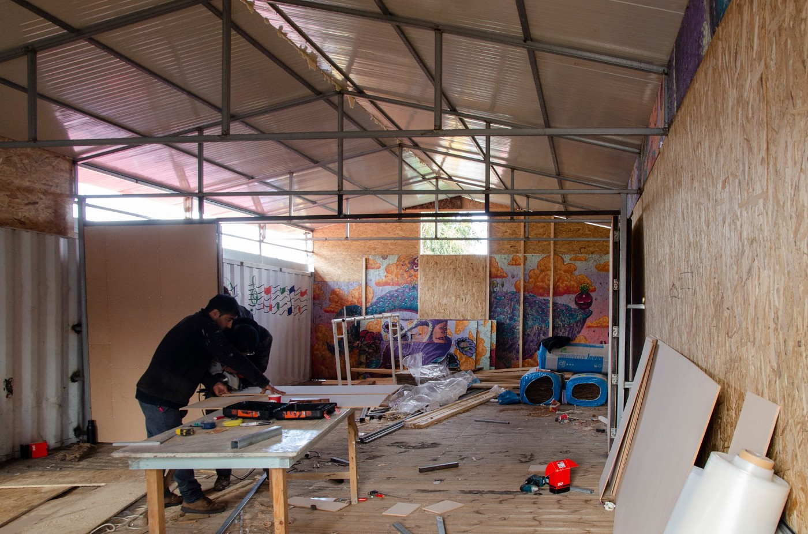
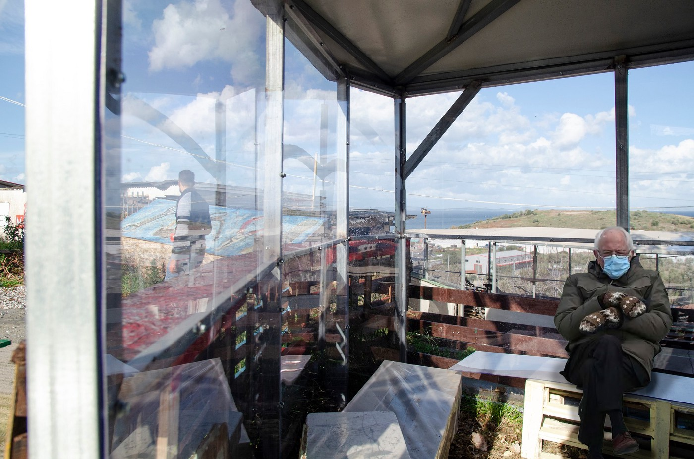
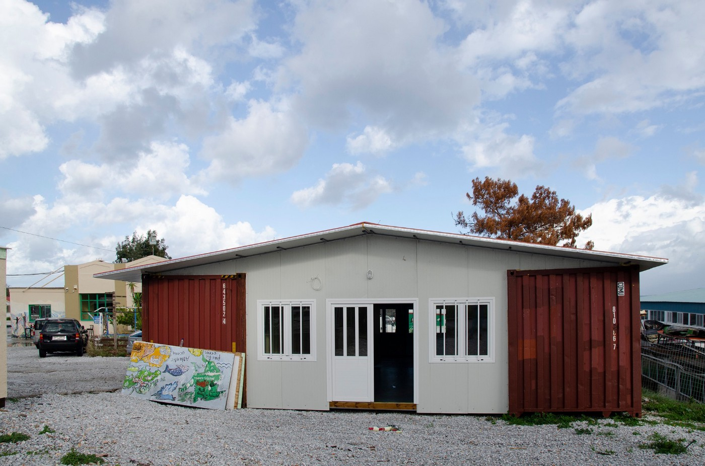
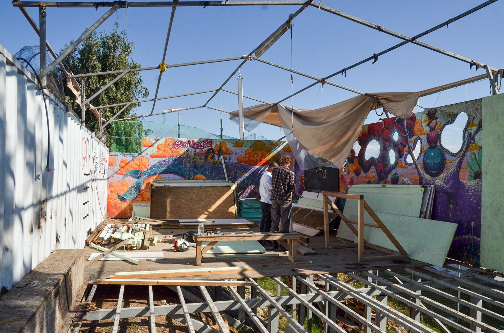
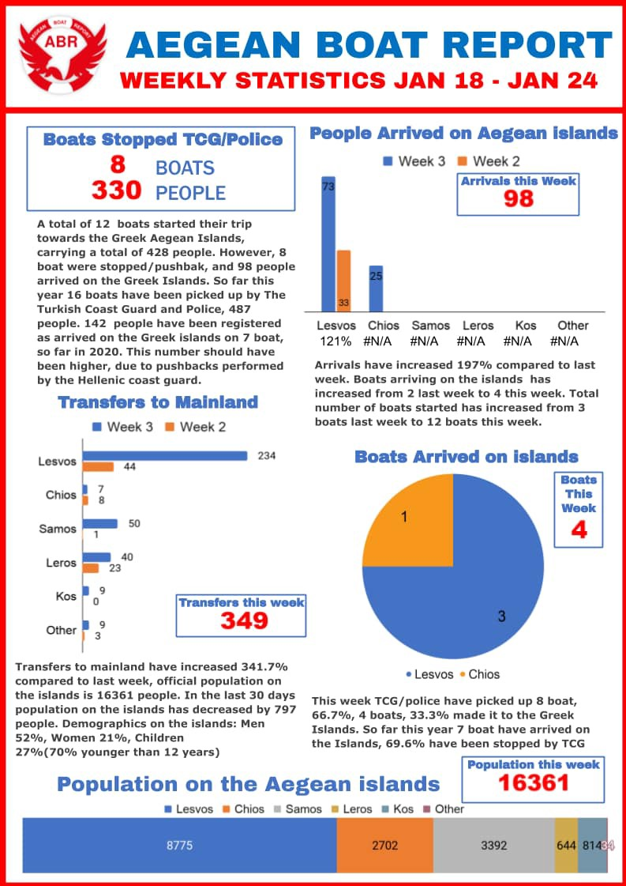
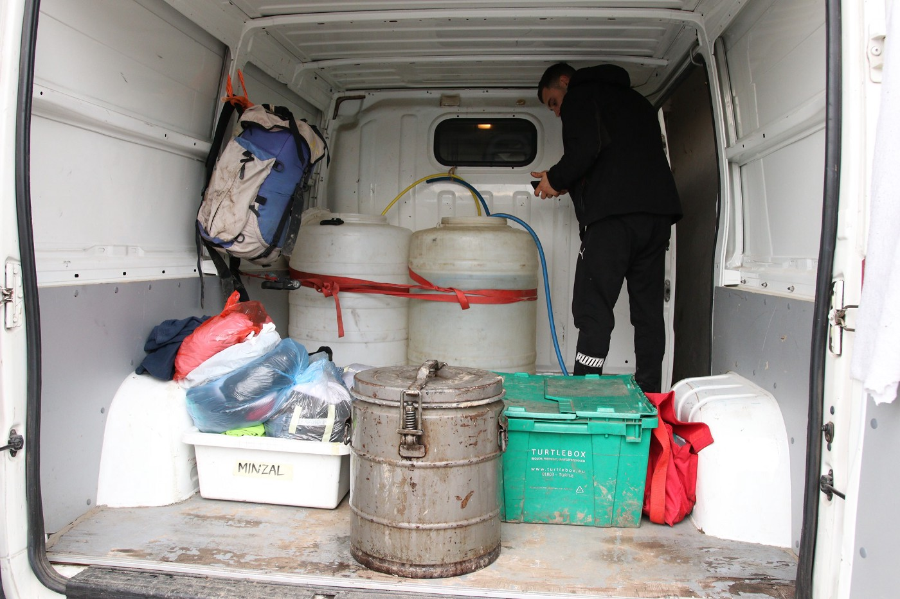

### AYS Daily Digest 25/01/21 Ocean Viking rescues 373 people to Sicily

_More on lead pollution in Moria 2\.0 // Protests in Austria // Evidence collecting about Home Office in UK // Frozen bodies found in Croatia // & more…_

](assets/2c4a8ceeb38e/1*2mkANA2IvOrOGM14fhAx9w.jpeg)

The Ocean Viking\. Photo by [Julia Schaefermeyer / SOS MEDITERRANEE](https://www.facebook.com/SOSMEDITERRANEE/photos/a.827341250706518/3676171882490093/)
### FEATURE: Quite an eventful week on the Mediterranean → Updates from Ocean Viking, AlarmPhone & more…

**Ocean Viking updates:**
- Arriving off Augusta on Monday morning with [373 survivors](https://www.facebook.com/SOSMEDITERRANEE/posts/3676172282490053) \. Over the span of [48 hours](https://www.infomigrants.net/en/post/29852/373-migrants-disembark-from-ocean-viking-in-sicily?fbclid=IwAR3pJJaUHm-zYihUEriMLOZy9De4AdbaorDFykkCgp0nDzw8JTPfnS8XSiA) , they were rescued from three different boats\. Everyone, including the crew, tested negative for COVID\.
- [Luisa Albera](https://twitter.com/SOSMedIntl/status/1353617591340818432) , OceanViking’s Search & Rescue Coordinator, said: “ _After weeks of bad weather, conditions off the Libyan coast improved earlier this week, which led to numerous departures of people trying to flee across the central Mediterranean on unseaworthy, overcrowded boats\. Reports of shipwrecks and interceptions by the Libyan Coast Guard came in as the team on **the Ocean Viking, the only civil rescue ship at sea this week** , was engaged in intense search and rescue operations\. EU member states must find a sustainable solution for a swift and predictable disembarkation mechanism, supporting European coastal states and working to uphold maritime law at our common southern shores\._ ”

**Arrivals in [Lampedusa](https://www.facebook.com/watchthemed.alarmphone/posts/2871667773107447) :**
- “The rubber boat with 45 people on board that escaped Libya two days ago arrived almost autonomously in Lampedusa last night, after a difficult journey\. We are glad they are safe\! Now they should not be imprisoned in a quarantine ship but be in a safe place on land\!”
- The merchant ship [Asso Trenta](https://twitter.com/AngiKappa/status/1353634936616587264) landed on Monday with 70 people

**Shipwreck off [Libya](https://www.facebook.com/watchthemed.alarmphone/posts/2871668416440716) :** “Relatives confirm that the 17 people who died at sea yesterday were on a boat that Alarm Phone was in contact with\. 82 people on the same boat were found alive but forced back to Libya where they are unsafe & detained after surviving a terrible shipwreck\.”

[**Missing people**](https://www.facebook.com/watchthemed.alarmphone/posts/2871729569767934) **:** “Three days ago a fisherman reported a boat in distress 30nm off Khoms, Libya, with 55 people\. Unfortunately the people never reached out to AlarmPhone, but we informed authorities & requested a search\. We don’t know what happened to them but we fear the worst\.”

[**Sea\-Watch**](https://www.facebook.com/seawatchprojekt/posts/2747801695437894) **on the events of last week:** “The past week has shown once again how indispensable civil sea resue ships are — and how deadly their blockade is\.”
- **“There were about 1000 people on 14 boats in distress** , two of them were shipwrecked with at least 60 people drowned, the 92 survivors of both shipwrecks and more than 300 other people were illegally pulled back to Libya — partly witnessed by our reconnaissance aircraft Moonbird — or had to return on their own\.”
- [IOM](https://twitter.com/IOM_Libya/status/1353703617577054210) says that “the more than 300 people” was actually 452 people who were brought back to Libya from the 19th\-25th of January\.
- Concerning [the Moonbird](https://twitter.com/FleetCivil/status/1353659194193403905) witnessing one pushback of 48 people back to Libya, they also spotted a Frontex plane on the scene\. Frontex spokesperson Chris Borowski later said: _“Osprey 1 had spotted the boat in distress and immediately alerted all the relevant rescue centres, in line with international law\.”_

#### CYPRUS
### 1000\+ people protest conditions in the “Pournara” reception centre

Outside Nicosia, the people living in the Pournara reception centre are banned from leaving the “prison\-like” place\. “The refugee reception centre, which was set up to cover 72 hours of accommodation, was turned into a closed centre last May following a series of decrees issued by the Interior Ministry invoking the coronavirus pandemic\.” Learn more [here](https://www.dw.com/el/%CE%BA%CF%8D%CF%80%CF%81%CE%BF%CF%82-%CE%B4%CE%B9%CE%B1%CE%BC%CE%B1%CF%81%CF%84%CF%85%CF%81%CE%AF%CE%B5%CF%82-%CF%80%CF%81%CE%BF%CF%83%CF%86%CF%8D%CE%B3%CF%89%CE%BD-%CE%B3%CE%B9%CE%B1-%CF%83%CF%85%CE%BD%CE%B8%CE%AE%CE%BA%CE%B5%CF%82-%CE%B5%CE%B3%CE%BA%CE%BB%CE%B5%CE%B9%CF%83%CE%BC%CE%BF%CF%8D/a-56329462?fbclid=IwAR2w2NeLx-kCt6jHca_BiYII1e4s-xoJ7ZAlGV8CZ3qwlLgBPdaSU2SEyj4) \.
#### GREECE

](assets/2c4a8ceeb38e/1*NPS7I2lkMOUPaivHtIbzTg.jpeg)

All the recent rain…terrible conditions\. Photo of Kara Tepe by [EPT](https://voreioaigaio.ert.gr/eidiseis/lesvos/me-ti-vrochi-kai-ti-laspi-antimetopoi-alli-mia-mera-oi-prosfyges-ston-kara-tepe/?fbclid=IwAR3YEW7qzGSatvX636FgLUc4RMagQXyxD7MCuFbTxNddrDLNs4Kh8rzBqmM)
### Updates on Kara Tepe \(Moria 2\.0\)

**Weather:** Essentially, Kara Tepe never “dries” in the winter, as even a little rain causes the ground to be muddy\. [Greek news](https://voreioaigaio.ert.gr/eidiseis/lesvos/me-ti-vrochi-kai-ti-laspi-antimetopoi-alli-mia-mera-oi-prosfyges-ston-kara-tepe/?fbclid=IwAR3YEW7qzGSatvX636FgLUc4RMagQXyxD7MCuFbTxNddrDLNs4Kh8rzBqmM) elaborates:

> “Refugees have been given pallets to seal their tents, but that is not enough\. Everywhere common areas are filled with water, their belongings get wet, and without electricity and heating in most tents, people’s struggle to dry their belongings, seal their tents and provide some warmth is daily\. According to the latest census, conducted last week, there are 6,600 asylum seekers in the structure\. During the week, 250 people moved to structures on the mainland\. However, there is a gap of 300 people, some of them probably moved to their compatriots in apartments to protect themselves from the cold\.” 

**COVID\-19:** The people who were quarantining because they came into contact with the 36 who tested positive ended their quarantine [on Monday](https://voreioaigaio.ert.gr/eidiseis/lesvos/me-ti-vrochi-kai-ti-laspi-antimetopoi-alli-mia-mera-oi-prosfyges-ston-kara-tepe/?fbclid=IwAR3YEW7qzGSatvX636FgLUc4RMagQXyxD7MCuFbTxNddrDLNs4Kh8rzBqmM) \.

**Lead pollution in the soil:** Dunya Collective posted a very informative thread on Monday discussing “ _The government makes a statement and now everything seems to be under control\. But where exactly were the samples taken? We demand transparency and access to the study\. Backgrounds and open questions here in the thread\._ ” They provide some excellent pictures on the different areas of the former army shooting range and what they were used for vs where people are living in the camp now\.

Dunya Collective points out that the bottom line is: [**This study needs to be made public\.**](https://migration.gov.gr/kato-apo-ta-diethni-oria-ta-epipeda-molyvdoy-sto-mavrovouni/) **Transparency is required to help everyone’s safety in the camp, for those living there and those working there\.**

IOM actually withdrew their employees from the site two weeks ago\. Dunya Collective said “To the best of our knowledge, the IOM employees were not given any reasons\.” Is this due to the lead exposure risk? If it is unsafe for people to work in Kara Tepe, it is certainly unsafe for people to live there\.

![“We are happy to inform you about the latest spatial developments at the Community Centre\. We have used the last few months in full lockdown to expand rooms, patch things up and create new rooms\. “
“Due to the Covid Pandemic rules, we unfortunately need separate rooms to accommodate more people\. But of course this is not the only reason\. Several separate rooms allow our partners, especially the school, to create a more concentrated learning atmosphere, which gives people a break from their chaotic everyday life in the camp\. Two classrooms were built by moving two shipping containers parallel but apart, and building a roof over them\. The resulting space was floored and a movable wall was installed in the middle\. Then the rooms were painted bright and will soon be used mainly as classrooms for the International School of Peace\. 
Across from these classrooms, we are still repairing and extending the school’s former backyard\. This was the only part of the school that survived the fire\. Now the floor, roof and walls have been renewed and will soon be used as classrooms and a relaxation area during opening hours\. Furthermore, we have covered the lounge under the tree and the Makerspace with plexiglass, so that one can stay there despite rain and wind\. In addition, movable walls are being built in the main hall these days, which will give the students in the cybercafe more privacy and can also be flexibly converted into classrooms\. “
“We are looking forward to seeing all the new spaces full of life soon\. We are thrilled with the quick and effective work of our volunteers Fisher, Max and Mohammed as well as the team of craftsmen of Michalis under the constant coordination of our coordinator Akis\. Thank you so much, you are amazing\!” Update and photos \(including classic meme which made this AYS editor laugh\) by [**One Happy Family — Community Center, Lesvos**](https://www.facebook.com/OHFLesvos)](assets/2c4a8ceeb38e/1*oCuwI1tT4lbzfpXmejwwmg.jpeg)

“We are happy to inform you about the latest spatial developments at the Community Centre\. We have used the last few months in full lockdown to expand rooms, patch things up and create new rooms\. “
“Due to the Covid Pandemic rules, we unfortunately need separate rooms to accommodate more people\. But of course this is not the only reason\. Several separate rooms allow our partners, especially the school, to create a more concentrated learning atmosphere, which gives people a break from their chaotic everyday life in the camp\. Two classrooms were built by moving two shipping containers parallel but apart, and building a roof over them\. The resulting space was floored and a movable wall was installed in the middle\. Then the rooms were painted bright and will soon be used mainly as classrooms for the International School of Peace\. 
Across from these classrooms, we are still repairing and extending the school’s former backyard\. This was the only part of the school that survived the fire\. Now the floor, roof and walls have been renewed and will soon be used as classrooms and a relaxation area during opening hours\. Furthermore, we have covered the lounge under the tree and the Makerspace with plexiglass, so that one can stay there despite rain and wind\. In addition, movable walls are being built in the main hall these days, which will give the students in the cybercafe more privacy and can also be flexibly converted into classrooms\. “
“We are looking forward to seeing all the new spaces full of life soon\. We are thrilled with the quick and effective work of our volunteers Fisher, Max and Mohammed as well as the team of craftsmen of Michalis under the constant coordination of our coordinator Akis\. Thank you so much, you are amazing\!” Update and photos \(including classic meme which made this AYS editor laugh\) by [**One Happy Family — Community Center, Lesvos**](https://www.facebook.com/OHFLesvos)

Journalist [Keira Dignan](https://twitter.com/DignanKeira/status/1353696299665776641) reported some concerning news on individual freedoms in the camps:

> “Hearing more reports today of refugees living in camps having their phones and other photo\-recording equipment smashed and broken to prevent information from spreading\. 

> On top of this, it seems that authorities on the Greek islands have already begun to use the new gagging law to variously exclude different collectives and NGOs from entering the camps \(even to provide absolute essentials to those trapped without them\) \.” 

In [Migration Ministry news](https://www.facebook.com/migrationgovgr.info/posts/1851636548323775) : “By joint decision of the Minister for Migration & Asylum, and the Alternate Minister of Foreign Affairs: **Pakistan and Bangladesh were added to the official list of safe countries of origin\.** Ghana, Senegal, Togo, Gambia, Morocco, Algeria, Tunisia, Albania, Georgia, Ukraine, India and Armenia maintain their status as safe countries of origin\.”

■■■■■■■■■■■■■■ 
> **[Vassilis Tsarnas](https://twitter.com/VassilisTsarnas) @ Twitter Says:** 

> > 17 new cases of #RefugeesGr applying against #Greece, concerning their living conditions in the hotspots of #Samos, #Lesvos, #Kos &amp; #Chios, were puplished today by the European Court of #HumanRights
#ECHR
▶️[hudoc.echr.coe.int/eng?i=001-2078…](http://hudoc.echr.coe.int/eng?i=001-207821)
▶️[hudoc.echr.coe.int/eng?i=001-2078…](http://hudoc.echr.coe.int/eng?i=001-207823) 

> **Tweeted at [2021-01-25 19:50:48](https://twitter.com/VassilisTsarnas/status/1353792457704677378).** 

■■■■■■■■■■■■■■ 

#### SPAIN

[AlarmPhone](https://www.facebook.com/watchthemed.alarmphone/posts/2871967466410811) reported that “51 people ‘on the move’ were arrested at \#LasPalmas Airport, Lanzarote & detained when trying to fly to the Spanish mainland\. This violates the right to move freely & Art\. 139\.2 of the Spanish constitution\. We stand in solidarity with them & demand that Spain respects their rights\!”
#### CROATIA
### Two frozen bodies found on Papuk

They were found during the snow\-clearing project and are suspected to be migrants\. There is a half a meter of snow on Papuk at a few spots and there is an investigation/continued search underway for the large area\. More [here](https://www.index.hr/vijesti/clanak/u-snijegu-na-papuku-pronadjena-dva-smrznuta-tijela/2249483.aspx) \.

In new reporting by Radnicka Prava, civil society is saying that the government is using the pandemic as an excuse to withhold information about asylum seekers and their asylum process\. Recent data is hard to find, especially on new arrivals and how many people have been deported\. Also, it is increasingly harder for asylum seekers to find work\. Read in full [here\.](https://radnickaprava.org/tekstovi/clanci/svakodnevica-azilanata-predrasude-bez-posla-predrasude-na-poslu?fbclid=IwAR19pLQYuOiu6ikJO9cqIvR3jqLceRjztcQow00BKxPyFxytYeEG7Rgk5ng)
#### SERBIA

![**Update from Sid** : “Several people in Sid had been unable to shower or have access to any basic hygiene services for two weeks\. No Name Kitchen has been unable to bring them a number of basic items and clean water since a certain part of the local population, who are acting against the organization, stole the van’s license plate, which is vital for us to carry out all daily tasks\. For months the people on the move have been living in inhumane conditions in the middle of nowhere\. And, with a new vehicle this week, we have been able to bring them water, soap and razors so that they can have a minimum of hygiene\.
We also took the opportunity to start some treatments against scabies, as many of them have infected wounds as a result of constant scratching\. We changed the blankets and sleeping bags for clean ones and impregnated them with Permethrin, an insecticide used as a treatment and repellent against scabies or mosquitoes\.
We have not been able to treat everyone, as it is a complex treatment and we do not have new blankets for everyone, but those who were in a worse state are very happy to have been able to get some relief from the itching caused by scabies\. We also took the opportunity to spend an afternoon playing soccer and drinking chai, something we had not been able to do for a long time\.” 
Text and photos Anna Lofi for [No Name Kitchen](https://www.facebook.com/NoNameKitchenBelgrade/posts/1169447503453532)](assets/2c4a8ceeb38e/1*FhPYw4acZuR7tuzVSYad6A.jpeg)

**Update from Sid** : “Several people in Sid had been unable to shower or have access to any basic hygiene services for two weeks\. No Name Kitchen has been unable to bring them a number of basic items and clean water since a certain part of the local population, who are acting against the organization, stole the van’s license plate, which is vital for us to carry out all daily tasks\. For months the people on the move have been living in inhumane conditions in the middle of nowhere\. And, with a new vehicle this week, we have been able to bring them water, soap and razors so that they can have a minimum of hygiene\.
We also took the opportunity to start some treatments against scabies, as many of them have infected wounds as a result of constant scratching\. We changed the blankets and sleeping bags for clean ones and impregnated them with Permethrin, an insecticide used as a treatment and repellent against scabies or mosquitoes\.
We have not been able to treat everyone, as it is a complex treatment and we do not have new blankets for everyone, but those who were in a worse state are very happy to have been able to get some relief from the itching caused by scabies\. We also took the opportunity to spend an afternoon playing soccer and drinking chai, something we had not been able to do for a long time\.” 
Text and photos Anna Lofi for [No Name Kitchen](https://www.facebook.com/NoNameKitchenBelgrade/posts/1169447503453532)
#### AUSTRIA

](assets/2c4a8ceeb38e/1*t0z_Mbj-hzsP3UTrcUySBQ.jpeg)

Tent camps went up in the state capitals on Saturday in solidarity with Moria 2\.0\. They are in silent protest to the Austrian government’s refugee policy/ “Representatives of a Moria Personnel Committee once again demanded that 100 unaccompanied minor refugees be admitted\.” More [here\.](https://www.derstandard.at/story/2000123606935/zeltlager-als-zeichen-der-solidaritaet-mit-moria)
#### GERMANY

 , photo by Daniel Bockwoldt/dpa/picture alliance](assets/2c4a8ceeb38e/1*YsIsGSFsK09pPaVjpLo7Zg.jpeg)

“A 27\-year\-old man has died in a fire \(started at 6pm on sunday\) in an asylum seeker center in the northern German city of Hamburg\. Police said the man was of Afghan origin\.” Info by [InfoMigrants](https://www.infomigrants.net/en/post/29848/germany-afghan-dies-in-asylum-center-fire?fbclid=IwAR3hNe1MObUf--RtY-oiE0ScmMyytiWWr-l40BimabIRqHdTtGDkHL9UX1Y) , photo by Daniel Bockwoldt/dpa/picture alliance
#### UK
### “Teenage asylum seeker in UK wins legal battle over ‘unlawful’ age assessment”

In new Guardian reporting “ _A Sudanese teenager who sought asylum in the UK as an unaccompanied child when he was 15 but was judged by the authorities to be 20 has won a legal battle against the council which was found to have “unlawfully” assessed his age\. The boy, who is now 17 and cannot be identified for legal reasons, fled his village in western Darfur aged 11 having become separated from his parents during attacks by the Janjaweed Arab militia, and travelled to Libya, where he was forced to work in slavery on a farm\._ ” Learn more [here](https://www.theguardian.com/uk-news/2021/jan/25/teenage-asylum-seeker-in-uk-wins-legal-battle-over-unlawful-age-assessment?fbclid=IwAR1gFLsRHgyNRpH35ELBxb9k3Nq8NqK4f3dyuwdHQu5JieRu00X-Qn3cPLM) \.
### “Rise in extremist activity” around Penally

In reporting by Nation\.cymru “ _There has been a “rise in extremist activity” around the Penally asylum camp according to a council report\. Pembrokeshire Council, which says it is still requesting “full cost recovery” from UK government for the camp, is in discussions with UK National Counter Extremist Networks to address its impact on the county\. A report from director of communities Dr Steven Jones says that there are 124 men on the site, and adds that all transfers to and from Penally had been halted under coronavirus alert four restrictions, unless it was for medical or safeguarding reasons_ \.” Learn more [here](https://nation.cymru/news/rise-of-extremist-activity-around-penally-asylum-seeker-camp/?fbclid=IwAR269NxGoGB1kJKOyOuDvo303TPMdRsPrabGNXKo1dbmWqBMZlAMn5gzDhM) \.

![Looking for volunteers in Wakefield, Bradford, and Leeds\! 
Are you passionate about supporting refugees, with a few hours to spare each week? We’d love to hear from you\. We are looking for dedicated volunteers to support refugees in West Yorkshire\. Every day, we are contacted by more newly arrived asylum seekers in the UK who need food, clothing and help accessing medical help and legal support\. They are housed in temporary accommodation in and around West Yorkshire, and many of them have arrived with little more than the clothes they are wearing\. In this situation, alone and struggling to adapt to life in an unfamiliar environment, they are in need of warm clothes and support\. Our volunteers in the U\.K\. reach out to asylum seekers in their area on a daily basis, collecting and distributing donations, running leisure activities, teaching English and signposting to relevant services\. They provide a friendly face and reliable listening ear to some of those who need it most, helping those who have recently arrived get to know their new local area\. You can volunteer during the week, or on the weekend — whatever suits you and your schedule best\. We have lots of resources for our volunteers — everything you need to know can be found at [our website](https://care4calais.org/get-involved/supporting-refugees-in-the-uk/?fbclid=iwar24wrtt4nuot-nbwo6klj5x_rk4qgqruapefv9c4fncgjyoyutwu1yjdcq) \.” Photo and Info by [Care 4 Calais](https://www.facebook.com/care4calais/posts/4016368445062749)](assets/2c4a8ceeb38e/1*2WyJuT0h0dGE-Bssx-9v6w.jpeg)

Looking for volunteers in Wakefield, Bradford, and Leeds\! 
Are you passionate about supporting refugees, with a few hours to spare each week? We’d love to hear from you\. We are looking for dedicated volunteers to support refugees in West Yorkshire\. Every day, we are contacted by more newly arrived asylum seekers in the UK who need food, clothing and help accessing medical help and legal support\. They are housed in temporary accommodation in and around West Yorkshire, and many of them have arrived with little more than the clothes they are wearing\. In this situation, alone and struggling to adapt to life in an unfamiliar environment, they are in need of warm clothes and support\. Our volunteers in the U\.K\. reach out to asylum seekers in their area on a daily basis, collecting and distributing donations, running leisure activities, teaching English and signposting to relevant services\. They provide a friendly face and reliable listening ear to some of those who need it most, helping those who have recently arrived get to know their new local area\. You can volunteer during the week, or on the weekend — whatever suits you and your schedule best\. We have lots of resources for our volunteers — everything you need to know can be found at [our website](https://care4calais.org/get-involved/supporting-refugees-in-the-uk/?fbclid=iwar24wrtt4nuot-nbwo6klj5x_rk4qgqruapefv9c4fncgjyoyutwu1yjdcq) \.” Photo and Info by [Care 4 Calais](https://www.facebook.com/care4calais/posts/4016368445062749)
### ICIBI inspecting Home Office’s use of hotels and barracks as contingency asylum accommodation

[The Independent Chief Inspector of Borders and Immigration \(ICIBI\)](https://www.gov.uk/government/news/call-for-evidence-an-inspection-of-the-use-of-hotels-and-barracks-as-contingency-asylum-accommodation?fbclid=IwAR1odSGEqiZx9gtzcDkC-JsL0D9tThhjSVsTzKMmeFfsUd_BJ1wk19695iM) is “inviting anyone with relevant knowledge or experience to submit their evidence to [chiefinspector@icibi\.gov\.uk](mailto:chiefinspector@icibi.gov.uk?subject=Contingency%20Asylum%20Accommodation%20submission.&body=%0D%0A%0D%0A%20I%20consent%20to%20the%20Independent%20Chief%20Inspector%20of%20Borders%20and%20Immigration%20retaining%20and%20processing%20the%20information%20and%20data%20in%20this%20email.) \. The call for evidence will remain open for four weeks \(until 19 February 2021\) \.”

_“This inspection will examine the use made of hotels and other forms of contingency asylum accommodation, including Penally Camp and Napier Barracks, since the beginning of 2020\. It will focus on the roles and responsibilities of the Home Office and the accommodation service providers, and of other parties, in relation to the use of contingency asylum accommodation, including:_
- _communication between the Home Office and the accommodation service providers, and with other stakeholders \(for example, local authorities, health services, NGOs who provide support to asylum seekers\), regarding the need for contingency asylum accommodation in particular areas_
- _the process\(es\) for identifying potential contingency asylum accommodation and for testing and deciding about the suitability of specific sites, including with regard to COVID\-19 safety_
- _decisions about individual asylum seekers and their needs in terms of accommodation and other support, including information sharing, record keeping, oversight and review, particularly with regard to vulnerabilities and risks_
- _communication between the Home Office and/or the accommodation service providers and individuals \(“service users”\) regarding their asylum accommodation, including any changes to that accommodation_
- _the strategy for reducing the requirement for contingency asylum accommodation in the short\- to medium\-term \(to the end of 2021–22\) and longer\-term \(through to the end of the current Asylum Accommodation and Support Contracts\)”_

**Find daily updates and special reports on our [Medium page](https://medium.com/are-you-syrious) \.**

**If you wish to contribute, either by writing a report or a story, or by joining the info gathering team, please let us know\.**

**We strive to echo correct news from the ground through collaboration and fairness\. Every effort has been made to credit organisations and individuals with regard to the supply of information, video, and photo material \(in cases where the source wanted to be accredited\) \. Please notify us regarding corrections\.**

**If there’s anything you want to share or comment, contact us through Facebook, Twitter or write to: areyousyrious@gmail\.com**

_Converted [Medium Post](https://medium.com/are-you-syrious/ays-daily-digest-25-01-21-ocean-viking-rescues-373-people-to-sicily-2c4a8ceeb38e) by [ZMediumToMarkdown](https://github.com/ZhgChgLi/ZMediumToMarkdown)._
