### Refugees
### AYS Daily Digest 25/01/21 Ocean Viking rescues 373 people to Sicily

[Are You Syrious?](?source=post_page-----2c4a8ceeb38e--------------------------------)

[Jan 26](ays-daily-digest-25-01-21-ocean-viking-rescues-373-people-to-sicily-2c4a8ceeb38e?source=post_page-----2c4a8ceeb38e--------------------------------) · 9 min read

_More on lead pollution in Moria 2\.0 // Protests in Austria // Evidence collecting about Home Office in UK // Frozen bodies found in Croatia // & more…_

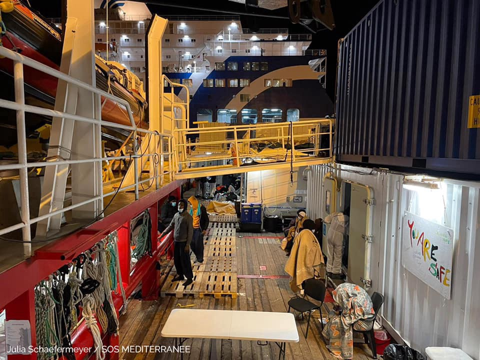

### FEATURE: Quite an eventful week on the Mediterranean → Updates from Ocean Viking, AlarmPhone & more…

**Ocean Viking updates:**
- Arriving off Augusta on Monday morning with [373 survivors](https://www.facebook.com/SOSMEDITERRANEE/posts/3676172282490053) \. Over the span of [48 hours](https://www.infomigrants.net/en/post/29852/373-migrants-disembark-from-ocean-viking-in-sicily?fbclid=IwAR3pJJaUHm-zYihUEriMLOZy9De4AdbaorDFykkCgp0nDzw8JTPfnS8XSiA) , they were rescued from three different boats\. Everyone, including the crew, tested negative for COVID\.
- [Luisa Albera](https://twitter.com/SOSMedIntl/status/1353617591340818432) , OceanViking’s Search & Rescue Coordinator, said: “ _After weeks of bad weather, conditions off the Libyan coast improved earlier this week, which led to numerous departures of people trying to flee across the central Mediterranean on unseaworthy, overcrowded boats\. Reports of shipwrecks and interceptions by the Libyan Coast Guard came in as the team on **the Ocean Viking, the only civil rescue ship at sea this week** , was engaged in intense search and rescue operations\. EU member states must find a sustainable solution for a swift and predictable disembarkation mechanism, supporting European coastal states and working to uphold maritime law at our common southern shores\._ ”

**Arrivals in [Lampedusa](https://www.facebook.com/watchthemed.alarmphone/posts/2871667773107447) :**
- “The rubber boat with 45 people on board that escaped Libya two days ago arrived almost autonomously in Lampedusa last night, after a difficult journey\. We are glad they are safe\! Now they should not be imprisoned in a quarantine ship but be in a safe place on land\!”
- The merchant ship [Asso Trenta](https://twitter.com/AngiKappa/status/1353634936616587264) landed on Monday with 70 people

**Shipwreck off [Libya](https://www.facebook.com/watchthemed.alarmphone/posts/2871668416440716) :** “Relatives confirm that the 17 people who died at sea yesterday were on a boat that Alarm Phone was in contact with\. 82 people on the same boat were found alive but forced back to Libya where they are unsafe & detained after surviving a terrible shipwreck\.”

[**Missing people**](https://www.facebook.com/watchthemed.alarmphone/posts/2871729569767934) **:** “Three days ago a fisherman reported a boat in distress 30nm off Khoms, Libya, with 55 people\. Unfortunately the people never reached out to AlarmPhone, but we informed authorities & requested a search\. We don’t know what happened to them but we fear the worst\.”

[**Sea\-Watch**](https://www.facebook.com/seawatchprojekt/posts/2747801695437894) **on the events of last week:** “The past week has shown once again how indispensable civil sea resue ships are — and how deadly their blockade is\.”
- **“There were about 1000 people on 14 boats in distress** , two of them were shipwrecked with at least 60 people drowned, the 92 survivors of both shipwrecks and more than 300 other people were illegally pulled back to Libya — partly witnessed by our reconnaissance aircraft Moonbird — or had to return on their own\.”
- [IOM](https://twitter.com/IOM_Libya/status/1353703617577054210) says that “the more than 300 people” was actually 452 people who were brought back to Libya from the 19th\-25th of January\.
- Concerning [the Moonbird](https://twitter.com/FleetCivil/status/1353659194193403905) witnessing one pushback of 48 people back to Libya, they also spotted a Frontex plane on the scene\. Frontex spokesperson Chris Borowski later said: _“Osprey 1 had spotted the boat in distress and immediately alerted all the relevant rescue centres, in line with international law\.”_

### CYPRUS
### 1000\+ people protest conditions in the “Pournara” reception centre

Outside Nicosia, the people living in the Pournara reception centre are banned from leaving the “prison\-like” place\. “The refugee reception centre, which was set up to cover 72 hours of accommodation, was turned into a closed centre last May following a series of decrees issued by the Interior Ministry invoking the coronavirus pandemic\.” Learn more [here](https://www.dw.com/el/%CE%BA%CF%8D%CF%80%CF%81%CE%BF%CF%82-%CE%B4%CE%B9%CE%B1%CE%BC%CE%B1%CF%81%CF%84%CF%85%CF%81%CE%AF%CE%B5%CF%82-%CF%80%CF%81%CE%BF%CF%83%CF%86%CF%8D%CE%B3%CF%89%CE%BD-%CE%B3%CE%B9%CE%B1-%CF%83%CF%85%CE%BD%CE%B8%CE%AE%CE%BA%CE%B5%CF%82-%CE%B5%CE%B3%CE%BA%CE%BB%CE%B5%CE%B9%CF%83%CE%BC%CE%BF%CF%8D/a-56329462?fbclid=IwAR2w2NeLx-kCt6jHca_BiYII1e4s-xoJ7ZAlGV8CZ3qwlLgBPdaSU2SEyj4) \.
### GREECE

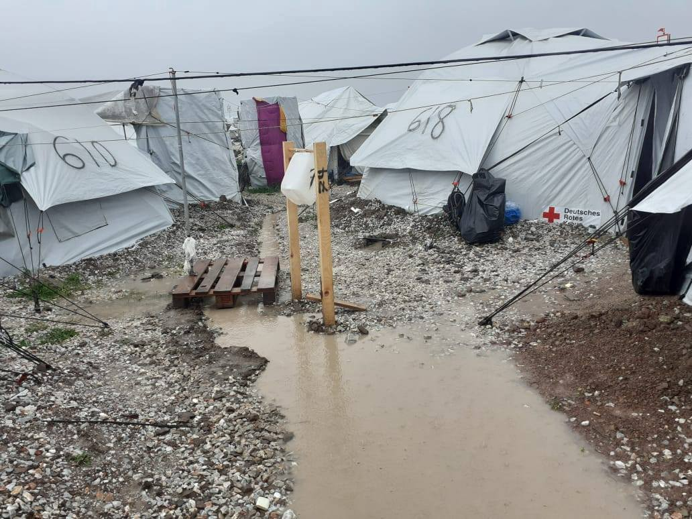

### Updates on Kara Tepe \(Moria 2\.0\)

**Weather:** Essentially, Kara Tepe never “dries” in the winter, as even a little rain causes the ground to be muddy\. [Greek news](https://voreioaigaio.ert.gr/eidiseis/lesvos/me-ti-vrochi-kai-ti-laspi-antimetopoi-alli-mia-mera-oi-prosfyges-ston-kara-tepe/?fbclid=IwAR3YEW7qzGSatvX636FgLUc4RMagQXyxD7MCuFbTxNddrDLNs4Kh8rzBqmM) elaborates:

> _“Refugees have been given pallets to seal their tents, but that is not enough\. Everywhere common areas are filled with water, their belongings get wet, and without electricity and heating in most tents, people’s struggle to dry their belongings, seal their tents and provide some warmth is daily\. According to the latest census, conducted last week, there are 6,600 asylum seekers in the structure\. During the week, 250 people moved to structures on the mainland\. However, there is a gap of 300 people, some of them probably moved to their compatriots in apartments to protect themselves from the cold\.”_ 

**COVID\-19:** The people who were quarantining because they came into contact with the 36 who tested positive ended their quarantine [on Monday](https://voreioaigaio.ert.gr/eidiseis/lesvos/me-ti-vrochi-kai-ti-laspi-antimetopoi-alli-mia-mera-oi-prosfyges-ston-kara-tepe/?fbclid=IwAR3YEW7qzGSatvX636FgLUc4RMagQXyxD7MCuFbTxNddrDLNs4Kh8rzBqmM) \.

**Lead pollution in the soil:** Dunya Collective posted a very informative thread on Monday discussing “ _The government makes a statement and now everything seems to be under control\. But where exactly were the samples taken? We demand transparency and access to the study\. Backgrounds and open questions here in the thread\._ ” They provide some excellent pictures on the different areas of the former army shooting range and what they were used for vs where people are living in the camp now\.

Dunya Collective points out that the bottom line is: [**This study needs to be made public\.**](https://migration.gov.gr/kato-apo-ta-diethni-oria-ta-epipeda-molyvdoy-sto-mavrovouni/) **Transparency is required to help everyone’s safety in the camp, for those living there and those working there\.**

IOM actually withdrew their employees from the site two weeks ago\. Dunya Collective said “To the best of our knowledge, the IOM employees were not given any reasons\.” Is this due to the lead exposure risk? If it is unsafe for people to work in Kara Tepe, it is certainly unsafe for people to live there\.

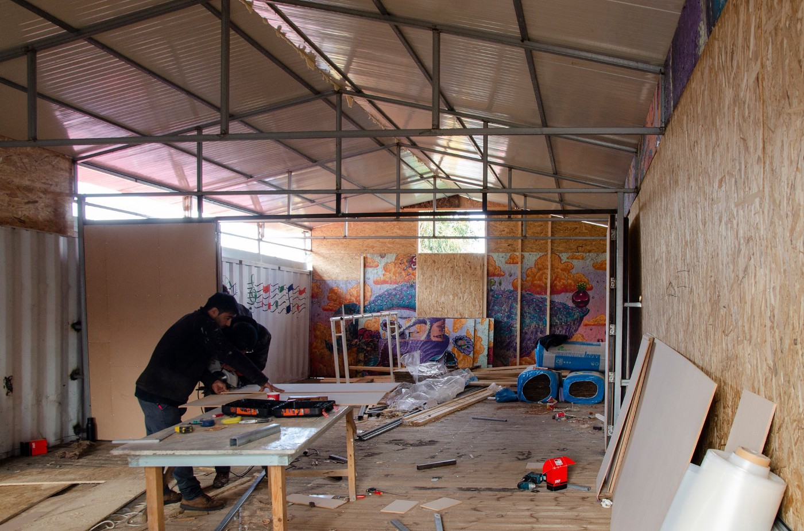

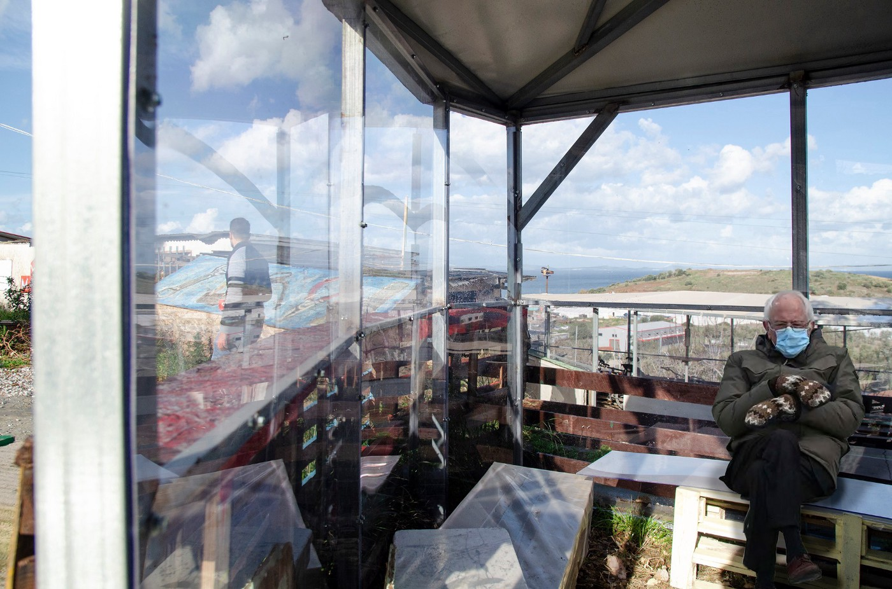

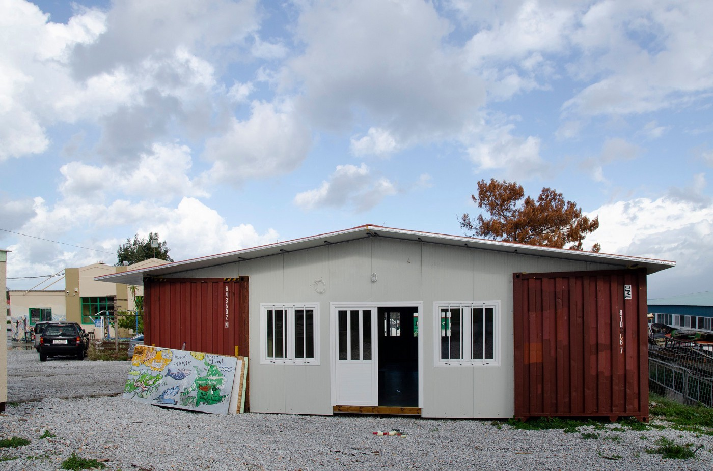

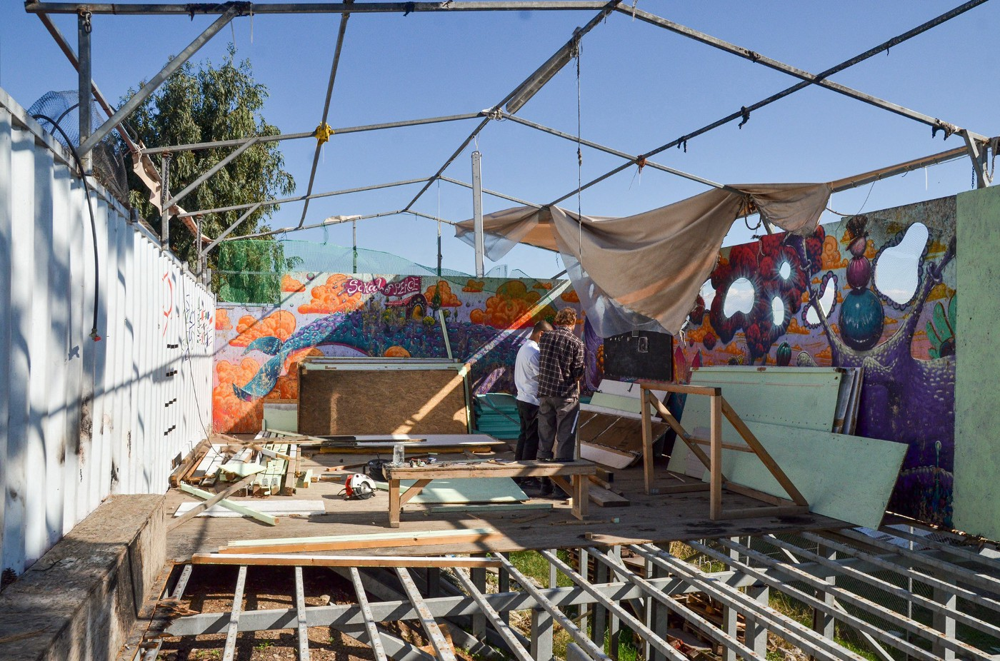

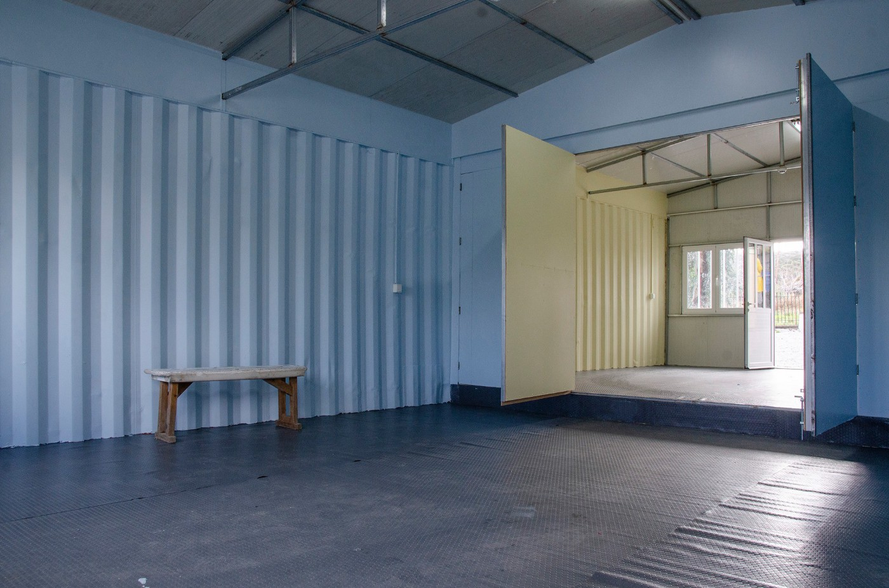

Journalist [Keira Dignan](https://twitter.com/DignanKeira/status/1353696299665776641) reported some concerning news on individual freedoms in the camps:

> _“Hearing more reports today of refugees living in camps having their phones and other photo\-recording equipment smashed and broken to prevent information from spreading\._ 

> _On top of this, it seems that authorities on the Greek islands have already begun to use the new gagging law to variously exclude different collectives and NGOs from entering the camps \(even to provide absolute essentials to those trapped without them\) \.”_ 

In [Migration Ministry news](https://www.facebook.com/migrationgovgr.info/posts/1851636548323775) : “By joint decision of the Minister for Migration & Asylum, and the Alternate Minister of Foreign Affairs: **Pakistan and Bangladesh were added to the official list of safe countries of origin\.** Ghana, Senegal, Togo, Gambia, Morocco, Algeria, Tunisia, Albania, Georgia, Ukraine, India and Armenia maintain their status as safe countries of origin\.”

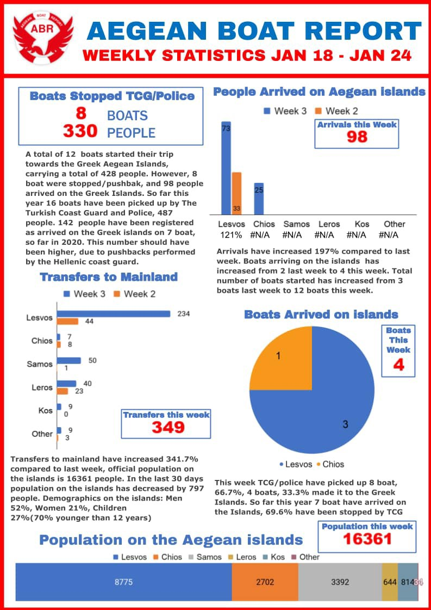

SPAIN

[AlarmPhone](https://www.facebook.com/watchthemed.alarmphone/posts/2871967466410811) reported that “51 people ‘on the move’ were arrested at \#LasPalmas Airport, Lanzarote & detained when trying to fly to the Spanish mainland\. This violates the right to move freely & Art\. 139\.2 of the Spanish constitution\. We stand in solidarity with them & demand that Spain respects their rights\!”

CROATIA

Two frozen bodies found on Papuk

They were found during the snow\-clearing project and are suspected to be migrants\. There is a half a meter of snow on Papuk at a few spots and there is an investigation/continued search underway for the large area\. More [here](https://www.index.hr/vijesti/clanak/u-snijegu-na-papuku-pronadjena-dva-smrznuta-tijela/2249483.aspx) \.

In new reporting by Radnicka Prava, civil society is saying that the government is using the pandemic as an excuse to withhold information about asylum seekers and their asylum process\. Recent data is hard to find, especially on new arrivals and how many people have been deported\. Also, it is increasingly harder for asylum seekers to find work\. Read in full [here\.](https://radnickaprava.org/tekstovi/clanci/svakodnevica-azilanata-predrasude-bez-posla-predrasude-na-poslu?fbclid=IwAR19pLQYuOiu6ikJO9cqIvR3jqLceRjztcQow00BKxPyFxytYeEG7Rgk5ng)

SERBIA

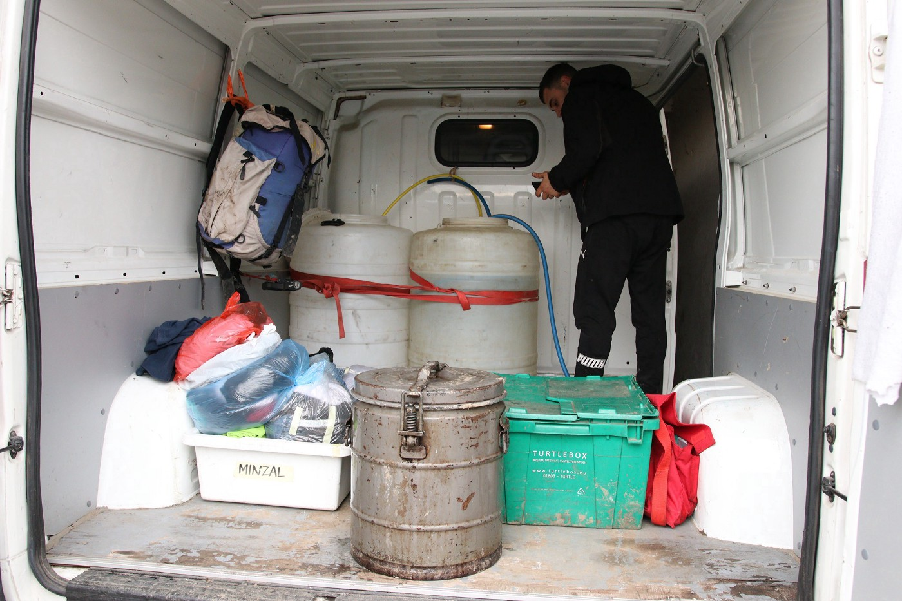

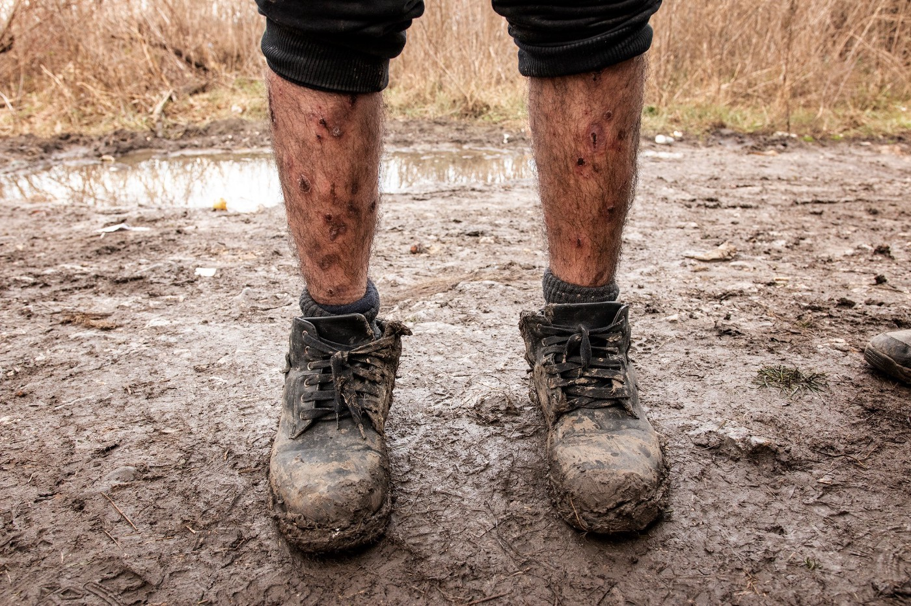

AUSTRIA

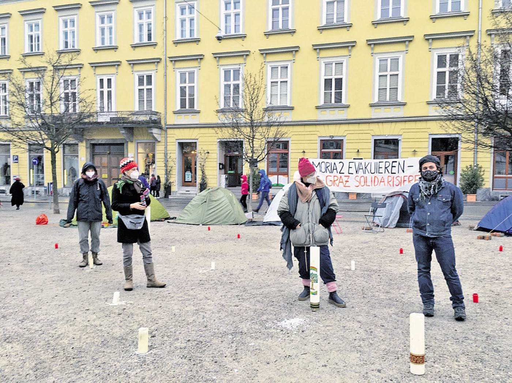

GERMANY

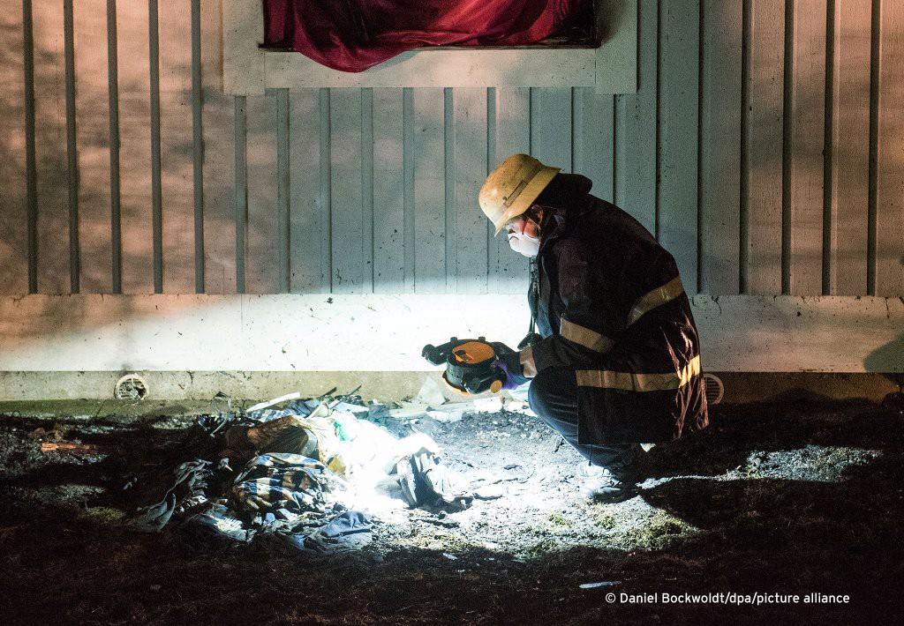

UK

“Teenage asylum seeker in UK wins legal battle over ‘unlawful’ age assessment”

In new Guardian reporting “ _A Sudanese teenager who sought asylum in the UK as an unaccompanied child when he was 15 but was judged by the authorities to be 20 has won a legal battle against the council which was found to have “unlawfully” assessed his age\. The boy, who is now 17 and cannot be identified for legal reasons, fled his village in western Darfur aged 11 having become separated from his parents during attacks by the Janjaweed Arab militia, and travelled to Libya, where he was forced to work in slavery on a farm\._ ” Learn more [here](https://www.theguardian.com/uk-news/2021/jan/25/teenage-asylum-seeker-in-uk-wins-legal-battle-over-unlawful-age-assessment?fbclid=IwAR1gFLsRHgyNRpH35ELBxb9k3Nq8NqK4f3dyuwdHQu5JieRu00X-Qn3cPLM) \.

“Rise in extremist activity” around Penally

In reporting by Nation\.cymru “ _There has been a “rise in extremist activity” around the Penally asylum camp according to a council report\. Pembrokeshire Council, which says it is still requesting “full cost recovery” from UK government for the camp, is in discussions with UK National Counter Extremist Networks to address its impact on the county\. A report from director of communities Dr Steven Jones says that there are 124 men on the site, and adds that all transfers to and from Penally had been halted under coronavirus alert four restrictions, unless it was for medical or safeguarding reasons_ \.” Learn more [here](https://nation.cymru/news/rise-of-extremist-activity-around-penally-asylum-seeker-camp/?fbclid=IwAR269NxGoGB1kJKOyOuDvo303TPMdRsPrabGNXKo1dbmWqBMZlAMn5gzDhM) \.

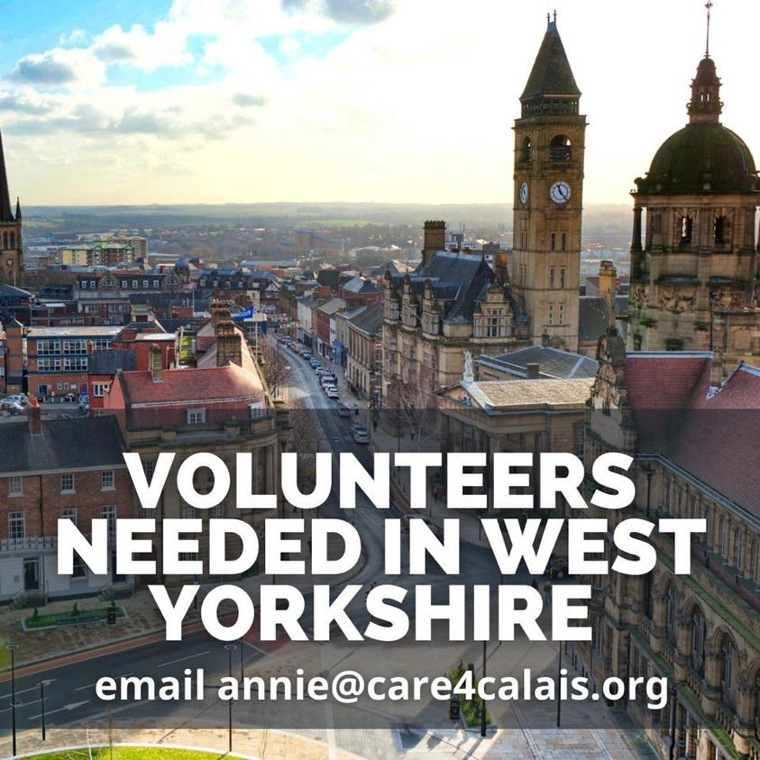

ICIBI inspecting Home Office’s use of hotels and barracks as contingency asylum accommodation

[The Independent Chief Inspector of Borders and Immigration \(ICIBI\)](https://www.gov.uk/government/news/call-for-evidence-an-inspection-of-the-use-of-hotels-and-barracks-as-contingency-asylum-accommodation?fbclid=IwAR1odSGEqiZx9gtzcDkC-JsL0D9tThhjSVsTzKMmeFfsUd_BJ1wk19695iM) is “inviting anyone with relevant knowledge or experience to submit their evidence to [chiefinspector@icibi\.gov\.uk](mailto:chiefinspector@icibi.gov.uk?subject=Contingency%20Asylum%20Accommodation%20submission.&body=%0D%0A%0D%0A%20I%20consent%20to%20the%20Independent%20Chief%20Inspector%20of%20Borders%20and%20Immigration%20retaining%20and%20processing%20the%20information%20and%20data%20in%20this%20email.) \. The call for evidence will remain open for four weeks \(until 19 February 2021\) \.”

_“This inspection will examine the use made of hotels and other forms of contingency asylum accommodation, including Penally Camp and Napier Barracks, since the beginning of 2020\. It will focus on the roles and responsibilities of the Home Office and the accommodation service providers, and of other parties, in relation to the use of contingency asylum accommodation, including:_
- _communication between the Home Office and the accommodation service providers, and with other stakeholders \(for example, local authorities, health services, NGOs who provide support to asylum seekers\), regarding the need for contingency asylum accommodation in particular areas_
- _the process\(es\) for identifying potential contingency asylum accommodation and for testing and deciding about the suitability of specific sites, including with regard to COVID\-19 safety_
- _decisions about individual asylum seekers and their needs in terms of accommodation and other support, including information sharing, record keeping, oversight and review, particularly with regard to vulnerabilities and risks_
- _communication between the Home Office and/or the accommodation service providers and individuals \(“service users”\) regarding their asylum accommodation, including any changes to that accommodation_
- _the strategy for reducing the requirement for contingency asylum accommodation in the short\- to medium\-term \(to the end of 2021–22\) and longer\-term \(through to the end of the current Asylum Accommodation and Support Contracts\)”_

**Find daily updates and special reports on our [Medium page](https://medium.com/are-you-syrious) \.**

**If you wish to contribute, either by writing a report or a story, or by joining the info gathering team, please let us know\.**

**We strive to echo correct news from the ground through collaboration and fairness\. Every effort has been made to credit organisations and individuals with regard to the supply of information, video, and photo material \(in cases where the source wanted to be accredited\) \. Please notify us regarding corrections\.**

**If there’s anything you want to share or comment, contact us through Facebook, Twitter or write to: areyousyrious@gmail\.com**

_Converted [Medium Post](https://medium.com/are-you-syrious/ays-daily-digest-25-01-21-ocean-viking-rescues-373-people-to-sicily-b5df62f8415b) by [ZMediumToMarkdown](https://github.com/ZhgChgLi/ZMediumToMarkdown)._
