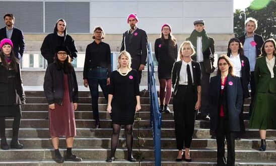
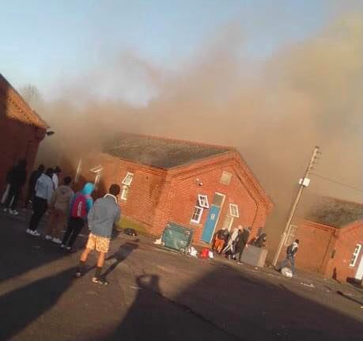
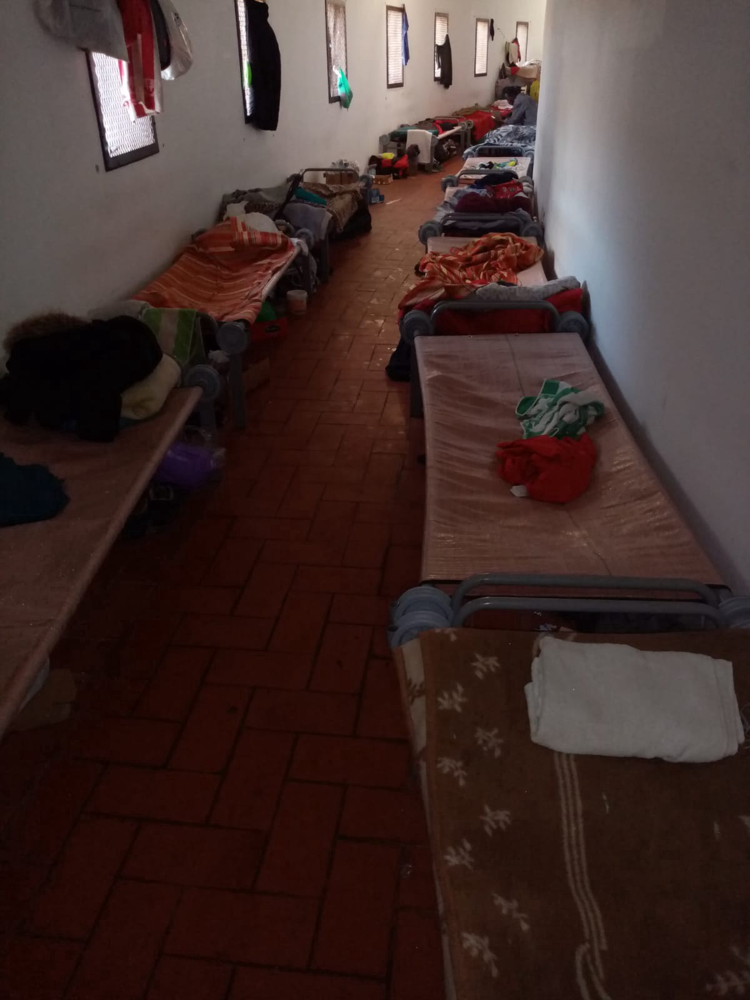

### AYS Daily Digest 29/01/2021 — “Stansted 15” Activists win appeal against terrorist accusation
### // Fire breaks out in the military barracks in Folkestone \(Kent\) //The European Parliament set to investigate Frontex’s involvement in illegal pushbacks // Protests in Austria over unlawful deportation of minors //

[Are You Syrious?](?source=post_page-----2de0b1314740--------------------------------)

[Jan 30](ays-daily-digest-29-01-2021-stansted-15-activists-win-appeal-against-terrorist-accusation-2de0b1314740?source=post_page-----2de0b1314740--------------------------------) · 11 min read
### UK

### Stansted 15 win appeal

A High Court in the UK has [overturned the previous sentencing](https://www.amnesty.org.uk/press-releases/uk-stansted-15-appeal-verdict-good-day-justice?utm_source=twitter&utm_medium=social&utm_campaign=online_activism&utm_content=sms_action%2Csm_action&fbclid=IwAR3HcBvI3eLXdMzd4CbdbG4kA2F2Fu1vKLeFSfaa1610eKScAkeqE2W5YEU) of 15 activists who peacefully attempted to prevent the deportation of 60 people at Stansted Airport in 2017\. The appeal of the so\-called “Stansted 15” has been upheld, challenging their initial convictions made under terrorism laws\.

The “Stansted 15” were tried in relation to their non\-violent attempt to prevent the deportation of 60 people on a charter flight bound for Ghana and Nigeria at Stansted Airport in 2017\. Of the 60 individuals due to have been deported, at least four have since been granted permission to remain in the UK, with others still pursuing their claims\.

This is a great victory not only for the 15 activists who saw themselves unjustly accused and sentenced under terrorist \( \! \) laws, but for all of those people who continue fighting unlawful and risky deportations\.

It is worth re\-sharing [here](https://www.theguardian.com/commentisfree/2018/dec/10/stansted-15-protesters-deportation?fbclid=IwAR02WCWyN5GO2dJ5wh-3yTKzg-XIq96yCrGVHFHNEruQaLjs_ESiKWlDrUU) the contribution of one of those people whose deportation was stopped by the “Stansted 15”\.
### Fire at Folkestone

A fire has broken out and fire engines have been called to [Napier Barracks in Folkestone](https://www.facebook.com/care4calais/posts/4028721447160782) following an upsetting afternoon for the residents\. They each received an impersonal letter from Clearspings, the accommodation provider, saying they would be split into new ‘bubbles’ and would need to self\-isolate for a further ten days\. Following last week’s transfers, many had thought they had a chance of leaving the camp\. The letter was a great disappointment\.

There is an ongoing investigation as to whether the fire was started deliberately, but the local authorities’ response was one of display of force and aggressiveness, as riot police was sent to the scene\.

A s [pokesman for the Kent Refugee Action Network](https://www.kentonline.co.uk/folkestone/news/huge-fire-at-barracks-housing-asylum-seekers-241620/?fbclid=IwAR2u6vpzvchv2EpyKsccgsAMr_kOak87oErY1lbV3QFCyQEBzT9kf-dxt6c) said:

> _“We don’t yet know exactly what has happened but what we do know is the barracks are unsafe with many cases of Covid being confirmed, and positive cases sharing dorms with those who had tested negative\._ 

> _“Those inside were at risk and becoming more and more desperate at the lack of action\._ 

A journalist was [arrested after sharing images of the protest outside Napier Barracks](https://twitter.com/maybulman/status/1355256563674603522) \. Andy Aitchison was charged with criminal damage after taking and sharing images of activists demonstrating against conditions at the controversial camp\.

The UK Home Secretary, Priti Patel, issued a very controversial and inflammatory statement, accusing the residents of the barracks of being “disrespectful towards taxpayers’ money”\. Bella Sankey, director of “Detention Action”, [commented that Pate](https://twitter.com/BellaSankey/status/1355226231017512965) l is

> _playing with fire making sweeping accusations against tens of people who’ve fled torture and sexual abuse to be imprisoned by \[her\] in a COVID hotbed\._ 

This is not the first time that Patel has made this kind of outrageous and divisive allegation, showing quite clearly where the UK government stands on human rights \(or lack thereof\) \. Shameful\.

No better evidence of this attitude than what was documented by a journalist in Belfast\. Five years after a group of Syrian refugees were provided with “temporary” accommodation in Londonderry, the majority of the families remain in homes t [hey say are cramped](https://www.belfasttelegraph.co.uk/news/northern-ireland/syrian-refugees-living-for-five-years-in-damp-mouldy-derry-homes-40024225.html?fbclid=IwAR3L6OW4Qx1Ea2v2GiOfd1LZTjbXa9jyDp68AH31nvZaFg5gaLzc8bOLvHw) , riddled with damp, mould and totally unsuitable\.

Speaking of the “taxpayer’s money” so dear to the current government, the company responsible for running Cardiff’s controversial asylum centre Lynx House [paid one of its executives £960,000 last year](https://www.walesonline.co.uk/news/wales-news/chairman-company-runs-controversial-asylum-10864420?fbclid=IwAR0UjQ2shGKUHHmSSUjYPtL0QX61oyOKY82Vrp2jHZOE2ITjF_0T2A1RBGo) — despite losing more than 100 staff jobs during the same period\. Lynx House has recently been subject to widespread criticism for the conditions refugees are being forced to live in\.
### GREECE

[Dangerous situation in the refugee camp on Samos](https://apps.derstandard.de/privacywall/story/2000123700949/gefaehrliche-lage-im-fluechtlingslager-auf-samos?fbclid=IwAR3UD0_shujnhZYXm1Il61d2-J_A4SFgldQNqeA4Snywq7SHYGN6VYhPHAo)

The situation in the Vathy camp is at least as miserable and dangerous as it used to be in the Moria camp on Lesbos, which burned down in September\.

There is a similar worrying situation in the Vial Camp, on Chios, where similar dismal conditions are visible in this [video](https://www.facebook.com/ruhi.akhtar.7/posts/4249286885088187) \. We also share this r [eport from Vial Hot Spot](https://www.facebook.com/ruhi.akhtar.7/posts/4248207965196079) :

> _As we try to continue our distribution of sleeping bags and thermal socks snow falls in Chios\. Thousands of people, some of the most vulnerable of Vial Camp are frozen again\. People tell us of a sleepless cold night\._ 

[Aegean Boat Report](https://www.facebook.com/AegeanBoatReport/posts/1019543518568752) signalled that a boat carrying 22 people, 10 children, four women and eight men, landed at Chapel, Lesvos north around 18\.00 on Friday 29th\. People fled immediately to the woods, scared to be discovered by the police and illegally deported back to Turkey\. There are subzero temperatures in the area, and many of the new arrivals were soaking wet from the waist down, many of them children\. They were at risk of freezing to death had they remained outdoors in the night\. They later registered in Megala Therma quarantine camp\.

A [shocking report](https://twitter.com/Refugees_Gr/status/1355267749380050946) has come from the detention centre in Paranesti, Drama\. Immigrants reported that police raided the centre and beat them with batons after they held a protest because after 18 months of detention, it was announced that they would not be released\.

The conservative Greek government has been putting in place detention centres since it came into power in 2019\. These mass detentions without case\-by\-case assessment are prohibited by law\. Equal Rights Across Borders [notes that](https://www.facebook.com/EqualRightsBB/posts/3695153920600372)

> _The Greek Minister of Migration, Notis Mitarachi, who also represents Chios as a member of parliament, has now promised the construction of the ‘closed center’ on Chios: ‘In an area that does not affect the life of our island’\. That means: invisible and far away\. According to Mitarachi ‘it will be mandatory to stay inside and only inside for all asylum seekers’\._ 

As already reported in Thursday’s digest, the [Greek police are about to introduce real\-time facial recognition](https://twitter.com/lk2015r/status/1355237132617576449?fbclid=IwAR3HcBvI3eLXdMzd4CbdbG4kA2F2Fu1vKLeFSfaa1610eKScAkeqE2W5YEU) as part of the EU\-funded “Smart Policing” project\. What is known about the project and how compatible is it with personal data protection laws? The face scanner system will also be connected to databases such as SIS, Eurodac and Dublinet, so there are clear implications for digital borders\.

Here is a [video](https://www.youtube.com/watch?v=5xSX0N58rJg&feature=youtu.be&fbclid=IwAR3WIDyFts2YbMkndEsI8BMzafB8UUeEi4WcoE_jXbqj_L2Ig3n-Eo057R8&ab_channel=EUDebates%7Ceudebates.tv) of a recent debate at the EU Parliament Civil Liberties Committee on the current situation on the Greek Islands with Beate GMINDER, Deputy Director\-General in charge of the “Task Force Migration Management” \(DG Migration and Home Affairs\) and Spyros\-Vlad OIKONOMOU, Greek Council for Refugees\.
### We conclude with some good news from Greece

The [Greek government agreed to pay a compensation](https://www.rlc-berlin.org/post/press-release-greek-government-agrees-to-pay-compensation-for-inhumane-living-conditions?fbclid=IwAR3IJaHjuzShTxLeqRBlyRwQLwOoOjfkXbv07gXr_75qOEzPHV7YsuzStUI) of 5,000€ for inhuman and degrading living conditions to H\.A\., a pregnant asylum seeker living in the so\-called jungle in the hotspot on Samos\. A very small success that we are happy about\.

Women forging new careers in Greece — an interesting retrospective on women refugees and their chances and opportunities for new employment, told [here](https://www.aljazeera.com/economy/2021/1/29/starting-from-zero-greeces-female-refugees-try-again?fbclid=IwAR0jsWX2tSwKy_LhLwK2qVmn4WWqQCszvZd7_6nQwHQ7UimJKvFLJzfNrj8) by AlJazeera\.
### FRONTEX

The European Parliament is setting up its [own review group](https://www.spiegel.de/consent-a-?targetUrl=https%3A%2F%2Fwww.spiegel.de%2Fpolitik%2Fausland%2Feuropaparlament-untersucht-frontex-verwicklung-in-pushbacks-a-bf75ec58-b32d-4dcb-aeb1-71281fd9ddef%3Ffbclid%3DIwAR0bwg91WlpUpPIIC2IT7K5QIwEQBGVmmnLpnuV83UIs9SOtkcQA9EPQWaI&ref=https%3A%2F%2Fl.facebook.com%2F) to investigate, among other things, the involvement of Frontex in illegal pushbacks by the Greek coast guard\. The working group called “Frontex Scrutiny Group” should meet regularly from now on and report to the Interior Committee of the European Parliament\. Within four months, it will first be examined whether Frontex was involved in fundamental rights violations, knew about them, and how the agency reacted to this knowledge\. The agency’s management as a whole should also be put to the test\.

The Platform for International Cooperation on Undocumented Migrants \(PICUM\) has issued a statement in which it announces it will no longer be a member of the Frontex Consultative Forum, a body which is meant for non\-governmental, international organisations and EU agencies to assist the European Border and Coast Agency \(Frontex\) by providing independent advice in fundamental rights matters\. The organisation lamented a lack of transparency, limitations based on a strict confidentiality agreement, and Frontex’s involvement in illegal pushbacks as some of the reasons for their withdrawal\. We hope that Frontex will hear PICUM’s plea for a transparent, just, and humane European migration policy\. You can read the full statement [here\.](https://picum.org/picum-is-no-longer-part-of-the-frontex-consultative-forum/?fbclid=IwAR2G_H26VWnSbeL_CQrWbBpdGsV12iYzEjfPiGseddZYdFbQ08SezpbRVBY)

The EU agency Frontex has signed a [new contrac](https://ted.europa.eu/udl?uri=TED%3ANOTICE%3A541960-2020%3ATEXT%3AEN%3AHTML&fbclid=IwAR2_jgLXXB5fIIRLkD3B_Q8KAQj-TRMZvQ0GJrEVXpKo8tPLSFshAoevto8) t for air surveillance, in which it awards a total of 101\.5 million euros to charter companies\.
### BOSNIA AND HERZEGOVINA

AlJazeera has a compelling [photo\-reportage](https://www.aljazeera.com/gallery/2021/1/29/in-pictures-stranded-migrants-live-through-bosnias-winter-cold?fbclid=IwAR2b23NxWoEHb7rgDl1b-w1iSEr8nZXUeVvARICKcIxLMnFzb8GSiNNI4ZQ) on the current conditions of the over 3,000 migrants stranded in Bosnia\.

> _The vast majority interviewed by Al Jazeera said they were waiting for the severe Balkan winter to end before attempting the border crossing again, a journey which they have dubbed “The Game”\. For some, it will be their 25th attempt at entering the EU bloc\._ 

Harassment of journalists and human rights defenders in the country has escalated\. On 22 January 2021, human rights journalist Nidzara Ahmetasevic officially reported to the police the gendered online harassment she has been experiencing on social media and the threatening messages she has been receiving from unknown men for several months\. [Front Line Defenders](https://www.frontlinedefenders.org/sites/default/files/bosnia_-_ua_-_nidzara_ahmetasevic_-_28_jan_21.pdf) has urged the Bosnian authorities to guarantee safety and protection to all human rights activists in the country, and to carry out a thorough investigation into these threats\.

The Chairman of the Council of Ministers of Bosnia and Herzegovina Zoran Tegeltija [talked yesterday](http://www.sarajevotimes.com/tegeltija-bih-unjustifiably-bears-a-too-heavy-burden-of-the-migrant-crisis/?fbclid=IwAR0ZQKVerRYXvRKnrSUPJxT3MdXkJgI0dF9PhuWuI9gDCV_xsTchkLK1HE0) with the Special Representative for Migration and Refugees of the Secretary\-General of the Council of Europe Drahoslav Stefanek about the current situation in BiH in the context of overcoming the migrant crisis\.

> _Tegeltija pointed out that BiH, as one of the countries particularly affected by the migrant crisis from the last quarter of 2017, pointing to the need for greater European Union solidarity on this issue\. The interlocutors agreed that greater coordination and joint cooperation of all relevant institutions and security agencies in the region would significantly contribute to improving the solution of the issue of illegal migration\._ 

### DENMARK

Asylum seekers from Damascus are still at risk of serious human rights violations if they are returned to Syria\. This is the [assessment of Amnesty International](https://amnesty.dk/nyhedsliste/2021/amnesty-advarer-danmark-send-ikke-syrere-retur-til-damaskus?fbclid=IwAR3yiTBufJqZDsGFDR65-NntJ2oAKuP-de8bc9tRTfWZCvq5xNs2G_AP32w) , which expresses concern about Denmark in a letter to the Danish Minister of Immigration and Integration Mattias Tesfaye \(SocDem\) \.

In a response to the fact that Denmark has begun to refuse asylum seekers from Syria, and that Denmark is in the process of reassessing the residence permit for about 900 Syrians from Damascus, Amnesty International contacted the Minister of Immigration and Integration Mattias Tesfaye in early January\.

In its letter to the Minister, Amnesty International expresses concern about the Danish authorities’ assessment that the security situation in Damascus does not currently put Syrians at risk due to the “general level of violence”\. That assessment contradicts Amnesty’s research, and at the same time limits the possibilities for obtaining protection, while instead allowing for forced repatriations, Amnesty International says\.
### AUSTRIA

The [deportation of three girls to Georgia and Armenia](https://www.infomigrants.net/en/post/29968/austria-outrage-over-deportation-of-three-girls?fbclid=IwAR3yiTBufJqZDsGFDR65-NntJ2oAKuP-de8bc9tRTfWZCvq5xNs2G_AP32w) has caused controversy and tension in Austria\. People criticized the government for expelling children who were considered to be “well integrated”, including a 12\-year\-old girl born in Austria\.

Should well integrated families and children whose asylum claims have been rejected be deported by all means — amid the coronavirus crisis — even if they are firmly rooted in Austria? A debate over this has been raging in Austrian politics and on German\-language social media following the deportation of three girls, at least one of whom had been born in Austria\.

Police special unit WEGA [cleared a sit\-in](https://twitter.com/PresseWien/status/1354712832105992195) in the Vienna’s Zinnergasse against the [d](https://l.facebook.com/l.php?u=https%3A%2F%2Ftwitter.com%2Fhashtag%2FAbschiebung%3Fsrc%3Dhashtag_click%26fbclid%3DIwAR0ht8LHZdoMZy5nlzYF2sVkWoGSivcqnlhHeyaKR7sxcDnq06LDpzTg3Xk&h=AT0uPVUjmQgXcoytGGnE9-Uv4QPj4DSvmQiv43c9Lt_pl0RNROvJwShGyXrsTfGHALlHHs4MDThVown3M24VG6y3aB62VSk8_bYXe6-fWE79-3h4XmDPF-IZIJaNHKxquV6COxvbO6TX3znf1rm2uh5hMA&__tn__=-UK-R&c[0]=AT3BQGavIS1PCDdBPKu8feyp0hMPbdiRTIFQhWSxADbw_M4E2gA7mzeiS0-obNUZoTTjIRtjvVirFNrirqbF7i9eC61s3ahds0s56ykRJZV_BB13kIZbUm6lLknoXThDaJFe8nTIVC3X0FxHeiGQt8bka6_LM0jtIh2chMb69aIllmEg_UIlaAtU_RvkzI8blMw3Gzty2EUo1Owlbg) eportation of the twelve year old schoolgirl and her family to Georgia\.
### SPAIN

[NoName Kitchen](https://www.facebook.com/NoNameKitchenBelgrade/posts/1171832403215042) reports from “Plaza de Toros”, a makeshift camp in Melilla:

> _“the border with Morocco was closed almost overnight on 13 March and many ‘cross\-border people’ were stranded in the Autonomous City\. It is true that in May and September the border was opened so that the people with Moroccan nationality who wished to return to their country could do so\. However, for many others, returning to Morocco is not part of their plans: for them, Melilla is just one more step on their migratory journey, and their objective is the mainland or even France, England or Germany\._ 

> _The Plaza de Toros is divided into two areas which can be accessed through different doors\. On the one hand, the area where the asylum seekers are, that works as an extension of the CETI \(the Centre for Temporary Stay of Immigrants\) \. Some organisations specialised in asylum issues such as UNHCR and CEAR have access to this module\. On the other hand, there is the “Moroccan” area, which is how this part is usually referred to, where there is a melting\-pot of people with different profiles and backgrounds\.”_ 

### GENERAL
### UK activist’s campaign to fight period poverty amongst refugees

Ella Lambert, a student from the University of Bristol [started a campaign](https://www.globalcitizen.org/en/content/period-poverty-refugees-uk-nonprofit-covid/?fbclid=IwAR3HcBvI3eLXdMzd4CbdbG4kA2F2Fu1vKLeFSfaa1610eKScAkeqE2W5YEU) to help refugee women with period poverty\. She put a call out on Facebook for materials to make her own sanitary pads\. She launched her charity in March, and by August it was ready to distribute Pacha Pads — reusable cloth sanitary pads that can be washed and used for about five years\.

Nearly 2,500 pads sewn by 150 volunteers have now been sent to camps in Greece and Lebanon, she said, with four given to each woman at a time\.

The organisation’s website explains that the [Pachamama Project](https://www.thepachamamaproject.org/) — named after the Inca goddess of fertility for Indigenous people in South America — is now building a network of volunteers to help sew, collect, and distribute the sustainable pads\.
### End of the week reports

We signal two important end of the week reports from the organisations [ELENA](https://mailchi.mp/ecre/elena-weekly-legal-update-29-january-2021?e=1fd2db1ebf&fbclid=IwAR3HcBvI3eLXdMzd4CbdbG4kA2F2Fu1vKLeFSfaa1610eKScAkeqE2W5YEU) and [ECRE](https://mailchi.mp/ecre/ecre-weekly-bulletin-29012021?e=1fd2db1ebf&fbclid=IwAR3XuO50mmKrlwuoKT7RmBktwqrz0sp9qUKzjRuWztwpI5bnW85nPZsc0x4) , featuring reports on the European Court of Human Rights, and national development reports on Greece, UK, France and Serbia\.
### Documentary

‘They say black lives matter… in the Mediterranean, they are doing nothing to help\.’ This is a quote from a new documentary released by Middle East Eye, in which a Nigerian migrant tells the story of the night he and 30 others were left stranded in a dinghy\. Watch his compelling story [here](https://twitter.com/MiddleEastEye/status/1354769263714684928?fbclid=IwAR2zCmvAXTUG0_lcrDzqOWnk7O5xDMqPIuyuR6jRXQzb5nJ8fuXOOeLeAvY) \.
### Book Launch

We would like to signal the online launch of the book “Activist Volunteers in the European Refugee Crisis”, which took place on Friday 29th — the online recording is available [here](https://www.facebook.com/watch/live/?v=2717071221875706&ref=watch_permalink) \.

> _This extraordinary and timely collection tells the story of the Refugee Crisis in Europe through the eyes of the grassroots volunteers — almost half a million people in total\. It not only shows their vital work — in aid, rescues, and contesting rights and challenging governments — but also how they uniquely witnessed the crisis in a way that governments and the media did not — the sheer scale of it, and dozens of examples of state abuse and breaches of international law and protocol\._ 

**Find daily updates and special reports on our [Medium page](https://medium.com/are-you-syrious) \.**

**If you wish to contribute, either by writing a report or a story, or by joining the info gathering team, please let us know\.**

**We strive to echo correct news from the ground through collaboration and fairness\. Every effort has been made to credit organisations and individuals with regard to the supply of information, video, and photo material \(in cases where the source wanted to be accredited\) \. Please notify us regarding corrections\.**

**If there’s anything you want to share or comment, contact us through Facebook, Twitter or write to: areyousyrious@gmail\.com**

_Converted [Medium Post](https://medium.com/are-you-syrious/ays-daily-digest-29-01-2021-stansted-15-activists-win-appeal-against-terrorist-accusation-bf9c2fe241a5) by [ZMediumToMarkdown](https://github.com/ZhgChgLi/ZMediumToMarkdown)._
