### AYS Special from the Greek Islands: Another ‘Surprise’ Winter on Chios, Samos and Lesvos

_Residents, activists and volunteers speak out for the sixth winter in a row about conditions on the islands and the astounding, if predictable, lack of planning by the responsible bodies\._

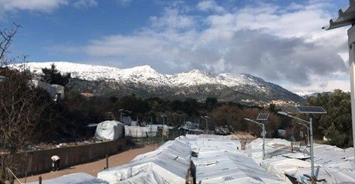

\(Vial camp, Chios\. Photo credit: Refugee Biryani and Bananas\)
#### CHIOS

The word winter here has become synonymous with ‘struggle’\. In the past few weeks, temperatures have been bitingly cold, dropping down to \-5 at nights\. Snow capped the nearby mountains and residents would awake to nightly snow showers, lifting the roofs and walls of the shelters\. The elevation and exposure of Vial Camp results in more extreme temperatures and weather fronts\.

> This time of the winter we the immigrants in vial camp are really suffering a lot\. Because we don’t have no water, no electricity an no toilet’s 

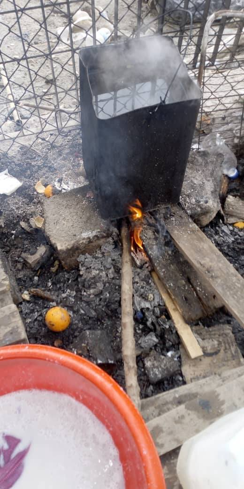

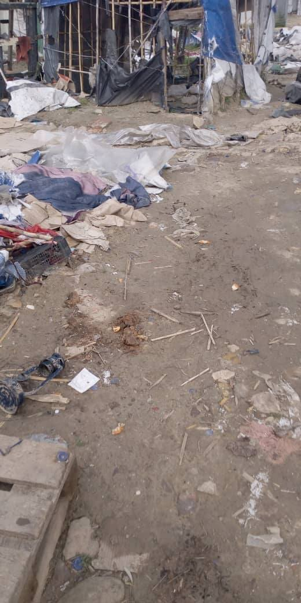

> In the morning we have to go and fetch for fire\-woods an make sure that we make a camp fair to warm our bodies, not only that the water that at the tap is no more coming an we have to go to the stream or to the well to have water 

Coupled with the cold is the constant wet\. It has been a rainy winter, with entire weeks where the rain seemed unceasing\. Residents are then often reluctant to wear appropriate layers, citing that once the clothes are wet they will never dry again and children in particular are often seen without socks and shoes\. This constant flow of water means the camp is regularly flooded and the trash, which sits around in piles until it can be cleared, floats from shelter to shelter, bringing along with it rats and insects\.

> Water inside the well is not always there, but when it rains, to get there is a problem\. And we used the water at the stream to take shower an cook food with an even sometimes some people drink from it when there is no water 

Though electricity shortages are a fact of life in Vial, recent reports confirm that the camp has gone without electricity for days on end in the month of January, following a storm, leaving containers of the most vulnerable without heat and the camp without any light or power for facilities\. Running water has similarly been in short supply, with most residents resorting to a 1km walk to the nearest well or extracting water from their own wells dug in summer\. Heating the water is a constant problem since firewood is also difficult to locate and this method, as in previous years has already resulted in many burns\.

> To get the firewood when it rains is a problem and to put fire on the wood is a problem — we have to heat the water that we got from the stream or the well to be able to wash our clothes or take shower 

> We have to \[…\] stay for days without shower 

The past months have been particularly challenging for residents of Vial Camp, but even more so for the estimated 500–800 people who have either received a notification of their decision or have a second\-instance rejection, since they are then no longer entitled to material support from the RIS, including space to shelter, cash assistance and food\. This had resulted in forced evictions and mass clearances of sections of the camp, with many residents illegally hosting their neighbours at great risk and expense\. Community volunteers and NGOs worked closely to identify these individuals and sneak aid in when access to the camp was strictly prohibited by lockdown measures\.

These measures were imposed mid\-October, following mass\-testing of Vial residents in which 100 people were found to be COVID\-19 positive\. Since then, there has been a very strict traffic ban for residents of Vial and NGOs alike\. Those living in the camp were given fines of €300 when stopped leaving the RIC in order to buy food to supplement the inadequate supplies given by RIS, and these measures remain in place today\.

In the coldest winter Chios has seen in years, asylum seekers and refugees have been severed from access to the most basic channels of support\. Until mid\-December, NGOs were strictly prohibited from accessing the camp\. Various winterisation campaigns were therefore abruptly halted and aid, which was ready to be distributed, had to wait as the conditions declined\.

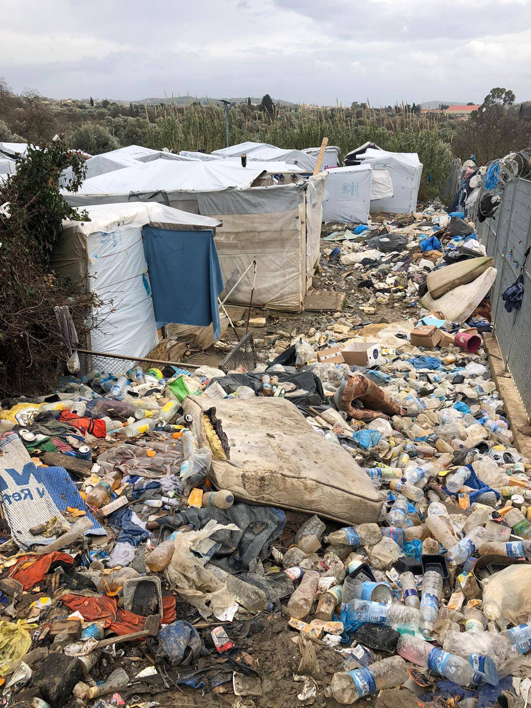

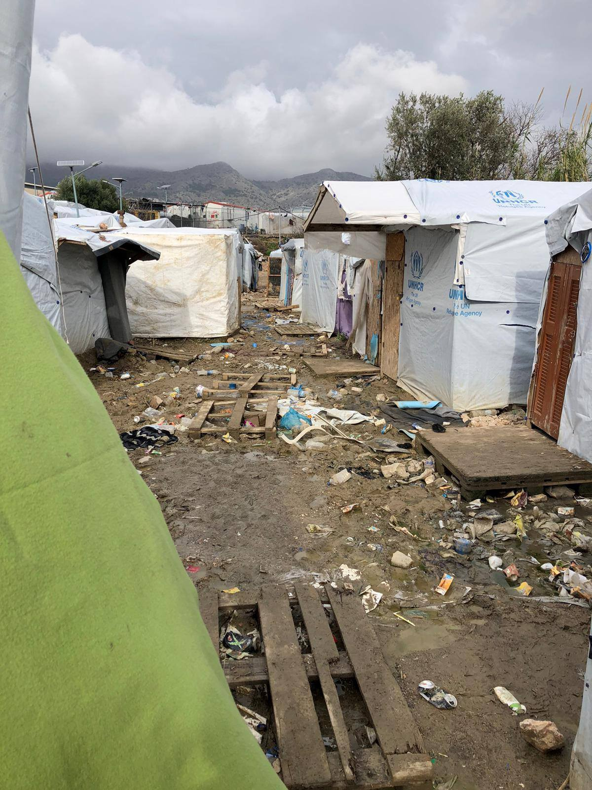

As you can see from the testimonials included here — from volunteers who live in Vial, from students engaging in online learning, and from chance encounters with residents who have managed to leave the camp — it is abundantly clear that this confinement has served to exacerbate the conditions\. Not only is the situation unbearable, people cannot even escape from it\.
#### **SAMOS**

Over the last few weeks, temperatures have dropped drastically in Samos\. The impact that these freezing temperatures have on the people living in and around the Samos camp is clear, and yet, no adequate action has been taken by the responsible authorities\.

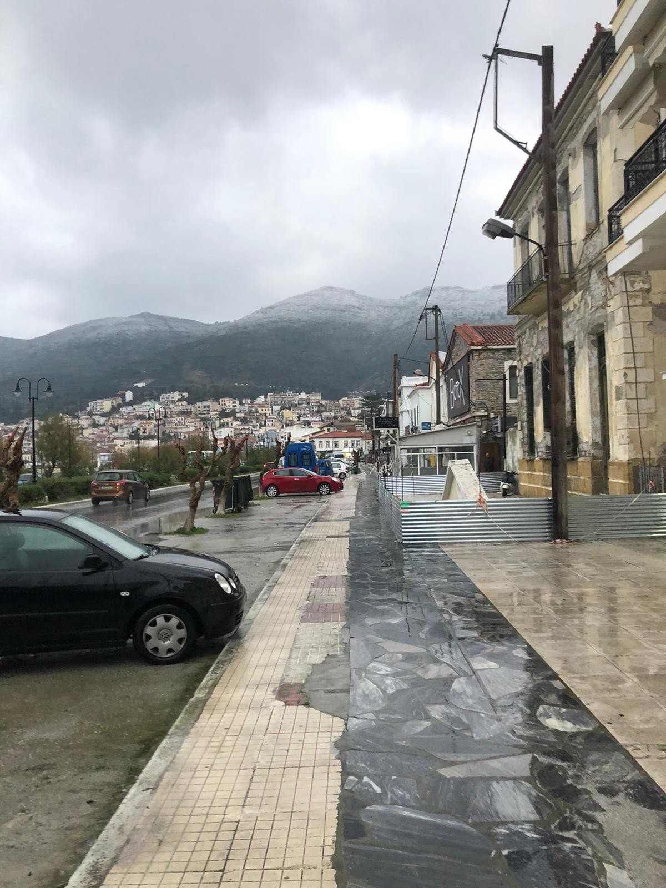

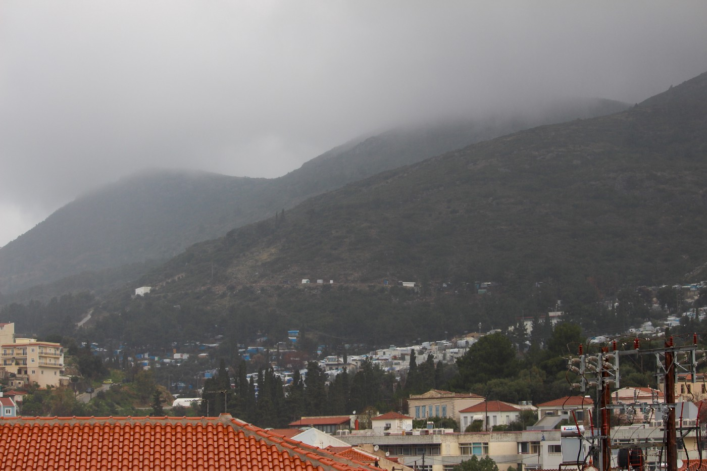

In Samos, only around [800 of the 3,500\+ people](ays-special-from-samos-fires-human-rights-violations-and-pushbacks-374b8227d5af) seeking asylum are currently accommodated inside the official RIC facility\. [2,700 people](ays-special-from-samos-fires-human-rights-violations-and-pushbacks-374b8227d5af) live on the slopes of the mountain above Vathy in tents and makeshift shelters which offer very little protection against the cold\. Among these people, over 500 fall within the ‘vulnerable categories’ i\.e\. newborns, pregnant women, people with disabilities and chronic illnesses, elderly people, SGBV survivors, single women, single parents & separated children\. However, even those who do not fall under the label of ‘vulnerable’ must not be forgotten — the cold weather [affects every single person](https://twitter.com/katymfallon/status/1350875704578236417?s=21) who is living in camps in both Samos and across Greece\.

Grassroots NGOs in Vathy have once again [stepped in to cover the immediate needs](https://www.facebook.com/287044644974925/posts/1401043460241699/?d=n) that would not have been otherwise met during this harsh cold weather\. These initiatives have included:
- **SHELTER** : A group of community centres in Vathy town were asked by UNHCR representatives and local authorities to [temporarily host the camp’s most vulnerable residents](https://twitter.com/samosvolunteers/status/1351433312041111552) as temperatures hit 0°C\. From Monday \(18/01\) to Thursday \(21/01\), around 50 pregnant women and single mothers with young children were [hosted inside the community centres](https://www.facebook.com/1008655142630992/posts/1918998924929938/?d=n) of _Samos Volunteers_ , _Action for Education_ and _Glocal Roots_ [for three nights](https://www.facebook.com/565209816990516/posts/1830148307163321/?d=n) \.
- **HOT FOOD:** _Project Armonia_ , a community kitchen NGO, provided [daily hot breakfasts and dinners](https://www.facebook.com/284110862534800/posts/738408790438336/?d=n) to the people sheltering in the community centres\.
- **ESSENTIAL ITEMS** : The NGOs that distribute NFIs — _A Drop in the Ocean_ , _Refugee4Refugees_ and _Médécins sans Frontières_ — providing community centres with [emergency beds, sleeping bags and blankets](https://www.facebook.com/1133308640019917/posts/4181349748549109/?d=n) as well as [distributing warm essentials](https://www.facebook.com/311889605821388/posts/1421427634867574/?d=n) to [every person living in the camp](https://twitter.com/msf_sea/status/1352558255772495872?s=21) \. Together with _Movement on The Ground,_ these NGOs have [distributed](https://www.facebook.com/311889605821388/posts/1421427634867574/?d=n) blankets, jerry cans, hats, snoods and hot water bottles, as well as providing each individual with at least one set of warm winter clothing\.
- **SHOWERS** : _Action for Educations’_ community centre is providing hot showers to their students \( [Sx](https://www.facebook.com/287044644974925/posts/1402498693429509/?d=n) \) \. The Samos camp has just 46 showers, which is woefully inadequate to meet the need of sanitation — a basic human right — for over 3,500 people residing therein\.
- **WARM TEA:** _Samos Volunteers_ has started giving out hot tea from its Alpha Centre, offering a small token of warmth to everybody living in the camp\.

These are some of the measures [put in place by the collaborative network of Samos NGOs](https://www.facebook.com/169531029864891/posts/1861251604026150/?d=n) to support people through the coldest days and nights on the island\. However, let us not forget that it is [highly problematic](https://twitter.com/samosvolunteers/status/1351433312041111552) and unsustainable to heavily “ _rely on NGOs to provide such basic necessities and for the competent authorities to negate the responsibility of ensuring that human rights are not violated_ ”\.

Whilst the collective efforts of NGOs to provide emergency shelter and services were [recognised by the UNHCR](https://twitter.com/UNHCRGreece/status/1351935550551420935?s=20) , real long\-term solutions are urgently needed\. Winter comes around every year — it is unacceptable that this season is treated as an unexpected emergency by the responsible European bodies\. The winter conditions should have been anticipated and hence, warm and safe shelter should have been ensured for the people seeking safety in Europe during these months\. More pressure and accountability must be placed on the European Union and responsible authorities, building upon MEP Tineke Strik’s [appeal](https://twitter.com/Tineke_Strik/status/1351519620163915776?s=20) to the European Parliament:

_“We need the member states to stop turning a blind eye\. Take responsibility\. Relocate the people\. Let local communities welcome them\. Make our asylum policies lawful again\. Bring in humanity again\. We have no time left\.”_

Overcrowded and ill\-equipped camps are not safe places for anybody to be confined in\. Every human being has [the right to shelter, sanitation and warmth](https://www.ohchr.org/EN/NewsEvents/Pages/DisplayNews.aspx?NewsID=20851&LangID=E) \. People seeking safety in Europe deserve — and moreover, it is their right — to be given a reception that is dignified, humane and lawful\.
#### LESVOS

This week it snowed in Lesvos\. The snow follows weeks of rain, thunderstorms, the kind of wind that you only feel on the coast of an island in the sea\. The snow falls on mud, and on tents that are already soaked through and freezing, on scattered blankets and broken furniture in the sea wind\. It is difficult to restate again how bad the conditions are, when it is something that we have been talking about every year, that gets worse every year\.

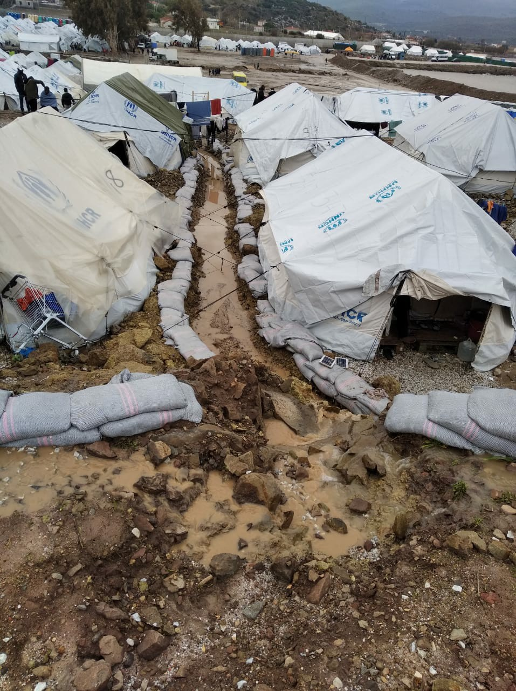

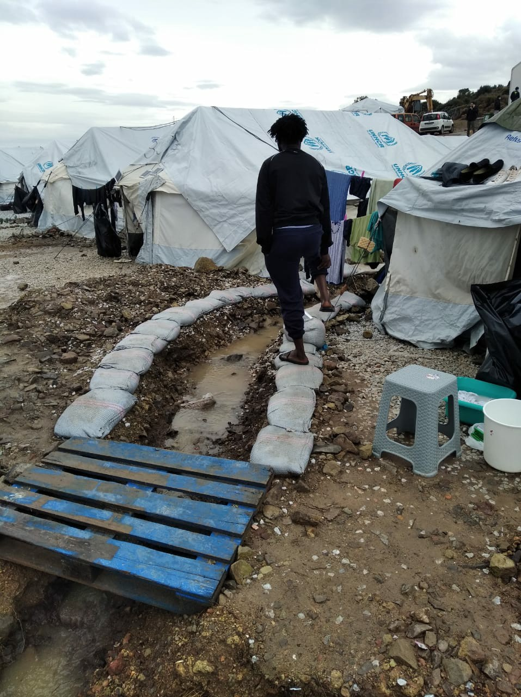

The last time it snowed, really snowed, was 2016\. The camp was buried in snow and six people died, freezing, or from carbon monoxide poisoning while trying to keep warm\. In 2017, we demanded ‘No More Deaths from Cold’\. In 2018, there was so much rain we still talk about it, two years on\. Last year, 20,000 people spent the winter in Moria camp, ten times its supposed capacity\. Under the cover of winter and total police impunity, a man hung himself inside Moria prison, one incident among many attempts\. What can we say this year that has not been said?

Does the story need a “human element”? Perhaps we should talk about the call I made yesterday to a man living in the camp, to ask if he had been transferred to a house in the city\. He and his wife stay awake at night to watch their six year\-old son, to make sure he doesn’t walk out of the tent into the sea, as he has tried to do before\. To make sure he doesn’t hurt himself with a knife, as he has done before\. I heard recently that all the children in the camp, when they draw pictures, draw the sea, and walls\. The boy’s father tells me they have been moved from one tent to another inside the camp — the new tent is closer to the sea\. He has to end the call suddenly, because their tent has come loose and is blowing away again, for the third or fourth time today\. Over the phone I can hear the wind, and people shouting\. Later, a friend sends me photos, showing the UNHCR logo fluttering across the grey sky, showing tents bisected by metal pylons that have collapsed on top of them in the wind\.

It’s not new that winter has allowed disease to spread in the camp, that parents cut their children’s hair because they have inflamed and itching scabs behind their ears and on their mouths\. It’s not new that the medicine prescribed is inadequate, that no treatment is effective when 8000 people are crushed together, in the damp air\. It’s not new that the electricity cuts out, that people light fires in their tents to stay warm at night, that children warm their feet over hot coals and toxic fumes\.

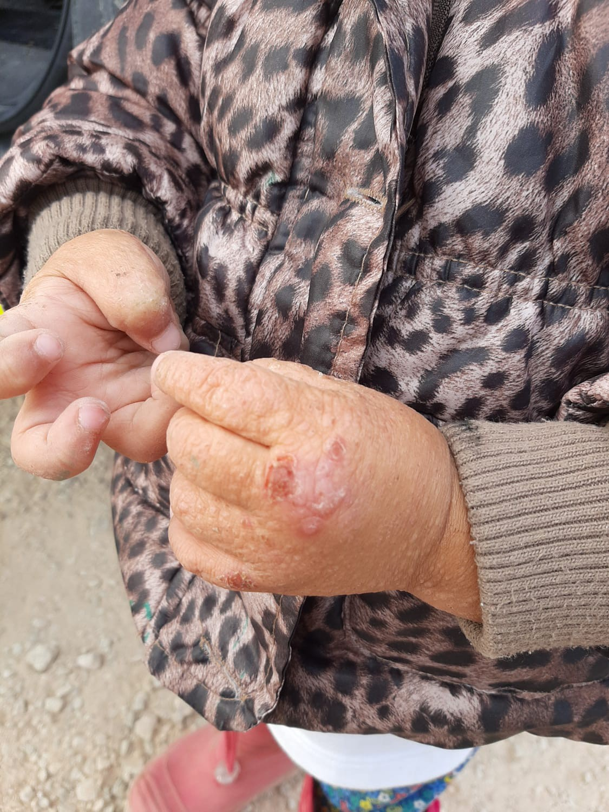

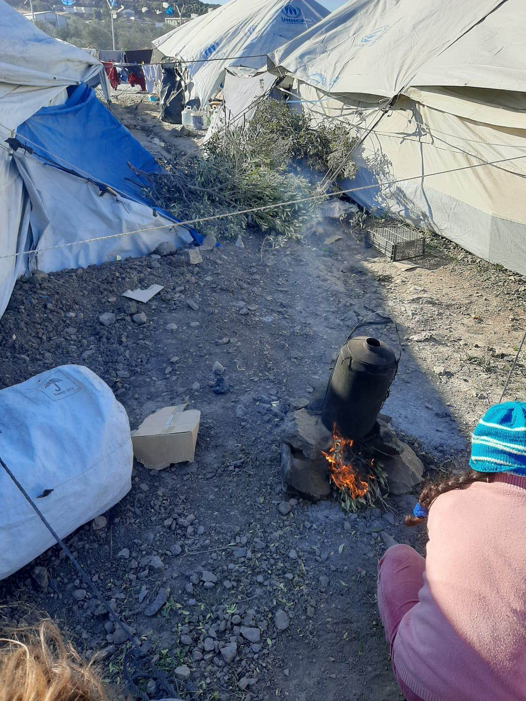

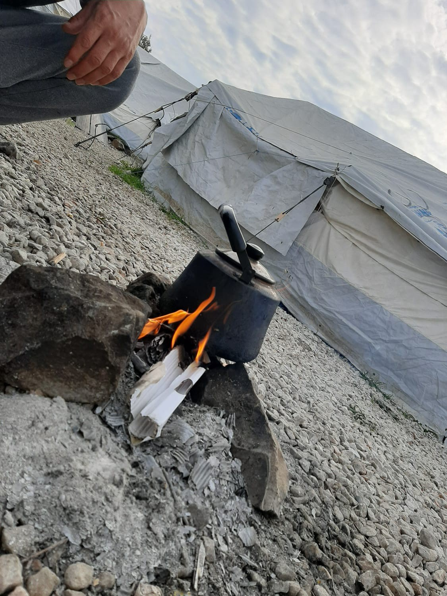

Maybe we can say this winter is crueller before, with the lockdown and the travel restrictions\. People who have every right to leave the island, who have papers referring them for urgent medical treatment in Athens, are stuck in the camp alongside the unlucky ones without any paper giving them the right to leave\. One woman I know has shrapnel in her mouth, her back, her leg and her arms, a war injury, which has caused nerve damage and seizures\. She is now 8 months pregnant — her previous pregnancy ended in miscarriage, and she is terrified this will happen again\. Surgery in Athens could remove the shrapnel, and she has a referral paper from the public hospital\. This paper was written last August\. It is a golden ticket — most people cannot even get an appointment at the public hospital\. But she is still living in the camp, and her family was recently moved from their tent into a larger one, shared with more people\. Her situation is not unusual\. The mud in the camp is tracked through with wheelchairs, with crutches, with sore and limping feet\.

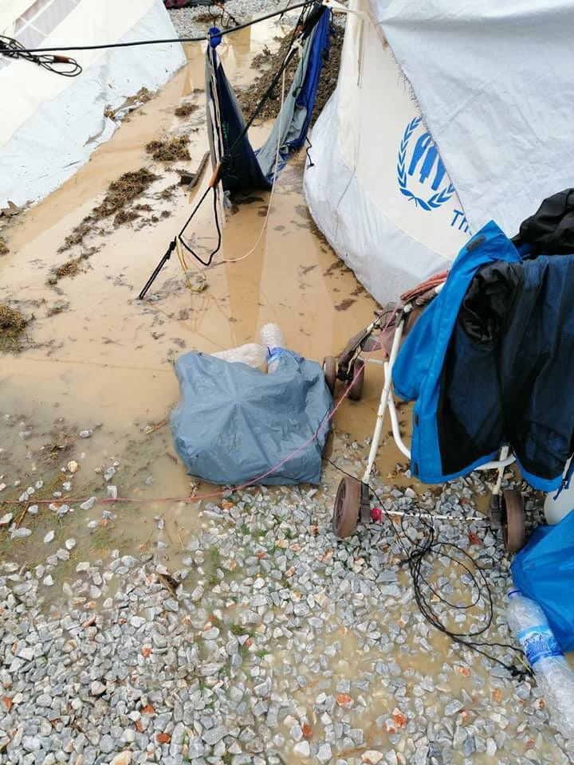

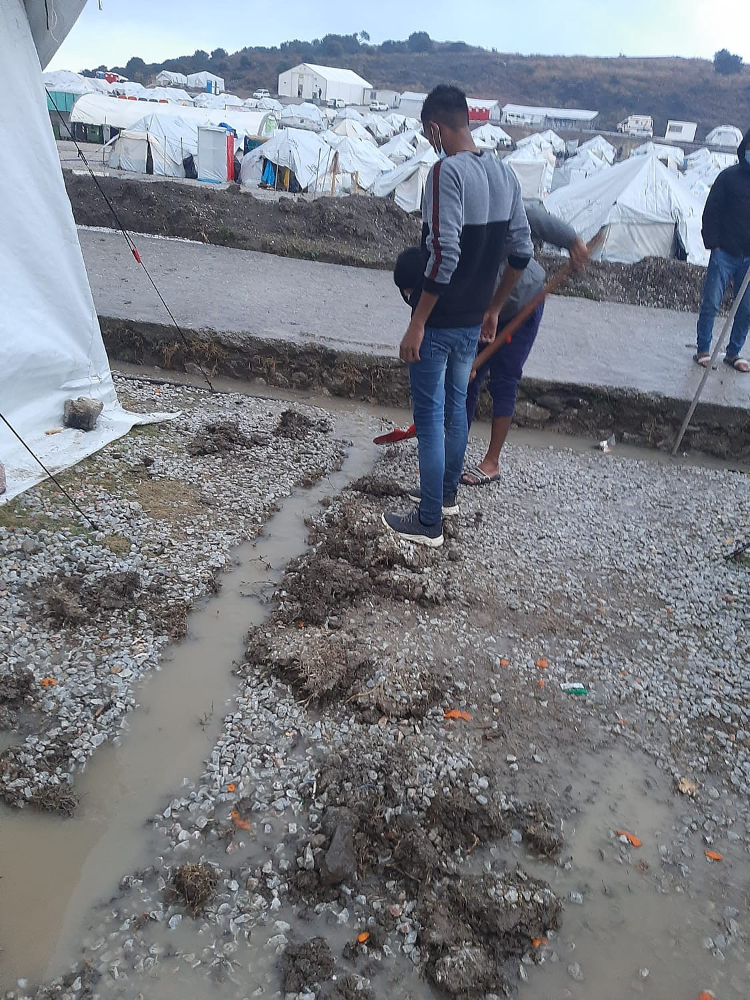

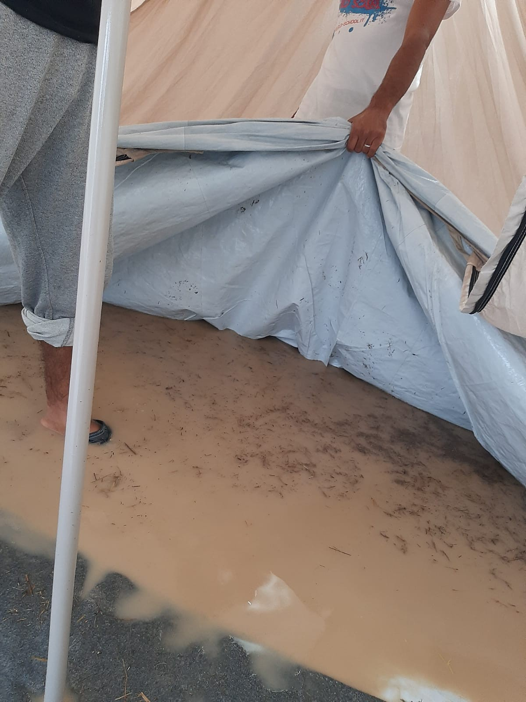

There are many others with reasons to leave, without papers to confirm it\. Single men have the least chance of all, and rumours have begun to spread that one of the big tents, housing 150 men, will be converted into a new detention centre\. Already they have a stricter curfew than the rest of the camp, in the name of ‘preventing sexual violence’\. Perhaps none of the orchestrators imagined that single men can also be victims of sexual violence\. This rumour, along with the news that Turkey has accepted the proposed deportations, has brought new panic to the island\. Syrian people are trapped by the five year\-old EU\-Turkey deal — in nearly every case \(I do not know an exception\), their asylum claim is deemed ‘inadmissible’\. Europe will not even ask them about why they left Syria, issuing them with decisions that tell them they can safely return to Turkey, even as Turkey continues to carry out push backs and deportations of Syrians back to Assad’s regime\. In fact, anyone whose asylum claim is rejected, and then rejected on appeal, is trapped on the island\. There is no way to move forward, no way to move back, and no support while they are stuck\. They are waiting for the deportations to start, watching to see when police will start to detain people again as they pick up their decisions, their rejections\.

Even those who have been recognised as “real refugees”, as “good migrants”, are unable to move forwards\. Appointments to get ID and travel documents have stopped, and it is not clear when they will start again\. In the city, the recognised and the unrecognised, the twice rejected, are alike\. Their cash support is cut\. What do you do in winter, with no money to pay for food or heating? There are few places to turn\.

It is hard to watch this situation repeat itself over and over, and of course, as always, it is unimaginably harder for those who watch it happen to their brothers, sisters, parents or children, for those who watch it happen to their friends\. It is hard for those who travel alone\. We cannot forget that this is no coincidence\. There are enough blankets, heaters, rooms with four walls and windows\. There is enough space\. All of this, everything that happens to every person on this island, is by design\.

**_Thank you to all the residents, activists and volunteers who contributed to this piece\._**

**Find daily updates and special reports on our [Medium page](https://medium.com/are-you-syrious) \.**

**If you wish to contribute, either by writing a report or a story, or by joining the info gathering team, please let us know\.**

**We strive to echo correct news from the ground through collaboration and fairness\. Every effort has been made to credit organisations and individuals with regard to the supply of information, video, and photo material \(in cases where the source wanted to be accredited\) \. Please notify us regarding corrections\.**

**If there’s anything you want to share or comment, contact us through Facebook, Twitter or write to: areyousyrious@gmail\.com**

_Converted [Medium Post](https://medium.com/are-you-syrious/another-surprise-winter-on-the-islands-chios-samos-and-lesvos-36dabd5285ec) by [ZMediumToMarkdown](https://github.com/ZhgChgLi/ZMediumToMarkdown)._
