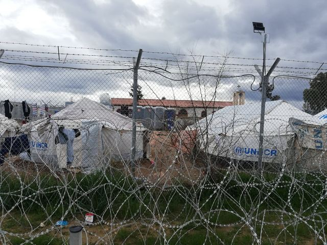
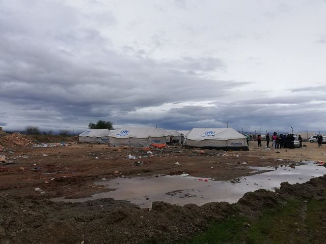
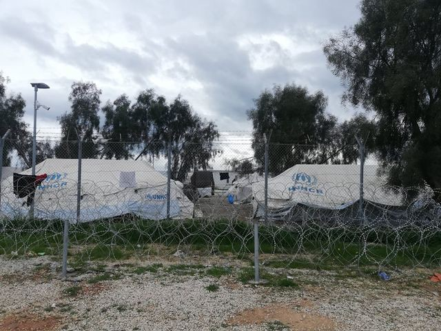
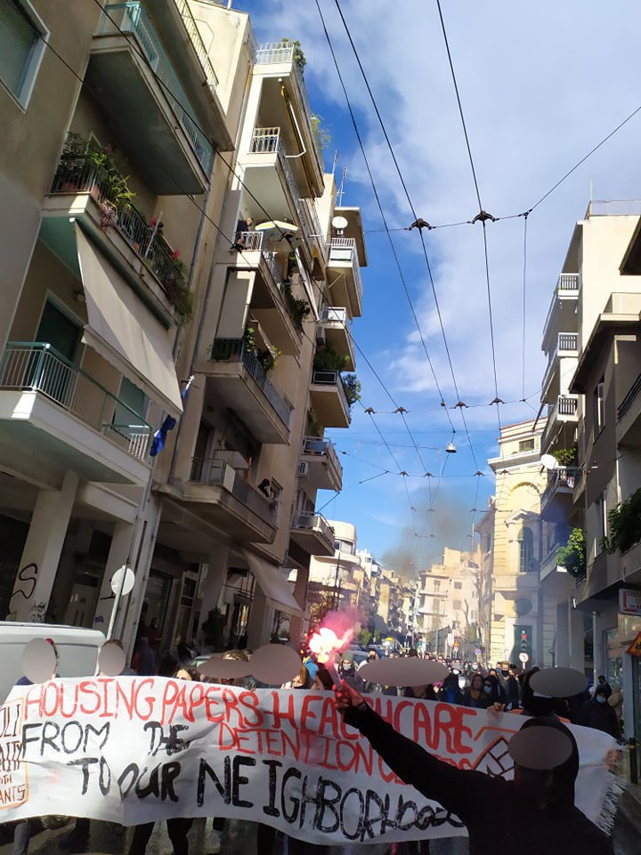
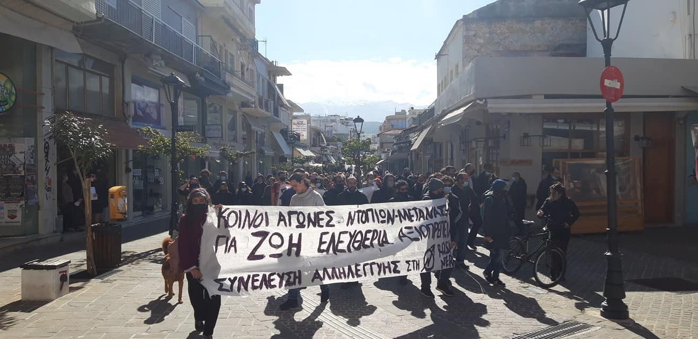

### AYS Weekend Digest 30–31/1/2021 UK: Has the government learnt anything from the Fire at Napier? No\.

_Reports of torture from Maltese detention centres // National day of solidarity with people on the move in Greece //Cruel pushbacks from Romania // Landmark decision in Germany\._

](assets/a0ae5537ba2d/1*cPQnwgWsUCCJwVpMSTwsSA.jpeg)

[Saturday January 30, 2021 — Athens, Greece — National day of action in solidarity with migrants](https://www.facebook.com/solidaritymigrants/posts/242914287331108)
#### Featured — UK: Has the government learnt anything from the fire at Napier? No\.

 \)](assets/a0ae5537ba2d/1*bs4XFVOzGpXWSsdhJjiBOw.jpeg)

\(Photo Credit: [Choose Love](https://twitter.com/chooselove/status/1355827062423105536) \)

[Care4Calais report](https://www.facebook.com/care4calais/posts/4033514106681516) that residents are still without heating despite the cold\.

> It’s midwinter and we have been told over 100 people are sick with COVID, and there is no doctor on site\. They have no hot water to make tea or wash\. 

> Last night, our volunteers took blankets to the site following pleas from the men, but these were refused at the gate\. In a disturbing incident, there was also an attempt to stop an ambulance attending a sick COVID patient\. 

Instead of addressing any of these concerns, the police arrested [another 9 people](https://www.itv.com/news/meridian/2021-01-29/fire-breaks-out-at-former-military-barracks-in-kent-housing-asylum-seekers?fbclid=IwAR0n2cGcxd0kZ1GI7J1WERKhF6jyaEulLocptrH7mc_FL_Djg1RYzl9lxXU) over the weekend in relation to the fire and ‘disturbances’\. Five people had already been arrested on Friday\.

Meanwhile [the Independent newspaper reports](https://www.independent.co.uk/news/uk/home-news/asylum-seekers-napier-barracks-home-office-b1793951.html?fbclid=IwAR2-ku8Q9kCgmNn0sIWWsoeQLHwjOXcUHNAXMW0dRN3yFpkITJcjw4d_zfY) that internal government documents show that the barracks were chosen purely for aesthetic reasons, in order not to undermine the image of a ‘hostile’ asylum system\. Bravo\. Job done\. Literally nobody thinks of you as welcoming, law abiding, or moral\.

However, the British government has never been particularly concerned by such niceties and are now considering another inappropriate site for housing asylum seekers adjacent to Yarl’s Wood Immigration Removal Centre\. A [group of faith leaders](https://docs.google.com/document/d/1lfBxlR_KESwZWKb8VXF7RRlwT31qCLu3mkrsVb-aaPE/edit) have pointed out the various problems with this plan and asked the Home Office and Serco the following questions:
- Have other more suitable options been exhausted, including hotel accommodation or other options closer to an urban centre such as Bedford or Luton?
- How will you ensure that the physical and mental wellbeing of the proposed residents will be safeguarded?
- Have the requisite social and environmental risk assessments been carried out?
- Will local organisations be given adequate access to offer support in a COVID secure manner?
- Will residents have adequate access to local institutions which can support their wellbeing, including places of worship?
- Has the process of developing this site been conducted in a transparent manner with the full support of the local authorities?

Short answer? We’re guessing a No\.

A short video about the impact of detention on the people who experience it has been put together by [Refugee Tales](https://www.refugeetales.org/walking-inquiry?fbclid=IwAR1B_gl8LHC0nAMnanZP3WXWuJcNp62_y0-XaM0HKZVoDsltx51XQa7xxLM) \. A longer video from BiD \(Bail for Immigration Detainees\) highlighting the risks of detention and deportation during a pandemic can also be seen [HERE](https://www.biduk.org/articles/765-watch-back-risky-business-detention-decision-making-during-the-pandemic?fbclid=IwAR1BFuv8zMAWBnQZaSTInTaozGByWrl2nMwiV7L5YFdWpk6Uv3gW6oTqAh4) \.

SYRIA
#### Scenes from Idlib

Pictures from Idlib show remarkable similarities to those taken in camps in Greece — inadequate housing, flooding, children missing out on their childhoods — things you might expect after over a decade of civil war but not in a peace time EU country…

■■■■■■■■■■■■■■ 
> **[InfoMigrants](https://twitter.com/InfoMigrants) @ Twitter Says:** 

> > 📷 These pictures were taken at a camp for displaced people near the village of Kafr Aruq in Idlib province, Syria, this week. 

Hundreds of thousands of displaced Syrians live in Idlib. 

Heavy rains left many camps in the region muddy and even flooded in recent weeks. https://t.co/XBxJZfCFwN 

> **Tweeted at [2021-01-30 14:28:00](https://twitter.com/InfoMigrants/status/1355523159336886277?fbclid=IwAR1xclmx3ylgiWzm4-RhSFIegV3HOKnJc11K0jA3ep0p3Nt1z0DyZxPXNzQ).** 

■■■■■■■■■■■■■■ 

SEA

On Thursday Alarm Phone [received](https://twitter.com/alarm_phone/status/1355198358982447105) reports of two boats missing in the western Mediterranean, between Algeria and Spain\. On Saturday, one boat, with 10 people on board, was [confirmed](https://twitter.com/alarm_phone/status/1355593914250625026) landing in Cartagena, Spain\. There is no confirmation about the situation of the second boat, which is carrying 10 people\.

CYPRUS
#### Cyprus, Nicosia: Pournara Concentration Camp

Over 1,600 people currently living in a space for 600 as reported by [@radiofragmata](https://twitter.com/radiofragmata) \.

 \)](assets/a0ae5537ba2d/1*8lsvfEA-MFjUCECoGUNnbg.jpeg)

\(Photo Credit: [@radiofragmata](https://twitter.com/radiofragmata) \)

GREECE
#### Pushbacks, again

Turkish media [report](https://www.dailysabah.com/turkey/turkish-coast-guard-rescues-48-asylum-seekers-in-aegean/news) of a pushback on the Aegean sea against 48 people trying to reach Greece, who were rescued by Turkish coast guard on Saturday January 30\.
#### National day of solidarity actions with migrants

On Saturday, across Greece, [several demonstrations and actions](https://www.facebook.com/events/1330013434033872/) took place in solidarity with people on the move\.

■■■■■■■■■■■■■■ 
> **[NoBorders](https://twitter.com/Refugees_Gr) @ Twitter Says:** 

> > As part of the day of action a solidarity action took place in the central square of Larissa 30/1.  Note that dozens of refugee families living in Larissa are left homeless as the ESTIA program throws them out of the apartments, leaving them homeless. #Refugeesgr #antireport https://t.co/Tt3b2uBLcr 

> **Tweeted at [2021-01-31 15:21:57](https://twitter.com/Refugees_Gr/status/1355899124651077632).** 

■■■■■■■■■■■■■■ 

 \), Chania, Crete \(photo by [Αυτοοργανωμένοι Δημόσιοι Χώροι](https://www.facebook.com/SolidarityWithRosaNera/?__cft__[0]=AZWPHMdsQN0Vp5yHBV_zSqwvDz9WKRbFbIgJcHxmTDxg7GLVYcSVe4FCZKtQpddaV0DK9bQmCvFSoI2vD0SSgxFiOC15oFGNHUrqlRgVTRbdoeHVNVixrmVZXLBa364LczswaK-oZq2E2y5G9B9_lp_R&__tn__=-UC%2CP-R) \), Thessaloniki \(photo by [Stop War on Migrants](https://www.facebook.com/StopWarOnMigrants/?__cft__[0]=AZV-P9F6QsJT83M_hClggv43-iGMf-KCjEAlpkA0ecpdng0q6Z_WgxEpHH9U3RUMXDIqMyBjasendj0dtiNfIpLyp0O9Jd5Pj5_3PmGzpDePLszM8mvXcg_Po7VYI-xRO9L5C04IXxBa87dnWevj_rz6&__tn__=-UC%2CP-R) \) — Saturday 30 January 2020\)](assets/a0ae5537ba2d/1*YBO5Ew8g83G3jD-BjCy9tA.jpeg)

Left to Right: Athens \(Photo by [Solidarity with Migrants](https://www.facebook.com/solidaritymigrants/posts/242914287331108) \), Chania, Crete \(photo by [Αυτοοργανωμένοι Δημόσιοι Χώροι](https://www.facebook.com/SolidarityWithRosaNera/?__cft__[0]=AZWPHMdsQN0Vp5yHBV_zSqwvDz9WKRbFbIgJcHxmTDxg7GLVYcSVe4FCZKtQpddaV0DK9bQmCvFSoI2vD0SSgxFiOC15oFGNHUrqlRgVTRbdoeHVNVixrmVZXLBa364LczswaK-oZq2E2y5G9B9_lp_R&__tn__=-UC%2CP-R) \), Thessaloniki \(photo by [Stop War on Migrants](https://www.facebook.com/StopWarOnMigrants/?__cft__[0]=AZV-P9F6QsJT83M_hClggv43-iGMf-KCjEAlpkA0ecpdng0q6Z_WgxEpHH9U3RUMXDIqMyBjasendj0dtiNfIpLyp0O9Jd5Pj5_3PmGzpDePLszM8mvXcg_Po7VYI-xRO9L5C04IXxBa87dnWevj_rz6&__tn__=-UC%2CP-R) \) — Saturday 30 January 2020\)

The Break the Silence online event was organised by Steki Chania, with speakers from all over Greece\. Watch the full video \(in Greek and English\) [HERE](https://www.facebook.com/stekichania/videos/865974274201111/) \.
#### Lawsuit against education ministers for denying asylum seeking children education during the pandemic

[Παρατηρητηρίου Ρατσιστικών Εγκλημάτων — Racist Crimes Watch](https://racistcrimeswatch.wordpress.com/2021/01/31/1-1138) filed a lawsuit against the minister and the deputy minister of Education, regarding the exclusion from education of the children of asylum seekers residing in camps and hotspots during the lockdown periods\.

> As stated by the “Teachers’ Initiative for the right of refugee and immigrant children to school”, even those children who are enrolled in schools are unable to attend classes\. This is due both to the wider lack of political will for years and to e\-learning, as there have been no provisions for a lack of technical conditions for such a thing, let alone for the specific problems of intercultural communication in such a context\. But even after the recent opening of schools … the movement of residents in hotspots is further restricted, which makes it practically possible for a child to attend classes…\. 

#### Worsening weather on the Aegean islands

While meteorological services [forecast](https://www.keeptalkinggreece.com/2021/01/31/greece-weather-warning-3) worsening weather and high winds from Monday on the islands, more videos show the conditions in [Moria 2\.0, Lesvos](https://www.facebook.com/MareLiberumOfficial/videos/194853945663474) and [Vial, Chios](https://www.facebook.com/ruhi.akhtar.7/videos/4249285735088302/) \.

MALTA
#### Reports of torture inside Maltese detention centres

Maltese media have [reported](https://timesofmalta.com/articles/view/reports-of-torturing-detained-migrants-manuel-delia.848085) that the EASO \(European Asylum Support Office\) office on the island has received a large number of complaints about the physical torture of people on the move detained at the Lyster and Safi barracks\. These include: beatings, solitary confinement, denial or delay of medical care and, in some cases, electrocution\. Reports says that people in detention have been beaten, had their teeth damaged by beatings to their face and were taken to a room to be beaten up and left alone for several hours\. EASO confirmed receiving such reports, and stated that it has brought the issue up with the national authorities, but that the agency has no power to intervene\.

The complaints are likely to be among the factors that prompted an unscheduled ‘rapid reaction visit’ in Malta of the Council of Europe’s CPT \(Committee for the Prevention of Torture\) on September 2020\. Findings are not yet published because the CPT needs the permission of national authorities, which has not been received\.

A spokesperson from the ministry for home affairs, national security and law enforcement denied ever hearing of such reports, and stated that they acted on most of the observations communicated by the CPT, who — according to the ministry — “interviewed a considerable number of migrants who did not report cases of ill\-treatment by the Detention Services officials”\.
#### Revision of humanitarian protection criteria affects children’s rights

Since Malta has [revised](https://timesofmalta.com/articles/view/identity-malta-streamlines-policy-on-humanitarian-protection-for.834010) the criteria needed for humanitarian protection to migrants in November, a number of families in the country have found how the new policy impacts upon the ability of children to access basic rights\. Maltese media [report](https://timesofmalta.com/articles/view/they-said-they-would-renew-my-documents-but-not-my-daughters.848379) that children can now only obtain identity documents through their parents if both parents are beneficiaries of humanitarian protection\. Before November, children could do this through one parent only\.

This change is affecting the ability of children to study as up\-to\-date identity papers are necessary to enrol in schools\.

ITALY
#### **Arrivals**

Eleana, of Mediterrana — Saving Humans [report](https://twitter.com/EleanaElefante/status/1355586713494704129) of 84 people \(including many women and children\) arriving on Saturday afternoon in Lampedusa from Sfax, Tunisia\.

CROATIA
#### MEPs prevented from going to the border

Croatian police stopped the delegation of Italian MEPs [200 metres from the Bosnian border](https://www.klix.ba/vijesti/regija/hrvatski-ministar-eu-zvanicnici-su-htjeli-ilegalno-prijeci-granicu-ovo-je-provokacija/210131073?utm_medium=Status&utm_source=Facebook&utm_content=210131073&utm_campaign=Klix.ba%20Facebook%20status&fbclid=IwAR1BFuv8zMAWBnQZaSTInTaozGByWrl2nMwiV7L5YFdWpk6Uv3gW6oTqAh4) and told them they could not cross it illegally\. The force employed [20 police officers and vans](https://ba.n1info.com/english/news/media-croatian-police-prevent-meps-from-checking-situation-with-migrants/?fbclid=IwAR2pUTCJykC2UUTCemFzn1pyyo9t-RTIWd74YcG-Q4o9GIVLNM3nG1cqG6w) to block the road\.

■■■■■■■■■■■■■■ 
> **[Brando Benifei](https://twitter.com/brandobenifei) @ Twitter Says:** 

> > Poco prima del confine tra Croazia e Bosnia siamo stati bloccati da agenti che ci hanno impedito di proseguire con la nostra ispezione. Sembra che abbiano qualcosa da nascondere. Se siamo stati trattati così noi, figuriamoci i migranti e i richiedenti asilo.
#RottaBalcanica https://t.co/DdRiDSJLFE 

> **Tweeted at [2021-01-30 17:24:56](https://twitter.com/brandobenifei/status/1355567688647659523).** 

■■■■■■■■■■■■■■ 

The Croatian government continues to deny that it is breaking the law at the border despite [wide spread condemnation](https://twitter.com/EleonoraCamilli/status/1355804615657324544) and documentation of illegal push backs\. The MEPs did manage to [meet with groups working with people on the move](https://twitter.com/BaobabExp/status/1355804466403024896) on the Bosnian side of the border — Baobab Experience, No Name Kitchen and Border Violence Monitoring Network\.
#### Kurdish refugees tortured and facing deportation

[Kurdish Voice reports](https://kurdishvoice.gr/en/kurdish-refugees-tortured-in-croatia-set-to-be-deported/?fbclid=IwAR3EZadIYr12Bvh4LohOJ72sOKvfVJTp0B_QjB2XstYzwMPsgezTSgsNsWI) that a group of 10–15 Kurdish refugees was stopped by Croatian security forces and taken to a prison 10 kilometres from Zagreb\.

> The Kurdish refugees, who were exposed to violence in a vehicle while being taken to the Turkish consulate, refused to sign the documents imposed on them at the consulate\. They were further subjected to violence in the consulate\. 

> It is reported that one of the refugees was hospitalized due to the torture and is in serious condition\. The refugee in question is a person who had previously obtained a residence permit in France\. 

> This is, of course, a clear violation of the rights of refugees, of the UN Convention Relating to the Status of Refugees, the European Convention on Human Rights, and all concepts of European and international law\. Croatia, in particular, as a member of the European Union, is bound by the conditions and obligations arising from these treaties, and is therefore obliged to protect the Kurdish refugees\. 

ROMANIA
#### Violent and humiliating pushbacks to Serbia

[No Name Kitchen report](https://www.facebook.com/NoNameKitchenBelgrade/posts/1173109546420661) of an illegal, violent and humiliating pushback from Romania to Serbia against a group of 14 boys between the ages of 12 and 24 years old on January 5th\. The group described “encountering a myriad of concerning treatment from the Romanian authorities\. Along with the textbook practices of violent pushbacks \(broken phones, burned clothing, beatings with batons\), the group was subject to cruel and humiliating treatment by the Romanian authorities after they had transported them back to the Serbian border\.”

> Jumping on backs: 

> There, they were forced to lay down on their bellies at which point several officers started jumping on the backs of each one of them\. They were reportedly told: 

> “If you make noise, we will punish you more…A little guy started shouting, so two police officers started jumping on his legs\. We all felt pain, but we couldn’t shout, if we shouted, if we cried, they started torturing us more\.” 

> Calisthenic exercises: 

> Afterwards, the respondents described that the authorities separated the apprehended into three groups and compelled the first group to do push\-ups\. Then when the first group finished with the push\-ups, they asked them to sit and stand on one leg\. The groups suffered the same treatment in rotation\. One of the men described to us: 

> “We were doing all this in the mud and it was very cold, we were not wearing any jacket and shoes\. Our face and clothes were full of mud\. When the first group finished to do push\-ups, then they asked the second group to do the same and so with the third\.” 

> Consumption of pork: 

> The respondent described the officers taking some food from their car and offering them some meat, supposedly chicken\. However, according to the respondent, they later found out it was be pork\. 

> “They \(the Romanian officers\) forced five or six guys to eat pork\. They were also making jokes of our religion\.” 

Read the full report on the pushbacks database of [Border Violence Monitoring Network](https://www.borderviolence.eu/) \.

GERMANY
#### Germany rules people cannot be deported to Greece

Setting an important precedent, the administrative court of North Rhine\-Westphalia has [ruled](https://www.infomigrants.net/en/post/29897/german-court-rules-that-refugees-cannot-be-deported-to-greece) that two refugees who had been granted asylum in Greece could not be sent back there because of a “serious risk of inhumane and degrading treatment\.” The court said the men would likely be unable to meet their most basic needs if they returned to Greece\.

The court case was started when the two people were denied protection in Germany, threatened with deportation and they appealed against the decision\.
#### **Protests across Germany and Austria**

#### Kurdish activist deported to Iran

On Friday January 29th, Ebrahim was deported to Iran, media [report](https://anfenglish.com/human-rights/x-49663) \. He lived and worked in Germany since 2010, after having fled Iran for participating in a demonstration\. Several organisations have tried to stop his deportation, fearing he will become a target of the regime once back in the country\.

> According to Younes Bahram, member of the German\-Kurdish Forum in Dresden, there are currently reports on Mr Jenekanlo’s situation on Kurdish\-Iraqi and pro\-Kurdish Iranian television\. According to Bahram, these reports alone are enough for the Iranian Republic to determine treason and the associated execution of the death penalty\. 

At least 48 people have been deported to Iran from Germany since 2019\.

FRANCE
#### 101st eviction of 2021 in Calais

■■■■■■■■■■■■■■ 
> **[Human Rights Observers](https://twitter.com/HumanRightsObs) @ Twitter Says:** 

> > Aujourd'hui à #Calais a eu lieu la 101ème #expulsion de 2021

2 personnes arrêtées arbitrairement sur leur lieu de vie
Au moins 18 tentes,15 couvertures,9 sacs,1 manteau saisis

Les expulsions forcées ne peuvent pas être dissociées des violences policières et des violences d'Etat https://t.co/BGJHYfhbCA 

> **Tweeted at [2021-01-31 16:27:05](https://twitter.com/HumanRightsObs/status/1355915515437441027).** 

■■■■■■■■■■■■■■ 

#### Refugee Women’s Centre is looking for volunteers in Northern France

RWC is looking for a Farsi, Arabic or Sorani speaking Community Link Volunteer\! Accommodation and monthly stipend provided\. Commitment to 4 months minimum\. Do you want to join our small, dynamic grassroots team providing support to women and families in Northern France?

Read more [HERE](https://twitter.com/RWC_CalaisDK/status/1355820135974465541) \.

[Read the story of Moussa](https://www.lemonde.fr/societe/article/2021/01/30/mon-combat-c-est-d-etre-regularise-moussa-victime-collaterale-de-l-ouverture-illegale-d-un-restaurant-a-nice_6068231_3224.html) , who has lived in France for the last ten years and who is now risking deportation after being arrested by the police because the boss of the restaurant he was working in decided to defy COVID\-19 regulations and open to the public on January 27\.

EU
#### 300 million has been spent on drones in last 4 years

[Matthias Monroy](https://digit.site36.net/author/digit/) , a member of the Border Violence Monitoring Network, has [published a breakdown](https://digit.site36.net/2021/01/31/eu-has-spent-over-300-million-on-surveillance-with-drones-in-four-years/?fbclid=IwAR2tThVzq73Az_bzM9HHIcvoL5M1ufBFVgiyfOxV3rBsIUUbXjpfEwqnmJ0) of the EU’s drone based plans and costs\.

> Unmanned systems have been flying regularly for the European Union’s agencies since 2017\. Now, member states are also receiving funding for drones at their external borders\. Soon, remote\-controlled patrol boats could be deployed\. 

UK
#### Rise in Academics Seeking Safety

[The Council for At\-Risk Academics](https://www.cara.ngo/news-events/) \(CARA\) have seen a massive increase in requests for help and is now receiving around [5 per week](https://www.independent.co.uk/news/uk/home-news/academics-persecution-cara-rescue-conflict-syria-yemen-uk-b1768707.html?fbclid=IwAR0ZZxLlLJJa1u6sGAQOOFTNxMt64IfRAT3lw_i5ZwjNq9ndG5vbyEU-4tY) \. The group was set up during WW2 to support Jewish Academics\. It is now receiving more requests than ever before\.

WORTH WATCHING
- **Latitude Adjustment Podcast Academy\.** On Friday and Saturday, LAP was live from Lesvos with two specials: [**the first one**](https://www.facebook.com/latitudeadjustmentpodcast/videos/904485296954483) with the hosts discussing the podcast academy project and [**the second**](https://www.facebook.com/latitudeadjustmentpodcast/videos/856407988492337) talking to graduates of the academy\.

WORTH READING
- [**Nordic Resistance Movement banned in Finland — the history of the court case and what the Nazis are doing now\.**](https://varisverkosto.com/2021/01/nordic-resistance-movement-banned-in-finland-the-history-of-the-court-case-and-what-the-nazis-are-doing-now/) _The pan\-Nordic national socialist organisation Nordic Resistance Movement \(NRM\) have been banned in Finland by the Supreme Court, but the Nazis are continuing their activities under new names\. In this article, we will present an overview of the legal process that lasted three years, what the Nazis did during it and how their activities have changed\._
- **Mediterranean Responsibilities\.** Two articles on the long\-awaited decision of the UN Human Rights committee concerning a distress case in the Central Mediterranean back in 2013, in which more than 200 people died\. [**Statewatch**](https://www.statewatch.org/news/2021/january/italy-let-more-than-200-people-die-in-2013-shipwreck-finds-un-human-rights-committee) and [**Verfassungsblog**](https://verfassungsblog.de/mediterranean-responsibilities) analyse this landmark decision and its possible repercussions on maritime migration and state responsibilities\.
- [Dr\. David Fernández\-Rojo](https://eulawanalysis.blogspot.com/2021/01/eu-migration-agencies-operation-and.html?fbclid=IwAR0n2cGcxd0kZ1GI7J1WERKhF6jyaEulLocptrH7mc_FL_Djg1RYzl9lxXU) is publishing a new book — [**EU Migration Agencies: The Operation and Cooperation of Frontex, EASO and Europol**](https://www.e-elgar.com/shop/gbp/catalog/product/view/id/16839/)

**Find daily updates and special reports on our [Medium page](https://medium.com/are-you-syrious) \.**

**If you wish to contribute, either by writing a report or a story, or by joining the info gathering team, please let us know\.**

**We strive to echo correct news from the ground through collaboration and fairness\. Every effort has been made to credit organisations and individuals with regard to the supply of information, video, and photo material \(in cases where the source wanted to be accredited\) \. Please notify us regarding corrections\.**

**If there’s anything you want to share or comment, contact us through Facebook, Twitter or write to: areyousyrious@gmail\.com**

_Converted [Medium Post](https://medium.com/are-you-syrious/ays-weekend-digest-30-31-1-2021-uk-has-the-government-learnt-anything-from-the-fire-at-napier-no-a0ae5537ba2d) by [ZMediumToMarkdown](https://github.com/ZhgChgLi/ZMediumToMarkdown)._
