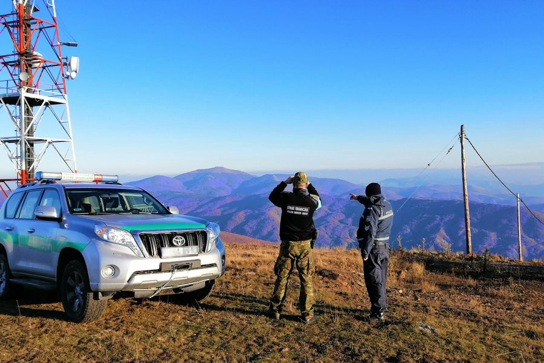
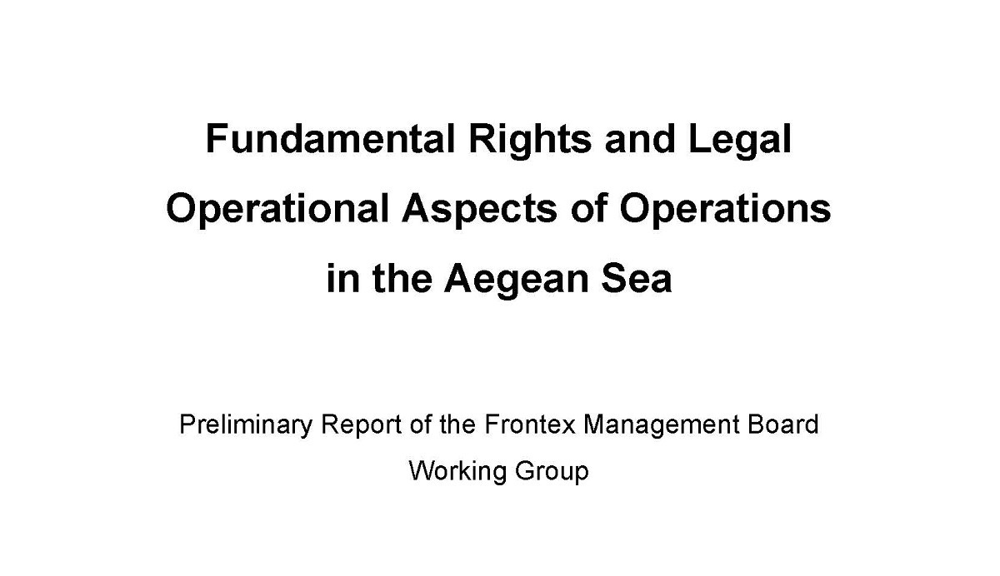
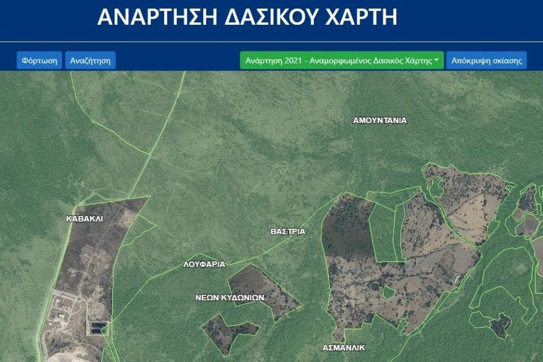
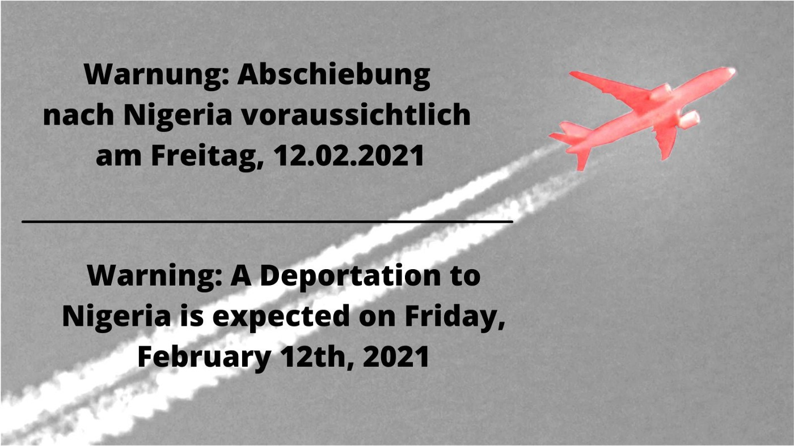

### AYS Daily Digest 4/1/21: Frontex Under Fire \(Again\) for Lack of Accountability
#### Frontex failed to provide information on three incidents identified by the Working Group / on the misconceptions about asylum seekers on the Canary islands/ After an 11 year battle with the Home Office, an activist wins fight to stay / Info on workshops, screenings, reports & more

Photo source: Frontex Twitter
#### **FEATURE:** Frontex working group urges transparency

The civil liberties monitor ‘Statewatch’ [published](https://www.statewatch.org/news/2021/february/frontex-management-board-pushes-back-against-secrecy-proposals-in-preliminary-report/?fbclid=IwAR1iRVsy8QDQEOxInhJORopyPFrvcSE8f9kt__JxJ4ONpofEzR0yDuSOnzw) the preliminary report of Frontex’s Working Group as the EU border agency finds itself under fire for alleged involvement in pushbacks of asylum\-seekers in the Aegean Sea\.

Photo: Statewatch

Frontex’s Management Board had [established](https://frontex.europa.eu/media-centre/news/news-release/frontex-welcomes-establishment-of-management-board-working-group-z1aFSC) the Working Group in November of last year to review and update the so\-called ‘Serious Incidents’ reporting mechanism, which ensures proper reporting of potential violations of human rights during Frontex operations\.

The report examines 13 incidents of pushbacks in the Aegean in which Frontex may or may not have been involved\. In a [press release](https://frontex.europa.eu/media-centre/management-board-updates/conclusions-of-the-management-board-s-meeting-on-20-21-january-2021-on-the-preliminary-report-of-its-working-group-on-fundamental-rights-and-legal-operational-aspects-of-operations-in-the-aegean-sea-GnFaIc) put out by the Management Board last month concerning the Working Group’s report — which at that time had not been publicly released — the Board noted that eight of the incidents could be closed, and that “on the basis of the information provided, it could not establish evidence of fundamental rights violations\.” The five other incidents required additional scrutiny, the Board said\.

However, the Management Board expressed its frustration at Frontex, saying it was “very concerned that the Agency missed to provide information on three incidents identified by the Working Group in time, so that the Working Group could not yet draw any conclusions with a view to certain cases\.”

One of the main concerns in the preliminary report is Frontex’s Serious Incident Report \(SIR\) mechanism, which the agency planned to classify as RESTRIENT UE/EU RESTRICTED \(the lowest level of EU Classified Information, EUCI\) and send the reports to be handled by the Frontex Situation Centre\.

The Working Group pushed against this, saying that there should be no blanket classification of incidents, and instead should be made on a case by case basis and “depend on the facts\.” Additionally, the report said that SIRs involving alleged violation of fundamental rights should be directly reported to the Fundamental Rights Officer, not the Situation Centre\.

> Statewatch noted that the introduction of a rigid classification system of SIRs could hinder access to the reports by journalists and civil society organizations, who can submit formal requests to review them\. 

The Working Group recommended Frontex establish a “compliance centre” within the Fundamental Rights Office to safeguard whistleblowers\. The report urges the agency to introduce a new culture “in which failure is acknowledged and addressed, in order to create awareness and sensitivity of possible misconduct\.”

For now, though, Frontex seems more excited about a [swanky new office](https://twitter.com/matthimon/status/1357383858057019394) in Warsaw than accountability and transparency\. By 2024, the agency wants to build a 70,000 square meter office complex, 9–10 stories high, with space for 2,000 employees and a two\-level underground parking garage for 1,200 cars\. The projected cost? A mere 140 million euros\.

For those interested, the Working Group’s full report can be accessed [here](https://www.statewatch.org/media/1814/frontex-wg-push-backs-preliminary-report.pdf) \.

■■■■■■■■■■■■■■ 
> **[yashamac](https://twitter.com/yashamac1) @ Twitter Says:** 

> > 140 people fleeing the "unimaginable horrors of Libya" (UN) intercepted by Libyan vessel supported by Frontex aircraft, monitoring by Radio Radicale 

> **Tweeted at [2021-02-03 23:12:11](https://twitter.com/yashamac1/status/1357104628949790721?fbclid=IwAR1ze_QvKVWjcdjyH1BaRYiPbGfiShBNUNCjyB3eeQUqEo-iOuPf1AC4mSw).** 

■■■■■■■■■■■■■■ 

#### SEARCH AND RESCUE AT SEA

Report on Central Mediterranean actions in past 2 weeks:

[](https://l.facebook.com/l.php?u=https%3A%2F%2Fsosmediterranee.com%2Feyes-on-the-central-med-12-nearly-450-people-rescued-at-sea-amidst-two-tragic-shipwrecks-claiming-60-lives%2F%3Ffbclid%3DIwAR1aAQcaVP5Kvdx_xyR8XQj6PcEN8X4c8Nfn58qZH8lg1qhDSjd4EvEtQCU&h=AT2sbikE_rhBUI4D2qGSSTfqsfabColCUefZJlLK2_mgq7-Hcb6HyutJ1zRAn3ibg8QKn4Y_cds5uBMXk6Wm4rYyeZKurLjBWBfjlbs_SwSn8GMm_6DT5IlGU6WpOW1P8LwibP17XInxLw&__tn__=R]-R&c[0]=AT3ICzeHPC8UCMvrhnSIMdPOQK990BHkfYLjuBW1L0g-ESAPuPzkcjx7_f5oYAIngO-ofUK1H7KfTndlvlsEcyOrhM2PPneTUJDFq_vWqj-_ZBUODeLDR0Z8KEqOtFxmvBPyr-lJMjU83tE1nyUL-HLKBfWkCajM9jULLtzxxM_aOOmTRTbuM9Rx3rEfMLcah2u5qLEQI4dCkjsPSg)

At the same time, more and more actions leading to the return of people to detention in Lybia, funded and organised by the EU, are taking place, not without fatalities\. 2 more young lives were reportedly lost, as 2 children’s bodies washed up in the Libyan coast\.

■■■■■■■■■■■■■■ 
> **[Seebrücke International](https://twitter.com/Seebruecke_intl) @ Twitter Says:** 

> > CN Death
While the #OceanViking and the Astral are now joined by the #OpenArms on their way to the search and rescue zone, yesterday 2 children's bodies washed up in Libya and over 100 people were intercepted at sea by the so-called Libyan Coast Guard and taken back to #Libya. https://t.co/WopokMicTx 

> **Tweeted at [2021-02-04 16:37:22](https://twitter.com/Seebruecke_intl/status/1357367654215016453?fbclid=IwAR0v3nYVWb6pUUBupjMxOhLMmUep31_9JpqA-gflJTiJU1PhFu7jUqrozDk).** 

■■■■■■■■■■■■■■ 

■■■■■■■■■■■■■■ 
> **[angela caponnetto](https://twitter.com/AngiKappa) @ Twitter Says:** 

> > #migranti Aggiornamento: 2 gommoni soccorsi da #OceanViking al largo delle coste libiche. Altra imbarcazione con 110 segnalata stamane da @[alarm_phone](https://twitter.com/alarm_phone) riportata in #Libia. Altre 4/5 imbarcazioni avvistate da aereo Mooonbird @[seawatchcrew](https://twitter.com/seawatchcrew) ancora in mare. Oltre 300 a #Lampedusa 

> **Tweeted at [2021-02-04 17:24:34](https://twitter.com/AngiKappa/status/1357379535818358793?fbclid=IwAR0P0zRletHTroQWm79DtatQOZXB2F7Z9Z-Js5ZlJ0nvw8pevW6MKBCoFJQ).** 

■■■■■■■■■■■■■■ 

#### GREECE
### New RIC for Lesvos, MSF goes on strike, protests in Ritsona

■■■■■■■■■■■■■■ 
> **[DunyaCollective](https://twitter.com/DunyaCollective) @ Twitter Says:** 

> > Tmrw @[MSFgreece](https://twitter.com/MSFgreece) workers go on strike for 3h on #Lesvos in front of MSF office in Mytilini. Employees are facing insecurity with no extension of contracts &amp; dismissals. Working conditions in NGOs are an important issue that we should also pay attention to.

#LeaveNoOneBehind https://t.co/wGo5Y9PEQP 

> **Tweeted at [2021-02-04 11:03:25](https://twitter.com/DunyaCollective/status/1357283614027825152).** 

■■■■■■■■■■■■■■ 

Members of MSF Greece on Lesvos are on strike today to protest their working conditions, according to the [Dunya Collective](https://twitter.com/DunyaCollective/status/1357283614027825152) \. Workers there are facing insecurity with no extension of contracts and dismissals\. They will reportedly gather outside the MSF office in Mytilene to protest\.

There is much more to protest on Lesvos today\. The municipal council of Mytilene voted in a meeting late Wednesday evening to establish a new reception and identification centre \(RIC\) for asylum\-seekers\. The newspaper [_Ekathimerini_](https://www.ekathimerini.com/261999/article/ekathimerini/news/mytilene-municipal-council-votes-to-build-new-closed-migrant-enter?fbclid=IwAR11c3ftyzE2Qdvf6Dp2gy16xylIhIr_qwBWiP5lDCNVI4YN7gGE3c65KrY) reported the centre will be small and far from the city centre, but said the decision did not specify the exact location or capacity\.

“We propose the creation of a controlled temporary center for the needs of registration, identification and asylum examination, away from the urban fabric and residential area and which will in no case have the character of superstructure,” the text of the [decision](https://www.politikalesvos.gr/quot-apofasi-orimotitas-quot-i-quot-prodosia-quot-to-psifisma-gia-ti-nea-domi-kai-oi-antidraseis/?fbclid=IwAR1HGqDFW3HVngwJQzXqh9G3VJhQR-40ITVL4lh8Ksyq8o-WZFIwHuOUV90) reads, noting that “it is imperative to continue the strict control of the activity of the NGOs\.”

According to the local media outlet [Stonisi](https://www.stonisi.gr/post/14750/gyrw-gyrw-dasos-kai-sto-meson-kyt?fbclid=IwAR3s2XN_QEzcpQvaPr-qm-AvJs0Cjqx9Kuu8v6uYfbGm0fmHKqBHOj6W2VA) , the new RIC will be built in a forested area\. The article also reported the structure will accommodate 5000\+ guests in an area of ​​600 acres\.

Forested area where the new RIC will supposedly be built\. \(Source: Stonisi\)

The Council’s decision noted the importance of preventing fires in the new RIC, so it is unclear why the government has decided to construct a camp in a heavily forested area\.

Migration Minister Notis Mitarakis described the decision as “positive vote,” adding that it is one of the measures that will “leave \[the migration crisis\] behind,” Ekathimerini reported\.

In Ritsona camp on the mainland, resident\-led protests continue for the third day\. Asylum\-seekers are protesting their delayed asylum applications\. Many have been waiting years for a response\.

■■■■■■■■■■■■■■ 
> **[Parwana Amiri پروانه اميري](https://twitter.com/parwana_amiri) @ Twitter Says:** 

> > Third day of protest in Ritsona camp , asking for equal right in performance of asylum procedure.
We are put in the middle of an industrial area ,that in three days of protest in presence of all communities we are facing riot police. 
#FreedomOfMovement 
#LeaveNoOneBehind https://t.co/esxhY2WvGK 

> **Tweeted at [2021-02-04 20:14:17](https://twitter.com/parwana_amiri/status/1357422244440530947).** 

■■■■■■■■■■■■■■ 

“ID and Passport for all and \#FreedomOfMovement should be a right\!” camp resident and activist Parwana Amiri wrote on [Twitter](https://twitter.com/parwana_amiri/status/1357227992175570944) \.

On a potentially positive note, _Ekathimerini_ reported a new plan for migration and refugee integration has been drafted\. The current program, Helios, is widely considered to be inadequate by NGOs and [UNHCR](https://www.unhcr.org/en-us/news/briefing/2020/6/5ed603924/greece-must-ensure-safety-net-integration-opportunities-refugees-unhcr.html) alike\. According to _Ekathmerini_ , currently 4,500 asylum applications are processed per month, of whom four in 10 are approved\. Once approved, refugees need to integrate into society and find employment in a country where they may not speak the language\.

In more grim news from the sea, [Mare Liberum](https://twitter.com/teammareliberum/status/1357304335311462401) reported the Turkish Coast Guard had rescued three asylum\-seekers on a small islet near Izmir\. They had reportedly been abandoned there with lifejackets by the Hellenic Coast Guard\.

Job alert\! Samos Volunteers is looking for a Volunteer Coordinator to join their team\. More information about the position can be found on their [website](https://www.samosvolunteers.org/volunteer-coordinator) \.

#### SERBIA
### Visual history of Serbia in Balkan Route

■■■■■■■■■■■■■■ 
> **[Border Violence Monitoring Network](https://twitter.com/Border_Violence) @ Twitter Says:** 

> > SERBIA AS A TRANSIT COUNTRY – A TIMELINE

This timeline provides a graphic overview of Serbia becoming part of the buffer zone of the EU in regards to curbing migration. 

[borderviolence.eu/serbia-as-a-tr…](https://www.borderviolence.eu/serbia-as-a-transit-country-a-timeline/#more-16793) https://t.co/3Vznh8baTz 

> **Tweeted at [2021-02-04 17:42:49](https://twitter.com/Border_Violence/status/1357384128946135055).** 

■■■■■■■■■■■■■■ 

The [Border Violence Monitoring Network \(BVMN\)](https://www.borderviolence.eu/serbia-as-a-transit-country-a-timeline/?fbclid=IwAR3s2XN_QEzcpQvaPr-qm-AvJs0Cjqx9Kuu8v6uYfbGm0fmHKqBHOj6W2VA#more-16793) published a visual timeline of Serbia’s history in the Balkan migration route, beginning with visa liberalisation between Serbia and the EU in 2009 until the present day\.
#### BOSNIA & HERZEGOVINA
### Discombobulated IOM

IOM in Bosnia released its [“Crisis Response Plan”](https://reliefweb.int/sites/reliefweb.int/files/resources/2021_Bosnia_and_Herzegovina_Crisis_Response_Plan_2021.pdf) for 2021 where it outlines its proposal for addressing the migrant situation this year\. The organization registered 15,053 new arrivals into the country up to November 2020, and confirms what is well known, that there are some 9,000–10,000 people on the move in Bosnia at any given time\.

“Thus far, the BiH authorities have struggled to adequately respond to the basic needs and human rights of migrants in the country,” IOM claims, adding that the current situation “has exposed the country’s complex governance system\.” After a long term project of the UN agency in the area, in 2021 some things should have been approached accordingly by now, so we are a bit puzzled as to why they are stating the obvious at the time when the situation they were to assess and address has exacerbated to a worrying extent\.

Further in their report they express worries due to a rise in **xenophobia and nationalist rhetoric used by politicians and the media** against asylum\-seekers, fueled, the report says, “by a lack of sense of control over political and migration management decisions in \[local\] communities and socioeconomic issues brought on by the COVID\-19 pandemic\.”

The overall budget of IOM in Bosnia and Herzeegovina for 2021 totals $47,100,000 aimed at a target group of 57,500 people\.
#### CROATIA
### Italian MEP responds about run\-in with border police

The Croatian media outlet [‘Telegram’](https://www.telegram.hr/politika-kriminal/eu-zastupnik-za-telegram-otkriva-detalje-o-incidentu-s-hrvatskom-policijom-laz-je-da-smo-htjeli-prijeci-ilegalno/?fbclid=IwAR01Dj8Wc-snBQQZBvKBF1WYouAuEFP3n-65oX_7SwBB_Q6A_peG8sKVVtU) interviewed one of the Italian MEP’s stopped by border officials at the Bosnia\-Croatia border last week\. Brando Benifei, who has served as an MEP since 2014, said he and his colleagues were “very disappointed” by their treatment at the border\.

“We were far from the border when we were blocked and we did not want to cross it illegally\. The government knew that, the police knew that,” Benifei told the media\. He said the group had informed the Croatian ambassador to Rome of their visit\.

Croatia’s Prime Minister Andrej Plenković [protested](https://www.total-croatia-news.com/politics/50302-croatian-pm-protests-to-ep-president-over-incident-involving-italian-meps) on Wednesday to the European Parliament over the MEP’s visit, writing on [Twitter](https://twitter.com/AndrejPlenkovic/status/1356915274713358337) that the four were trying to “provoke an incident with disrespect for Croatian laws and institutions\.”

> “We were expecting explanations for what happened, for preventing us from doing our job\. Instead, we received unfounded insulting comments,” _Benifei said in return\._ 

We invite everyone to keep in mind the best interest of the people on the move when it comes to advocacy, actions and activities on the field, given that — if framed or executed with even the slightest fault — it could damage their wellbeing and other focused and propulsive efforts in public and international advocacy done to change the current practices and treatment\.
#### SPAIN
### Status quo, false news and deportations on the Canary islands

Contrary to what the right wing groups and some media spread as alaring news, the number of criminal acts in Spain and in the Canary islands has maintained low, the officials have stated\. I the Canary Islands, they report having registered 11,9% criminal offences less than in 2019 and a general decline in criminal activity when compared to the past 4 years\. The data reflects that Canary islands are not going through any exceptional period of endangered security, as some have reported, the authorities stated\.

_Find out more about the misconceptions about asylum seekers on the Canary islands [here](https://l.facebook.com/l.php?u=https%3A%2F%2Fmaldita.es%2Fmalditobulo%2F20210202%2Fbulos-desinformaciones-crisis-migratoria-canarias%2F%3Futm_source%3Dtwitter%26utm_medium%3Dcompartido%26utm_campaign%3D33%2520bulos%2520y%2520desinformaciones%2520sobre%2520la%2520crisis%2520migratoria%2520en%2520Canarias%26fbclid%3DIwAR0GEcwbLrRusC2_35sFNh5Qr84M9PkVr7T7aAeT0umfpO8yp9OX7thXWC8&h=AT1baMHir5xuNedFHHCcYP2WleisUGZ1y8s2Fxodc8SfkooLKaLhNnqUFSHwzCfY-YOk47GZTkckZpv2GwH80KB6o_mhmH3gR2q40B_j8lWVmmFv2_TTrbMX9q0ZDy0HQLKwv0v2L31-7w&__tn__=R]-R&c[0]=AT20C2hTkgJYwNjjxXhun6-D-fcOZNxkoR2VWN7uOzTDKKtLDWLz5-IF9vigpLjB5HmkZ_YVqfnaF7_EjDixmnp6zU7SOn3TfT4wP96Rjq_3YDulOt3MkQRVXg-2mauhLZX94TJU-A8j2juwI8s2y0I1LOe9kFzWehaMOQ-Rw8FfOjGdN1lmLP_MGbeZickewNgqCkj8W4lcdsQQ8g) \._

The Spanish head of Migration explained that “a very high percentage of those who are arriving are **likely to returned** to their countries of origin, because there are return agreements and they have the obligation to welcome them back”, but with the pandemic that has closed borders “the rate of return is clearly very slow, it is a reality and that has generated a problem in the Canary Islands”\. From all the statements in the [media](https://www.lavanguardia.com/vida/20210203/6219232/escriva-espera-estabilizar-canarias-7000-migrantes-repartidos-5-islas.html?fbclid=IwAR0VRrfsak_3VLZS1N9Twp01dWadSs5tbMKXY_s6mzb7SleaETjdq33TEJ8) and the state of things on the Canary Islands, the two arguments seem to mean people are being detained until further notice, when they would be deported, so the argument about the violence and hopes about being able to express the intention to seek international protection are both irrelevant for the official perspective\.

■■■■■■■■■■■■■■ 
> **[Léa Masseguin](https://twitter.com/lea_masseguin) @ Twitter Says:** 

> > À Grande Canarie, plusieurs centaines de Marocains, arrivés sur l’île en bateau, s’entassent dans le collège Léon, transformé en camp pour migrants. #Canarias https://t.co/R3na70X45D 

> **Tweeted at [2021-02-04 18:13:04](https://twitter.com/lea_mssg/status/1357391740571947008?fbclid=IwAR3F0kc2m8Pb7rjHypTmuEPEM6xPzPvEuwAxyKSjyLRPXnZQhgrh9v5Ykds).** 

■■■■■■■■■■■■■■ 

#### GERMANY, SWITZERLAND
### Deportation flights

Source: Wikimedia Commons

Deportation flights continue in the EU\. One special deportation flight flew from Geneva to Ethiopia on January 27 in a move condemned by [various activist](https://coordination-asile-ge.ch/la-coordination-asile-ge-condamne-le-vol-special-de-geneve-vers-lethiopie-du-27-janvier-elle-appelle-les-autorites-genevoises-a-reagir/?fbclid=IwAR3wqE2Z2esE1DrGE7F7Dd4teBjvw82lGVrRdS6SJqkqRY9eIipeBKMOsZY) [and migrant solidarity groups](https://seenthis.net/messages/898233?fbclid=IwAR3bGK6FxIwY8SDZpiSnvF6LUYwJu9zN1A9n0_gSA1K2nFKepkV_Qszw8kc) \. Switzerland and Ethiopia signed a [controversial deportation agreement](https://www.swissinfo.ch/eng/deportations_ngo-slams-swiss-deal-to-repatriate-ethiopian-asylum-seekers/44024200) in 2018\. At that time there were around 1,500 Ethiopians living in Switzerland and some 300 pending deportation cases\.

In Germany, a deportation flight to Nigeria is [planned](https://www.facebook.com/Bayerischer.Fluechtlingsrat/photos/a.111278812226514/3924780264209664/) for February 12\.

Source: Bayerischer Flüchtlingsrat \(Facebook\)
#### FRANCE
### **At least 40 children living in extreme frost and heavy rains in the camps in the North of France**

Although the associations appealed to the Mayor to open accommodation centres, no permanent solutions were proposed and there was no improvement in living conditions in the camps: still **no sanitary facilities, very limited access to water, inadequate waste collection, and weekly eviction operations** \. These operations of harassment and destruction of shelters and people’s property are obstacles to child protection and violate children’s fundamental rights, Project Project Play — a grassroots organisation that works with displaced children in Northern France — reports\. Following the trial denouncing these practices and in particular the expulsion of 29 September, the judiciary declared itself incompetent to decide on the legality of this expulsion\. The judge denied the excesses of these harassment and expulsion practices, which are part of a generalized policy of rejection and non\-acceptance\.

> Together with 7 other associations, we have appealed against this decision, because the only acceptable policy is to offer dignified housing solutions to these children, these women, these men, none of whom have chosen to live in these conditions\. 

#### UK
### An activist wins right to stay in UK after an 11\-year battle

Sheffield’s Victor Mujakachi has won his right to remain after an 11 year battle with the Home Office\.

> “I’m vindicated\. They wanted me to go and be harmed in Zimbabwe” he said\. 

Victor has always fought for others, we fought alongside him and he won, [@SYMAAG](https://twitter.com/SYMAAG) reports\.
### Shining a light on the communities who have come to call Britain home

A series of online Q\+A sessions about the hostile ground policy and creation of the musical\. The first is called [_The Hostile Environment_](https://www.royalandderngate.co.uk/whats-on/on-hostile-ground/?fbclid=IwAR2pS85NmzieByKB0H3LJN5tBbdWot5DtDOu1gMG_K9oJSdOVi-FW0OUw5o) _: Impact and Legacy_ with panellists Amelia Gentleman \(journalist and author of _The Windrush Betrayal: Exposing The Hostile Environment_ \), Jun Pang \( _Policy & Campaigns Officer, Liberty_ \), Patrick Vernon OBE \(social commentator, cultural historian and Windrush justice campaigner\) and chaired by Juliette Foster \(journalist and news presenter\) \.

Tickets are FREE but please book your place in advance by [clicking here](https://tickets.royalandderngate.co.uk/76269/76270) \.

■■■■■■■■■■■■■■ 
> **[After Exploitation](https://twitter.com/AfterExpProject) @ Twitter Says:** 

> > Today we're releasing data, obtained with @[4refugeewomen](https://twitter.com/4refugeewomen), that shows nearly 3,000 potential trafficking victims were detained since January 2019. 

'Detention Gatekeeping' failed to recognise indicators of trafficking in thousands of instances.

[afterexploitation.com/2021/02/03/sur…](https://afterexploitation.com/2021/02/03/survivors-behind-bars-nearly-3000-potential-trafficking-victims-detained-since-2019-nrm-immigration-status-lord-mccoll-victim-support-bill/) 

> **Tweeted at [2021-02-04 08:40:46](https://twitter.com/AfterExpProject/status/1357247717664317440?fbclid=IwAR1eXoS9mWJChW-Zh-GutwYaZUPAHiUZDznoFcLEXz2Ngd563tOSo_D1PIc).** 

■■■■■■■■■■■■■■ 

For those wishing to get more active in supporting and advocating for the rights of people in need for international protection, some more workshops are being prepared, open for everyone:

■■■■■■■■■■■■■■ 
> **[Mahlea Babjak](https://twitter.com/MahleaBabjak) @ Twitter Says:** 

> > Get involved in our upcoming workshops on migrants' rights, which aims to be accessible for all migrants. If you have a limited understanding of migrants' rights &amp; want to better support migrants in your community, you would also be very welcome to join. Please share! https://t.co/HqOCv5tjU2 

> **Tweeted at [2021-02-04 17:08:10](https://twitter.com/MahleaBabjak/status/1357375407851532290?fbclid=IwAR1hDvWRr6aW4u32Y3dGj34_YHatA5vvV7uErvwp9RiVCkPaJ3a1FAXh1hY).** 

■■■■■■■■■■■■■■ 

#### WORTH WATCHING
- 12th Feb: screening of new documentary about Calais jungle:

[](https://l.facebook.com/l.php?u=https%3A%2F%2Fwatch.eventive.org%2Food%2Fplay%2F6012deea9e020f314f2bdccf%3Ffbclid%3DIwAR3J7XCIa8s0U03Hkm8WbjnoIFBd0CRuaB5QCpOx7Ywk6fVHl43m2J33pSI&h=AT3eayJMpgjGCY4aXJ4ltIGDVXzfk0aqWbgyyxKSLaDQvxFHAZH-ykRE7EjagXReABmFWAfAgCros7imdLGNwOQrQwRnDJ4_I-1S7gi18oygRkuE-SxwnL2InqGVkWCxMA&__tn__=%2CmH-R&c[0]=AT1e_-j99SkRg1vHyFFR4sfra8UQ4Am1Id3I8zHNxdvKTk1A4xbyq90M_VfzQ77knOUOwIIcV5QZeJkAZLKVFyqls3wr0yl6_xFXTx-Wta0CcERGQ6Ik2QbcEx71CoWbHnaucvPRU-TatcHuGK8dUQMZefMPp1Xs-3kv7C3nWKa2MrP1xLzz0HvEflVTHHUnuEjM89pmiWugKQMAMA)

**Find daily updates and special reports on our [Medium page](https://medium.com/are-you-syrious) \.**

**If you wish to contribute, either by writing a report or a story, or by joining the info gathering team, please let us know\.**

**We strive to echo correct news from the ground through collaboration and fairness\. Every effort has been made to credit organisations and individuals with regard to the supply of information, video, and photo material \(in cases where the source wanted to be accredited\) \. Please notify us regarding corrections\.**

**If there’s anything you want to share or comment, contact us through Facebook, Twitter or write to: areyousyrious@gmail\.com**

_Converted [Medium Post](https://medium.com/are-you-syrious/ays-daily-digest-4-1-21-frontex-under-fire-again-for-lack-of-accountability-94a0470630e6) by [ZMediumToMarkdown](https://github.com/ZhgChgLi/ZMediumToMarkdown)._
