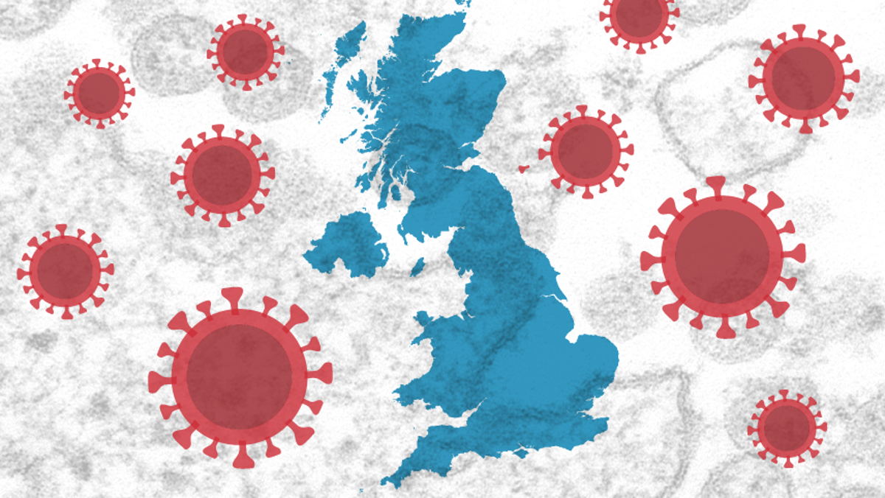
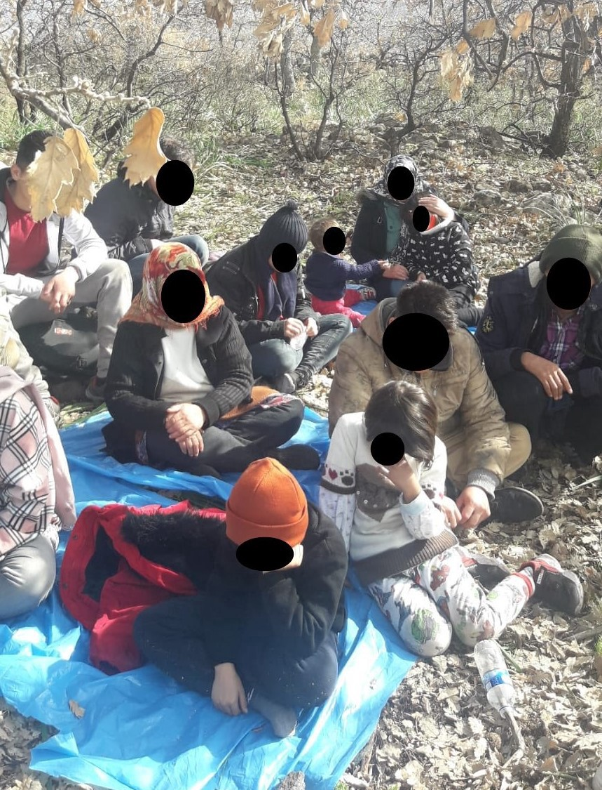
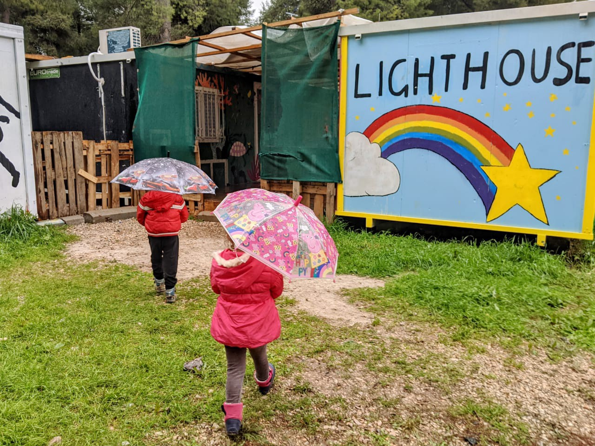
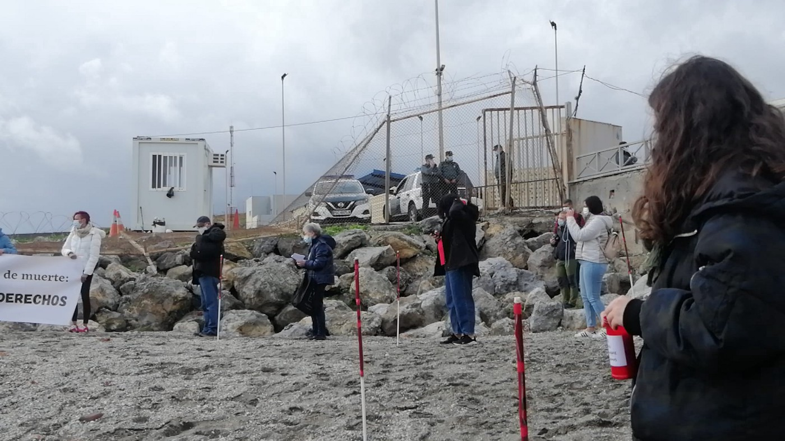
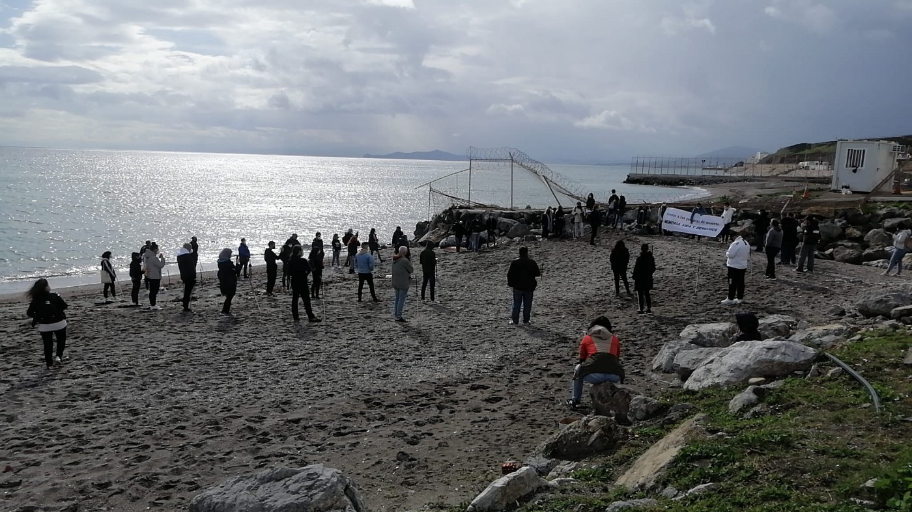
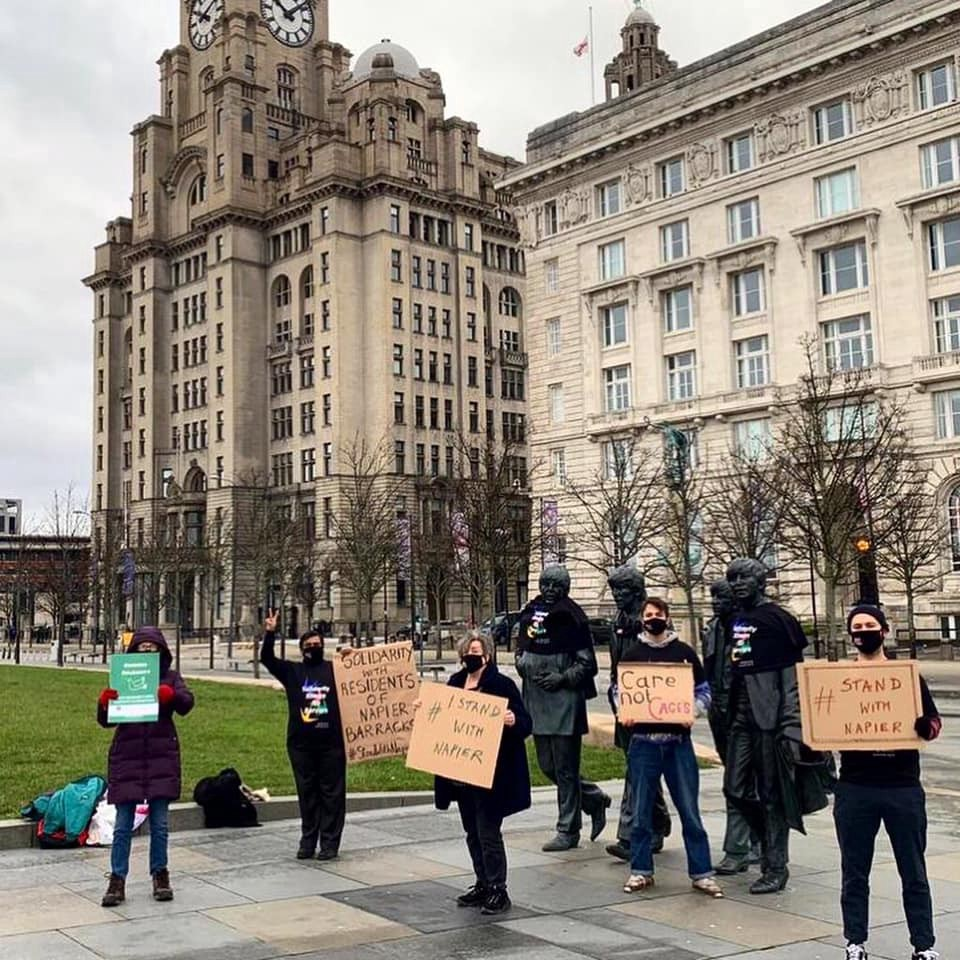

### AYS Daily Digest 08/02/21 UK: Undocumented people to receive vaccine in hostile environment

[Are You Syrious?](?source=post_page-----b99d3035b087--------------------------------)

[Feb 9](ays-daily-digest-08-02-21-uk-undocumented-people-to-receive-vaccine-in-hostile-environment-b99d3035b087?source=post_page-----b99d3035b087--------------------------------) · 9 min read

_Big weekend for people trying to escape Libya // Important message from Babel: Migrants’ mental health // Canary Islands camp flooded with sewage // more…_

### FEATURE: Hostile environment stands in the way of undocumented people receiving COVID\-19 vaccine in UK

The Government said on Monday that all migrants will be eligible to get the COVID\-19 vaccine, without risk of deportation\. A [Government Spokesperson](https://www.reuters.com/article/health-coronavirus-britain-immigrants/all-migrants-living-in-uk-eligible-for-covid-19-vaccine-idUSL8N2KE2GU) said:

> _“Those registered with a GP \(General Practitioner\) are being contacted at the earliest opportunity and we are working closely with partners and external organisations to contact those who are not registered with a GP to ensure they are also offered the vaccine\.”_ 

The vaccine is free for everyone\. Of course, receiving [the vaccine](https://www.bbc.com/news/uk-politics-55978334?fbclid=IwAR0vSl63eO7ZQpi1QWMsUswh-1ixuwF6qMuo_cGn1PdSOMwaiP9OVJ7o2_w) does not imply amnesty, so if you were found sometime after receiving the vaccine, then you could still be deported\.

Many human rights organisations and charities working with refugees are saying this is going to be an uphill battle, given the hostile environment migrants live under in the UK, fueled by racism and a longstanding belief that they cannot trust government authorities\. [Steve Valdez\-Symonds](https://twitter.com/stevesymondsAI/status/1358718452748451841) , Amnesty UK Director, said:

> _“Important but inadequate\. Having so long deterred access to healthcare by using it as a tool of immigration policy, now woefully insufficient to publicly announce that access will be safe\. Far more effort is now required to ensure people can trust this\.”_ 

The [Status 4 All](https://statusnow4all.org/everyone-should-have-access-to-the-vaccine-but-this-reported-vaccine-amnesty-declaration-is-a-trap-and-wont-work/) Campaign said this:

> _“Today’s mainstream media coverage about a UK Vaccine ‘Amnesty’ misses the critical point: declaring that everyone can now get the vaccine does not stop the people who don’t have documents — and therefore don’t have full rights in the UK — from fearing they will be detained and deported at the hands of the Government’s Hostile Environment if they come forward\._ 

> _Throughout the COVID pandemic, Government commitment to its Hostile Environment policies has been demonstrated time and again\. These immigration policies actively undermine any parallel health policy attempt to drive undocumented people into the ‘herd’ that needs to be vaccinated\._ 

> _Status Now supports anyone who wants it, to get a COVID vaccine: to prevent people dying on the streets because, being without documents, they assume they are without rights and so fear accessing any vaccine\. However, people will not simply turn up now at GP surgeries just because the Government tells them to\. Deep mistrust understandably exists amongst many UK residents, citizens and non\-citizens alike\.”_ 

They go on to include the Privacy International’s recent report on how the UK government is tracking and tracing people\. They say the report has “ _profound implications for any strategies that rely on firewalls between e\.g\. health and immigration systems_ \.”

[Zrinka Bralo](https://twitter.com/ZrileB/status/1358700531275997185) , CEO of Migrants Organise, relayed a lot of important information and studies that show how hard it is for migrants to register with GPs:

> _“Many people, including undocumented migrants, are not registered with GPs, because they are \(illegally\) asking for two proofs of address\. Lots of people for all sorts of reasons do not have proof, but try arguing with the GP’s receptionist and all you get is ‘computer says NO\.’ \(Homeless people are struggling too\) \._ 

> _NHS is sharing confidential patients’ data with the Home Office and charging people for care\. Many people entitled to it, stopped seeking care because they are being a\) racially profiled and b\) wrongful charged\. The only solution is to stop using NHS for border control\.”_ 

Migrant rights lawyer [Jacqueline Mckenzie](https://twitter.com/JacquiMckenzie6/status/1358724140895768576) made the good point that if people cannot trust going to get a smear test, mammogram or dentist’s appointment, then how are they going to trust this vaccine administration? [The Hostile Environment](https://twitter.com/migrantsorg/status/1358725317075103744) has failed public health long before now\.
### Ultimately, the only way to get all undocumented people vaccinated is to end the Hostile Environment\.
### SEA
### At least 10 boats were pushed back to Libya in 4 days

Many people were trying to escape the horrors of detention in Libya over the weekend\. While 422 people made it safely to Italy, many more did not\. As many as10 boats were intercepted by the Libyan Coast Guard and brought back\. [IOM Libya](https://twitter.com/IOM_Libya/status/1358835553848934411) said _“In the period of 2–8 February, 1,487 migrants were rescued/intercepted at sea and returned to Libya\.”_ Learn more [here](https://thecivilfleet.wordpress.com/2021/02/08/422-refugees-make-it-to-safety-in-italy-after-a-weekend-of-mass-escape-attempts-from-libya/?fbclid=IwAR0UlLt8mCnhH3MkkHQi6GKPDZQQLjzhZVYEk7Y5pwatvX3QClBjTb4CGNA) \.

Update from [SOS MEDITERRANEE](https://www.facebook.com/SOSMEDITERRANEE/posts/3712559745517973) : _“Italian health authorities have started testing /those/ rescued on Ocean Viking for coronavirus before going ashore in Augusta, Sicily\. Ocean Viking crew will be heading into a mandatory 14 day quarantine starting today\.”_
### GREECE
### Important message from Babel: Migrants’ mental health

[All quoted from Babel](https://babeldc.gr/en/psychosocial-support-for-patients-with-covid-19/?fbclid=IwAR35b90dCKC8B5ZC_jgMS3wlmO70UX3yqTCiWczbCMS7ov5RYWWgZS-o9Ws) : **“If you or someone close to you is infected with COVID\-19, or if you feel overwhelmed by the risk of Covid\-19 because you are experiencing other health problems,** it is likely that you might suffer not only physically but also mentally\.

It is reasonable to feel:
**1\. Fear and anxiety\.** It is quite common to feel anxiety and fear for yourself or to worry about your loved ones regarding the possible manifestation of the disease and its transmission, as well as regarding the severity of the disease and how it could develop\.

**2\. Anger and irritability\.** Being isolated or in quarantine, yourself or your loved ones, can lead to feelings of tension and irritability\. In some cases, you may also feel angry with the medical services that forced you into quarantine or with other people if you think you have been exposed to the virus due
to someone else’s negligence\.

**3\. Stigmatization\.** If someone is infected with SARS\-CoV\-2 or has been exposed to the virus, she/he may feel stigmatized by people who are afraid they will get infected from her/him\. Additionally, the family members of a person who is infected with CΟVID\-19 could be experiencing the same\.

If you feel fear, anxiety, sadness or irritability and these negative feelings persist or worsen, or if you suffer from difficulty sleeping, loss of appetite, panic attacks, **it may help to talk to a mental health professional\.** At **Babel** Day Center, **psychologists with the help of interpreters** can speak with you in **English, French, Bulgarian, Russian, Arabic, Kurmanji, Lingala, Dari and Farsi,** and in other languages\. **If you want to talk to us send a message:** 
• By email at **helpcovidbabel@gmail\.com** or at **babel@syn\-eirmos\.gr** 
• On WhatsApp **6985825032** 
• At **210–8616266** \(Monday to Friday, 09\.00–17\.00\)”

Manos Moschopoulos, who works for the Open Society, continues with a very informative thread about the political situation in Evros:

> _“A few months ago, Evros locals were arrested for holding refugees at gunpoint\. Back then, I wrote that the problem wasn’t that this government convinced them it was OK to aim their weapons at people\. The problem was that it made them feel that it was their duty to do so\. The government has spent a lot of time talking about ‘invaders’, of a ‘Turkish threat’, of how the leftist government was ‘ideologically opposed’ to border control and so on\. No wonder that the locals are now reacting angrily to suggestions of a new camp in their area\._ 

> _But this problem extends beyond Evros and the borders\. In Athens, one of the government’s MPs tweeted a photo with the Minister and suggested the city needs to be “lightened” of “populations who threaten social cohesion and peace\.” The Minister didn’t react to this\._ 

> _Overall, the government has made it impossible to build consent on migration management — even where it wants to build detention centers, or limit the rights of refugees and migrants\. But the EU still buys their promises that they’ve got it all under control\. They don’t\. Meanwhile, their rhetoric, once again, has fed a dangerous, nationalist sentiment which they cannot control\. I hope that conservatives looking at today’s scenes will \(finally\) realize the dangers of playing with fire for a handful of votes\.”_ 

Here are [some videos](https://twitter.com/maledictus/status/1358792857713319955) of the minister having problems upon arrival\.

### ITALY

Two quick updates from Info Migrants:
- _“ [Italian police](https://www.infomigrants.net/en/post/30112/italy-afghan-minors-found-hiding-in-trucks?fbclid=IwAR2VMbxEXxijcbaC7euxqQvyYhicBGjYGgTeooI0zQEpV-z-Yd-UyLU70oc) continue to report cases of underage Afghans discovered squeezed into trucks coming from the Balkans\. After youths were discovered in the northern Italian province of Monza and Brianza at the end of January, two similar incidents were reported by police in the area of Ravenna, in the north, and in the southern city of Caserta\.”_
- _“Authorities in Italy’s southern Puglia region are trying to fight the gangmaster system\. They have rebranded the migrant tent camp in the city of Foggia, a ‘Citadel of Hospitality’ to try and end exploitation\.”_ More [here](https://www.infomigrants.net/en/post/30113/foggia-migrant-tent-camp-to-become-citadel-of-hospitality?fbclid=IwAR2P-xpxvXMKmka2n8G_LfbKlsz-jdOGgu5f3rgqPk6L3yKA76akTP_eP6U) \.

### SPAIN

### Canary Islands’ camp flooded with sewage

According to El Pais _“The Canarias 50 barracks, one of the two enabled for the reception of immigrants in Las Palmas de Gran Canaria, was flooded this Monday morning with fecal waters\. The feces covered the esplanade where the tents have been installed and got to wet the inside of the tents, as can be seen in the videos sent to EL PAÍS by residents\. A problem in the sewerage, outside the center, is preventing sewage and rainwater from being channeled correctly and the camp, where about 400 Moroccans live, has already suffered two floods since Friday\. The fault is in the process of being solved with the City Council, according to a spokeswoman for the Secretary of State for Migration\.”_ More [here](https://elpais.com/espana/2021-02-08/se-inunda-de-aguas-fecales-uno-de-los-campamentos-de-migrantes-de-canarias.html?fbclid=IwAR0FDFv3xgmt29suiPwANMFzAi565kH5W3NI9XTQMRs081omL9_WpRzc6WQ) \.
### AUSTRIA
### Push\-Back Alarm Austria: new 24\-hour helpline against pushbacks at the border

On 8 February 2020, a new helpline launched to help people on the move register their asylum claims in while entering Austria\. AYS sources said:

> _“The helpline will provide people who want to apply for asylum after crossing the border in Austria an initial orientation and support them in establishing contact with the nearest police station\. For years, people entering Austria have been quietly and illegally pushed back across the border into Slovenia, even though they have clearly asked for asylum according to their own statements\. This practice is common along the entire Balkan route\. While the public and media focus is understandably on conditions at the Croatian\-Bosnian border, where serious human rights violations occur, the situation at the Austrian border is far less known\. The Push\-Back Alarm Austria initiative was triggered by two cases where persons \(in one case including minors\) asked Austrian police for asylum, but were denied their rights and instead handed over to Slovenian authorities and subsequently ended up in Bosnia\. One of these cases will be heard in front of the administrative court in Graz\. The initiators of Push\-Back Alarm Austria hope that, in addition to practical assistance for people on the move, the Austrian dimension of these abuses can be better documented and will become more visible\. Information about the helpline is available on Facebook in a number of languages\.”_ 

[Find out more about the helpline here\!](https://www.facebook.com/permalink.php?story_fbid=102954745166890&id=102220078573690)
### FRANCE
### 36 rescued in channel over weekend

According to Info Migrants _“On Saturday, February 6, the French operational and rescue center CROSS activated two rescue operations for a total of 36 migrants off the port of Calais\. That’s according to a press release from the Prefect for the Channel and the North Sea \(Préfecture maritime Manche et mer du Nord\) \.The first boat had 13 migrants on board, who were transferred on to the patrol vessel Themis\. Alerted by a cross\-Channel ferry to another small boat, the Themis took a detour to help a further 23 migrants in difficulty\. All were taken back to Calais\.”_ More [here](https://www.infomigrants.net/en/post/30136/french-authorities-rescue-36-migrants-in-channel-over-weekend?fbclid=IwAR2P-xpxvXMKmka2n8G_LfbKlsz-jdOGgu5f3rgqPk6L3yKA76akTP_eP6U) \.
### UK

### Worth Checking Out
- Check out [this event](https://www.facebook.com/events/3691224820966442/) **“How will COVID\-19 transform the global governance of migration and refugees?”** on Thursday, 11am CST\.
- Also read this interesting [piece](https://verfassungsblog.de/between-rule-of-law-and-reputation/?fbclid=IwAR0FDFv3xgmt29suiPwANMFzAi565kH5W3NI9XTQMRs081omL9_WpRzc6WQ) on **“Between Rule of Law and Reputation** 
**Frontex’s withdrawal from Hungary\.”**

**Find daily updates and special reports on our [Medium page](https://medium.com/are-you-syrious) \.**

**If you wish to contribute, either by writing a report or a story, or by joining the info gathering team, please let us know\.**

**We strive to echo correct news from the ground through collaboration and fairness\. Every effort has been made to credit organisations and individuals with regard to the supply of information, video, and photo material \(in cases where the source wanted to be accredited\) \. Please notify us regarding corrections\.**

**If there’s anything you want to share or comment, contact us through Facebook, Twitter or write to: areyousyrious@gmail\.com**

_Converted [Medium Post](https://medium.com/are-you-syrious/ays-daily-digest-08-02-21-uk-undocumented-people-to-receive-vaccine-in-hostile-environment-f695c5d25a7c) by [ZMediumToMarkdown](https://github.com/ZhgChgLi/ZMediumToMarkdown)._
