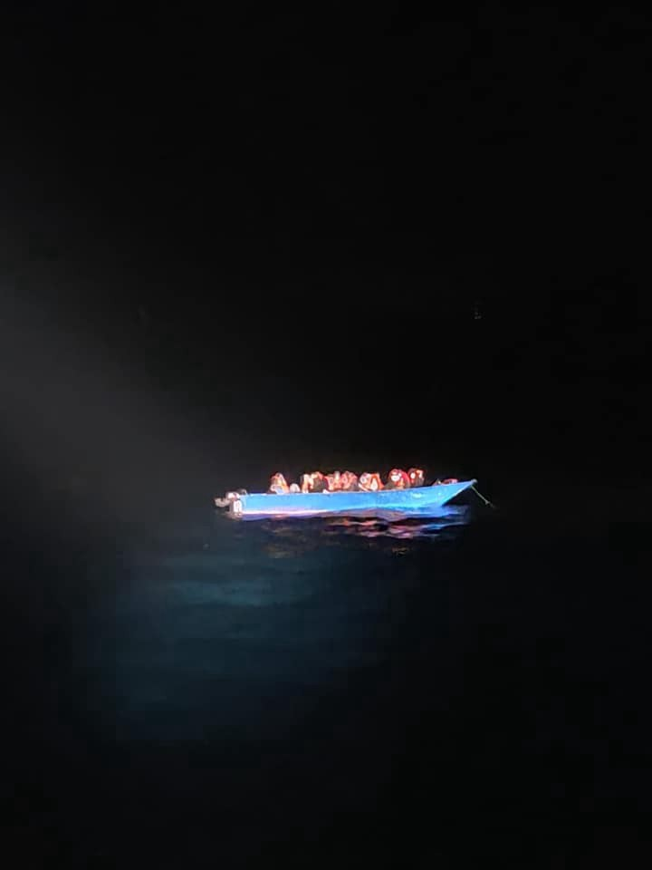
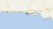
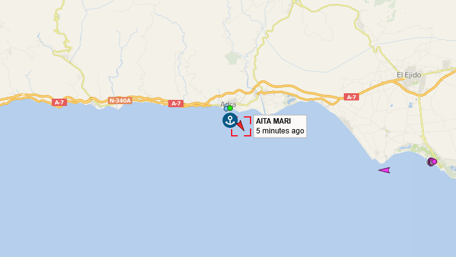
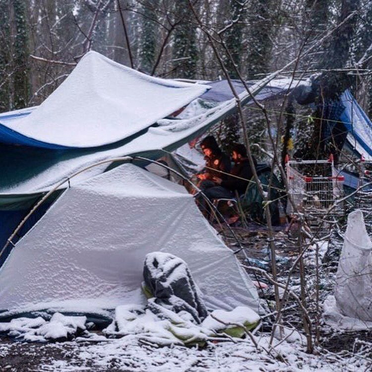
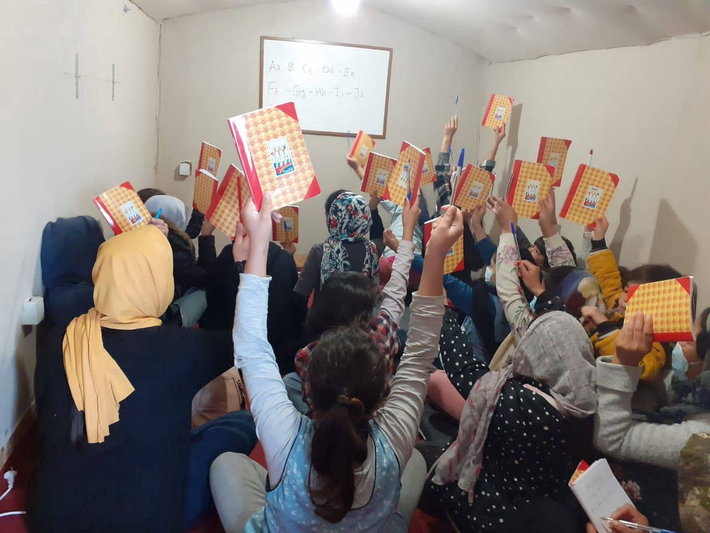

### AYS Digest 12/02/2021 — New rescues in the Mediterranean, while Libyan coastguard intercepts almost half of attempts
### Shocking treatment of migrants at Canary Islands // New pressures to investigate Frontex’s involvement in illegal pushbacks // Reports from the field in Greece and France // Detentions in Libya // and more…

[Are You Syrious?](?source=post_page-----bf0117f3a5d8--------------------------------)

[Feb 13](ays-digest-12-02-2021-new-rescues-in-the-mediterranean-while-libyan-coastguard-intercepts-bf0117f3a5d8?source=post_page-----bf0117f3a5d8--------------------------------) · 11 min read
### SEA

We have received news from [OpenArms](https://www.facebook.com/NewsfromtheMed/posts/1149366232183638) that a small wooden boat with 40 people on board, amongst whom a woman and a child, has been rescued by the NGO\.

Also yesterday, Tunisian patrol boats [intercepted a hundred migrants](https://twitter.com/JavierMartinr1/status/1360262694725632008?fbclid=IwAR1aoyUCZSqZRLr8W0jLNQmsILHPO3_Xc3hIorsnEoyea2dAfstKw1j9eYY) who intended to cross the Mediterranean in two rubber boats that had begun to sink\.

Unfortunately, we also have news that the Libyan coast guard [intercepts almost half of all boats directed to European shores](https://www.rnd.de/politik/libyen-kustenwache-fangt-fast-die-halfte-aller-bootsmigranten-ab-TRMYPAZ7XVLRU5ONOB4C5JW3VI.html?fbclid=IwAR2N4ElXbzk1xuo8Dv1mG24-LJQP3G8596UxqRCuUsX-UeFUuoKly0hQUAc) \. Thousands of people try to flee from Libya to Europe across the Mediterranean every year, and almost half of them were intercepted by the Libyan Coast Guard in 2020 and brought back to Libya\.
### Meteo Alert

Between today and next Sunday the Central Mediterranean will be hit by a [strong weather disturbance](https://twitter.com/RescueMed/status/1360135585768345601?fbclid=IwAR3Ke7V1ebYV_KzUa9gKKD4R0HOgs4YYP73OqV1T4fk9BYeNeaYxn5SHrU4) coming from the North, with waves up to four metres high\. DANGEROUS conditions for navigation\.

**Everyone, stay safe\!**
### SPAIN

### New rescue missions

AitaMari has left port in Adra, southern Spain, to head for the search and rescue zone off the Libyan coast and in the central Mediterranean\. Various inspections have repeatedly delayed the mission, which was originally planned for late last year, the NGO [announced today](https://www.facebook.com/NewsfromtheMed/posts/1149277592192502?__cft__[0]=AZVrL5r2I_uZkGBHdJGwwbQ_j6h98h_Vl0GolZtbeih1MQ6sJ8T63OTlcRvIM8iHkfKYmN_SM02kWFlvMO8o2KmGD7N7ix76N_-hjRoIXyxPGB_mFNGQSL69nlg4Y5s6IMvwLiUooaKuNsIGvTxrmM9zLqgJWCFuQcvFAKDir7uTwX2XVy1nwJ_y4g1tJATVN4TVj_ytJEwVwBYRDd31wPCB&__tn__=-UK-R) \. Currently, only the [OpenArms](https://twitter.com/Seebruecke_intl/status/1360294274596798464?fbclid=IwAR1Qq9qsWhf5cbWOvQCymnueWHzbYze4eCWdRLpWgJZEgE6Y-PhW25DUWcI) is in the rescue zone\.

Shocking news from Tenerife

We want to signal and denounce the shocking treatment that has been given by the Spanish Red Cross to the migrant minors who were on hunger strike to defend their rights\. [This happened in Tenerife](https://twitter.com/CIENOCanarias/status/1360322433853628426?fbclid=IwAR2cVr0_KtBOsLDMB93uJlftFylqusGI2jOPd-7jOb4o3n7jH-a1-IAwr-4) on Friday\.

Reception conditions on the Canary Islands [remain poor](https://www.ecre.org/atlantic-route-spains-blocking-of-migrants-in-the-canary-islands-causes-suffering-and-sparks-protests?fbclid=IwAR1Qq9qsWhf5cbWOvQCymnueWHzbYze4eCWdRLpWgJZEgE6Y-PhW25DUWcI) , including at a newly opened facility in Tenerife that is the largest in the islands\.

Poor living conditions, violence by local gangs, and the lack of prospects of transfer to the mainland sparks protests in Tenerife and Gran Canaria\. Further, a number of self\-harm incidents and attempted suicide were reported within the migrant community\. Four people have died on their lengthy journeys to the archipelago due to thirst and cold, raising this year’s death toll along the Atlantic Route to 22\.

The Canary Islands Government [believes it is necessary](https://www.efe.com/efe/canarias/portada/el-gobierno-de-canarias-insiste-2-600-ninos-inmigrantes-es-una-cifra-imposible-asumir/50001319-4463833?fbclid=IwAR1-8z0ly4tRVcpCVnewvje51oV4kEYN7XCk9WLG-jJq_5Ecs4O9takA1DY) to “clarify” or “adapt to reality” the current legislative framework for the guardianship of unaccompanied minors, which entrusts the autonomous communities with their care, in order to distribute throughout the country the more than 2,600 immigrant children in their care, a volume “impossible for any community to assume”, according to its president, Ángel Víctor Torres, who stated this on Friday\.

Twenty\-seven migrants [have demanded](https://cadenaser.com/emisora/2021/02/11/radio_club_tenerife/1613065996_435675.html?fbclid=IwAR3RJrsX5Bl_wqLYgt6CegNO6TH08Y_dA8Iq6Io-mJc48Q6PPnIqdEEOdCk) legal assistance to certify that they are minors\.
### EU and FRONTEX

Members of the European Parliament have [approved a report](https://www.ecre.org/meps-vote-for-respect-for-human-rights-at-the-eus-external-borders-amid-continued-revelations-and-increased-scrutiny-of-frontex/?fbclid=IwAR0JLu2SpElp3UK4UqjcJQ_Ne-uXNj0RwYx4VZHg-sAnx4kWeznccU7IWHY) calling for respect for human rights at the EU’s external borders and pushing for further investigation of Frontex’s role in the illegal pushbacks across the EU’s external borders\. The approval comes amid continued revelations of mismanagement and misconduct by Frontex and ongoing violations by EU Member States\.

> _The Frontex files revelations show that there are serious issues with the governance of the EU’s border agency that need addressing without delay”\._ 

Last December, Marko Gasperlin, chair of the management board of Frontex, had established a [Frontex working group](https://www.dw.com/en/frontex-protecting-the-eus-external-borders-at-any-cost/a-56551641?fbclid=IwAR33Vp14TmYmhuupQFzcsqmYr0qzuGta5Dvd1IeE3Onj97VyOT8ar0Q_Lq8) to look into these allegations\. According to him, eight cases of reported misconduct were disproved and a further five were still being examined\. The working group’s final report is expected to be published in late February\.

Amnesty International submitted a dossier titled [“Europe: Pushback Practices and their Impact on the Human Rights of Migrants and Refugees”](https://www.amnesty.org/en/documents/ior40/3669/2021/en/?fbclid=IwAR0FQACW_kV4Y5Lq9Cx5AH_1Mw7k9O_b34hNDH2Zo4_GEdupLfVxGy6gUAE) to the UN Special Rapporteur on the Human Rights of Migrants, which collects many of these instances of pushback practices\.

Meanwhile, the European Commission has announced the completion of its [first factual assessment on readmission cooperation](https://www.ecre.org/european-commission-publishes-findings-of-the-first-annual-assessment-of-third-countries-cooperation-on-readmission?fbclid=IwAR3rwCPjYvF7eikFJ4aVUPNC_OFFiADkvxX3iXv1Uy5nOaHO2qRckqHIkn8) \. It is based on quantitative and qualitative data provided by Member States and Schengen Associated Countries \(around 50 in total\) and data collected by Eurostat and Frontex on return and irregular arrivals\.

Aiming to further curb the new rise of migration from Europe’s neighbourhood, the European Union has [proposed a new agenda](http://www.ansamed.info/ansamed/en/news/nations/europe/2021/02/11/migrants-eu-launches-new-agenda-for-med-worth-7-bn_22daa8e0-baa7-4e46-a649-8af099cff3a1.html?fbclid=IwAR0zUuixLG6j2liZT5IDOcXZUgmMw4QyoFNAuDGTEfzQ_laF1sSOWIywY8Q) for the Mediterranean \(Algeria, Egypt, Israel, Palestine, Jordan, Lebanon, Libya, Morocco, Syria and Tunisia\) with a seven\-billion\-euro plan to

> _stimulate the economy of Mediterranean partner countries in recovery from the Covid crisis, as well as face political instability and **slow the causes of the push on irregular migration** , aiming at a green transition as well as young people and women\._ 

One cannot help but wonder what mechanisms will be considered legitimate in this effort to “slow the causes of push on irregular migration”, and what, if any, monitoring mechanisms will be put in place by the EU to ensure that human rights are respected at the local level\. It also reveals a rather old school and short\-sighted understanding of migration as being solely driven by push\-and\-pull economic factors\.
### UK

The UK Government has announced that everyone in the UK is entitled to receive Covid\-19 vaccination regardless of their immigration status\. However, as [migrantvoice](https://www.migrantvoice.org/home/editorials/interim-title-100221170224?fbclid=IwAR33Vp14TmYmhuupQFzcsqmYr0qzuGta5Dvd1IeE3Onj97VyOT8ar0Q_Lq8) writes

> _in order for everyone to come forward, including an estimated million undocumented migrants, they need to trust that the government will not use any information collected to take immigration enforcement action against undocumented migrants\. The government must introduce a system that is completely independent, with the sole aim of protecting public health and saving all lives\. People living in the UK without documents need to be assured that they will not be at risk of deportation by coming forward for the vaccine\._ 

### FRANCE
### A useful list of aid initiatives

As a newly arrived migrant in France, where do you turn to for food, warm clothes, accommodation or legal advice? [InfoMigrants has drawn up a list](https://www.infomigrants.net/en/post/30169/help-for-migrants-in-france-a-list-of-organizations?fbclid=IwAR2dnmil0x6Ydlo4t6Y3Oq_1yoLPWJPZn8Q9_qPppDbf1v3i8MtdczjB0U8) of some of the main NGOs and aid groups that can help make your life in France easier\.

Twice a week, [Care4Calais](https://twitter.com/Care4Calais/status/1360183415027490816?fbclid=IwAR2N4ElXbzk1xuo8Dv1mG24-LJQP3G8596UxqRCuUsX-UeFUuoKly0hQUAc) gos to distribute warm clothes, shelter and food packs in Dunkirk, 30km from Calais\. Most of those here are Kurdish — there are several families and even young children living in these awful conditions\.

### Evictions in Calais

[Constant evictions of makeshift camps](https://www.ecre.org/france-evictions-continue-amid-winter-emergency-while-council-of-state-allows-preventing-media-access/?fbclid=IwAR3rwCPjYvF7eikFJ4aVUPNC_OFFiADkvxX3iXv1Uy5nOaHO2qRckqHIkn8) and confiscation of people’s personal belongings continue in northern France despite the winter emergency\. The Council of State have dismissed complaints from journalists, effectively allowing the prevention of media oversight of police operations in the area\. [According to the Human Rights Observers \(HRO\)](https://www.theguardian.com/global-development/2021/jan/13/like-torture-calais-police-accused-of-continued-migrant-rights-abuses) collecting data on the human rights status of people in Calais and Dunkirk

973 evictions were conducted in Calais in 2020, with police confiscating and destroying belongings\. Reports of abuse, excessive force and violence have described children being teargassed, a person inside a tent being dragged by a tractor, and a man shot in the face with a rubber bullet from 10 metres /away/, hospitalising him for two months\. In December 2020 alone, 526 tents were seized and 41 arrests were made\.

The French national consultative commission on human rights, the CNCDH, recently visited Calais and Grande\-Synthe\. They have now released their statement, which strongly denounces the current approach which leads to the continuous erosion of human rights\. Read their press release [here](https://www.cncdh.fr/sites/default/files/21.02.11_cp_avis_situation_des_personnes_exilees_calais_et_grande_synthe.pdf?fbclid=IwAR1MTX7Gm8_pXmpOhs0rQzQdsVHtAoxT16irYymFoG8iEfubqVZtHCDEoWg) \.

In [this article](http://refugeehistory.org/blog/2021/2/12/a-recent-history-of-camps-in-french-migration-policy-part-2-encampment-and-eviction?fbclid=IwAR0pPEr2cjG3LugqjXJoLNtJsDkSlpKIiusBu_eBrW4ssabNbIiL7XVES3k) , the authors discuss a recent history of camps in French migration policy\.

the distinctive landscape of camps in contemporary France is the result of public policies which have made life precarious for people seeking asylum\. Barred from working by a law promulgated in 1991, asylum\-seekers are instead obliged to rely on state provision of asylum support and accommodation\. But this is hard to access and structurally inadequate, forcing numbers of exilés \(the term used in French to avoid the problematic categories of ‘immigrant’ and ‘refugee’\) onto the streets\. This is a deliberate policy choice\.
### GREECE
### Solidarity and reports from the field

We would like to share some pictures of the different self\-organized classes on non\-formal education that [StandByMe Lesvos supports through Moria Acadamia\.](https://www.facebook.com/SBMLesvos/posts/816611468931877)

> _There is huge demand for education in the camp and slowly we manage to help enabling more and more different classes\. Additionally a lot of students joining the e\-learning we offer in co\-operation with the university of Thessaloniki\._ 

Unfortunately, conditions in Moria2 camp are worsening\. The camp was hit [again with rain,](https://www.facebook.com/HopeProjectGreece/posts/2902674740013639?__cft__[0]=AZVonR6dKgRI5x5G4JhUttXADqTVhLWI5Tihwng2Wfpih-cGCrVeEw4TJdL3rQ0mlb1WUgKThjA98ygkwz6f2spVIf3-cyoMJdbn9mSD_FOE6QB3UcUs3szaQDjbrm0cISN0eb5tktI_y_mEA3NUt4VQQzInFqJmSVZsT2t03palVTPpxjqOl1lX67fC3mkaplpBVbfDN7o1VdmMpgkMdDhd&__tn__=R]-R) winds but also huge chunks of hail\. There is also [no electricity](https://twitter.com/Moria2news/status/1360339500342390786?fbclid=IwAR3gShHdgOs6diQZ5Lr6jcAXXZEjg6upuq3Uugv9dkZZqxRrTaMWpXau1m4) in Moria\.

We also share reports from the hellholes [Malakasa 1 and 2](https://twitter.com/MigrantsSoli/status/1360223230301241348?fbclid=IwAR2dnmil0x6Ydlo4t6Y3Oq_1yoLPWJPZn8Q9_qPppDbf1v3i8MtdczjB0U8) \.

Almost 3,500 refugees live in [the hotspot at Samos](https://twitter.com/rspaegean/status/1360203428450992130?fbclid=IwAR2cVr0_KtBOsLDMB93uJlftFylqusGI2jOPd-7jOb4o3n7jH-a1-IAwr-4) , which has capacity for 648\. This weekend it is expected that there will be a significant deterioration of the weather in Greece with very low temperatures, strong winds, rain and thunderstorms\. [Refugees in the hotspot said](https://twitter.com/rspaegean/status/1360305134954287105?fbclid=IwAR2qjkfoiJ5Y71T7CSABehFoMgqx4dHQF2VsM1kJEWhz-xuNctU1VM9y7FM) that they are not given sufficient food, including milk for their children and other items that they need\.

A [23\-day\-old boy](https://twitter.com/MSF_Sea/status/1360191099067842560?fbclid=IwAR1aoyUCZSqZRLr8W0jLNQmsILHPO3_Xc3hIorsnEoyea2dAfstKw1j9eYY) was born with a cyst in the back of his head and has difficulty breathing\.

“You can hear the wheezing\. After his birth, we stayed in the hospital for 5 days but then we had to come back to Samos camp”, says his father\.

Since the beginning of December, refugees and asylum seekers in Athens are increasingly finding themselves living in the streets, or at risk of losing precarious housing\. D [imitra, Emergency Response Officer of Light House Relief, shared](https://www.facebook.com/lighthouserelief/posts/3667840496671798?__cft__[0]=AZVonR6dKgRI5x5G4JhUttXADqTVhLWI5Tihwng2Wfpih-cGCrVeEw4TJdL3rQ0mlb1WUgKThjA98ygkwz6f2spVIf3-cyoMJdbn9mSD_FOE6QB3UcUs3szaQDjbrm0cISN0eb5tktI_y_mEA3NUt4VQQzInFqJmSVZsT2t03palVTPpxjqOl1lX67fC3mkaplpBVbfDN7o1VdmMpgkMdDhd&__tn__=R]-R) the different steps in finding a shelter for someone\.

“To find a shelter in Athens depends on many complicated factors — availability, different requirements related to legal status, and sometimes financial assistance\. Once we gather this information, we try to find an available shelter\. This procedure, for one person, can take anywhere from 1 to 10 hours,”

Spaces for homeless people upon bad weather, find more [here](https://www.facebook.com/nobordersnetwork/posts/3744478302286701?__cft__[0]=AZVonR6dKgRI5x5G4JhUttXADqTVhLWI5Tihwng2Wfpih-cGCrVeEw4TJdL3rQ0mlb1WUgKThjA98ygkwz6f2spVIf3-cyoMJdbn9mSD_FOE6QB3UcUs3szaQDjbrm0cISN0eb5tktI_y_mEA3NUt4VQQzInFqJmSVZsT2t03palVTPpxjqOl1lX67fC3mkaplpBVbfDN7o1VdmMpgkMdDhd&__tn__=R]-R)

Statistics and border monitoring

The Ministry of Migration and Asylum released on 19 January 2021 an [annual information note](https://rsaegean.org/en/asylum-statistics-for-2020-a-need-for-regular-and-transparent-official-information/?fbclid=IwAR3ouh33JqwYJJdZJHqltaJUf--kc3B4eoh4bZb5F3HE6Z6JTyaadSkpI8s) with statistics on the functioning of the Greek asylum system in the course of 2020\.

The note is the first detailed set of data on the asylum procedure published by the Ministry following the suspension of regular publication of statistical reports by the Asylum Service\. Refugee Support Aegean \(RSA\), as well as members of Parliament, have highlighted the difficulties stemming from information gaps and emphasised the **need to restore transparent and regular reporting on the implementation of asylum policy** \.

In an effort to secure borders, Greece announced that it would be implementing [a border management system](https://news.gtp.gr/2021/02/12/greece-moves-ahead-with-biometric-border-management-system/?fbclid=IwAR2PKFYuq-qg-sxOPTMBTTDce8Zr8bUK5jbXnaMIqMMaHv_g5XMbmOXxWmk) that will record all crossings, budgeted at 35 million euros\.

The action is part of a Europe\-wide “Entry/Exit System \(EES\)” plan that will create a unified information system for recording data on the entry and exit movements of short\-stay third country nationals crossing the external borders of the EU\. This means that all ports, airports and border check points in Greece will be equipped with biometric detection systems for facial recognition and fingerprinting\.
### SERBIA

Serbian Interior Minister Aleksandar Vulin [has defended](https://www.infomigrants.net/en/post/30234/serbian-interior-minister-defends-migration-policy?fbclid=IwAR26ODnMuLKWZfO1sjJuVrKlQblSMSjHZuo5klMJBrC1Nw7mxQz-g6Db_Gg) his country’s treatment of migrants in a speech to the parliament\. The minister said that all reception centres for migrants and refugees in Serbia provided heat, sanitary services, three meals a day, and medical assistance\. He also said that accords were needed between nearby countries, in particular in terms of the fight against human traffickers\.

> _“But in no case can Serbia become a parking area for migrants, who enter, leave or stay in our country as they please”_ 

### BOSNIA AND HERZEGOVINA

A border”worse than the sea”\. We want to share this c [ompelling reportage](https://www.zeit.de/politik/ausland/2021-02/flucht-europa-kroatien-bosnien-herzegowina-grenze-push-backs?fbclid=IwAR1dnz5azi2RTEvPihny9bFATIN1dIgoQfvdwqHdJj4KDpbSElcweaP0Vrg&utm_referrer=https%3A%2F%2Fl.facebook.com%2F) on refugees stuck in Bosnia Herzegovina\. Reporting on the brutalities of Croatian border guards, the hardships of living in the Bosnian winter, and hopes of a better life\.
### ITALY

Families from Afghanistan have joined the African and Arab migrants who regularly attempt the alpine crossing from Italy to France\. [InfoMigrants followed a team of rescue volunteers](https://www.infomigrants.net/en/post/30126/the-alps-will-not-stop-us-migrants-brave-knee-deep-snow-on-mountain-trek-into-france?fbclid=IwAR3c4FwzBR_XLyUDmbgLbbMPGLzSPB3r2rcPCvnW5FBEW1YXhaZFZGPSPkw) on February 5 as they patrolled the perilous mountain paths used by asylum seekers\.

> _Since October 2020, more than 300 women and children have been arriving each month at the Refuge Solidaire\. Most of them are from extended families from Afghanistan and Iran, who stay only two or three days in Briançon before heading to their final destination in the UK or Germany\._ 

### LIBYA

In Libya, the situation of illegally detained migrants is becoming unsustainable\.

We have been signalled that [200 people are confined in a detention centre](https://twitter.com/BD45737380/status/1360225289905782787?fbclid=IwAR3gShHdgOs6diQZ5Lr6jcAXXZEjg6upuq3Uugv9dkZZqxRrTaMWpXau1m4) in Gout Shaal Tripoli without any support and in urgent need of help\. The place is dangerously overcrowded\. No windows\. Libya is not a safe port\.

While the EU has issued calls to find an alternative to detention, around 100 people were [intercepted and forcibly returned to Tripol](https://twitter.com/saracreta/status/1360009019331649536?fbclid=IwAR115c8DFWv7-dcsSHXfMXgR3ZQd0T47mhCL1kruT25yx7pOV561BBFEe_c) i\.

We would like to signal this interesting and complete country report by [Acaps](https://www.acaps.org/country/libya/crisis/complex-crisis?fbclid=IwAR0az8I2hR_hU-bOp6LAcZ8f0Y_mNFmtQ3xKjkeM07nHwQxhpDjr9YQgFBw) , with overview and data on the current crisis in the country, as well as well\-made infographics\.
### GENERAL — WORTH READING

Although there are no exact numbers on the percentage of refugees experiencing mental health challenges due to their circumstances, there has been a reported [surge of mental health issues](https://www.borgenmagazine.com/mental-health-care-in-refugee-camps/?fbclid=IwAR26ODnMuLKWZfO1sjJuVrKlQblSMSjHZuo5klMJBrC1Nw7mxQz-g6Db_Gg) in many Middle Eastern countries as a result of the COVID\-19 pandemic\.

> _In countries such as Lebanon and Israel, there have been increased cases of attempted suicide and self\-harm\. In many other surrounding countries, there have been reported increases in stress and anxiety as well as overall psychological trauma\._ 

We would also like to signal the publication of ECRE’s Weekly Bulletin, which you can find [here](https://mailchi.mp/ecre/ecre-weekly-bulletin-12022021?fbclid=IwAR33Vp14TmYmhuupQFzcsqmYr0qzuGta5Dvd1IeE3Onj97VyOT8ar0Q_Lq8) \.

The [updated AIDA Country Report](https://asylumineurope.org/wp-content/uploads/2021/02/AIDA-BG_2020update.pdf) on Bulgaria provides a detailed overview on legislative and practice\-related developments in asylum procedures, reception conditions, detention of asylum seekers and the content of international protection\.

An interesting article titled “Experimenting, Exporting and Outsourcing the ‘Hostile Environment’: A Study of Immigration Control at the UK\-France Frontier”, is available [here](https://www.law.ox.ac.uk/research-subject-groups/centre-criminology/centreborder-criminologies/blog/2021/02/experimenting?fbclid=IwAR1f5shx3cMa6daCyB-k9TsSBkkcDtGDe7o1ajl2H94sPFkszCrAN4-7Xyw) \.

The change in administration in the United States has given fresh hopes to refugees scattered across the Middle East\. [Syrian refugee Hussein Ammar](https://www.facebook.com/InfoMigrants/posts/3520078018113958?__cft__[0]=AZWxsEeODqIBO-ts2l4gb5Od8qUjx9Ocuj05TpB7JbiLlkW-1uyTkqmtKPn1x07FqsnE264XM_bTdXIpTohnuWDhZCIENT5AoFP7VS_vmoPfyk8as64Ub0JA5KOf5RGEEzT2WsN3RCPuP4tgJN3_HeYqIQbNFwKYjZLrOstpVNQ_tygC3KAkwWYqBosjHD78Jls&__tn__=R]-R) , who has been stuck in Jordan, is hopeful that he can soon move to the US so that his ailing daughter can get better medical care\.
### EVENTS

Online conference on Aid, Solidarity and Politics, February 12–14\. Sign up [here](https://www.medico.de/en/reconstruction?fbclid=IwAR3c4FwzBR_XLyUDmbgLbbMPGLzSPB3r2rcPCvnW5FBEW1YXhaZFZGPSPkw) \.

We signal this protest in Vienna: [**Weekend for Moria**](https://www.facebook.com/SOSBalkanroute/posts/439491107490468?__cft__[0]=AZXA4r6Mj889s5H108lcScxkf9rZMnHF9u7ENkThx6gxN08YBP3rixscgQB_cEFeUY0IPPioPa6K7vDuadNoZMGbysQWcH19kmZ-dCeP9r0ZbbSvuWWMsK54CbUITBPuzgJfc-4bunSLSeEezkPVgliG8iAWMApoJIZvlegGTsXjRxMF5brJ0R2_JOgkzFKN-Y5M-VaCauld4j4gHFR7x-kd&__tn__=-UK-R) :

Because we want to clearly distance ourselves from right\-wingers, neo\-Nazis and “Corona demonstrators”, we are moving our protest camp again this weekend to the Sigmund\-Freud Park, Saturday 13/02 at 12\.00 until Sunday 14/02\.

**Close Napier and Penally barracks\.** [Join Lesbian and Gays Support the Migrants for an online rally](https://www.outsavvy.com/event/5767/close-napier-and-penally-barracks-online-rally-with-lgsm?fbclid=IwAR26ODnMuLKWZfO1sjJuVrKlQblSMSjHZuo5klMJBrC1Nw7mxQz-g6Db_Gg) to call out Priti Patel, the Home Office and Clear Springs Ready Homes, and demand that the UK Goverment close the camps\. In this 45\-minute session, you will hear from key organisations and individuals taking direct action and pushing for the closure of the army barracks, as well as **find out about a number of practical actions you can take to support the various campaigns right now\.**

[Campaign to oppose unjust deportations in the UK](https://detentionaction.e-activist.com/page/75731/petition/1?fbclid=IwAR1LIIXivxEfJmhNEo6CsJ53RIe9pa0inJrdk9uuARwEUCewB3WcH-wYaj0) \.

**Find daily updates and special reports on our [Medium page](https://medium.com/are-you-syrious) \.**

**If you wish to contribute, either by writing a report or a story, or by joining the info gathering team, please let us know\.**

**We strive to echo correct news from the ground through collaboration and fairness\. Every effort has been made to credit organisations and individuals with regard to the supply of information, video, and photo material \(in cases where the source wanted to be accredited\) \. Please notify us regarding corrections\.**

**If there’s anything you want to share or comment, contact us through Facebook, Twitter or write to: areyousyrious@gmail\.com**

_Converted [Medium Post](https://medium.com/are-you-syrious/ays-digest-12-02-2021-new-rescues-in-the-mediterranean-while-libyan-coastguard-intercepts-965040b9324f) by [ZMediumToMarkdown](https://github.com/ZhgChgLi/ZMediumToMarkdown)._
