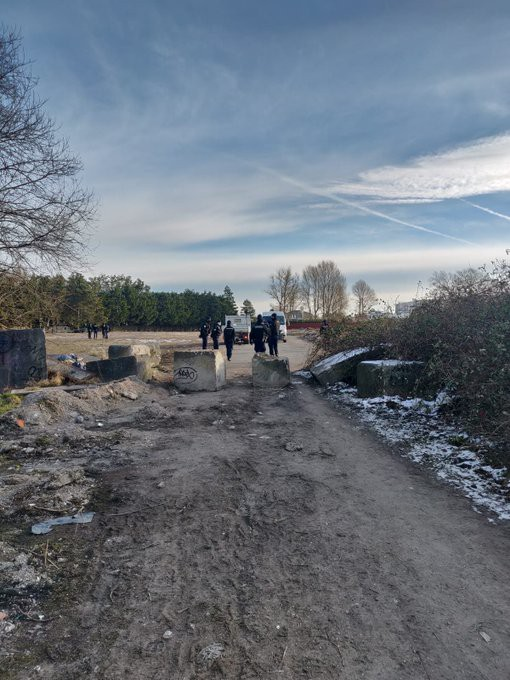

### AYS Weekend Digest 13–14/2/21: Banks close accounts and options for many people under international protection
#### Potential new cases against the Italian state for orchestrating pushbacks to Libyan torture // Far\-right still terrorizing people across the Aegean // Insane costs for refugee accommodation a German city make working unaffordable // Recommended reads and more info

Constant evictions in the Calais area have become a daily reality for many in the north of France, activists report \(see more under ‘France’\)
#### FEATURED — Under international protection, but guilty until proven innocent…

A number of people who live under international protection in Croatia have found themselves in a strange and serious situation\. They are unable to open or keep a bank account to receive social support for children, financial support from local humanitarian foundations or even their own salaries\.
A woman from Syria contacted AYS saying she is unable to receive the state support for her children because the bank has closed her account due to the fact that she is a Syrian citizen\. Another Syrian was supposed to receive monthly financial support and support for their rent \(as a result of AYS & Solidarna action when the pandemic started and after the Zagreb earthquake last year\), but the bank first blocked the account only to later close it without warning, or offering other solutions to the people in question\. Another woman from Iraq has been through a series of questions by the bank personnel \(about the origin of the money she is receiving, what she uses it for, where she works, etc\. \) and currently has a blocked account, without the possibility to receive her monthly salary, until she explains more to the bank representatives at a meeting in person which is to take place at a time when she is supposed to be at her workplace\. More similar examples were brought to us by people from Syria, Iran and Afghanistan\.

After some phone interventions by the volunteers helping the people solve bank issues, one of them received a call from one of the banks whose representative said they are all working according to the recommendations of the Croatian National Bank which states that the citizens of certain countries cannot be clients of any bank\. They are following the central national decision that limits people from the countries on their list from opening an account\. Among others, those countries are Syria, Iran and Afghanistan\.

The National Bank, on the other hand, seems to be following the international framework, stating:

> International restrictive measures apply to persons and other entities under some form of sanctions because of any type of terrorism\. The measures are introduced on the basis of the Act on International Restrictive Measures and are further regulated by a decision\. The Ministry of Foreign and European Affairs maintains the Database, issues guidelines and updates the overview of sanction regimes\. The EU publishes autonomous measures, in addition to those introduced by the UN Security Council and publishes guidelines for the enforcement of such measures under the Common Foreign and Security Policy\. 

The banks in question call on [the law on prevention of money laundering and terrorist financing](https://www.zakon.hr/z/117/Zakon-o-sprje%C4%8Davanju-pranja-novca-i-financiranju-terorizma) when it comes to their detailed questioning and closing of people’s accounts without previous notice\.

Along with a few other organizations in Croatia, AYS has turned to the Ombudswoman to urgently tackle this problem and we are currently waiting for feedback in order to see what the next steps are in order to help people lead an independent and \(more\) dignified life in countries that provided them international protection and are blocking them on each step of the way\.
#### GREECE

](assets/139074142180/0*IrGehx8fnx0H0vaq)

via [**Mare Liberum e\.V\.**](https://twitter.com/teammareliberum)

116 people have reportedly arrived on Lesvos in the first two weeks of February\. Conditions at Kara Tepe/Moria 2\.0 remain awful, as reported by many people:

■■■■■■■■■■■■■■ 
> **[Mostafa](https://twitter.com/Mostafa_b8) @ Twitter Says:** 

> > Now I am Tweeting there is no electric and it is extremely cold and windy and the food that they gave us is not eatable and we can't make fire for cooking
I went toilet and came back my hands weren't able to open the zip
Many children and pregnant women are here
#Moria2
#karatape https://t.co/gXPaoTdpkT 

> **Tweeted at [2021-02-14 16:03:02](https://twitter.com/Mostafa_b8/status/1360982894643212288?fbclid=IwAR26Lh5fiKSxUIiawzEk2GsD7gm04yx3vXXQPEC5TtYo_9suGu1REcEiJ0U).** 

■■■■■■■■■■■■■■ 

At the same time, the tensions and anti\-refugee sentiments continue to create daily problems for people, including the youngest of them\. Another racist gathering was reported in the village of Ippios on Lesvos, [reportedly](https://racistcrimeswatch.wordpress.com/2021/02/13/1-1163/) with the aim of excluding refugee children from going to school\. More extremist elements have been noted with the officials working within the asylum and integration system in Greece, but also those at the border\.

11 families from Syria and Iraq, including women, children, and people with disabilities, were expelled from their accommodation and left homeless for five days, all this at a time when the coronavirus pandemic enters the third deadly wave and the bad weather is in full swing, the local activists have reported\. They say the people in question lost the right to official financial support, and have as a result found themselves staying in tents on the side of the road in the cold\.

■■■■■■■■■■■■■■ 
> **[Franziska Grillmeier](https://twitter.com/f_grillmeier) @ Twitter Says:** 

> > Family from #Bamiyan decides to stay in 1 room in abandoned house along the BosnianH-Croatian border this morning, as temperatures drop below -5C.

Attempts to cross borders can end deadly on border river, while violent illegal #pushbacks from #Croatia reportedly continue daily. https://t.co/h8MqQE9hO6 

> **Tweeted at [2021-02-14 21:29:11](https://twitter.com/f_grillmeier/status/1361064970776100867?s=20).** 

■■■■■■■■■■■■■■ 

#### ITALY
### Who gave the order — who takes the blame?

After the European Court of Human Rights condemned Italy for having collectively expelled 200 people intercepted 35 miles south of Lampedusa in May 2009, it seems a new case might set the path for the struggle against the involvement of the Italian state in pushbacks to continue\. They are accused of having acted in violation of the Geneva Convention and article 10 of the Italian Constitution, in full awareness of the abuses and violence taking place in Libyan detention centers\.

Aiming to prove the coordinating role of the Italian military authorities stationed in Tripoli in the refoulement of about 270 people who were brought to Libya on 2 July 2018 on board the ship Asso Ventinove of the Neapolitan company, civil proceedings were initiated, with the support of ASGI and Amnesty International, from five Eritrean citizens who were on board the vessel\. For more details, see additional [media](https://www.ilfattoquotidiano.it/2021/02/12/marina-italiana-ha-coordinato-respingimento-illegale-di-migranti-in-libia-cinque-eritrei-citano-in-giudizio-governo-e-unazienda-privata/6099643/?fbclid=IwAR2ut1e7YiqKagDg4_h701jwFN8TmYiiDUpXbtk1lpd2ey3nVc8Kzsvsipo) stories on the case\.

In the past six months, out of more than 207,000 applications submitted, only 2 percent were examined\. So far, the Prime Minister’s opinion on the topic of migration is yet unknown\. An [open letter was recently addressed](https://www.nuoveradici.world/leditoriale/message-in-the-bottle-supermario-sullimmigrazione-pensaci-tu/) to Mario Draghi, calling for the establishment of humanitarian corridors for asylum seekers in vulnerable conditions and in particular for unaccompanied foreign minors, and providing solutions for the worsening problem of racism, imposing appropriate measures and new instruments\.

Don’t miss on reading our **AYS Special from Italy: 2020, not only Covid\-19\. Deportation, invisibility, detention and lack of reception\. PART I\!** In collaboration, written by our friends from Lasciateci entrare:

#### FRANCE

Evictions continue in the north of France, during some of the coldest days this winter\. Such deprivation of the few basic things the people own has become their daily reality\. \.

■■■■■■■■■■■■■■ 
> **[Human Rights Observers](https://twitter.com/HumanRightsObs) @ Twitter Says:** 

> > Ce matin à #Calais malgré la température glaciale, les expulsions des lieux de vie continuent.
• 7 expulsions ont été recensées.
• 5 tentes et 3 sacs ont été saisis. 

L' expulsion de leur lieux de vie est devenu banale pour exilé.e.s, elle s'est inscrite dans leur quotidien. https://t.co/1gPUO7NCpd 

> **Tweeted at [2021-02-14 21:33:13](https://twitter.com/HumanRightsObs/status/1361065987974565894?fbclid=IwAR3qnB1KpyJlMr-7SWvOSOc3I_F-bEycLT6BPEq-h0RsFfano_LeNg4vyUw).** 

■■■■■■■■■■■■■■ 

At the same time, the police in the south of the country, in the border area with Italy have been exercising their right to refuse people entry to the country under the principle of the so called “non\-admittance”\. However, as their colleagues in other EU border areas have been doing for the past few years, the French border police also abuses this by pushing back asylum seekers who then never even get to express their intention to seek asylum, as the first step on the long and thorny way to international protection\. InfoMigrants recently wrote [more on this\.](https://www.infomigrants.net/en/post/30195/pushbacks-in-the-french-alps-migrants-report-immediate-deportations-to-italy?fbclid=IwAR0UOLN_qAu30pUfrLlRfinfKmM9w9hSd4llbz-D0jFJTSiXSLN6E_T47_w)
### Paris

The Hotel\-Dieu hospital covers 60,000 m2 of which 2/3 has been empty for years\. In the process of privatization, the project foresees luxury shops and not social housing\.

In solidarity with about 100 homeless people, a number of associations and activists have attempted to occupy the empty parts of the hospital complex to use as shelter\. Here is what happened:

■■■■■■■■■■■■■■ 
> **[Paris d'Exil](https://twitter.com/paris_dexil) @ Twitter Says:** 

> > https://t.co/G13ghgEvOK 

> **Tweeted at [2021-02-13 13:04:15](https://twitter.com/paris_dexil/status/1360575514168209411?fbclid=IwAR0j9691HCt6OT7fVWDCOmkXvRZnZvRiqzLVr-QQrr-S_UYivO9_kFisQmk).** 

■■■■■■■■■■■■■■ 

However, the military intervened\. Although the activists manage to find temporary solutions, this serious issue will not go away by itself\.

■■■■■■■■■■■■■■ 
> **[Paris d'Exil](https://twitter.com/paris_dexil) @ Twitter Says:** 

> > #Requisition #onsemetauchaud #hoteldieu #logementspourtoustes https://t.co/GekfwxpWGF 

> **Tweeted at [2021-02-13 19:20:11](https://twitter.com/paris_dexil/status/1360670122642448387?s=20).** 

■■■■■■■■■■■■■■ 

Follow Utopia for more updates on the actions taken further\.

■■■■■■■■■■■■■■ 
> **[Utopia 56](https://twitter.com/Utopia_56) @ Twitter Says:** 

> > L’objectif de cette réquisition #OnSeMetAuChaud était les zones inoccupées d’Hôtel-Dieu avec des milliers de m2 abandonnés. Les militaires envoyés ont repoussé la 100aine de personnes sans-abri vers les couloirs utilisés de l’hôpital. Il y a pourtant urgence à des mises l’abri https://t.co/kusUZpL7ro 

> **Tweeted at [2021-02-13 14:33:29](https://twitter.com/Utopia_56/status/1360597969385455627?s=20).** 

■■■■■■■■■■■■■■ 

#### BELGIUM
### Injustice for Mawda

The police officer who murdered the little girl Mawda, whose death has been widely written about since 2018, was given a one year suspended sentence and a fine — a decision that has sparked outrage\. [Refugee Women's Centre](https://twitter.com/RWC_CalaisDK) reports that the judgment left large parts of the story untouched, reportedly including the police force’s and prosecutor’s falsehoods regarding the death of Mawda, and the police’s violent mistreatment of the family during and after the incident\.

> It seemed clear that the 2 1/2 years of investigations and 3 day\-long trial was simply an extended process of rendering innocent the police’s role in Mawda’s death and instead passing the blame onto a young Kurdish migrant\. This is the opposite of what Mawda’s family fought for\. 

For the entire story of the death of the little girl and what followed, see [here\.](https://parismatch.be/actualites/societe/463093/mawda-apres-le-jugement-la-recherche-de-toute-la-verite?fbclid=IwAR1HvxU_rOjpBPooz8uzwFuyNN8sh5YY3wFzwPSxAoVVcISRh-VpnMgJx1w)

■■■■■■■■■■■■■■ 
> **[Refugee Women's Centre](https://twitter.com/RWC_CalaisDK) @ Twitter Says:** 

> > Injustice for Mawda

One year suspended sentence for "involuntary homicide" by the policeman that shot Mawda. Four years for the driver of the van that Mawda and her family were travelling in, for "dangerous/endangering driving". https://t.co/Xj9rIvEKw2 

> **Tweeted at [2021-02-14 13:11:49](https://twitter.com/i/status/1360939806704992256).** 

■■■■■■■■■■■■■■ 

#### GERMANY
### As the municipality looks for a quick pay off, the burden is laid on those in need of accommodation

Having invested in the building of cheap accommodation, cities in Germany are trying to write off these investments more quickly than usual, as the Refugee Council stated in the latest story of insanely high rent for poor living standards\. Once the people who arrived to the country as refugees start to work and have their own income, they suddenly have to pay the horrific fees themselves, and these are not the usual expenses one would expect\. As the German media r [eported](https://taz.de/Gebuehren-fuer-die-Unterkunft/!5746397/) , for a room of less than twenty square meters equipped only with the essentials, the city of Hannover charges 930 euros for each of them\. “The families with children and women who are housed separately on the third floor have to go to the basement to shower,” Refugee Council adds\. With most of the people employed at the minimum wage, such prices make it impossible for them to cover and ultimately lead to the fact that it doesn’t actually pay off for them to work\.

> The Refugee Council also considers this to be “immoral” because most of those affected hardly have a choice: some of them are not allowed to move away, and even if they are allowed and willing, they hardly have a chance on the free housing market\. 

#### WORTH LISTENING & READING
- German language SeaEye podcast episode on the EU & FRONTEX:

■■■■■■■■■■■■■■ 
> **[sea-eye](https://twitter.com/seaeyeorg) @ Twitter Says:** 

> > „Frontex baut nicht nur eine fragwürdige, bewaffnete EU-Grenztruppe auf. Die Agentur agiert außerdem wie ein Grenzgeheimdienst und setzt dabei Technik ein, die für das Militär entwickelt wurde", sagt @[matthimon](https://twitter.com/matthimon) Das dürft ihr nicht verpassen: [sea-eye.org/podcast/](https://sea-eye.org/podcast/) 🎧 https://t.co/FH5aGJYoN7 

> **Tweeted at [2021-02-14 18:00:41](https://twitter.com/seaeyeorg/status/1361012503535366145?fbclid=IwAR3tzLZUVQOl8hp1I109SCRz2JW3wsmIFJCaKqjOKH4BSHgYpOifPosKAXo).** 

■■■■■■■■■■■■■■ 

- The Harrowing Journeys To Safety Of Asylum\-Seekers During A Pandemic

[](https://l.facebook.com/l.php?u=https%3A%2F%2Fwww.npr.org%2F2021%2F02%2F13%2F949182773%2Fthe-harrowing-journeys-to-safety-of-asylum-seekers-during-a-pandemic%3Ffbclid%3DIwAR28eRfXmqxt3wIAAj9hZL56lCZ2WImHckiKZu-NsKn2pjGxaDMQvfPe2Tc&h=AT27Z5bbtcETXZFXBXTlL7ZlNmma2iMJqxEL5MtmsdUFwDi1hgzLUfw64lelL-hxVXX3vWVHu0QNnGgTNXIAZ2i1nphhVpHZTr89dYecg7MTrAvuybYMsyLmhHrZEl89wQ&__tn__=%2CmH-R&c[0]=AT1JTMuoaR8SlajfQcKWHHumyrlL3mqcNTkME0maxYBfSLnXeP7T_dcWdF5Bz3BNWw1Zu2CJdcGa1UbblyRi4lrJ5mlVhVVcdp2GMZUviAHsXnrpryYCq99lojBOOHhrvsA3PtpXZ4qlM0x1NJQHfXV4qo6PF04VaLQtcWMhJ9LqkjiP8mZvGMUmO18D-AhmwQHXFzQ4USRjKqvDww)

- Scientific article from the Journal on Rehabilitation of Torture Victims and Prevention of Torture: Violence and torture against migrants and refugees attempting to reach the European Union through Western Balkans —

- Webinar \(18th Feb\) — The Struggle for Migrant and Racial Justice in Britain: Lessons from History:

[](https://l.facebook.com/l.php?u=https%3A%2F%2Fus02web.zoom.us%2Fwebinar%2Fregister%2F6116118303533%2FWN_p-otqn4jQtat_TjNgICR2Q%3Ffbclid%3DIwAR1n64ZhcjOlbc8sxqVG2cXoFUOMvh7UAyOTk9Cxwrip6ilN4P14JGmr_5o&h=AT3KAIhWAU-SNaxk49uMo7MOWWOn3u4T2IzZEJ8xisJ5V4EebLzijg20g9i8bAgm9wLPKF-jF2RfIJS3NcQcT9PyCsaPp95-NQqKJxqXtoKw1l7yW6DpZkVAWHYJdcCs6aSx-f_pczdD2Q&__tn__=R]-R&c[0]=AT2PxTccvBTngf7O2oaBr78Kiuhyfha3UFIyC0flQ3zjv4T5YE-fQyjBv_VMamuRhA6tUkoIXEsvXpd4SgerkA_0a5IpKbqJp6bEnvc7eMa7iErSiDJPzY2H1bB8JGwe4p00Ft9fBY50V3K4r7LTK7f0D2T0184KqCKnnOQALX-zT3xL2HFOr1qIyCxw-KxRv-eFjNnJmLWBPpXYKg)

**Find daily updates and special reports on our [Medium page](https://medium.com/are-you-syrious) \.**

**If you wish to contribute, either by writing a report or a story, or by joining the info gathering team, please let us know\.**

**We strive to echo correct news from the ground through collaboration and fairness\. Every effort has been made to credit organisations and individuals with regard to the supply of information, video, and photo material \(in cases where the source wanted to be accredited\) \. Please notify us regarding corrections\.**

**If there’s anything you want to share or comment, contact us through Facebook, Twitter or write to: areyousyrious@gmail\.com**

_Converted [Medium Post](https://medium.com/are-you-syrious/ays-weekend-digest-13-14-2-21-banks-close-accounts-and-options-for-many-people-under-139074142180) by [ZMediumToMarkdown](https://github.com/ZhgChgLi/ZMediumToMarkdown)._
