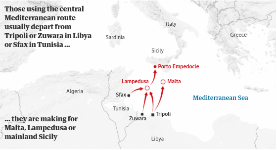
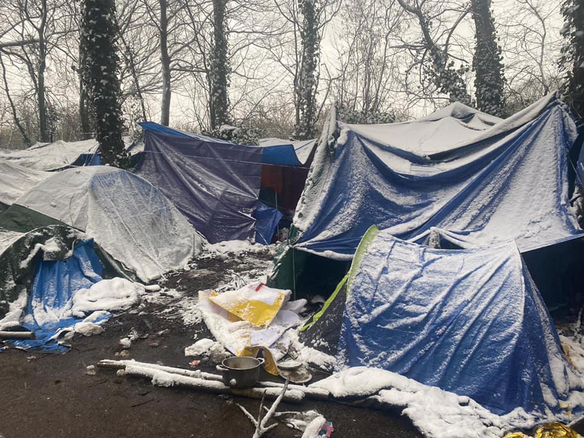

### AYS News Digest 15/2/21: Lawyers Want to Bring Frontex to Court over Abuses in Aegean
#### _Open Arms sails home // Heavy snowfall in Greece creates freezing conditions in camps // Pushbacks in Romania // Health conditions in Serbia // UK’s Napier Barracks found ‘unacceptable’ seven years ago_

Photo source: Frontex Twitter
### FEATURE — Frontex May Head to EU Court

A group of European lawyers plans to take legal action against Frontex amid overwhelming evidence that the EU’s border agency is committing human rights abuses at sea, according to a 32\-page letter seen by journalists at [Der Spiegel](https://www.spiegel.de/politik/ausland/frontex-skandal-rechtsanwaelte-wollen-leggeri-vor-europaeischen-gerichtshof-bringen-a-b82ae08e-449e-4366-862a-9d8300d97e81?fbclid=IwAR1KQ4AYdXrrgXt92V61jH_jY3t_rK16ZDSeKqn-Hxi5fLOL7FDZIVHbtok) \.

In fact, the lawyers, Omer Shatz, Iftach Cohen and Anastasia Ntailiani, want to force Frontex to withdraw from the Aegean entirely\. The illegal pushbacks there are “crimes against humanity,” Shatz said\.

The head of Frontex, Fabrice Leggeri, is complicit, the lawyers argue\. Leggeri is obligated under [Article 46 of the Frontex regulations](https://eur-lex.europa.eu/legal-content/EN/TXT/PDF/?uri=CELEX:32019R1896&rid=2) to end missions if he becomes aware of human rights violations\. These systematic pushbacks, which have long been documented by journalists, researchers and civil society organizations, are human rights violations, according to Shatz\.

The lawyers have [written to request](https://twitter.com/LexFront/status/1361394892019269638) Leggeri to end Frontex operations in the Aegean, according to Spiegel\. If he doesn’t, they want to pursue a case in the European Court of Justice \(ECJ\) in Luxembourg\.

Shatz teaches at Sciences Po in Paris\. He and Cohen belong to the Front\-Lex organization, which examines legal violations at the EU’s external borders\. Ntailiani works for Legal Center Lesvos, an NGO\.

Leggeri, the team of lawyers say, misled the European Parliament by not informing MPs of a pushback by the Hellenic Coast Guard on [the night of April 18–19](https://www.spiegel.de/politik/ausland/wie-frontex-chef-fabrice-leggeri-die-oeffentlichkeit-getaeuscht-hat-a-97235557-16c5-4340-bf9b-c1032b2dabab) \. A Frontex aircraft filmed the pushback and streamed the event into Frontex headquarters in Warsaw, Spiegel reports\.

Leggeri, of course, told MPs there was no evidence of Frontex involvement in pushbacks, although Spiegel has verified videos of such participation\. The lawyers called Leggeri’s statement “at least misleading\.”

“Frontex has both a negative duty and a positive duty,” Shatz says\. The agency cannot participate in human rights violations, but “must also actively ensure that there are no such violations of law within her mandate\.”

And at this point, “Leggeri and his employees run the risk of making themselves criminal\.”
### LIBYA
#### A point of departure, now for Libyans, too

Photo Source: The Guardian

Libya is well\-known as one of the busiest transit countries for people escaping sub\-Saharan Africa for Europe\. Thousands of refugees and asylum\-seekers pass through the country each year, boarding old fishing boats and other unseaworthy vessels along the vast coast and setting off on the most treacherous leg of their journey: the Central Mediterranean\. A total of 34,154 people arrived in Italy by sea in 2020, according to [UNHCR](https://data2.unhcr.org/en/situations/mediterranean/location/5205) \.

But now, researchers are noticing that more and more of those leaving Libya’s shore are Libyans themselves\. The International Organization for Migration \(IOM\) registered 386 Libyans arriving in Italy by sea in 2020, nearly double the number from the year before\.

Why might this be? Simple answer: worsening economic conditions caused by the coronavirus pandemic, coupled with a troubled military ceasefire\.

“The pandemic has made the economy suffer, and has led to a reduction of oil and gas exports\. There is also difficulty for Libyans to cash out their pensions, and there’s a huge rise in unemployment among youth,” Vincent Cochetel, the UNHCR’s special envoy for the western and central Mediterranean, told the [Guardian](https://www.theguardian.com/global-development/2021/feb/15/why-libyans-are-joining-the-boats-leaving-their-shores-libya-migration?fbclid=IwAR3onm8ZLdHhpMA_PdhZzhHok8irWzYFl5CFKlN9C9XBG6E4rENxHNoXAhU) \.

Mousa Algunaidi of the Nedaa Organization for Human Rights and Community Development, in Misrata, told the Guardian that problems caused by government corruption are compounded by the tensions between two rival governments, based in Tripoli and Benghazi\. The two groups [agreed to a ceasefire](https://www.nytimes.com/2020/10/23/world/middleeast/libya-ceasefire.html) last October, but the country’s defense minister has already [threatened to withdraw](https://www.middleeastmonitor.com/20201208-libyas-dm-threatens-to-end-ceasefire-due-to-haftars-violations/) \.

“But if there’s a new conflict like what we saw in 2019, we’ll see the shores full of Libyans,” Algunaidi said\.
### SEA
#### Open Arms sails for home

■■■■■■■■■■■■■■ 
> **[Open Arms ENG](https://twitter.com/openarms_found) @ Twitter Says:** 

> > Mission 81 #Astral returns home @[PortdeBadalona](https://twitter.com/PortdeBadalona) after rescuing 45 people in international waters central  #Med and having sailed for days in very difficult sea conditions.
Thank you team, you are great, you’re the soul of this humanitarian mission ❤️
 📷 @[PavlobskiRoisen](https://twitter.com/PavlobskiRoisen) https://t.co/LvHTBPVD2k 

> **Tweeted at [2021-02-15 17:11:32](https://twitter.com/openarms_found/status/1361362520682938377).** 

■■■■■■■■■■■■■■ 

Open Arms is heading home to Badalona after another difficult mission\. Fair weather, friends\!
#### An account from the skies

Read a fascinating moment\-by\-moment account by Seabird’s tactical coordinator of the Libyan Coast Guard harrassing Open Arms in the Central Mediterranean, published by [Civil Fleet](https://thecivilfleet.wordpress.com/2021/02/15/witnessing-the-libyan-coastguard-harassing-an-ngo-refugee-rescue-mission/?fbclid=IwAR3bYNliw069LfT9uHuLcXauHdpLZoNbPWHS9DRv8zZtInkVE-rNSdq_R3c) \.

“We checked back on the distress case…and we realised that the scLCG \[so\-called Libyan Coast Guard\] had changed course and was heading directly toward the Open Arms’ Rhibs\.”
#### Tally of returns to Libya

■■■■■■■■■■■■■■ 
> **[IOM Libya](https://twitter.com/IOM_Libya) @ Twitter Says:** 

> > In the period of 9 - 15 February, 318 migrants were rescued/intercepted at sea and returned to Libya.

👇IOM Libya's Weekly Maritime Update👇 https://t.co/OrK1shSeSA 

> **Tweeted at [2021-02-15 16:11:02](https://twitter.com/IOM_Libya/status/1361347295825055753).** 

■■■■■■■■■■■■■■ 

Intercepted and returned to Libya ≠ rescued\.

According to [Mediterranea Saving Humans](https://mediterranearescue.org/news/medreport-8-14-febbraio-2021-soccorsi-respingimenti-e-naufragi/?fbclid=IwAR2tLI2FfwFjvHW8dbONtYl3oTDEA3Q8usOPgTVEkG66DbH3yJ7PJSIygCs) , 2,274 people have been intercepted and brought back to Libya thus far this year\.
### MALTA
#### Country refuses to accept refugees from Open Arms

Perhaps unsurprisingly, [given Malta’s track record when it comes to search and rescue](https://www.independent.com.mt/articles/2020-10-06/local-news/No-plans-to-reduce-Malta-s-Search-and-Rescue-zone-PM-6736227580) , the country [refused to accept](https://timesofmalta.com/articles/view/malta-refuses-to-take-146-migrants-rescued-in-its-search-and-rescue.851738?fbclid=IwAR1Md6nGyTAstd1aygbvgTJ2JYzFQFQi2-ISZJUzSBMKdgI78a_kSh3sHDs) the 146 people rescued by Open Arms\. Instead, the ship was sent to Port Empedocle, Sicily\.
### GREECE
#### Massive snowfall creates freezing conditions in camps

[The heaviest snowfall in 12 years](https://www.reuters.com/article/us-greece-weather/greece-blanketed-by-heaviest-snowfall-in-12-years-idUSKBN2AF1HU?fbclid=IwAR1Le3GixRXFlXAqWgL4Zua1XfuzILxlPSkVHnMCnvdLUUKW4leZsILvBL4) hit Greece yesterday, cutting power, stopping public transport, and trapping people in their homes\. But this is no cute winter wonderland for the tens of thousands of people on the move trapped in the country\.

■■■■■■■■■■■■■■ 
> **[Katy Fallon](https://twitter.com/katymfallon) @ Twitter Says:** 

> > Some photos of Eleonas camp this morning in the snow (not mine) I’ve been sent. Snow is great for some but not if you’re living in a tent. Eleonas has around 2,800 ppl with approx 400 living in tents w/ no heating. https://t.co/E6WZLRYLsi 

> **Tweeted at [2021-02-16 10:45:34](https://twitter.com/katymfallon/status/1361627776973955074).** 

■■■■■■■■■■■■■■ 

Luckily, Khora, an Athens\-based collective, is [providing information](https://www.facebook.com/KhoraAthens/posts/1691668211005780) to people sleeping rough in the capital about where they can access basis services, such as a warm place to sleep\.

The call center of the Reception and Solidarity Center of the Municipality of Athens \(210–5246515\) is also in 24\-hour operation to receive telephone reports from citizens about places where there are homeless people who need help\. Reports about places where there are homeless can also be made to the four\-digit contact number of the Municipality of Athens 1595 and 2105277000\.

And somehow, despite the terrible conditions in the new camp on Lesvos — exacerbated by the recent snowfall — UNHCR seems to feel no shame about sticking its logo everywhere on the miserable tents in which they accomodate people on the move\.

■■■■■■■■■■■■■■ 
> **[Daphne Tolis](https://twitter.com/daphnetoli) @ Twitter Says:** 

> > The temperature is between 1°C - 3°C this evening on the island of #Lesbos since a brutal cold snap started on Sunday. Close to the sea, where the #Mavrovouni temporary  tent camp is, it feels even colder due to the strong winds. Like most nights, there is no electricity tonight. https://t.co/bwpdkhNnKx 

> **Tweeted at [2021-02-14 20:54:08](https://twitter.com/daphnetoli/status/1361056150695927812).** 

■■■■■■■■■■■■■■ 

The electricity is not working in many areas of the camp due to the snow\.

■■■■■■■■■■■■■■ 
> **[Isabel Schayani](https://twitter.com/isabelschayani) @ Twitter Says:** 

> > Strom funktioniert seit Tagen nicht,schreiben heute 2 Familien aus #KaraTepe

Hier versucht eine Frau Wasser zu erhitzen.Sie habe Diabetes,Rücken- u Beinschmerzen,sagt sie.
Frage aus Köln:Warum macht sie das?
‚Was soll sie mit kaltem Wasser? Sie ist ja krank,‘ schreibt Nachbar. https://t.co/InHplHASLR 

> **Tweeted at [2021-02-15 19:10:05](https://twitter.com/isabelschayani/status/1361392354175954948).** 

■■■■■■■■■■■■■■ 

The 200 people evicted from their hotel in Agioi Theodoroi are on the street today, despite the snow\.

■■■■■■■■■■■■■■ 
> **[NoBorders](https://twitter.com/Refugees_Gr) @ Twitter Says:** 

> > When it snows, it's not the same for all. Documents of 
#refugeesgr that are under eviction at Agioi Theodoroi are now telling us that today they are on the street while it is snowing. 
There are 200 of them (check the link [facebook.com/solidaritymigr…](https://www.facebook.com/solidaritymigrants/posts/251700709785799) #antireport https://t.co/TcDXWOneAz 

> **Tweeted at [2021-02-15 19:29:20](https://twitter.com/Refugees_Gr/status/1361397201101021184).** 

■■■■■■■■■■■■■■ 

#### Mobile Info Team releases new report on accommodation

Speaking of accommodation \(or lack thereof\), Mobile Info Team, part of the Border Violence Monitoring Network \(BVMN\) has released a new report titled “The Living Conditions of Applicants and Beneficiaries of International Protection: Evidence of Greece’s Failure to Provide Sustainable Accommodation Solutions”\. The report aims to draw attention to the precariousness people live in and the insufficient measures on integration, emphasizing that Greece remains unsafe and undignified regarding living conditions\. You can read the full report [here](https://www.mobileinfoteam.org/accommodation-report?fbclid=IwAR2iOijcrfJtq_V6yJPK-L8DidrsdFNtTNRQbKTvi3mzfDQG4zxwpUX5MyE) \.
#### Statement from RSA, MSF and Pro Asyl

> The fast\-track border procedure as applied on the Greek Islands continues to violate safeguards that are meant to provide additional protections for vulnerable asylum seekers\. RSA, PRO ASYL and MSF raise their concerns after several vulnerable asylum seekers supported by the organisations were placed in the border procedure despite being survivors of violence and the significant concerns related to their wellbeing and health\. 

> The examination of vulnerable asylum seekers’ claims within the fast\-track border procedure effectively renders legal standards aimed at protecting vulnerable refugees and at ensuring a fair asylum procedure an ‘empty shell’\. Not only does such an examination constitute a violation of Greek and European Union \(EU\) law, it also risks infringing the absolute obligation to comply with the principle of _non\-refoulement_ \. The authorities’ insistence on imposing an accelerated procedure on vulnerable applicants, in particular survivors of violence and torture, significantly increases dangers of re\-traumatisation and puts their fragile physical and mental health at further risk\. 

Read the full statement [here](https://rsaegean.org/en/rsa_msf_proasyl_specialproceduralguarantees/?fbclid=IwAR3-KF5PRgNA1_4POtXEHNWOCq1hVFc5tzga2EEQ1rw3wmeG9Q2o5PA10Zw) \.
#### Greece denies allegations of pushbacks — what else is new?

Another day, another denial of pushbacks in the Aegean by Greece\. The Greek migration minister Notis Mitarakis called the allegations “fake news” and pointed to a Turkish plot, reported [Info Migrants](https://www.infomigrants.net/en/post/30272/greek-migration-minister-calls-allegations-of-migrant-pushbacks-fake-news?preview=1613404857280&fbclid=IwAR0z83YF496NcR0NerelvjXkh9eVlWpUShr-kVMMMZJCGQgr-ycuX0dPMcs) \.

Last week, [Mare Liberum](https://www.infomigrants.net/en/post/30229/unprecedented-rights-violations-against-migrants-in-aegean-sea-ngo) said it had documented “close to 10,000 people” pushed back in 2020 alone in 321 incidents\.
#### New safe zones for children in camps

The International Organization of Migration \(IOM\) announced it has set up two new safe zones for unaccompanied minors inside the migrant camps of Vagiohori, east of Thessaloniki, and Filipiada, northwest of Arta, [Ekathimerini](https://www.ekathimerini.com/news/262413/iom-creates-two-new-safe-zones-for-children-refugees-in-two-camps/) reported\.

The new units bring the overall number of safe zones on mainland Greece up to 15, with a total capacity of 450 children\.

An estimated 42,500 children were present in Greece as of 31 December 2019, up from 27,000 in December 2018, according to [latest UNICEF statistics](https://www.unicef.org/eca/emergencies/latest-statistics-and-graphics-refugee-and-migrant-children) \.
### ROMANIA
#### Pushback video

The NGO Klikaktiv has released a [video](https://www.facebook.com/klikaktiv/posts/3977873822274208) they received on 14 February in which a group of Syrians are stopped by Romanian police upon entering the country and are pushed back to Serbia\. The police confiscated two of their phones, some money, and stole the men’s shoelaces, so they would have to walk back to Serbia barefoot or with broken shoes\.
### SERBIA
#### No Name Kitchen on the deteriorating health situation in Šid

■■■■■■■■■■■■■■ 
> **[NoNameKitchen](https://twitter.com/NoNameKitchen1) @ Twitter Says:** 

> > An update on the situation in Sid, Serbia, from a health perspective. 
For over a month, the road to one of the squats we usually visit was too muddy to drive on. So, for over a month our friends who live there have had no chance of a shower. 

> **Tweeted at [2021-02-15 17:50:02](https://twitter.com/NoNameKitchen1/status/1361372208896081927).** 

■■■■■■■■■■■■■■ 

### GERMANY
#### Transfers of people from Greece to Germany

Some 130 asylum\-seekers will be transferred to Germany from Lesvos on Wednesday, the [Berliner Zeitung](https://www.berliner-zeitung.de/news/lesbos-rund-130-fluechtlinge-landen-am-mittwoch-in-deutschland-li.139950?fbclid=IwAR2NhwPCyNcncF4IuryOQxFmK-7tH5twXo30f_4NG_f7-EynaYN4FQu7QJI) reported\. The people, more than 30 families, will arrive in Hanover by charter plane\. The vast majority of them are said to be from Afghanistan, the rest from Iraq and Iran\.

After the fire destroyed Moria camp in September, Germany pledged to receive 1,533 asylum\-seekers; thus far, only 333 of them have actually arrived in Germany\.
### DENMARK
#### Open Democracy: the ‘Danish model’ of migrant worker exploitation

Open Democracy has published a [new dive](https://www.opendemocracy.net/en/beyond-trafficking-and-slavery/the-danish-model-of-exploiting-migrant-workers/?fbclid=IwAR1Ih9RG1H0oaw9pTEb6fKRVgWw37wkfrObe85E9C2uMRFYOOZWT8jenQEk) into the “Danish model” of migrant worker rights, in which wages and working conditions are agreed “through tripartite negotiations between trade unions, employers’ associations and the state\.”

This Nordic welfare model is supposed to help secure migrant workers’ rights, but Open Democracy writes that upon completion of a three\-year research project:

> We are not convinced that the Danish model and the Danish welfare system are capable of ensuring the rights of migrant workers\. Nor are we convinced that these representatives are particularly interested in doing so\. 

Read the full findings at the link above\.
### FRANCE
#### **A legal pathway to the UK?**

■■■■■■■■■■■■■■ 
> **[Matthieu Tardis](https://twitter.com/MatthieuTardis) @ Twitter Says:** 

> > @[JFCrisp](https://twitter.com/JFCrisp) France human rights advisory commission adopted an opinion last week calling the government to open discussion on legal pathways with the UK. Surprisingly France does not seem so keen to do so because it'd imply to improve the reception condition here.  [cncdh.fr/node/2191](https://www.cncdh.fr/node/2191) 

> **Tweeted at [2021-02-15 16:54:32](https://twitter.com/MatthieuTardis/status/1361358241360453643).** 

■■■■■■■■■■■■■■ 

#### **Conditions in Calais, Paris**

Speaking of reception conditions in France, check out the living conditions in Calais, via Care4Calais \(full [Facebook post](https://www.facebook.com/care4calais/posts/4073896895976570) \) \.

Photo Source: Care4Calais

Utopia56 is moving its evening meeting place for families and minors to the steps of city hall in Paris, the group [reported](https://www.facebook.com/care4calais/posts/4073896895976570) \.

Over the weekend in the French capital, some one hundred homeless people who had initially been occupying a hospital were placed either in emergency accommodation or a hotel, [Le Monde](https://www.lemonde.fr/societe/article/2021/02/13/c-est-dramatique-de-devoir-faire-ca-pour-mettre-des-gens-a-l-abri-des-personnes-hebergees-avoir-occupe-l-hotel-dieu-a-paris_6069874_3224.html?fbclid=IwAR19aEfs6UzLlYp-XN2QGMHHjYOWOqgO_AsxQSGozcvMHU2njpfnZL8PzQ8) reported\. Yann Manzi of Utopia 56 said:

> It’s tragic to have to do that to get people to shelter\. But, tonight, we are happy that there are a hundred less people outside, even if there are still hundreds more\. 

### UNITED KINGDOM
#### Napier Barracks declared ‘not acceptable’ — seven years ago

The absolute debacle of the Napier Barracks gets even worse\. Documents obtained by the [Independent](https://www.independent.co.uk/news/uk/home-news/napier-barracks-asylum-seekers-home-office-b1802355.html?fbclid=IwAR1Le3GixRXFlXAqWgL4Zua1XfuzILxlPSkVHnMCnvdLUUKW4leZsILvBL4) show that the army barracks in Folkestone, Kent currently being used to house asylum seekers were deemed not to meet “acceptable standards for accommodation” all the way back in 2013\.

The Home Office has said it is an “insult to say they are not good enough for asylum seekers,” because they previously housed “our brave soldiers,” the Independent reports\.

A 2014 report by a consulting firm described the barracks as “derelict” and “surplus to requirements\.” Another report from 2018 said the site was “currently vacant or neglected” and “presented a number of challenges in securing a long\-term and viable future\.”

The UK’s immigration and prison watchdogs [will begin an inspection](https://www.independent.co.uk/news/uk/home-news/barracks-asylum-seekers-inspectors-home-office-b1801055.html) of the barracks this week after a mass outcry over the conditions there\.

The Independent reports that there are currently only 100 people remaining in the barracks\. Some 300 people were transferred to hotels last week\.
#### Controversial program to fingerprint new arrivals

Nine years ago, people on the move entering the UK were fingerprinted — that is, until people started slashing their own fingertips to avoid surveillance of their bodies\.

Now, it seems, Priti Patel [wants to start the controversial program again](https://www.independent.co.uk/news/uk/politics/priti-patel-asylum-seekers-fingerprints-b1798355.html?fbclid=IwAR0H4h1zYADstViznaC6SeWhoqiCm3EFQysac_ZI0yMU_5-fetsAikKAsK4) , but is warned that it will again lead to violence and self\-harm\.

> The home secretary’s desire to forcibly take fingerprints is deeply problematic\. Not only would the move put her government in a deeply murky position from a legal standpoint, but fingerprinting has led to serious violence affecting asylum seekers in the past\. We see no reason why things would be different this time around\. The Border Force union is against this\. — Josie Naughton, Choose Love 

The House of Commons will vote on the measure some time in the next few weeks\.
#### Congolese\-born woman to head Scottish university

The University of Edinburgh, one of the oldest universities in the world, [will get a new leader](https://www.euronews.com/2021/02/14/meet-the-congolese-ex-asylum-seeker-elected-to-lead-a-scottish-university?fbclid=IwAR2nLfNexAfAg7foLWzNykj4jXsOK_hbwYnCVcE7ns2_Xh8dkel2-6WSeEc) next month — Debora Kayembe, a human rights lawyer who came to the UK 16 years ago from the Democratic Republic of the Congo\.

The reaction in the Congo has been a “rollercoaster,” she told Euronews\. “There is a sentiment of national pride and they are waiting for the inaugural ceremony to come to Scotland to see that with their own eyes\.”

Kayembe is only the third woman and first Black person to hold the role of rector\.
### EU
#### Oxfam report: new asylum pact “a repetition of the same mistakes”

The global poverty charity Oxfam [has released](https://www.oxfam.org/en/press-releases/european-asylum-pact-repetition-same-mistakes?fbclid=IwAR0zMfdUJMBUYuVMsArPd8Om55jJ4Fmd9RJ7qjykMV920GSwgRFUsTe8fSI) a damning new report examining the impact of EU countries’ refusal to relocate asylum seekers on the Greek islands\. The report “illustrates that \[Greece has\] consistently failed to show solidarity by not delivering on commitments to relocate people: either by refusing to participate in the first place or by not fulfilling their pledges\.”

The new migration and asylum pact will not patch up these wounds, the report finds\. Oxfam’s EU migration policy advisor, Raphael Shilhav said:

> The EU has acknowledged the failure of its old policies\. While the new migration pact aims to balance responsibility\-sharing across the EU, it is copying many of the previous flawed policies with member states already questioning its purpose\. Reworked policies and member state inaction are at best leaving people in limbo, at worst sending them back to the dangers they are trying to escape\. 

Read the full report [here](https://policy-practice.oxfam.org/resources/tipping-the-scales-the-role-of-responsibility-and-solidarity-sharing-in-the-si-621158/) \.
#### WORTH READING & WATCHING
- [_Salam Neighbor_](http://salamneighbor.org/?fbclid=IwAR1Ih9RG1H0oaw9pTEb6fKRVgWw37wkfrObe85E9C2uMRFYOOZWT8jenQEk) is an award\-winning film and campaign\. Immerse yourself in the lives of Syrian refugees through the journey of Chris and Zach, the first filmmakers allowed to be registered and given a tent inside a refugee camp\.
- This article from [Taz](https://taz.de/Zukunft-durch-Migration/!5748653/) shows how the arrival of people on the move in small mountain villages in Calabria, Italy, is breathing life into once\-dying villages\.
- This working paper from the [Migration Policy Centre](https://cadmus.eui.eu/handle/1814/68175?fbclid=IwAR2NhwPCyNcncF4IuryOQxFmK-7tH5twXo30f_4NG_f7-EynaYN4FQu7QJI) examines the devastating impact COVID\-19 had on the institution of asylum, exacerbating longer term trends limiting the ability of asylum seekers to cross borders to seek protection\.
- [The Brothers Campaign](https://www.facebook.com/permalink.php?story_fbid=254721529489535&id=107856674176022) and its parent organizations Refugee Biriyani & Bananas and In\-Sight Collaborative call upon the international community to recognize the unique and widespread vulnerabilities forcibly displaced men face and take the necessary steps towards closing the gaps in services and delivery\.
- Check out new reports on children and families from [Forced Migration Current Awareness](https://fm-cab.blogspot.com/2021/02/thematic-focus-children-families.html?fbclid=IwAR0zMfdUJMBUYuVMsArPd8Om55jJ4Fmd9RJ7qjykMV920GSwgRFUsTe8fSI) , a service that highlights open access scholarly materials about migration\.
- Sign up for this event on Friday, 12:00PST: [The Big Gamble: The Migration of Eritreans to Europe](https://twitter.com/UCLAmigration/status/1361410452098609158) , hosted by the University of California at Los Angeles’ Center for the Study of International Migration and the Center for Comparative Immigration Studies\.

**Find daily updates and special reports on our [Medium page](https://medium.com/are-you-syrious) \.**

**If you wish to contribute, either by writing a report or a story, or by joining the info gathering team, please let us know\.**

**We strive to echo correct news from the ground through collaboration and fairness\. Every effort has been made to credit organisations and individuals with regard to the supply of information, video, and photo material \(in cases where the source wanted to be accredited\) \. Please notify us regarding corrections\.**

**If there’s anything you want to share or comment, contact us through Facebook, Twitter or write to: areyousyrious@gmail\.com**

_Converted [Medium Post](https://medium.com/are-you-syrious/ays-news-digest-15-2-21-lawyers-want-to-bring-frontex-to-court-over-abuses-in-aegean-ddd0cb5a3290) by [ZMediumToMarkdown](https://github.com/ZhgChgLi/ZMediumToMarkdown)._
