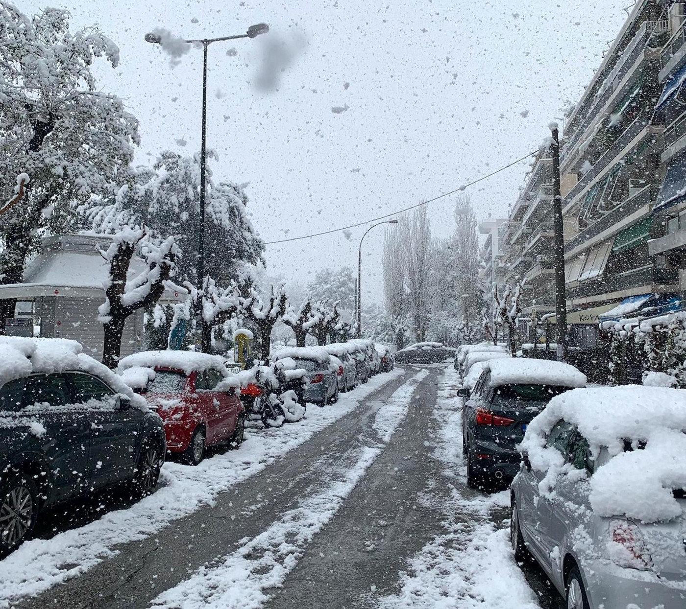

### AYS Daily Digest 16/02/21 Migrants win the right to challenge Napier Barracks

_Snow storm coming for the Levant // Hunger strikes and self harm in Canary Islands // Freezing conditions in Aegean and lawyers call on Frontex to stop Aegean operations // and more…_

](assets/3c8f2718fca4/1*pA2cnLIlhGoibWfAraEl9w.jpeg)

Napier Barracks\. Photo provided by reporter [Simon Jones](http://Simon Jones)
### FEATURE: Migrants win the right to challenge the use of Napier Barracks

Finally some good news\! On Tuesday, the High Court ruled that six migrants will be allowed to continue their case against the use of Napier Barracks to house migrants\.

Lawyers brought evidence on how the conditions in Napier Barracks breached the rights of asylum seekers, therefore showing how the Home Office had failed in its duty to provide adequate accommodation\. [Care4Calais](https://www.facebook.com/care4calais/posts/4076503232382603) celebrated this news and provided this in depth insight into the case:

> “ **The High Court was told that asylum seekers housed there were left “powerless to protect themselves” because the Home Office has “failed to prevent the spread of Covid\-19”\.** Just 63 people are still housed at the site and none are currently “under isolation”, the court heard\. Six men who were previously housed at the site, all said to be “survivors of torture and/or human trafficking”, argue that the Home Office is unlawfully accommodating people at the barracks, which are not “Covid\-secure” as it is “impossible to socially distance”\. 

> Shu Shin Luh, representing two of the men, said in written submissions that there are “present and continuing” risks to asylum seekers at Napier Barracks because of the danger of Covid\-19\. Ms\. Luh said **asylum seekers had been “put in the barracks in these circumstances on a no\-choice basis”, and were “unable to self\-isolate” or “avoid close contact with someone who has tested positive”\.** Asylum seekers housed at Napier Barracks “were entirely reliant on the defendant to implement measures to protect them from the risks of infection, with potential and unpredictable risks of fatalities,” she said\. Ms\. Luh also argued that the barracks were particularly unsuitable for vulnerable individuals\. She said: “The barbed wires and fencing, and the regime of curfew and restrictions, served as recurring triggers for flashbacks to past torture and serious ill\-treatment\.” 

> Tom Hickman QC, representing the other four claimants, said that Public Health England “warned the Home Office on September 7 2020” — before asylum seekers were moved into the barracks — that they were “not suitable for use” and said the “advice was rejected”\. He added that **there was “a mental health crisis” among those housed at the barracks, with conditions having “triggered or exacerbated” his clients’ underlying mental illnesses\.** He also said the Home Office had “no effective or adequate procedures” for identifying whether those housed at Napier Barracks were vulnerable and should not be accommodated there\. 

> Ms\. Giovannetti told the court that “by the close of play today, there will be 63 people at the site” and that none of those housed there were currently “under isolation” as a result of coronavirus\. She added: “Yet, notwithstanding this, **the defendant chose to accommodate asylum seekers during a Covid\-19 pandemic in accommodation against the advice of Public Health England, and in numbers which made it impossible to socially distance or bubble as required\.** ” She added: “The Home Office is currently working with the outbreak control team, which involves representatives from Public Health England and the local Kent NHS bodies, and there is a scheduled meeting with them on February 18\.” Ms\. Giovannetti said the Home Office was “doing everything in the meantime, pending the full hearing, to make sure the accommodation is safe and adequate in the coming weeks”\. But she also said that “the kitchens are still not working in the aftermath of the fire” at the site in January, so food was still having to be delivered to the barracks\. 

> **At the conclusion of the hearing, Mr Justice Chamberlain granted permission for the six men’s claims to proceed to a full hearing in April\.** 

> Sue Willman, a solicitor at Deighton Pierce Glynn which represents four of the claimants, said after the hearing: “The Home Secretary has today conceded that the arguments we made on behalf of asylum seekers held in Napier Barracks were arguable and that the case should go ahead to a full trial\. “This is very welcome news\. Our clients were subjected to demeaning conditions in Napier Barracks for over four months before the Home Office was ordered by the court to move them to alternative adequate accommodation\.” She added: 

> “Refugees arriving in the UK, often after experiencing torture and trafficking, have the right to be provided with basic humane accommodation\.” 

Read more about the case [here](https://www.theguardian.com/politics/2021/feb/16/home-office-were-advised-not-to-house-asylum-seekers-in-napier-barracks?fbclid=IwAR2WR2oslnOiwZOQEQ24nLN17TAo1BBLO6O4vSUOr7c-A_hKLCM_0S1V2iw) \.
#### LEBANON
### Refugees to face strongest snowstorm in years in the Levant

On Wednesday, UNHCR spokesperson Lisa Abou Khaled said:

> “In terms of preparations, we start very early on in preparing for the winter season way before it starts\. We start giving what we call ‘winter cash assistance’ to all refugees\. Over 90 percent of refugees have been targeted by this cash assistance\. Refugees use this cash assistance to get fuel, food, and medicine\.” 

The snow storm is expected to be the worst in the region since 2015\. For the millions of refugees living there without adequate shelter, this is bound to be a harsh winter on top of facing challenges due to Covid\-19\. More [here\.](https://english.alarabiya.net/News/middle-east/2021/02/16/Refugees-prepared-for-strongest-snowstorm-in-years-affecting-the-Levant-UNHCR?fbclid=IwAR0W2dL3WCQtmClFELwN6BKvwtxlFFQVKoX2EPaIB0ZnaxImHgqVuq4Bcbo)
#### TURKEY
### Talks of returning Syrian refugees

On Tuesday, Russian Special Presidential Envoy for Syria Alexander Lavrentyev said that Turkey is interested in hosting a talk to discuss returning Syrians\. This comes after a previous talk held in Syria in November 2020\. For more information on the current situation for Syrians in Turkey, Alex Simon, Syria director with Synaps, just wrote an excellent piece entitled [**Neither here nor there: Syrians in Turkey suspended in time\.**](https://synaps.network/post/syrian-refugees-turkey?fbclid=IwAR2m_YIojvAn2pgQ9Dey3boq-w9J6VL_NF49Sp-IxOVxpAgzUXHxaMRGPy4)
#### SEA

](assets/3c8f2718fca4/1*Ccd1MgmyJUuJ6DkSbzs0ZQ.jpeg)

“United4Rescue across continents: The Evangelical Lutheran Church in America donates 20,000$ for the 2nd rescue ship we are sending to the Central Mediterranean\! Thank you for your strong solidarity & generous support for Sea\-Eye 4, dear ELCA\! Together we will save lives\.” Photo and Info by [United4Rescue](https://www.facebook.com/united4rescue/posts/445226216929013)

■■■■■■■■■■■■■■ 
> **[Open Arms ENG](https://twitter.com/openarms_found) @ Twitter Says:** 

> > This is how good news were received yesterday on board #OpenArms: the difficult journey was coming to an end, and there was little left to reach the safe harbor #PortoEmpedocle
The disembarkation process begins shortly with all security measures #COVID19
 #eachlifecounts #med https://t.co/OTMjgPGZaD 

> **Tweeted at [2021-02-16 07:35:30](https://twitter.com/openarms_found/status/1361579943004672000).** 

■■■■■■■■■■■■■■ 

#### GREECE
### Multiple severe weather related updates on camps in Greece

**Update on Lesvos:**

■■■■■■■■■■■■■■ 
> **[Mare Liberum e.V.](https://twitter.com/teammareliberum) @ Twitter Says:** 

> > Tonight, it’ll be -3° C in #Moria2. For days residents had to endure storm+hail, while electricity fails again+again. 
“We are freezing so much, we can’t go to toilet. I can’t write more: my fingers are like ice. Why we must live like this?” 1/2
#ShameOnYouEU
#EvacuateNow
📷A&amp;H https://t.co/PCyZMn7JaQ 

> **Tweeted at [2021-02-16 11:26:34](https://twitter.com/teammareliberum/status/1361638094487846915?fbclid=IwAR3AnuRIVH4ccuLEHIabYLt_ewBeQKkfOIWuKKYVePSEilJPSRmEMtTculA).** 

■■■■■■■■■■■■■■ 

[Moria White Helmets](https://www.facebook.com/MoriaWhiteHelmets/posts/266264148349985) also provided this update: “ _We tried very hard but some problems we could not fix\. A main cable burned and need to be exchanged and the system is overloaded too\. So only some parts of camp have electricity tonight and problems cannot repaired very fast\. Is so very cold, now we hear in other parts of Greece really people froze to death\. Our children are more cold than us and many peoples come and ask for electricity and we cannot help them now so they will spend another night like this\. So what can we do but praying for protection especially for the children and the sick peoples_ \.”

[Moria Corona Awareness Team](https://www.facebook.com/MoriaCoronaAwarenessTeam/posts/251495933146251) didn’t provide any photos in their update, but they reiterated how cold and miserable everyone is, especially very small children\. “ _Also we don’t like picture of misery and crying and presenting us in such a way\. Why it is so difficult to show us as humans, as we are and most of time we are all not smiling and not crying like all other humans also\.”_

There was also a protest in Mytilene over the conditions in Lesvos for refugees\. One sign said “ **2000 children freeze next to us** \.” Find out more [here](https://www.facebook.com/pikpalesvos/posts/2883787721896640) and [here](https://www.politikalesvos.gr/diamartyria-paremvasi-me-pano-gia-ton-kara-tepe-sto-dimarcheio-kai-mitropoili/?fbclid=IwAR0wZr7VTCSudJ2T5GOvVCudgJ86-ZhBuokEjIPcHlUPdTLDJW-9sosF3Rc) \.

**Update on Samos:**

■■■■■■■■■■■■■■ 
> **[Samos Volunteers](https://twitter.com/samosvolunteers) @ Twitter Says:** 

> > Tonight we are preparing to once again open our Alpha Centre as an #Emergency  Weather Shelter. We can only shelter the most vulnerable whilst the rest of the camp population will sleep in dangerous conditions and freezing temperatures. 

> **Tweeted at [2021-02-16 18:35:02](https://twitter.com/samosvolunteers/status/1361745921789353992?fbclid=IwAR0VXdRzpnOWV4zYQyvGmcUGZuk5hfEpGUQm3F1jLA-f-WbZhe0d0me6R-0).** 

■■■■■■■■■■■■■■ 

**Update from [Malakasa camp](https://twitter.com/Theurgia_Goetia/status/1361603935425990657) near Athens:**

■■■■■■■■■■■■■■ 
> **[NoBorders](https://twitter.com/Refugees_Gr) @ Twitter Says:** 

> > This is Prime Mitsotakis enjoying a coffee at one of the most expensive neighborhood of Athens as snow has paralysed Greece. And this is the camp of Malakasa where 3.000 #refugeesgr freezing without electricity, water, heating and basic needs (like many other camps) #antireport https://t.co/RXIQ8w9G71 

> **Tweeted at [2021-02-16 12:33:11](https://twitter.com/Refugees_Gr/status/1361654861079732226).** 

■■■■■■■■■■■■■■ 

> “The Malakasa camp has been without electricity since last night\. The whole camp is buried under the snow and for the refugees living in Malakasa this means terrible living conditions\. Although there are no more tents, the new containers do not have bathrooms\. Those who have recently been housed in containers are forced to go outside in the snow to go to the shared showers or toilets\. The washing machines for hands and dishes are still open\. Without electricity all containers, new and old, are frozen\. According to refugees who came in contact with the Workers’ Solidarity, there are newborn babies in the camp who are in danger of catching a cold\.” 

Similar horrific winter scenes were playing out in Eleonas and Schistos refugee camps\. See video from KEERFA Piraeus [here](https://thepressproject.gr/olokliroi-katavlismoi-prosfygon-thamenoi-kato-apo-ta-chionia/?fbclid=IwAR27blllEx0phCr_6bJX63i1BE2WGaMZa2tg0-DmM7-a8Ovp55ocBc-kT_k) \.

**Update from Athens and Ritsona Camp:**

![“Almost overnight, Athens and Ritsona Camp have been blanketed in snow\. The exceptional spell of snow shuttered public transport in Athens and left some areas without electricity\. For isolated and under\-resourced camps in the Athens area, heavy snowfall can worsen already difficult living conditions, as roads are closed and the snow and falling trees can damage existing infrastructure\. Agîd, a resident of Ritsona Camp, shared with us this photo of Lighthouse Relief’s spaces, surrounded by snowbanks\. For the moment, our team in Ritsona Camp is not able to access the camp due to the weather, but will be on site once the snow subsides to resume our programming and assess and repair the damages to our spaces\. 
Meanwhile in Athens, snow means that people experiencing homelessness face an even more urgent need to find shelters\. Our team is continuing their work to find accommodation for those who need it, and so far this week have been able to secure shelters for two urgent cases\. Although the snow will melt in the coming days, the housing situation will remain dire for many refugees and asylum seekers navigating Athens with little support\. Our team in Athens is committed to support them in this difficult period\.” Photos and Update by [Lighthouse Relief](https://www.facebook.com/lighthouserelief/posts/3677738609015320)](assets/3c8f2718fca4/1*Ah60ZZxsFi-JPZaPkDfbzg.jpeg)

“Almost overnight, Athens and Ritsona Camp have been blanketed in snow\. The exceptional spell of snow shuttered public transport in Athens and left some areas without electricity\. For isolated and under\-resourced camps in the Athens area, heavy snowfall can worsen already difficult living conditions, as roads are closed and the snow and falling trees can damage existing infrastructure\. Agîd, a resident of Ritsona Camp, shared with us this photo of Lighthouse Relief’s spaces, surrounded by snowbanks\. For the moment, our team in Ritsona Camp is not able to access the camp due to the weather, but will be on site once the snow subsides to resume our programming and assess and repair the damages to our spaces\. 
Meanwhile in Athens, snow means that people experiencing homelessness face an even more urgent need to find shelters\. Our team is continuing their work to find accommodation for those who need it, and so far this week have been able to secure shelters for two urgent cases\. Although the snow will melt in the coming days, the housing situation will remain dire for many refugees and asylum seekers navigating Athens with little support\. Our team in Athens is committed to support them in this difficult period\.” Photos and Update by [Lighthouse Relief](https://www.facebook.com/lighthouserelief/posts/3677738609015320)

■■■■■■■■■■■■■■ 
> **[Franziska Grillmeier](https://twitter.com/f_grillmeier) @ Twitter Says:** 

> > People who have been moved from #Lesvos to #Athens recently, report about homelessness: "I have approved asylum, however there is no arrival here. I was told to leave the accommodation 1 week ago, but with #Covid_19 no-one rents to us," says man f. Sudan, "many stay on streets". 

> **Tweeted at [2021-02-16 08:14:21](https://twitter.com/f_grillmeier/status/1361589721860894722).** 

■■■■■■■■■■■■■■ 

The Greek government is continuing their smear campaign against NGOs\. Open Society’s Manos Moschopoulos detailed the new misinformation in a Twitter thread, explaining how the the government is saying that part of the problem with NGOs is that they are sharing migrant stories online\. See the thread in full [here](https://twitter.com/maledictus/status/1361641690713448448) \.
#### ITALY
### Arrest of two alleged smugglers

Info Migrants reports that “ _Bari police on February 10 arrested two alleged smugglers believed to have illegally taken 32 migrants to the town of Marina di San Gregorio in the Italian region of Puglia\. Investigators said they found maps and nautical routes connecting Greece to Italy on the suspects’ phones\.”_ They also had photos of a confirmed landing with migrants\. More [here](https://www.infomigrants.net/en/post/30282/italy-two-alleged-migrant-smugglers-arrested-in-bari?fbclid=IwAR36fRKVDLHkPXwGL9TTOPs4SMbcOZ0NnxGRUmGUAi1jcYUsaR08ewqYGFc) \.
#### SPAIN
### Hunger strikes and self harm in the Canary Islands

The situation in the Canary Islands is dire\. Many reports show that refugees and migrants are going on hunger strikes while others are self harming and attempting suicide\. Info Migrants reports that:

> “According to the Spanish daily El Pais, a young Moroccan man recently cut his own leg 27 times with a razor after he learnt that his mother was to undergo liver surgery when she could not afford it\. Another slashed his belly\. A third attempted to jump from the top of a building\. These acts of desperation are reportedly no longer the exception in the archipelago\. 

> The situation for asylum seekers has become very complicated: As a result of COVID\-19, transfers to the mainland for people considered to be vulnerable are extremely rare\. This has lead to overcrowded accommodation facilities\. To deal with an overwhelming number of migrant arrivals in recent months, authorities hastily requisitioned hotels and military barracks to house the migrants\. Left in uncertainty, many fear deportation\.” 

On top of a physical condition crisis, this is a severe mental health crisis\. Learn more [here](https://www.infomigrants.net/en/post/30216/canary-islands-migrants-turn-to-hunger-strikes-self-harm?fbclid=IwAR2_-xRcvjVTRNjLRFplzDXIR4NF-z9IAGzSE_p4dbHzMtl502DQxtn3Ih8) \.
### Supreme Court: Asylum seekers have the right to free movement

A second ruling from the Spanish Supreme Court has asserted the right to free movement for asylum\-seekers within and beyond Spain\. This comes after the first ruling in July of 2020\. However, the Spanish government had not enacted any changes following the first ruling, and had continued to retain migrants and refugees in Ceuta, Melilla, & the Canary Islands\. The second ruling states:

> “All foreign citizens who have requested international protection or asylum in the autonomous cities of Ceuta and Melilla have the right to freedom of movement, and to establish their residence in any other city in the national territory, without this right being limited by the Administration by his condition as an applicant for international protection and always with the obligation of the applicant to notify the Administration of said change of address\.” 

Learn more [here](https://www.elsaltodiario.com/refugiados/-supremo-fallar-derecho-libre-circulacion-solicitantes-asilo-) \.
#### BOSNIA AND HERZEGOVINA

![Graveyard in Bihac: “Many of those buried here were reportedly found on the icy hills of the Bosnian\-Croatian borderland while searching for a life with a better future\. 
Just two days ago, the body of a Turkish citizen was recovered by the Bosnian border police in the river Glina, who tried to ask for asylum in Croatia, after making his way with 6 other asylum seekers from Bosnia\-Herzegowina to Croatia in the night between the 11th and 12th of February\. The case is still investigated\.
Most people buried in the nameless green graves were around 18 years old\. Some carried a name\. Most did not\. Yet, all have lived a life and have left someone behind\.” Photo and Info by [Franziska Grillmeier](https://www.facebook.com/franzi.grillmeier/posts/3718150071638301)](assets/3c8f2718fca4/1*ckm_ZXTiR5aX_NPTGfkJag.jpeg)

Graveyard in Bihac: “Many of those buried here were reportedly found on the icy hills of the Bosnian\-Croatian borderland while searching for a life with a better future\. 
Just two days ago, the body of a Turkish citizen was recovered by the Bosnian border police in the river Glina, who tried to ask for asylum in Croatia, after making his way with 6 other asylum seekers from Bosnia\-Herzegowina to Croatia in the night between the 11th and 12th of February\. The case is still investigated\.
Most people buried in the nameless green graves were around 18 years old\. Some carried a name\. Most did not\. Yet, all have lived a life and have left someone behind\.” Photo and Info by [Franziska Grillmeier](https://www.facebook.com/franzi.grillmeier/posts/3718150071638301)

■■■■■■■■■■■■■■ 
> **[Franziska Grillmeier](https://twitter.com/f_grillmeier) @ Twitter Says:** 

> > "We dont know who is responsible today or tomorrow for us," says campresident f. #Pakistan in #Lipa, "here we wait in the cold for nothing." 

Many cases of scabies are reported daily due to sanitary conditions, as well as hypothermia &amp; illnesses caused by freezing temperatures. https://t.co/4QKtZ24aL8 

> **Tweeted at [2021-02-16 09:21:23](https://twitter.com/f_grillmeier/status/1361606591188000776?fbclid=IwAR3NSCVNrSUrzwSU6qPTugeLcDwy9rqCTYBRSATQUBI521WH96cSDPAhOdA).** 

■■■■■■■■■■■■■■ 

#### FRANCE

![**Update on Dunkirk** : “Wills and I were in Dunkirk this week with Care4Calais\. It was absolutely freezing, which wasn’t helped by the constant snow and already waterlogged ground\. I was asked by a refugee to take photos of the conditions\. He wants you to know how people are being made to live because he believes “the UK is good”\. He hopes you will help\. As seems to be the pattern, amongst all the sadness and cold there is humour and warmth\. Men help each other to set up shelters, laughing and singing in the bleakest conditions\. I spoke to a young man who is a lawyer\. He showed me pictures of his life before, appearing desperate to make me understand what he had to give up and who he was before becoming a refugee\. Because he is Kurdish, he was forced to leave a home and life he loved\. His wife and baby are already in the UK, but he is struggling to get there and he misses them both desperately\. He was such a lovely young person, and it broke my heart that all I could do was listen to his stories and wish him well\.” Photo by [Care4Calais](https://care4calais.org/news/stories-shared-as-weather-worsens-in-dunkirk/?fbclid=IwAR0Qsvn9ZJS0rROYZpE9qXdUhBBX1r3qbkg8cyLvF4pZjrOUXxdPITjGyAw)](assets/3c8f2718fca4/1*th062UUV15IpU-eNOD6TOQ.jpeg)

**Update on Dunkirk** : “Wills and I were in Dunkirk this week with Care4Calais\. It was absolutely freezing, which wasn’t helped by the constant snow and already waterlogged ground\. I was asked by a refugee to take photos of the conditions\. He wants you to know how people are being made to live because he believes “the UK is good”\. He hopes you will help\. As seems to be the pattern, amongst all the sadness and cold there is humour and warmth\. Men help each other to set up shelters, laughing and singing in the bleakest conditions\. I spoke to a young man who is a lawyer\. He showed me pictures of his life before, appearing desperate to make me understand what he had to give up and who he was before becoming a refugee\. Because he is Kurdish, he was forced to leave a home and life he loved\. His wife and baby are already in the UK, but he is struggling to get there and he misses them both desperately\. He was such a lovely young person, and it broke my heart that all I could do was listen to his stories and wish him well\.” Photo by [Care4Calais](https://care4calais.org/news/stories-shared-as-weather-worsens-in-dunkirk/?fbclid=IwAR0Qsvn9ZJS0rROYZpE9qXdUhBBX1r3qbkg8cyLvF4pZjrOUXxdPITjGyAw)
#### EU
### Front Lex and Legal Centre Lesvos call for Frontex to immediately stop operations in Aegean

Irish News is reporting: _“In a 34\-page document, the lawyers accuse Frontex of not only failing to report collective expulsions allegedly carried out by Greece at sea but also directly participating in Greece’s illegal pushback of asylum seekers trying to cross from Turkey by boat, violating “fundamental rights and international protection obligations”, and putting the migrants’ lives at risk\.”_

_“The legal groups, in a statement citing Frontex’s own regulations, said the executive director must grant their request and is obliged to withdraw ‘financing for any activity by the Agency, or suspend or terminate any activity by the Agency, in whole or in part, if he or she considers that there are violations of fundamental rights”’ that are ‘of a serious nature or are likely to persist\.’ The preliminary action cites reports and evidence of alleged collective expulsions revealed in an October joint investigation by media outlets Bellingcat, Lighthouse Reports, Der Spiegel, ARD and TV Asahi\.”_ More [here\.](https://www.irishnews.com/news/worldnews/2021/02/16/news/eu-agency-frontex-accused-of-violating-rights-of-migrants-to-seek-asylum-2226167/?fbclid=IwAR1g4HxTmk613hdGeYtsPhcqnpbc0hE3z6h6eHUSe5uGVGY17NsRiBaVzsM)
#### UK

Great news that two Vietnamese teenagers have been awarded compensation in the UK, after being wrongly convicted of drugs offences, despite being victims of human trafficking\. You can find the official summary [here](https://twitter.com/mckinneytweets/status/1361611660918730754) \.
#### WORTH READING/LISTENING
- [Open Democracy’s](https://www.opendemocracy.net/en/pandemic-border/what-will-migration-look-after-pandemic/?fbclid=IwAR1Hs8xYs0QJ-he6bpLKQToZU826_K_GnJ11zL1Z2Ps_PfnJB8zwD2fkeEs) **What will migration look like after the pandemic?** 
**Increased control of people’s mobility because of COVID\-19 might not be so easy to undo\.**
- [Talking Migration](https://twitter.com/talkingmig/status/1361780326222225413?fbclid=IwAR1vSgelSpgQwT2bdKj7vUd4sNi3U81L8a9KN9vC7t76fhRlH-yWq_PRkU4) podcast with Jeff Crisp on **What’s the role of UNHCR?**
- [Books and Ideas’](https://booksandideas.net/Policy-Making-in-an-Era-of-Alternative-Facts.html?fbclid=IwAR34Rp8pBhDLn57-nrJsT9ysrK_afUF5NLTF0ioU6Qwa1O3pJMdPGoPes5Y) **Policy Making in an Era of Alternative Facts: The EU Pact on Migration and Asylum**

And this AYS Daily Digest will end with two different notes:

1\)

■■■■■■■■■■■■■■ 
> **[Carola Rackete](https://twitter.com/CaroRackete) @ Twitter Says:** 

> > There is no migration crisis but political reactions to people on the move put people's lifes in danger - that danger  is very real, but could be much reduced if movement was free. 

> **Tweeted at [2021-02-16 09:37:38](https://twitter.com/CaroRackete/status/1361610681829711872?fbclid=IwAR24_N5WzT967XhQzj5cW6VU5q8KDtUY_CswnRpxLXZ4Ud0eo99xbngEuRw).** 

■■■■■■■■■■■■■■ 

2\)

■■■■■■■■■■■■■■ 
> **[Marc Tilley](https://twitter.com/TilleyMarc) @ Twitter Says:** 

> > "Siri, show me the a tweet that will annoy absolutely everybody." 

> **Tweeted at [2021-02-16 15:23:42](https://twitter.com/TilleyMarc/status/1361697769484910594?fbclid=IwAR2aYxzmqAA2xg0uA-J0tjD3tuC5QE5dhYo3NE4zgorhGDElC3iQFfO2mAo).** 

■■■■■■■■■■■■■■ 

**Find daily updates and special reports on our [Medium page](https://medium.com/are-you-syrious) \.**

**If you wish to contribute, either by writing a report or a story, or by joining the info gathering team, please let us know\.**

**We strive to echo correct news from the ground through collaboration and fairness\. Every effort has been made to credit organisations and individuals with regard to the supply of information, video, and photo material \(in cases where the source wanted to be accredited\) \. Please notify us regarding corrections\.**

**If there’s anything you want to share or comment, contact us through Facebook, Twitter or write to: areyousyrious@gmail\.com**

_Converted [Medium Post](https://medium.com/are-you-syrious/ays-daily-digest-16-02-21-migrants-win-the-right-to-challenge-napier-barracks-3c8f2718fca4) by [ZMediumToMarkdown](https://github.com/ZhgChgLi/ZMediumToMarkdown)._
