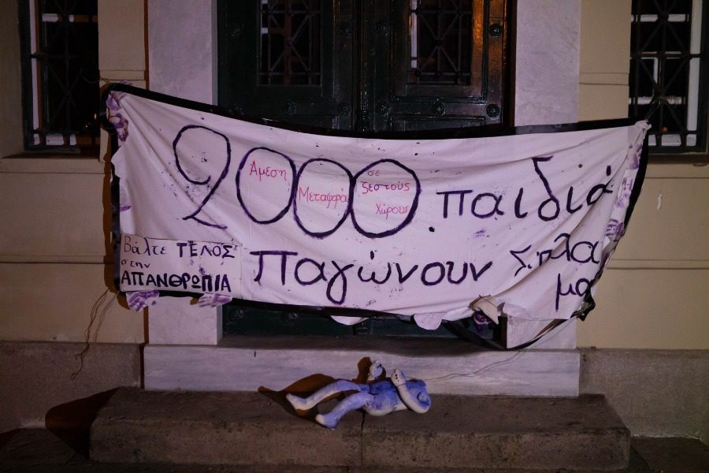

### AYS Daily Digest 17/2/21: “ **Greek state’s failure amounts to an attack on people’s lives”**
#### Organizations denounce illusional equality in the relations between the African states and the EU on the Mediterranean / The state and the UN on the ground lacking ways in which they can still disappoint people in need / Border Violence Monitoring report for January / The Spanish Supreme Court rules again in favor of the right to free movement of asylum seekers / & more

](assets/c88a98bf4c67/1*Rkr54HWMGY8gP8KHWFUB3Q.jpeg)

Photo: [Khora](https://www.facebook.com/KhoraAthens/?__cft__[0]=AZVk-ZdBc78Pal_GsBuCqndXxnay20RuyDCC4G4lIDELBXK6vnbGLC6dFCvQR5ZAnBNsXhmzPaGe_IiYz1_N4hnTb0-RhRD0giHdfrWfzZ3VB1k5ykSqaDM1e_htg3dDEZca_2eUz9BdklTX5SMn76iU&__tn__=-UC*F)
#### FEATURED — Greek authorities fail people and their own laws by not acting, IOM \(once again\) seems to put themselves as the priority of the UN mission on the ground

> Nobody should be forced to live in the mud, in a tent, by the sea, exposed to all elements\. Nobody should have to live in a shelter they are forced to rebuild multiple times a day because it repeatedly collapses or floods in the current conditions of strong wind, heavy rain, hail and snow\. 

All these seemingly obvious statements from the Legal Centre Lesvos team seem to be irrelevant for the Greek Migration and Asylum Minister who visited the infamous Kara Tepe camp, and concluded that the horrendous weather conditions have “not created any problems”\.

Ignoring the insufficient healthcare, total lack of privacy, food and running water, poor electricity, hot showers and other hygiene facilities for the 7,198 people currently living at Kara Tepe/Moria 2\.0, Mitarakis said that if there is any problem, it is “dealt with without disturbing the community’s normality”\. 
Many reactions came after these statements, and some of them include:

■■■■■■■■■■■■■■ 
> **[MSF Sea](https://twitter.com/MSF_Sea) @ Twitter Says:** 

> > Would you spend one night in any of these tents in sub 0°C temperatures @[nmitarakis](https://twitter.com/nmitarakis)? Would you allow your children to do it? There is nothing "regular" about structures such as #KaraTepe in any of the Greek islands. People need to be moved out and put in dignified conditions. 

> **Tweeted at [2021-02-17 12:14:08](https://twitter.com/MSF_Sea/status/1362012454784552960?s=20).** 

■■■■■■■■■■■■■■ 

**2000 children freeze next to us**

The citizens of Mytilene intervened at the City Hall of Mytilene and outside the Diocese, but also on the occasion of the arrival of the Minister of Immigration and Asylum\. “It is our duty as citizens, as people, not to exhaust our sensitivity by condemning crimes of the past, but to strive not to rewrite black pages in the history of mankind\.”

](assets/c88a98bf4c67/0*rYJ59U-ba2cUPGmn)

Photo: [**RSA**](https://twitter.com/rspaegean)

Legal Centre Lesvos stresses that COVID\-19 is no excuse for keeping people confined, stating that the restrictions on movement related to the pandemic contain clear exceptions for medical care, meaning Greek and EU nationals are able to travel to the mainland in this way\. Following all this, they have submitted a complaint to the Greek Ombudsman, urging action to redress the denial of healthcare and adequate reception conditions for 21 LCL clients and their families, whose urgent medical needs have been systematically ignored by the Greek authorities\.

To remind of the conditions there:

](assets/c88a98bf4c67/0*9mtIiqqv_zyPGqqy)

By [Moria White Helmets](https://www.facebook.com/MoriaWhiteHelmets/?__cft__[0]=AZWCJWn6TZ7qWorQs6F7y8GhFsUNNT67jPQiHICy0VGYf6FkYDHJi2dY03p1Y3YDjCclrtvDuN3Wce2XNdWhm8ZAuPpSEreyJaZCdbrzVCQy8UsurkX27A4cjNh-UO-b_WtYxoCpErdW9uoFaT7eFQC9&__tn__=-UC%2CP-R)

“Last night was horrible\. \(…\) We were fighting so hard to fix the electricity in Green Zone until midnight we tried but failed\. So too many peoples spent the night without any electricity and we needed to explain to them we just tried our very best but what can we do more? But we are really sorry we failed and we would like to help more and fix this issue with a main cable\.”

> “The weather in Samos is so bad two days now\. They warned us that it would be very windy & cold, but they didn’t do anything to protect us\. We are freezing in the tents in the jungle, we have no electricity & the water in the camp is far away and very cold”, RSA quotes a young man from the camp saying\. 

For a comprehensive overview, please see:

In the meantime, relocating people from the islands is going very slowly\. Germany seems to be the only country acting in this direction, although this is a slow process\. Since April 2020, Germany has taken in 1,677 people from Greece\. Now, as we announced earlier, 116 more people \(some 30 families with young children\) departed Lesvos for Germany within the EU supported relocation project\. Some thousands more remain in extremely difficult circumstances\.

Khora team has reported that [IOM Greece](https://www.facebook.com/IOMGreece/?__cft__[0]=AZVk-ZdBc78Pal_GsBuCqndXxnay20RuyDCC4G4lIDELBXK6vnbGLC6dFCvQR5ZAnBNsXhmzPaGe_IiYz1_N4hnTb0-RhRD0giHdfrWfzZ3VB1k5ykSqaDM1e_htg3dDEZca_2eUz9BdklTX5SMn76iU&__tn__=kK-R) team reportedly sent the residents of Malakassa camp a message saying:

> "Dear residents, Due to bad weather and highway closures, none of the organizations can access the camp today\. IOM team will be present at the site when the conditions will allow it\. Please stay inside and safe\! Thank you'' 

As they stress, this meant nobody was present to support residents when the strongest snowfall in 15 years hit the city\. People were left without electricity in freezing temperatures\. 
“Every winter since 2015 people have been dying in Greek camps because of the cold weather\. This is unacceptable\.
Today, people living in Malakassa have not had access to any water\. 
IOM Greece has not found a solution to this, forcing some to melt the snow to drink\.”
#### THE MEDITERRANEAN
### No equality in cooperation between north African countries and EU

During 2020, more than 13,400 people left Tunisia to try to reach Europe and were intercepted by the Tunisian coast guard, and more than 13,200 have reached European shores\. These figures have never been so high, FTDES notes, saying that Tunisia has never been so central to the attention of European leaders\. As we reported earlier, back in August 2020, Italy and Tunisia concluded an agreement accompanied by an envelope of €11 million for the strengthening of controls at the Tunisian borders and in particular for maritime surveillance\. Then, in November, France and Italy decided to deploy “naval or air assets off the coast of Tunisia that could alert the Tunisian authorities of possible departures”\.

The strategies so far deployed, also concerning Libya, ignore the consequences of partnering with militia\-related “coast guard” and human trafficker networks, or the return of those desperately trying to flee, and a mass killing in the Mediterranean Sea\.

> As the European authorities shirk their responsibility for research and relief on the North African Coast Guard, there are more cases of non\-assistance and shipwrecks\. While the Central Mediterranean route is one of the best monitored in the world, it is also one of the deadliest because of this laissez\-mourir policy at sea\. In 2020, nearly 1,000 deaths were recorded there, not counting the many invisible shipwrecks\. 

Now, organizations affirm their solidarity with the people of Tunisia who are fleeing and those elsewhere, condemning these outsourced security policies that generate countless violations of rights and only propagate intolerance and hatred\. Here is the entire letter signed by Migreurop, FTDES and EuroMed Rights\.

#### THE BALKANS
### New report by the Border Violence Monitoring Network

In January, the Border Violence Monitoring Network \(BVMN\) reported on 21 illegal pushbacks, affecting 684 people in total\. This report summarises the latest trends in border policing and provides updates from across the Balkans on violence being perpetrated against people on the move\. Specifically, patterns in pushback practice are examined alongside several important court rulings and EU level developments\.

This report analyses among other things:
- Practices at the Romanian border
- Lateral pushbacks to third countries
- Court rulings from Italy, Slovenia and Serbia
- Frontex leaving Hungary
- Geography of Evros/Meriç river pushbacks
- The publication also looks in depth at the transit situation in the Balkans, analysing the conditions in camps, urban spaces, detention centres and border areas\. When combined, these updates represent a crude and inhumane start to 2021, but one that is consistent with the violent border regimes that have defined recent years\.

Read and download the January report here:

### Nisos opens for unaccompanied minors in Athens

Aiming to provide unaccompanied minors with a holistic set of child protection services and access to education, sports and vocational training, Movement On The Ground and HOME Project have opened their t [hird home for unaccompanied minors](https://movementontheground.com/story/the-first-teenage-boys-arrive-at-our-nisos-home-in-athens-22897?fbclid=IwAR2uOlzbynMevVqu0YCeUz21dhPE8q7iwl5ERh_zpCpTXrnbvPz4nF39KFM) , hosting 16 people in each\.
#### FRANCE
### Volunteers with motorcycles, bikes and cars wanted

[Solidarité migrants Wilson](https://www.facebook.com/Solidarit%C3%A9-migrants-Wilson-598228360377940/?__cft__[0]=AZVUF-RlbP5iijMRCBI9Ju9oJlcDVNLN85ZFXCbP7LS43ejUfyFpyIOjJTD0r6Lv9YSuBfrwkn-s7YTRtIFXX2x5jsFgpUY-pmgwzCLpySU4fSUircDo_wIuwKLnlXxSzBauc1a_na1WlaMHcaSvtFEi8C3oyNJg0fz_Pvr1d9sR7lgKUYvlx7-5m-IliqVw5yISBGcT1kBXrKQORilF22Yk&__tn__=-UC%2CP-y-R) is looking for more people to join their mobile volunteer teams delivering aid and visiting people in more remote areas that require vehicles for such terrains\. Visit their page for more info and spread the news if you know someone who is home, would like to help, and owns one of these\.

#### SPAIN
### The Supreme Court rules again in favor of the right to free movement of asylum seekers

The High Court brings out the colors to the Ministry of the Interior for the second time in just six months\. However, the Government has acted throughout this time as if the judicial resolution had not existed, continuing with its practice of not letting people who are seeking protection to traverse the peninsula\. The judgment is not only applicable in Ceuta and Melilla, but also to the situation of persons seeking protection detained on the Canary Islands\. It concludes:

> All foreign citizens who have requested international protection or asylum in the autonomous cities of Ceuta and Melilla have the right to freedom of movement, and to establish their residence in any other city in the national territory, without this right being limited by the Administration by the foreign citizen’s condition as an applicant for international protection and and the applicant is always obliged to notify the Administration of any change of address\. 

As the local media has [pointed out](https://www.elsaltodiario.com/refugiados/-supremo-fallar-derecho-libre-circulacion-solicitantes-asilo-?fbclid=IwAR2I9HFdSh_2Ew6OITYuSdI6ntDC2D2Qq-8DL2nfGq3kUAj-xnONYNHP7kU) , the Ministry of the Interior should now reverse their practices, allowing the free movement of applicants for international protection\. They must also provide an expansion of the number of places in reception facilities, given the fact that the asylum system is currently in a continuing state of collapse\.
#### GENERAL

A broad coalition of 100 organizations all over the EU signed an open letter to the relevant ministers and commissioners, asking for the extension of social conditionality to CAP funding\.

Astonishingly enough, workers have never featured in the Common Agriculture Policy \(CAP\) — a flagship EU policy, now accounting for about one third of the EU budget \(from highs of up to 73%\) \. While CAP subsidies are now rightly conditional on respect for basic environmental standards, public health and animal welfare, compliance with human and labour rights plays absolutely no role in the allocation of direct payments\. This is why, not surprisingly, the CAP has thus far largely failed to improve agricultural workers’ conditions\.
#### WORTH READING & LISTENING
- LIBYA — reporting on how atrocities can be prevented, how societies can be made more resilient, and how peace can be sustainably built, an article by Sara Creta: A Libyan town reckons with its past horrors and uncertain future

- City networks, led by bold mayors, are on the rise\. In the newest episode by [Cities of Refuge](https://twitter.com/UUCoR) , Colleen Thouez explains what this all means for global migration governance:

**Find daily updates and special reports on our [Medium page](https://medium.com/are-you-syrious) \.**

**If you wish to contribute, either by writing a report or a story, or by joining the info gathering team, please let us know\.**

**We strive to echo correct news from the ground through collaboration and fairness\. Every effort has been made to credit organisations and individuals with regard to the supply of information, video, and photo material \(in cases where the source wanted to be accredited\) \. Please notify us regarding corrections\.**

**If there’s anything you want to share or comment, contact us through Facebook, Twitter or write to: areyousyrious@gmail\.com**

_Converted [Medium Post](https://medium.com/are-you-syrious/ays-daily-digest-17-2-21-greek-states-failure-amounts-to-an-attack-on-people-s-lives-c88a98bf4c67) by [ZMediumToMarkdown](https://github.com/ZhgChgLi/ZMediumToMarkdown)._
