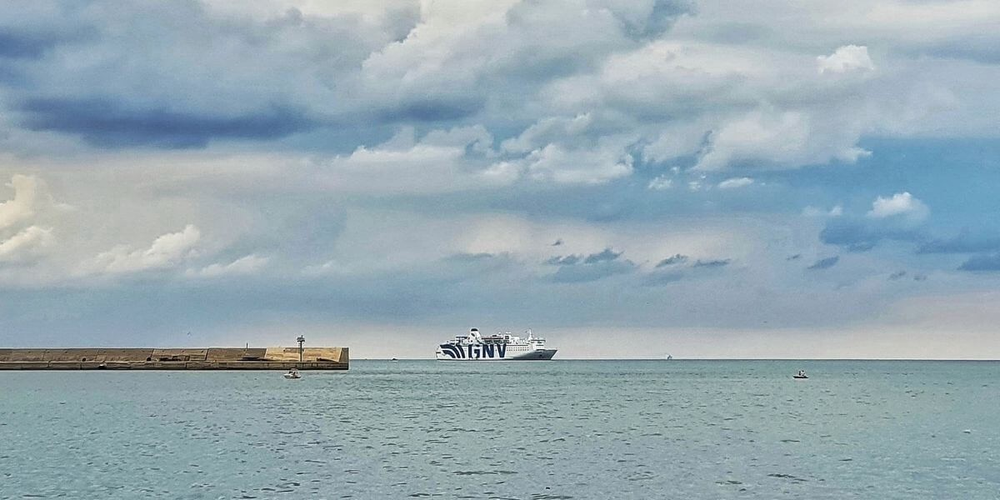
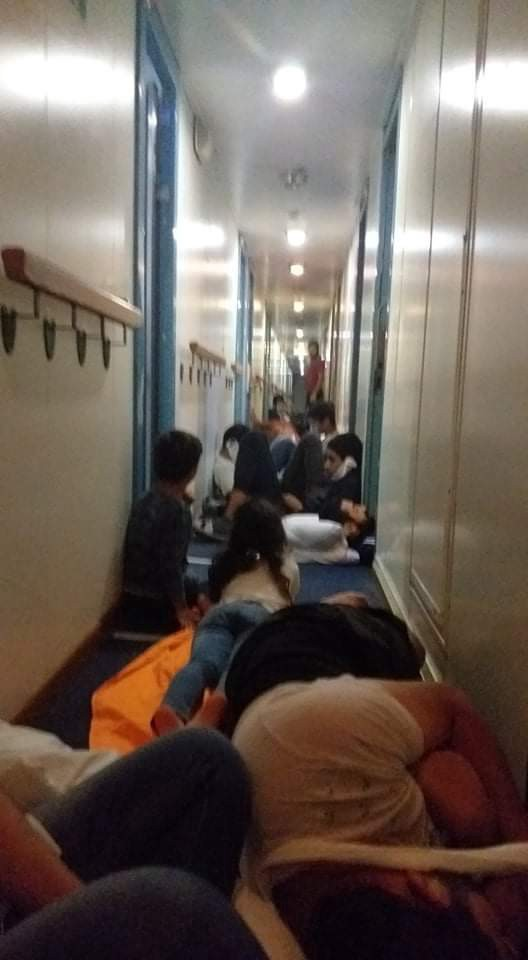
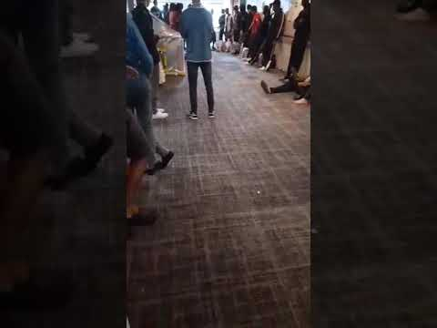

### AYS Special from Italy: 2020, not only Covid\-19\. Deportation, invisibility, detention and lack of reception\. PART II

_The [LasciateCIEntrare](https://www.lasciatecientrare.it/) campaign was born in 2011 as a response to the Interior Ministry’s provision prohibiting media access to CPRs \(Stay Centres for Repatriations, previously Identification and Expulsion Centres, CIE\) and CARA \(Reception centres\) \. Having obtained an annulment of the provision, the group now fight for the closure of all CPRs, for the abolition of administrative detention and for the revision of migration policies\. What follows is the second and last part of their report on the situation for people on the move in Italy in 2020\._

_Check out [PART I](ays-special-from-italy-2020-not-only-covid-19-deportation-invisibility-detention-part-i-e6b199a72f36) \._

#### Quarantine Ships

In April 2020, in response to the COVID emergency, ‘quarantine ships’ were established\. Large vessels belonging to private ferry companies GNV and Snav were destined to “welcome incoming migrants” for the time necessary for quarantine\. Initially the ferry Rubattino was used, then Moby Zazà, until there were 5 active ships \(Adriatico, Allegra, Azzurra, Rhapsody, Suprema\) in which 5112 people were detained on November 19, 184 of which were positive\.

_Non\-places_ which enforce a _de facto_ deprivation of rights, such as those related to the request for asylum — floating hotspots which represent a ‘convenient’ prelude to deportations and transfers to CPRs\. We have received reports of unaccompanied children in distress, and have denounced their illegal detention in partnership with other associations, which prompted the [activation](https://ilmanifesto.it/il-garante-per-linfanzia-di-palermo-far-sbarcare-i-minori-dalle-navi-quarantena/) of Palermo’s authority for the rights of minors\.

Testimonies and cases we have followed with attorney Vitale and Maria Pasqualino point out the detention on board of vulnerable people and of people with family and relatives in Italy\. We have highlighted the overcrowding, the unsanitary conditions on board, the lack of protective equipment and of proper isolation facilities, and question the effectiveness of such ships in preventing the spread of Covid\-19\. For example, the conditions on board of the Rhapsody, anchored in the port of Bari, were so bad that positive cases were found among people who had been previously tested negative\.

Quarantine ship GNV Adriatica, October 2020

On October 7, 2020 [the CARA \(reception facility\) of Pian del Lago in Caltanissetta \(Sicily\) was officially turned into a quarantine facility](https://www.lasciatecientrare.it/caltanissetta-se-questo-e-un-uomo/) \. The following day, hundreds of people from a GNV quarantine ship were transferred there\. While on the ship those who tested positive were ‘housed’ on a separate floor, in the CARA — witnesses told us — they were now sharing common areas with those people who had tested negative and should have finished their quarantine period\.

As we and other groups had previously highlighted, the Cara of Caltanissetta was known for the unhygienic conditions: old housing containers, insufficient and poorly maintained bathrooms with leaking pipes and wet floors\.

> _How could such a place be used for COVID quarantine procedures? Surely this would require adequate hygiene standards and separate spaces for people who have tested positive\._ 

After about a week, the sharing of spaces had already led to an increase in the number of cases within the centre, which was housing vulnerable people with chronic diseases, such as diabetes, who had not received the medicines they needed\. Added to this, the constant risk of fleas and dermatitis as a consequence of the living conditions\.

This case is paradigmatic of the superficiality of the authorities in terms of measures to prevent the spread of contagion, in a period of health emergency for COVID\.

[As noted by National Authorities for the rights of persons deprived of their liberty after a visit on one of the quarantine ships on September 17](http://www.garantenazionaleprivatiliberta.it/gnpl/resources/cms/documents/8f38dbde706fc2fc9913f6bd9300c9e6.pdf) , the system of mandatory quarantine cannot work in a place where separation and isolation is not guaranteed, even when other standards of hygiene or living conditions are met\.

This system has clearly demonstrated its failure, but is maintained because of the stubborn will to avoid immediate transfer to land and because of the lack of availability of reception centres — a consequence of the first Salvini security decree \(2018\), that plundered the Italian reception system\.

> _Healthcare can only be guaranteed where a hospital or a medical facility is reachable\. Being anchored far off the arrival country, quarantine ships represent not only an obstacle to access healthcare rights, but also to access the right to asylum\._ 

The deaths of [Abdallah Said](https://www.lasciatecientrare.it/verita-e-giustizia-per-abdallah-said/) in September and [Abou Dakite](https://www.meltingpot.org/Mai-piu-navi-quarantena-Appello-per-il-dissequestro-delle.html#.YA8X-TpKhPY) in October are indeed consequences of such obstacles\. Abdallah, 17\-years\-old, died after having spent days onboard of the GNV Augusta quarantine ship, where his conditions were ignored and was only transferred to the mainland when it was already too late to save him\. Abou, 15\-years\-old, died after two weeks on a quarantine ship, despite the fact that his severe malnutrition was highlighted by the medics onboard Open Arms, who had rescued him in the first place\. At the same time, too many people have died or have been seriously injured in the attempt to escape from those ships\.

> _It seems clear to us that [the protection of public health is instead used to compress the freedom and fundamental rights of people](https://www.lasciatecientrare.it/sequestrati-in-nome-del-covis-ma-dove-sta-il-diritto-alla-salute/) , among them the right to healthcare, which should be guaranteed to all, without discrimination by Art\. 32 of the Italian Constitution\._ 

The deprivation of rights on board quarantine ships is even more evident for Tunisian citizens\. They have organised protests and sent out videos and testimonies\. For them especially, this deprivation turns into a total lack of information about their future\. No information is given when they arrive on the ships, during their ‘stay’ on board or at the moment of being transferred back on land\. Some of them have been detained for 40 days, others for less, waiting for a negative COVID\-19 test, or for the second, the third…
#### Deportation

When the ships’ doors open, and one by one people are escorted out, the trap is set, with everything to make sure no one knows what will happen to them\. They are handcuffed and escorted by police onto buses\. Once off the ship, the lucky ones find ‘freedom’ outside the door with an expulsion paper; others are transferred to a CPR or to other sites for subsequent quarantine, because there may have been ‘suspicious’ contacts during the transfer operations, others are directly repatriated\.

If someone notices what is happening and tries to rebel, batons or forced restraint are used: there is no possibility of escape\. Above all, no possibility to meet lawyers or to call one\. In some cases, in fact, their phones are taken away just before exiting the ship, to avoid contact with “ [a right that does not exist](https://www.lasciatecientrare.it/navi-e-manette/) \.”

Every day the right to apply for asylum, the right to legal defence and the most basic rights to truthful information are systematically violated, but sometimes it is possible to react against the ferocity of this system\.

In mid\-November we received a phone call from Mrs\. Hadi \(fictitious name\) who spoke desperately about the quarantine of her husband on the GNV Azzurra ship, after staying for several days in the Lampedusa hotspot\.

She tells us that her husband has not been able to submit any request despite the fact that he is married to her, that she has a regular residence permit in Italy and that their very young son is also in Italy\. Like many Tunisian fathers who struggle to obtain a visa for family reunification in Italy, Hadi’s husband decided to follow the sea route \(many cases have been documented by [Terre pour Tous](https://www.facebook.com/laterrepourtous/) \) \. Hadi succeeded in having one of our lawyers appointed to defend her husband _,_ and he declared his desire to seek asylum and to be reunited with his family\. Nevertheless, from the quarantine ship where he was told that “he had no right to apply for international protection”, he was transferred to the CPR in Bari for deportation\. It was only thanks to Hadi’s stubbornness and to the lawyers of our network that this story ended positively: Hadi’s husband managed to be released from the CPR and is now with his loved ones\.

A similar case concerns an LGBT person who returned to Italy after an unjust deportation\. Given the re\-entry, he was tried by summary judgment, while he was under house arrest in Lampedusa, without his appointed lawyer being able to preside\. He was then transferred to the CPR of Brindisi, in spite of numerous _evidence_ about his vulnerability sent to the competent authority by us, Arcigay Modena and by his lawyers\. Only later did he obtain freedom, thanks also to the lawyer Stigliano\.

We would like to remember that among the people deported with ease and abuse, there are vulnerable people, whose cases we are following to demand justice and to denounce indiscriminate mass deportations\.

Wasn’t COVID supposed to bring us together? It has brought only further police discretion and ever greater abuse against those fighting for freedom and the right to a better life\. It has brought more silence and concealment and a further strengthening of the division between those who have and those who have not\.

Let’s hope that at least it turns into a fight for a better world, a world where everybody can realise their dreams and move without borders and violence\.

**Yasmine Accardo and Francesca Mazzuzi — [lasciatecientrare](https://www.lasciatecientrare.it/)**

**Find daily updates and special reports on our [Medium page](https://medium.com/are-you-syrious) \.**

**If you wish to contribute, either by writing a report or a story, or by joining the info gathering team, please let us know\.**

**We strive to echo correct news from the ground through collaboration and fairness\. Every effort has been made to credit organisations and individuals with regard to the supply of information, video, and photo material \(in cases where the source wanted to be accredited\) \. Please notify us regarding corrections\.**

**If there’s anything you want to share or comment, contact us through Facebook, Twitter or write to: areyousyrious@gmail\.com**

_Converted [Medium Post](https://medium.com/are-you-syrious/ays-special-from-italy-2020-not-only-covid-19-deportation-invisibility-detention-part-ii-23b123b96e9c) by [ZMediumToMarkdown](https://github.com/ZhgChgLi/ZMediumToMarkdown)._
