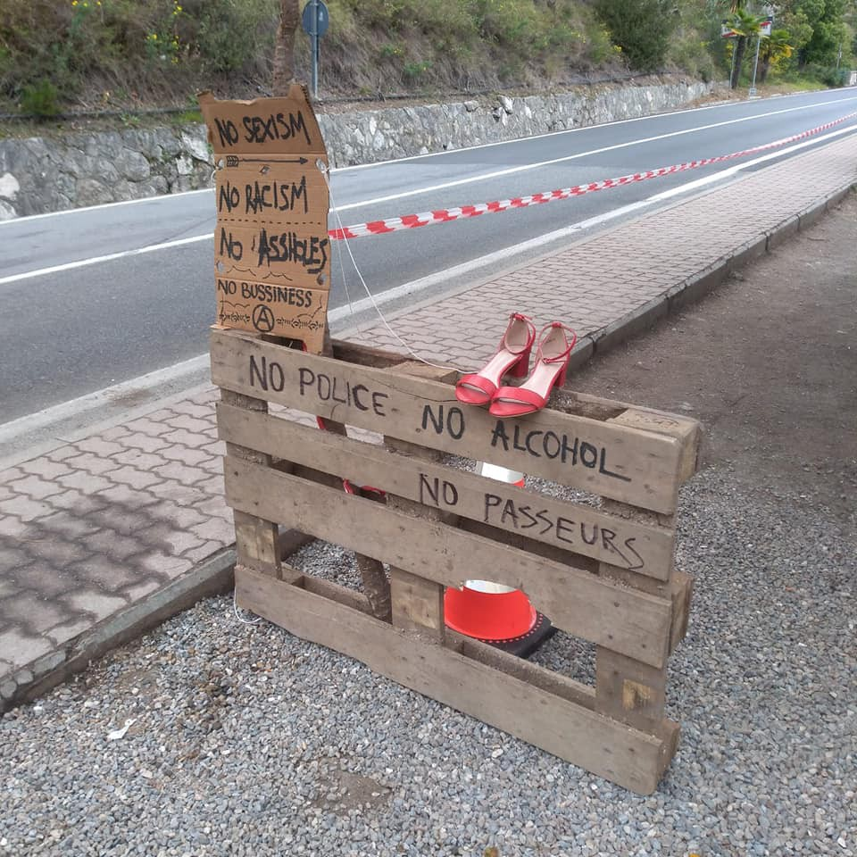
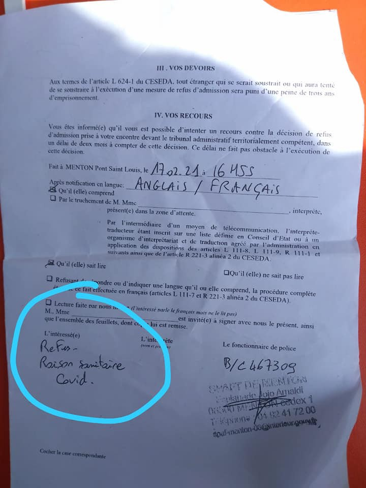

### AYS Weekend Digest 20–21/2/2021: Child abuse in Greece

Chaotic weekend in the central Med // Updates from the Greek islands, the Italian/French border and Germany // More evictions in Calais // Concerns over government\-run hotel in the UK\.

 \) \. “More than 15,000 Syrian refugees in Arsal are experiencing their second winter since a 2019 order from the Higher Defence Council, which is chaired by the president and responsible for implementing national defence strategy, required them to dismantle their shelters\. The order has forced them to live without adequate roofs and insulation, exposed to harsh winter conditions, including subzero temperatures and flooding\.” \(Read more [HERE](https://www.hrw.org/news/2021/01/19/lebanon-dire-conditions-syrian-refugees-border-town) \)](assets/6acc40c853f3/1*j7igWq4gZz6kIG7Rbz6o9w.png)

Frozen tents in the refugee camp in Arsal, Lebanon \(photos via [Moria White Helmets](https://www.facebook.com/MoriaWhiteHelmets/photos/a.129654032010998/269087314734335/) \) \. “More than 15,000 Syrian refugees in Arsal are experiencing their second winter since a 2019 order from the Higher Defence Council, which is chaired by the president and responsible for implementing national defence strategy, required them to dismantle their shelters\. The order has forced them to live without adequate roofs and insulation, exposed to harsh winter conditions, including subzero temperatures and flooding\.” \(Read more [HERE](https://www.hrw.org/news/2021/01/19/lebanon-dire-conditions-syrian-refugees-border-town) \)
#### FEATURED: Child abuse in Greece

Over the last few days, a case of child abuse has been reported in Greek\-language media and some international outlets\. On Friday, the former director of the Greek National Theatre Dimitris Lignadis was [arrested](https://tvxs.gr/news/ellada/kai-prosfygopoyla-apo-mko-feretai-na-proseggize-o-dimitris-lignadis) having been accused of raping minor children\. He resigned after the first allegations surfaced at the beginning of February, following the belated \#metoo cases in the country\. Among the victims were, it seems, a number of children on the move housed in structures in the capital, and who were attending theatre classes led by Lignadis\.

The sexual exploitation of refugee children in Athens is not a new phenomenon and was [highlighted, researched and reported](https://fxb.harvard.edu/2017/04/17/new-report-emergency-within-an-emergency-exploitation-of-migrant-children-in-greece/) on a number of times in the past years\.

While the new case is developing by the day, Greek media have rushed to focus their attention on two large NGOs in the country, ActionAid and Solidarity Now, which are [accused](https://www.documentonews.gr/article/o-lignadhs-feretai-na-pswnize-prosfygopoyla) of having ‘supplied’ children for this purpose\. With the information available at the moment, it is nonetheless still unclear whether the NGOs knew what was happening\.

As journalist Stavros Malichudis points out, blaming NGOs is a well\-established tactic of the Greek authorities, attempting to hide the network of connections and corruption through which they appoint high officials \(like Lignadis, appointed by the current minister of culture\) or grant extremely lucrative deals\. This was confirmed by the most recent statement of culture minister Lina Mendoni, who went from labelling such accusations as rumours to distancing herself from Lignadis, in an arrogant attempt to “blame everyone other than herself\.” As Lena K\. report, “all this [was going on for years](https://tvxs.gr/news/ellada/nea-stoixeia-gia-ton-gnosto-skinotheti-akoyo-klamata-kai-fones-paidion-apo-spiti&dr=tvxsmrstvxs) , very likely covered up by the authorities or otherwise people turning a blind eye\. There were reports before, and [evidence of many missing unaccompanied minors](https://www.lifo.gr/now/greece/sokaroyn-ta-stoiheia-gia-tin-exafanisi-asynodeyton-anilikon-stin-ellada) \.”

It is important that all those involved in these brutal abuses are held accountable, without falling into this very Greek ‘game of narratives’\. This blaming game is the [least helpful thing](https://kosmodromio.gr/2021/02/19/to-mathhma-ths-kurias-mendwnh/) in encouraging survivors of abuse to speak out\. Child safety should be at the very centre of this case\.

We’ll keep following the development of this case, to the extent it falls under the daily digest’s remit\. Here are some further readings on the extent of predatory abuses experienced by children in Greece:
- A thread on the [silence](https://twitter.com/smnolas/status/1363430036481716228) of Greek Ombudsmen and Child Safety authority\.
- A long an important thread on the [coverage](https://twitter.com/Malichudis/status/1363562740242079748) of this case so far\.
- [The Children and the State](https://themanifoldfiles.org/children-and-state/?posts) , a series of articles written by investigative journalists at The Manifold\.

SEA

Extremely chaotic weekend in the central Mediterranean\. Journalist Sergio Scandura talks of more than [750 people at sea](https://twitter.com/scandura/status/1362886875397160962) on Saturday\. Rescues involved Italian navy, commercial vessels and humanitarian ships\. Between [Friday](https://twitter.com/msehlisafa/status/1362824280992546821) and [Saturday](https://twitter.com/msehlisafa/status/1363232188423168003) around 850 people were returned to Libya, while dead “bodies continue to wash ashore\.” Of the 350 people returned on Friday, more than 150 managed to flee once ashore, media [report](https://www.libyaobserver.ly/inbrief/over-150-migrants-flee-disembarking-point-after-saved-sea) \.

More than 3,000 people have been returned to Libya in 2021\.

157 people were returned to Tunisia between [Saturday](https://twitter.com/TapNewsAgency/status/1363105372077256706) and [Sunday](https://twitter.com/TapNewsAgency/status/1363613915796688904) \.

Jeff Crisps and Omer Shatz \(check the [whole thread](https://twitter.com/JFCrisp/status/1363193285020377088) \) pointedly question the role of IOM and UNHCR in aiding and abetting these returns:

■■■■■■■■■■■■■■ 
> **[Jeff Crisp](https://twitter.com/JFCrisp) @ Twitter Says:** 

> > 1. Who provided the ships &amp; other equipment needed to intercept &amp; return these people?
2. Why "asylum seekers and migrants." Are you sure none were refugees?
3. Where are these people - including the women and children - now?
4. Why is @[UNHCRLibya](https://twitter.com/UNHCRLibya) not telling us the whole story? 

> **Tweeted at [2021-02-20 18:26:20](https://twitter.com/JFCrisp/status/1363193285020377088).** 

■■■■■■■■■■■■■■ 

#### Updates from Friday

On Friday we [reported](ays-daily-digest-19-02-2021-fire-in-moria-2-0-174c936a07a6) of two distress cases\. According to Alarm Phone, the 120 people on the first boat are likely to have been [rescued](https://twitter.com/alarm_phone/status/1362808258680020996) by the commercial vessel Vos Triton, but we couldn’t find confirmation of this news, as later reports confirmed only 77 people on board the vessel\. There is sadly [no update](https://twitter.com/alarm_phone/status/1362786208330502148) about the second boat, with 90 people on board, in Maltese waters; Alarm Phone was not able to re\-establish contact after Friday\. At that point they had already been at sea for three days\.
#### Distress calls, rescues and shipwrecks this weekend

The lack of official information, and of coverage from most mainstream media, make accurate reporting on these too often tragic crossings very difficult\.
- On the night between Friday and Saturday, one boat capsized near Lampedusa\. Italian coastguard rescued 45 people, but at least 7 are still missing and [feared](https://twitter.com/alarm_phone/status/1363442763082178561) dead\.
- Two boats [arrived](http://www.mediterraneocronaca.it/2021/02/20/migrazioni-a-lampedusa-superata-quota-mille-raffica-di-sbarchi-tra-libia-e-tunisia-foto/) in Lampedusa on Friday night, carrying 105 and 232 people respectively\. 80 more people arrived at dawn on Saturday\.
- [77 people](https://twitter.com/alarm_phone/status/1363244014615605253) \( [other sources say 89](https://twitter.com/AngiKappa/status/1363607009644453892) \) in one boat were rescued and brought to Lampedusa on Sunday night\. Moonbird spotted the inflatable boat on Saturday and called on the commercial vessel Vos Thalassa, which confirmed it was heading to rescue them\. It did not\. The people on board were rescued only when they reached Italian territorial waters near Lampedusa\. It is [reported](https://twitter.com/AngiKappa/status/1363577824838311938) that one baby girl was born during the crossing and is now on the Italian island\.
- [63 people](https://www.radioradicale.it/riascolta?data=2021-02-22#o=09.03.45) \(55 according to [Maltese media](https://www.maltatoday.com.mt/news/national/107840/migrants_from_libya_reach_birebbua_on_dinghy?fbclid=IwAR0tYte8WMg_SCEJCUAfe2YHh1yfs6Esen7DwQA55m1twkHfPNrkGNIbcns#.YDKk8jJxc2w) \) arrived autonomously on Malta\.
- Another 77 people are on board of Vos Triton, now headed to Porto Empedocle, Sicily\. It is reported that people on board [thwarted](https://twitter.com/scandura/status/1363582556524969985) the attempt of the commercial ship’s crew to return them back to Libya, protesting until the crew decided to make route to Italy\. The Vos Triton was already responsible for a pushback in [2019](https://twitter.com/scandura/status/1103959140517462016) , as well as the Vos Thalassa in [2018](https://www.radioradicale.it/riascolta?data=2021-02-22#o=09.15.45) , which is owned by the same person\. Italian authorities are [blocking](https://www.radioradicale.it/riascolta?data=2021-02-22#o=09.03.45) the people on board from disembarking, as they are investigating the events on board the ship\.
- On Saturday night, Alarm Phone [reported](https://twitter.com/alarm_phone/status/1363246249550483457) of a distress call coming from a boat with 110 people on board\. Their engine was not working anymore\. No more updates were published about it\.
- 83 people [arrived](https://twitter.com/alarm_phone/status/1362773097116545027) autonomously in Lampedusa on Sunday, after at least two days at sea\.
- On Sunday, Aita Mari [arrived](https://twitter.com/maydayterraneo/status/1363412300573663233) in Augusta, Sicily, with 102 people onboard, disembarkation should take place on Monday\. Aita Mari was [welcomed](https://twitter.com/smhumanitario/status/1363512299986780166) by Ocean Viking, still anchored in port\.
- [232 people and one dead body](https://twitter.com/scandura/status/1363547308231716869) are on board the commercial vessel Asso30, headed towards Porto Empedocle, Sicily\.

GREECE
#### Greece applies for more deportations

In January, Greek authorities applied to the EU and Frontex in order to reactivate the ‘readmissions’ of rejected asylum seekers from the Greek Island to Turkey, which was stalled at the beginning of 2020\. At that time, Greece applied for the deportation of 1450 people\. Now, one month later, authorities have applied again for further support with the deportations of 519 people detained in pre\-departure centres on the mainland\.

As media report, migration minister Mitarachi [announced](https://www.keeptalkinggreece.com/2021/02/20/greece-migrants-return/) the request to the EU’s border service Frontex and the Commission while adding that border countries like Greece are expecting the new EU migration and asylum agreement to provide “a powerful mechanism and the necessary legal framework for expulsions and returns\.”

Lesvos
#### Another fire in Moria 2\.0

On Friday, we [reported](ays-daily-digest-19-02-2021-fire-in-moria-2-0-174c936a07a6) about a fire in the camp on Lesvos, which destroyed one tent\. This time, luckily, no one got hurt\.

Yesterday, Sunday 21st, another fire was [reported](https://twitter.com/DunyaCollective/status/1363418708035702784) in the camp\. One woman was injured and taken to hospital\.

■■■■■■■■■■■■■■ 
> **[DunyaCollective](https://twitter.com/DunyaCollective) @ Twitter Says:** 

> > Another fire in #Karatepe. This video was sent by a friend from inside the camp just now. Another tent burned down. Refugees on the ground reporting of one injured person. We cannot verify this information at the moment.

#Moria2 
#LeaveNoOneBehind https://t.co/b8yOYpIPlH 

> **Tweeted at [2021-02-21 09:22:05](https://twitter.com/i/status/1363418708035702784).** 

■■■■■■■■■■■■■■ 

Moria Media Team [reported](https://twitter.com/MoriaMediaTeam/status/1363454992787660802) that the fire was extinguished — again — by residents\. Eric Maddox, from Latitude Adjustment Podcast, [reported](https://twitter.com/LatitudePodcast/status/1363461674905325568/photo/1) that “police were hostile towards those attempting to film\.”

As the MMT [underlines](https://twitter.com/MoriaMediaTeam/status/1363454995572682752) , it is a miracle that fires don’t happen more often and this fire did not extend further\.

> But without protection, proper heating systems this is going to happen again for sure and is horrible\. \( [MMT](https://twitter.com/MoriaMediaTeam/status/1363454998596755457) \) 

#### On Mitarachi’s last visit to the camp

No Border Kitchen \(NBK\) Lesvos [commented](https://www.facebook.com/NBKLesvos/posts/1982853168521129) on the last visit of migration minister Notis Mitarachi at Moria 2\.0 after the harsh weather and snowfalls of last weekend\. On this occasion, ignoring as usual the reports of those actually living in the camps, he stated that: “The extraordinary weather conditions have not created any problems\. Any problem is dealt with without disturbing the community’s normality\.”

As NBK highlights, for the minister and his colleagues “the ‘community’s normality’ of Moria 2\.0 is not a problem, but a solution\. Requirements and rights ‘guaranteed’ by the same governments and organisations that break them on a routine basis without fear of repercussions in the end only serve as public relations tools\.”

The alternative reality constantly portrayed by Mitarachi during his public speeches serves one specific purpose: to shift, with time, what is considered ‘normal’\.

> They, with the help of our EU politicians and the UN, create, maintain and sustain both the camp as a structure and a narrative\. For them, it serves their practical and narrative interest to not only maintain the current border structures but make them even harsher\. And this is how it can happen that the minister of Asylum and Immigration can visit a place like Moria 2\.0, by now as notorious for its inhuman conditions as old Moria, stand there for a while and subsequently conclude that there is nothing wrong\. This while knowing full well the temperature at night has gone close to zero accompanied by an icy wind, that in other parts of the country this has already proven fatal to people in similar circumstances\. He knows that the food is bad and the electricity system is insufficient\. That sexual violence is an ever present threat\. That the toilets are filthy and there are still insufficient showers\. **To him, the only thing that matters how strong the fences are\.** 

> … But this neither is a surprise anymore\. None of this is anymore really a surprise\. The policies continue to wreak havoc on people’s lives, exposed to the continued stress of awaiting their asylum decisions in an undignified camp with improper facilities and no possibility to protest\. The fundamental intent of “controlling the flows of migration” is to keep our Nation\-states exclusive, and to keep worldwide inequality intact\. The fundamental intent of “refugee camps” is to create a space where laws and standards can be circumvented, and people can be treated like cattle\. 

Read their full statement [HERE](https://www.facebook.com/NBKLesvos/posts/1982853168521129) \.

Chios:
#### Local resistance is stalling new camp plans

As we reported last week, Europe Must Act is now publishing a [monthly update on the state of the new closed/controlled facilities](https://t.co/NtsYfp6r1P?amp=1) \(MPRIC s— Multi Purpose Reception & Identification Centres\) on the eastern Greek islands\.

■■■■■■■■■■■■■■ 
> **[Europe Must Act](https://twitter.com/EuropeMustAct) @ Twitter Says:** 

> > ➡️ Camp planned on Chios

Because of strong local resistance, Chios remains the only Aegean island where plans for a closed centre are on hold. There is a general sense of being unheard and ignored by national authorities &amp; the EU. Chians have organised peaceful protests... (1/3) https://t.co/8rTSjucrJP 

> **Tweeted at [2021-02-20 09:00:00](https://twitter.com/EuropeMustAct/status/1363050761157038080).** 

■■■■■■■■■■■■■■ 

As an alternative, local authorities have [proposed](https://twitter.com/EuropeMustAct/status/1363050863464501254) the creation of a small temporary camp in which to house new arrivals before their transfer to the mainland\.

Leros:
#### A dark history of detention

The same Europe Must Act report [signals](https://twitter.com/EuropeMustAct/status/1363413151077687297) how, on Leros, the construction of a new detention facility represents a return to military dictatorship times, when the island hosted an internment facility for political dissidents\.

Kos:
#### Recognised refugees left homeless on the island \(and throughout the country\)

Katy Fallon received [reports](https://twitter.com/katymfallon/status/1363574388545757193) of around 100 people with refugee status left without support as a result of the latest change in policy and in the modalities for entering the Helios housing program\.

FRENCH/ITALIAN BORDER
#### **Update from the French Italian border**

 \)](assets/6acc40c853f3/1*qOUV66aowfFLYvL2dbEaqg.jpeg)

\(Photo Credit: [Progetto20k](https://www.facebook.com/progetto20k/?__cft__[0]=AZUKTFLPH1bfjPwUI7ZF_ef03e1bD-Yd6u8Owpj1nQiqnFgyMRmRHpAi3fXSbFPSdukThe9STiy_RzbMbxxghc4SEcP8jJ8dhjg42ux0HgGJ-PxTd9VE5WFokSR-3yKk0oez4vnk1hZqWxQHz_KNo5ZH&__tn__=-UC%2CP-R) \)

[Progetto20k](https://www.facebook.com/progetto20k/?__cft__[0]=AZUKTFLPH1bfjPwUI7ZF_ef03e1bD-Yd6u8Owpj1nQiqnFgyMRmRHpAi3fXSbFPSdukThe9STiy_RzbMbxxghc4SEcP8jJ8dhjg42ux0HgGJ-PxTd9VE5WFokSR-3yKk0oez4vnk1hZqWxQHz_KNo5ZH&__tn__=-UC%2CP-R) report that the numbers of people at the border have dropped to 50–60 people per day\.

> The news of the last few weeks is the rejection of non\-communitarix \[non\-EU\] citizens in possession of all the documents necessary for the deportation, but without any of the COVID tests\. They are also taken to the border police post, detained in containers and then released in Ponte San Luigi\. 

> In short, the practice of French police at this time seems to be to reject non\-Community \[non\-EU\] citizens, using the health excuse to legalize it and make it systematic\. 

Train checks at Menton\-Garavan station continue as usual, mainly on an ethnic basis\. During car checks from Italy to France you are asked why you’re going to France and have to show the written attestation, so there are often queues\. In the reverse direction \(France > Italy\), on the other hand, the checks seem less thorough\. Train checks at Ventimiglia station by Italian\-French patrols are still happening at least once a day\.

Progetto20k’s current needs list is: shoes, blankets, jackets, underwear, sweatpants, hygienic\-sanitary material like razors and shaving foam\. You can also support them [HERE](https://www.produzionidalbasso.com/project/sostieni-progetto20k/?fbclid=IwAR206GgYU7AlV0OZxGZQHmiHNT-PgoOweYMGhG1VgZmnQTpafaJKgfj6VfI) \.

> In this period more than ever it’s essential to be able to carry on our activities, to the forced isolation we respond with active solidarity, weaving politically generative alliances\. 

FRANCE
#### **50 people deported from Vincennes CRA**

[Paris D’Exil report](https://www.parisdexil.org/post/communiqu%C3%A9-expulsions-et-r%C3%A9tention?fbclid=IwAR2fkgH3wseZOSOQ0zvi5kornJzoME68j2uUyTLaiPrE9cZRZd320LxaSjg) that between 11 January and 11 February 2021, at least 50 people were deported from the administrative detention centre \(CRA\) in Vincennes [under the much\-maligned Dublin Regulation\.](https://www.lemonde.fr/international/article/2020/09/17/immigration-ursula-von-der-leyen-veut-abolir-le-reglement-de-dublin-qui-cristallise-les-tensions_6052507_3210.html) In other words, they deported asylum seekers to European countries where they first registered their asylum applications despite COVID\-19 risks and the possibility that they will be returned to the countries that they fled\.
#### **More evictions in Calais**

■■■■■■■■■■■■■■ 
> **[Human Rights Observers](https://twitter.com/HumanRightsObs) @ Twitter Says:** 

> > Ce matin à #Calais ont eu lieu expulsions  7 expulsions de lieux de vie informels.
• 3 tentes, 3 bâches, 1 sac et 1 vélo ont été saisis. 

À la #frontière, tout est organisé : expulsions quotidiennes, violences, pression policière, discriminations,... https://t.co/2dJvB6buKf 

> **Tweeted at [2021-02-20 20:30:49](https://twitter.com/HumanRightsObs/status/1363224612369096704).** 

■■■■■■■■■■■■■■ 

GERMANY
#### **German court rules use of force was unlawful**

As surprising as this may be to some members of the police, it is not legal to enter someone’s room without a warrant, force them to the floor and tie them up even if such behaviour is considered “common”\.

[Info Migrants reports](https://www.infomigrants.net/en/post/30370/german-court-partially-rules-in-favor-of-asylum-seeker-from-cameroon?fbclid=IwAR0UKpYuRLnfH9pAknsvVGPECSHVSDrJn0KzikFlc6fnD9oGsD9tEOG9OVI) that:

> The court determined that the “identification of the claimant, the entering and searching of the claimant’s room, as well as searching and pinning down the claimant while using one\-time handcuffs” were unlawful\. 

The court case was brought by a Cameroonian to the administrative court of Stuttgart regarding a raid which took place in May 2018 at the state reception facility \(Landeserstaufnahmeeinrichtung or LEA\) in the town of Ellwangen east of Stuttgart\.

> Two of the police officers who participated in the raid denied taking the Cameroonian’s mobile phone and defended tying him up on the ground as “common”\. 

#### **Deportation threat for Afghanis**

[Flüchtlingsrat Bay](https://twitter.com/BFR_089) report that a collective deportation to Afghanistan is planned on March 9th 2021 according to their current information\.

UK
#### **Mainstream media raise concerns over government run hotels**

Reports came out over the weekend covering a variety of concerns including [sexual abuse](https://www.theguardian.com/uk-news/2021/feb/21/asylum-seekers-subjected-to-sexual-harassment-in-government-hotels?fbclid=IwAR3hG9IrsYltUBwfuVZK4kIE0cd43eGx_9qHf7fXxbdSUNezXnfalfS-02o) , the [forced eviction and subsequent homelessness of single women](https://www.independent.co.uk/news/uk/home-news/asylum-seeker-evict-hotel-home-office-uk-b1802889.html?fbclid=IwAR3UCxpRkxSuSvKsmXRxfNwd9D5s7YJLYGnJExOJgl86Nxu5atZHrHaY28U) , a [lack of wifi](https://www.independent.co.uk/life-style/gadgets-and-tech/asylum-seekers-wifi-data-devices-online-b1803619.html?fbclid=IwAR1tkxIdb_QF4Zr4z08luy2P-qsykvKGlfAxkXW5bPzLEySWphy7YpxpYCw) \(particularly difficult for children during school closures\) and a [lack of adequate COVID provisions](https://t.co/VCKE2Ko9X1?amp=1) \. Other aspects of the hostile environment policy have also been [brought to light](https://www.theguardian.com/uk-news/2021/feb/21/fewer-than-one-in-six-hostile-environment-raids-led-to-deportations?fbclid=IwAR3OnzqWfL1u0T1oBTSYycPDPhUAEy_MgsnZoZcD8blK4p6p-NeaFRjJhjg) by a recent freedom of information request by the [Joint Council for the Welfare of Immigrants](https://www.jcwi.org.uk/Pages/News/) \. Less than 1 in 6 of the 44,000 immigration enforcement raids which took place between 2015 and 2019 led to deportation\. But they did manage to deport 37 care workers during 190 raids on care homes, often taking people in the middle of a shift while the looked after vulnerable and elderly people\.

Maybe Priti Patel should try doing a 12 hour night shift looking after someone with complex needs for minimum wage before she makes any further decisions about people’s right to remain\.

Coming over here… and looking after the elderly…
#### **Young man accused of piloting boat, jailed**

[24 year old Kuwaiti Mahmoud Al Anzi](https://www.kentonline.co.uk/kent/news/man-who-steered-over-crowded-migrant-boat-jailed-242829/?fbclid=IwAR3kTudeVQ7K7a553KsYOWpuBQgY7a8t5mf_q0oK50HzzrTpkZxiBFFgPUQ&cmpredirect) has been sentenced to three years and nine months in prison after a three\-day trial\. He was accused of piloting a boat carrying 11 people on the 10th of June 2020\. He is the ninth person to be jailed this year in relation to steering a small boat\.

Of course, none of this would be necessary if there were safe pathways to the UK for asylum seekers\. It is not a crime to seek asylum\.

**Worth Reading**
- Two articles on [**Why Britain’s anti\-immigration politicians are opening the doors to thousands of Hong Kongers**](https://edition.cnn.com/2021/02/20/uk/uk-hong-kong-bno-scheme-intl-gbr-hkr/index.html?fbclid=IwAR15Z-KfsKtJqpU8Vg1cRP2iHKL_to8lbPB-I1TduN75c0O-qvqEIfnrSKo) and [**what are the risks of this divisive policy**](https://www.chathamhouse.org/2021/02/uks-hong-kong-visa-scheme-must-be-part-wider-review) **\.**
- [**‘Living in this constant nightmare of insecurity and uncertainty’:**](https://thecivilfleet.wordpress.com/2021/02/21/living-in-this-constant-nightmare-of-insecurity-and-uncertainty/?fbclid=IwAR33NCwkBzUnb5JPlCFix1PG7vQBKKIghkud8BErU7CJCzQobY5PZINSx6s) Bethany Rielly talks to refugees and NGO workers about the child mental health crisis in Lesvos refugee camp, where there are no activities, no school, where tents collapse in the night, and storms remind children of the war they fled from
- [**Caught in war:**](https://www.spiegel.de/politik/ausland/syrien-binnenvertriebene-in-idlib-gefangen-im-krieg-a-5e4cd45c-9265-480c-b3e7-7c9c2e34f2be) Idlib was once a prosperous province in northwest Syria, right on the border with Turkey\. Today, after almost ten years of civil war, Idlib is a single, huge refugee camp\. Hundreds of thousands of people have fled here … two million people live in camps, tents or wooden crates, and around four million live in the province … The EU, it seems, has given up on these people\. Help comes from Turkey at best\. But it has a price\.

**Worth Attending**
- **National meeting Wednesday 3 March 6pm — 8pm** Zoom meeting open to all who want to change the immigration bail reporting \(signing\) system in Britain\. Hosted by [Migrants Organise](https://www.migrantsorganise.org/) and [These Walls Must Fall](https://www.detention.org.uk/) organisers from [Right to Remain](https://righttoremain.org.uk/) \. Register [HERE](https://detention.org.uk/stop-signing/?fbclid=IwAR11AE-dYYwOawRGfzAs4hVzH557wWFw18MiF_TTzJbgcivFVtJewlq8DiQ) \.
- **A [series of workshops on migrants’ rights](https://www.eventbrite.co.uk/e/know-your-rights-workshops-tickets-140832179841?fbclid=IwAR11AE-dYYwOawRGfzAs4hVzH557wWFw18MiF_TTzJbgcivFVtJewlq8DiQ) \!** These are free, everyday Feb 22–24, 1–3pm\. Learn the wider context of the ‘hostile environment’ and what your rights are as a migrant in the UK\. Gain access to knowledge and confidential support from experts on how to deal with issues affecting you

**Worth Watching**
- Some [Sunday watching](https://twitter.com/migrantsorg/status/1363404610124341249) in case you missed it — catch up on our first 2 [**\#SolidarityKnowsNoBorders**](https://twitter.com/hashtag/SolidarityKnowsNoBorders?src=hashtag_click) **webinars** \(totally free\) now\! [The Power of the Migrant Vote](https://t.co/IkQzRQNOfb?amp=1) and [The Struggle for Migrant and Racial Justice in Britain](https://t.co/M7dHoceiid?amp=1) \.

**Find daily updates and special reports on our [Medium page](https://medium.com/are-you-syrious) \.**

**If you wish to contribute, either by writing a report or a story, or by joining the info gathering team, please let us know\.**

**We strive to echo correct news from the ground through collaboration and fairness\. Every effort has been made to credit organisations and individuals with regard to the supply of information, video, and photo material \(in cases where the source wanted to be accredited\) \. Please notify us regarding corrections\.**

**If there’s anything you want to share or comment, contact us through Facebook, Twitter or write to: areyousyrious@gmail\.com**

_Converted [Medium Post](https://medium.com/are-you-syrious/ays-weekend-digest-20-21-2-2021-child-abuse-in-greece-6acc40c853f3) by [ZMediumToMarkdown](https://github.com/ZhgChgLi/ZMediumToMarkdown)._
