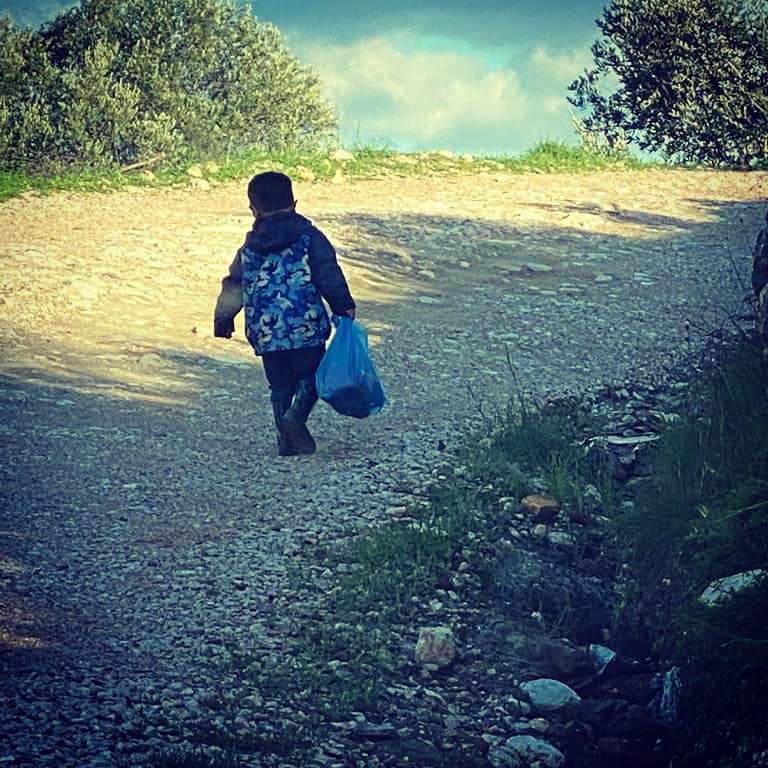
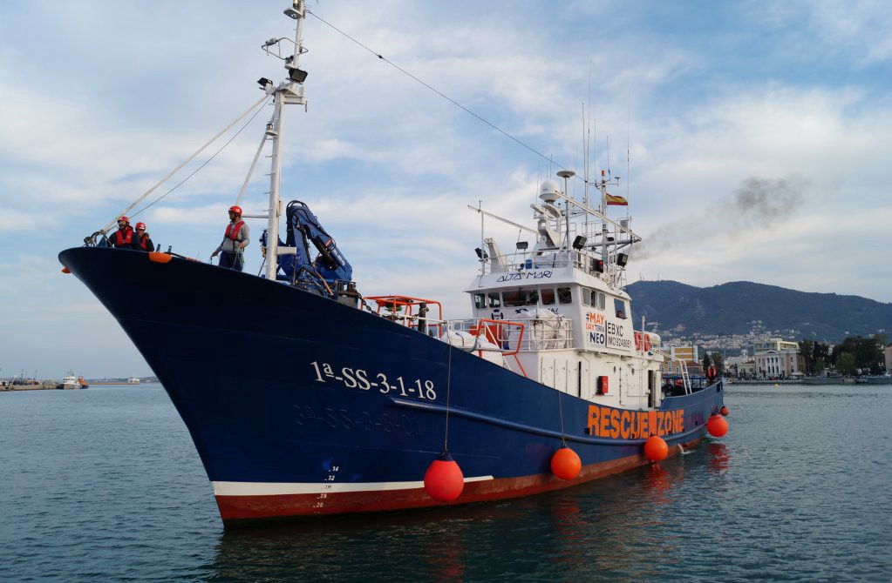

### AYS Daily Digest 22/02/2021 — Children along migrant routes endure mental health crisis and abuse
### Deadly interceptions by Libyan coast guard // New European Parliament watchdog on Frontex // Romania and Cyprus register record migration numbers // and much more…

[Are You Syrious?](?source=post_page-----9adc2fe28b83--------------------------------)

[Feb 23](ays-daily-digest-22-02-2021-children-along-migrant-routes-endure-mental-health-crisis-and-abuse-9adc2fe28b83?source=post_page-----9adc2fe28b83--------------------------------) · 10 min read

### GREECE

It is sadly known that children and unaccompanied minors are the most vulnerable people along migration routes\. They face incredibly hard lives and traumatic experiences that no child should endure; they lose precious, formative years — if not their lives\. And, too often, they fall prey to smugglers and predators\.

We continue reporting on the ongoing case of NGOs in charge of unaccompanied minors allegedly involved in the case of former National Theatre director Dimitris Lignadis during the period 2017–2018\.

The Special Secretary for the Protection of Unaccompanied Minors [filed a memorandum today with the Prosecutor’s Office](https://twitter.com/migrationgovgr/status/1363793841615167495?fbclid=IwAR0n6khQkTkVgA3pvmZfRQgZp-TWHPfu1Z4baqLnC9cJK5QCTW_wqZTtTxM) , requesting the investigation of those who have recently seen the light of day\. Ms\. Agapidaki stated:

> _I came today to the Prosecutor’s Office to request the full investigation of the complaints arising from publications and concerning possible illegal acts committed during the period 2017–2018 against unaccompanied minors\. Nothing should be left in the dark without investigation\._ 

The public prosecutors’ office on Monday l [aunched a preliminary investigation](https://www.keeptalkinggreece.com/2021/02/22/ngos-unaccompanied-minors-refugees-investigation-lignadis-prosecutor/) into these allegations\.

The head of the first\-instance court prosecutors, Sotiria Papageorgakopoulou, has ordered the investigation of all articles and posts claiming that the NGOs responsible for running shelters for unaccompanied refugee and migrant children at that time arranged for them to have drama lessons with Lignadis, who is currently facing charges as a serial rapist\. It remains unclear whether this investigation pertains to the role of NGOs, or the veracity of the articles and posts and the alleged defamation they contain\.

Meanwhile, pressure is mounting for the resignation of the Minister of Culture who appointed Lignadis\.

[Aegean Boat Report shows](https://web.facebook.com/AegeanBoatReport/posts/1033636943826076) evidence of small children left drifting on life rafts on the Aegean Sea\.

> _In yet another shocking breach of international law, men, women and children have been beaten, robbed and forced onto a life raft by Greek authorities, despite repeated government claims that it does not undertake ‘pushbacks’ of refugees into Turkey\. Thirteen men, women and children were forcibly removed from a refugee camp in Lesvos on Wednesday night by uniformed operatives, who claimed the refugees were being taken to be tested for COVID\-19\. Instead, they were forced into an isobox, repeatedly beaten with batons, stripped of their possessions and forced out to sea on an inflatable life raft\._ 

Bethany Rielly, who speaks about the mental health crisis of children in MORIA 2\.0, found it very difficult to report about her disturbing findings\.

MSF has warned of a mental health “emergency” among children at Moria, where 7,100 refugees are enduring the coldest months of the year in flimsy tents without heating or running water\. Moria 2\.0, the new site, is even worse than the previous one\.

What many child psychologists are finding, however, is that — more than past traumas — the current conditions in the camps are leading children to experience severe mental health issues\. The fire at Moria was a re\-traumatising experience for many of them\. Read the full report [here\.](https://morningstaronline.co.uk/article/f/living-mud-hole-takes-away-all-your-feeling-being-human-really?fbclid=IwAR0dBxQK1MTc5FrgYEVpxdF-9gmCa-OVe-5GNBw5Dbeml-2UtklxN9QpEd4)

We signal this fundraiser on Chios:

£5 will provide one individual dried food pack\.

£20 will provide a family sized dried food pack for four people\.

Total Giving Fundraising Link:

[https://www\.totalgiving\.co\.uk/mypage/humanitariancrisischios](https://www.totalgiving.co.uk/mypage/humanitariancrisischios?fbclid=IwAR1HjQjh6cChOEIcH7QwK053ji5HKd4_irTn14aTQgDcgrft8PYsqxSUipE)
### LIBYA

Yesterday, [another interception from the Libyan coast guard](https://twitter.com/PVolontaires/status/1363858440146272257?fbclid=IwAR0cQlPTpV_fdSYE37Auk3mm6t_CRClmp1v6JkqE__0sjR9g0g2mRq7MXYs) \. During the transshipment, nearly 20 people fell into the sea, and six people [are reported](https://twitter.com/ulimuc1/status/1363956608213090308) to have lost their lives during this interception\.

[Libyan authorities say they have raided a secret prison](https://www.aljazeera.com/news/2021/2/22/libya-more-than-150-migrants-freed-in-raid-on-traffickers?fbclid=IwAR0JZZP6gvE_NjcanhF0XstzXn0zfoLrtvCJj5fFdgFdle931DdgZc1_NR8) in a southeastern city used by human traffickers and freed at last 156 African migrants — including 15 women and five children\.

The raid in the city of Kufra took place on February 16 after a migrant managed to escape a house\-turned\-prison last week and reported to authorities that he and other migrants were held and tortured by traffickers there, the Kufra security bureau said\.
### SEA

It has been a [harrowing couple of days](https://thecivilfleet.wordpress.com/2021/02/22/102-refugees-brought-to-safety-while-hundreds-more-were-left-to-their-own-fates/?fbclid=IwAR3X_Gkn15K78azzVJDhlqZvhj3WYJTvKgjUVfgV174vYUmp1k2sAjwjLFE) in the central Mediterranean\.

The Italian authorities on Sunday gave the crew of the NGO refugee rescue ship Aita Mari permission to disembark the 102 people they saved in Malta’s search\-and\-rescue \(SAR\) zone last Friday, in Augusta, Sicily\. The crew also found another boat carrying 46 people last Friday afternoon and provided them with life jackets, food and water\. They were not legally allowed to bring them on board as that would have gone over the Aita Mari’s capacity\.

Meanwhile, the Italian coast guard reported that a shipwreck had occurred 15 miles south of Lampedusa in the early hours of Saturday morning\. It said 47 people had been rescued but the search for more was still ongoing\.

We share this sad news from [SeaWarch Projekt:](https://www.facebook.com/seawatchprojekt/posts/2767175016833895?__cft__[0]=AZU48F8vO3ouuQuUHjW5V7YEx_67jSbJqR3hzvzzIL1rAVNs0mU4IGqGX2q2TCrtqjPEczGu4RStndlYDNJkaumAz-KrodoOGtg4bPpLoPdz41A4thI_EG4zOoUvxGq7NQVhurEvkcuqunC4O-KbFVXnj8zRUAEZFcjA5I7tRxq5XgGFlONu5UB-Hc3IwIDzL6I&__tn__=R]-R)

> _A merchant vessel is no place to bury a human being\. The member states of the European Union should agree on that\. And yet, on the dirty deck of a merchant vessel, people stand around a lifeless body to give the deceased person a ceremony as dignified as possible\. A macabre symbol of the EU’s disgusting migration policies\._ 

We share [an interview with Joshua](https://sea-eye.org/verzweiflung-ratlosigkeit-und-wut-auf-der-alan-kurdi/?fbclid=IwAR26WW3GvfT0rYcjHgrVKWwDvHxmz8MCAbkQYPeHHv_n1Nu6_ID2BaCeVc4) , first officer on the rescue missions of the Alan Kurdi rescue ship\.

The ALAN KURDI was detained in Sardinia in September 2020 after a successful rescue mission\. In several rescue missions, the crew rescued 133 people, including 62 minors\. The EU countries then refused to accept the rescued people\. Only when the ALAN KURDI set course for her port of destination, Marseille, did Italy request the rescue ship to enter the port of Olbia\. The Italian Coast Guard then detained the ship for the second time in 2020\. Sea\-Eye filed a lawsuit against this move in January and has been waiting for the first court hearing ever since\.

In spring, thousands of refugees will dare to cross the Mediterranean again\. The [sea rescue organization “Sea\-Eye”](https://www.dw.com/de/seenotrettung-altes-schiff-mit-neuem-job/a-56653162?fbclid=IwAR0O7xctO1-UVXEanXipaa8jO5FvnQLOP7SgGAeDUY5NSXbD6sLYEY4nYY8) is converting an old freighter and wants to help — despite sharp criticism from outside\.
### EU and FRONTEX

The newly formed [EP Frontex Scrutiny Working Group \(FSWG\)](https://www.europarl.europa.eu/news/en/press-room/20210222IPR98303/frontex-meps-to-investigate-alleged-violations-of-fundamental-rights) will monitor Frontex’s compliance with human rights and investigate violations\.Following a [decision by the Civil Liberties committee coordinators on 29 January](https://www.europarl.europa.eu/meetdocs/2014_2019/plmrep/COMMITTEES/LIBE/DV/2021/02-04/Outcomeofwrittenprocedureof29January_EN.pdf) , fourteen MEPs — two per political group — will assess Frontex activities and organisation, including its reinforced role and resources for integrated border management and the correct application of the EU acquis\.
### TURKEY

[Erdoğan has accused Greece of pushbacks](https://www.spiegel.de/politik/ausland/tuerkei-recep-tayyip-erdogan-wirft-griechenland-pushbacks-von-schutzsuchenden-vor-a-717c7a7a-e699-47e3-af09-35685c6b0a0e?fbclid=IwAR26WW3GvfT0rYcjHgrVKWwDvHxmz8MCAbkQYPeHHv_n1Nu6_ID2BaCeVc4) of people seeking protection\. Turkish President Erdoğan uses migrants as bargaining chips in a dispute with the EU\. His accusations against Greece are true — but Ankara is no less brutal\. Indeed, Erdoğan had a wall built on the border with [Syria](https://www.spiegel.de/thema/syrien/) that makes it almost impossible for refugees to escape the war\. Human rights organizations are denouncing the fact that Turkey is deporting refugees to the war zone in Syria\. Reports from Turkish camps also indicate that the refugees there are being provided with very poor supplies\.
### CYPRUS

Meanwhile, [Cyprus has accused Turkey](https://www.infomigrants.net/en/post/30401/cyprus-accuses-turkey-of-creating-new-migration-route?fbclid=IwAR2QdUgKyoKu53b53AD_n5oeSDjMs13cp6WjvFk6flV3PBXROJdhaObhtxg) of creating a new migration route\. The Republic of Cyprus has seen an influx of asylum seekers in recent weeks and months, with many migrants entering the southern part of the country by illegally crossing the UN\-patrolled buffer zone that divides the island between the Greek\-majority south and a self\-declared breakaway Turkish Cypriot state in the north\. Cyprus said it has had the highest proportion of asylum applications in the EU for four consecutive years\. About four percent of Cyprus’ population is currently made up of asylum seekers — a number that is more than four times as high as the EU average\.

[On the 3rd of March, the island will see KISA](https://www.statewatch.org/news/2021/february/cyprus-37-organisations-call-for-the-reinstatement-of-anti-racist-ngo/?fbclid=IwAR06NpuByirkkF1eG0vXUO6fQep2Y8CU1udHewS_oxjQ0nfrgvG4I-uA6ek) , a leading non\-governmental organisation fighting for equality in Cyprus, have a hearing that has implications for their very survival\. In December 2020, the Cypriot Minister of Interior abruptly removed KISA, and many other civil society organisations, from the Register of Associations\. This is just the latest move in a long campaign to discredit and silence independent voices in Cyprus, in particular KISA, and ultimately attack the foundations of democratic pluralism\.
### BALKANS

Since the fall of the Islamic State ‘caliphate’, [piecemeal efforts by Balkan states](https://balkaninsight.com/2021/02/22/slow-pace-of-balkan-repatriation-leaves-over-100-children-in-syrian-camps/?fbclid=IwAR0lJUm4MHONqH1ypZrT0YMIiSdcz1o-5Tm4uWoFbyA9mfUQa5trMHw6CoM) to repatriate their nationals from refugee camps in Syria means more than 100 children are still living in squalid, unsafe conditions\.

On February 8, United Nations human rights experts made a new call for states to repatriate their citizens from squalid camps in northeastern Syria\. Five Western Balkan countries, however, are hesitating when it comes to bringing all of their nationals back home, including at least 130 children\.

Repatriation is indeed a logistical challenge for many of these smaller countries, which do not have adequate resources, international leverage, and political commitment, to safely reintegrate and rehabilitate former foreign fighters\.
### ROMANIA

Romania has registered a record number of asylum requests last year\. [According to data from the General Inspectorate for Immigration](https://www.romania-insider.com/romania-asylum-claims-2020?fbclid=IwAR0868LruN0nKGRV3dNY5lWqpt3FFVLJzKZ5ftUzcdNDb8pHI1VPJv48Pa4) , a total of 6,138 asylum applications were made in 2020, which represented an increase of 137% compared to 2019\.

> _“6,138 requests for granting international protection were made during the reference period, rising by 137% over the same period of 2019 and, at the same time, exceeding the largest number of applications for international protection addressed to the Romanian state — 4,820 asylum applications submitted in 2017,” the General Inspectorate for Immigration said\._ 

### POLAND

A [new survey](https://www.thefirstnews.com/article/poles-no-longer-fear-refugees--poll-20002?fbclid=IwAR2_Yi4JcxmJOgO20o9UDvscCvvtqhDVwbcNoVTmcOrMHvUfGEbW8zD252w) commissioned by the Polish branch of the United Nations High Commissioner for Refugees \(UNHCR\) shows that Poles are far more open to refugees than they were a few years ago\.

As many as 77 % of Poles believe that Poland should support refugees fleeing their country due to persecution, war or violence\. In 2018, the figure stood at 53%\.

> _′′There has been some calming emotions and a return to normality\. Refugees stopped being a political topic, many already live with us and we just stopped being afraid prof told”, says [S Sławomir Sowiński from UKSW](https://www.facebook.com/islamistablog/posts/2457438584565279) \._ 

### FRANCE

Dozens of people j [oined a protest rally in Paris](https://www.infomigrants.net/en/post/30400/anti-migrant-rally-in-paris-as-right-wing-group-faces-possible-ban?fbclid=IwAR3cdz4QPMNOfFS3GaPtZNS4OJGcMPqiVQTTabooqfh-Bm9Eg9LzXl2miOc) at the weekend in support of the anti\-migrant group Generation Identity\. The group is due to respond to a government order for its dissolution\.
Generation Identity, which is based in Lyon, has witnessed support in France and other European countries\. Its members say they want to defend French and European civilization against newcomers — in particular Muslims\. The French Interior Minister wants to dissolve the group, citing France’s security code that forbids “combat or private militia groups” and groups that “provoke discrimination, hate or \(racial\) violence\.’’

After the [murder of an asylum officer](https://twitter.com/DesinfoxMig/status/1363876994803458049?fbclid=IwAR3rh2jv8uGizoHcbC994q2Ulc12w6QaE8ilaIPe2jjLkGDMOr1v471BfPg) by a Sudanese national over the weekend, the public discourse in France has been once again polarised\. The far right are of course taking the angle of denouncing immigration altogether, the media is focusing disproportionately on murders committed by people on the move even though they only make up a minority of murderers in France, and some politicians are calling for a complete ban on immigration\.

For [this report](https://twitter.com/TancredeB/status/1363544214693441538?fbclid=IwAR06NpuByirkkF1eG0vXUO6fQep2Y8CU1udHewS_oxjQ0nfrgvG4I-uA6ek) on migrants in Calais and Grande\-Synthe, the author and journalist Tancrede Bonora received insults and death threats\.

> _“We will obviously continue to do our work as journalists to show the reality on the ground\. A little humanity would do us good in 2021”_ 

The organisation Solidarité Migrants Wilson has called for volunteers to help cook and distribute meals on Tuesday 23 and Thursday 25\. Find more [here\.](https://www.facebook.com/permalink.php?story_fbid=1664174240450008&id=598228360377940)
### GERMANY

According to current information, it seems that a new collective deportation to Afghanistan will probably take place on Tuesday, March 9, 2021

[Bayerischer Flüchtlingsrat](https://www.facebook.com/Bayerischer.Fluechtlingsrat/posts/3976145259073164) advises all Afghans to urgently seek out a counselling office or a lawyer\. We especially recommend that the foreigners authorities be informed about existing diseases, upcoming training recordings and other integration services\.
### SPAIN

A [terrible accident](https://en.solidarywheels.org/post/un-menor-de-edad-pierde-la-movilidad-de-las-piernas-tras-seccionarse-la-m%C3%A9dula-haciendo-risky?fbclid=IwAR1EOoBpDaiFRA2yYXTs58eraqzHfnXEKpSTNr93Fvvs4XjHgoentcRm8jc) has struck a minor who lost the mobility of his legs falling from a five\-meter wall while trying to enter the port of Melilla to get on a ferry bound for the Peninsula\. It is the lack of safe routes for people on the move that leads them to take dangerous risks, with dire consequences for their physical integrity\.
### UK

Fewer than one in six of more than 44,000 “intelligence\-led” Home Office immigration enforcement raids on people’s homes since the introduction of the [“hostile environment” policy](https://www.theguardian.com/uk-news/2019/jun/27/home-office-windrush-report-damns-hostile-environment-policy) have resulted in deportations, a [ccording to data obtained by the Guardian](https://www.theguardian.com/uk-news/2021/feb/21/fewer-than-one-in-six-hostile-environment-raids-led-to-deportations?fbclid=IwAR1H7YSAGPWPwX1ch8lN198lwtzDw7AZTCq_3ULGu0zt55FraclD3skYHGs) \.

Mary Atkinson, campaigns officer at JCWI, said:

> _These figures show just how out of control the hostile environment has become\. Carers are being arrested in the middle of their shifts, often as they look after elderly and vulnerable people — it is difficult to see who could possibly benefit from that\. Ours is a government relentlessly pursuing an anti\-immigration agenda, regardless of the harm it causes — in this case, to some of the very same carers whose hard work and sacrifice has been rightly applauded throughout this pandemic\._ 

### GENERAL — WORTH READING

Andrew Connelly of Foreign Policy argues [here](https://foreignpolicy.com/2021/02/22/britain-refugee-crisis-europe-boris-johnson-priti-patel-asylum-seekers/) that “Britain Doesn’t Have a Refugee Crisis, So It Created One”\. Boris Johnson and Priti Patel have unnecessarily warehoused and endangered thousands of asylum\-seekers in an effort to pander to the right\-wing press\.

> _There is no refugee crisis in Britain; in the year ending June 2020, the country received some [32,000 asylum applications](https://www.unhcr.org/uk/asylum-in-the-uk.html) , while countries like France and Germany typically receive triple or quadruple that number\. Though it does resettle modest amounts of refugees \( [but hasn’t for a while](https://www.ft.com/content/e2ee21a6-8411-42a2-8afa-b7670f57a54f) \), it insists on doing so from regions bordering conflict zones and not from those who have supposedly “jumped the queue” and are already in Europe, erroneously arguing that it acts as a pull factor\. It shouldn’t be a binary decision; one can do both\._ 

Poets living in refugee camps in Greece, Malawi, Western Sahara and Jordan bring us their work, and explore the links between creativity and politics\.
Find their poems [here\.](https://bairbreflood.com/wander/?fbclid=IwAR07ZTHPTj6ivSry0JDkDoUid1WeSef6YbZEXGwwW60--9vZn-TIq0IL0jA)

**Find daily updates and special reports on our [Medium page](https://medium.com/are-you-syrious) \.**

**If you wish to contribute, either by writing a report or a story, or by joining the info gathering team, please let us know\.**

**We strive to echo correct news from the ground through collaboration and fairness\. Every effort has been made to credit organisations and individuals with regard to the supply of information, video, and photo material \(in cases where the source wanted to be accredited\) \. Please notify us regarding corrections\.**

**If there’s anything you want to share or comment, contact us through Facebook, Twitter or write to: areyousyrious@gmail\.com**

_Converted [Medium Post](https://medium.com/are-you-syrious/ays-daily-digest-22-02-2021-children-along-migrant-routes-endure-mental-health-crisis-and-abuse-76e29f3b01a0) by [ZMediumToMarkdown](https://github.com/ZhgChgLi/ZMediumToMarkdown)._
