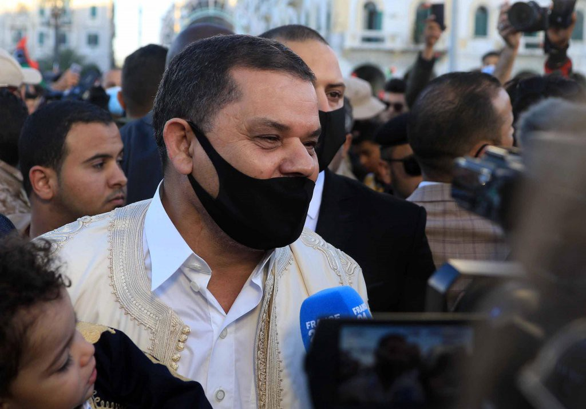

### AYS Daily Digest 23/02/2021 — EU moves to check Hungary over anti\-solidarity legislation
### Disembarkations in Sicily // Lesvos locals stand in solidarity // Raid on solidarity workers in Trieste // Deportation protests in Austria // Desperate situation in Melilla // Frontex Scrutiny Working Group begins investigation

 \)](assets/b1714740d70b/1*KWrQfW40_SxUk49Tj6D0nA.png)

People\-on\-the\-move walking through Hungary in 2015 \(Photo source: [Flickr](https://www.flickr.com/photos/syriafreedom/21364003026) \)
### FEATURE: EU takes Hungary to court over anti\- solidarity law

Since the beginning of the Covid\-19 pandemic, individuals and NGOs across Europe have come under more scrutiny and experienced more crackdowns for providing aid and assistance to people\-on\-the\-move\. On Lesvos, for example, NGOs working on the north shore were told they would no longer be allowed to attend boat landings, and were also prohibited from even approaching a new quarantine facility with clothes, food and toys\. A Bavarian nun is [being threatened](https://www.infomigrants.net/en/post/30290/mother-mechthild-i-am-not-a-criminal) with a prison sentence for sheltering asylum seekers in her church\.

Many of these recent restrictions or simple intimidations are couched, of course, in the name of public health, but we who work in the field know how to read the writing on the wall\. Our governments — and the EU, for that matter — are sending us a clear message: we no longer want you helping, because we want these asylum\-seekers to just go away\.

But now, one country famous for its anti\-migrant stance is heading to court over a law in its books that effectively criminalizes solidarity on the non\-profit level\.

The European Commission has launched an infringement procedure against Hungary for its ‘Stop Soros’ law, which bans foreign\-funded organizations from providing aid to people\-on\-the\-move, [Info Migrants](https://www.infomigrants.net/en/post/30384/eu-takes-legal-action-against-hungary-over-ngo-law) reported\.

The law was [passed](https://www.reuters.com/article/us-hungary-soros-idUSKBN1JG1VN) in Hungarian parliament back in June 2018, and made NGO workers eligible for prison time if they tried to help people\-on\-the\-move seek asylum when they were not entitled to it\.

Prime Minister Viktor Orban and his right\-wing party Fidesz have long opposed EU quotas that aim to distribute asylum\-seekers evenly across the bloc\. In 2016, Hungary held a public referendum on the EU relocation scheme, but the turnout was not high enough to see through Orban’s agenda\.

Orban did not admit defeat, though\. “We will make Brussels understand that it cannot ignore the will of Hungarian voters,” he [said](https://carnegieeurope.eu/strategiceurope/64762) \.

The ‘Stop Soros’ law did just that: it made Hungary’s stance known, even though the law violates numerous EU regulations\.

“The Hungarian people rightfully expect the government to use all means necessary to combat illegal immigration and the activities that aid it,” Interior Minister Sandor Pinter wrote in a justification attached to the draft legislation\.

“The STOP Soros package of bills serves that goal, making the organization of illegal immigration a criminal offense\. We want to use the bills to stop Hungary from becoming a country of immigrants,” he said\.

The parliament also passed a constitutional amendment saying that an “alien population” cannot be settled in Hungary — a direct stab at Brussels’ quota plan\.

But now, this legislation may be squashed\.

In a formal letter — the first step in the EU infringement procedure — the Commission said that Hungary had failed to comply with a [June 2020 ruling](http://curia.europa.eu/juris/document/document.jsf?text=&docid=227569&pageIndex=0&doclang=EN&mode=lst&dir=&occ=first&part=1&cid=5806460) from the European Court of Justice \(ECJ\), which found that the ‘Stop Soros’ law [violates EU regulations](https://www.efc.be/news-post/european-court-declares-that-hungarys-foreign-funding-restrictions-violate-eu-law/) concerning the free circulation of capital, freedom of assocation and protection of personal data\.

Now, Orban has until April 18 to justify the noncompliance with the ruling\. If he does not provide an explanation, the Commission could ask the ECJ to impose financial sanctions on Hungary, an EU spokesperson told Info Migrants\.

Additionally, the Commission has continued a second infringement procedure against Hungary, first opened in October, concerning national legislation on asylum rights passed during the Covid\-19 pandemic\. The EU says the legislation illegally curbs access to asylum because it does not allow non\-EU citizens inside Hungary to file requests for international protection\. Budapest has two months to respond to the EU’s ‘motivated opinion,’ the second stage in the infringement process\. If it doesn’t, Hungary could end up in EU court\.

We will follow these developments closely, but this news is certainly a positive sign\. The launch of the infringement procedure shows that the EU may be taking steps to actually uphold the rule of law in its member states and ensure that the bloc is complying with international human rights regulations\.
### LIBYA
#### New leader promises collaboration with Italy on migration

Libya’s new prime minister Abdul Hamid Dbeibah in Tripoli, Libya, on February 17, 2021 \| Photo: EPA/STR

Libya has a new transitional prime minister after rival factions [agreed to form](https://www.dw.com/en/libyan-factions-agree-interim-government-after-un-talks/a-56475902) a new interim government after five days of UN\-sponsored peace talks in Geneva\. Their pick is Abdul Hamid Mohammed Dbeibah, a powerful businessman and close associate of Muammar Gaddafi, the dictator who ruled Libya for more than four decades until his death in 2011\.

Since 2011, Libya has been plunged into conflict, with competing factions vying for control\. Dbeibah, along with the three\-person Presidential Council, will be tasked with keeping the country stable and ensuring a fair electoral process in December’s national elections, in which he will not be allowed to run\.

Until then, one of Dbeibah’s stated priorities is migration, and the new leader is looking to Italy for support and collaboration\. Two new governments, in Rome and Tripoli, should strengthen their countries’ “privileged relationship,” Dbeibah said on February 21, according to [Info Migrants](https://www.infomigrants.net/en/post/30424/libya-new-prime-minister-asks-italy-to-boost-collaboration-on-migrants?fbclid=IwAR0BlM2_Aje3G9WUA-0768ifwD8SC2oa-bkHrMKlPGadWiJ-HL4ZrlkFqT4) \.

Mario Draghi, Italy’s new premier, will also prioritze migration in his agenda, telling parliament last week that the Mediterranean was “an area of natural primary interest for Italy\.”

According to Info Migrants’ sources, Draghi will try to push for a European repatriation policy for people\-on\-the\-move who do not have a right to asylum, while safeguarding rights for recognized refugees\.
### TURKEY
#### Erdogan: EU has failed refugees in Turkey

It seems now that nearly every week the Turkish president slams Greece for lying about pushing back boats into Turkish waters, but this week, Erdogan is calling out the EU’s double standard\.

“While the EU gives Greece €3 billion \[$3\.65 billion\] for 100,000 refugees, it did not shoulder its responsibility for 4 million refugees in Turkey,” Erdogan said, speaking at a migration conference at a university in Izmir province\.

He also criticized Greece’s appalling treatment of people\-on\-the\-move along the Turkish\-Greek land border\. “Humanity has failed \[migrants\] not only in the Mediterranean, but also in the Aegean and Meric River,” the president declaimed\.

Erdogan also pointed out that European countries share far less of the burden of recent migration than Turkey and Middle Eastern countries\.

“According to figures from the UN High Commissioner for Refugees, only 39,500 out of 1\.4 million refugees waiting to be placed in third countries in the world in 2020 were resettled in 25 Western countries,” he said\.
### SEA
#### Over 400 survivors brought to Sicily

■■■■■■■■■■■■■■ 
> **[Sergio Scandura](https://twitter.com/scandura) @ Twitter Says:** 

> > Breaking via Radio Radicale 21:12

🔴Una protesta dei naufraghi a bordo della nave #VosTriton avrebbe sventato ieri il tentativo di respingimento in Libia del rimorchiatore della piattaforma offshore Farwah/Total (fonti UN a RR)

La nave è in rada a #Lampedusa

Il tracciato AIS👇 https://t.co/vSMpFoqjNR 

> **Tweeted at [2021-02-21 20:13:10](https://twitter.com/scandura/status/1363582556524969985).** 

■■■■■■■■■■■■■■ 

Over 400 people who had fled Libya across the Mediterranean [were brought to port](https://www.infomigrants.net/en/post/30429/over-400-rescued-migrants-brought-to-sicily?fbclid=IwAR0BFb6osmPVojTnYah5Yer74MhPL4PPSQXJZnFTVfNXw6ooiJ__Ei-4fH0) in Sicily after they were rescued by two commercial vessels and the Spanish rescue ship Aita Mari in recent days\.

[Asso Trenta](https://www.marinetraffic.com/en/ais/home/shipid:279475/zoom:10) , an Italian offshore supply vessel, brought 232 people to Porto Empedocle, Sicily on Monday, following their rescue on Saturday\. According to Italian public radio, a body was also found on the boat\. The 232 survivors are now in quarantine on the GNV Allegra\.

In a separate rescue, Aita Mari brought 102 people aboard their rescue ship on Friday, including two pregnant women and a seven\-month\-old infant\. Those people disembarked in Augusta on Monday\.

■■■■■■■■■■■■■■ 
> **[Sea-Watch International](https://twitter.com/seawatch_intl) @ Twitter Says:** 

> > #Moonbird sighted a boat for which #Frontex had sent a distress call. Nearby was the VOS Triton, with 77 people already rescued on board. When asked by our crew, the merchant vessel assured us it would go to the distress case, but then did not. https://t.co/ZHjbKyKyY3 

> **Tweeted at [2021-02-20 20:23:56](https://twitter.com/seawatch_intl/status/1363222880348217345).** 

■■■■■■■■■■■■■■ 

The situation on Vos Triton was more difficult\. After the supply vessel rescued 77 people, the ship initially wanted to bring the survivors back to Libya, [Info Migrants](https://www.infomigrants.net/fr/post/30398/un-navire-commercial-conduit-des-rescapes-en-sicile-apres-une-manifestation-a-bord-contre-leur-retour-en-libye) reported at the time\. But a protest among those aboard broke out, and the captain relented and headed for Lampedusa\.

However, in Lampedusa the survivors were refused disembarkation, and instead sailed to Porto Empedocle, Sicily, arriving on Monday\.

Now, it seems Italian prosecutors are [investigating](https://palermo.repubblica.it/cronaca/2021/02/23/news/canale_di_sicilia_un_cadavere_a_bordo_della_nave_coi_migranti-288756835/?fbclid=IwAR053RQtOLqHDdtywesm6z7ZAMWYZ9JYLCRGnrI-NgLgXygrTOqbde3Ii9w) why the ship diverted from its route, turning to Libya and then reversing course, back to Italy\.
#### A so\-called rescue by a so\-called coast guard

■■■■■■■■■■■■■■ 
> **[Carola Rackete](https://twitter.com/CaroRackete) @ Twitter Says:** 

> > "Rescue" by the EU financed "Libyan Coastguard" means no launching of a work boat or distribution of life jackets until 20+ people are in the water and then returning the survivors by force to the country they flee from. 

This is not rescue. 
This is EU migration policy. 

> **Tweeted at [2021-02-23 12:11:27](https://twitter.com/carorackete/status/1364186104279281664).** 

■■■■■■■■■■■■■■ 

#### Sea Watch 3 crew gets in shape

### GREECE
#### Lesvos locals stand in solidarity with those imprisoned in camps

The Greek island of Lesvos has become synonymous with the failure of EU migration policy, but in the past year, the island has also become famous as a site of far\-right backlash against solidarity workers\.

In March 2020, people\-on\-the\-move, aid workers, activists and journalists [faced growing hostility and violence](https://www.aljazeera.com/news/2020/2/15/aid-workers-face-growing-hostility-on-lesbos) from local groups — as well as neo\-Nazis flown in from the Greek mainland and elsewhere in Europe — intent on ridding the island of its asylum\-seekers and those who support them\.

After a massive fire destroyed Moria camp in September of last year, people\-on\-the\-move were once again harassed and attacked as they fled for their lives and tried to seek shelter\. Efforts by solidarity workers and activists to provide aid were stymied by barricades and blockades put up by locals fed up with life on the overcongested island\.

But the situation is not as simple a story as Fascist Locals versus the Innocents, and to paint it as such is to disregard and discredit the labor and support local populations have given to people\-on\-the\-move for the long six years since 2015\.

In fact, in recent weeks, amid unforgiving winter weather conditions that left the 7,500 or so asylum\-seekers on Lesvos exposed to life\-threatening elements, local groups have risen up in support of those imprisoned on their island\.

In an open letter read out in Greece’s parliament by Giannis Varoufakis, a former finance minister and leader of opposition political party MERA25, local families called for greater support for migrants, reported the [National](https://www.thenationalnews.com/world/europe/lesbos-families-urge-their-neighbours-to-take-in-refugees-1.1171593?fbclid=IwAR0mHOCeL1hC_DndPIszigvhjZinKBY_o6KDNmSNQE9p8wSbR6zr5bcThvQ#8) \.

“There are citizens here who want to help their fellow human beings and open their own homes\. Answer them if they can do it and if not, why,” the letter reads\.

According to Varoufakis, some 50 families on the island have offered to house people for three to four weeks\. The conditions in the new camp, Mavrovouni, are “tragic, inhumane and degrading,” he said\.

The letter from the Lesvos families continues:

> We will not talk about the hundreds of municipal and state buildings that are closed and that could be used so that these people do not suffer\. We will not talk about the hundreds of church premises that are locked and left rotting… 

> These places are not even open for Greeks who are also suffering … And we will not discuss the containers at Kara Tepe, which have been sealed instead of holding families in the warmth, and we won’t mention the PIKPA camp which was recently closed down by force — a place that hosted the vulnerable\. 

#### Child dies in fire in Thebes camp

■■■■■■■■■■■■■■ 
> **[Manos Moschopoulos](https://twitter.com/maledictus) @ Twitter Says:** 

> > A six-year-old child died tonight in a fire in a refugee camp near Thebes, according to media reports.

Another life lost in the ruins of Greece's flawed and failing refugee reception system. 

> **Tweeted at [2021-02-23 21:10:25](https://twitter.com/maledictus/status/1364321742068547586).** 

■■■■■■■■■■■■■■ 

The tragic news was confirmed by the [AFP](https://www.informador.mx/internacional/Grecia-nino-muere-tras-incendio-en-un-campo-de-refugiados-20210223-0105.html) \.
#### Scam alert from UNHCR

UNHCR Greece [put out an alert](https://help.unhcr.org/greece/?fbclid=IwAR3mdEgfyaXP4bzlVC_kfCAa-2TemNscESFiJ7DJifHIyaGcXC8tuu7lX9I) about a scam, saying that a fake UNHCR message had been sent to a WhatsApp group for people\-on\-the\-move\. The message concerned resettlement referrals for people in Greece to be transferred to other EU member states\. However, UNHCR noted it does not conduct such referrals\.
### SERBIA
#### Police crackdown in Šid

No Name Kitchen \(NNK\) in Šid shared news of a Serbian police raid on a squat in the area\. According to someone who lived there, the police came and forcibly took several people\-on\-the\-move to a camp, destroyed several tents, and set fire to the men’s shoes\.

Someone also told NNK that a policeman had climbed onto the roof of the squat and fired three shots into the sky from his gun\.

In response, NNK wrote:

> This is not only an act of sheer barbarity but a proof of prevarication and violence as if to say: Look at us\! Be afraid because you can’t be here\! 

### CROATIA/BOSNIA
#### Thread about Bosnia\-Croatia pushbacks

Franziska Grillmeier shared a long thread \(in German\) about violent pushbacks from Croatia to Bosnia\.

■■■■■■■■■■■■■■ 
> **[Franziska Grillmeier](https://twitter.com/f_grillmeier) @ Twitter Says:** 

> > CN: Gewalt 
“Es sind immer Männer mit schwarzen Masken. Manchmal haben sie Hunde. Es wirkt systematisch. Sie schlagen auf Schultern, damit man keinen Rucksack mehr tragen kann. Sie brechen Arme, doch nicht Beine, damit man noch 30km zurück laufen kann.“ #Pushbacks #Kroatien /1 

> **Tweeted at [2021-02-23 11:13:57](https://twitter.com/f_grillmeier/status/1364171634614108162).** 

■■■■■■■■■■■■■■ 

### ITALY
#### Threats and intimidation for local solidarity workers

](assets/b1714740d70b/1*qXr2kvUNj2FQkHFbsyVfuw.jpeg)

Photo source: [https://www\.lineadombra\.org/](https://www.lineadombra.org/2021/02/23/lorena-e-gian-andrea-sotto-accusa-per-reato-di-solidarieta/?fbclid=IwAR3ZGbUwjFaAFsPfdbgbNcJIIRlczV_wEyOMPPqne4LuZL5vFU65JzUhGKM)

Yesterday at dawn police raided the home of two solidarity workers, Gian Andrea Franchi and Lorena Fornasir, in Trieste, as well as the headquarters of the Linea d’Ombra ODV association, the organization [wrote](https://www.lineadombra.org/2021/02/23/lorena-e-gian-andrea-sotto-accusa-per-reato-di-solidarieta/?fbclid=IwAR3ZGbUwjFaAFsPfdbgbNcJIIRlczV_wEyOMPPqne4LuZL5vFU65JzUhGKM) on its website\.

The police seized their mobile phones and the organization’s accounting books and other materials in an effort to find evidence they are aiding illegal immigration\.

Linea d’Ombra wrote:

> We are indignant and disconcerted to see that solidarity is seen as a crime by the police\. 

> Today, in Italy, giving shoes, clothes and food to those who need them to survive is a persecuted action more than an apology for fascism, as we could see last October 24, again in Piazza Libertà\. 

> We condemn the repressive actions against those who are in solidarity, we ask for justice and respect for those values ​​of freedom, dignity and equality, written in the constitution, which the state tends to forget\. 

> We ask for the solidarity of all civil society, for all the people attacked because they are in solidarity\. 

Stefano Bleggi wrote in an editorial on Melting Pot that the raid constituted “a retaliation against an idea of ​​a society in which borders are open and people take care of others without any gain\.”

Other groups have come out to stand in solidarity:

■■■■■■■■■■■■■■ 
> **[NoNameKitchen](https://twitter.com/NoNameKitchen1) @ Twitter Says:** 

> > Nuestros grandes amigos Lorena y Gian Andrea están siendo investigados por la policía italiana. ¿Qué hacen? Curar heridas de personas y dar comida. Les acusan de favorecer la inmigración ilegal. 

Nos negamos a que esta sea la Europa del Siglo XXI. La solidaridad no es un crimen. 

> **Tweeted at [2021-02-23 12:22:59](https://twitter.com/nonamekitchen1/status/1364189009765883904).** 

■■■■■■■■■■■■■■ 

### AUSTRIA
#### Protests against deportations

Photo source: Transbalkanska solidarnost

Protests are happening across Austria today against scheduled deportations to Afghanistan\.

### GERMANY
#### Significant hurdle in asylum process — identity documents

The journey is not over once people\-on\-the\-move reach their destinations in Western Europe\. In Germany, the bureaucratic asylum process is notoriously difficult to navigate, even if you speak German\. One important aspect of the process? Proving your identity\.

Apparently, [around half](https://www.infomigrants.net/en/post/30442/half-of-asylum-seekers-entering-germany-cannot-prove-identity?fbclid=IwAR0mHOCeL1hC_DndPIszigvhjZinKBY_o6KDNmSNQE9p8wSbR6zr5bcThvQ) of adults who sought asylum in Germany in 2020 failed to present documents proving their name, nationality or date of birth, creating significant hurdles in their successful application\.

The German interior ministry said 51\.8% of applicants did not produce these documents, according to a document seen by the German press agency dpa\.

“The fact that the identity of every other first\-time asylum applicant cannot be established from the relevant documents presents a major challenge for our asylum system,” said Linda Teuteberg, a Free Democrats \(FDP\) politician\.

Last year, 102,581 foreign nationals submitted an application for asylum in Germany \(excluding second\-time applications\), according to Info Migrants\. That number included 26,520 applications for children born in Germany and under the age of one\.

The government told Info Migrants that the Federal Office for Migration and Refugees \(BAMF\) had checked the authenticity of a total of 190,608 identification papers from asylum seekers during 2020\.
### BELGIUM
#### Undocumented people hold ongoing overnight protest in a church

Inside the church of the Béguinage, more than 200 mattresses are spread across the hall \(Photo source: Camille Gijs/POLITICO\)

In an effort to draw attention to their plight and see their grievances addressed, more than 200 undocumented people have opened a protest camp inside a 17th century church in central Brussels, [Politico](https://www.politico.eu/article/belgium-brussels-undocumented-immigrants-church-beguinage-protest/?fbclid=IwAR2J2w7GqKq3Xe93TbNzKogsRz6ebBu4cPx8JfQ9b0lsrn_BdY82LhrAL2g) reported\.

Many of the protestors have lived and worked in Belgium for years without official status and are trying to bring attention to the difficulties caused by their undocumented status, which have only grown worse during the pandemic\.

The occupants of the St\. John the Baptist Church at the Béguinage, who hail from northwest Africa, Egypt and Afghanistan, are calling on Belgium’s top migration official, Sammy Mahdi, to speak with them and grant them formal residency or otherwise provide clarity on the residency application process\.

“We have been demonstrating for years, and we have never been heard by the federal government,” Mehdi, 28, told Politico\. “It’s a global pandemic, why are we forgotten? We have nothing to lose: we are already lost\.”

But Mahdi, the migration official, has already [called](https://twitter.com/SammyMahdi/status/1357965273299623937) the church protest, which began in January, “blackmail\.”

“We have an obligation as a state to protect people who are in a real need of protection\. We do our part,” Mahdi said\. Asylum regulations “are rules that apply to everyone\.”
### FRANCE
#### Care4Calais shares the story of a Sudanese man in Calais

### SPAIN
#### Desperate situation in Melilla

The situation in Melilla for people\-on\-the\-move grows more dire\. People are trying every possible method to escape the northern African enclave and reach mainland Europe\. Info Migrants reports that Spanish police pulled 41 people out of waste containers in the Melilla port on Friday, where they had been hiding in an effort to smuggle themselves to a better destination on the mainland\.

The waste containers, however, were filled with toxic elements\. Some people had buried themselves under thousands of empty glass bottles and broken glass\. One man was discovered unconscious in a bag full of ash from an incineration plant\.

“The man’s life was saved\. He was almost dead,” a police spokesperson told Reuters\. “He doesn’t even know where he is, he is frightened when he sees the officer’s knife and the officer has to reassure him and tell him that he is here to help him,” the spokesperson continued\. Most of the 41 people were reported to be from Morocco\.

The waste was headed for the Spanish mainland\. The journey takes around seven hours\.
#### Update on boy with injured legs

■■■■■■■■■■■■■■ 
> **[Solidary Wheels](https://twitter.com/SolidaryW) @ Twitter Says:** 

> > ÚLTIMA HORA ⚠️⚠️📣📣
Confirmamos que el chico esta estable. Según nos consta, el procemiento para que sea trasladado a la península ha sido inciado. Esperamos más indicaciones para cuándo va a ser trasladado.

@[NoNameKitchen1](https://twitter.com/NoNameKitchen1)

#viaslegalesyseguras
#trasladourgenteya 

> **Tweeted at [2021-02-23 15:58:22](https://twitter.com/solidaryw/status/1364243208935514112).** 

■■■■■■■■■■■■■■ 

Yesterday, Solidarity Wheels [reported](https://en.solidarywheels.org/post/un-menor-de-edad-pierde-la-movilidad-de-las-piernas-tras-seccionarse-la-m%C3%A9dula-haciendo-risky?fbclid=IwAR1EOoBpDaiFRA2yYXTs58eraqzHfnXEKpSTNr93Fvvs4XjHgoentcRm8jc) the tragic accident of a minor who fell from a five\-meter wall while trying to gain access to the Melilla port and board a ship to the mainland\.

Today the organization said the boy is stable and the process to transfer him to the mainland has been initiated\.
#### News from the Canary Islands

■■■■■■■■■■■■■■ 
> **[Salvamento Marítimo](https://twitter.com/CGTsalvamento) @ Twitter Says:** 

> > El director de operaciones de @[salvamentogob](https://twitter.com/salvamentogob) @GermanErostabe ordena la retirada de las tripulaciones de refuerzo en Alborán,Estrecho y Canarias por considerarlo un gasto innecesario. Lo hace desde Emiratos Arabes en un viaje de "trabajo".Sobran libredesignados faltan manos 

> **Tweeted at [2021-02-23 14:31:37](https://twitter.com/cgtsalvamento/status/1364221379600650245).** 

■■■■■■■■■■■■■■ 

### UNITED KINGDOM
#### Join the petition campaign to Priti Patel

](assets/b1714740d70b/1*PkeSlCpmkLVQoqeoU5GNyw.png)

Photo source: [Privacy International](https://www.privacyinternational.org/call-action/4423/send-letter-priti-patel-demand-uk-home-office-stops-spying-asylum-seekers?fbclid=IwAR0rP6PD_TNGp9t-3lo7Om-BOvTMTBzU4nQVTARvyI3utDfmCv1gjEtqpRU)

Send a letter to Priti Patel to demand that the UK Home Office stops spying on asylum seekers\!

Privacy International is demanding that the UK Home Office stops the surveillance of asylum\-seekers through their ‘Aspen Card’ payment cards\.

Join the campaign and take 2 minutes to write a letter to Priti Patel [here](https://www.privacyinternational.org/call-action/4423/send-letter-priti-patel-demand-uk-home-office-stops-spying-asylum-seekers?fbclid=IwAR0rP6PD_TNGp9t-3lo7Om-BOvTMTBzU4nQVTARvyI3utDfmCv1gjEtqpRU) \.
#### A quip from Jeff Crisp

We love a good take from Jeff Crisp\!

■■■■■■■■■■■■■■ 
> **[Jeff Crisp](https://twitter.com/JFCrisp) @ Twitter Says:** 

> > Having said that, you can be sure that the government will be doing everything it can to bring the recognition rate down, as it does not suit their 'asylum abuse' narrative. 

> **Tweeted at [2021-02-23 12:18:33](https://twitter.com/jfcrisp/status/1364187891862278145).** 

■■■■■■■■■■■■■■ 

### EU/FRONTEX
#### European Parliament inquiry officially launched

The new Frontex Scrutiny Working Group \(FSWG\) [began](https://www.europarl.europa.eu/news/en/press-room/20210223IPR98504/respect-of-fundamental-rights-by-frontex-european-parliament-inquiry-launched) its work on Tuesday, appointing a Chair and a rapporteur\. The FSWG will conduct an assessment of all asepcts of Frontex, including its compliance with fundamental rights\.

[Roberta Metsola \(EPP, MT\)](https://www.europarl.europa.eu/meps/en/118859/ROBERTA_METSOLA/home) will serve as chair and [Tineke Strik \(Greens/EFA, NL\)](https://www.europarl.europa.eu/meps/en/197772/TINEKE_STRIK/home) will draft the report outlining its recommendations\.

Metsola said:

> I am grateful for the confidence of all the political groups in tasking me to lead this investigative Working Group\. We are determined that this process will lead to clear answers to the questions that are being asked and recommend improvements in the way things are done\. 

Strik also commented:

> It is the task of the European Parliament to hold EU agencies accountable in cases of mismanagement or fundamental rights violations\. The allegations against Frontex on complicity to pushback operations are worrying and require a thorough investigation, as people at our borders should be able to rely on respect for their human rights\. This investigation has to examine the facts and present recommendations to ensure that Frontex actively ensures respect for fundamental rights, but also transparency and accountability in the future\. 

> Our first step in this process will be to conduct hearings with all actors involved, ranging from people within the Agency, to the European Commission, and investigative journalists\. An open and democratic process is the only way to restore the trust in the ability of Frontex to manage our borders in compliance with our fundamental rights obligations\. 

#### Ongoing legal actions against Frontex

As the official EP inquiry is launched into Frontex, the border agency faces two new legal actions concerning its behavior in the Aegean Sea\.

The Syria Justice and Accountability Centre and Front\-Lex in cooperation with the Legal Centre Lesvos have launched two separate actions since the end of January, both aiming to “finally break the cycle of impunity and trigger independent and serious investigations into collective expulsions in the Aegean”, according to Legal Centre Lesvos coordinator Lorraine Leete\.

Read more about these actions on [Statewatch](https://www.statewatch.org/news/2021/february/eu-legal-actions-pile-up-against-frontex-for-involvement-in-rights-violations/) \.
#### Romania denies involvement in pushback to Turkey

Romania denied helping Greece to push people back into Turkish waters in the Aegean Sea, despite video evidence of its vessel blocking a boat holding asylum\-seekers, the [EUobserver](https://euobserver.com/justice/151011?fbclid=IwAR0n7a0qZ8JKlhLc7uYaHOnM_I12Sfsl22giTbRw9kHm57ZhNs8OOZQtqn4) reported\.

The Romanian internal affairs ministry sent a five\-page letter last November to Frontex head Fabrice Leggeri, denying involvement\. The letter, seen by EUobserver on Monday, claims the Romanians “did not perform or observe” any pushbacks\. Additionally, Romania laid any responsibility onto the Greek high command\.

However, a [joint\-investigation by the media outlets Lighthouse Reports, Bellingcat, Der Spiegel, ARD and TV Asahia](https://www.spiegel.de/international/europe/eu-border-agency-frontex-complicit-in-greek-refugee-pushback-campaign-a-4b6cba29-35a3-4d8c-a49f-a12daad450d7) published last October includes video footage of Romania’s MAI 1102 patrol boat \(part of Frontex’s ‘Poseidon’ operation\) blocking a boat containing 47 people\.

The MAI 1102 is clearly seen passing by the small vessel at high speed to generate large waves in an effort to push the boat back into Turkish waters and intimidate those aboard\.

The MAI 1102 later switched its Automatic Identification System transponders to invisible mode, hiding its location to the public and restricting access to “accredited users\.”

However, Frontex has in the [past claimed it does not have such information](https://euobserver.com/migration/150918) , when requested to release it, according to the EUobserver\.
### WORTH READING

The Polish magazine [Przekrój](https://przekroj.pl/en/society/small-steps-towards-a-better-world-katarzyna-rodacka?fbclid=IwAR3SiDxEfcslZIlxCT1aA9f8Zcbwntamt87FlRuFlNz1UlpDG1u9h0Qmz7Q) published a feature about daily life and struggles for people\-on\-the\-move in Thessaloniki\.

[Deutsche Welle](https://www.dw.com/en/lesbos-winter-brings-more-suffering-for-refugees/a-56657217?fbclid=IwAR0qGRdzORRIyvL_gcARa5rwpqN1-l20fyroRtK86oN_vy8LG_WWEFWk4cw) published a solid explanantion of the current difficulties facing people living in the new camp on Lesvos during the tough winter months\.

The Italian daily [Avvenire](https://www.avvenire.it/attualita/pagine/sbarchi-naufragi-dispersi-ancora-caos?utm_medium=Social&utm_source=Twitter&fbclid=IwAR2npAJFov7StbuA5KYQn4Ju7tykxnGk_KNzfEdFy8MDRPRQsag7uo6FtZo#Echobox=1614067459) wrote about 90 people missing in the Central Mediterranean and the growing chaos at sea\.

Sally Hayden, a reputable journalist covering migration, wrote a feature for [Vice](https://www.vice.com/en/article/m7an4x/how-did-one-of-north-africas-biggest-human-traffickers-escape-prison?fbclid=IwAR0mHOCeL1hC_DndPIszigvhjZinKBY_o6KDNmSNQE9p8wSbR6zr5bcThvQ) about a notorious human trafficker’s escape from prison in Ethiopia\.

**Find daily updates and special reports on our [Medium page](https://medium.com/are-you-syrious) \.**

**If you wish to contribute, either by writing a report or a story, or by joining the info gathering team, please let us know\.**

**We strive to echo correct news from the ground through collaboration and fairness\. Every effort has been made to credit organisations and individuals with regard to the supply of information, video, and photo material \(in cases where the source wanted to be accredited\) \. Please notify us regarding corrections\.**

**If there’s anything you want to share or comment, contact us through Facebook, Twitter or write to: areyousyrious@gmail\.com**

_Converted [Medium Post](https://medium.com/are-you-syrious/ays-daily-digest-23-02-2021-eu-moves-to-check-hungary-over-anti-solidarity-legislation-b1714740d70b) by [ZMediumToMarkdown](https://github.com/ZhgChgLi/ZMediumToMarkdown)._
