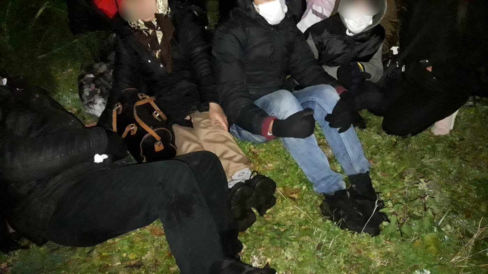

### AYS Daily Digest 24/02/21: More than 200 people evicted from Bihać, brought to Lipa
#### _New arrivals to Lesvos // Ethiopian Civil War might create many refugees fleeing to Europe // transfers from Greece to Germany // and more…_

“\(Wednesday\) morning at 06:30am Bosnian police units evicted the 2 biggest informal settlements in Bihac, Bosnia and Herzegovina\. The two buildings gave shelter to around 400 refugees and migrants from Afghanistan and Pakistan, who could also not find shelter in the camp of Lipa\.” Photo by Vincent Haiges
### FEATURE: Over 200 people evicted from Bihać and brought to Lipa

On Wednesday morning, two of the biggest informal settlements in Bihać were evicted, and over 200 people were brought to what is now considered the official Lipa camp\. Journalist Franziska Grillmeier reported from on the ground while the evictions were happening\. She provided many videos of the police driving [busses of people](https://twitter.com/f_grillmeier/status/1364461044354207751) and denying the [press access](https://twitter.com/f_grillmeier/status/1364473137279205376) \.

> “This is a repeating pattern that reportedly happens every few months to the abandoned houses around Bihac — most of the evicted people walked back from Lipa to Bihac again, since there was never enough space in the camp\. People are calm right now\. Buses waiting… 

> …People queue in a line\. It has 1 degree right now\. Most men were woken up early\. They packed sleeping bags and belongings in a backpack, now they wait quietly to enter the bus\.” 

[No Name Kitchen](https://www.facebook.com/NoNameKitchenBelgrade/posts/1187177418347207) shared a letter from a resident of the Lipa camp, explaining the situation and providing insight for why people keep trying to leave and find accommodation elsewhere:

> “I live in Lipa Camp in Bosnia\. The hardest time at Lipa Camp is when we cook\. We cook our own food because the food we can get when we wait in a line we do not like\. There is no place for us to cook in this camp\. Everyone cooks food in a fire in a nearby forest where there is no roof\. And we do all this under the open sky\. There is no kitchen facility, and we have to cook every day in the extreme cold\. The wood is not dry and it is very difficult to start a fire because it is rainy and snowy season and Lipa is a place where it is very difficult to do all this in winter\. We have to handle all this every day…
 

> …If I explain about bathrooms: only a dozen chemical toilets for more than a thousand people\. No running water to drink\. Often we are short on water…
 

> …About COVID\-19: Camp operators swear COVID doesn’t spread within the camp, but there’s no way to verify or control it\. Also other sicknesses as scabies spread throughout all people\. The tents we live in are very small\. In a small tent we have 30 people which makes it very crowded\. At the moment with an epidemic like COVID\-19 in the world it is very difficult to live in these tents and if human beings also get this disease here, many lives will be lost\. We request to make a checkup system here so that a good COVID\-19 test can be done and an isolation system can be made to avoid the problem\.” 

They finish with a reminder to the EU Commissioner for Home Affairs, who visited Lipa camp a few days ago that the EU is 100% to blame for the horrible conditions people are being forced to live in Bosnia\.

Local aid groups are under continued pressure for helping refugees\. Learn more [here\.](https://www.dw.com/en/bosnia-refugee-aid-groups-under-pressure/a-56669013?fbclid=IwAR3rVbcSTFGagKylZOCPieaSFwMBrooEWaDnoNJrTnvLrzgYcgf0uiMULI0) There is significant mounting [resentment](https://www.equaltimes.org/along-the-balkan-route-refugees?fbclid=IwAR2RcB8NhUtvhP6egQ4tnDz2bMKzHm83k0QuQHlFF9N8Fg9VC7YL3KUCLGU#.YDfOGGhKg2x) \. 
Forcing people back into a hellish camp cannot be the answer\.

■■■■■■■■■■■■■■ 
> **[Franziska Grillmeier](https://twitter.com/f_grillmeier) @ Twitter Says:** 

> > Right now the old paper fabric in #Bihac, where approx. 200 refugees and migrants are staying is being evicted by special police forces. People will be brought to #Lipa. 
❗️Press access is not granted by police. https://t.co/VKtjNQIYFf 

> **Tweeted at [2021-02-24 06:23:58](https://twitter.com/f_grillmeier/status/1364461044354207751).** 

■■■■■■■■■■■■■■ 

#### AFGHANISTAN

[Afghanistan Migrants Advice & Support Org](https://www.facebook.com/AmasoAfg/posts/4097977903565796) just published an update:

> “Today, our director met with one of those deported from Germany to Afghanistan on 9 February 2021\. Azimi is a young and wise person who was deported along with 25 others\. Opposite to what the German authorities claim, Azimi has not been involved in a single activity inside Germany that could be deemed as illegal\. Instead, he was very well integrated and had gone to school until class 11th\. All his family members are either in Turkey or back in Germany\. He doesn’t have any social network in Afghanistan and didn’t know much about the services available for him after his arrival to Afghanistan\. We have advised him about several things today and will stay in touch with him to monitor his situation\.” 

#### ETHIOPIA
### Civil war could fuel new wave of refugees fleeing to Europe

[The EU observer](https://euobserver.com/foreign/151038?fbclid=IwAR1uoZN-liXdZvmNE46YdAWF_aYJ7luHuYmI1VVk_4LhuKzsRHgO4M3pjfY) is reporting that “ _Ethiopia’s civil war could fuel a new EU refugee drama, amid ‘out of control’ violence, Finland’s foreign minister has warned\. ‘We’re seeing the beginning of one more potentially big refugee crisis in the world,’ Pekka Haavisto told press in Brussels on Tuesday \(23 February\), according to the AFP news agency\._ ” Learn more here and AYS will be following this story\.
#### LIBYA

Info Migrants reports “ _In recent years terrifying accounts and images of migrants’ suffering in Libya, especially in the country’s detention centres, have spread across the world\. The migrants’ journey through Libya is divided up into several stages, with each leg characterized by its own cruel reality\. InfoMigrants has spoken with a source in Libya, who is familiar with the mechanisms of the smuggling networks and how migrants are moved inside the country before they are finally put on boats to Europe\. In this two\-part series, we take you through the migrants’ journey, with details we have never shared before_ \.” Find out more [here](https://www.infomigrants.net/en/post/30438/exclusive-smuggling-network-source-reveals-harrowing-details-of-migrants-death-journey-inside-libya-1-2?fbclid=IwAR3rVbcSTFGagKylZOCPieaSFwMBrooEWaDnoNJrTnvLrzgYcgf0uiMULI0) \.
#### MOROCCO

[Migrants Morts et Disparus au Maroc](https://www.facebook.com/permalink.php?story_fbid=502925274427810&id=116047946448880) sent out an update and call for info:

> “No news from several convoys departed from northern Mauritania to the Canary Islands\. If the convoy is intercepted by the Moroccan authorities, migrants are usually locked up and if it arrives at the destination, Spanish authorities also lock up migrants who don’t even have the right to make a phone call\. Example of a 19 January convoy\. Families are looking for their loved ones\. Among them is this Malian missing\. Please contact us privately if you have any information\.” 

#### SEA
### At least 41 people died in a shipwreck

We now know that on Saturday, at least 41 people drowned fleeing Libya\. UNHCR and IOM said in a joint statement on Wednesday that the group was a part of a boat with at least 120 people\. 118 people have died so far on this route this year\. Learn more about the tragedy at [Aljazeera](https://www.aljazeera.com/news/2021/2/24/un-says-41-europe-bound-migrants-drown-in-mediterranean?fbclid=IwAR1Bd9ow-piytJkgr2nU3bvuGLme8ogDWfQnN3epr461v5zZJv_oDkKUEsg) \.

 \! Photo by Sea Watch](assets/932bdf412980/1*aR4oyb4Tay5wmEp6gTNPjQ.png)

Sea Watch just published its Airborne Annual Report 2020\. Find it [here](https://sea-watch.org/en/airborne-annual_report_2020/?fbclid=IwAR1yYj_wS1Lno8JWVm62LXxzJ4ZhpYr44vFvEEOU1l4xM3ngy4SqRJz_okw) \! Photo by Sea Watch

In some good rescue news, **Sea\-Eye 4** is on it’s way\! An oil rig supplier is being turned into a rescue ship in Norther Germany\. Watch a video on it [here](https://www.dw.com/de/die-sea-eye-4-ein-schiff-um-leben-zu-retten/av-56663998?fbclid=IwAR2sadJelNBv-aVy1JUMXY8QM9lE2aF0efEZHaU2ntOiKGpBHzuHy1AUQus) \!
#### GREECE
### 122 refugees transferred from Mytilene to Germany

On Wednesday, 122 people were able to fly from Mytilene to the city of Hanover\. This was the second relocation flight implemented by the Ministry of Immigration and Asylum with IOM\. 1,553 people should be relocated from Greece to Germany due to the agreement between the Greek Prime Minister and German Chancellor\. More [here](https://greekcitytimes.com/2021/02/25/refugees-mytilene-germany/?fbclid=IwAR0JlH44Pi49HD379b6fdo6UHFZoCIuUaxpU1rkASMtEkTdefcf0zQbMlyU) \.
### A pregnant woman sets herself on fire in Kara Tepe

According to the Press Project: _“A 26\-year\-old Afghan refugee, in the eighth month of her pregnancy, mother of two other children, set herself on fire inside the tent where she lived, in the temporary camp of Kara Tepe in Mytilene, when she learned that her move to Germany was rejected\. She is now facing charges of intentional arson\.”_

She explained to the authorities later on that she was in psychological duress because of the last\-minute rejection of her relocation\. There is a mental health crisis happening in refugee camps and it must be taken seriously\. No one should have to endure living in these conditions\. More [here](https://thepressproject.gr/aftopyrpolithike-egkyos-prosfygas-sto-kara-tepe-kai-katigoreitai-gia-ebrismo-apo-prothesi/?fbclid=IwAR0PoAF4jOUAjGbx7n5vMAos-HZUor4q3L1SwWnxBouDLqZXBEzKIGDm6FY) \.
### New Lesvos arrivals

](assets/932bdf412980/1*CLBMaJ-mBZRiwbwyXQ7n3w.jpeg)

“At least two boats arrived atLesvos during the night, carrying approximately 65 people\. So far only a few of them have been found, the rest are hiding in the woods, scared to be illegally returned to Turkey by the Hellenic coast guard\.” Info and Photos by [ABR](https://www.facebook.com/AegeanBoatReport/posts/1035030673686703)

■■■■■■■■■■■■■■ 
> **[Alarm Phone](https://twitter.com/alarm_phone) @ Twitter Says:** 

> > We were informed by a relative about 11 people who are stranded in the North of #Lesvos. The people fear that Greek authorities will illegally push them back to Turkey. The people seek to apply for asylum. We have informed @[HCoastGuard](https://twitter.com/HCoastGuard), @[UNHCRGreece](https://twitter.com/UNHCRGreece) &amp; @[Frontex](https://twitter.com/Frontex) https://t.co/tgTFyXQmLL 

> **Tweeted at [2021-02-24 10:01:05](https://twitter.com/alarm_phone/status/1364515685930569729).** 

■■■■■■■■■■■■■■ 

### Reports of another pushback

According to Aegean Boat Report:

> “Last Friday, 19 February, a boat carrying 31 people tried to cross from Turkey towards Lesvos south\. Deep inside Greek territory waters they where stopped by a vessel from the Hellenic coast guard, and forced to return to Turkish waters by gun point\.
 

> The boat started the trip before first light, but around 8 am they where stopped by the Hellenic coast guard\. The vessel is identified to be ΛΣ 618, from videos sent to the Aegean Boat Report, and is stationed in Mytilíni, Lesvos\. The boat in question is one of two Faiakas\-class fast patrol crafts \(FPCs\) currently operated by the Hellenic Coast Guard\. Also in the videos we can see four men, in black military outfits, faces covered with balaclavas, on the front deck of the vessel\. Previously it has been denied that HCG personnel use balaclavas in their operations, but as we can see footage tells a different story\. People from the rubber dinghy explains that one of the men in front of the boat used a shotgun, and fired several shots towards their boat, to force them to turn the boat around back towards Turkey, they feared for their lives and turned the boat around, they had no choice\.” 

Find some of the pictures of the pushback from the boat [here](https://www.facebook.com/AegeanBoatReport/posts/1035146153675155) \.
### Boy died in fire in Thiva camp

Tuesday evening firefighters were called to the northern Athens camp to put out a fire that had in a container building\. One young boy, probably seven or eight years old, was unresponsive when they arrived and later pronounced dead\. Many migrants believed that the responders had taken too long to get there\. The cause of the fire is not certain but it might have been cooking\-related\. Thiva camp is currently home to 800 asylum seekers\. Learn more about this tragedy [here\.](https://www.infomigrants.net/en/post/30463/boy-dies-in-fire-at-greek-migrant-camp?fbclid=IwAR0w80WG3SC6tdIyj0at9eRFKBhN-w5MMkll2kUPwecbuLLHy2asBSVtQ58)

![“Once more, Greek police officers of the DRASI unit \(ex DELTA\) are seen wearing paramilitary and far\-right affiliated insignia and patches\. This picture is from today’s \(25 February 2021\) demonstration in support of the \#koufontinas\_hungerstrike\. All this while the Greek authorities will continue to deny the affiliation of certain police officers or units with criminal organizations such as Golden Dawn\. Here is another collection of Punisher symbols, featured in \(on\-active\-duty\) officer uniforms\.” Info by [Disinfaux Collective](https://twitter.com/disinfaux/status/1364703365293309952) , Photo by Yiannis Baboulias](assets/932bdf412980/1*toZuMqsyxYzze5lqdRiD5Q.jpeg)

“Once more, Greek police officers of the DRASI unit \(ex DELTA\) are seen wearing paramilitary and far\-right affiliated insignia and patches\. This picture is from today’s \(25 February 2021\) demonstration in support of the \#koufontinas\_hungerstrike\. All this while the Greek authorities will continue to deny the affiliation of certain police officers or units with criminal organizations such as Golden Dawn\. Here is another collection of Punisher symbols, featured in \(on\-active\-duty\) officer uniforms\.” Info by [Disinfaux Collective](https://twitter.com/disinfaux/status/1364703365293309952) , Photo by Yiannis Baboulias
### Manufacturing new border surveillance drones

According to the Greek Reporter: _“Greece will manufacture a new, innovative, border surveillance drone\. Named the IDEX 2021: LOTUS, which represents the next generation of unmanned surveillance aircraft, the aerial vehicle will be manufactured by a Greek firm\. The Greek company Intracom Defense \(IDE\) signed an agreement with the European Commission for the tactical Unmanned Aerial Vehicle, or UAV, which has been specially designed for border surveillance and reconnaissance and what the company calls ‘high value targets\.’”_ More [here](https://greekreporter.com/2021/02/24/greece-to-manufacture-new-border-surveillance-drone/?fbclid=IwAR2LkGyYI_DWJei66rBm1OODVCEMWGcHSrVWjFCuBSHOopmu-GtqtpxrJys) \.
#### SPAIN
### A young boy left paralyzed

According to Seiz, the 17\-year\-old fell when he slipped from a rope he was using to get onto a ferry to the main land\. “ _The area of ​​the Minor of the Autonomous City of Melilla finalizes the procedures to transfer an adolescent under guardianship to the Carlos de Haya regional university hospital in Malaga, where he will be operated on for a serious injury due to the fracture of the dorsal vertebra that has caused him permanent paraplegia_ \.” More [here](https://cadenaser.com/ser/2021/02/24/sociedad/1614192815_710717.html?fbclid=IwAR0HVJokZltYelsnWZnYAkyp_NPJxiZ_1C_UIuyLzZFqzxcl-eDOhiZEC5c) \.
### Three people rescued near the island of Fuerteventura

El Diario reports that “ _The boat was intercepted by Maritime Rescue on Tuesday afternoon and after the rescue the three migrants, of Maghreb origin, were transferred to the Gran Tarajal Pier\. Once on the dock, they were assessed by the medical staff\. All three were in good health\._ ” More [here\.](https://www.eldiario.es/canariasahora/migraciones/rescatada-patera-tres-inmigrantes-aguas-cercanas-fuerteventura_1_7247353.html?fbclid=IwAR0tI-KEetVMHS-Ha90ye68fxzVCGCt78cl-7Y5hBMl5OsRSt1mWY7oEEnQ)

■■■■■■■■■■■■■■ 
> **[DTM IOM](https://twitter.com/DTM_IOM) @ Twitter Says:** 

> > #MigrationEurope Latest Flow Monitoring Surveys of #migrants in Spain. 302 surveys, 15 collection points. Data from Nov &amp; Dec 2020. 

On primary reasons for leaving country of origin
49% say economic
21% say war/conflict
15% say personal violence

Read on [bit.ly/Europe_FlowMon…](https://bit.ly/Europe_FlowMonitoringSurveys_Spain_2020) https://t.co/31ma5c9QnV 

> **Tweeted at [2021-02-24 11:31:58](https://twitter.com/dtm_iom/status/1364538554798379012).** 

■■■■■■■■■■■■■■ 

#### ROMANIA

 Photo by LOGS](assets/932bdf412980/1*Fa7sLB5vOXGrPUkfh2nzlQ.jpeg)

Balkan Insights new feature entitled “Migrants on Westward Trek Meet Kindness in Romania’s Timisoara” is a worthwhile read about how welcoming Timisoara has been to migrants entering Romania over the last several months\. [Check it out here\.](https://balkaninsight.com/2021/02/24/migrants-on-westward-trek-meet-kindness-in-romanias-timisoara?fbclid=IwAR3BX0tX1EDHF63O7JfPAWxXqFyCdVfiL77SPQJdZbDw4IDFJ6thOYHNzwk) Photo by LOGS
#### GERMANY

Internal papers reveal that SPD wants to bring more refugees into Germany\. Focus Online says “ _Because of the dramatic conditions in Greek refugee camps, the SPD parliamentary group wants to change the residence law and thus facilitate the admission of migrants\. Because the European asylum system is failing, Germany must play ‘a pioneering role,’ according to a position paper that is exclusively available to FOCUS Online_ \.” More [here](https://www.focus.de/politik/konsequenz-aus-moria-katastrophe-kampfansage-an-horst-seehofer-spd-will-mehr-fluechtlinge-nach-deutschland-holen_id_13016083.html?fbclid=IwAR2YOicljLVQR2vn_-uwxhp30b89V7iFtvFKk_hWCG7p-6ZMSMvBRYpWbH8) \.
#### BELGIUM

There is an online event against racism in Belgium coming up\! Monday, 1 March 2021 at 12 — 1:30 pm CST\. Check it out [here](https://www.facebook.com/events/1243629692701314/) \.
#### EU
### MEPs send letter calling for actions for the deportations on 17 February

According to Efsyn “ _A letter was sent to Home Affairs Commissioner Ilva Johansson by MEPs from the political groups of the Left, Greens and Social Democrats for the illegal repatriation of refugees from the quarantine facility in Meghala Therma, Mytilene, Turkey on the night of 17 February\. These are 13 Afghans who went to a state reception structure, where police told them at night that they would be taken for a coronavirus test, but after locking them in a container for an hour, they forced them into a van for the port, where they boarded, hitting them them, onto a boat, to leave them in the middle of the sea in an inflatable boat before being picked up by the Turkish Coast Guard\._ ”

The letter addresses how this is a severe act against international law\. Learn more [here](https://www.efsyn.gr/ellada/282827_drasi-gia-tis-epanaproothiseis-zitoyn-eyroboyleytes) \.

Statewatch Documents
1. “Statewatch has obtained a note produced by Frontex for the November 2020 Management Board meeting, when the allegations that the agency was involved in or had knowledge of pushbacks in the Aegean were discussed\.” Find it [here\.](https://www.statewatch.org/news/2021/february/frontex-agency-s-initial-response-to-alleged-involvement-in-pushbacks/?fbclid=IwAR0zZw_YYjJgubNc7Db-Xegfy5PFvwRsxOIp21V0MhQg563ftn0sjlU3z2A)
2. “A document circulated by the German Presidency of the Council of the EU at the end of 2020 outlines efforts to adopt “secure and interoperable communications solutions” for cross\-border police communication and cooperation, which seems likely to be a lasting change provoked by the COVID\-19 pandemic\. However, commercially\-available technologies are deemed inadequate\.” Find it [here](https://www.statewatch.org/news/2021/february/eu-pandemic-propels-adoption-of-secure-and-interoperable-cross-border-communications-tools-for-police/?fbclid=IwAR0HVJokZltYelsnWZnYAkyp_NPJxiZ_1C_UIuyLzZFqzxcl-eDOhiZEC5c) \.

#### UK
### Home Office “accelerating” moving people out of hotels into permanent housing

The Independent reports that “A letter sent to NGOs by the department states that people seeking asylum who are currently in hotels will start being “decanted” out of the accommodation as part of a process called Operation Oak\. Hotels have formed a major component of the Home Office’s solution to coping with the backlog of people waiting for a decision on their asylum claims\. There are said to be around 9,500 in hotels at present\. Charities supporting asylum seekers welcomed the planned move out of hotels, which have been the subject of mounting concern over poor conditions and treatment by staff, but said they were worried about a lack of clarity around the standard of housing people would be moved to\.” Learn more [here](https://www.independent.co.uk/news/uk/home-news/asylum-seeker-hotel-accommodation-home-office-b1806087.html?amp&fbclid=IwAR0jhwlYInPXSARvm9Fz7oYSZ7PJVWVlK-z4AtiuCzPBWvK7Z04Kk2GhWq8) \.

**Find daily updates and special reports on our [Medium page](https://medium.com/are-you-syrious) \.**

**If you wish to contribute, either by writing a report or a story, or by joining the info gathering team, please let us know\.**

**We strive to echo correct news from the ground through collaboration and fairness\. Every effort has been made to credit organisations and individuals with regard to the supply of information, video, and photo material \(in cases where the source wanted to be accredited\) \. Please notify us regarding corrections\.**

**If there’s anything you want to share or comment, contact us through Facebook, Twitter or write to: areyousyrious@gmail\.com**

_Converted [Medium Post](https://medium.com/are-you-syrious/ays-daily-digest-24-02-21-200-refugees-evicted-from-bihac-brought-to-lipa-932bdf412980) by [ZMediumToMarkdown](https://github.com/ZhgChgLi/ZMediumToMarkdown)._
