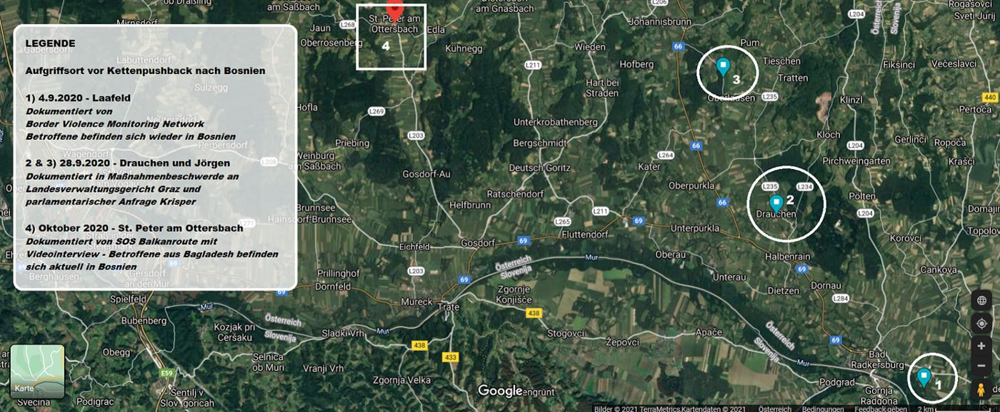
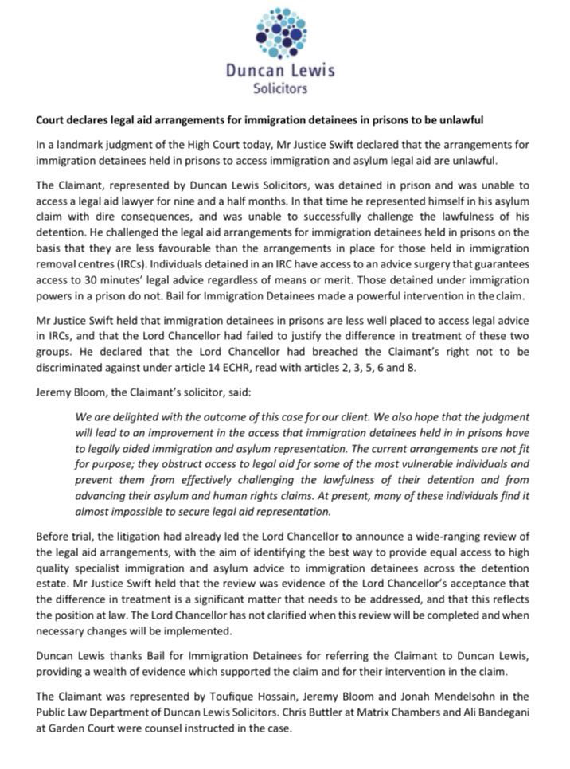

### AYS Daily Digest 25/2/21: Court hearing on cases of collective chain pushbacks from Austria to Bosnia&Herzegovina
#### Denmark strips 94 Syrian refugees of their residency permits, deeming Damascus safe for their return / UK: High Court judgment: lack of access to legal aid is unlawful; Home Office violated human rights of asylum seeker who was evicted during 8th attempt to reopen his case & more

#### FEATURED

2 specific cases have stood out among those documenting groups of people who had entered Austria and claimed to have asked for asylum, but were nevertheless pushed back by the police\. The groups claim their repeated requests for asylum have been ignored\. After a few hours they would be handed over to the Slovenian police, who in turn took them to Croatia, from where they were deported to Bosnia\. A hearing before the State Administrative Court of Styria is scheduled for March 2\.

In 2020 alone, 514 people were handed over to the Slovenian police at the Styrian border; almost 100 of them come from known unsafe countries such as Syria, Iraq, Iran, Somalia, etc\.

The upcoming court hearing is also generally relevant as it can help shed light on the hitherto little\-known practices of the Austrian police, their role in the numerous chain deportations along the Balkan route, Pushback Alarm Austria team reports\. The Border Violence Monitoring Network has now documented hundreds of cases of violence and torture on the Croatian\-Bosnian border and the inhumane conditions under which thousands are stuck in the border region have sparked international outrage\.

More information is available for people who may be affected by an unlawful refusal in Austria’s border area in the leaflets the [Push\-Back Alarm Austria](https://www.facebook.com/PushBackAlarmAustria/?__cft__[0]=AZVszctJaRiByH-PoDqJPLKecN1IDPKkOeeAYk_aEL8cMt4YKzOATltnf9Mcvganr5b5_hlhs6gmk-x2lA3oHyZlmI-LCbNbkeK9AL5ejmfu0fRvBcEMGDwDUBHgwxHS7oWiCMeA15OxbYayTAIUKJ_y&__tn__=-UC%2CP-R) team has prepared in Arabic, Pashto, Bangla, Dari, English and German language\.
Since February 8, Push\-Back Alarm Austria has been offering 24/7 **support to people directly affected by pushbacks** via phone number **\+ 444 43 1 345**
#### SEA

The Spanish national media agency reported a man lost his life following the rescue action of 24 people off the coast of Tunisia\. It is [reported](http://www.ansamed.info/ansamed/it/notizie/rubriche/cronaca/2021/02/25/tunisia-ong-in-forte-aumento-flusso-migranti-verso-italia_c5d2646c-f218-47e2-a336-773d7418096b.html?fbclid=IwAR0A6q2Q5tdqoziVwRyn1L_FFCAhIXgmVfj8KYOx6KnGIk2dt-WpYoEzBK8) that in January 2021, 558 Tunisians landed on the Italian coasts, compared to 94 in the same period last year, and only 31 in 2019, according to the official numbers\.
At the same time, on the other side of the Mediterranean, the pushback also continue\. Reportedly, Turkish coastguard documented return of 180 people after 6 pushback incidents\.
#### GREECE
### Moria 2\.0 closing?

The Greek minister of Migration announced thee closing of the infamous Kara Tepe, stating that latest in November, “all the flats and hotels hosting refugees under the ESTIA program will be evacuated and their residents moved to a new, yet unbuilt, closed camp\.” In the meantime, minister Mitarakis is [on a tour](https://migration.gov.gr/programma-ypoyrgoy-metanasteysis-kai-asyloy-kata-tin-episkepsi-toy-sti-varsovia/) , meeting the Polish minister of interior and afterwards the Executive Director of Frontex, Fabrice Leggeri, to discuss — what else — the border regime along Evros and the Mediterranean\.

The authorities also state everybody’s asylum request is in process of being considered, and the answers will arrive soon\. This, however, is an unlikely thing to happen any time soon, if the procedures are respected and each case is carefully examined, given the current pace and the inert system\. 
Many rejections received by the residents of Kara Tepe have psychologically affected many people, creating a sense of isolation & abandonment, GRC reported\.
### Chios emergency dental assistance

[One Family — No Borders](https://www.facebook.com/ONEFAMILYNOBORDERS/?__cft__[0]=AZVLxq_Sw5zH6KBTKG1vWjeEmTjVpYcBflqrU1h8wWcNuTh5EDE-6kDxwAw6CgIQzu1GYodxki7-C_VoD1dI3Zoe_dofc_Iu2_Iii32BsDMhQdC2UZisXbGrcbTJZAK6Ms-yM5xPCFAyJLULxPwy9Cxf&__tn__=kC%2CP-R) is offering dental treatments for children, currently taking only emergency cases, that is, those in pain\.
In order to schedule an appointment, you or the family/care taker of the child should contact the organisation directly and make sure to arrive to the meeting on time\. Transportation to the meeting is not organised by OF, so the patients should arrive by themselves\.
#### DENMARK
### Has the New Right wiped out the ‘New Danes’?

> “I study at the finest university in Denmark and I study the hardest of everyone, and I work hard to improve democracy too, and still this is nothing — just because of where I was born\.” 

In the times when everyone feels their rights are being taken away because they are not able to enjoy coffee in their favourite bars or because someone has suggeted they should get a vaccine in order to prevent the current pandemic from taking more lives, many others dream of simply being given a chance, and the same reality today’s European fighters for personal choice are enjoying\. People who used to be welcomed as ‘New Danes’ in the liberal, relaxed and socially strong country are nowadays casted out only for coming from “Muslim countries”\. The New Right’s proposal being considered at the moment would split those eligible for citizenship into two groups — those from largely Muslim areas such as the Middle East, North Africa, Turkey, Afghanistan and Pakistan, and those from elsewhere\. Social Democrats seem to sway towards the extremes as well, as they pose the situation so that the “ lower classes are paying the price of unregulated globalisation, mass immigration and free movement”\.

Pressuring the people with statements that “good behaviour is not enough” and that one must prove they have “taken Denmark in”, the country seems to be mainstreaming positions which 20 years ago were seen as very much belonging to the Right, as a University professor recently stated\.

> “I never, ever in my entire life imagined I would be facing racism like this, and facing it every day\.” 

— Doabi, 28, whose parents are atheist Kurdish refugees from Iran has been living in Denmark since the age of 11, still without citizenship

_More on Denmark’s latest outrageous decisions in “Further reading” section_
#### UK
### Less protection granted, longer waiting times

The UK Government states fewer initial decisions being made on asylum applications, and the pause to resettlement activity after the pandemic as the main reasons for the 40 per cent drop in granted asylum protection in 2020, and 85 per cent fewer cases where protection was granted through resettlement\. [Reportedly,](https://www.independent.co.uk/news/uk/home-news/uk-asylum-seeker-covid-home-office-b1807206.html?fbclid=IwAR00ZhG9Ic2b_uKgik-aBqXxitGGrgxT7itNW9z6ZpH6Gsrik7IqX1LjvIU) waiting times on asylum claims have hit a record high, with 46,800 applicants and dependents waiting more than six months for an initial decision on their claim at the end of 2020 — a rise of 700 on the previous quarter\. Another worrying fact is that up to 57 per cent of people held in detention were actually in prisons:

■■■■■■■■■■■■■■ 
> **[AVID](https://twitter.com/AVIDdetention) @ Twitter Says:** 

> > Gov stats released today show that 57% of ppl in immigration detention at end of Dec 2020 were held in prisons. 

Thanks again to @[DLPublicLaw](https://twitter.com/DLPublicLaw) and @[BIDdetention](https://twitter.com/BIDdetention) for their VERY necessary work - Today the legal aid arrangements for people detained in prisons were declared unlawful. https://t.co/Y1RIy2E9J5 

> **Tweeted at [2021-02-25 13:57:03](https://twitter.com/aviddetention/status/1364937455904960514).** 

■■■■■■■■■■■■■■ 

### Lack of access to legal aid is unlawful, Court rules

The most recent judgment will help significantly improve access to legal aid and justice for all immigration detainees held in prisons, [DuncanLewisPublicLaw](https://twitter.com/DLPublicLaw) reported, as they challenged the inadequate access to immigration advice for detainees in prison\. 
After a man was left without a lawyer for 10 months and was forced to represent himself, the High Court has ruled legal aid provision for immigration detainees held in prisons is unlawful:

In another instance, the Home Office was found to have violated human rights of asylum seeker who was evicted during eighth attempt to reopen his case\. FreeMovement has the whole story:

An urgent inspection of asylum seeker accommodation in Derby is to take place after concerns were raised about conditions there\. 
It has been [reported](https://www.independent.co.uk/news/uk/home-news/asylum-seeker-hotel-accommodation-home-office-b1806087.html) that the Home Office is planning to accelerate moving people out of hotels and into housing, known as dispersed accommodation, in a scheme called Operation Oak, the Guardian reported\. Many people have been complaining about the lack of proper food, but mostly about the poor conditions in the places they are accommodated, ranging from poor plumbing to complete inability to use the flat, take a bath or other basic things\.

Still, ms Patel’s answer to concerns raised about the worrying conditions at the Napier barracks when it comes to Covid\-19 protection points to complete disregard for the standards, laws and human rights\. She states that “every single individual who comes into the care and estate of the Home Office has personalised support”, and finds the reason to a surge in coronavirus infections to be the fact that the people were “mingling”\. That was her conclusions after they reportedly “looked at what happened at Napier people were not following the rules”\. The director general of Border Force [reportedly](https://www.theguardian.com/uk-news/2021/feb/24/covid-cases-among-asylum-seekers-at-napier-barracks-higher-than-thought?fbclid=IwAR2v0uaTrdZvcfcswibl1o5K4xN2x8KVonEGo_ZPndx2GQJ19nO8HEcZDaI) revealed about 150 people a day are entering enforced hotel quarantine, about 1% of the 15,000 arrivals each day\.
#### FOR FURTHER READING
- Personal stories — Denmark strips 94 Syrian refugees of their residency permits, deeming Damascus safe for their return:

- Trade unions have failed migrant workers\. To remedy this, we need serious self\-criticism:

**Find daily updates and special reports on our [Medium page](https://medium.com/are-you-syrious) \.**

**If you wish to contribute, either by writing a report or a story, or by joining the info gathering team, please let us know\.**

**We strive to echo correct news from the ground through collaboration and fairness\. Every effort has been made to credit organisations and individuals with regard to the supply of information, video, and photo material \(in cases where the source wanted to be accredited\) \. Please notify us regarding corrections\.**

**If there’s anything you want to share or comment, contact us through Facebook, Twitter or write to: areyousyrious@gmail\.com**

_Converted [Medium Post](https://medium.com/are-you-syrious/ays-daily-digest-25-2-21-two-court-cases-of-collective-chain-pushbacks-from-austria-to-2b6792add4c4) by [ZMediumToMarkdown](https://github.com/ZhgChgLi/ZMediumToMarkdown)._
