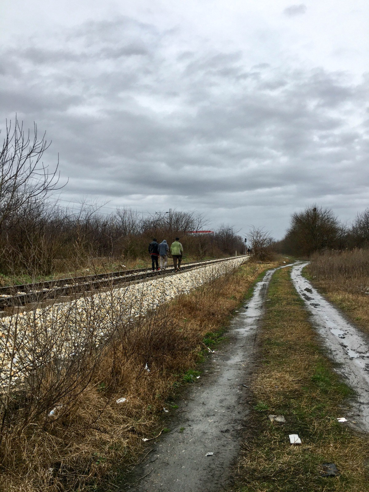

### AYS Special from the UK — Credibility assessments in Human trafficking cases

> European migration policy is often unsupportive of human trafficking victims\. This widespread failure to recognise the circumstances and the trauma experienced by potential victims turns asylum applications into a ruthless re\-traumatising process\. 

Photo credit: Canvas Free \(AbdukadirSavas\)

The closure of borders on the Balkan route and the implementation of the EU\-Turkey Agreement in 2016 signalled an increasing hostility towards people on the move that has come to characterise EU migration policy in the years since\. In January 2021 alone, at least 684 people were [illegally pushed back along the Balkan borders](https://www.borderviolence.eu/balkan-region-report-january-2021/) , whilst in February, the Libyan coastguard [intercepted more than 800 people trying to cross the Mediterranean to Europe](https://www.aljazeera.com/news/2021/2/5/libya-coast-guard-intercepts-more-than-800-refugees-un) \.

As safe, legal migration routes are shut down and basic support for asylum\-seekers is reduced, more and more are driven to taking huge risks in a bid to reach safety and provide for themselves\. Desperate times call for desperate measures\. As a result, the risk of falling victim to human trafficking and the hurdles to being granted asylum status in Europe are growing ever higher\.

There are many push factors that might drive a person to leave their country of origin, among the most common are conflict, persecution and financial insecurity\. For those same reasons, people on the move are at risk of falling prey to human traffickers; a person without the means to pay for their transport is unlikely to be in a position to negotiate the terms of their travel, whilst a person escaping conflict is left with almost no choice\. This leaves people on the move vulnerable to exploitation, whether that be through sexual exploitation, debt bondage or forced criminality, to name a few examples\. Traffickers often withhold or dispose of their victims’ identity documents and threaten their victims to prevent them from approaching the authorities\. They usually control the routes; the most common are the Central Mediterranean, via Libya, through to Italy and the Balkan route, from Turkey through Greece to Northern Europe\.

Photo Credit: Ana Alicia Molina

Upon arrival in Europe, a huge portion of the overall assessment of an asylum claim is what is called the ‘credibility assessment’\. European law [requires](https://eur-lex.europa.eu/legal-content/EN/TXT/HTML/?uri=CELEX:32011L0095&from=EN#d1e664-9-1) asylum\-seekers to substantiate their applications with statements and documentation\. Material elements of the claim will not require corroboration only where the claim is consistent, detailed and coherent, made at the earliest opportunity, and the ‘personal credibility’ of the applicant is established\. A failure to produce authentic identity documents, to take the opportunity to apply for asylum in another European country, or a reluctance to engage with the appropriate authorities are all factors that will be taken into account when deciding whether an asylum\-seeker is telling the truth about what has happened to them\.

A number of cases illustrating how this theory is applied in practice have reached the UK courts\.

[KA fled Afghanistan](https://www.asylumlawdatabase.eu/en/case-law/uk-am-afghanistan-v-secretary-state-home-department-2017-ewca-civ-1123) when he was 13, as the Taliban were trying to forcibly recruit him\. The UK initially rejected his asylum claim because he was deemed ‘not credible’\. The UK Home Office cited his failure to claim asylum in Hungary and inconsistencies in his account as reasons for the rejection\. They claimed that his account was not believable because he could not provide copies of the death threats that the Taliban sent to his home\.

[Wen was brought from Brazil to the UK](https://www.casemine.com/judgement/uk/5d43fad72c94e04a9677bf6d) to be married to a stranger she had met on the internet\. Upon arrival in the UK, the man who paid for her plane ticket subjected her to sexual exploitation and forced labour to repay her debts\. The Home Office initially refused to recognize her as a victim of human trafficking because there were discrepancies in her account\. They stated that she did not suffer from any mental health conditions that would affect her ability to remember what happened to her in detail, despite evidence that she was a victim of torture even prior to her exploitation in the UK\.

> The level of proof required of asylum\-seekers is enough to make you feel that you are defending a criminal case; it is a feeling that is consistent with an adversarial EU migration policy and the systematic criminalization of people on the move\. 

The obligation to provide a ring\-binder file full of proof to support an asylum claim completely fails to recognise the nature of the beast: that you are dealing with people who have been forced to flee, from states where keeping evidence of your activities could be the very thing that gets you killed, along harsh, dangerous routes where papers are likely to be at the bottom of your priority list\. Upon arrival, many asylum\-seekers and victims of trafficking wind up in detention in conditions that are often retraumatising and further contribute to any apprehensiveness people may feel towards state authorities\. In 2019, [14,086 asylum\-seekers entered immigration detention in the UK](https://migrationobservatory.ox.ac.uk/resources/briefings/immigration-detention-in-the-uk/) , whilst in the first eight months of the same year [the UK detained at least 1,256 people who went on to be recognised as victims or potential victims of trafficking](https://www.law.ox.ac.uk/research-subject-groups/centre-criminology/centreborder-criminologies/blog/2021/02/routine-detention) \.

The framework governing credibility assessments also fails to recognise a generally accepted fact, that asylum\-seekers and victims of trafficking are disproportionately likely to have experienced trauma, whether that be in the form of persecution and conflict in their home countries or physical and sexual abuse at the hands of their traffickers\. It is widely accepted, also, that trauma has a detrimental impact on a person’s ability to remember dates and details\. Yet governments invariably reject asylum claims on the basis that they are inconsistent, vague, or marred with gaps\. Victims of trafficking are more likely to be penalised than other asylum\-seekers, as failure to engage with state authorities or produce original identity documents are factors for which they will be penalised, despite those same facts being recognised as indicators of trafficking in the first place\.

In this context, the legal criteria that a person must meet to qualify for refugee status strike as particularly onerous\.

> It sometimes feels like the experiences that characterise asylum\-seekers and victims of trafficking are the very same factors that are held against them when considering their claims\. 

After escaping war, persecution and poverty, spending weeks or months traversing deadly routes to reach safety, you would hope to be met with open arms and a sense of relief\. Instead, the majority are met with hostility and disbelief, an institutional shrug that says: “prove it”\.

**By Anya Draycott\-Kapp**

**Find daily updates and special reports on our [Medium page](https://medium.com/are-you-syrious) \.**

**If you wish to contribute, either by writing a report or a story, or by joining the info gathering team, please let us know\.**

**We strive to echo correct news from the ground through collaboration and fairness\. Every effort has been made to credit organisations and individuals with regard to the supply of information, video, and photo material \(in cases where the source wanted to be accredited\) \. Please notify us regarding corrections\.**

**If there’s anything you want to share or comment, contact us through Facebook, Twitter or write to: areyousyrious@gmail\.com**

_Converted [Medium Post](https://medium.com/are-you-syrious/ays-special-from-the-uk-credibility-assessments-in-human-trafficking-cases-b4701963b9e1) by [ZMediumToMarkdown](https://github.com/ZhgChgLi/ZMediumToMarkdown)._
