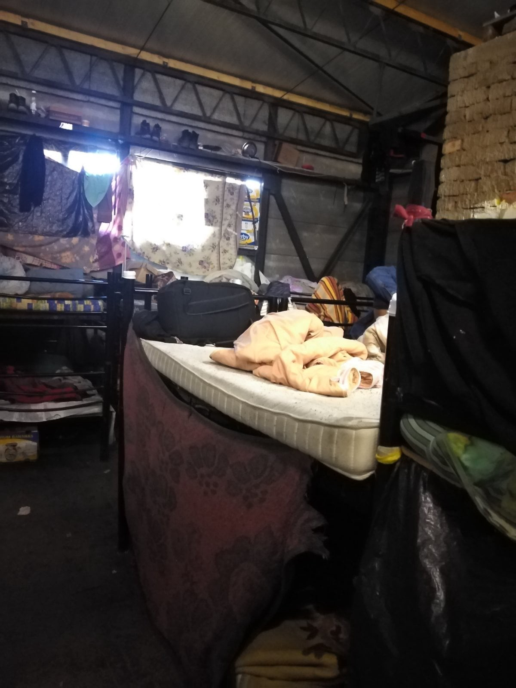
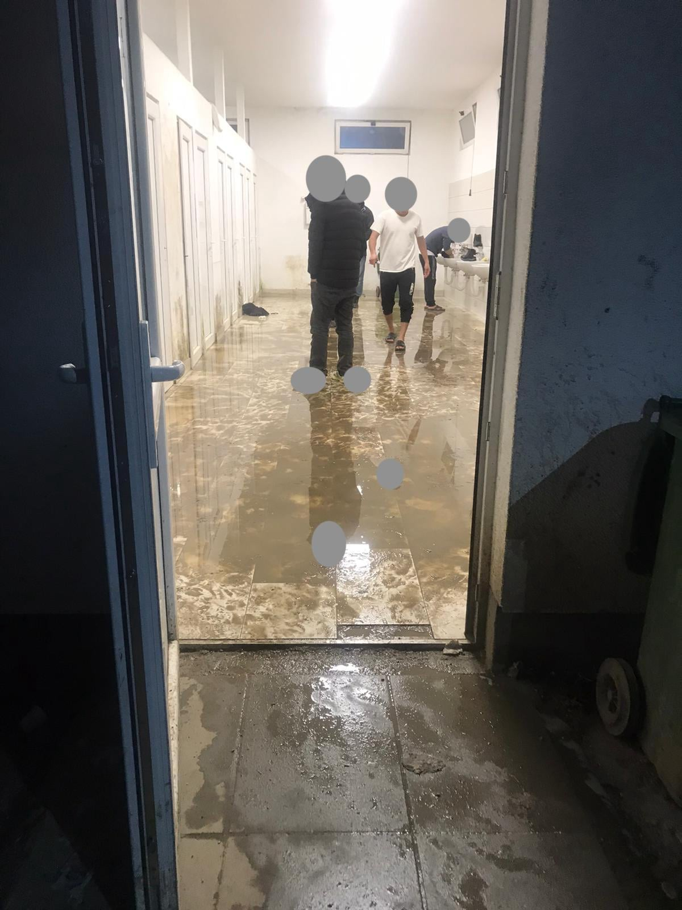

### AYS Daily Digest 01/03/21 Home Office to build new women’s detention centre in County Durham

_Press release from Mediterranea Saving Humans after police operation against them // evictions in Greece // deportations from Denmark and Spain // UK to consider life sentences for smugglers // and more…_

![“My name is Agnes\. I am a refugee, I am a woman, I am a human being\. The Home Office has started building a new immigration detention centre at Hassockfield in County Durham to lock up women like me\. Please join me in taking action to stop them\. This is personal for me\. I claimed asylum here because I was being persecuted in my country and I thought I would be killed\. But I was locked up at Yarl’s Wood \(a detention centre for women in Bedfordshire\) for 3 months in 2012\. I was put there because the solicitor who was working on my case didn’t do it properly\. I suffered so much and for no reason\.” Photo provided by Petition to [**Stop the new detention centre for women**](https://www.change.org/p/the-home-secretary-stop-the-new-detention-centre-for-women?utm_source=share_petition&utm_medium=custom_url&recruited_by_id=b4d14f00-e64f-012f-a459-40401fa5e37a)](assets/661080e7256b/1*GYY1WQu3NMYFiKAhLy3ppA.jpeg)

“My name is Agnes\. I am a refugee, I am a woman, I am a human being\. The Home Office has started building a new immigration detention centre at Hassockfield in County Durham to lock up women like me\. Please join me in taking action to stop them\. This is personal for me\. I claimed asylum here because I was being persecuted in my country and I thought I would be killed\. But I was locked up at Yarl’s Wood \(a detention centre for women in Bedfordshire\) for 3 months in 2012\. I was put there because the solicitor who was working on my case didn’t do it properly\. I suffered so much and for no reason\.” Photo provided by Petition to [**Stop the new detention centre for women**](https://www.change.org/p/the-home-secretary-stop-the-new-detention-centre-for-women?utm_source=share_petition&utm_medium=custom_url&recruited_by_id=b4d14f00-e64f-012f-a459-40401fa5e37a)
### FEATURE: Home Office is building a new women’s detention centre in County Durham

In a U\-turn of a decision, the Home Office is now going to build a new detention centre to imprison women refugees\. Choose Love, Women for Women Refugees, and other human rights organisations and activists are strongly against this reversal and calling it a “ [huge step backwards](https://twitter.com/chooselove/status/1366338708673339394?fbclid=IwAR3nNiGSPdrDv-GboCo3p9PNK4hiFqgFiy5k1Dy3ygBM2VXGg9aigxeb4UM) \.”

[The Guardian](https://www.theguardian.com/world/2021/feb/27/revealed-priti-patel-u-turn-on-end-to-detention-for-refugee-women) reports that:

> “A new network of immigration detention units for women is being quietly planned by the Home Office, contrary to previous pledges to reform the system and reduce the number of vulnerable people held\. An initial detention centre, based in County Durham on the site of a former youth prison, will open for female asylum seekers this autumn\. 

> In addition to the facility near Consett, Home Office officials told asylum groups last week they were considering a number of “smaller capacity detention units” for women around the UK, though it is unclear if the notorious Yarl’s Wood immigration removal centre in Bedfordshire would be among them\.”

Agnes \(photo above\), a refugee woman who was imprisoned in Yarl’s Wood and is fighting fiercely to stop this new detention, has started a petition called [**Stop the new detention centre for women**](https://www.change.org/p/the-home-secretary-stop-the-new-detention-centre-for-women?utm_source=share_petition&utm_medium=custom_url&recruited_by_id=b4d14f00-e64f-012f-a459-40401fa5e37a) \. Please sign it\! Agnes said:

> “I know how detention destroys a woman\. Women become depressed and suicidal in detention\. I don’t want to see this happen to any of my sisters who are looking for safety\.”

#### SEA
### Press Release from Mediterranea Saving Humans after the police operation against them

[A prosecutor](https://meridionews.it/articolo/92302/migranti-indagine-sulla-ong-mediterranea-saving-humans-procura-intervento-di-soccorso-pagato-da-nave-danese/) has ordered the seizure of the Mare Jonio ship, and Medierranea Saving Humans is facing charges that they accepted money from migrants to rescue them\. [Press Release](https://mediterranearescue.org/news/comunicato-stampa-lunedi-1-marzo-2021/?fbclid=IwAR3cmMFdaq44x04RyIuOaENc8QVWrMr3ukis13LVYhsKbZJ_cqhkKNEwO6c) — Monday 1st March 2021:

> “A large police operation against Mediterranea Saving Humans took place at dawn this morning\. **The Public Prosecutor of Ragusa coordinated searches carried out by dozens and dozens of agents throughout Italy, in homes, registered offices, and on the Mare Jonio ship\.** The accusations are heavy, but in reality they aim to hit the practice of civil rescue at sea that Mediterranea has been promoting since 2018, through its shipping company, Idra social shipping, which provides the association with the search and rescue ship and takes care of the management of crews\. 

> The Prosecutor of Ragusa has repeatedly publicly expressed his crusade against NGOs, arguing that ‘the idea must not pass that stealing migrants from the hands of Libyans may be permitted\.’ Today’s is a real ‘judicial theorem,’ in which it is assumed that the search and rescue activities are preordained for profit\. The hypothesized ‘machination’ is so surreal as to make it clear what the first and true objective of this operation is: to create that ‘mud machine’ that we have seen so many times in action in our country, from the case of Mimmo Lucano to the recent investigations against those who practice solidarity with migrants crossing the Balkan route, and shoot at zero elevation against those like us who do not resign themselves to the fact that from the beginning of January to today there are already hundreds of women, men and children left to die in the Mediterranean, and there are already thousands who have been captured at sea and deported to concentration camps in Libya, financed with money from the European Union and Italy\. The searches are looking for ‘evidence’ because in reality the accusation, despite thousands of hours of telephone and environmental wiretapping, is based only on conjectures that will soon melt like snow in the sun\. 

> The story in question concerns the rescue given to the 27 shipwrecked Maersk Etienne who for 38 days had been abandoned in the middle of the sea between Malta and Lampedusa, aboard the container ship that had rescued them\. That inhumane abandonment, the longest stand — off in memory for shipwrecked people who in theory, according to what the International Conventions dictate, should have reached a safe harbor ‘promptly’ was defined as the ‘shame of Europe\.’ Idra social shipping has never done anything illegal and will soon demonstrate it in the competent offices\. And Mediterranea will not stop because of this sad and predictable attack and will continue to be at sea, where the crimes that are committed are those of massacre, torture, rape, torture\.”

AYS will continue to follow this story and stands in solidarity with anyone conducting the lifesaving work of sea rescue\.

](assets/661080e7256b/1*HOt_OETzFL9cY27FZpuAxA.jpeg)

“The OceanViking is in after quarantine in Sicily Marseille arrived\. Maintenance & supplies are planned while the new crew isolates\. Given the fatal boat accident over the weekend, it is our duty to be at sea as soon as possible\.” Photo by [SOS MEDITERRANEE GER](https://twitter.com/SOSMedGermany/status/1366425890842959874)

■■■■■■■■■■■■■■ 
> **[Sea-Watch International](https://twitter.com/seawatch_intl) @ Twitter Says:** 

> > After 5 rescue operations and assisting a sixth boat in distress, the #SeaWatch3 needs a safe port to disembark our 363 guests. https://t.co/MQnqtRfzKi 

> **Tweeted at [2021-03-01 16:10:46](https://twitter.com/seawatch_intl/status/1366420658348060673).** 

■■■■■■■■■■■■■■ 

### Sea Watch 3 saved 363 people this weekend

They have not been able to find a port of access so far to disembark\. [Sea Watch 3](https://twitter.com/SeaWatchItaly/status/1366335499997229058) said “The 363 people aboard Sea Watch 3, they are exhausted and need to disembark asap\. We have asked Italy and Malta for the assignment of a safe harbor but we have not yet received an answer\.”

Meanwhile [at least 15 people have died](https://thecivilfleet.wordpress.com/2021/03/01/at-least-15-refugees-dead-in-mediterranean-shipwreck/?fbclid=IwAR1tjGWJC3-j-7XGjUivCe7qs9BLhs0OiADnp02wMoGNHJES2ng-7tA5KzE) in the Mediterranean this weekend as well…we cannot afford to waste time not allowing ships to disembark\! We cannot afford to waste time and criminalize rescue missions\! Lives are always at stake\!

■■■■■■■■■■■■■■ 
> **[IOM Libya](https://twitter.com/IOM_Libya) @ Twitter Says:** 

> > In the period of 23 February - 1 March, 443 migrants were rescued/intercepted at sea and returned to Libya.

 👇IOM Libya's Maritime Update👇 https://t.co/s11OLNTVLd 

> **Tweeted at [2021-03-01 15:56:29](https://twitter.com/iom_libya/status/1366417064748023810).** 

■■■■■■■■■■■■■■ 

#### GREECE
### With eviction in Sparta Inn, now over 2,000 people evicted from Filoxenia as project ending

On Monday morning, the remaining 45 of the 250 people who lived in Sparta Inn were thrown onto the street not knowing where they could go next\. This was part of the ‘Filoxenia’ project being shut down \(feature in [AYS Weekend Digest](ays-weekend-digest-27-28-2-2021-people-left-on-the-streets-as-filoxenia-shuts-down-48ee8747308a) \), as IOM structures across the country are getting evicted\. As Vasilika Moon, an organization operating in Corinth, reported:

> “The Filoxenia program provided temporary accommodation to asylum seekers at state\-leased hotels\. Seventy\-nine hotels were leased under Filoxenia in the last 15 months\. It provided 6,898 places to asylum seekers\. The hotels hosted vulnerable groups from the reception and identification centers of the islands, including families with children\.
 

> **So what’s the result? almost 7000 people in the streets in distress\. Among them many many families and children\.** 
 

> We are receiving dozens of calls of desperate people looking for a place to stay and for food\. The majority of them still don’t have the official documents yet and so they can’t travel or be included in other help programs\.”

[Notos Press](https://www.notospress.gr/peloponnisos/story/61457/sto-dromo-oikogeneies-prosfygon-klaine-kai-parakaloyn-gia-ligi-akoma-anthropia?fbclid=IwAR25myM32bnML3XykwWGYDt2KikZ-tmrkUlpCvz9aEd_T0NcgLZ_d4gByM8) included a video of some of the men within the group of 45 crying and trying desperately to explain their situation\. It is heartbreaking\.

[Journalist Theurgia Goetia](https://twitter.com/Theurgia_Goetia/status/1366087403967049730) is reporting that “a total of 2,000 people will have been evicted from this housing program” by Monday 01/03/21\. Nea Makri and Omonia shelters were evacuated on Monday as well\.

> “The Ministry of Immigration, in order to put an end to its madness, sends emails to the commanders of the camps \(aka detention centers\) not to accept anyone\. Lists are sent with the names of the specific refugees\.”

Journalist [Katy Fallon](https://twitter.com/katymfallon/status/1366364392506466310) also reports that:

> “Hearing anecdotal evidence about how the “Filoxenia” programme for asylum seekers/refugees has ended\. In the last weeks I heard about ppl being told they’d have to leave the hotel managed by IOM, this week they were told they no longer qualified for food\. 

> Someone from IOM told them that they could wait for leftovers from other families after they’d taken their food to see what hadn’t been eaten\. They said they thought they’d go to a friend’s or a park now to stay…I’ve heard of people who’ve tried to get AFM \(tax number\) but couldn’t because they hadn’t booked an appt in advance or didn’t have the right documents with them\.”

■■■■■■■■■■■■■■ 
> **[Solidarity with migrants](https://twitter.com/MigrantsSoli) @ Twitter Says:** 

> > Demonstration of >200 people at the asylum service in Athens this morning, for papers they have been waiting for, often for >6 months. Many of them are now homeless and most have no money at all.
#RefugeesGR #antireport https://t.co/CXDxYT6QWv 

> **Tweeted at [2021-03-01 09:00:57](https://twitter.com/migrantssoli/status/1366312493069586435).** 

■■■■■■■■■■■■■■ 

A man is being treated for severe burns from a gas explosion that happened in Chios\. He was transferred to a hospital in Athens overnight and now is back at the ICU of Chios General Hospital\. Apparently he has burns on 35% of his body\. More [here](http://www.kounoupi.gr/%CE%95%CE%B9%CE%B4%CE%AE%CF%83%CE%B5%CE%B9%CF%82/me-sovara-egkaymata-apo-ekrixi-se-gkazaki-nosileyetai-prosfygas?fbclid=IwAR0esXlLPNd-AeCDGBe9_oCHZOnA73-35mCxrScPL8prMP9buAIo6qOYUK8) \.

![“Today is International \#ZeroDiscriminationDay\.
Samos LGBTQI\+ Group believes in a world where sexual and gender minorities can live freely without discrimination\. Today we release a research report entitled “The Discrimination Epidemic” highlighting the challenges and difficulties faced by LGBTQI\+ asylum seekers in Samos\.
The report highlights how 68% of LGBTQI\+ persons of concern in the RIC report an increase in discrimination during the 2nd lockdown that began in September 2020 and the effect this has had on respondents wellbeing\.
You can find the report [here](https://www.facebook.com/Samoslgbtqigroup/posts/119177150212860) ” \(In English, French, and Greek\)](assets/661080e7256b/1*4vMg5qy24WKsjNatg_-Aaw.png)

“Today is International \#ZeroDiscriminationDay\.
Samos LGBTQI\+ Group believes in a world where sexual and gender minorities can live freely without discrimination\. Today we release a research report entitled “The Discrimination Epidemic” highlighting the challenges and difficulties faced by LGBTQI\+ asylum seekers in Samos\.
The report highlights how 68% of LGBTQI\+ persons of concern in the RIC report an increase in discrimination during the 2nd lockdown that began in September 2020 and the effect this has had on respondents wellbeing\.
You can find the report [here](https://www.facebook.com/Samoslgbtqigroup/posts/119177150212860) ” \(In English, French, and Greek\)
### “As a doctor in a European refugee camp, I found deep neglect and xenophobia”

In this new report from the New Humanitarian, they interview a Canadian volunteer doctor in Kara Tepe about the medical horrors she sees every day\. She remarks how Kara Tepe is worse than how Moria used to be\. Read in full [here](https://www.thenewhumanitarian.org/opinion/first-person/2021/3/1/on-greece-lesvos-refugees-battle-neglect-and-xenophobia?fbclid=IwAR0sMS7yiLQpvyWQcwklFdM5DJYGlJH9UBooQwE_sc4q0hh7i2VhKwNjkn0) \.

> “Conditions in Kara Tepe II are arguably worse than in Moria, where the situation was already beyond dismal\. And greater restrictions on refugees’ movement due to the pandemic have seriously hampered their ability to access basic services, like healthcare\. 

> The sanitation facilities in Kara Tepe II are inadequate, and refugees are only provided two meals a day, often consisting of rotten, inedible food\. Many refugees used to rely on grocery stores outside the camp to supplement meager rations\. But the pandemic has made even this small, autonomous act more difficult as security guards use social distancing measures as an excuse to deny refugees access to stores\. 

> My refugee translators say they have been threatened, harassed, and sometimes physically assaulted in Lesvos’ streets by civilians and Greek police, who often use racist and anti\-Muslim slurs — troubling evidence of a rising “social pandemic” of anti\-Muslim hatred in Europe during COVID, which presents a real and present danger to many of my patients\.”

■■■■■■■■■■■■■■ 
> **[Mare Liberum e.V.](https://twitter.com/teammareliberum) @ Twitter Says:** 

> > One year ago today, Turkish President Erdogan announced the border with Greece was open to put pressure on the #EU. This crude power move that instrumentalized #refugees in a political game marked the beginning of a regime of systematic pushbacks + border violence by Greece! 1/1 

> **Tweeted at [2021-03-01 15:59:07](https://twitter.com/teammareliberum/status/1366417727636836352).** 

■■■■■■■■■■■■■■ 

■■■■■■■■■■■■■■ 
> **[Mare Liberum e.V.](https://twitter.com/teammareliberum) @ Twitter Says:** 

> > Instead of more refugees reaching the Greek islands, in 2020, the number of arrivals fell by 83% compared to the previous year. This was not because there were fewer people forced to flee, but because the #Aegean became a militarised and a deadly zone for refugees. 2/2 

> **Tweeted at [2021-03-01 15:59:08](https://twitter.com/teammareliberum/status/1366417729008373764).** 

■■■■■■■■■■■■■■ 

### “EU lawmaker calls for procedure against Greece over migrant treatment at Turkish border”

As Info Migrants reports: _“The incidents at the border in February 2020 amount to a ‘systematic violation of EU law,’ Erik Marquardt, a member of the European Parliament for the Green party, told dpa on Sunday\. Marquardt cited examples such as shots fired at the border, so\-called pushbacks, suspension of asylum procedures and violations of the directive on reception of applicants for international protection\. Marquardt said the European Commission is the ‘guardian of the treaties, and this means if EU law is broken so obviously, then we need an infringement procedure\.’ Member states should not just ‘sugar\-coat human rights violations’ but find a ‘plain language’ to address Greece, he added\.”_ Learn more [here](https://www.infomigrants.net/en/post/30561/eu-lawmaker-calls-for-procedure-against-greece-over-migrant-treatment-at-turkish-border?fbclid=IwAR3-pXV4x_AN3U-XqIjXPvTSMrcOD5qKoNwYq2b8-1bTlSiNkOwT7kvCMDk) \.
#### ITALY

[Info Migrants](https://www.infomigrants.net/en/post/30547/italy-naples-immigrant-advisory-commission-takes-office?preview=1614596522510&fbclid=IwAR0RLHBeSh6bRSKGvk-gZRMHszp4Mv1lZn2YPmMpNkGD9oEz_bckANiDNZQ) reports that: **_“The immigrant advisory commission for the Italian city of Naples took office on Thursday, February 25\.”_**

> “The purpose of the commission is to create an “institutional space of self\-determination” for migrants, associations, and those working to assist them\. After years in the making, 20 associations involved in the commission took part in the body’s first meeting on Thursday along with the councillor in charge of immigration, Marco Gaudini\.
 

> The commission will be working alongside a body known as the ‘Tavolo Migranti’, which for years has been a way for the city administration to connect with associations working on the ground on this issue whenever the need arises\. The immigrant advisory commission is tasked with drawing up proposals to improve the living conditions of migrants and immigrants in its territory and to express, when requested to do so by the town council, non\-binding opinions on all matters and planning linked to migration and immigration\.”

#### SPAIN
### March 10th: deportation flight to Senegal

Efe is reporting that the original flight set for February 24th has been rescheduled for March 10th\. “ _This will be the first return flight of immigrants from the Canary Islands to Dakar that has been organized since 2018, when at least 150 Senegalese were transferred to their country in four planes that departed from Gran Canaria \(one, with 40 people\) and Tenerife \(three , with a total of 110\) \._ ” Learn more [here](https://www.efe.com/efe/canarias/sociedad/interior-reprograma-para-el-10-de-marzo-vuelo-deportacion-inmigrantes-a-senegal/50001312-4476978?fbclid=IwAR0FEr9VOHv0qPqtiODDvDBZc1b9qgCoZSQxsSPAEl_TmkiFRiq-koogqEY) \.

El Pais is reporting that “ _The number of asylum applications filed in the Canary Islands in 2020 poses an apparent mystery\. That year, in which 23,000 Africans arrived in the archipelago, only 3,984 applications for international protection were formalized\. The data by nationality has not been published, so common sense can lead those who ask where those people who have requested asylum on the islands come from to respond hastily\._ ” Learn more [here](https://elpais.com/espana/2021-02-28/canarias-refugiados-sin-refugio.html?ssm=TW_CC&fbclid=IwAR0CJxj74_dfmcz1NvkaAZ58jwri86IMWy_BSqg1v5mL7S0i2t1Wq2wwmcA) \.
#### BOSNIA AND HEREZEGOVINA

![“The pictures are from the Blazuj and Sewing camp\. We would like to note that families with young children are located in the Ushivak camp, and we rarely get information that women’s diapers are missing in this camp as well as baby diapers\. As you can see from the attached most people are barefoot and walk in slippers regardless of the minuses\. We also note that we rarely get information about violence against people in these camps conducted by all of the employees of international organizations leading the camp, through private insurance to the police that from time to time arbitrarily enter the camp\.
Are these conditions worthy of a man? And did it take tens of millions of euros for such an inhumane and humiliating attitude towards people?” Photo and Info by [Transbalkanska solidarnost](https://www.facebook.com/groups/144469886266984/permalink/738678976846069/)](assets/661080e7256b/1*6ojxGUfwQL2MmjjhuP7Qpw.jpeg)

“The pictures are from the Blazuj and Sewing camp\. We would like to note that families with young children are located in the Ushivak camp, and we rarely get information that women’s diapers are missing in this camp as well as baby diapers\. As you can see from the attached most people are barefoot and walk in slippers regardless of the minuses\. We also note that we rarely get information about violence against people in these camps conducted by all of the employees of international organizations leading the camp, through private insurance to the police that from time to time arbitrarily enter the camp\.
Are these conditions worthy of a man? And did it take tens of millions of euros for such an inhumane and humiliating attitude towards people?” Photo and Info by [Transbalkanska solidarnost](https://www.facebook.com/groups/144469886266984/permalink/738678976846069/)
#### SERBIA

■■■■■■■■■■■■■■ 
> **[NoNameKitchen](https://twitter.com/NoNameKitchen1) @ Twitter Says:** 

> > Some days ago police broke AGAIN clothes, tents, blankets, cables and the water tank of people in Sid.

We r preparing a shipment but this takes a lot of time and bureacracy. We need money to buy clothes as this is an emergency that is taking extra costs: [donorbox.org/fightinginjust…](https://donorbox.org/fightinginjustice) https://t.co/Tzvg26WuOF 

> **Tweeted at [2021-03-01 17:32:14](https://twitter.com/nonamekitchen1/status/1366441160835805186).** 

■■■■■■■■■■■■■■ 

#### AUSTRIA

 , Photo by Dirk Planert](assets/661080e7256b/1*uDMhqTRkSmt5eYmMpWOHHA.jpeg)

“If we see the now well\-known images of a violent deportation from Croatia to Bosnia, then it may well be that for some of those affected it is the last stage of a chain retrogression, which has started on Austrian soil\. Such a case will be negotiated on Tuesday \(2\. March 2021\) before the Regional Administrative Court of Graz\. Process observers welcome\!”
Info by [Push\-Back Alarm Austria](https://www.facebook.com/PushBackAlarmAustria/posts/119703203492044) , Photo by Dirk Planert
#### DENMARK
### UNHCR expressing severe concern over Denmark’s new “Zero asylum seeker” policy goal

At the end of January, Integration and Immigration Minister Mattias Tesfaye said the new goal for Denmark would be to accept zero asylum seekers moving forward\. Unfortunately, even though the Social Democratic Party took power in 2019, they have embraced far right immigration policies and this new approach is extremely disheartening\.

UNHCR reps said on Monday that “ _UNHCR does not support the externalization of asylum obligations\. This includes measures taken by States to transfer asylum\-seekers and refugees to other countries, with insufficient safeguards to protect their rights\._ ”

This comes with the news that Denmark has just stripped [94 asylum seekers](https://twitter.com/SyriaDirect/status/1366298039980277760) of their residence permits, since it is now deemed safe for them to return to Damascus\.

On more of the Social Democratic Party’s immigration decisions like this, Jacobin Magazine has just published an excellent article explaining recent Danish immigration stances called **Denmark’s “Zero Asylum” Plan Means Psychological Torture for Refugees\.** Find it [here](https://jacobinmag.com/2021/02/denmark-zero-asylum-immigration-refugees?fbclid=IwAR3MOL5Kx7a2u4dAgTFzqilpoXc5Uwt9Zh6N14TXzikJdTDF4xpBTOMpME0) \.

■■■■■■■■■■■■■■ 
> **[Martin Lemberg-Pedersen](https://twitter.com/lembergpedersen) @ Twitter Says:** 

> > Henrik Nordentoft, @[UNHCR_NE](https://twitter.com/UNHCR_NE) expresses “great concern” about Danish government’s plans to externalize asylum seeking from its territory: “To the issue of whether this policy should be pursued, the UNHCR says clear and unequivocal no.” It “risks undermining intl refugee system”

> **Tweeted at [2021-03-01 08:36:40](https://twitter.com/lembergpedersen/status/1366306380274159616).** 

■■■■■■■■■■■■■■ 

■■■■■■■■■■■■■■ 
> **[Martin Lemberg-Pedersen](https://twitter.com/lembergpedersen) @ Twitter Says:** 

> > Charlotte Slente from @[DRC_ngo](https://twitter.com/DRC_ngo): The proposal will lead to large expansion of incarceration in Denmark and abroad. “The Danish gvt proposal must be abandoned, as its consequences will be too serious.”

> **Tweeted at [2021-03-01 08:49:40](https://twitter.com/lembergpedersen/status/1366309650182897666).** 

■■■■■■■■■■■■■■ 

#### FRANCE

 \! Photo by Solidarité migrants Wilson](assets/661080e7256b/1*QAIL0aaivWL8fyqjq8DnmQ.jpeg)

Solidarité migrants Wilson is continuing their hairdressing station to help empower refugees\! “If you have any materials to give away, capes, professional clippers, scissors, cutters,… a little message in pm\!
You can also donate on the prize pool \(link in bio\) \.” [Find out more here](https://www.facebook.com/permalink.php?story_fbid=1670083973192368&id=598228360377940) \! Photo by Solidarité migrants Wilson
#### UK
### Government considering a law that would give life sentences to people smugglers

As [the Guardian](https://www.theguardian.com/uk-news/2021/mar/01/home-office-looking-at-tougher-penalty-of-life-sentence-for-people-smugglers?fbclid=IwAR181_llWqIVy1OStBp-VYkYPTLTv0feu-YDQOVb2LrY4a_EyGBrDSGSKpY) reports: _“People smugglers could be handed life sentences under plans to ramp up penalties in an effort to stop migrants crossing the Channel\. At present, the maximum sentence for people smuggling is 14 years in prison\. The Times reported that Priti Patel wants to lengthen jail terms because of her concerns that the average sentence received is three years\. The Home Office said ministers would set out further details ‘in the coming weeks\.’ A spokesman said: ‘Whilst criminal gangs continue to put lives at risk it is right we consider every option to stop their exploitation of people\.’”_

Journalist Katy Fallon makes a very important distinction in how this law could be drastically unfair and wrong:

■■■■■■■■■■■■■■ 
> **[Katy Fallon](https://twitter.com/katymfallon) @ Twitter Says:** 

> > Also about who is perceived as a “smuggler” often the people driving the boats are not the smugglers - just scared asylum seekers who have had to take the wheel. 

> **Tweeted at [2021-03-01 13:51:37](https://twitter.com/katymfallon/status/1366385639663558657).** 

■■■■■■■■■■■■■■ 

Everyone concerned about the Home Office’s hostile environment towards refugees should read Lauren Tormey’s monthly wrap\-ups on **How the UK immigration system hurts people\.** Here is the wrap\-up for [February 2021](https://ltormey.medium.com/how-the-uk-immigration-system-hurts-people-february-2021-e0cf1c04d3ce) and it includes a lot of useful and concise information\.

**Find daily updates and special reports on our [Medium page](https://medium.com/are-you-syrious) \.**

**If you wish to contribute, either by writing a report or a story, or by joining the info gathering team, please let us know\.**

**We strive to echo correct news from the ground through collaboration and fairness\. Every effort has been made to credit organisations and individuals with regard to the supply of information, video, and photo material \(in cases where the source wanted to be accredited\) \. Please notify us regarding corrections\.**

**If there’s anything you want to share or comment, contact us through Facebook, Twitter or write to: areyousyrious@gmail\.com**

_Converted [Medium Post](https://medium.com/are-you-syrious/ays-daily-digest-01-03-21-home-office-to-build-new-womens-detention-centre-in-county-durham-661080e7256b) by [ZMediumToMarkdown](https://github.com/ZhgChgLi/ZMediumToMarkdown)._
