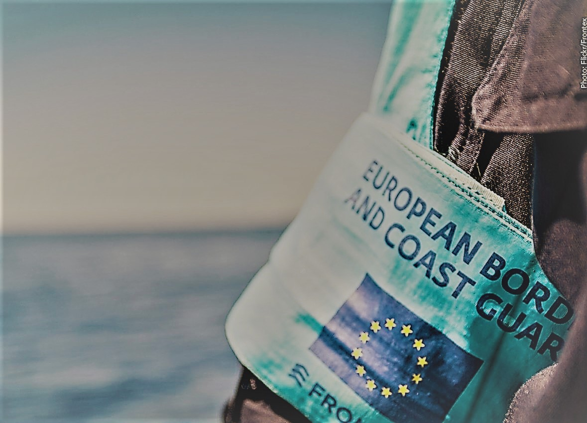

### AYS Daily Digest — 04/03/21: Frontex watchdog draws closer to implicating agency in illegal pushbacks
#### Italian prosecutors continue strategy of charging rescuers involved in SAR operations in the Mediterranean // Unaccompanied minors in Greece challenge systematic pushback practice // UK Home Office warned of precarious health situation before agreeing to send migrants to former military barracks // and more…\.

#### FEATURED: EU and FRONTEX

A new investigation report by the Frontex monitoring group on illegal pushbacks in the Aegean Sea, prompted by investigation of [Der Spiegel](https://www.spiegel.de/consent-a-?targetUrl=https%3A%2F%2Fwww.spiegel.de%2Fpolitik%2Fausland%2Ffrontex-skandal-um-griechische-pushbacks-freispruch-verweigert-a-c0b046cf-56e6-4594-87e1-b7153d462e7f%3Ffbclid%3DIwAR0Ost3o6oObUvoUrpn8PLJy1OHBBJtcQnx7esyJFL3dbdy-qIvfdASdhR4&ref=https%3A%2F%2Fl.facebook.com%2F) and other media, has recently been issued\.

> “The investigation report now shows that Frontex itself documented the pushbacks in detail\. Internal documents on the incidents investigated show that the Greek coast guard stops refugee boats, sometimes drives past them at high speed, tows the sometimes completely overcrowded boats towards Turkey and then abandons the people at sea\. The report also shows that the Frontex leadership is aware of this\. Corresponding surveillance images were streamed live to the agency’s headquarters\.” 

Frontex, which is responsible for patrolling the external borders of the 27\-nation EU, has rejected the pushback allegations and said that its own internal inquiry could find no evidence to substantiate the claims\. Greece, which is in charge of operations involving coordinating Frontex on its territory, has also denied reports of pushbacks by its border officers\. However, [the report has cleared Frontex](https://www.ekathimerini.com/news/1156367/probe-into-eu-border-agency-leaves-some-questions-unanswered/?fbclid=IwAR1_ub3k-Jo2u5cmZUFGo54OljLejaR_S321xufXi0K8ikWML1PQgE_cQyY) of links to most of the incidents but has been unable to establish what happened in five cases, according to the official report into the allegations\.

Fabrice Leggeri, the much\-discussed director of Frontex, whose resignation has been called for in the past months, [has lied once again](https://twitter.com/sirarego/status/1367506343515586568?s=20) in the European Parliament\. He assured parliamentarians that the agency has not violated fundamental rights in the Aegean, but the internal audit report contradicts him\. We join many other solidarity groups, NGOs, and MEPs in asking for his resignation\.

Statewatch [has published correspondence](https://www.statewatch.org/news/2021/march/eu-pushbacks-scandal-frontex-correspondence-with-national-and-eu-authorities/?fbclid=IwAR0n7ZMBkD3axpuTlF_4nVQvKz7ZUhwtYupXiC0zth5LW513DQOtcRfWoIo) between Frontex executive director Leggeri and the European Commission, Council and Parliament, the Frontex Management Board, and the border authorities of Greece, Romania, Portugal and Sweden, on the subject of alleged complicity in pushbacks in the Aegean region\.

> “The correspondence concerns the allegations levelled at Frontex in media reports in October 2020 that the agency had knowledge of or was complicit in a series of pushbacks from Greek to Turkish territory in the Aegean Sea\.” 

#### CYPRUS

KISA and EuroMedRights have submitted to the Cypriot government an “Input for the Special Rapporteur’s report on pushback practices and their impact on the human rights of migrants and refugees, with a focus on pushbacks from Cyprus to Lebanon and Turkey”, available [here\.](https://euromedrights.org/wp-content/uploads/2021/02/Submission-Special-Rapporteur-pushbacks_Cyprus_EuroMed-Rights.pdf)
#### GREECE
### Unaccompanied minor challenges systematic pushback practice, alleging torture

On 3 March 2021, [GLAN filed an application](https://www.glanlaw.org/aegean-push-backs?fbclid=IwAR1UAqrLn2UZk8SItE_htELqaGEkMLpj2SYR3F85YvMQBE99f8J_KYDW5jk) with the European Court of Human Rights on behalf of R, an unaccompanied asylum\-seeker child who was apprehended in the Vathy Reception and Identification Centre on Samos and subject to a life\-threatening pushback to Turkey, along with another minor, in September 2020\. The case challenges the acts of the Hellenic Coast Guard for seriously endangering the lives of two minors by leaving them adrift in an unnavigable life raft in the middle of the Aegean Sea\.

Two child [asylum seekers](https://www.independent.co.uk/topic/asylum-seekers-0) were removed from a refugee camp in Greece, taken out to sea on a coastguard vessel and left alone to drift on a motorless rubber dinghy, alleges a legal complaint against Athens lodged in the European Court of Human Rights\. Meanwhile, an unaccompanied minor has sued [Greece](https://twitter.com/itamann/status/1367399069048520704?s=20) for towing him out to sea and abandoning him there\.

[European Court of Human Rights grants](https://legalcentrelesvos.org/.../greek-government.../) Legal Centre Lesvos’ request for Greece to provide adequate mental healthcare and postpartum living conditions on the mainland to the pregnant woman who set herself on fire in RIC Mavrovouni\.

Turkish authorities found two Afghan teenagers, aged 15 and 16, paddling with their hands near Kusadasi on the Turkish coast on 9 September after the alleged “pushback” — the practice of forcibly turning those seeking asylum away from the border\.

A year since the killing of Muhammad Gulzar on the Greek\-Turkish border, an [investigation](https://twitter.com/Forensi.../status/1367509484323696643...) has probed into the use of live ammunition on migrants by Greek forces and the resulting casualties, including Gulzar’s death\.

**A few updates from the field:** there have been [10 positive COVID\-19](https://twitter.com/AVeizis/status/1367527439195381763?s=20) cases today in the Vathy camp\. You can also follow [this thread update](https://twitter.com/f_grill.../status/1367439484892176384...) on RIC Lesvos’ lack of basic resources\.

The police has used [tear gas](https://twitter.com/DunyaCollective/status/1367505120213180418?s=20&fbclid=IwAR0rKAwVdbH28547VSmHoN4ipQMLZu_0b2Xgld9MA2bw77SUMVMxNTsZHls) against protesting refugees at the 3rd day of the campstrike in Ritsona refugee camp in Greece\. The demands of the protesters include freedom of movement, IDs and papers, and an end to racist discrimination by authorities\.

A new law that increases registration requirements for foreign and local NGOs providing services to refugees and migrants in Greece has made it impossible for many of them to operate legally in the country, according to a new [report](https://helprefugees.org/news/greece-closing-in-on-civil-society/) by U\.K\. \-based charity [Choose Love](https://www.devex.com/organizations/choose-love-help-refugees-123524) \.
#### LIBYA

Eritrean, Sudanese, Ethiopian and other refugees [demonstrated yesterday](https://twitter.com/GiuliaRastajuly/status/1367410386430005251?s=20&fbclid=IwAR0AVTDteU_D6npLJYRSBe86_uXU5YqOPf-f1wKKdjM6xx9CSuULSe6Zl0E) outside the UNHCR offices in Gurji, Tripoli, begging for evacuation out of Libya, where they continue to suffer torture, slavery, hunger and deportations\.
#### MALTA

Almost 2 years ago, 108 people reached Malta on the ElHiblu, escaping war, and torture in Libya\. Upon arrival, three teenagers were arrested and accused of terrorist activities for protesting an illegal push\-back\. They spent seven months in jail before being released on bail\.

The members of the group of around 100 people who were rescued at sea are accused of having threatened the crew and forcing it to change course for Malta once they realised they were going to be returned to Libya, where they face persecution\.
#### SEA

According to sources from [AlarmPhone](https://twitter.com/alarm_phone/status/1367465099187871754?s=20&fbclid=IwAR0itHLJuZE6rSwZhfEfZAYOPNgp5z9EFfg0p0teMtIewzp1oVftVQN9JPo) , Moroccan authorities discovered 35 people in distress and sent them back to Morocco\. The people had been at sea for over two days, and had asked for support\. Together with AlarmPhone, we hope they will find safety and freedom one day\.

[According to IOM sources](https://www.iom.int/news/least-20-dead-after-smugglers-force-migrants-sea-djibouti?fbclid=IwAR0G8-PMOe_nMiUnglsGHIJDj4rn03j8qibhJN3GvLyP35ltApUhkPm_6y0#.YEDYe4WWDSU.twitter) , at least 20 people have drowned after smugglers threw dozens of migrants overboard early Wednesday morning during their journey from Djibouti to Yemen, the third such incident on the Gulf of Aden in six months\. At least 200 people, including children, were crowded aboard the vessel when it departed\.

30 minutes into the journey, the smugglers forced roughly 80 people into the sea\.

5 bodies were recovered yesterday\.
#### ITALY
### Investigations lead to charges for rescuers

In Italy, the rescue ship “SeaWatch 3” [has been allowed](https://ilmanifesto.it/sea-watch-lo-sbarco-dei-363-naufraghi-nel-porto-di-augusta/?fbclid=IwAR08cKPDbk6M3_nwguSREg18cnE5FBUvuFtsk5uXiInob_sdMqAyDo3oBB0) to disembark at the Sicilian port of Augusta after rescuing 363 people in distress\. This comes after days of the ship awaiting permission to disembark, and amidst a new wave of accusations from Italian \(and European\) far right groups of the NGOs “aiding” illegal immigration\.

Indeed, prosecutors in Italy [formally charge 21 people](https://www.theguardian.com/global-development/2021/mar/04/refugee-rescuers-charged-in-italy-with-complicity-in-people-smuggling?fbclid=IwAR2oSiiweKNRMbFyKRUJebMOe7jj-3GEKbs_P9fypDtzW7KyRpymCGCN2eo) associated with 3 sea rescue organizations with people smuggling from SAR activities in the Mediterranean in 2017\.

> “After an investigation lasting almost four years, Italian prosecutors have charged dozens of rescuers, from charities including Save the Children and [Médecins Sans Frontières](https://www.theguardian.com/world/medecins-sans-frontieres) , who were accused of collaborating with people smugglers after saving thousands of people from drowning in the Mediterranean\. 

> Investigators in Trapani, Sicily, formally closed the inquiry on Monday and charged more than 20 people, including boat captains, heads of mission and legal representatives, with crimes carrying sentences of up to 20 years\.” 

This European strategy of blaming the rescuers has been ongoing since 2016–2017, with repeated investigations directed towards rescue personnel and NGOs, to deter rescue operations and solidarity that are — in theory — inscribed in European human rights protection laws\. Indeed, Iuventa had been already under scrutiny in 2018\. For more on this, see [here](https://www.prospectmagazine.co.uk/magazine/europes-new-anti-migrant-strategy-blame-the-rescuers?fbclid=IwAR08GgB4at4E3ZGzreDPsc1b6MIPWAaDCH0XMkQH6z0vKbbg06FlBLt74ME) \.

Forensic oceanography and archaeology [evidence suggests](https://blamingtherescuers.org/iuventa/) those charged weren’t participating in smuggling efforts\. This is not the first time that rescue ships and personnel have been stalled by judiciary procedures, aimed at constituting an obstacle to their current operations, and deterring new ones\. The glacial pace of the Italian judiciary system, furthermore, will not help these NGOs to be rid of these accusations any time soon\.

“A [new study](https://twitter.com/lorenzo.../status/1367508144344211462...) shows the failure of Italy’s recent amnesty for undocumented migrants: 7 months later, of over 200k requests, only 1480 residence permits have been issued\.”
#### GERMANY

In the past two days, [197 people have been transferred](https://www.infomigrants.net/en/post/30651/197-refugees-transferred-from-greece-to-germany?fbclid=IwAR0-M61RnSzpujZ627h7Csw-YzXpPby3xOStNhFjUvMxeM3hwA0UurtHsuw) from Greece to Germany, where they will be settled in different German states\. This brings the total number of transfers since April of last year to 2,151\. Germany was one of several European countries that agreed to take in ‘vulnerable refugees and migrants’ from Greece last spring\. In March 2020, Berlin agreed to take in roughly 240 sick children and their core family members, as well as 53 unaccompanied minors\. The overall number of people Germany has agreed to take in from Greece is 2,750\.

[Here](https://twitter.com/UNHCRGr.../status/1367532408560640006...) is an infographic of the relocation scheme from Greece to other EU countries\.
### Safe cities network widens

Iserlohn [becomes a Safe Harbor city](https://twitter.com/Seebruecke_intl/status/1367526812197224450?s=20&fbclid=IwAR0jUaj8KAYM9zKSo-C0SWKx7HeUh4W1eZoy_4ECgF3Kgo9YhRiD8VaOibk) for refugees and migrants and joins the alliance “Cities of Safe Harbours”\! You can find out how to make your city a safe harbour on Seebrucke [homepage](https://seebruecke.org/en/)
#### SPAIN
### A young life lost while hateful rhetoric spreads in the south

We are sad to report the death of Ahmed, a [19\-year\-old sleeping rough in the Canary Islands](https://twitter.com/EduRobayna/status/1366736960417628165?s=20&fbclid=IwAR1t07rzHcR6a_-u6pXERJlLpuPhTUd1pR9X6vqz4v-CAa-yX1kXkpRzb2I) , near Arguineguin port\. Preliminary autopsy reports ruled he died of “natural causes” which indicates he died from being exposed to the elements instead of addressing the irregularity and danger of sleeping on the streets in search of safety and opportunity\.

Meanwhile [in Ceuta,](https://elforodeceuta.es/la-ultima-muestra-del-racismo.../) the far\-right Vox party has proposed to expel minors who test positive for COVID\-19\.
#### DENMARK
### Declaring Damascus safe, stripping people of protection

[Denmark has stripped 94 Syrian refugees of their residency permits](https://www.infomigrants.net/en/post/30650/denmark-declares-parts-of-syria-safe-pressuring-refugees-to-return?fbclid=IwAR2oSiiweKNRMbFyKRUJebMOe7jj-3GEKbs_P9fypDtzW7KyRpymCGCN2eo) after declaring that Damascus and the surrounding area were safe\. The Scandinavian nation is the first EU country to say that law\-abiding refugees can be sent back to Syria\. The move comes after the Danish government decided to extend the area of Syria it considers safe to include the Rif Dimashq Governorate — an area that includes the capital city, Damascus\.

Although they have been moved to deportation centres and have not yet been repatriated, human rights groups fear that the refugees will feel pressured to leave, even though their return is voluntary\.

“In early February 2021, the Danish Parliament took the extraordinary step of initiating an impeachment trial against Inger Støjberg, Minister of Immigration between 2015 and 2019\. The trial is the last chapter in a controversial and complex case on the treatment of asylum\-seeking couples, where one partner is under 18\. In 2016, the Minister issued a directive about the separation of all such couples, without exception, and the administration carried it into effect\. This directive was later declared clearly illegal according to both Danish administrative law and the European Convention on Human Rights\.”

More on this story [here\.](https://verfassungsblog.de/immigration-impeachment/?fbclid=IwAR3yKP3lpeS5NqQHiyH5bwtlQTCijLyhefTjg2np5d-wyvg07w25tfKJTSo)

In the meantime, the Syrian Network for Human Rights has published [this infographic](https://twitter.com/snhr/status/1367520656200503298?s=20&fbclid=IwAR3_u3gaq8ZoGyihExmle3zfI92EUKPIiRiY0RJUWuGCmX3lXWwgDfIijvE) showing the most notable human rights violations in Syria in February 2021\.
#### UK
### Knowingly leaving people in misery

The [Bureau of Investigative Journalism](https://www.thebureauinvestigates.com/stories/2021-03-04/revealed-home-office-knew-housing-refugees-at-run-down-barracks-risked-mass-covid-infection?fbclid=IwAR0SrXMbvcHxIMyVHPSfH_NKZCUwsB95nHoLHb4yHM_eYaVGgUt5uJmvP9w) has revealed that the Home Office was aware of the health risks that came with housing asylum seekers at former military barracks where there has since been a major coronavirus outbreak, a topic we wrote extensively about in AYS Daily News Dige st\.

> “Last year reports were compiled about Napier barracks in Kent and Penally camp in Pembrokeshire before asylum seekers were moved into both sites\. The reports show that the Home Office knew the accommodation was in a “poor state of repair” and was explicitly warned that it would be a potential “risk” to house people in shared dormitories during a pandemic, but pushed forward with the plan regardless\. Since January, almost 200 people at Napier have tested positive for Covid\-19\.” 

The NHS [had warne](https://www.independent.co.uk/news/uk/home-news/napier-barracks-asylum-seekers-coronavirus-ccg-b1811948.html?fbclid=IwAR3AK5_CBjjINKJc0qordgJfEr9XmELQGJp06jd0K3HmCn9WsOnw3UpoYXM) d it would be impossible for asylum seekers to social\-distance at Napier Barracks as coronavirus spread through the camp earlier this year, but the Home Office still refused to move them out of the controversial housing\.

The [Joint Council for the Welfare of Immigrants](https://twitter.com/JCWI_UK/status/1367409237572390912?s=20&fbclid=IwAR1CKMLIKNZwihfwoyWSMGbY-KudLd9n9ua2rawmAAb02GQOivYwaOHKhLo) has a new report which showed that 75% of migrants who lost their jobs during the pandemic were denied government support due to NRPF rules \(No Resource to Public Funds, which under Section 115 of the Immigration and Asylum Act 1999 state that a person will have ‘no recourse to public funds’ if they are ‘subject to immigration control’\) \. These rules will keep pushing families into destitution unless urgent action is taken\.

FreeMovement\.org has published this interesting first\-person account of what it is like to work as a lawyer for stateless people in the UK\. Find out more [here](https://www.freemovement.org.uk/this-is-what-its-like-to-be-a-lawyer-working-for-stateless-people-in-the-uk/?fbclid=IwAR39ZyUlKFoZAm_wGMpKTBQGOqJ9y9dlCL_M3j_6ux0JSgNKa_6dcLFlmog) \.

There is an interesting development in court litigation over immigration policies in the UK\. [SafePassageUK](https://twitter.com/safepassageuk/status/1367549794462404608?s=20&fbclid=IwAR1qS5l1Xies9PRBIRPft-PuiXaW1FIEwlOQiyX-XDt4tWFClvFAnZu4CKc) will be taking the Home Office to court over its unlawful policy on refugee family reunion under the Dublin III Regulation\. This policy has led to the Home Office making many wrong and unlawful decisions that put unaccompanied children’s lives at risk\.
#### ETHIOPIA

“UN human rights chief underscores urgency [of impartial, international investigation into Tigray atrocities](https://www.amnesty.org/en/latest/news/2021/03/ethiopia-un-human-rights-chief-underscores-urgency-of-impartial-international-investigation-into-tigray-atrocities/?fbclid=IwAR2epwsYZkBkkwKet-HmEHO79npQFTdfEqIaMdNOCZlHoUsdWX19IYOoMIg) ”\. The **UN must immediately launch an investigation into ongoing allegations of grave violations** in the conflict in Tigray, including potential war crimes and crimes against humanity, Amnesty International said following a statement this morning by the UN High Commissioner for Human Rights\.
#### MOZAMBIQUE

The Conflict in Cabo Delgado, ongoing since 2017, has officially displaced 670,000 people, according to [MSF](https://twitter.com/MSF/status/1367502153376489476?s=20&fbclid=IwAR0_aWjcK6ZFCHwK77syBhWUhp1IAoutuUo5w2GFR4C8MFggOfdNVjCHUvE) \.
#### FOR FURTHER READING
- We would like to signal [this report on the Missing Migrants Project](https://www.fmreview.org/issue66/sanchezdionis-dearden?fbclid=IwAR1HL-H6_OiQsLhIOCYMDgk2xbyYn3bB1SO-JDSf37nIm4ZvPxRE3hl0f7E) , a subset of the IOM that helps families deal with the loss of their loved ones on migration journeys

> “Families of people who go missing on a migration journey either do not know how to seek government support or are skeptical of doing so, and States have done almost nothing to address this issue\. There appears to be little understanding and appreciation of the obstacles that families face in the search for answers about the fate of their missing loved ones and of the impact of such a situation on their well\-being and livelihoods\.” 

- **“Refugees Welcome”: What has become of the Norwegian volunteer initiatives of 2015?** 
 How did the transition from spontaneous volunteer initiatives, at a moment of media and political attention, materialize into formalized structures, responding to needs and contexts that also changed over time during the so called refugee crisis? More below:

**Find daily updates and special reports on our [Medium page](https://medium.com/are-you-syrious) \.**

**If you wish to contribute, either by writing a report or a story, or by joining the info gathering team, please let us know\.**

**We strive to echo correct news from the ground through collaboration and fairness\. Every effort has been made to credit organisations and individuals with regard to the supply of information, video, and photo material \(in cases where the source wanted to be accredited\) \. Please notify us regarding corrections\.**

**If there’s anything you want to share or comment, contact us through Facebook, Twitter or write to: areyousyrious@gmail\.com**

_Converted [Medium Post](https://medium.com/are-you-syrious/ays-daily-digest-04-03-2021-frontex-watchdog-draws-closer-to-determine-agency-implication-in-1bd9459a11a6) by [ZMediumToMarkdown](https://github.com/ZhgChgLi/ZMediumToMarkdown)._
