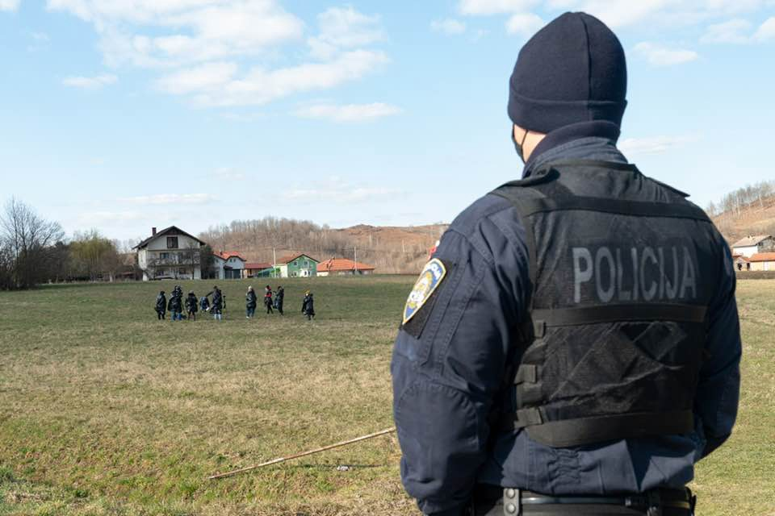
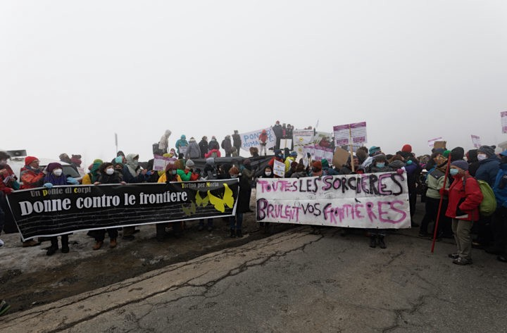

### AYS Weekend Digest 6–7/3/2021: Solidarity along the Balkan route

Arrivals and fear of pushbacks on Lesvos // EU Commissioner visits Leros and Kos // Demonstrations in the Canary islands // Updates from the UK\.

 \(MORIA 2\.’\), by [Lida Shirzad](https://www.facebook.com/lida.shirzad.75?__cft__[0]=AZVU5KAR4BlRIz-S29DVK8X01tIJHSSkfCjZ9bzkiX01ktleS9404Q7MHWYhTBd6-Wb0gmvLq-JQyPD5VtMUAJOseG93EJuJPCYdq6d0hLZVmZ5Yyvx8ljkjYtHp8uN_nBsWT6xzqbUeuBa2rNFTh1Iw&__tn__=-]K-R)](assets/e9d5e90d5935/1*Dxo_HVT-kgC_vWjV-cYH0A.jpeg)

[\#WHF ART LESVOS](https://www.facebook.com/waveofhopeforthefuture/posts/886221385510994) \(MORIA 2\.’\), by [Lida Shirzad](https://www.facebook.com/lida.shirzad.75?__cft__[0]=AZVU5KAR4BlRIz-S29DVK8X01tIJHSSkfCjZ9bzkiX01ktleS9404Q7MHWYhTBd6-Wb0gmvLq-JQyPD5VtMUAJOseG93EJuJPCYdq6d0hLZVmZ5Yyvx8ljkjYtHp8uN_nBsWT6xzqbUeuBa2rNFTh1Iw&__tn__=-]K-R)
#### Featured — Solidarity along the Balkan route

Following the police investigation on Lorena Fornasir, Gian Andrea Franchi and four more people involved in solidarity groups in north\-eastern Italy and along the Balkan route, an [appeal against the criminalisation of solidarity](https://www.meltingpot.org/La-solidarieta-non-e-reato.html) has been signed by more than 100 academics and researchers\.

On Saturday, Lorena Fornasir and other women went to Maljevac, on the Croatian side of the border with Bosnia, within the initiative [_Un Ponte di Corpi_](https://www.facebook.com/unpontedicorpi/posts/117262203743912) \(A Bridge of Bodies\):

 Lorena Fornasir and Gian Andrea Franchi in Maljevac \(Croatia\)](assets/e9d5e90d5935/1*pl_WHDrmbPbyzpX8p6c1wA.jpeg)

[Un ponte di corpi,](https://www.facebook.com/unpontedicorpi/posts/117505703719562) Lorena Fornasir and Gian Andrea Franchi in Maljevac \(Croatia\)

> You, living on the threshold between life and death, you teach us that life tolerates no borders\. The borders are places where a Power decides who is worthy of living and who is not\. 

> That’s why we are here with our bodies, on the border: to deny the border its power to reduce life to a piece of paper: those who have it can live, those who don’t can die\. 

> We are here on the border you cross with your bodies: chased, hunted, beaten, tortured, banned and humiliated, hurt sometimes to death\. 

> We are here to say that the border is a crime against life\. 

> As women, we know better than men what is the body\. The body that is born, grows and wants to live\. 

 and [Ginevra Battistini](https://www.facebook.com/ginevra.battistini/posts/3736162239804336)](assets/e9d5e90d5935/1*e0YEfm7AQdN_mI1R6jJIuw.jpeg)

March 6 — Un Ponte di Corpi in Clavière \(Left\) and in Trieste \(Right\) — Photos by [Fabrizio Maffioletti](https://www.pressenza.com/it/2021/03/un-ponte-di-corpi-a-claviere/) and [Ginevra Battistini](https://www.facebook.com/ginevra.battistini/posts/3736162239804336)

The initiative was [live streamed](https://www.facebook.com/unpontedicorpi/videos/2830394130542531) in many cities across Italy and Europe: from Berlin to Marseille, to Ventimiglia and Clavière, Milan, Trieste and Maljevac, Athens, Rome, Siracusa, Palermo, Catania and Paestum\.

Lesvos Calling Campaign launched “ [Caravan for Freedom of Movement](https://www.facebook.com/events/259467152440380/) ” from Trieste to Maljevac for Saturday 17th of April\.

 \)](assets/e9d5e90d5935/1*XOBDhKJJvjoiH0BrA09qfQ.jpeg)

\(By [Campagna Lesvos Calling](https://www.facebook.com/events/259467152440380/) \)

SEA
#### 11 people returned to Algeria

On Friday evening, the relatives of 11 people [contacted Alarm Phone](https://twitter.com/alarm_phone/status/1368521801899315206) to raise concern about a boat in distress off the coast of Algeria\. The boat’s engine had failed\. MRCC Algiers has confirmed that they were returned to Algeria\.

GREECE
#### **Arrivals**

Alarm Phone reported of a group who [contacted](https://twitter.com/alarm_phone/status/1367742490741252096) them from Lesvos on Friday, stuck in the woods in the south of the island\. They were eventually [found](https://twitter.com/alarm_phone/status/1368198449896820746) by local authorities and brought to the Kara Tepe camp\.
#### Another pushback?

On March 5th [Alarm Phone reported](https://twitter.com/alarm_phone/status/1368207559165902849) that a group of people had arrived to Kagia Beach, Skala Sikamineas, North Lesvos and area with a military and police presence\. They could not contact the people directly but informed UNHCR\.

> Worried relatives called us again about this group of people\. They repeated that they fear an illegal pushback\. Neither they nor the Alarm Phone has been able to reach the people for a while\. Authorities on [\#Lesvos](https://twitter.com/hashtag/Lesvos?src=hashtag_click) say they do not know anything about this group\. Where are they? 

On the 6th of March the Turkish Coast Guard informed them that 8 men, 5 women and 15 children had been rescued the night before, also in the north of Lesvos\. They have no way to verify if this is the same group and have asked UNHCR to investigate the incident\.
#### EU Commission vice president Schinias and Greek migration minister Mitarakis visit Leros and Kos

The two Greek politicians [visited](https://twitter.com/nmitarakis/status/1368154077239115776) the hotspots on both islands, the sites chosen for the new closed/controlled structures, and the [Frontex office](https://twitter.com/Frontex/status/1368188322741432320) in Kos\.

 \)](assets/e9d5e90d5935/1*L-4v_zcsp-4BQgtwlH73cw.jpeg)

“EU Commissioner Margaritis Schinias on Saturday visited the Greek island of Leros and was shown, along with Migration Minister Notis Mitarakis, the site where the new closed\-access refugee reception center will be built\. What is the anticipated capacity of the new facility?” \(by [Daphne Tolis](https://twitter.com/daphnetoli/status/1368168213197053954/photo/1) \)

The EU Commissioner restated the full support of Europe to Greece’s illiberal and discriminatory policies\. €121m of EU funding has been [allocated](https://twitter.com/MargSchinas/status/1368199405854220291) for the new centres in Samos, Leros and Kos\.
#### Video from the \#campstrike in Ritsona

■■■■■■■■■■■■■■ 
> **[Parwana Amiri پروانه اميري](https://twitter.com/parwana_amiri) @ Twitter Says:** 

> > What we really need is,attention and communication of media and local community. 
What can be written about the reason of our #campstrike in media, that local community is getting angry ,but all the ways of raising our voices is banned.
#Leavenoonoebehind 
#FreedomOfMovement https://t.co/nLU8jzPpPl 

> **Tweeted at [2021-03-06 13:06:26](https://twitter.com/parwana_amiri/status/1368186209684647938).** 

■■■■■■■■■■■■■■ 

**SPAIN**
#### Weekend Protest

On Saturday a protest was held in La Laguna, Tenerife against deaths at sea, borders and Frontex\.

■■■■■■■■■■■■■■ 
> **[Natalia G. Vargas](https://twitter.com/nataliag_vargas) @ Twitter Says:** 

> > Hoy las calles de La Laguna se han levantado por la libertad. 

حرية https://t.co/zMwRMhamF2 

> **Tweeted at [2021-03-06 15:05:57](https://twitter.com/nataliag_vargas/status/1368216284194877449).** 

■■■■■■■■■■■■■■ 

UK

[ECRE report](https://mailchi.mp/ecre/ecre-weekly-bulletin-05032021?fbclid=IwAR3sQVZszu80qSzrdIOAeHDRiGA978bt5AWCkBSEjr5HIrcVsFp2hq_0t6I#UK) that Asylum [applications in the UK dropped](https://www.refugeecouncil.org.uk/latest/news/asylum-applications-fall-in-2020-as-the-backlog-of-cases-awaiting-a-decision-reaches-a-new-high/) by 18 per cent in 2020–29,456 compared to 35,737 in 2019 — yet the number of people awaiting a decision reached a new high\. They also provide an overall analysis of the current situation for people trying to survive the immigration system\.

> The Court of Appeal rules Home Office fees \[1000 pounds\] to register a child as [**British citizen unlawful**](https://www.independent.co.uk/news/uk/home-news/children-british-citizenship-appeals-court-home-office-b1804010.html) \. Lack of access to legal aid for immigration detainees is unlawful, [**states High Court ruling**](https://www.independent.co.uk/news/uk/home-news/legal-aid-immigration-detention-high-court-b1807244.html) \. 

However, [**in the same period**](https://www.independent.co.uk/news/uk/home-news/uk-asylum-seeker-covid-home-office-b1807206.html) the number of individuals in the asylum support system increased by 28 per cent, partly due to the pandemic\.

> the number of people waiting for an initial decision on their asylum claim continued to rise, reaching a record high of 64,895\. Of these, 46,796 \(72%\) have been waiting for more than 6 months, up from 29,233 the previous year\. 

As we previously reported, 197 out of 380 people housed in Napier barracks tested positive for COVID\-19 in January and February, leading chair of the home affairs select committee, Yvette Cooper to state:

> On what planet did you think in the middle of a Covid crisis it was safe or sensible to put over 20 people in a dorm so they are sleeping together in the same room with the same air overnight each night? 

A full judicial review of the use of the sites is expected in April\.

> At least nine people died last year in hotels contracted by the Home Office to house thousands of asylum seekers, with others forced to sleep rough following [**evictions**](https://www.independent.co.uk/news/uk/home-news/asylum-seeker-evict-hotel-home-office-uk-b1802889.html) \. 

These hotels, overseen by the Home Office and run by private contractors, have seen repeated cases of “sexual harassment, threats and intimidation, and exposure to COVID\-19 of asylum seekers, and the employment of untrained staff paid significantly below the minimum wage\.”

> The high court [**has given the Home Office**](https://www.theguardian.com/uk-news/2021/feb/19/asylum-seeker-brings-case-against-covid-curfew-at-london-hotel) until 4pm on Friday to file a response to judicial review proceedings launched by an asylum seeker over “false imprisonment and deprivation of liberty in breach of the European convention on human rights”\. 

**Find daily updates and special reports on our [Medium page](https://medium.com/are-you-syrious) \.**

**If you wish to contribute, either by writing a report or a story, or by joining the info gathering team, please let us know\.**

**We strive to echo correct news from the ground through collaboration and fairness\. Every effort has been made to credit organisations and individuals with regard to the supply of information, video, and photo material \(in cases where the source wanted to be accredited\) \. Please notify us regarding corrections\.**

**If there’s anything you want to share or comment, contact us through Facebook, Twitter or write to: areyousyrious@gmail\.com**

_Converted [Medium Post](https://medium.com/are-you-syrious/ays-weekend-digest-6-7-3-2021-solidarity-along-the-balkan-route-e9d5e90d5935) by [ZMediumToMarkdown](https://github.com/ZhgChgLi/ZMediumToMarkdown)._
