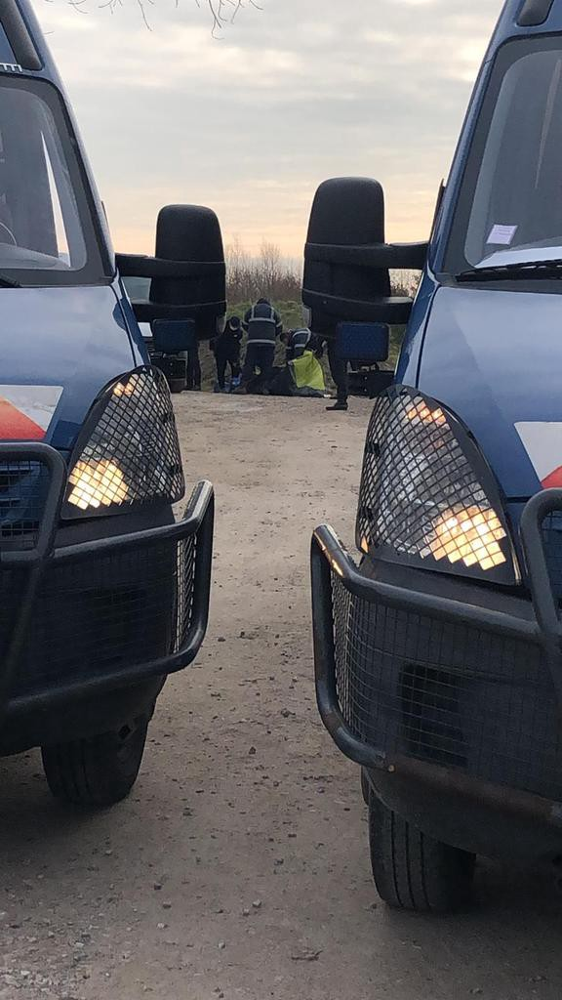

### AYS Daily Digest 08/03/21 Women’s Day movements: Feminism must include refugees

_Rejection of asylum app in Slovenia for mother and two daughters who were sexually assaulted // update for women and girls in Northern France // UNHCR criticizes Danish plans to outsource asylum // and more…_

](assets/2c91347124c4/1*wltK1Bpdi7SOaFdovjkhDg.jpeg)

Feminist demonstration from the girls and women of Ritsona in Athens on March 8th 2021\. Photo by 
[Solidarity with migrants](https://twitter.com/MigrantsSoli/status/1368887557103247365)
### FEATURE: Women’s Day feminist demonstration in Athens and solidarity across the world

On Monday at 13\.00, people gathered at Klafthmonos square in Athens “in order to co\-create a multinational bloc” for a [massive demonstration](https://www.facebook.com/solidaritymigrants/posts/265186358437234) in feminist solidarity for International Women’s Day\. Demands were made to open the borders and close the camps, as these are undoubtedly feminist demands\.

In their call to action, the organizers made it clear that this was an effort of feminist and class struggle against the domineering narrative that women’s day is depoliticized\. [Solidarity with Migrants](https://www.facebook.com/solidaritymigrants/posts/263067885315748) posted:

> “As oppressed individuals we want to organize a different 8th of March because for us it is yet another day of struggle in the context of the social war that is waged against the lives and the bodies of those who diverge from the cisheteropatriarchal, racist and capitalist Greek society and its state\.” 

> “The migrant women in the concentration camps who live a life of incarceration and who — at the point where Greek racism meets patriarchy — are abused by cops, managers, Greek citizens, workers and bosses of NGOs but also other migrants, those who are thrown out of their houses with evictions, who do not have access to healthcare, who raise children on their own\. The local and migrant female workers that will not speak up because they might lose their job, queer individuals who are abused in their families, at school and the university, in the army and their workplace if they ever manage to get a job, the ‘‘invisible’’ sexworkers, the users and drug addicts whose life is treated as unworthy\.
 

> For these ‘‘surplus populations’’ and other oppressed subjects we want a dynamic, antinationalist/antiracist, anticapitalist and antistatist 8th of March\.” 

■■■■■■■■■■■■■■ 
> **[Nikos Roussos](https://twitter.com/comzeradd) @ Twitter Says:** 

> > "Borders. Borders. Borders.
On Evros wall, on Aegean bottom,
lies every European's security."

#InternationalWomensDay #IWD2021 
#Athens Syntagma Sq.

🎥 @[ThePressProject](https://twitter.com/ThePressProject) https://t.co/344hUZmEmz 

> **Tweeted at [2021-03-08 18:28:43](https://twitter.com/comzeradd/status/1368992088105312260).** 

■■■■■■■■■■■■■■ 

](assets/2c91347124c4/1*KHlyQY0TCadDyb2WOmAvDQ.jpeg)

“OPEN THE BORDERS AND DESTROY THE CAMPS\!”
“Women who move into Greece have to survive both the dehumanising border system and sexist violence\. 
Today on International Women’s Day, members of the Khora community marched with thousands of others to demand liberty and freedom for women, and a better world for us all ✊” Photo by [Khora](https://www.facebook.com/KhoraAthens/posts/1706640692841865)

In solidarity, The Transnational Social Strike Platform published a text by the Women in Solidarity House, Lesbos on International Women’s Day\. They make it very clear that standing against the building of Moria 2\.0 is a feminist and antiracist issue:

> “We, as migrant women, live the worst conditions in the camp\. The camp is not safe for us, the hygienic conditions are terrible and especially difficult for women\. Extreme measures are taken by people to raise up their voices after facing a systematic passivity to unfair, violent and neglected situations\. Our bodies burn because of injustice and neglect\. The exercise of keeping ourselves alive puts our own lives at risk\. The system wants us dead\. 

> Even if you are not able to hear us it doesn’t mean that we are silent and we don’t resist\. We were never really silent\. If you paid attention, you could hear our voices among the tents of this camp of shame, among the sounds of the fights in the camp, among the cries of so many who couldn’t take it anymore\. We are still looking for a way to free ourselves, raise our voice with different ways even though most of the world is ignoring us\. As migrant women who come from patriarchal cultures and countries where women are pushed down by men, in addition to that, we also face a racist system and the pressures of an unfair and unedifying asylum procedure\. 

> In this situation, because of being women living in a patriarchal world, we are the ones who have to take care of children & family and are expected to provide food while being stuck in an island what makes us deal even with more problems\. We as migrant women are facing a double discrimination and suppression by patriarchal and racist power\. When we come to Europe we experience islamophobia even by people calling themselves feminists while feminism actually means to be self\-determined\.” 

Read the wonderful piece in full [here](https://www.transnational-strike.info/2021/03/05/you-cannot-speak-about-feminism-if-we-are-not-included-8th-march-the-tmc-speaks-from-moria/?fbclid=IwAR2wfU7p5XGuY3F0nKKg6XEduj3zzZpFmmh7JJ8GdhklPQmatgRxji44m5g) \.

](assets/2c91347124c4/1*J-bbGqsIkCmJy3KxybBL9Q.jpeg)

“Thousands of women and girls in displacement remain stranded in overcrowded living conditions on the Aegean islands as they await their asylum interview\. On Lesvos alone, there are over 9,000 refugees and asylum seekers\. Almost 40% of them are women and girls\. They face disproportionate risks and are particularly vulnerable to a number of threats, including exposure to sexual and gender\-based violence\.” Photo and Info by [European Lawyers in Lesvos](https://www.facebook.com/EuropeanLawyersInLesvos/posts/2866888536965219)

Here at AYS, we hope you were able to stand in community, either in person or in the spirit of solidarity, on this year’s International Women’s Day\. To all those fighting for the human rights of women refugees, we have your back\!
#### GREECE
### Government purposely not making refugees and asylum seekers a vaccine priority

Experts say that in order to end the pandemic, it is crucial that refugees and asylum seekers are vaccinated\. Despite some promises last month to make asylum seekers eligible for the vaccine, the Greek Government made it clear last week they are going to continue with their “Greece first” plan\. A government [spokesperson said](https://www.voanews.com/covid-19-pandemic/greece-sidelines-thousands-asylum-seekers-national-inoculation-drive?fbclid=IwAR0X7f0xr4C5vR9DDdBCG-1unygR9zgSANTTIz4hMgHNpEyK5GD7sBvWyhk) that for the time being, “others” were the priority\.

Evangelia \(Lilian\) Tsourdi and Niovi Vavoula have just published an article entitled “Greece’s Covid\-19 Response: Not Beyond Reproach” where they concluded that the greatest victims to the Government’s plan were asylum seekers\. Find out more [here](https://www.qmul.ac.uk/law/news/responding-to-covid-19/items/greeces-covid-19-response-not-beyond-reproach.html?fbclid=IwAR1sbljE2PgaIFFXVlwD2Ix7Ka7lBFamfv90zZMVWorbdE16GvYMVWlinIk) \.
### Solidarity with the Moria six as trial opens for two

■■■■■■■■■■■■■■ 
> **[Legal Centre Lesvos](https://twitter.com/lesboslegal) @ Twitter Says:** 

> > [1/2] Today, the court of Mytilene, Lesvos, opened the trial against two of the six people facing charges of arson with danger to human life in relation to the fire that destroyed Moria camp in September 2020. 

> **Tweeted at [2021-03-08 22:18:15](https://twitter.com/lesboslegal/status/1369049852114575370).** 

■■■■■■■■■■■■■■ 

Both of them arrived in Greece as unaccompanied minors and were still only 17 at the time of their arrest\. They were arrested after the fire that burned down the Moria camp on 08/09/20 and have been charged with “arson with risk to human life\.” As [Solidarity Without Borders](https://cantevictsolidarityenglish.noblogs.org/post/2021/03/08/lesvos-freedom-for-the-imprisoned-moria-6/?fbclid=IwAR1IVtlEn5LKtsreUBfKSOT5bdoCYZlj63mhl3fXCxOVHIvXtVaJLpktL78) reports:

> “The two defendants, who were arrested as minors, have by now been in pre\-trial detention for nearly six months — the maximum time for pretrial detention of minors\. The court mobilized several witnesses for the trial, among them the camp management, the police and residents of Moria village\. Monitoring the trial is made impossible, because of heavy police presence at the court, and strict and disproportionate Covid\-19 movement restrictions\. Furthermore, because the defendants were minors at the time of their arrest, their trial is closed to the public\.” 

[Legal Centre Lesvos](https://twitter.com/lesboslegal/status/1369049853586726913) is providing their representation after they have been detained for six months\.
#### ITALY
### Bani Walid ‘torturer’ sentenced to life in prison

According to Info Migrants “ _Italy’s Supreme Court of Cassation has confirmed a life sentence for Osman M\., known as Ismail, for killing and abusing detainees at the camp of Bani Walid in Libya\. The judges said that the man killed at least six people and tortured and raped detainees ‘beyond any reasonable doubt\._ ’” More [here](https://www.infomigrants.net/en/post/30707/italy-life-term-for-bani-walid-torturer-of-migrants?fbclid=IwAR13sDif58_2f5PC2QQT8Llp4AeA4CVQ_kl56eaz67Q7E5pZ6MwvQHeQMAs) \.
#### SLOVENIA
### Rejection of asylum application for mother and her two minor daughters who were sexually assaulted

The Ministry of the Interior has rejected and could deport a mother and her two daughters, all of whom were sexually assaulted by police officers in their home country\. They are saying that while the sexual assault was bad, it does not constitute inhumane behavior\.

The attack happened during a political riot where police officers came into their home without uniforms\. The family was able to escape the violence and have been living in Slovenia for three years\. The girls are ages 9 and 16 and are attending school in Slovenia\.

This is a horrible and appalling decision by Slovenia\. Sexual assault is, and always will be, inhumane\. On International Women’s Day and EVERY DAY we stand against misogyny such as this decision\.
#### DENMARK
### UNHCR raises severe criticism of Danish plans to outsource asylum

UNHCR said in a new report, which [the European Council on Refugees and Exiles \(ECRE\)](https://www.facebook.com/TheECRE/posts/10160851713362228) summarizes, “The highly controversial Proposal from the Danish Government seeks to create a legal basis for the transfer of asylum\-seekers to third countries for asylum processing and accommodation\. In its response the UN Refugee Agency \(UNHCR\) raises numerous points of critique\.”
- IT IS UNCLEAR: “In UNHCR’s view, the Proposal does not sufficiently detail and elaborate on the proposed arrangements to enable an informed assessment on the compliance with Denmark’s international obligations under the 1951 Convention and other international and regional human rights instruments and EU law\.”
- IT UNDERMINES INTERNATIONAL SOLIDARITY: “With nearly 80 million forcibly displaced people in the world, States need to act, within and beyond their borders, to share responsibility and to refrain from measures that risk undermining the international protection system\. Developing regions are hosting 85 percent of the world’s refugees, with the least developed countries providing asylum for one third of the global total\. Only a very small fraction of the displaced population may eventually move to Europe\. In light of these global perspectives and the current historically low number of asylum\-seekers in Denmark, UNHCR finds the Government’s vision of ‘zero asylum\-seekers’ in the country inconsistent with global solidarity and responsibility sharing\.”
- EXTERNALIZATION IS INCONSISTENT WITH THE INTENTION AND SPIRIT OF THE REFUGEE CONVENTION: “UNHCR considers that the Danish proposal to transfer asylum\-seekers to third countries for processing asylum applications and accommodation is an example of such externalization practices\. UNHCR does not support externalization, as such practices, that shift burdens, avoid responsibility, and frustrate access to international protection, are inconsistent with global solidarity and responsibility sharing, regularly undermines the rights of asylum\-seekers and refugees and thus violate international obligations of States\.”

#### FRANCE

](assets/2c91347124c4/1*gVGbrflwL1CotVeNjV2k2A.jpeg)

“This morning at Calais , the operations forced evictions continue by the police\. The exiles have nowhere to take shelter despite the cold\. Items, including tents full of personal belongings, were seized\.” Photo and Info by [Human Rights Observers](https://twitter.com/HumanRightsObs/status/1369024881191510019)

](assets/2c91347124c4/1*__7GMVQnwFgfjphDhVt8Lw.jpeg)

Photo by [Refugee Women’s Centre](https://refugee-rights.eu/2021/03/07/international-womens-day-update-on-the-situation-in-northern-france/?fbclid=IwAR0pYbTwh0LxBRy26t2FGWn2XuKvfeION_45mnZPhX6jZNktOFeMJnCMPP8)
### “International Women’s Day: update on the situation in Northern France for displaced women, girls and families”

The Refugee Women’s Centre Team has published this article outlining the situation in Grande\-Synthe and Calais for women and girls, as well as a list of specific issues facing women and girls on the move\.

**Women and girls in Grande\-Synthe:**

> “In Grande\-Synthe, there has historically been a large population of women and children, many of whom are Iraqi or Iranian Kurds\. There are a number of smaller minority groups of Iraqi Arabs, Vietnamese, Afghans, and Persian Iranian families\. The lack of access to adequate shelter remains one of the biggest concerns for women and families in Grande\-Synthe, all of whom sleep in basic tents in informal camps\. 

> Evictions remain a regular part of life in Grande\-Synthe, with major police\-led clearances of living sites occurring one to three times a week\. The frequency of police evictions last summer led families to hide their camps extremely far away from main distribution points, making their access to essential food, water, and medical services much more limited\. 

> For the second consecutive winter, no emergency accommodation for women and families was opened in the Dunkirk region, despite temperatures dropping to \-7ºC in February\. The impact that this long\-term lack of shelter has had is very far\-reaching; without the most basic survival need of shelter being met, addressing other needs and building community becomes much more complex\.” 

**Women and girls in Calais:**

> “It has previously been uncommon for a large number of women or children to be present or sleeping outside in Calais, but this year we witnessed an unprecedented increase in the population of women and children, quadrupling numbers seen in previous years\. The context of Calais is extremely difficult for women and families, as the mixed demographics and geography of living sites make building community and accessing services and support complex\. 

> Throughout the summer, this population contended with frequent violent police evictions\[2\] and an insufficient provision of services\. The majority of the women and families in Calais travel from Eritrea, Ethiopia, Iran, Sudan, and Afghanistan\. The number of single women, and female unaccompanied minors, is much higher than in Grande\-Synthe\. 

> In this male\-dominated transitory context, with limited access to information or support, these groups are extremely vulnerable to exploitation, harassment, and rape\. This is particularly worrying in the case of female unaccompanied minors, who should be entitled to full state protection as children\.” 

AYS sends a huge thank you to the Refugee Women’s Centre Team for publishing this ever important information\. Please check it out in full [here](https://refugee-rights.eu/2021/03/07/international-womens-day-update-on-the-situation-in-northern-france/?fbclid=IwAR0pYbTwh0LxBRy26t2FGWn2XuKvfeION_45mnZPhX6jZNktOFeMJnCMPP8) \.
#### EU

■■■■■■■■■■■■■■ 
> **[Lena K.](https://twitter.com/lk2015r) @ Twitter Says:** 

> > Installement no. 3 (yep, I'm counting) in the #Frontex equal opportunities approach to border violence. 

> **Tweeted at [2021-03-08 12:01:13](https://twitter.com/lk2015r/status/1368894572286406656).** 

■■■■■■■■■■■■■■ 

Women can of course work to oppress other women…and Frontex seems to be giving European women plenty of opportunities\. [As Frontex is facing serious allegations of pushbacks](https://euobserver.com/migration/151148?utm_source=euobs&utm_medium=email&fbclid=IwAR2P8e5vHbglvNmY52XXjij2YcaqcnHIrW_iqthDZzMNF7e-CSBQ1V65AAA) , this cannot be more clear\.
#### UK
### “An inspection of the use of contingency asylum accommodation — key findings from site visits to Penally Camp and Napier Barracks”

In a [just published report](https://www.gov.uk/government/news/an-inspection-of-the-use-of-contingency-asylum-accommodation-key-findings-from-site-visits-to-penally-camp-and-napier-barracks?fbclid=IwAR22_WFL80uE_Lt4DnLhhBAF9oj8PPHRYYCmonabhugoX5SqYWrJLDofcys) , evidence amounts for the Home Office’s total disregard for the rights of asylum seekers\. They published a long list of key findings under the headings of leadership and management, safety, respect, and preparation for leaving the accommodation\.

> “During the week of 15 February 2021, as part of ICIBI’s inspection of contingency asylum accommodation, inspectors from ICIBI and Her Majesty’s Inspectorate of Prisons \(HMIP\) visited Penally Camp and Napier Barracks, spending two days at each site\. The Independent Chief Inspector made a follow\-up visit to Napier Barracks on 4 March\. 

From an AYS contact in No Evictions Network Glasgow:

**_UK\-wide Action Alert_**

_“This April marks 1 year since the Home Office instructed its housing subcontractors \(e\.g\. Mears, G4S\) to use hotels to accommodate people seeking Asylum in the UK\. Although considered a temporary measure, some people are still stuck in their hotel rooms 1 year on\. The Home Office has now also resorted to using disused army barracks to house asylum seekers\._

**_Please join us in 5 days of action against the use of this institutional accommodation and for better treatment of Asylum Seekers\._**
- _Thursday 1st April — Launch spoof website_
- _Friday 2nd April — Banner Drop_
- _Saturday 3rd April — Day of action_
- _Sunday 4th — Twitter storm_
- _Monday 5th — Phone jamming_

_How can you get involved? Get your local group to plan an action in line with the timeline\. Get in touch asap if you are in touch with people who have been staying in institutionalised accommodation and would like to share their experience anonymously\. Spread the word to other groups\.”_

_Contact noevictionsnetwork@gmail\.com_

](assets/2c91347124c4/1*Lssb7Susnkfdg--GE3-vDQ.jpeg)

Graffiti in Mytilene\. Photo by [Alarm Phone](https://alarmphone.org/en/2021/03/08/border-feminisms/?fbclid=IwAR0KJunjmVWa0sUfhnuTOg_55zo50oyWTqarzVHPhkRh92yKRokfVerAsO8)
#### To end on a feminist note…

From [No Name Kitchen’s](https://www.facebook.com/NoNameKitchenBelgrade/posts/1194897460908536) post on International Women’s day:

> “ **Feminism will be anti\-racist and inclusive or it won’t be\.** 
 

> Today, on 8th March we send a big hug to all our sisters that are on the move\. Invisibilized, normally living in camps, for different reasons, where media have normally no access; usually victimized, making everyone forget their great strength and courage\.
 

> We also want to send a big hug to all the sisters fighting to make a better world\. 
 

> **It is interesting that the vast majority of No Name Kitchen members are women\.** Also most of our supporters\. In the places where we are based, also the huge majority of activists and humanitarian helpers are women\.
 

> All together fighting against the crazy policies that surround those borders and which condition the world around us\.
 

> Also to wish a happy day \(and a powerful fight to\) WINTA\* \-Persons \(Women, Inter, Non\-Binary, Trans\*, Agender\) that are many times also migrating and, of course, part of our work\.” 

> “Patriarchy has been for centuries trying to keep us silent, but we are f\*cking powerful and we know\. So cheers for us with rakjia or “kafa” in Bosnia, Serbia and Montenegro, raki in Greece and Moroccan tea or a “caña” in Melilla\. The future has to be feminist\.” 

**Find daily updates and special reports on our [Medium page](https://medium.com/are-you-syrious) \.**

**If you wish to contribute, either by writing a report or a story, or by joining the info gathering team, please let us know\.**

**We strive to echo correct news from the ground through collaboration and fairness\. Every effort has been made to credit organisations and individuals with regard to the supply of information, video, and photo material \(in cases where the source wanted to be accredited\) \. Please notify us regarding corrections\.**

**If there’s anything you want to share or comment, contact us through Facebook, Twitter or write to: areyousyrious@gmail\.com**

_Converted [Medium Post](https://medium.com/are-you-syrious/ays-daily-digest-08-03-21-womens-day-movements-feminism-must-include-refugees-2c91347124c4) by [ZMediumToMarkdown](https://github.com/ZhgChgLi/ZMediumToMarkdown)._
