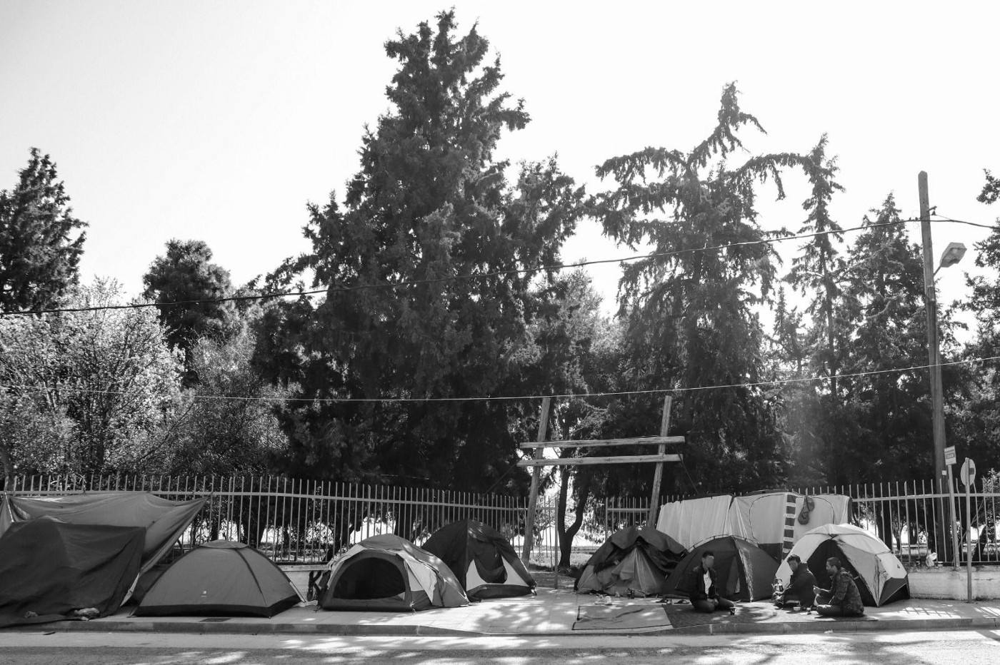
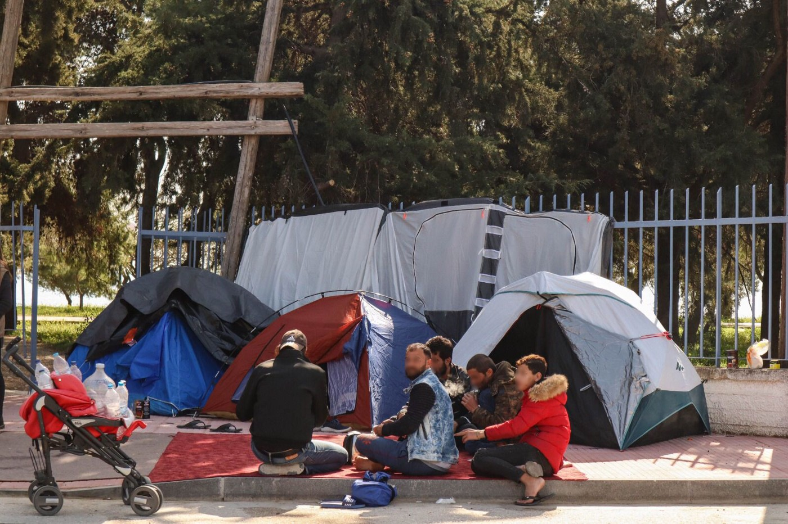
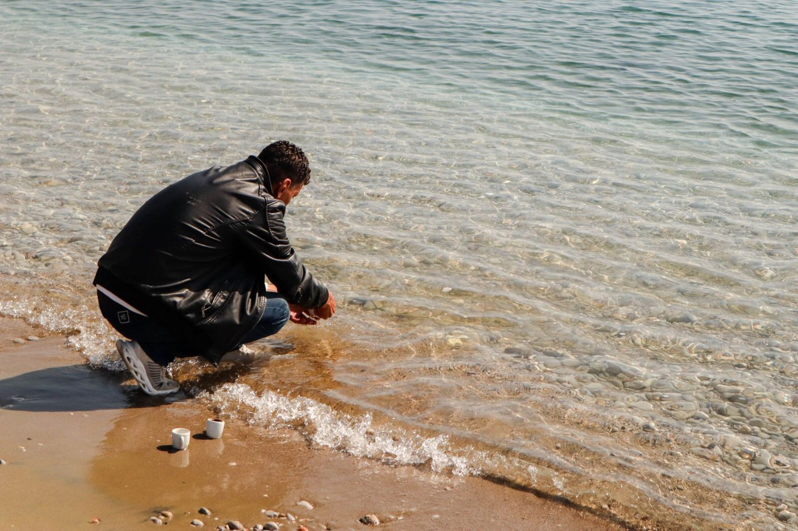
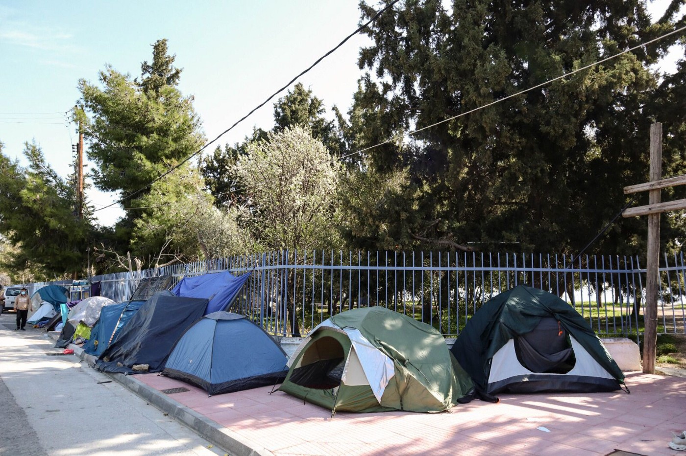

### AYS Special from Greece: Recognised refugees sleeping on the street as EU scheme scrapped

> [Vasilika Moon](https://www.facebook.com/lalunadivasilika/) is an organisation working in Corinth, they have been supporting people recently evicted from hotels, due to the end of EU\-funded Filoxenia project\. This is their account of the last weeks of evictions and lack of alternatives\. 

\(Photo Credit: Chiara Destefanis\)

It was the 14th of February when we first heard about Hotel Iliochari\. There were videos circulating on social media: rainy Sunday, more than 200 adults and children outdoors, after being evicted from the temporary accommodation where most had been for the past three years\. Risking homelessness, they were trying to make themselves heard\.

Being an NGO working in Corinth, we could reach Hotel Iliochari, in Agioi Theodoroi, within 20 minutes by car\. As we arrived there, we tried to understand the situation and their most urgent needs: medical assistance and food, since supplies had stopped a while ago\.

> However, they made their point clear that their first and most important request was the documents they had been promised\. 

Aiming to “alleviate the suffering of vulnerable migrants and refugees residing under lamentable conditions” in the Greek islands, [IOM Greece](https://medium.com/u/44b06ca12ae1) [announced](https://www.iom.int/news/iom-provides-urgent-accommodation-over-2500-vulnerable-migrants-refugees-transferred-greek) the Filoxenia program back in October of 2018\. According to the UN’s International Organisation for Migration, about six thousand people were moved to the mainland, to hotels leased by the Greek government\. Iliochari was one of the 79 hotels across the country under this agreement\.

\(Photo Credit: Chiara Destefanis\)

This January, the Greek government announced the termination of the EU\-funded program, closing temporary shelters before many have found new homes\. The declared solution was that people granted asylum would finally get their passports\. As this promise didn’t materialise, the option provided by IOM was readmitting people to camps, as had happened with hotels that had closed previously\.

> Most of the people in Iliochari have already been granted international protection, being entitled to receive their documents\. The vast majority are large families\. In several cases, all the members received their documents, except for one, meaning that the whole family remains stuck\. 

Housed in Iliochari since 2017, they haven’t benefited from any kind of integration strategy\. The children were not admitted in Greek schools despite their parents’ efforts\. Unable to find jobs and lacking the means to become self\-reliant, recognised refugees refuse to move back to camps, as it would only perpetuate their waiting time\. “Our claim is not impossible\. We just want to schedule an appointment with the Asylum Services to receive our papers\. Then, we can travel to other countries and find a job”, said Tahhan, one of the asylum seekers in Iliochari\.

Within the first week of March, most families that had been in Agioi Theodoroi received their documents and took their paths\. However, there are still around 70 people waiting, half of them children\. Even after a police eviction, the owner of the hotel continued to open the doors to them at night, so that they could sleep indoors\. For several days, they were warned that the electricity and water supply would be cut off, otherwise the owner risked falling into debt\. It happened this week:

> “We have only the air, they didn’t cut off the air\. We can only breathe, without food or water”, he told us\. 

\(Photo Credit: Chiara Destefanis\)

The situation in Agioi Theodoroi is a mirror of what is happening in other Filoxenia accommodation structures across the country\. In Sparta, 70 people were moved to a stadium for several days, after being evicted\. Whereas some refugees received their passports and left, others were transferred to Skaramagas, one of the largest camps in mainland Greece, near Athens\.

In Hotel Stefania, one hour north of Athens, around 70 displaced migrants who can’t afford a place to sleep are staying on the street\. In collaboration with other organisations, we moved the most vulnerable people into another hotel in Athens — including, for example, a woman in the last term of her pregnancy\.

In Stefania, the police evictions turned ugly\. According to one of the asylum seekers, the police officers entered the rooms at 7am and started to evict the people while they were still asleep\. Around 10am, men were separated from their families and taken to the police station without further explanation\. There, they were asked several questions, such as “Did you know you had to get out?” or “How much money are you receiving \[under the Filoxenia program\]?”\. New fingerprints were collected, too\. They had one cell phone that they used to communicate with their relatives in the hotel where the evictions were still taking place\. Their families were threatened that if they didn’t get out of the hotel, the men held in the police station wouldn’t be allowed back\. They were eventually released from the police station around 4pm to find their families outdoors with their belongings\.

> “What happened reminded me of my country, Syria\. When the Assad regime made arrests, they would come when people were asleep\. And they would cut off the cell phones, women and children crying\. And we couldn’t resist”, said Hasan\. “When I entered this country, I was hopeful that everything would be good, after escaping from war\. But I was surprised, worried and scared, specially when my wife and children were crying\. I thought: «Is it possible that this is happening to me in an European country, that I expected to be a safe haven for me and my family?»”, he added\. 

Outside of the Hotel Iliochari, people have started to count the nights, rather than the days\. “It’s five nights that most of us are sleeping outside, without any result or effect”, Tahhan recalled\. Trying to find a way out of this situation, they met several times with the mayor and tried to contact IOM, unsuccessfully\. “We respect everyone, but this last decision from the Ministry of Migration is harming us\. Our lives are in danger and we can’t be patient anymore”, he added\.

\(Photo Credit: Chiara Destefanis\)

For the last month we have been going to Hotel Iliochari almost every day\. We try to understand their needs and answer them in the ways we can — be it for health care, food and water, hygiene kits and, most recently, tents, blankets or camping stoves\. There is little or nothing we can do to help them regarding legal issues, documents and paperwork, as well as a long\-term accommodation solution\. Perhaps, the most valuable support is to be there, to listen to their worries and distress and to try to move the public opinion\.

It’s almost one month that we have been witnessing the worsening of this situation\. Established as a “Temporary Shelter and Protection for the Most Vulnerable Migrants in Greece”, the Filoxenia program always had a scheduled finish\. Yet, it’s inconceivable that there was no plan B for these people that had already been granted protection\. In these accommodation centres, they were out of sight and conveniently out of mind\.

> They are now on the street, but they aren’t asking for much: only the documents they have the right to receive, to put down roots somewhere else other than these sidewalks\. 

**Article by Beatriz Jorge, [Vasilika Moon](https://www.facebook.com/lalunadivasilika/)**

**Find daily updates and special reports on our [Medium page](https://medium.com/are-you-syrious) \.**

**If you wish to contribute, either by writing a report or a story, or by joining the info gathering team, please let us know\.**

**We strive to echo correct news from the ground through collaboration and fairness\. Every effort has been made to credit organisations and individuals with regard to the supply of information, video, and photo material \(in cases where the source wanted to be accredited\) \. Please notify us regarding corrections\.**

**If there’s anything you want to share or comment, contact us through Facebook, Twitter or write to: areyousyrious@gmail\.com**

_Converted [Medium Post](https://medium.com/are-you-syrious/ays-special-from-greece-recognised-refugees-sleeping-on-the-street-as-eu-scheme-scrapped-cfd8c54e5c6f) by [ZMediumToMarkdown](https://github.com/ZhgChgLi/ZMediumToMarkdown)._
