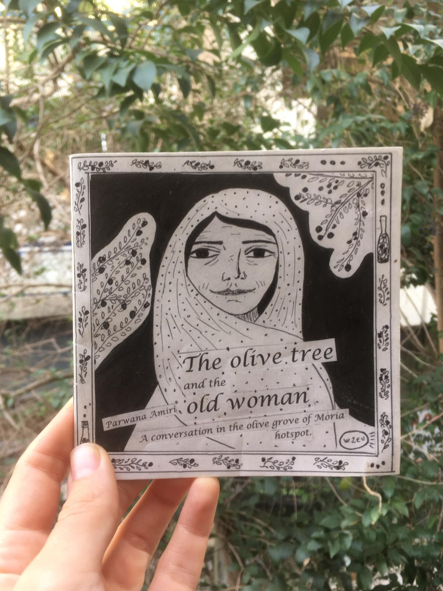
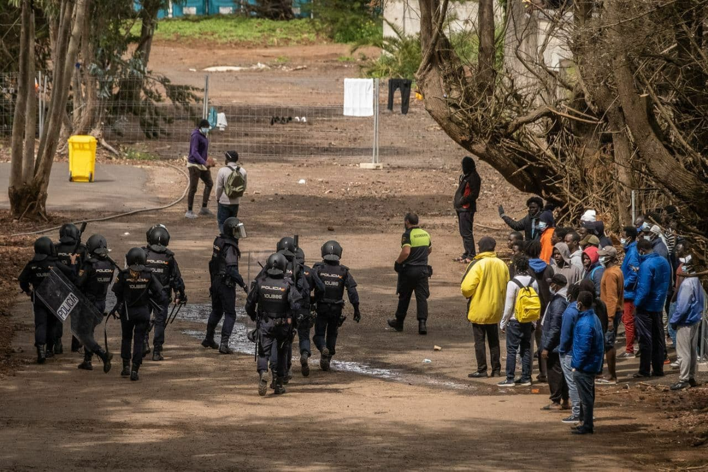
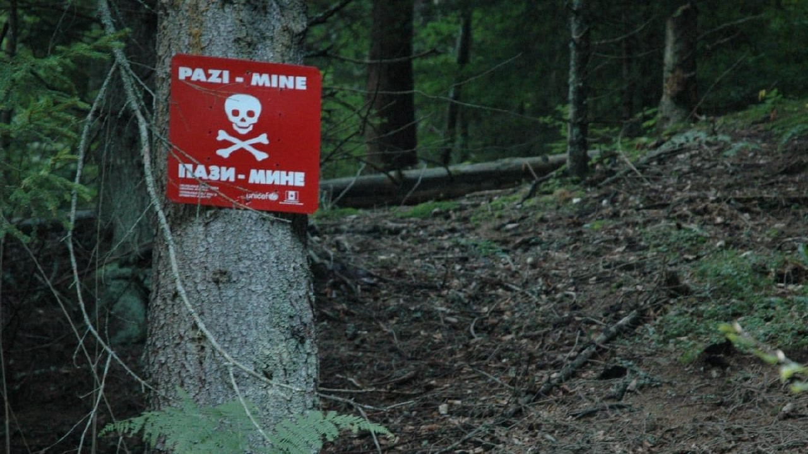
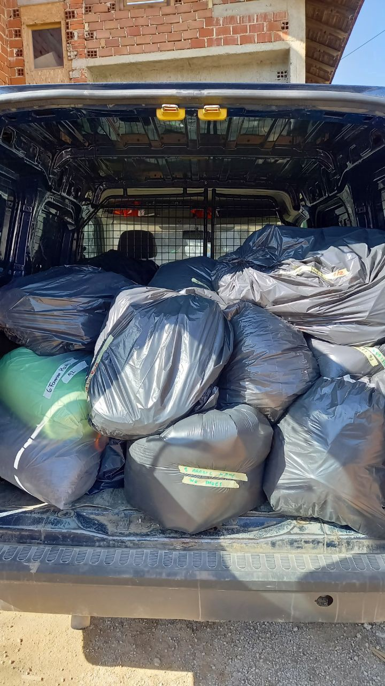
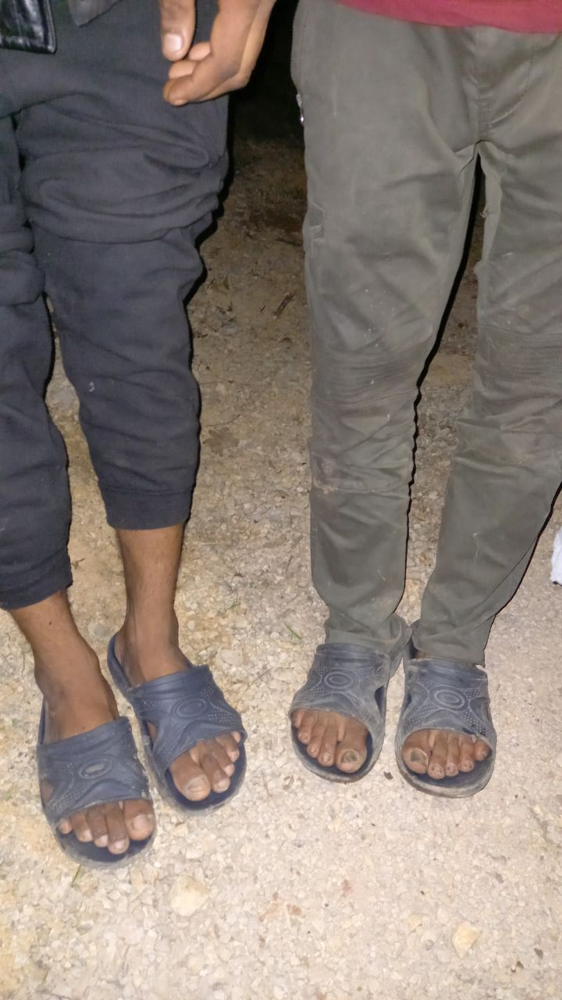

### AYS Weekend Digest 13–14\.03\.21: Protests and repression in Canary Islands’ camp

_Open Arms back at sea // Protests across Greece // Lockdown on Lesvos // More deaths at Melilla Border // People seeking asylum in UK relying on Foodbanks to survive // A new EU\-Turkey Deal? // Updates from Bosnia, France, Germany and more…_

\(Photo Credit: [Echo Refugee Library](https://web.facebook.com/refugeelibrary/posts/3841318652619766) \)
### FEATURED — Protests and repression in reception centre in Tenerife, Canary Islands

On Friday, a protest [started](https://www.facebook.com/AsambleaDeApoyoMigrantesTenerife/posts/130620372399469) at the reception camp in Las Raíces, Tenerife\. Residents are protesting against the inhumane conditions and the bad quality of food, which has reportedly recently caused 15 cases of food poisoning\.

Residents of the camps and the [Asamblea de Apoyo a Migrantes de Tenerife \( _Migrants Support Assembly of Tenerife_ \)](https://twitter.com/AsambleaMigraTF) have been denouncing for weeks the long lines at food distribution, the insufficient number of portions, child\-size portions, bugs in the food and rotten and stinking food in the camp\.

“This is the food given to the people of Las Raices refugee camp, Tenerife, by Accem NGO that states it “strives to improve the living conditions of refugees and migrants” \(Photo and text via [Asamblea de Apoyo a Migrantes de Tenerife](https://twitter.com/AsambleaMigraTF/status/1370497156818345992) \)

100 residents [started a hunger strike](https://www.facebook.com/AsambleaDeApoyoMigrantesTenerife/posts/128677789260394) on February 27 and they were joined by more residents last Friday\. The hunger strike clearly revealed the lack of medical personnel in the camp\. Las Raíces is the largest camp on the islands, hosting around than 1,500 people, and it is managed by the NGO Accem, which has contracted the catering company Serunion to provide food\.

> _A doctor and four nurses tomorrow, a nurse and an afternoon attendant and no one at night\. Anxiety, panic, diseases and infections grow and overflow in tents due to ACCEM’s negligence that refuses to take responsibility for it\._ 

Over the weekend the protest carried on and private security guards have been recorded beating people demanding better conditions:

Camp management requested the [intervention](https://diariodeavisos.elespanol.com/2021/03/varios-migrantes-detenidos-tras-una-protesta-por-la-comida-en-las-raices/) of local and riot police on Sunday to break up the protest\.

> _The agents entered the building and arrested at least six migrants involved in the protest — one more person was arrested in the camp in recent weeks — as a result of the migrants having denounced the long queues for food distribution, the scarcity and low quality of food\._ 

\(Photo via [Asamblea de Apoyo a Migrantes de Tenerife](https://twitter.com/AsambleaMigraTF/status/1370823867682406403) \)

Arrests and police intervention are the only EU\-wide response to legitimate protests demanding basic rights such as access to healthcare, human living conditions and decent and healthy food\.

We [join the call](https://diariodeavisos.elespanol.com/2021/03/gorgojos-en-la-comida-y-olor-a-rancio-denuncian-la-lamentable-gestion-del-campamento-de-las-raices/) of the Migrants Support Assembly of Tenerife, demanding the immediate closure of these camps for the violation of human rights;

> _in view of the intention of the institutions to continue with this human barbarism, we demand the **cessation of the arrival of more people to Las Raíces camp** , which is badly run by the overwhelmed managing NGO and whose structures are not in condition to house those who are already in the camp, and much less to continue receiving more people\._ 

SEA

GREECE

As we have been reporting over the past weeks, a violent wave of police brutality and illiberal policies has hit the country\. On Sunday, Dimitris Koufoundinas [ended](https://enoughisenough14.org/2021/03/14/statement-by-dimitris-koufontinas-i-am-with-you-with-my-heart-and-mind-among-you-dimitris-koufontinas-stopped-his-hunger-strike-today/) his hunger strike after 65 days, despite the fact that his lawful demands were not met\. Over the weekend, thousands of people took the streets in many cities and neighbourhoods against the military response to the pandemic taken by the government of Kiriakos Mitsotaks\.
### Tougher lockdown in Lesvos

As COVID\-19 keeps spreading throughout Greece, Lesvos has also been placed under a “high risk” regime\.

As media report, the measures that took effect on Saturday on the island are as follows:
- Traffic ban from 7pm until 5am;
- Primary and Secondary schools are closed\. Lessons will be carried out through e\-learning\.
- The operation of retail, hairdressers and personal hygiene services is suspended\.
- Religious services are to be performed exclusively by religious ministers and the necessary support staff without the presence of other natural persons, with the exception of funerals, where the presence of up to nine people is allowed\. At the same time, weddings are allowed in the presence of up to nine people, including the religious or political official as well as the necessary support staff\.

For the Moria 2\.0 camp, which exists in a [condition of hard\-lockdown](https://twitter.com/f_grillmeier/status/1371380855164264450) , the situation is no different than in the previous weeks\. On Sundays the camp is closed because it is holiday, so no one is allowed outside\. This Monday, March 15, is a holiday in Greece, and the camp will be closed too\. On the weekdays, entry and exit from the camp is limited to a few hours per day\.

Over the weekend, Moria Corona Awareness Team have been [distributing](https://www.facebook.com/MoriaCoronaAwarenessTeam/posts/266964191599425) masks and other much needed items in the camp\.
### Fascist groups at protest against expansion of hotspot in Fylakio, on the Evros border

On Friday, a protest against the expansion of the hotspot KYT in Fylakio near the Evros border, was joined by explicitly fascist and neo\-Nazi groups, such as Ιερός Λόχος 2012 \(Ieros Lochos, Sacred Band 2012\) \. This [group](https://www.efsyn.gr/ellada/koinonia/188140_etoimazoyn-tin-proti-giorti-misoys) was very active in the protests against the Prespe agreement between Greece and North Macedonia and has tried to stop Pride marches in the past, and has never hidden their preference for the military Junta\. They joined the protest with openly racist — and quite lunatic — flyers in which, as Lena K\. point out:
- those who ask for open borders, are against the fence, and for ‘papers’ for all are ‘state\-fed NGOs’ and ‘anti\-Greek’ \(anthellines\)
- ‘illegal immigrants’ are ‘islamists in their majority’
- ‘they get generous benefits’
- they ‘threaten our country with colonisation’
- ‘no to the racism against Greeks’
- ‘if there’s a war our soldiers at the borders won’t know who to aim their weapons to, to the external enemy or the city\-camps of illegal immigrants who flooded our islands’
- ‘the 5th column of anarchists burns our cities, defiling our churches, break crosses and holy icons’

Also, the group Ελληνες για την πατρίδα \(Greeks for the fatherland\), founded last year by the former second in command of the disbanded neo\-Nazi party Golden Dawn, Ilias Kasidiaris, [was present](https://twitter.com/VassilisTsarnas/status/1370711194638618624) \.

The protest was joined by local authorities, municipality and local unions and no organisation condemned the fascists’ participation\.

SPAIN
### More death at Melilla’s border

Solidary Wheels have published a report covering the last week at the north African Spanish enclave used as an external border to the EU:

> _Last week, we were once again witnesses to one of the most deadly borders in Europe\. In less than thirty hours, three bodies were found on the beaches of the Autonomous City of Melilla\. This same day, a fourth person died soon after they were rescued from the water near to the southern seawall\. This person was attempting to reach Melilla by swimming from the neighbouring Moroccan city Beni\-Enzar\. Two other people managed to reach the shore, in a serious state of hypothermia\. Just two days ago, we heard the news of another body found in the same area of public beach\. Five people have died in one week\._ 

Furthermore, they [report](https://www.facebook.com/solidarywheels/posts/3725311514191334) that three people on the move have suffered assaults by three distinct security forces over the past 9 days, all in Melilla\.

BOSNIA

**Updates from Velika Kladuša and Bihac**

\(Photo Credit: [No Name Kitchen](https://web.facebook.com/NoNameKitchenBelgrade/posts/1198004887264460) \)

No Name Kitchen have [published an update](https://web.facebook.com/NoNameKitchenBelgrade/posts/1198004887264460) as to the situation in Velika Kladuša:

> _Bosnian authorities have taken over a hundred people, about half of them children, against their will to the family camp\. This camp is too far away from the border\. In addition, conditions are often inadequate and Corona poses another problem\. For example people are forced to do quarantine in isolation when they leave this camp and come back\. And let’s remember that being in a camp does not also give the chance to apply for asylum in any EU country or to reach the possibility to live a normal life\._ 

Meanwhile in Bihac people don’t even have access to drinking water:

GERMANY
### Deportation Alarm 15–17 March

No Border Assembly received information about [three planned deportations for this week](https://noborderassembly.blackblogs.org/deportation-alarm/) :

> **_\! \! Charter deportation to Guinea on 15 or 16\.3\.2021 from Berlin \! \!_** 

> **_\! \! Charter deportation to Nigeria on 16\.3\.2021 from Frankfurt \! \!_** 

> **_\! \! Charter deportation to Pakistan on 17\.3\.2021 from Leipzig\-Halle \! \!_** 

Find more info on what to do if you fear you may be deported: [Urdu\-اردو](https://noborderassembly.blackblogs.org/wp-content/uploads/sites/1214/2020/07/final_urd-Resistance-against-Deportation-LEAFLET.pdf) , [Tigrinya\-ትግርኛ](https://noborderassembly.blackblogs.org/wp-content/uploads/sites/1214/2020/07/final_tigr-Resistance-against-Deportation-LEAFLET2.pdf) , [Serbian\-Српски](https://noborderassembly.blackblogs.org/wp-content/uploads/sites/1214/2020/07/final_serb-Resistance-against-Deportation-LEAFLET.pdf) , [Pashto\-پښتو](https://noborderassembly.blackblogs.org/wp-content/uploads/sites/1214/2020/07/final_pash-Resistance-against-Deportation-LEAFLET.pdf) , [Russian\-русский](https://noborderassembly.blackblogs.org/wp-content/uploads/sites/1214/2020/07/final_rus-Resistance-against-Deportation-LEAFLET.pdf) , [Farsi\-فارسی](https://noborderassembly.blackblogs.org/wp-content/uploads/sites/1214/2020/07/final_far-Resistance-against-Deportation-LEAFLET.pdf) , [French\-Français](https://noborderassembly.blackblogs.org/wp-content/uploads/sites/1214/2020/07/final_fra-Resistance-against-Deportation-LEAFLET.pdf) , [English](https://noborderassembly.blackblogs.org/wp-content/uploads/sites/1214/2020/07/final_eng-Resistance-against-Deportation-LEAFLET.pdf) , [Arabic\-عربى](https://noborderassembly.blackblogs.org/wp-content/uploads/sites/1214/2020/07/final_ar-Resistance-against-Deportation-LEAFLET.pdf) , [German\-Deutsch](https://noborderassembly.blackblogs.org/wp-content/uploads/sites/1214/2020/07/final_de-Widerstand-gegen-Abschiebungen-LEAFLET.pdf) \.

FRANCE
### Paris: Call for volunteers Tuesday 16th and Thursday 18th March

[Solidarité migrants Wilson](https://www.facebook.com/Solidarit%C3%A9-migrants-Wilson-598228360377940/?__cft__[0]=AZUAYhPawmCKSNlwbITYJ2O5EeAduKgBLdmAAnLTKG6ab2QRacvtUFP6KKasJCkzY3YD7yRN6Yood3pBqL69Jp5y1uXAdzRXn067Ht-TDlNjlg2Hl2ZqcVx6BYPaGN8-XGiZrhgM8HX9cdDPwLOsbGs6tJAKCDVILZGtLIrBBeDAnNe3k2tgqX6L0xaCxaDRDDn3vhL980SooBzkL_36iZKw&__tn__=-UC%2CP-y-R) is calling for volunteers for collective cooking and distribution of meals\.

Read more here: [Solidarité migrants Wilson](https://www.facebook.com/groups/1652972374920129/)

UK

**Bikes\!**

[Care4Calais](https://web.facebook.com/care4calais/posts/4150919768274282) and [Leeds Bike Mill](https://web.facebook.com/LeedsBikeMill/) have been working together to provide free bikes to people on the move in the UK\. To volunteer with them in the UK email: email annie@care4calais\.org\.

**Petition against No Recourse Restrictions**

**Refugees in Wales relying on Foodbanks**

Even with the £35 that people seeking asylum in the UK receive they still have to rely on foodbanks to have enough to eat as they are not allowed to work\. Another inhumane aspect of hostile environment policy \.In [Newport](https://www.southwalesargus.co.uk/news/19158091.refugees-given-taste-home-thanks-newport-foodbank/?fbclid=IwAR1h8DFvedpKm9yGUQpgGiiD1FbOP0VSxhLwSYyf8xP9VemBlU7n7YG9mj0) foodbanks they are making an effort to include Halal foods donated by local companies\.

EU
### EP Frontex Scrutiny Working Group meeting on Monday, 13h45 CET
### New EU\-Turkey Deal negotiated between Berlin and Ankara?

[According](https://www.handelsblatt.com/politik/international/eu-aussengrenze-deutschland-und-die-tuerkei-verhandeln-neuen-fluechtlingspakt-griechenland-veraergert/27001116.html?fbclid=IwAR34saXNqex_xfZKAeSlEvnkqWxz5144Ld0eQqFhQ1NG3fuSixQ21n7oJNE&ticket=ST-1086772-LQjTaEFLM9zY5Hw3HMnd-ap3) to German Media, a new round of negotiations on the terms of the infamous EU\-Turkey deal signed in 2016 are ongoing between German and Turkish representatives\.

Among the points being discussed are:
- The actual implementation of the agreements on both parts: Turkey laments that the sections relating to new Visa and Customs regulations have never been implemented, while EU countries complain about the lack of cooperation in ‘readmissions’ of rejected asylum seekers in Turkey\.
- Ankara reportedly asks for more control over EU funding\. €6bn of EU money is earmarked for Turkey, and €4\.1bn has already been paid\. “Ankara insists that European aid funds are also used in pacified areas in northern Syria … However, Berlin does not want to use EU funds for projects in Syria\.”

> _So far, the EU has insisted that international organizations based in the EU distribute the funds for specific projects to local partners\. [This regulation has long since been softened](https://www.handelsblatt.com/politik/international/migration-mehr-geld-weniger-kontrolle-tuerkei-setzt-sich-beim-zweiten-teil-des-fluechtlingsdeals-durch/25247800.html) : The Federal Foreign Office confirmed in autumn 2019 that Ankara has long had more participation in the use of the funds\._ 

Greece has reportedly been left out of these negotiations, and Athens is looking at the direct involvement of German authorities with mixed feelings\.

Read More [HERE](https://www.handelsblatt.com/politik/international/eu-aussengrenze-deutschland-und-die-tuerkei-verhandeln-neuen-fluechtlingspakt-griechenland-veraergert/27001116.html?fbclid=IwAR34saXNqex_xfZKAeSlEvnkqWxz5144Ld0eQqFhQ1NG3fuSixQ21n7oJNE&ticket=ST-1086772-LQjTaEFLM9zY5Hw3HMnd-ap3) \.
### EMSA expands its role as maritime surveillance ‘drone’ agency

Matthias Monroy [reports](https://digit.site36.net/2021/03/13/eu-drones-permanent-permit-for-maritime-surveillance/?fbclid=IwAR2Q_vvtY79m1J-q5kPy7ey8mHrVC8MtNLKAIkmopR9TkOk0XclBc3tE6FQ) that the European Maritime Safety Agency \(EMSA\) has presented its plans for unmanned flights over European seas this year\. According to the report, 14 European governments want to use EMSA drones for coastguard tasks, tracking pollution or inspecting port facilities\.

> _Whether these flights can be carried out is still unclear [due to a lack of capacity](https://www.europarl.europa.eu/doceo/document/E-9-2021-000042-ASW_EN.html) \. EMSA is therefore continuing to expand its drone fleet\. Recently, the agency published [another EU tender](https://ted.europa.eu/udl?uri=TED:NOTICE:639133-2020:TEXT:EN:HTML&tabId=1) for 20 million euros for this purpose\. In total, EMSA has spent over 200 million euros on flights with unmanned aerial vehicles since 2017\._ 

While Frontex is in the process of acquiring new drones, EMSA has become the EU’s drone agency\.

Also worrying is the new EU Drone Regulation 2020, which allows companies to obtain a certificate exempting them from applying to national authorities for daily operations\. The first of these [Light UAS Operator Certificates](https://www.austrocontrol.at/unternehmen/medien/presse__news/detail/austro_control_erstes_europaeisches_luc-zertifikat_an_schiebel) \(LUC\) was given to the Austrian company Schiebel GmbH\.

> _The certificate is valid for the unmanned helicopter CAMCOPTER S\-100 and was issued by Austro Control\. It regulates unmanned aviation in civil airspace\. As part of the LUC, the application possibilities \[of the drone\] are being expanded to include Europe\-wide, civil flight services\. \[ [Austro Control](https://www.austrocontrol.at/unternehmen/medien/presse__news/detail/austro_control_erstes_europaeisches_luc-zertifikat_an_schiebel) \]_ 

Read more [HERE](https://digit.site36.net/2021/03/13/eu-drones-permanent-permit-for-maritime-surveillance/?fbclid=IwAR2Q_vvtY79m1J-q5kPy7ey8mHrVC8MtNLKAIkmopR9TkOk0XclBc3tE6FQ) \.

WORTH WATCHING

The refugee crisis in Lesvos — Seminar hosted by Stand By Me Lesvos, Moria Academia and Σ\.Δ\.Ε\. ΜΥΤΙΛΗΝΗΣ\.

[**Searching for Peace: The Stories Behind Refugee Musicians**](https://web.facebook.com/RadMusicIntenational/videos/289969682483001) — a recording of this weekends online event including music and conversation about the importance of music for refugees\. The talented musicians: Elena Yaqubee \(@elenna\_yaqubee\), Rouddy Kimpioka \(@rouddykimpioka\), Kokowumba Binzunga \(@benzbenzoul\) \. With Franziska Grillmeier and Mortaza Behboudi \(journalists\) accompanying the session in French and in English\.

WORTH LISTENING TO
- [**Can Greek cities integrate refugees amidst multiple crises‪?**](https://blubrry.com/cities_of_refuge/74878342/8-can-greek-cities-integrate-refugees-amidst-multiple-crises/) **‬** A discussion on the extent and reasons for municipal activism in Greece, as well as its limits and potentials\. It tackles central questions such as the legal constraints confronting progressive localities, the complex political environment in Greece, the leading role of larger cities and mayors, and the importance of creating durable policy solutions in a crisis\-worn context\. With Tihomir Sabchev and Lefteris Papagiannakis \(Solidarity Now\)
- [**This edition of the MoriaCast**](https://www.podbean.com/media/share/pb-8h9s4-fd8d73) : “The campstrike in Ritsona is still ongoing\. The residents protest because different nationalities are prioritized and their application is processed quicker than others\. The protesters demand equality in the process\. Parwana Amiri is one of the organizers of the protests and talks to us about the current situation\.”

WORTH READING
- [**The EU’s externalisation policy in the field of migration and asylum: Turkey as a case study** \.](https://respondmigration.com/wp-blog/eu-externalisation-policy-migration-asylum-turkey-case-study?fbclid=IwAR3joqAsT99mwkvcsG2j7EmPFBCkMjwJNnOjxS2q5co6_ULRJBqAxgYvU30)
- [**Parwana Amiri’s short poetic novella**](https://web.facebook.com/refugeelibrary/posts/3841318652619766) “The Olive Tree and the Old Woman” describes the relationship between an olive tree and an old woman who lives in a tent beneath it\. Amiri wrote this short poetic novella whilst living in the Olive Grove of Moria camp on Lesvos\. You can read the full book in the ECHO Mobile Library, or by buying it for 4€ \(email marily@busyshadows\.org\) \. Find out more: [http://lesvos\.w2eu\.net/\. \. \./pixi\-the\-olive\-tree\-and\-the\. \. \./](http://lesvos.w2eu.net/2020/03/22/pixi-the-olive-tree-and-the-old-woman/?fbclid=IwAR0lJU6sq7SoUlGJx2HgaXhkNYq4lbs_t7rZcbLITI2lIyMmV1i2kEZYQmU)
- [**Refugees in the Middle East and North Africa**](https://fm-cab.blogspot.com/2021/03/regional-focus-mena.html?fbclid=IwAR0lGgzJWniJV02duD890eT65HBA353QgUKpMJKXo8DaGJVSfcTmATsOG-k) and [**Europe**](https://fm-cab.blogspot.com/2021/03/regional-focus-europe-pt-1.html?fbclid=IwAR0ploMI1wFbtwh6KyJPVr8Jtte6MpHQvCfCZ3EFJ2aLzXMMQN1KtdkRw4I) \. All the latest publications from the Forced Migration Current Awareness Blog\.

WORTH ATTENDING

[**Online Roundtable: Deadly Borders and Activist Interventions in the European Migration Space**](https://hostileterrain94.klapperfeld.de/en/events/) — Online Roundtable with Natalie Gruber \(Border Violence Monitoring Network\), Charles Heller \(Forensic Oceanography\) & Jacob Berkson \(Alarm Phone\) \. Moderator: Valeria Hänsel \(Border Monitoring Aegean\) — 18th March 7pm CET\.

[**Crossings: Community and Refuge**](https://www.theguardian.com/culture/2021/mar/14/lampedusa-cross-made-from-capsized-refugee-boat-to-tour-england?fbclid=IwAR0rKQJuvFTBdIURpmd7DyhhLpx1GnINlGtCuWgRaXJ7SCLLpQv4YjATbTo) opens at the People’s History Museum in Manchester on 29 May\. It will include a Lampedusa cross made by Francesco Tuccio in the aftermath of a boat tragedy in October 2013 and miniature boats made by Syrian\-born artist, Issam Kourbaj\.

**Find daily updates and special reports on our [Medium page](https://medium.com/are-you-syrious) \.**

**If you wish to contribute, either by writing a report or a story, or by joining the info gathering team, please let us know\.**

**We strive to echo correct news from the ground through collaboration and fairness\. Every effort has been made to credit organisations and individuals with regard to the supply of information, video, and photo material \(in cases where the source wanted to be accredited\) \. Please notify us regarding corrections\.**

**If there’s anything you want to share or comment, contact us through Facebook, Twitter or write to: areyousyrious@gmail\.com**

_Converted [Medium Post](https://medium.com/are-you-syrious/ays-weekend-digest-13-14-03-21-protests-and-repression-in-canary-islands-camp-84f2532513c) by [ZMediumToMarkdown](https://github.com/ZhgChgLi/ZMediumToMarkdown)._
