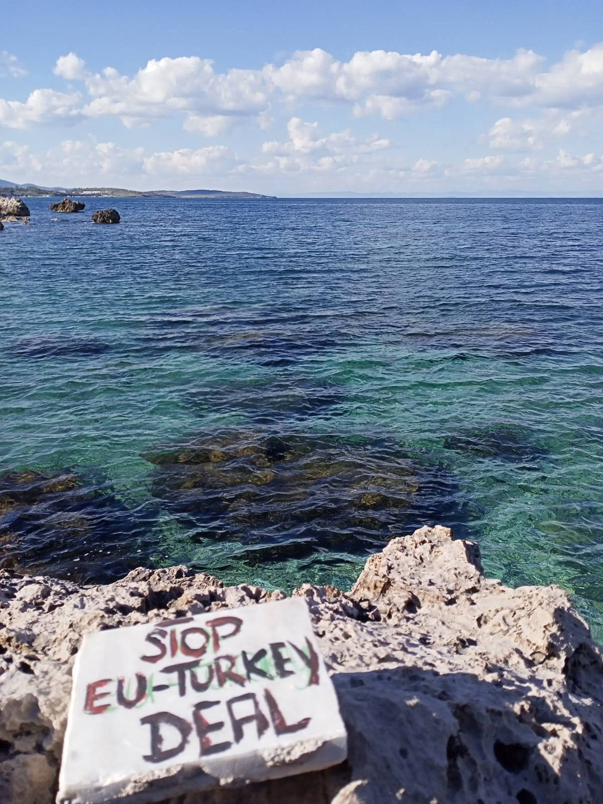

### AYS Daily Digest 18/03/2021: The EU\-Turkey deal, 5 years on

[Are You Syrious?](?source=post_page-----275dc22d914e--------------------------------)

[Mar 19](ays-daily-digest-18-02-2021-5-years-of-eu-turkey-deal-275dc22d914e?source=post_page-----275dc22d914e--------------------------------) · 6 min read

Copyright: NoNameKitchen
### FEATURE — 5 years of the EU\-Turkey deal

On March 18 2021, the EU\-Turkey deal had its disgraceful 5th anniversary\. Various NGOs on the ground, as well as international human rights watchdogs like [Amnesty International](https://www.amnesty.org/en/latest/news/2021/03/eu-anniversary-of-turkey-deal-offers-warning-against-further-dangerous-migration-deals/?fbclid=IwAR0WEj2M24-Dx1tAVuK6NUvcRFiFJmYl00pGg4D0uQkU7lZ3w6HxtGkJiBs) and [Human Rights Watch](https://www.hrw.org/news/2021/03/18/joint-cso-letter-containment-external-borders) , used this day to denounce the EU’s policy towards people on the move\.

Amnesty International is:

_“calling on EU leaders to turn away from the five years of failed policies which have resulted in tens of thousands of people being forced to stay in inhumane conditions on the Greek islands, and put refugees at risk by forcing them to stay in Turkey\.”_

Let’s recap the details of the deal:

_“The idea was that the Greek authorities should examine whether people arriving in Greece irregularly had a right to asylum in the EU\. Those who did not would be returned to Turkey\. In return, the EU would accept the same number of Syrian asylum seekers waiting in Turkish refugee camps and resettle them around the bloc\. The EU also to provide some €6 billion in funds to Turkey to support the almost four million Syrian refugees in Turkey\.”_

[\(InfoMigrants\)](https://www.infomigrants.net/en/post/30934/turkey-migration-deal-a-stain-on-eu-rights-record)

Furthermore, Turkey promised to increase border surveillance and to stop people from crossing over to Greece\. During the initial examination of asylum claims, people are not allowed to leave the Aegean Islands\. This basically turned the islands camps into open air prisons and led to overcrowding, spread of diseases, fire and extreme psychological distress\.

In a [press conference on Wednesday](https://www.bundesregierung.de/breg-de/aktuelles/pressekonferenzen/regierungspressekonferenz-vom-17-maerz-2021-1878286) , German government spokeswoman Demmer stated that five years after the implementation, the EU\-Turkey deal is a common success and in the mutual interest of both the EU and Turkey\. She further called Turkey a very reliable partner\.

Unfortunately she did not mention the pushbacks conducted by Greece in the Aegean Sea and the Evros region that are another direct result of the EU\-Turkey deal\.

On the occasion of the anniversary, the NGO medico international published [the study ‘the Moria\-Komplex’](https://www.medico.de/fileadmin/user_upload/media/studie-der-moria-komplex.pdf) on irresponsibility, unaccountability and the deprivation of rights five years after the EU\-Turkey deal and the implementation of the Hotspot\-System by Maximilian Pichl \(in German\) \.

The researcher Manos Moschopoulos summed up the disastrous effects of the deal in the following thread:
### GREECE
### Father takes action against Greek Coast Guards for delaying rescue operation

The father whose son drowned in November and who has subsequently been subject to investigations by the public prosecutor’s office for endangering his child is about to sue the Greek coast guard for failing to provide assistance\. The six years old boy died when the dinghy he and his father boarded in order to reach Greece and file asylum application capsized\. The son went missing; the father and most of the other people on board managed to climb some rocks\. According to the father and other survivors, two boats appeared that night but did not help the desperate people\. It took hours for help to arrive, although authorities were alerted\. The father was later interrogated, not knowing that his son was already found dead\.
The father and his lawyer now accuse the authorities of deliberately delaying any rescue efforts\. They stated that “We believe that they tried to seal off the area and gather everyone on the coast in order to carry out a pushback from there”\.

Two long reads can be found here:
### [Afghan migrant to sue Greek coast guard over son’s drowning \| DW \| 18\.03\.2021](https://www.dw.com/en/afghan-migrant-to-sue-greek-coast-guard-over-sons-drowning/a-56819773?fbclid=IwAR2KeNadLNBYWOqpeZMKb4gJd8lbMbmt-RGRKV8czqBLOgzQUFJHmi27Ffk)
### [Almost everyone in the rubber dinghy made it to the coast of the island of Samos that night in early November 2020…](https://www.dw.com/en/afghan-migrant-to-sue-greek-coast-guard-over-sons-drowning/a-56819773?fbclid=IwAR2KeNadLNBYWOqpeZMKb4gJd8lbMbmt-RGRKV8czqBLOgzQUFJHmi27Ffk)

[www\.dw\.com](https://www.dw.com/en/afghan-migrant-to-sue-greek-coast-guard-over-sons-drowning/a-56819773?fbclid=IwAR2KeNadLNBYWOqpeZMKb4gJd8lbMbmt-RGRKV8czqBLOgzQUFJHmi27Ffk)
### [‘All my hopes were him’: A migrant father’s plight in Greece](https://apnews.com/article/turkey-coronavirus-pandemic-migration-only-on-ap-greece-75f06c4a3c80f2fc1c64810083d6c0da?fbclid=IwAR1BMzgV0XpqP8Etr9ag0xfs-1QqoKfB5uWgEv1tzAVZrGbmU0ElJOgpMUo)
### [VATHY, Greece \(AP\) — On a pine\-covered hill above the sparkling blue Aegean lies a boy’s grave, a teddy bear leaning…](https://apnews.com/article/turkey-coronavirus-pandemic-migration-only-on-ap-greece-75f06c4a3c80f2fc1c64810083d6c0da?fbclid=IwAR1BMzgV0XpqP8Etr9ag0xfs-1QqoKfB5uWgEv1tzAVZrGbmU0ElJOgpMUo)

[apnews\.com](https://apnews.com/article/turkey-coronavirus-pandemic-migration-only-on-ap-greece-75f06c4a3c80f2fc1c64810083d6c0da?fbclid=IwAR1BMzgV0XpqP8Etr9ag0xfs-1QqoKfB5uWgEv1tzAVZrGbmU0ElJOgpMUo)
### Pushbacks no longer denied but bragged with?

The mayor of eastern Samos declared the guarding of the borders a good thing\. To put this in perspective: There is no such a thing as a legal border guarding against refugees\. Guarding borders against refugees means to push people back without considering their asylum application\. This is no guarding but a violation of European law\.
### ITALY
### Updates from Ventimiglia

Kesha Niya, a group active in the Ventimiglia area in Italy, published an update of the situation along the border between Italy and France\. According to them, the number of people who try to cross from Italy to France mostly by train declined\. That might be due to the fact that Italian and French police have set up a new joint operation in which they conduct controls at the Ventimiglia train station, checking people for valid travel documents\. People who are apprehended on the trains are still brought to containers and kept there for the whole night\.

> _“They report that inside the containers are no sleeping possibilities and that the police refuses to hand out blankets, tea, water or food\.”_ 

According to Kesha Niya, at least 63 minors have been pushed back since the second week of February\. Women and accompanied children have also been pushed back\.

Visit [Kesha Niya on Facebook](https://www.facebook.com/KeshaNiyaProject/) for the full report\.
### CYPRUS
### Commissioner for Human Rights calls on Cyprus to uphold human rights

The [Commissioner for Human Rights Dunja Mijatović urges the Cypriot authorities](https://www.coe.int/en/web/commissioner/-/cypriot-authorities-should-investigate-allegations-of-pushbacks-and-ill-treatment-of-migrants-improve-reception-conditions-and-ensure-an-enabling-envi?fbclid=IwAR17RdzjMQtQ7YjtlOI0_Z0LCp0pPD8LuOznorQbVLSveXQjnVD9mRuGgXs) to ensure that independent and effective investigations are carried out into allegations of pushbacks and ill\-treatment of arriving people on the move\.

Arrival numbers have gone up in Cyprus in recent years\.

[According to the Guardian](https://www.theguardian.com/world/2021/mar/18/watchdog-criticises-cyprus-treatment-asylum-seekers?fbclid=IwAR3mylVwDSe4Fh6J77UzM1RMcpe6oDArh1TkUk-Y1UXKGxrb0aDtjqI3DGM) , “More than 1,500 people are held in a former military installation on the outskirts of Nicosia, the island’s capital, although it is designed to accommodate no more than 1,000\. The camp, described as dirty and insect\-infested by Human Rights Watch, was initially meant to be a reception centre of “first instance” with asylum seekers leaving after three days, but almost all have spent months there because of the inability of officials to clear a backlog in claims\.”
### SEA
### Ocean Viking performs rescue
### Boat caught fire, presumably several people went missing

AlarmPhone continues: “According to relatives, the boat was found & the survivors returned to Libya\. Unfortunately, we fear that several people have died or went missing\. We are trying to obtain more information\. We stand in solidarity with the friends & relatives of the missing\.”
### DENMARK
### Denmark continues its racist migration policy

Denmark has drawn attention to its racist migration policy many times within the last years, and the Social Democratic Prime Minister Mette Frederiksen who is in power since summer 2019 continued down that path\.
[The newest step is a bill proposed by interior minister Kaare Dybvad Bek\.](https://www.theguardian.com/world/2021/mar/17/denmark-plans-to-limit-non-western-residents-in-disadvantaged-areas?fbclid=IwAR3IfvTuAz4oNgmmRh406aRy6M-DWooEEUrPM8ToBqWO75cRjTr5UZGWIg0) The bill is a review of existing legislation on combatting “parallel societies”\. It proposes that the number of “non\-western” people living in a neighbourhood should be reduced to 30% within 10 years\.
[Non\-Western thereby is defined](https://www.dst.dk/en/Statistik/dokumentation/documentationofstatistics/immigrants-and-descendants/statistical-presentation) as every country except for all 28 EU countries and Andorra, Iceland, Liechtenstein, Monaco, Norway, San Marino, Switzerland, Vatican State, Canada, USA, Australia and New Zealand\. This list makes it quite obvious what is actually meant when referring to “western”: it means countries with a white majority\. The proposed bill deeply reflects a racist mentality\.

The law further proposes to abolish the term “ghetto” that has been used to label neighbourhoods that fall under a category mostly defined by poverty and higher number of migration and allowed for discriminatory governing\.
At the beginning of March, Denmark declared Damascus and the surrounding area as safe and stripped 94 Syrian refugees off their residence permits\. In January, [Prime Minister Frederiksen stated that her vision for a Danish asylum system is zero asylum seekers](https://www.infomigrants.net/en/post/29842/denmark-aims-for-zero-asylum-seekers) \.

[Here is a deeply interesting background article](https://www.zetland.dk/historie/sO9kYXZW-meWEkwE2-cec4a?fbclid=IwAR11l9Y0_UPp5kzScWo20ZV86YQBazTTDcjPXJYT45Xnff4bH02l14_Nxok) to some of the changes in Danish politics that has been turning the Social Democrats into a vanguard of xenophobia and populism, adopting the general sentiment in the population, heavily amplified by most mainstream media:
### UK
### Home Secretary Priti Patel repeats plans of off\-shore asylum procedure

In this thread, Refugee Action takes a closer look at this inhumane vision:
### WORTH READING

This long\-read recounts the horror a young South Sudanese man encounters in Libyan prisons and how the EU is complicit in his grim fate\. \(in German\)
### [Gescheiterte Überfahrten und Stille im Ozean: Flucht nach Europa](https://www.profil.at/ausland/gescheiterte-ueberfahrten-und-stille-im-ozean-flucht-nach-europa/401221470?fbclid=IwAR0tgTFNHLNMQ3451ycR30C8xTNHz0WXru6JZCsZ5YkhVz6nhE5T0aNBvzc)
### [von Anna Roxvall und Johan Persson Das Telefon klingelt\. Es ist Sonntag, der 16\. Februar, kurz nach sechs Uhr abends…](https://www.profil.at/ausland/gescheiterte-ueberfahrten-und-stille-im-ozean-flucht-nach-europa/401221470?fbclid=IwAR0tgTFNHLNMQ3451ycR30C8xTNHz0WXru6JZCsZ5YkhVz6nhE5T0aNBvzc)

[www\.profil\.at](https://www.profil.at/ausland/gescheiterte-ueberfahrten-und-stille-im-ozean-flucht-nach-europa/401221470?fbclid=IwAR0tgTFNHLNMQ3451ycR30C8xTNHz0WXru6JZCsZ5YkhVz6nhE5T0aNBvzc)

[This article t](https://migrantwomenpress.com/from-one-hell-to-another-life-of-migrants-in-europe-today/?fbclid=IwAR3lnSODqA7Ht1twfSXAX_Tyki_BumBun6Q_TiO6cssMt1c481lVQ3zcqwo) ells the story of a young Afghan mother who experienced rape, Moria and pushbacks\.

**Find daily updates and special reports on our [Medium page](https://medium.com/are-you-syrious) \.**

**If you wish to contribute, either by writing a report or a story, or by joining the info gathering team, please let us know\.**

**We strive to echo correct news from the ground through collaboration and fairness\. Every effort has been made to credit organisations and individuals with regard to the supply of information, video, and photo material \(in cases where the source wanted to be accredited\) \. Please notify us regarding corrections\.**

**If there’s anything you want to share or comment, contact us through Facebook, Twitter or write to: areyousyrious@gmail\.com**
### [Are You Syrious?](https://medium.com/are-you-syrious?source=post_sidebar--------------------------post_sidebar-----------)

_Converted [Medium Post](https://medium.com/are-you-syrious/ays-daily-digest-18-03-2021-the-eu-turkey-deal-5-years-on-c13a83775a21) by [ZMediumToMarkdown](https://github.com/ZhgChgLi/ZMediumToMarkdown)._
