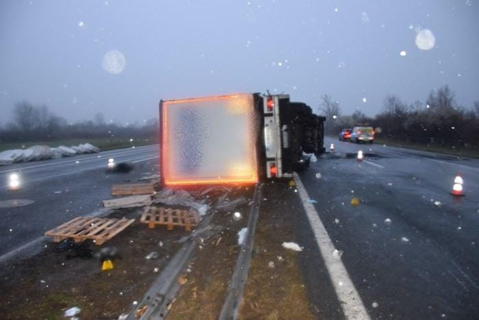
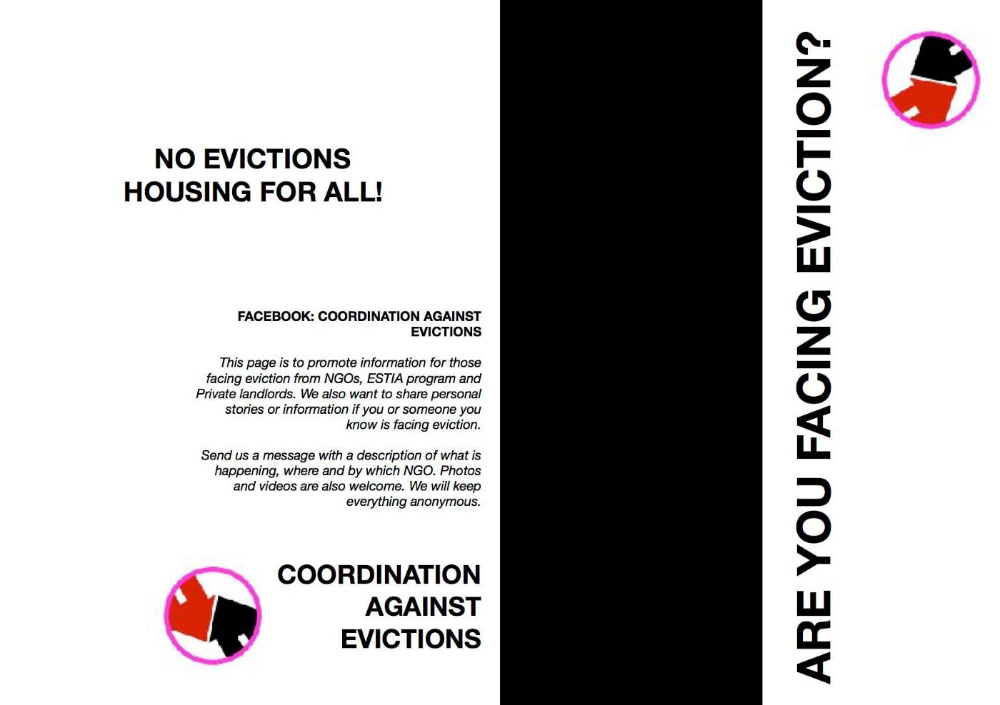
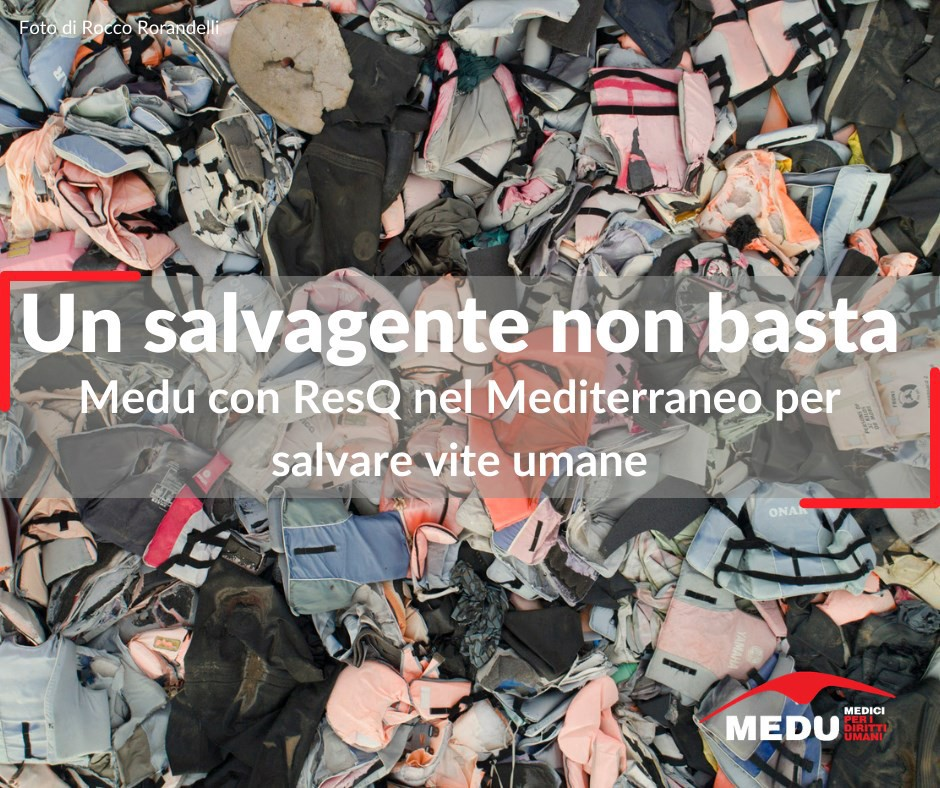
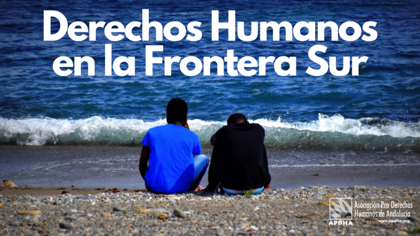

### AYS Daily Digest 22/03/21: Four people die, 19 injured after a lorry tragedy on a highway in Croatia

[Are You Syrious?](?source=post_page-----22ff9070a477--------------------------------)

[Mar 23](ays-daily-digest-22-03-21-4-people-die-19-injured-after-a-lorry-tragedy-on-a-highway-in-croatia-22ff9070a477?source=post_page-----22ff9070a477--------------------------------) · 9 min read

_Updates on fire off Libya’s coast when 60 people died // EU Parliament votes to suspend discharge of Frontex’s budget // new resource for evictions in Greece // and more…_

### FEATURE: Four die in Croatia highway accident

A horrible accident happened on the A3 highway in Croatia, close to Okučani, not far from Nova Gradiška and Slavonski Brod\. This is the highway that leads from the Serbian\-Croatian border, along the entire eastern region of Croatia, passing along the border with the Republic of Srpska \(BiH\), all the way to Zagreb\. A lorry was transporting paper pallets \(each weighing more than a ton\) and in the back of the transport space, 24 people were squeezed in\. At around 3 am the truck overturned on the highway and four people lost their lives immediately, while others suffered injuries\. Among the people in the lorry were children and minors\.

All the people were transferred to the nearest hospitals in Nova Gradiška, Pakrac and Slavonski Brod in order to provide them with immediate medical assistance\. Among the 11 people in Nova Gradiška, three children were injured, one of the boys with a fractured leg\. Some of the people hospitalised had injuries that required immediate surgery: in Gradiška, a leg amputation due to injuries caused by heavy paper rolls falling on the person and two operations in Slavonski Brod\. One injured person was transferred to the Zagreb Clinical hospital centre due to severe internal injuries \(fractured spleen\) \. Some were kept in the hospital for a day, while the others were released from hospital and placed either in a motel near the police station in Slavonski Brod for self\-isolation due to four cases of Covid\-19 infections that were established after testing, or close by in Stara Gradiška, in the case of some of the minors\. 
AYS immediately reacted to the news and contacted the hospitals to find out about the state of the people, how they were communicated to and if they were presented with the option to ask for international protection, and to offer assistance of any kind for the people in question\.

Families and relatives who suspected their family members might have been in the accident contacted us and we are in the process of establishing whether their loved ones are in fact among the 24 people and what condition they are in\. We are in contact with the hospitals and the police stations in charge\. Some of the families have been informed, while we have directed others to inquire with the Brodsko\-Posavska police for details\. We continue following the situation and assisting those affected in any way we can\.

**If you suspect someone you know might have been among the people, contact us and we will help you with further steps\.**

As some [media reported](https://www.rtl.hr/vijesti-hr/novosti/crna-kronika/4002538/poginulo-cetvero-migranata-krijumcarenje-ljudi-medju-kamionskim-teretom-u-4-godine-se-povecalo-za-1000-posto/) after the tragic accident, this is not an isolated event, as the risk of traveling is increasing and there is more and more pressure on people who have to find a way to get to a place where they will be allowed to express the intention to seek asylum\. This is not enabled at the border crossings \(as the officials often say it is\), nor is it often made possible even at the police stations across the country, in the case of Croatia\. Many people have been pushed back, with no documented case file or any “paper trail”, even from hospitals, police stations and other institutions that should be able to provide safety in accordance with national and international law\. Handing people over from an orderly system \(which currently does not exist\) to the criminal networks of smugglers, whilst endangering many lives, seems to suit someone’s agenda more than crime\-free safe routes and options for those seeking international protection\. Following the money, policies and tragedies, a clearer picture emerges of the chaos created at the seemingly impenetrable borders which relegates people in need of protection to crime reports in newspapers after tragedies like these\.
### SEA
### Updates on the fire off the coast of Libya that killed 60 people

On Thursday 18/03/21, a boat engine caught fire and, according to testimony from survivors, 60 people are still missing and presumed dead\. AYS reported in [our Friday digest](ays-daily-digest-19-03-2021-how-many-more-deaths-at-sea-cf36b337525f) that 45 people had been rescued\. [AlarmPhone](https://alarmphone.org/en/2021/03/22/boat-on-fire-off-libya-up-to-60-people-killed/?fbclid=IwAR3aa7NnADAWznIHGTFyk7DTxGVyiixSTiKxh0txSJFtinYJXizbEpVMasw) gave more details in a Monday report with testimonies and a detailed timeline of events\.

AlarmPhone requests “ _authorities to provide a detailed report of the actions they have undertaken to search and rescue the people in distress, to search for the missing and for the bodies of the dead, and to answer any open question around the unfolding of the events during and after the rescue operation conducted by fishermen\._ ”

Here is the first testimony:

> _“We were more than 130 people, most of them young people from Sudan and Senegal, four people from Syria, two from Pakistan and seven Moroccans, and with us about four Egyptians, and we also had children and women\. The wooden boat was large and consisted of two floors and a length of 12 meters\. The smuggler warned us strongly that no one should light a cigarette on a boat\. We went and pushed the boat to the sea\. I was afraid of the strength of the waves, the waves were very high\. I was waiting for my turn to go up on a boat and I was taking time to avoid descending to the lower floor\. But then they told us that the boat was full\. About 35 people could not be embarked\. We were psychologically devastated, disappointed and very desperate\. I returned sadly to the waiting location and we could not sleep all night\. At about ten o’clock in the morning we heard shocking news that part of the boat was burned and many people lost their lives and the rest of the survivors were returned to a port by a fisherman, and now many of them are in a hospital affected by the fire\. The rest of the people came back to our site and said that the total of the survivors were 49 people, and they were more than 110 people on board, which means the missing were more than the survivors\. The number of missing persons is 60 people or more, who went missing because of the fire\. The reason for the disaster is because the captain of the boat used a lighter to see the engine, and the fuel went on fire\. He and everyone sitting next to a captain and a part of them went into the water due to a burning fire and could not return to a boat because they did not have the necessary safety means\. The Libyan fishermen rescued them, but they did not search for the missing people\.”_ 

### GREECE

Check out Oxford Law’s new guest post “ [Weaponising Geography on the Greek\-Turkish Border](https://www.law.ox.ac.uk/research-subject-groups/centre-criminology/centreborder-criminologies/blog/2021/03/weaponising?fbclid=IwAR13QJSuOl-09ctVttGwuF2Dz_jSMOXsxNDj1OYj5g1DSlZ5mWvpzKdAJP4) ” written by Josh Askew, who is currently reporting for Border Violence Monitoring Network \(AYS is a proud member of BVMN\) \.
### ITALY

### SPAIN

### Name correction for two\-year\-old who died after a week in hospital

Media reports, which we included in [AYS’ Weekend Digest](ays-weekend-digest-20-21-3-2021-greece-illegal-pushbacks-lives-at-risk-ngos-prosecuted-1a22c809a351) , said that the two\-year\-old who tragically passed away this weekend was named “Nabody\.” Reports now say that was not her name\. [El Diario](https://www.eldiario.es/canariasahora/migraciones/nina-maliense-murio-gran-canaria-no-nabody_1_7332315.html?fbclid=IwAR02i9Czn2Hc-PLv0Ei_y20AnXg9d3AFo5RuoilJTwpAirkbATREhpITDJw) explains the confusion:

> _“The Malian girl who died this Sunday after arriving in Arguineguín by boat ‘is not Nabody\.’ This has been clarified through his social networks and also in an interview on Cadena SER the pediatrician Abián Montesdeoca\. The health service of the Canary Islands Health Service \(SCS\), which is part of the intervention team that cares for migrant minors upon arrival in Gran Canaria, explained that there is a girl with that name in the island’s Maternal and Child hospital, but It is not the one who died, a fact that has also confirmed to Canarias Now another of the pediatricians who assist migrants on the island\._ 

> _Montesdeoca acknowledges that the confusion comes because between March 17 and 18, ‘many young children who have required admission ‘arrived in Gran Canaria\. At times, they were not accompanied by their mothers, making identification difficult\. For pediatricians it was difficult ‘to create that relationship between parents and children\.’ Despite this, they managed to locate the mother of the Malian girl who died so that she could say goodbye to her\.”_ 

### DENMARK
### Denmark wants to return Syrian refugees

[Danish media](http://refugees.dk/en/news/2021/march/denmark-wants-to-send-back-refugees-to-a-dangerous-syria-in-ruins/?fbclid=IwAR32IIgWaOB9BbeYfg6h7dJynR_HfUHCUq_Xk3hKra1SUbFVry061am-RX4) reports:

> _“In 2020, the Danish Immigration Service began to withdraw the residence permits of selected Syrian refugees\. A total of 4,400 cases were reviewed, and so far, 273 cases have been decided by the Danish Immigration Service, of which 94 have been withdrawn or denied an extension, 146 have been extended and 33 have been given a different and stronger status\._ 

> _Not all cases have reached a decision in the Refugee Appeals Board yet\. But so far, the total number of Syrian cases decided by the board for 2020 and 2021 is 71\. Out of these, 28 were new applicants who had not been granted asylum before, 21 cases have been overturned \(granted asylum\), 30 have been confirmed \(lost or not been granted asylum\) and 10 cases were sent back to Immigration Service again\._ 

> _A new group of 350 people is being reviewed now, namely those who come from the bigger Rif\-region surrounding Damascus\. At the beginning of 2021, three cases from Rif\-Damascus were ratified by Refugee Appeals Board on the remarkable grounds:_ 

> _‘As stated by the Danish Immigration Service, the Refugee Appeals Board agrees that a refusal to extend the complainant’s residence permit will constitute a significant interference with the complainant’s right to family and private life\. The Refugee Appeals Board also agrees with the reasons stated by the Danish Immigration Service in this regard, that the legal basis for the intervention is legitimate and safeguards the public interest in maintaining effective immigration control, and that the intervention has a recognizable purpose\.’_ 

> _Yet, one may wonder how immigration control can be a recognizable purpose when Denmark’s influx of refugees has been extremely low since mid\-2016 and is now the lowest ever in the 30 years in which we have comparable figures\.”_ 

### EU/FRONTEX
### Frontex hides hospitality spending figures AND the EU Parliament votes to suspend discharge of Frontex’s budget

According to [EU Observer](https://euobserver.com/migration/151314?fbclid=IwAR0MkH12swICYtaQ7-UgGpq80Nn5ooTgm8D6tAsahLj0Oz1rdjz-N7_71VI) :

> _“The EU’s border agency Frontex is refusing to release details on how much it spent on dinners at events to celebrate itself\. EUobserver had earlier this year revealed that the Warsaw\-based agency spent €94,000 of European taxpayers’ money at a restaurant in 2015…_ 

> **_Freedom of information requests were responded to with eight almost entirely blacked\-out documents\._** _One five\-page document, entitled “summary of costs”, revealed only the words “Sheraton Sopot Hotel” as well as the May dates in 2018…In a letter, Frontex explained that there “is no overriding public” interest to reveal the numbers\. The agency has since stopped holding these annual events\. But it still claims any disclosure would ‘undermine the protection of commercial interests of Frontex\.’_ 

> _MEPs, in the some 85 amendments tabled on the Frontex budget, have cited the allegations as reasons not sign off on its accounts\. **On Monday, the majority on the committee voted against signing off on its account** , in what is likely an embarrassment for the agency\. A final plenary vote is set to take place in April\.”_ 

### UK

[Free Movement](https://www.freemovement.org.uk/censure-of-lawyers-over-asylum-camp-case-shows-difficulty-of-systemic-litigation/?utm_source=rss&utm_medium=rss&utm_campaign=censure-of-lawyers-over-asylum-camp-case-shows-difficulty-of-systemic-litigation&fbclid=IwAR0mIo2Bma7OPdM7Og4nSGsYKdl9I2NPIhiDFt22Yzz5QPsxU--wgAJHmBM) is reporting that the “ **_censure of lawyers over asylum camp case shows difficulty of systemic litigation\._** _The High Court has taken a leading firm of solicitors to task for its handling of an urgent application for judicial review of conditions at a converted military barracks holding asylum seekers, but concluded that the case was not serious enough to warrant referral to the solicitors’ regulator\. Instead the court has published its judgment to let its “disapproval” stand on the record and as a warning to others: R \(DVP & Ors\) v Secretary of State for the Home Department \[2021\] EWHC 606 \(Admin\) \. The case — reported by the Times over the weekend — raises important questions about the role of lawyers in pushing for radical solutions to systemic problems given the procedural and professional constraints under which they operate_ \.” Read in full [here](https://www.freemovement.org.uk/censure-of-lawyers-over-asylum-camp-case-shows-difficulty-of-systemic-litigation/?utm_source=rss&utm_medium=rss&utm_campaign=censure-of-lawyers-over-asylum-camp-case-shows-difficulty-of-systemic-litigation&fbclid=IwAR0mIo2Bma7OPdM7Og4nSGsYKdl9I2NPIhiDFt22Yzz5QPsxU--wgAJHmBM) \.

**Find daily updates and special reports on our [Medium page](https://medium.com/are-you-syrious) \.**

**If you wish to contribute, either by writing a report or a story, or by joining the info gathering team, please let us know\.**

**We strive to echo correct news from the ground through collaboration and fairness\. Every effort has been made to credit organisations and individuals with regard to the supply of information, video, and photo material \(in cases where the source wanted to be accredited\) \. Please notify us regarding corrections\.**

**If there’s anything you want to share or comment, contact us through Facebook, Twitter or write to: areyousyrious@gmail\.com**

_Converted [Medium Post](https://medium.com/are-you-syrious/ays-daily-digest-22-03-21-four-people-die-19-injured-after-a-lorry-tragedy-on-a-highway-in-7431173df34c) by [ZMediumToMarkdown](https://github.com/ZhgChgLi/ZMediumToMarkdown)._
