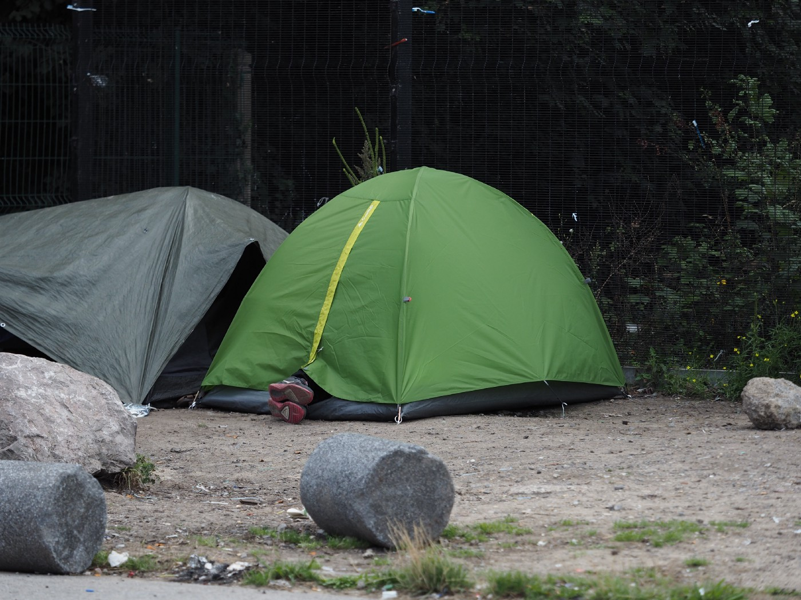

### AYS Daily Digest 24/03/2021: UK’s new plan on immigration
#### Bones for the “good”, punishment for the “bad” immigrants // Report on torture of Syrian refugees in Lebanon // More than 50 percent on Lesvos are women and children // EU’s migration plan with Northern African countries

In Calais, many people are still hoping to make it to the UK\. The Home office wants to cut their rights even further\. Credits: Niklas Golitschek
### UK

The government of the United Kingdom is planning A “New Plan for Immigration”, the Home Office published a 52\-page bill\. Among humanitarian organizations, this draft raises concerns over future policy, as it is already mixing asylum and illegal immigration\. “The asylum proposals are mostly irrelevant to the real needs of a creaking system,” [summarizes](https://www.freemovement.org.uk/a-first-look-at-the-new-plan-for-immigration/?fbclid=IwAR25UdAnF3HKfvdK5sO8kKtLIPvhACWIiD5-XefxpXbtGr0uT6G_qgqaCng) Free Movement\.

■■■■■■■■■■■■■■ 
> **[Alan Travis](https://twitter.com/alantravis40) @ Twitter Says:** 

> > Detail of @[pritipatel](https://twitter.com/pritipatel)'s New Plan for Immigration shows her asylum approach is based on fantasy politics:
• no returns agreement in place with any 'safe' country to take back asylum seekers
•no agreements in place with any "alternative safe third country" https://t.co/vroNXhZq3W 

> **Tweeted at [2021-03-24 13:45:41](https://twitter.com/alantravis40/status/1374719068570320896).** 

■■■■■■■■■■■■■■ 

Further, the bill tries to separate “good” and “bad” refugees — the ones who wait for relocation and those who try to do it by themselves\. For the first group, the Home Office wants to provide some minor bonuses\. But for the ones who enter illegally, the punishments will be even more stringent\. The Home Office wants permission to deny access to the asylum system, if someone could have claimed asylum in another country\. In consequence, people would be deported to the EU and other countries\. Others would only get temporary protection for a maximum of 30 months instead of refugee status, and no access to family reunion\. In detail, Free Movement finds many more problematic aspects, cutting the rights of those in need and putting them at risk of not finding a safe place\.

■■■■■■■■■■■■■■ 
> **[New Economy Organisers Network](https://twitter.com/NEON_UK) @ Twitter Says:** 

> > The person fleeing the Taliban in Afghanistan for example, is not going to be able to ask the regime for a passport and then get an exit permit to fly to the UK through a system.

@[SatbirLSingh](https://twitter.com/SatbirLSingh) of @[JCWI_UK](https://twitter.com/JCWI_UK) on how Patel's new proposals on asylum seeking will fail people https://t.co/z7bBY7PlNy 

> **Tweeted at [2021-03-24 19:21:13](https://twitter.com/neon_uk/status/1374803506071277571).** 

■■■■■■■■■■■■■■ 

The British Refugee Council [criticizes](https://www.refugeecouncil.org.uk/latest/news/refugee-council-responds-to-the-home-offices-new-plan-for-immigration/?fbclid=IwAR2bmkRSexcV9Phc4AnNyhLQBX4MrjBf-WNiQY2C9yqyoA0yhl0vgEwjzoQ) , that the Home Office provides no details or targets on resettlement programmes: “The document commits to exploring ways in which the UK can assist people to reach safety from dangerous situations in their home countries, but offers no details on this\.”

Home Secretary Priti Patel already gave a [statement to Parliament](https://www.gov.uk/government/speeches/home-secretarys-statement-on-the-new-plan-for-immigration?fbclid=IwAR2HNp4aobvjvcmyspf4dhp39hcZu0lNKAGmp5YsuTsNqZsglGYKPJY1Qvk) , the Home Office has further published the full [Policy Statement](https://assets.publishing.service.gov.uk/government/uploads/system/uploads/attachment_data/file/972472/CCS207_CCS0820091708-001_Sovereign_Borders_FULL_v13__1_.pdf?fbclid=IwAR0Bj536et2WPwd22LahDo-KaiODOZdFanNEbwTvROSvRRay_hO1PCcUtsM) \.
### Lebanon

Lebanese security forces detained and tortured Syrian refugees on arbitrary counter\-terror charges, reveals Amnesty International\. They used the same torture techniques that are used in the infamous prisons in Syria\. Between 2014 and 2021, AI documented cases of 26 people, among them four children, who were beaten with metal sticks, electric cables and plastic pipes\. “Detainees also described being hung upside down or forced into stress positions for prolonged periods of time\.” In most cases, the torture happened at Ablah military intelligence centre, the General Security office in Beirut or at the Ministry of Defence\. According to the interviewed victims, the security forces showed support for Syria’s dictator Assad\. “There have been no investigations into any of the torture allegations Amnesty International documented, even in cases where detainees or their lawyers told the judge they had been tortured,” AI criticizes\. Even after the anti\-torture law from 2017, complaints rarely reached the court\.

### Eritrea

■■■■■■■■■■■■■■ 
> **[Sally Hayden](https://twitter.com/sallyhayd) @ Twitter Says:** 

> > Five weeks on &amp; infamous human trafficker Kidane Zekarias Habtemariam is still at large after escaping prison. So hard to understand why this isn't getting attention.
Three reports on him:
[irishtimes.com/news/world/afr…](https://www.irishtimes.com/news/world/africa/inside-the-smuggler-s-warehouse-africa-s-21st-century-slave-trade-1.4224073)
[vice.com/en/article/m7a…](https://www.vice.com/en/article/m7an4x/how-did-one-of-north-africas-biggest-human-traffickers-escape-prison)
[irishtimes.com/news/world/afr…](https://www.irishtimes.com/news/world/africa/people-trafficking-they-were-killers-they-have-raped-many-women-1.4508833) https://t.co/dWuVsKTEiZ 

> **Tweeted at [2021-03-24 12:15:15](https://twitter.com/sallyhayd/status/1374696307940556802).** 

■■■■■■■■■■■■■■ 

### Greece

More than 9000 people on the move are living on Lesvos at the moment\. The majority—almost 6800—are at the Mavrovouni site, better known as Moria2, reports journalist Franziska Grillmeier\. Most of the people, some 70 percent, are from Afghanistan\. Of these, 35 percent are children, many of them younger than twelve years old, five percent are unaccompanied, and 23 percent are women; more than half of the residents belong to vulnerable groups\.

■■■■■■■■■■■■■■ 
> **[Franziska Grillmeier](https://twitter.com/f_grillmeier) @ Twitter Says:** 

> > Update: Auf der Insel #Lesbos leben über 9.000 geflüchtete Menschen im Moment.  Davon 6.780 (75%) im Lager #Mavrovouni, das von vielen Bewohner:innen auch #Moria2 genannt wird. 
Die Mehrheit kommt aus Afghanistan (70%), der Demokratischen Republik Kongo (10%) &amp; Syrien (7%). /1 https://t.co/90jVQK9m9c 

> **Tweeted at [2021-03-24 08:30:52](https://twitter.com/f_grillmeier/status/1374639841024094211).** 

■■■■■■■■■■■■■■ 

Meanwhile, some 30 people were sleeping in front of the police office so they could queue up the next morning to get their permission to travel to the mainland\.

■■■■■■■■■■■■■■ 
> **[Mortaza](https://twitter.com/mortazabehboudi) @ Twitter Says:** 

> > More than 30 refugees are sleeping in front of police office in the #Lesvos camp. They queue now for tomorrow morning in order to obtain the permission to go to the mainland. Movement restrictions are also applied to people with refugee status. https://t.co/4XhHApfAn0 

> **Tweeted at [2021-03-23 21:30:30](https://twitter.com/mortazabehboudi/status/1374473654545784840).** 

■■■■■■■■■■■■■■ 

According to the social media reports, a young man died on Kos due to medical negligence\. It is said that police and the camp administration refused to transfer him to hospital\.

■■■■■■■■■■■■■■ 
> **[أيهاالعالم نحن هنا .. 00:00👇](https://twitter.com/NAHNO___HONA) @ Twitter Says:** 

> > 📢 مصرع لاجئ في مخيم جزيرة كوس في اليونان بسبب الإهمال الطبي
منذ سنتين وانا اكتب واقول و اصرخ و انشر واناشد واستغيث لمساعدة اللاجئين وانقاذهم من مخيمات الجحيم في اليونان
مفوضية اللاجئين @[UNHCR_Arabic](https://twitter.com/UNHCR_Arabic)
لا أمل 
منظمة الهجرة @[UNmigration](https://twitter.com/UNmigration) 
لا أمل
لا أمل في الأرض .. الامل في السماء 🙏 https://t.co/ZeOtsNCtt7 

> **Tweeted at [2021-03-24 21:17:05](https://twitter.com/nahno___hona/status/1374832667867426825).** 

■■■■■■■■■■■■■■ 

Following a statement by Mytilene’s mayor that the original Pikpa camp run by Lesvos Solidarity was handed over in “horrible condition”, the organization reacted to the accusations, saying: “Pikpa’s shelter was recognised at a universal level and was awarded numerous times as a model example for hosting refugees and supporting the local community\. For eight years Pikpa stood as an example and demonstrated what people can do when allowed, by creating a space of solidarity, respect and dignity, equality, and non\-violence\.”

The team further points out that they had been given the site in 2012 after it had been abandoned for several years before that — and there was massive damage\. Additionally, they were forced to remove all mobile units and some of the mentioned damage \(from earlier\) was about to be rectified through the support of international partners\. But with the much criticized eviction, the project came to an unwanted end\.

Meanwhile, EU’s Commissioner for Home Affairs, Ylva Johannson, is [visiting](https://ec.europa.eu/commission/commissioners/2019-2024/johansson/blog/spring-best-time-prepare-winter-why-i-am-visiting-lesvos-now_en?fbclid=IwAR1yCvRxtbHMNzrE4mn_JUa9lCP9PSNIBCZxJlEKjk48k6wBIDQdZTseRSU) the island at the end of March\. “All responsible authorities must double their efforts and play their part,” she demands, so that further acts of inhumanity will not be repeated\. At the same time, she thinks 155 million euros for Lesvos and Chios and 121 million for the other islands will be enough for humane facilities and areas for families and children\. Considering that Greece has enjoyed the benefit of [3\.15 billion euros](https://ec.europa.eu/home-affairs/sites/homeaffairs/files/what-we-do/policies/european-agenda-migration/202103_managing-migration-eu-financial-support-to-greece_en.pdf) of EU support since 2015, we should prepare for the situation to become even worse\.

Reporter and author Rory O’Keeffe initiated a call to MEPs to stop illegal deportations and pushbacks from Greece, after dozens of reported incidents during the last days, weeks, months and years:

> The EU can and should be a beacon of legal and decent behaviour towards people in need, and a protector and promoter of international law\. But it will only be this if it acts to make it happen\. 

You can read the full statement, which Aegean Boat Report is supporting, on his website Koraki\.org\. There you can also find advice on how to contact your MEP as well as drafts for a letter\.

### Sea

Guardia Civil [rescued](https://www.granadahoy.com/costa_tropical/Rescatados-inmigrantes-patera-Granada-Costa_0_1558644829.html) ten people off of Granada, who had left from North Morocco\. Also on Sicily some 116 people [were able](https://www.infomigrants.net/en/post/31065/migrants-disembark-ocean-viking-in-sicilian-port?fbclid=IwAR3YxWE8nfIzbN_BNbPLmd0hEhE2QEf-wokPBX08ghTdYOdCzFOg6HowHSE) to disembark SOS Mediterranee’s Ocean Viking, after waiting several days at sea\. Six people tested positive for the coronavirus\.
### Spain

El Diaro [reports](https://www.eldiario.es/desalambre/muerte-nina-maliense_1_7333379.html?fbclid=IwAR3r2ybjL7Cue01neIM2_ooaOo7zTLgAOpL-F-UwLpqw5OlG7wFQvH62m3M) that the mother of a two\-year old girl from Mali who died last Sunday in a hospital on Gran Canary, was locked in a police center at the time\. Health workers managed to find and identify the woman, so she was able to say goodbye to her child\. The police did not want to confirm this\.
### France

In eight expulsions, police seized 16 tents and nine tarpaulins in Calais, Human Rights Oberservs witnessed\.

■■■■■■■■■■■■■■ 
> **[Human Rights Observers](https://twitter.com/HumanRightsObs) @ Twitter Says:** 

> > Ce matin à #Calais ont eu lieu 8 #expulsions de lieux de vie informels par les forces de l’ordre. 
•16 tentes et 9 bâches ont été saisies.

La lutte contre les points de #fixation est une violence #institutionnelle, perpétrée contre les personnes #exilées à la frontière. https://t.co/DpK8qNuJ9W 

> **Tweeted at [2021-03-24 19:03:33](https://twitter.com/humanrightsobs/status/1374799060805292032).** 

■■■■■■■■■■■■■■ 

Christians of Calais meanwhile [sent](https://www.lavoixdunord.fr/965065/article/2021-03-22/migrants-les-chretiens-du-calaisis-lancent-une-lettre-ouverte-au-prefet-du-pas?fbclid=IwAR2mMHytskZ4eOn67Lea_L4FkbU3og2DTyJ2WqjHF5_WRtfZqkGsHTCOtPM) an open letter to the prefect, asking to improve the living conditions of the people\.
### EU

Statewatch [analyzed](https://www.statewatch.org/news/2021/march/eu-tracking-the-pact-tunisia-and-other-north-african-states-targeted-for-new-action-on-migration-asylum-and-more/?fbclid=IwAR0-K4KlFtkXSRM6VtqzVZWmz01lzf8geLWEHGtS8KzgpUkItgh2xal7f-I) two documents, which give insights into the EU’s plan for a dialogue with Tunisia and other North African countries to prevent people from leaving for Europe\. The core topics are:
- Migration, including legal migration, and border management
- Civil protection and response to humanitarian crises
- Hybrid threats and cybersecurity
- Strengthening law enforcement cooperation

Lighthouse Reports will host an online event regarding Frontex’s evolution on 31 March\. With several journalists they will analyze the evidence of illegal pushbacks and other issues like the massively increasing budget of the border and coast guard\. You can the meeting on Zoom\.

■■■■■■■■■■■■■■ 
> **[Lighthouse Reports](https://twitter.com/LHreports) @ Twitter Says:** 

> > Over the last 2 years #LHReports has shone a spotlight on #Frontex &amp; its disturbing evolution. Join us on March 31 to hear about the making of these #investigations with key contributors: [bit.ly/investigating-…](http://bit.ly/investigating-frontex) 

> **Tweeted at [2021-03-24 12:10:23](https://twitter.com/lhreports/status/1374695084252401669).** 

■■■■■■■■■■■■■■ 

On [The New Arab](https://english.alaraby.co.uk/english/indepth/2021/3/23/frontex-the-eu-agency-under-fire-for-migrant-pushbacks?fbclid=IwAR2Khc0R__kVPzw5DaTiUNDHNuAy6SOPp6gJXT4vJXT-Fc0jGNtf4xv5DgI) you can read a recent article explaining the activities and critics regarding this topic\.
### General

Amnesty International demands FIFA put pressure on Qatar, host of the football World Cup 2022, to stop violating the human rights of migrant workers\. The organization recognizes progress in term of reforms in the previous years, but they have not been properly implemented\. “Thousands of migrant workers continue to be exploited and abused”, said Amnesty according to [InfoMigrants](https://www.infomigrants.net/en/post/31066/amnesty-fifa-must-protect-migrants-in-qatar-for-world-cup?fbclid=IwAR2yU-nfcjkV_Bc_uGh70vljBLa2bQsFtObGEzEikBb7kCAaqOD2FwffQa4) \. It is estimated that more than 6500 guest workers have died since the country was selected to host the World Cup\. Several fan groups are supporting a boycott of the World Cup\.

The Pulitzer Center will host an event with reporting fellow Angelica Ekeke on 31 March\. “Highlighting the Resilience of Refugee Girls in the Shadows of Europe” tells the stories of refugee girls in her project, _The Forgotten OneƵ\._ Here she will follow a 16\-year\-old girl from Nigeria on her way to Europe\.

**Find daily updates and special reports on our [Medium page](https://medium.com/are-you-syrious) \.**

**If you wish to contribute, either by writing a report or a story, or by joining the info gathering team, please let us know\.**

**We strive to echo correct news from the ground through collaboration and fairness\. Every effort has been made to credit organisations and individuals with regard to the supply of information, video, and photo material \(in cases where the source wanted to be accredited\) \. Please notify us regarding corrections\.**

**If there’s anything you want to share or comment, contact us through Facebook, Twitter or write to: areyousyrious@gmail\.com**

_Converted [Medium Post](https://medium.com/are-you-syrious/ays-daily-digest-24-03-2021-uks-new-plan-on-immigration-c97b5635438b) by [ZMediumToMarkdown](https://github.com/ZhgChgLi/ZMediumToMarkdown)._
