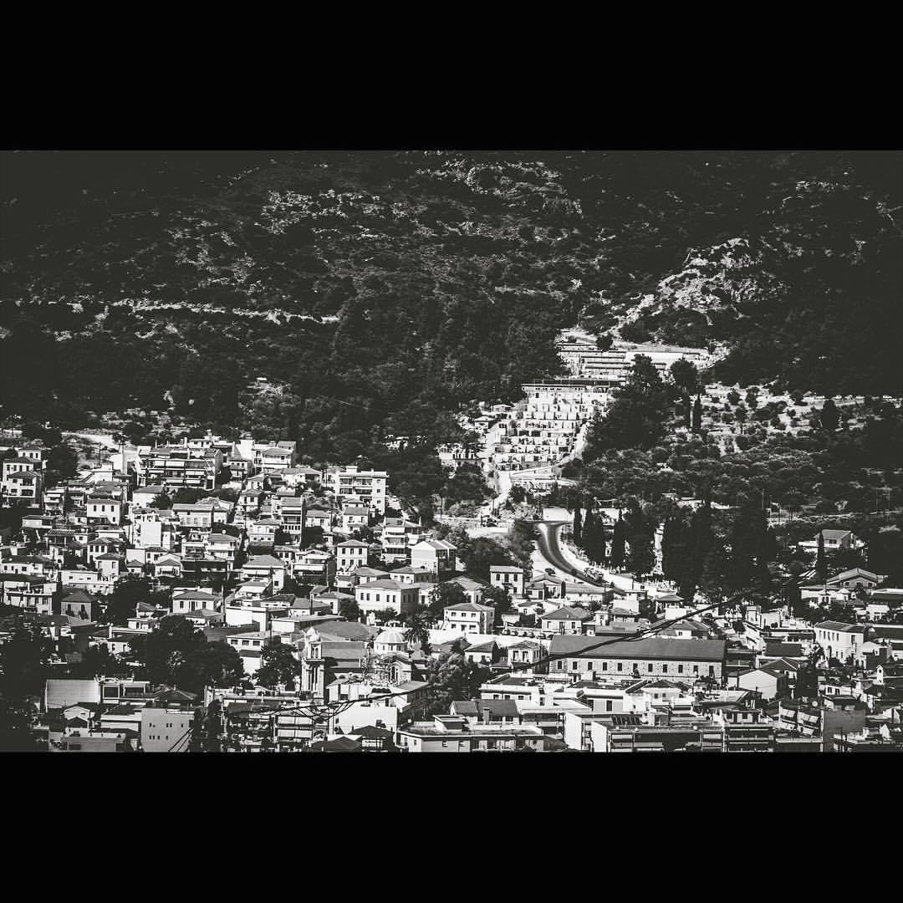
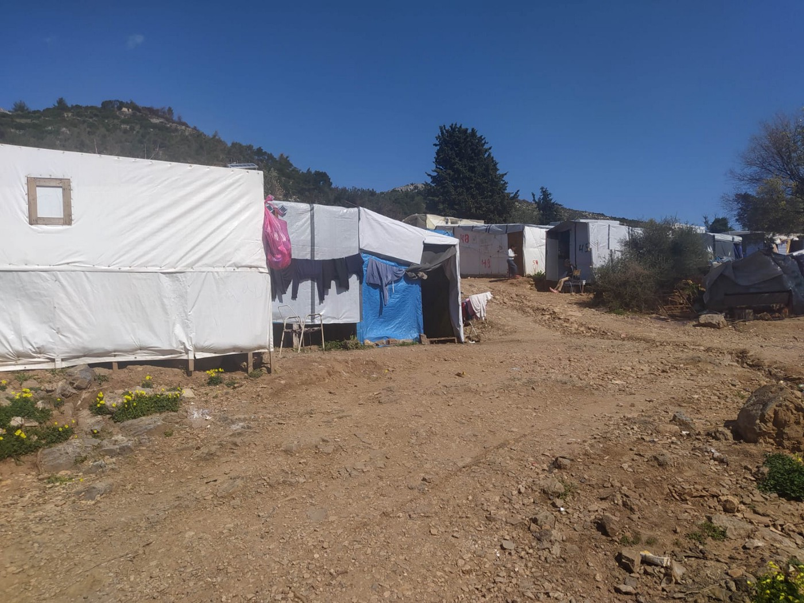
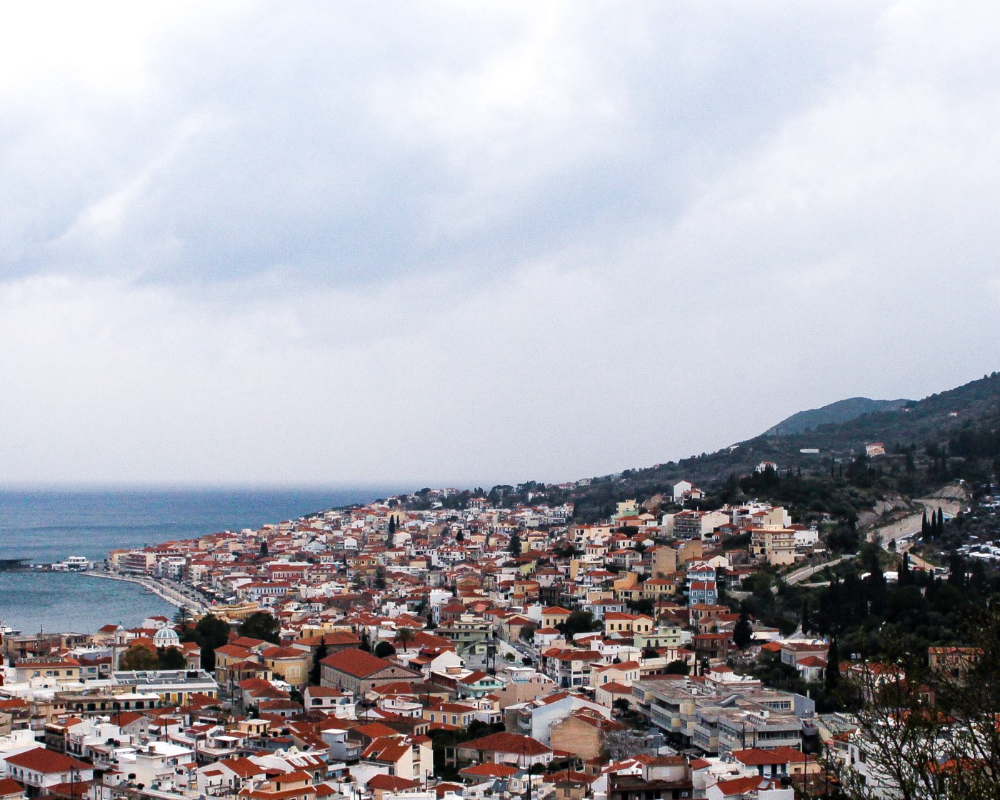

### AYS Special from Samos: For No Other Reason Than Your Skin Colour — Racial Discrimination and Xenophobia in the Aegean

_Racial discrimination and xenophobia against people on the move, as well as people of colour, is a daily occurrence across Europe\. Actors from the Greek island of Samos are speaking out about how discrimination has resulted in such communities being subject to unlawful travel bans, struggling to access shops and services, and being disproportionately targeted by police — turning public services on Samos into spaces of anxiety and oppression\._

Vathi, Samos
#### **Unlawful Travel Bans**

In Samos, the colour of your skin impacts your ability to travel, with no legal basis\. From 30th October 2020 to 27th February 2021, Samos was exempt from a nationwide travel ban due to the ‘ [state of emergency](https://news.gtp.gr/2020/10/31/state-emergency-declared-samos-after-earthquake-hits-aegean-sea/) ’ that had been in place on the island since the 6\.6 magnitude earthquake in October 2020\. For [Samos](https://www.kathimerini.gr/society/561147304/lockdown-oi-exaireseis-se-samo-kai-karditsa/) , this exemption meant that supporting documents, such as proof of address, permanent residence or reason of travel, were not required to travel in and out of the island\. Although no documents were necessary, many people of colour with recognised refugee status were both [questioned and banned](https://www.borderviolence.eu/balkan-region-report-february-2021/) from travelling despite holding a valid ticket\. It is important to note, that there were close to zero reports of similar obstructions to Greek nationals or White Europeans\.

This trend supports the claim that people on the move in the Aegean are not treated as equal under the law or even municipal policy\.

> If documentation is required to travel, it must be asked of each traveller\. However, in Samos, the Hellenic Coast Guard take it upon themselves to determine who has the legal right to travel based on their racial profile\. 

This discrimination violates individuals access to goods, services and rights, and is unlawful under both [Greek Law 4443/2016](https://ec.europa.eu/migrant-integration/librarydoc/law-4443/2016-on-equal-treatment-between-persons-irrespective-of-racial-or-ethnic-origin) and [EU Council Directive 2000/43/EC](https://eur-lex.europa.eu/legal-content/en/TXT/?uri=CELEX%3A32000L0043) \. It violates the right to equality before the law and protection against discrimination, and yet it carries on despite the official complaints made by legal actors on the island\.
#### **Everyday Experiences of Racism**

Vathi camp, Samos

This discrimination runs deep in the Aegean — hindering access to services for people on the move in stark contrast to the ease with which the local community receive the same services\. It is observed by NGO workers that in multiple stores on Samos, Greek nationals and White Europeans are usually able to walk into shops without question, whilst people of colour are often asked to leave their bags at the front of the store\. Or, that some restaurants or cafes will deny entry to people, based on their racial profile\. These instances of discrimination — whilst not carried out in every establishment — are not uncommon on the island\.

Education is another human right outlined in the [Convention on the Rights of the Child](https://www.ohchr.org/en/professionalinterest/pages/crc.aspx) , but nonetheless contested and obstructed in the Aegean\. In [February 2021](https://www.ekathimerini.com/news/262070/refugee-presence-at-school-on-lesvos-draws-local-ire/) , local parents in Lesvos protested the attendance of nine children from the refugee and migrant community at a local school, exemplifying how xenophobic narratives and attitudes are present in local communities and are even directed towards children\.
#### **Race and Policing**

 \)](assets/596b15d10920/1*Q9Cqo65UZ2ma-ZdDd1C2HA.jpeg)

Athens, March 20, 2021 — International Day for the Elimination of Racial Discrimination\. Against the detention centres and deportations\. \(Photo by Chrysoula Patsou, via [Art Against](https://web.facebook.com/artagainstproject/posts/3783599158356157?__cft__[0]=AZVSXDn6iO8X-MjT9I3jkI6iC1CNUFfyLfSO9xmHmB3EcSZKNTCGNyBDnulxI5k3WyIugQNZPiGYn0RPG222SKK_AELdI8A-Ab4O8CYObzkXscOclqag5oM-ANJkptt5MvoGRihULpdCrNtX6QoOQwb1&__tn__=%2CO%2CP-R) \)

Legal actors working on Samos report that police disproportionately fine refugees, migrants and people of colour in the streets\. The Directorate General of the Regional Police of North Aegean recently [published](https://www.samos24.gr/%CE%B5%CE%BB%CE%B1%CF%83-1-582-%CE%B1%CE%BB%CE%BB%CE%BF%CE%B4%CE%B1%CF%80%CE%BF%CE%AF-%CF%83%CF%85%CE%BD%CE%B5%CE%BB%CE%AE%CF%86%CE%B8%CE%B7%CF%83%CE%B1%CE%BD-%CF%84%CE%B7%CE%BD-%CF%84%CE%B5%CE%BB/) a press release that highlighted that out of the 9,033 fines imposed for breaching Covid\-19 measures in Lesvos, Chios and Samos since November 2020 to March 2021, 7,266 were imposed on “foreigners” compared to 1,767 on Greek nationals\.

Although the Covid\-19 prevention measures are important in controlling the spread of coronavirus and should be followed, the huge discrepancy of fines imposed on the refugee and migrant community compared Greek nationals is undoubtedly the result of racial profiling and discrimination towards people of colour by police\. It is widely observed by legal actors and human rights defenders in Samos that there is an unfair and obvious targeting by police and authorities towards people on the move and people of colour\.

Additionally, it is often difficult for camp residents to immediately access information concerning the modification of lockdown restrictions and consequently adhere to the rules straight away\.

> This is amplified by the fact that camps across Greece have been in lockdown and hence residents do not have access to community centres and other services — crucial for disseminating and clarifying such information\. 

Immediately after the imposition of a stricter national lockdown earlier this year, there was a significant increase in the number of fines handed out to people on the move\. This sparked frustration amongst the community and NGOs as this transitional time was seen to be deliberately used by authorities to criminalise refugees and in turn reinforce xenophobic narratives\.

The misuse of power by authorities became so apparent and hypocritical in Samos that a lawsuit was finally filed against police officers who were allegedly not respecting social distancing in a public space\. This further highlights the double standards between those these rules apply to and those to whom they don’t\. These ‘double\-standards’ are particularly unfair regarding the access to information and living conditions of people living in Vathy camp\.
#### **Beyond Greece**

This racial profiling and xenophobia, as exemplified by the unlawful travel bans and Covid\-19 related fine imposition on people on the move in Samos, violates the right to equality before the law and protection against discrimination — and yet continues despite the official complaints made by legal actors on the island\. These practices are both derived from and reproduce the prevailing climate of racism and xenophobia in Greece\.

Experiences of racial discrimination against people of colour in the refugee and migrant community are by no means contained to Samos or Greece\. Systemic and structural racial discrimination continues on every border and violates the rights of people of colour who are on the move across Europe\. An article written [by Forensic Architecture, in partnership with ECCHR](https://forensic-architecture.org/investigation/pushbacks-in-melilla-nd-and-nt-vs-spain?fbclid=IwAR2xkAKqBawhPgOjYCZh4ZFFOSeLcanQLjA-VeREjqWxeASx6u6hOckE6F) , demonstrated how individuals from Sub\-Saharan Africa are systematically and structurally discriminated against at the Melilla border \(Morocco\-Spain border\) \.

The racial profiling prevalent in border control reached [headlines](https://www.theguardian.com/world/2019/dec/21/nigerian-students-wrongly-deported-to-bosnia-return-home) when two Nigerian students who were pushed back from Zaghreb to Bosnia in December 2019 by Croatian police who assumed that they were undocumented migrants\. While it is important to stress that pushbacks are wholly illegal no matter whether people have the ‘correct’ documents or not\. This incident highlights how xenophobia and racism are both deeply embedded in state practices and violently perpetuated\.
#### **Final Thoughts**

Vathi, Samos

These instances of racial discrimination and xenophobia [feed into](https://www.libertyhumanrights.org.uk/issue/report-a-guide-to-the-hostile-environment/) “ _everyday interactions between trusted public sector workers and the people they are supposed to serve: nurses and patients, police and victims of crime and teachers and their pupils_ ”\. Because of this, public services are far from the safe, inclusive and constructive spaces they were designed to be for refugees, migrants and people of colour\.

> Through fear of being apprehended, such individuals may refrain from accessing vital services — which in turn normalises violence as marginalised groups may feel unable to speak out about injustice due to the real fear of being discriminated against in the process\. 

Public services morph into spaces of anxiety in Samos arising from an internalised fear of surveillance and discrimination for the refugee and migrant community and people of colour, which damages both mental health as well as one’s sense of belonging and safety\.

**Photos and Text by activists on the ground\.**

**Find daily updates and special reports on our [Medium page](https://medium.com/are-you-syrious) \.**

**If you wish to contribute, either by writing a report or a story, or by joining the info gathering team, please let us know\.**

**We strive to echo correct news from the ground through collaboration and fairness\. Every effort has been made to credit organisations and individuals with regard to the supply of information, video, and photo material \(in cases where the source wanted to be accredited\) \. Please notify us regarding corrections\.**

**If there’s anything you want to share or comment, contact us through Facebook, Twitter or write to: areyousyrious@gmail\.com**

_Converted [Medium Post](https://medium.com/are-you-syrious/ays-special-from-samos-for-no-other-reason-than-your-skin-colour-596b15d10920) by [ZMediumToMarkdown](https://github.com/ZhgChgLi/ZMediumToMarkdown)._
