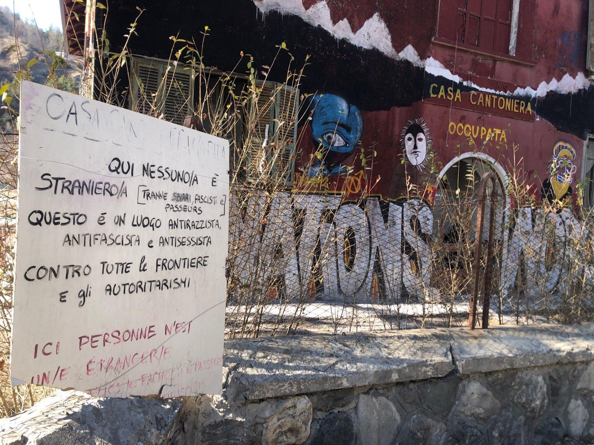
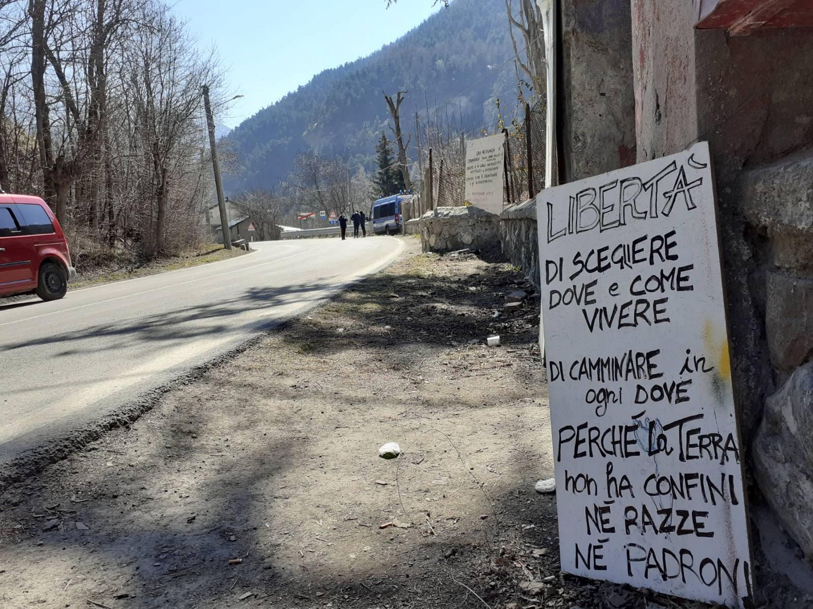

### AYS Weekend Digest 27–28/3/2021 — Italian/French border: Eviction of the Casa Cantoniera

Deadly shipwreck off Spain // More deportations from Germany despite the pandemic // COVID outbreak in Ellebæk, Denmark // Sudden improvements in Moria 2\.0 ahead of Johansson visit // Expenditure of UK Home Office raises questions\.

Casa Cantoniera, Oulx, Italian\-French Alpine border
#### Featured: Eviction of the Casa Cantoniera

In the early morning of Monday March 23rd, police [evicted](https://www.facebook.com/permalink.php?story_fbid=1065314467287282&id=362786637540072) the Casa Cantoniera\. Since December 2018, the occupied house in Oulx, a small village on the Italian side of the Alpine border with France, supported thousands of people transiting on their way to northern Europe\.

13 people have been charged for the illegal occupation of the building, while more than 60 — who had found temporary shelter in the squat — “ [have been forcibly tested for coronavirus, identified, fingerprinted, and then transported to different structures\.](https://www.facebook.com/permalink.php?story_fbid=1068155123669883&id=362786637540072) ”

In one morning, Italian authorities have forcibly shut down a space that for 828 had been a [hub](https://www.facebook.com/permalink.php?story_fbid=1068155123669883&id=362786637540072) of “practical solidarity and resistance against the border and the oppression and violence that comes with it\.”

Casa Cantoniera, Oulx, Italian\-French Alpine border

> In the occupied house people have shared their stories, dreams and struggles among each other, finding strength in not being alone\. Sometimes these moments consisted of simply sharing a coffee in the morning, passing a platter of something delicious and fried to share during discussions, dancing to pop music from all over the world while preparing a collective meal, four different people offering their last respective filter, paper, tobacco, or lighter for a much needed cigarette… 

Casa Cantoniera was home to experimentations, seeking to build an “alternative reality\.” It included a self\-organised garden, a safe space for women and gender non\-conforming individuals and a library with books and self\-published texts in various languages\.

As the squatters recollect, they also experienced a number of unpleasant and violent episodes, as “in a world that is based on violence and in which all of us have internalized dynamics of oppression and certain stereotypes, it is impossible to not make mistakes\.”

These episodes have been the official and final excuse for the intervention of the police last week and the eviction of the house\. As we have seen in many occasions before throughout Europe, immediately after the eviction, Casa Cantoniera was labelled a home of “dirty squatters and wrong doers,” conforming to a widespread and stereotyped narrative that seeks to demonise radical alternatives\.
#### Casa Cantoniera and the aid sector

The occupation of Casa Cantoniera is representative of an alternative ethos that characterises some experiences of solidarity throughout Europe, and the\- at times difficult — relationship between the aid sector and self\-organised, political projects\. During the two years that it was occupied, Casa Cantoniera had accepted support from aid organisations, in the form of material support and information sharing, while reflecting on the distance between their experience and that of NGOs\.

According to a text [released](https://www.facebook.com/permalink.php?story_fbid=1068155123669883&id=362786637540072) by “some of the people that were involved in the occupied Casa Cantoniera”, the eviction was ‘supported’ on site by two humanitarian organisations, the Italian Red Cross and Rainbow 4 Africa:

> The way this eviction has been executed demonstrates once again all the contradictions of the European\* migration policy\. The repression of free movement is only possible with the complicity of so called «humanitarian» institutions\. While the cops are the visible face of state repression, humanitarian organizations are used \(and complacently so\) as the friendly face of this repression\. 

The two organisations provided the infrastructure for the processing, testing and transferring the 60\+ people who were evicted from the Casa Cantoniera, without the individuals’ consent\.

Rainbow 4 Africa [has criticised the eviction and explained](https://www.facebook.com/Rainbow4Africa/posts/10158050798502874) their presence there as a “solidarity intervention with all people evicted\.”
#### Europe criminalises solidarity

It is difficult not to see this eviction as part of a wider repressive wave against freedom of movement and solidarity\. From Greece to the UK, cross\-border solidarity is attacked and criminalised by authorities\. Evictions, detention, charges of terrorism and human trafficking against people on the move and rescue crews and negative narratives about the situation as a whole and those involved in it are some of the common responses from European governments to this crisis of their own making\.

> Now, more than ever we want to call everyone to come to the border in order to show that the eviction of our spaces, the repression of people on the move and people in solidarity with them, will not stop us from expressing and exercising our resistance\. We are trying to regroup and organize presence in the border\. We don’t know yet which form this will take, because it depends on what is going to happen in the next days and weeks\. If you are interested and want to stay updated, write an email to chezjesoulx@riseup\.net \(pgp key on request\) \. 

Read the full statement \(in Italian, French and English\) [HERE](https://www.facebook.com/permalink.php?story_fbid=1068155123669883&id=362786637540072) \.

SEA
#### Central Med

The UE navy mission EUNAVFOR MED Operation IRINI has recently been [extended](https://twitter.com/cochetel/status/1376260776520990724) by the European Council for 2 years\. As UNHCR’s Vincent Cochetel [notes](https://twitter.com/cochetel/status/1376260776520990724) , “it does not prevent weapons to reach Libya nor human trafficking\.” Since 2019, EUNAVFOR MED had [shifted](https://www.consilium.europa.eu/en/press/press-releases/2019/03/29/eunavfor-med-operation-sophia-mandate-extended-until-30-september-2019/?__cf_chl_captcha_tk__=60623d16b68435c0e1f6fe5a4056e3a9a3b856af-1617010989-0-AfIq4mnwKre3Pjy_LS3E6LxbzbtpefpE7vCWR4gusuanw1eT9VMBSQxwKxyjDnpOcgS95TsP8bYR1xJs2VmfjqOqQt-AGNAjoge9EOK_74MPVJJi9bXOqX8kyhy_vXqRMNKTsjTRE6Qr0oV4B880fzc1vVs2T95ha5iQMPAuwjDr5uvVP5H_y_Z53Ph4hUk9dqFDbLpqoMGRmzkh7p48nqMwqstEj8dGmVgTqHoF4-ChL2C01Si1hcJLnGZqh9srsRxTfwKFebYXB4B4TqXbIYsuLakJbarkbpEEueUhQ9RaFs52nPadRZXneca3yAXtYgB4LTzvaFTZ9J4O9FNSa2iat5JN3z3lBzW07kg6olE3KZSFBLcKGII0PBbrhzikCCai4BaV8-CtfiELnmznmpXVOmzLySwbz8gMHuz6zT0-OMDlxVFLCEqag4PcNX4xt8G1qY-t_M78lrnukPgRnuLtlrHecH3iWk8uR_YQ9mTxa57-sD04fqP-TrANppIaq2WPrLb15szexRdeUKR8WfaFFZ29oXXSEgWfo3IIHOD6_iT-50ZDje7hGe0Ddky_lfwid7cDn8jC6Bh-29DUq-2dTTUa0apaR08s9Z8LAcQwdUDSDOLSlPb9bIF6UwoUlnos4KW4_cximRLo8qj68Iula0HEcXB6fEIFqqV31AaXp87uENvhf1LKYElz5w2Vvg) its mandate from supporting SAR activities with vessels to monitoring the central Med through aircrafts and supporting the Libyan Coast Guard\. “All this capacity could save lives in the Mediterranean sea if it was its mandate & the agreed priority of EU member states\.”

IOM Geneva spokesperson Safa Msehli [reports](https://twitter.com/msehlisafa/status/1376431517023531009) that around 1,000 people have attempted to flee Libya over the weekend, but were intercepted by the country’s authorities\. According to IOM Libya data, “more than 4,500 people were intercepted or rescued so far this year and ended up in arbitrary detention\.” This is more EU\-funded inhumane detention\.

Open Arms [rescued](https://twitter.com/emergency_ngo/status/1375880659646959617) 38 people, including 14 minors all under 10 years old and one just 4 months old, [7 women and 17 men](https://twitter.com/AngiKappa/status/1375852261105094662?fbclid=IwAR3SIyNoJZJfRAljAMC6_xdhHLdPJYy3B_lrk3yQXMsROpc7GkC2YKzedoo) , on Saturday after spending 48 hours at sea\. They had [contacted](https://twitter.com/alarm_phone/status/1375727025051295744) Alarm Phone, who informed the Maltese and Italian authorities of the location, in Maltese SAR zone: “Malta doesn’t answer the phone and Italy won’t take responsibility\.”

A boat in distress with 122 people onboard also contacted Alarm Phone on Saturday\. While EU authorities failed to answer, Open Arms searched for the boat, but to no avail\. As of Sunday, Alarm Phone had lost contact with them\. We hope they are safe\.
#### Western Med

On Saturday night, a boat with 14 people on board [capsized](https://twitter.com/alarm_phone/status/1376095849772630019) just [300 metres](https://www.canarias7.es/nacional/salvamento-maritimo-suspende-busqueda-6245044217001-20210329083504-vi.html) from the Spanish coast, near Mazorron, in Murcia\. 3 people were rescued, 2 bodies were retrieved and 9 people are missing\. On Monday morning, Spanish media [reported](https://www.canarias7.es/nacional/salvamento-maritimo-suspende-busqueda-6245044217001-20210329083504-vi.html) that the active search for the 9 missing people had been called off\. “From now on, only a passive tracking will be carried out”

At least 58 people were rescued on their way to the Canary islands\.

GREECE
#### 34 people arrived on Lesvos

[Aegean Boat Report state](https://twitter.com/ABoatReport/status/1376103138260877313) that a boat carrying 34 people landed on Lesvos on Friday night, the weekend before the EU Commissioner’s visit\. After landing, they split up into 2 groups, and hid in the woods as they were scared of being pushed back\. Eventually, both groups made themselves known and were transported to the quarantine camp in Megala Therma\.

> To see this sudden change in tactics from the Greek gov’t just days before the visit by Ylva Johansson, can only be seen as deliberate, a temporary show for the audience\. — [_Aegean Boat Report_](https://twitter.com/ABoatReport/status/1376103172289232896) 

#### Ms Johansson, the EU Commissioner to visit Lesvos and Samos today

Many groups have spoken out about Ms Johansson’s visit\. [Aegean Boat Report](https://aegeanboatreport.com/2021/03/27/one-year-on-we-need-your-help-commissioner/) highlight pushbacks and resultant deaths, reception conditions, closed camps and rising homelessness\.

This thread draws attention to the increasing use of technology and surveillance in camps:

■■■■■■■■■■■■■■ 
> **[Petra Molnar](https://twitter.com/_PMolnar) @ Twitter Says:** 

> > 🚨#BorderTech in Greece: Back on Lesvos before EU’s @[YlvaJohansson](https://twitter.com/YlvaJohansson)’s visit tomorrow to discuss building of a new camp which will supposedly include various #surveillance tech and motion detection algorithms (see: @[EuropeMustAct](https://twitter.com/EuropeMustAct) […4-4d21-b3ea-797e75ad39b3.filesusr.com/ugd/0d6197_617…](https://05cd942b-77f4-4d21-b3ea-797e75ad39b3.filesusr.com/ugd/0d6197_61731d4c32f245648587332a279e5033.pdf)) 

The tale of three camps🧵 https://t.co/GmKJKoF09Y 

> **Tweeted at [2021-03-28 14:24:04](https://twitter.com/_pmolnar/status/1376178280538193923).** 

■■■■■■■■■■■■■■ 

As always happens before an official visit of this sort, ‘improvements’ have suddenly been made, including this basket ball court, apparently completed while people are still living in tents…

■■■■■■■■■■■■■■ 
> **[Mortaza](https://twitter.com/mortazabehboudi) @ Twitter Says:** 

> > Basketball field for the visit of EU commissioner tomorrow⁉️They put it just before yesterday... It’s a show time🤔 People were cleaning front of the camp for this visit and media coverage tomorrow afternoon. This is not the reality believe me, they faked it! #Lesvos #Refugeesgr https://t.co/l5EGeP8Y0u 

> **Tweeted at [2021-03-28 09:30:11](https://twitter.com/mortazabehboudi/status/1376104319620165632).** 

■■■■■■■■■■■■■■ 

A [video of the current situation in Moria 2\.0](https://twitter.com/MortazaBehboudi/status/1375809228200415238) draws attention to the lack of sanitation and education for children\. A [resident of the camp from Syria](https://twitter.com/f_grillmeier/status/1376080163230904325) also spoke out over the weekend by contacting journalist [Franziska Grillmeier](https://twitter.com/f_grillmeier) :

> I am in Moria, watching what is happening\. I thought of myself as an animal\. But after watching how animals are treated here, I realized they have more rights than us\. I don’t know what to say, all I want to say is that because of the difference in culture and language, humanity understood us wrongly\. All I want now is to come out in sanity\. 

#### Lesvos new camp

Meanwhile, the new camp on Lesvos will [not open in September](https://www.spiegel.de/politik/ausland/lesbos-neues-fluechtlingslager-auf-lesbos-wird-nicht-rechtzeitig-fertig-a-84116738-f80a-4608-8ec3-61f09d89f56c?fbclid=IwAR2xr8XMPIbBKty8y6js3_df-Lw0BGImzBvKkdUglWSMyGWnjnMGZ7PUwkY) as scheduled and the new deadline is [the end of 2021](https://www.amna.gr/home/article/540185/N-Mitarakis-sto-APE-MPE-Arches-Maiou-xekinaei-o-emboliasmos-stis-domes-filoxenias-apo-ton-EODY?fbclid=IwAR1kas3wMRI0ZX0ifZX3amlf6a1ILxWxbGFWbqU3z2jmj96VL7N-tgPmOo4) \. Surprise\!

In fact the EU and Greece haven’t even been able to agree on the basic structure of the space, a necessary step before the funding is released\. The Greek government continues to promote the idea of [‘closed and controlled camps’](https://05cd942b-77f4-4d21-b3ea-797e75ad39b3.filesusr.com/ugd/0d6197_ec32a14581f044499e32a3f8dca9775f.pdf) , the EU wants less barbed wire and more education, and [human rights groups have raised concerns](https://www.aljazeera.com/news/2021/3/26/doubts-simmer-over-planned-eu-funding-for-greek-refugee-camps?fbclid=IwAR10sPG_3wEs53pJfhwkgTqci6WIPOVGjO39J6DQ7N1Px1xa3G-VXHY70mM) over prison\-like conditions\.

If the last five years of hotspot islands have taught us anything, surely it’s that the very idea of camps does not work? That all forms of detention lead to instances of self harm, suicide, fire? As we slowly leave winter behind us, we already fear for the next one on the Aegean Islands…
#### Another avoidable death

 \)](assets/c80f108b413c/1*eVnBm3HksX1e7GYiKteQYA.jpeg)

\(Together we will live, we will struggle, we will win\. Photo Credit: [@alerta\_gr](https://twitter.com/alerta_gr) \)

[A 24\-year\-old Kurdish man died by suicide on Saturday](https://www.rosa.gr/prosfygiko/korinthos-aftoktonise-prosfigas-sto-kentro-kratisis/?amp&__twitter_impression=true) after being in detention for sixteen months and discovering, on the supposed day of his release, that his detention period had been extended\. His body was found in the toilet of the pre\-departure detention centre at Corinth\. In a desperate attempt to be heard, residents inside the camp [started a protest](https://www.keeptalkinggreece.com/2021/03/27/protests-after-kurdish-asylum-seeker-commits-suicide-in-corinth-camp) at the conditions that led to his death\. Two local groups from Corinth, Fiore Nero and Odo collectives, [demonstrated in solidarity](https://twitter.com/Refugees_Gr/status/1376208720267464705) outside the detention centre\.
#### Pushbacks

UNHCR are [apparently putting pressure on the Greek government](https://www.spiegel.de/politik/ausland/uno-fluechtlingshilfswerk-zaehlt-hunderte-mutmassliche-pushbacks-a-01b3fb03-0af7-4643-aa48-e217729716eb-amp?fbclid=IwAR0kI88oZfZgeHbsfA8F5Vn2lgBbIzxBtZ0BlwRJxsly5HZ1Cm8iHywAipg) to stop illegal pushbacks, which it [still denies all knowledge of](https://www.hrw.org/news/2020/08/21/greece-still-denying-migrant-pushbacks) \. They have handed over information on several hundred documented cases\. Let’s see if the truth finally wins out\.

Meanwhile the Ministry of Migration is asking for the [EU\-Turkey deal to be expanded](https://www.amna.gr/home/article/540185/N-Mitarakis-sto-APE-MPE-Arches-Maiou-xekinaei-o-emboliasmos-stis-domes-filoxenias-apo-ton-EODY?fbclid=IwAR1kas3wMRI0ZX0ifZX3amlf6a1ILxWxbGFWbqU3z2jmj96VL7N-tgPmOo4) to include the land border between Greece and Turkey in order to enable more deportations\.
#### EU to cut funding

In light of the reduced numbers of arrivals, the EU has stated that it will [reduce funds to Greece from €3\.5 billion to €1 billion for 2020–27](https://www.ekathimerini.com/news/1158038/eu-expected-to-slash-funds-to-greece-for-migrants/?fbclid=IwAR3awjmxoscYcNvGsp6FGzdP90bQ-7aMHZOUgFu7tYd2VBJG-e6eZn1W0xs) \. Is this what will finally end pushbacks?
#### COVID\- 19

Vaccinations of people in ‘hosting’ structures should [begin in May](https://www.amna.gr/home/article/540185/N-Mitarakis-sto-APE-MPE-Arches-Maiou-xekinaei-o-emboliasmos-stis-domes-filoxenias-apo-ton-EODY?fbclid=IwAR1kas3wMRI0ZX0ifZX3amlf6a1ILxWxbGFWbqU3z2jmj96VL7N-tgPmOo4) \. EODY workers will go to the sites to do this\. So far 11 people in the 80–85\-year\-old age group have been offered vaccinations but many apparently declined\.
#### Protests in Evros

[On Sunday, locals who live near the Fylakio RIC](https://www.evros-news.gr/2021/03/28/%ce%bf%cf%81%ce%b5%cf%83%cf%84%ce%b9%ce%ac%ce%b4%ce%b1-%ce%bd%ce%b1-%cf%87%cf%84%ce%af%cf%83%ce%bf%cf%85%ce%bd-%ce%b5%ce%ba%ce%ba%ce%bb%ce%b7%cf%83%ce%af%ce%b1-%ce%b1%cf%80%ce%ad%ce%bd%ce%b1%ce%bd/) and detention centre, agreed to build a church in a field opposite with money from their own salaries\. The field was also donated by a local\.

> One of them proposed that they all also bring Greek flags and put them in the field ‘so that they \[people detained in Fylakio\] see it’s Greek soil’\. As, I suppose, the church will show everyone that real Greeks can only be christians, because that’s Greek nationalism for you\. 

> In a now rather predictable manner, the mayor of Orestiada reiterated the local arguments about ‘instrumentalisation’, the ‘creation of ‘pockets’ that will upset the locals’ peace but also national security, worrying about their childrens’ future\. — [_Lena k\._](https://twitter.com/lk2015r/status/1376209212796239873) 

GERMANY
#### More deportations despite the pandemic, and more resistance

In 2020, 755 people were deported from Germany to a number of African countries, despite the high numbers of positive cases in the European country and the struggling health system of many countries in Africa\. German media [report](https://www.dw.com/en/germany-presses-on-with-deportations-despite-covid-pandemic/a-57011088) that, according to the Bavarian State Office for Asylum and Repatriation, “the current coronavirus pandemic poses new challenges for the State Office for Asylum and Repatriation, as well as for the countries of origin\. The current unusual medical situation due to the coronavirus pandemic does not fundamentally change the current legal standpoint\.”

Despite many calls to halt deportations, German states and federal authorities see no problem in carrying on with their deportation policy\. A mass deportation to Afghanistan is scheduled for April 7 from Berlin\.

German activists [call for decentralised actions and practical solidarity](https://kontrapolis.info/2891/) to prevent the flight and support those at risk of deportation \(in German and English\) \.
#### Unaccompanied? German asylum policy is hostile to children and families

Katrin Elger [writes](https://www.spiegel.de/panorama/getrennte-fluechtlingsfamilien-die-deutsche-asylpolitik-ist-kinderfeindlich-kommentar-a-3bfd2584-7aa9-4511-b7df-c443ed2e6ca5) about how German authorities select unaccompanied minors for relocation from the Greek islands to Germany, often leading to children being separated from siblings and relatives\.

Echoing [similar policies](https://www.instagram.com/p/CMn9PwlsFa0/) all over the world, the relocation programme from Greece to Germany considers unaccompanied minors all children without parents or legal guardians, which means that people travelling with other relatives can be separated from their family\.

Read more \(in German\) [HERE](https://www.spiegel.de/panorama/getrennte-fluechtlingsfamilien-die-deutsche-asylpolitik-ist-kinderfeindlich-kommentar-a-3bfd2584-7aa9-4511-b7df-c443ed2e6ca5) \.

FRANCE
#### More evictions in Northern France

■■■■■■■■■■■■■■ 
> **[Human Rights Observers](https://twitter.com/HumanRightsObs) @ Twitter Says:** 

> > Hier matin, les lieux de vie informels de Puythouck ont de nouveau été #expulsés à #GrandeSynthe. Les personnes #exilées ont été harcelées et dispersées par les FDO.
Au moins 100 tentes ont été détruites et #lacérées au #couteau par l’équipe de nettoyage du Groupe_Ramery. https://t.co/hmjRPzpttx 

> **Tweeted at [2021-03-27 19:00:31](https://twitter.com/humanrightsobs/status/1375885463534370817).** 

■■■■■■■■■■■■■■ 

#### One year of Calais Food Collective

Calais Food Collective \(CFC\) was established on the 27th of March 2020\. The collective has published a long reflection on their first year of activity\. Read it [HERE](https://calaisfood.wixsite.com/calaisfood/post/27-03-21-one-year-of-the-calais-food-collective) \.

> It has been a success and a failure that CFC have operated on such a huge scale, and provided for so many people who have lived and passed through Calais and Dunkirk\. In one regard, every day of every week, we have succeeded in distributing food to communities who live here\. 

> … On the other hand, however, our work has been excusatory for the failures of the state\. By nature, we were set up as an emergency response team to cater for the urgent need at the height of the pandemic, and a year later that emergency still persists\. Right now we are still witnesses to the horrendous conditions that the state leaves displaced people to live in, and we are still providing a service that they should have the obligation to provide; along with safe housing, social care, and safe routes for asylum\. We are still witnesses to the victims of the UK\-France border\. 

DENMARK
#### Denmark insists on withdrawing Syrians’ residence permits, but can’t deport people to Syria, yet\.

In 2020, the Danish Immigration Service began to withdraw the residence permits of selected Syrian refugees\. A total of 4,400 cases were reviewed, and 350 are in the process of being reviewed currently, namely those who come from the bigger Rif\-region surrounding Damascus\. According to [refugees\.dk](http://refugees.dk/en/news/2021/march/denmark-wants-to-send-back-refugees-to-a-dangerous-syria-in-ruins/) , “the number of people who are in ‘exit position’ at the moment is 34\.”

Syrians cannot be forcibly returned because Denmark does not want to negotiate an agreement with the Assad regime\. So Danish authorities are essentially pushing people to leave ‘voluntarily\.’

> In other words, Danish authorities choose to remove these Syrians from their everyday life, in which many of them have school or jobs\. Instead they will be placed in deportation centres under prison\-like conditions, depriving them of a normal life proven to make people sick and destroy their skills\. All this in order to ‘maintain effective immigration control’\. 

Considering that the influx of refugees has been extremely low since mid\-2016 and is now the lowest ever in the 30 years in which we have comparable figures, it becomes clear how people on the move are victims of an electoral ‘game\.’ A further shift of the ruling Social Democratic party, so afraid to lose against their right\-wing opponent to have turned into one\.

10 years after the Syrian revolution began, the policy is in stark contrast to the European Parliament [resolution](https://www.europarl.europa.eu/doceo/document/TA-9-2021-0088_EN.html) , approved this month, and which,

> …reminds all Member States that Syria is not a safe country to return to; believes that any return should be safe, voluntary, dignified and informed, in line with the EU’s stated position; calls on all EU Member States to refrain from shifting national policies towards depriving certain categories of Syrians of their protected status, and to reverse this trend if they have already applied such policies; urges Lebanon, Turkey and all countries in the region to suspend deportations of Syrians back to Syria against their will\. 

#### COVID\-19 outbreak in Ellebæk detention centre

Luk Ellebæk / Close Ellebæk [report](https://www.facebook.com/closeellebaekprison/posts/2927117390858946) that, according to people detained in the centre, four of the 20 people in one section have tested positive within the last three days\.

> People in the section are very scared and frustrated, as almost no measurements are being taken to prevent the virus from spreading further\. 

UK
#### Does the Home Office give clothes to asylum seekers?

After recent expenditure by the Home Office was brought to light, [including £5,400 in the clothing store Primark](https://bylinetimes.com/2021/03/24/home-office-fails-to-explain-strange-expenses/) , many people have come out to refute the claim that this could possibly have been spent on clothes for people arriving after Channel crossings\.

■■■■■■■■■■■■■■ 
> **[Home Office](https://twitter.com/ukhomeoffice) @ Twitter Says:** 

> > The spending in Primark was for asylum seekers who would have not had appropriate clothing when arriving in the UK. 

We are committed to delivering the best value for money for the British taxpayer, making sure every pound is spent in the most effective way. 

> **Tweeted at [2021-03-26 19:12:34](https://twitter.com/ukhomeoffice/status/1375526104686063616).** 

■■■■■■■■■■■■■■ 

[People who have been through the British asylum system](https://twitter.com/hassan_akkad/status/1375707616480006144?fbclid=IwAR1FbptXSFMnCGzixGYc0wHEeTPMTfj3MdPckGWpVEfevoG8Y_HGlUdVBpk) came out to state they had not received money for food, let alone clothing\. [Charities who _do_ give out clothes](https://twitter.com/wlondonwelcome/status/1375747343551725568?fbclid=IwAR2NqKgxGuT8FN2ZI5uYMY5z6PNl98oqOjgVMUdpg53q-NQnyd49QfJ9m4g) to asylum seekers confirmed this\. Other costs covered by the UK taxpayer included [£669](https://bylinetimes.com/2021/03/24/home-office-fails-to-explain-strange-expenses/) on cupcakes and nearly [£8000](https://bylinetimes.com/2021/03/24/home-office-fails-to-explain-strange-expenses/) spent in restaurants and pubs\.

Meanwhile, Home Secretary, Priti Patel, has revived her plan to [deport homeless asylum seekers](https://www.theguardian.com/uk-news/2021/mar/27/home-office-revives-plan-to-deport-non-uk-rough-sleepers?fbclid=IwAR3s8f17GAxGe9ZdawhmMmiHqtkUOqgAzto9xwPa2tiQvt-jHqedlj1lC-Q) , but has taken a hit over a mother and ex care worker, who lost her job as a result of the pandemic\. The Home Office initially said she would have to move from the five to the 10 year route to settlement in order to apply for public funds, leaving her with little choice as the alternative was destitution and homelessness \(which could have led to her being deported\) \. [However, with legal support, and through a judicial review, this decision has been over turned](https://dpglaw.co.uk/major-home-office-concession-on-nrpf-policy/?fbclid=IwAR2lcpfRrj7XgaJH-PKdCVumGcsXkjs1MmMGeOoj9sC-fi3yQlzFqPpMNuU) \. She will remain on the five year route and can have access to public funds\.

WORTH READING
- [**Hush\! Girls do not yell**](http://selfadvocacy.gr/2021/03/27/hush-girls-do-not-yell-27-3-2021/) **,** by Mahdia Hossaini looks at the \#metoo movement in Greece from the point of view of women on the move\.

WORTH LISTENING
- [**The Civil Fleet Podcast: Episode 2, Criminalised for saving lives\.**](https://civilfleet.libsyn.com/episode-2-criminalised-for-saving-lives) In today’s episode we speak with Sascha, a former head of operations on the Iuventa refugee rescue ship that saved around 14,000 lives between August 2016 and 2017\. Sascha tells us what it was like working on the ship and how Italy’s far right movement got the intelligence services to spy on their activities and how the police seized the ship\.
- [**An interview with rapper Eze Kay**](https://radiopatapoe.nl/2021/03/13/eze-kay-sound-and-video-for-download/) **,** from Sierra Leone currently stuck in the Samos hotspot\.

WORTH WATCHING
- [**On the Move: Episode 13, Trapped in Bosnia\.**](https://medyascope.tv/2021/03/28/on-the-move-with-begum-basdas-13-trapped-in-bosnia-with-guests-franziska-grillmeier-and-vincent-haiges/) This week, Begüm Başdaş and her guests, journalist Franziska Grillmeier and documentary photographer Vincent Haiges, talked about the thousands of refugees stuck in limbo at Bosnia\-Herzegovina’s borders with Croatia\. This was yet another winter for refugees in Bosnia with temperatures dropping below \-10 degrees without access to any basic services\. Grillmeier and Haiges, who went to the borderlands in Bosnia, explained the current condition of refugees and the brutal pushbacks by the Croatian border forces\.

**Find daily updates and special reports on our [Medium page](https://medium.com/are-you-syrious) \.**

**If you wish to contribute, either by writing a report or a story, or by joining the info gathering team, please let us know\.**

**We strive to echo correct news from the ground through collaboration and fairness\. Every effort has been made to credit organisations and individuals with regard to the supply of information, video, and photo material \(in cases where the source wanted to be accredited\) \. Please notify us regarding corrections\.**

**If there’s anything you want to share or comment, contact us through Facebook, Twitter or write to: areyousyrious@gmail\.com**

_Converted [Medium Post](https://medium.com/are-you-syrious/ays-weekend-digest-27-28-3-2021-italian-french-border-eviction-of-the-casa-cantoniera-c80f108b413c) by [ZMediumToMarkdown](https://github.com/ZhgChgLi/ZMediumToMarkdown)._
