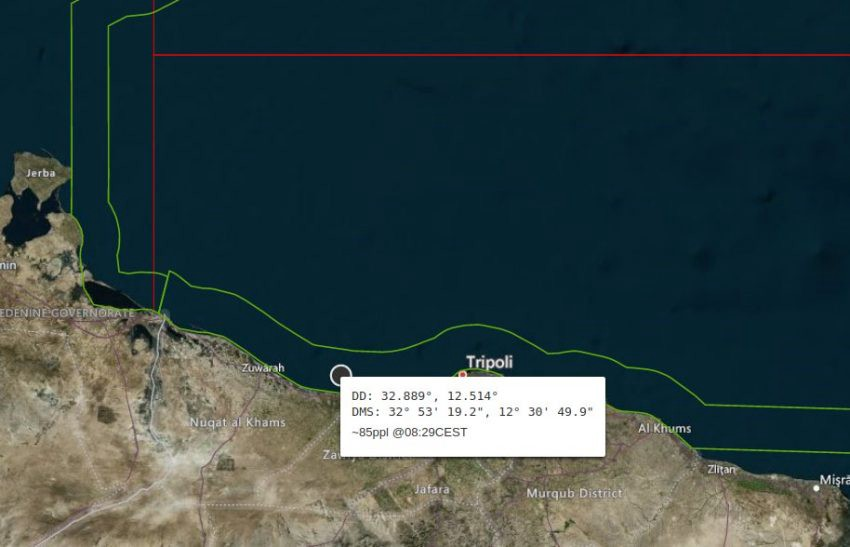

### AYS Daily Digest 30/03/2021: The Libyan coastguard’s nine telephone numbers
#### The aftermath of Johansson’s visit to Greece // Triggering pushback on Italian\-French border // Landings in Lampedusa // Historic ruling on eviction in Calais // Demonstration in Germany // Sweden deports people to Afghanistan
### FEATURE — Nine telephone numbers: Europe stands by as Libya, its henchman, kills people at sea

This is what a shipwreck looks like \(Photo: Alarm Phone\)

The story began yesterday, March 30, at 8 am, and what transpired over the course of the morning and afternoon played out, as it always does, in two distinct but intertwined realities: one reality, on the deck of an unseaworthy rubber boat crammed with some 88 people in a deepening state of unimaginable distress and panic; and the second reality, on the telephone lines, as activists from Alarm Phone sent updated GPS coordinates and distress signals to the Libyan coastguard, ultimately calling the coastguard on _nine different telephone numbers_ in a determined attempt to force authorities to step in and prevent dozens of unnecessary deaths\.

■■■■■■■■■■■■■■ 
> **[Alarm Phone](https://twitter.com/alarm_phone) @ Twitter Says:** 

> > 🔴 UPDATE: ONGOING SHIPWRECK off #Libya 

A few minutes ago, the ~85 people were screaming on the phone “we are dying!”. This morning, the sc. Libyan Coastguard told us that they would intervene, but nothing has happened since. They are ready to capture boats but never to rescue. 

> **Tweeted at [2021-03-30 14:29:56](https://twitter.com/alarm_phone/status/1376904529111875587).** 

■■■■■■■■■■■■■■ 

In the end, it appears the so\-called Libyan coastguard let some 85–88 people drown in the waters just 5 nautical miles of its shores\. \(Two women and three children had already gone overboard the partially\-deflated boat and drowned\. \) Why would Libya do this?

“\[Libya’s failure to intervene\] is not by accident or by lack of resources, but by design: it is the very deliberate consequence of the deadly migration regime that is building and financing them…The European border regime claims to be humanitarian, but it is not\. It is very clear that they pay the so called Libyan Coastguard to prevent people to reach European soil, even if this comes at the cost of human lives,” Alarm Phone explains in [a post about the shipwreck](https://alarmphone.org/en/2021/03/30/europe-watches-as-a-shipwreck-takes-place-off-the-coast-of-libya/?fbclid=IwAR0EVKUUGmvS9_khkAA7V93fSJaqG293Lr_1p2b_i87uElqOwhqS1Hy_xRo) \.

We at _Are You Syrious?_ feel it is important to highlight reports of each and every suspected and confirmed shipwreck, because even if the stories of these events bear great similarity to one another, the lives of those affected by Europe’s deadly border regime—men, women and children, to us, nameless and unknown—are distinct, individual, and always worthy of our attention\.

Although we may never know the names of the people who lost their lives in these shipwrecks, their stories are in a way our stories: their needless deaths reveal the truth about our lives and our Europe\. A country is only as good, and as just, as how it treats those who travel to its shores asking for nothing but a chance, a fair shot\. Thus, what this shipwreck and the countless others before it reveals to us is that our country, our Europe, is not the one we learned of in school, not the one our politicians praise, and far from the place we want it to be\.

Alarm Phone puts it best:

> Nobody can claim not to be informed or to not be aware of what is happening to migrants fleeing via Libya to search for a better life — day by day\. 

> The European states praise the so called Libyan Coastguard for their efforts to save lives, knowing very well that they do the exact opposite: they are the European tool to keep people on the move outside Europe, and to let them die\. 

> We will hold them accountable for every single life they take\. 

### GREECE

On Monday, March 29, EU home affairs commissioner Ylva Johansson visited the reception centres on Samos and Lesvos, her stated mission to learn how to prepare the camps for the next winter\.

In the wake of her visit, journalists, activists and camp residents spoke out about what her visit represents and what it portends:

■■■■■■■■■■■■■■ 
> **[Katy Fallon](https://twitter.com/katymfallon) @ Twitter Says:** 

> > I've just added this tweet to a thread about y/day but it merits more attention. A "press tour," which will be burned into my memory for a long long time. 

Seeing the gates close on people who have done nothing more than ask for asylum in Europe was a chilling end to the day. 

> **Tweeted at [2021-03-30 14:56:39](https://twitter.com/katymfallon/status/1376911255869472769).** 

■■■■■■■■■■■■■■ 

■■■■■■■■■■■■■■ 
> **[joel hernàndez](https://twitter.com/joelhdz) @ Twitter Says:** 

> > 6th year in a row that officials of 2 successive 🇬🇷 govts &amp; 2 successive 🇪🇺 Commissions make this promise.

Each of the last 5 winters facts spoke for themselves to show it to be either a bridge too far for the combined resources &amp; power of the EU or an outright lie.

#refugeesgr 

> **Tweeted at [2021-03-30 09:38:07](https://twitter.com/joelhdz/status/1376831092053962753).** 

■■■■■■■■■■■■■■ 

■■■■■■■■■■■■■■ 
> **[Parwana Amiri پروانه اميري](https://twitter.com/parwana_amiri) @ Twitter Says:** 

> > *As Eu commissioner for HOME affairs,how does camp defines a home?
*How will you define a place,that is surrounded by fences,closed and restricted?
*How long will we be represented,while we have our own voices?
*Camps will never change the perspective of locals about us! 

> **Tweeted at [2021-03-30 05:20:05](https://twitter.com/parwana_amiri/status/1376766157890461696).** 

■■■■■■■■■■■■■■ 

The legal organizations [Fenix Aid](https://www.fenixaid.org/post/five-years-of-unfortunate-events-or-deliberate-policy-making?fbclid=IwAR2bzJ1YiyY3-PrAkpOufVkz39P4uN9wKih11Rg91wTlrir6Q7dAUU84h2A) and [Legal Centre Lesvos](http://legalcentrelesvos.org/2021/03/30/spring-is-the-best-time-to-tour-europes-prison-islands-for-migrants-in-a-helicopter/?fbclid=IwAR3sCV3YufEhVp6c_P_GWwobH8Qm5P4hKLCluIQDHqAbDjBjXL1KzRrd2yc) each published blog posts commenting on Johansson’s visit\.

Fenix writes:

> Yesterday, in a fleeting 20 minute visit, the Commissioner, together with Greece’s Minister of Migration Notis Mitarakis, assessed Mavrovouni camp where asylum seekers have been forced to live for the past six months in horrifying conditions that she has described as “unfortunate”…This situation is not, as the EU Commissioner says, unfortunate\. On the contrary, it is the result of the systematic implementation of practices that contradict the most basic values and commitments that Europe claims to stand for\. 

Legal Centre Lesvos:

> There is no ‘solidarity’ in the European Commission’s new Pact\. Their vision is of a fortified, technocratic deportation machine whirring away on the borders of Europe, bankrolled by rich European nations ‘sponsoring’ poorer nations in the south of the EU and abroad to do the dirty work of detention and deportation for them, far enough away that the stink of dirty money never reaches Brussels\. 

Here is what the new camp on Lesvos, Mavrovouni, really looks like\. These are the photos Johansson doesn’t want Europe to see\.

Meanwhile, we are reminded that the Kara Tepe camp, one of the last humane places on Lesvos, [will close its doors at the end of April](https://www.stonisi.gr/post/15974/kleinei-o-kataylismos-toy-dhmoy-ston-kara-tepe?fbclid=IwAR1SgBB52rnaaOGoyIey3G4iUtHvrz1xvOAX75d-O1R59L4E7-ynryUtfaA) \. According to official data, 951 people currently live there, including families and vulnerable people\. They will be transferred from Lesvos before the camp’s closing\.
#### Joint action on pushbacks

Forty\-nine organizations have signed onto a joint action for the creation of an initiative related to pushbacks\.

> Several of the undersigned organizations have already submitted reports and complaints to international and European bodies, aiming at the effective investigation and prosecution of illegal push\-back practices\. In addition, we now call on civil society organisations and bodies to come together in an initiative to address the below demands to national, European and international bodies: 

> \-The immediate end of illegal push\-back practices that endanger the Rule of Law and fundamental human rights 

> \-The establishment of an independent mechanism for the systematic recording and substantiation of reported push\-back cases 

> \-The protection of the victims and the facilitation of their access to justice for the substantial investigation of their complaints 

> \-The protection of the organisations and citizens that record and publicise incidents of push\-backs 

Read the full press release and see the list of signatories [here](https://greekhelsinki.wordpress.com/2021/03/30/2-116/?fbclid=IwAR22rG8g26edeNcFJaFEDWrTcz_OIni2H-TVYUlapCli70bekEIu_h4IPio) \.
### ITALY
#### Triggering pushback on the Italian\-French border

A 10\-year\-old Afghan girl was hospitalized last weekend after she suffered a kind of post\-traumatic shock triggered during an encounter with French police in the Monginervo forest between France and Italy, [media](https://www.infomigrants.net/en/post/31206/afghan-girl-hospitalized-in-shock-after-border-pushback?fbclid=IwAR0lLFhDxFC__LWyU5p4r6n0N4vtGuB1yM5lyijVDF2GQoeJ6OGX0l_kZtw) reported\.

Only a few days before, the girl and her family were among those evicted from the shelter in Oulx, [which AYS reported on](https://medium.com/are-you-syrious/ays-weekend-digest-27-28-3-2021-italian-french-border-eviction-of-the-casa-cantoniera-ed26bf69273c?source=collection_category---5------2-----------------------) \.

The young girl had suffered head injuries by a bomb in Afghanistan when she was seven, and the experience of seeing men in uniforms carrying weapons in the dark mountains caused her to relive her past trauma\.

The girl became stiff and could not talk or move\. A neuropsychiatrist who examined her decided to hospitalize her, and she was sent to the Regina Margherita children’s hospital in Turin, Italy\.

“We were on the path when French police arrived\. They surrounded us and yelled at us to stop\. And I heard shots being fired…” the girl’s mother told Red Cross workers who, after the pushback, took them to the Massi di Oulx shelter in Turin’s upper Valle di Susa \(Susa Valley\) \. The French police deny they fired shots during the pushback\.

The girl and her father, mother and three younger siblings spent the weekend with a local family to recover from the episode\. The family wants to reach Germany, where they have relatives\.
#### Ventimiglia child space opens

In a bit of good news, a new space for children has opened in Ventimiglia, a city along Italy’s French border, according to [media](https://www.infomigrants.net/en/post/31209/ventimiglia-space-for-migrant-children-set-up?fbclid=IwAR1wlISDBxxkrXZUv3zIm5jbXZzjv5uzZCsemiCDBQTrRmezLDOKtVSrdhs) \.

Save the Children and Caritas Intemelia created the space to give children a calm place to play after long, exhausting journeys\. The center also provides a space to speak to parents and help match them with necessary services\.
#### Landings in Lampedusa

Several boats have arrived in Lampedusa over the past few days, [media](https://www.adnkronos.com/migranti-ancora-sbarchi-a-lampedusa-160-arrivi-in-poche-ore_74Omfu70NpWWMQEd9U0g7l?refresh_ce) have reported\. Eighty\-seven people arrived on March 29 in two different boats, following by a boat carrying 65 people, which was intercepted by the Guardia di Finanza\. Subsequently, 95 people were rescued\. Following an initial health triage, all of the people were taken to the hotspot in the Imbriacola district\.
### SERBIA

Serbia, with the highest per\-capita inoculation rate in mainland Europe, has begun vaccinating people\-on\-the\-move living in its camps\. [Watch this video from France24 to learn more\.](https://www.france24.com/en/europe/20210330-serbia-vaccinates-migrants-for-covid-19-after-successful-rollout-for-its-nationals)
### BOSNIA AND HERZEGOVINA

News from No Name Kitchen in Bihać:

More evidence of violent pushbacks along the Bosnia\-Croatia border:

### SPAIN
#### Spain’s new “Africa\-focused” foreign policy

In a bid to slow the number of people\-on\-the\-move coming to Spain, Prime Minister Pedro Sanchez has unveiled a new policy, “Africa Focus 2023” that aims to strengthen economic and institutional ties to various African countries, [media](https://www.infomigrants.net/en/post/31198/spain-plans-africa-focused-foreign-policy?fbclid=IwAR3gutri4s-TtDFTHa0Fq9IDREb8NkN-rT8O33xqOZPojPKJZCp1f-7dFDg) reported\.

At an event in Madrid, the start of a series of visits and meetings between officials from Spain and various African countries, Sanchez said he wanted to “turn this decade … into the decade of Spain in Africa,” [media](https://www.businessinsider.com/spain-targets-africa-in-boost-of-diplomatic-business-ties-2021-3?fbclid=IwAR3gutri4s-TtDFTHa0Fq9IDREb8NkN-rT8O33xqOZPojPKJZCp1f-7dFDg) reported\. Between April 7 and 9, Sanchez will visit both Senegal and Angola\.

The prime minister hopes that if Spanish companies invest more in Africa, young people will have more opportunities in their home countries and stop traveling to seek work in Spain, which Sanchez called “Europe’s southern gateway\.”

To learn more about Sanchez’s plans, see [here](https://www.politico.eu/article/spain-diplomacy-economic-ties-africa/) \.
### FRANCE
#### In historic ruling, eviction squashed in Calais

For the first time in Calais, a judge overturned an eviction ruling, saying that the evacuation of a camp of 200 people\-on\-the\-move was unjustified, [media](https://www.infomigrants.net/fr/post/31215/calais-la-justice-annule-l-expulsion-du-camp-bmx-une-premiere?fbclid=IwAR1SgBB52rnaaOGoyIey3G4iUtHvrz1xvOAX75d-O1R59L4E7-ynryUtfaA) reported\.

On March 15, the town hall of Calais submitted a petition for interim relief, demanding the eviction of camp known as “BMX,” where some 200 Africans lived, mainly Eritreans\. In an order issued on Friday, the judge ruled that the municipality had “not demonstrated the urgency,” nor provided adequate evidence that the people living in BMX posed a public health or safety risk\.

The municipality of Calais had said that the people\-on\-the\-move were camping “in precarious, unsuitable and dangerous positions,” and complained about the presence of smugglers and “regular brawls or altercations” at the site\.

“What a surprise\! It is the first time to our knowledge that justice has canceled an expulsion of this kind in Calais,” Margot Sifre, a lawyer at the Legal Cabin, told InfoMigrants\.

The NGO Collective Aid, which works in Calais, celebrated the news on their [Instagram](https://www.instagram.com/collectiveaidorg/p/Bp2ErH4HAiY/?hl=en) : “We are hopeful that this is the first of many rulings against evictions in Calais\.”

■■■■■■■■■■■■■■ 
> **[Human Rights Observers](https://twitter.com/HumanRightsObs) @ Twitter Says:** 

> > Ce matin à #Calais ont eu lieu 8 #expulsions de lieux de vie informels par les forces de l’ordre. 
•16 tentes et 9 bâches ont été saisies.

La lutte contre les points de #fixation est une violence #institutionnelle, perpétrée contre les personnes #exilées à la frontière. https://t.co/DpK8qNuJ9W 

> **Tweeted at [2021-03-24 19:03:33](https://twitter.com/humanrightsobs/status/1374799060805292032).** 

■■■■■■■■■■■■■■ 

#### French vineyard gives jobs to people\-on\-the\-move

Château Pédesclaux, a large winery in southwestern France, has launched a project in collaboration with an association of former professional rugby players to provide training and seasonal jobs to recognized refugees in its vineyards, [media](https://www.infomigrants.net/en/post/31208/refugees-in-france-pick-grapes-for-chateau-pedesclaux?fbclid=IwAR0aZel1CaQH6Het3CuZ7ytc-UYBLoxAA-WwdoqnLWPCSF52nTavaZJSX4Y) reported\.

Some 90 people have benefited from the program so far\.

“The employment potential in the vineyards is huge\. Viticulture, like everyone else in agriculture, has a shortage of labor and this lack has been exponential since the COVID crisis began,” said the association’s founder, Jean François Puech\.

“I have found a job, my children are in school\. I feel safe here,” a Sudanese man named Zakaria who now works in the vineyard said\.
### SWITZERLAND
#### Petition to take in 5,000 people stuck in Greece grows

Over 11,000 people have signed a petition to pressure the Swiss government to accept 5,000 people\-on\-the\-move from Greece, [media](http://www.bluewin.ch/de/news/international/petition-fordert-aufnahme-von-5000-gefluechteten-649057.html?fbclid=IwAR16yasocHBRoNn63-ufB061mQ_44LpmSV6o-2PJcLJ8AUMAldoOnnumOhQ) reported\.

The petition was organized by 17 doctors from Médecins Action Sante Migrant\-es \(MASM\) of the Vaud district, appealing in an open letter to Federal Councilor Cassis, the former canton doctor\.

“We demand from the Federal Council and former canton doctor Ignazio Cassis that Switzerland finally takes action, takes in refugees unbureaucratically and carries out their asylum procedures directly in Switzerland,” the initiators of the petition said\.
### GERMANY
#### Demonstration at CDU headquarters against EU asylum policy

A demonstration was held yesterday at the Berlin headquarters of the Christian Democratic Union \(CDU\) to protest the EU’s asylum policies, [media](https://www.statewatch.org/news/2021/march/germany-protest-against-european-asylum-and-migration-policies-at-christian-democratic-union-headquarters/?fbclid=IwAR1zx0xffWTAOxrHBY5UwJdEdba-HX8U1XJZAVVCvzxNcFRC0qY8LMMHHxQ) reported\. Germany’s chancellor Angela Merkel and European Commission president Ursula von der Leyen both belong to the CDU\.

A press release seen by media described the demonstration as targeting the “catastrophic and inhumane situation in camps at the European external borders,” and the EU’s asylum and migration policies more generally\.

Mud was distributed at the protest as a symbol for the inhuman conditions in Europe’s camps\. Signs reading “Open the borders\! — Stop killing refugees — No more Moria and Lipa\!” were installed on the facade of the CDU headquarters, linking the German government to the catastrophe of EU asylum policy\.
### SWEDEN
#### Deportations to Afghanistan

FARR, a Swedish network of organizations supporting people\-on\-the\-move, spoke out against a deportation to Afghanistan that took place last night\.

FARR’s [press release](https://www.mynewsdesk.com/se/farr/pressreleases/avbryt-omedelbart-den-planerande-tvaangsutvisningen-till-afghanistan-3086468?fbclid=IwAR2rBDS3DnZvi8GWAUYRGvqkscrQrIJwYAH9O2czoJAQz3MYTASakvy_kOw) reads:

> The planned deportation includes people who have [established themselves well in Sweden](https://www.expressen.se/nyheter/inlasta-pa-obestamd-tid-trots-att-de-levt-skotsamt/) \. Many have a job or studies in progress, they are integrated and have lived a normal life until the day they were taken into custody\. It is about young people, the sick, people with different types of disabilities\. Families split up when one parent is deported\. Sweden also expels Christians and LGBTQ people, groups who should already be provided with protection in the form of refugee status\. 

### UNITED KINGDOM

Interesting thoughts on the UK’s new migration pact from academics and experts:

■■■■■■■■■■■■■■ 
> **[Natasha Saunders](https://twitter.com/NEGSaunders) @ Twitter Says:** 

> > Reading the "New Plan for Immigration." ([assets.publishing.service.gov.uk/government/upl…](https://assets.publishing.service.gov.uk/government/uploads/system/uploads/attachment_data/file/972472/CCS207_CCS0820091708-001_Sovereign_Borders_FULL_v13__1_.pdf)) Among a litany of problematic constructions and provisions, here's one from p.18: 

"Make it possible for asylum claims to be processed outside the UK and in another country by amending sections 77 and 78 of 

> **Tweeted at [2021-03-30 11:16:26](https://twitter.com/negsaunders/status/1376855834169372678).** 

■■■■■■■■■■■■■■ 

■■■■■■■■■■■■■■ 
> **[Jeff Crisp](https://twitter.com/JFCrisp) @ Twitter Says:** 

> > Agree. In the UK's asylum-migration domain, research evidence is one of the least important drivers of government policy. In fact, policy often goes against the evidence and is justified by spurious and carefully manipulated 'data'. 

> **Tweeted at [2021-03-30 11:36:53](https://twitter.com/jfcrisp/status/1376860982094532618).** 

■■■■■■■■■■■■■■ 

### WORTH READING

The story of hotel owners on the Canary Islands who took in people\-on\-the\-move after the pandemic tanked their tourist season\.

[“Europe’s unsafe environment: migrant confinement under Covid\-19”](https://www.tandfonline.com/doi/abs/10.1080/21624887.2021.1904365?forwardService=showFullText&tokenAccess=8VREGT9AN8NVY5WJKRW2&tokenDomain=eprints&doi=10.1080%2F21624887.2021.1904365&target=10.1080%2F21624887.2021.1904365&journalCode=rcss20&fbclid=IwAR1HjQqwGHj04WTZ2uKPVzdJTnuamHJemSrzPTGiqEOY2o_hLJKrHJEUKn0) by Martina Tazzioli and Maurice Stierl in _Critical Studies on Security\._

An interview with Frontex head Fabrice Leggeri in which he says he fears “more refugees will come again after corona\.”

A roundtable talk from York University in Toronto today, March 31 at 17\.00 CET: “Investigating Frontex: How a reporting team put an EU super\-agency in the spotlight\.”

Panelists:
Daniel Howden, Director, Lighthouse Reports
Nick Waters, Lead investigator, Bellingcat
Steffen Lüdke, Reporter, Der Spiegel
Katy Fallon, Reporter, The Guardian \(freelance\)

Moderator: Petra Molnar, The Migration Tech Monitor

Register at [this link](https://yorku.zoom.us/meeting/register/tJ0sdeCrqDwrGNHtYVgk6BCdyjRaF0Dk9zEM?fbclid=IwAR3B22QyNfF1ZcfenZ9uD7Nv9J8c3F3eUnVp9fz4ALB0vl2UargwphD4uwU) \.

**Find daily updates and special reports on our [Medium page](https://medium.com/are-you-syrious) \.**

**If you wish to contribute, either by writing a report or a story, or by joining the info gathering team, please let us know\.**

**We strive to echo correct news from the ground through collaboration and fairness\. Every effort has been made to credit organisations and individuals with regard to the supply of information, video, and photo material \(in cases where the source wanted to be accredited\) \. Please notify us regarding corrections\.**

**If there’s anything you want to share or comment, contact us through Facebook, Twitter or write to: areyousyrious@gmail\.com**

_Converted [Medium Post](https://medium.com/are-you-syrious/ays-daily-digest-30-03-the-libyan-coastguards-nine-telephone-numbers-b717859c5971) by [ZMediumToMarkdown](https://github.com/ZhgChgLi/ZMediumToMarkdown)._
