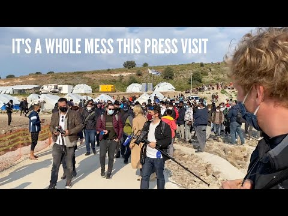

### AYS Daily Digest 31/3/21: A positive decision at the end of a case that never should have existed
#### **Herrou** acquitted of charges **/ Will Greece really provide vaccination for everyone in camps? / Relocations from Greece to Germany not a solution for \(too\) many / Officials destroying the only remaining shelter over people’s heads in Calais area / Germany: A refugee support organization and a Catholic priest condemned deportations to Sri Lanka / recommended reads**

 via [@daphnetoli](https://twitter.com/daphnetoli)](assets/a7d92727be82/1*QBiE-Ji9M-z2Z5ecxQr4iw.jpeg)

Artwork by [@obbalkan](https://twitter.com/obbalkan) via [@daphnetoli](https://twitter.com/daphnetoli)
#### FEATURED — How acts of solidarity have become criminalized across Europe

](assets/a7d92727be82/0*kcDQIdRz1BN1PhM0)

Photo via [@StefSimanowitz](https://twitter.com/StefSimanowitz)

The case of Cédric Herrou that we have been reporting on throughout last year has become the illustration of the current state of things when it comes to criminalizing solidarity in Europe\.

After he was acquitted of the charges of facilitating illegal migration, the Lyon Public Prosecutor appealed to the Supreme Court\. Between 2017 and 2020 he was arrested eleven times\.
Now that he has once again been acquitted, many claim that “French law should be amended to ensure that only smuggling, entailing a material benefit, be regarded an offence”\.

> Solidarity acts are still criminalized and French legislation is still at odds with international law, as it punishes acts of solidarity\. — [AI](https://www.amnesty.org/en/latest/news/2020/05/france-acquittal-of-farmer-who-helped-asylum-seekers-shows-that-solidarity-is-not-a-crime/) 

In light of the many failures by the state, the systems, and the big international organisations \(in most cases\), the activists and other volunteers have been taking upon themselves the crucial role of providing direct support to the people in need, placing themselves not only in the active role of human rights defenders, but recently more and more also at \(ever higher\) risk\.

> Providing food to the hungry and warmth to the homeless have become increasingly risky activities\. Rather than recognizing the importance of their work, the authorities are [increasingly treating human rights defenders as meddlers, trouble\-makers — even criminals](https://www.newsweek.com/you-can-now-go-jail-offering-food-shelter-migrant-what-have-we-become-1442278) \. 

The criminalization of solidarity is not only a “hot topic” in \(too\) many online discussions and all sorts of EU bodies’ forums, but this is a harsh reality many people are facing, and is definitely not restricted to France\.

> This is part of a disturbing trend across Europe where NGOs are attacked and people showing compassion are stigmatized\. A [study](https://www.opendemocracy.net/en/5050/hundreds-of-europeans-criminalised-for-helping-migrants-new-data-shows-as-far-right-aims-to-win-big-in-european-elections/) by Open Democracy this month found that 250 people across Europe have been arrested or criminalized for providing food, shelter and transport and other “basic acts of human kindness” to migrants over the last five years, _writes Stefan Simanowitz\._ 

#### GREECE
### Coronavirus vaccination announced after outbreak in the camps?

As some of the groups and many people staying at the reception camps across Greece have been warning for a while now, the confirmation arrives to support claims that not enough has been done when it comes to protection measures for the health benefit of the camp residents and those in other facilities and places around it\. It was confirmed that the staff of Kara Tepe is going through a COVID\-19 outbreak, leaving many people worried who can’t escape or choose other place to stay\.

> So if workers are infected what about the refugees? And also we have been warning about this risk for a long time\. No one really seems to care: Volunteers make parties and come the next day into the camp and now this\. — [_Moria Corona Awareness Team_](https://web.facebook.com/MoriaCoronaAwarenessTeam/?__cft__[0]=AZUhD6c89aj9LoHshT-MOKkXFzRyNoRMYMGrtBjXEVufVGWBJhwHyKRVwwmeRvMY0EsI6kf8fl1ssldyDzZ4Ysbp6twozd6xanbcCWDFRSHT52wzYvFep6yR4mhHXgkj3GwBRP2kZFZa3-SKaO2z5G0b&__tn__=-UC%2CP-R) 

The workers at the camp have also complained about the conditions they work in and have demanded “immediate measures for the protection of the health and safety of the employees in the workplaces and of all the people, with strict observance of the health protocols”\. They insist on “carrying out free tests for employees, paid leave in vulnerable groups and in positive cases”\.

Greece has now announced that the National Public Health Organization \(NPHO\) will vaccinate residents in 34 reception centers, six reception and identification centers and eight so\-called pre\-removal centers\.

While the beneficiaries of international protection fall within the general population priorities when it comes to EU vaccination policies in the context of asylum seekers, the applicants for international protection may be prioritized due to the collective reception setting\. So far, Switzerland and Portugal have been the only countries providing vaccinations in reception centres\. According to the latest EASO report, Belgium, Denmark, Finland, France, Greece, Hungary, Iceland, Ireland, Latvia, Liechtenstein, Luxembourg, Netherlands, Norway, Poland, Portugal, Romania, Slovakia, Slovenia, Sweden and Switzerland have confirmed that the vaccination of applicants for international protection will be offered free of charge as the cost is covered by state funds\. Find more information relevant for COVID\-19 vaccination here:

### Relocation update

](assets/a7d92727be82/0*D6X-dv46Lp6cz3l3)

Find the factsheet [here](http://bit.ly/3fxNdmO)

120 people arrived at Hanover Airport\.

There are 30 families with 59 adults and 61 minors\. All persons are from a group whose protection entitlement has already been determined by the competent Greek authorities, r [eported](https://www.bmi.bund.de/SharedDocs/pressemitteilungen/DE/2021/03/Ankunft-grc-20210331.html?fbclid=IwAR2qApT6uDCrPrXuRy0UIrqT-8KV8RJ7wpW4GnbgReS7CnpSTQCXaxoUWEg) German media\.

> The families are being taken in by the federal states of Berlin, Brandenburg, Bremen, Hamburg, Hesse, Lower Saxony, North Rhine\-Westphalia, Rhineland\-Palatinate and Thuringia\. 

Since April 2020, Germany has taken in a total of 2,662 people from Greece\.

Find a feature story on relocations from Greece to Germany [**here**](https://www.zeit.de/politik/ausland/2021-03/flucht-lesbos-gefluechtete-transfer-deutschland-migration-fluechtlingshilfswerk?fbclid=IwAR3YWoF7KExOqDzku--6LwHCxXZHdKvv5NY630BbL8bAgpGdDS--ABcltQs) \.
#### FRANCE
### Calais — Nowhere to lay one’s head

For the past few months, around 70 people have had to use the rooftop of a nearby abandoned shop warehouse as a shelter\. As the [activists](https://web.facebook.com/care4calais/?__cft__[0]=AZWxQqLy6_cQM07UrqWMdibuXx4JGXpbIKZkjloy1xi99J02wbY1yMawGK41CcA9bxuixeFZ-3ChEXJQUP1eu7mS1m-dtjw1eDkxqIfPXwqWp4MC-a7c3qtyoMbJsnC_fZJXP-lSSqDUqCH30khBWWyYSiyjE09ZC4nctfFmvBom2K1-yBcvhqFjYPk211BVzVEnBDBcw9kzW2WD2Fv5w2-E&__tn__=-UC%2CP-y-R) in the Calais area write, “every bit of land around and trees have been cut down and fences have been put up so no one can sleep rough there\. People are not allowed to have tents\. They’re lucky to have sleeping bags”\. They have been sleeping on the hard floor until the morning when police vans turned up and rounded people up and took their belongings\.

> Then, to deny them the only bit of shelter, bulldozers arrived and placed massive rocks under so that no one can sleep there anymore\. 

If you want to help or support teams on the field across the northern area as well as around Paris, one of the options is to join or support Utopia56 teams\.
Find a recent video on the Facebook page [Utopia 56 Grande\-Synthe](https://web.facebook.com/utopia56grandesynthe/?__cft__[0]=AZWS-pjR-fZGN1qojuCDRUWAL8Qr-hwAlKhWP8HGCGODKSPzaGV4_4UZZm_5x9_P06t7vp4qokaOR4ftf7SphXCkUEZ1ou4ZHoILGRRTrJGgNm63NyKueEaIVWGLuDn1xvKzuvZzr3Bss6XcWY3Y1F_ZjZszwZEPr59p069S00O0CA&__tn__=-UC-R) , and you can reach them at: utopia56\.gs@gmail\.com

No demolition has ever ended the plight of people who seek life in a safe place\.
#### GERMANY
### 50 people gathered at the airport demanding a stop to deportations to Sri Lanka

Nearly 200 people had already protested on Sunday in front of the deportation detention center in Büren against the measure of deporting 24 Tamils from Germany to Sri Lanka\. Members of this ethnic minority face danger if they are sent back to a country where war has been raging for 27 years now\. Although the Human Rights Council of the UN spoke of a “deteriorating situation” in Sri Lanka and criticized “the erosion of judicial independence, marginalisation of minorities and impunity,” the inhumane deportations to Sri Lanka continue\. One of the most vocal protests against the practice of deportations was an open letter to German Interior Minister Horst Seehofer by a Catholic priest who [denounced this dangerous decision](https://www.infomigrants.net/en/post/31241/germany-collective-deportation-of-tamils-to-sri-lanka-met-with-outrage?fbclid=IwAR357TEBk53yJA0SKcgQYCogrLozkEv0NfpzotkyyGhkgIpE0XtmabMBslc) \.
#### UK
### Settling in Wales after a long journey

A short documentary explores how the community in an ex\-mining town in south Powys has welcomed people fleeing persecution and war\. _Refuge_ follows Aboudi and Ahmad Sattouf, teenage brothers whose family fled the civil war in Syria, finding temporary solace in Lebanon before being settled in Wales\. Now living in Ystradgynlais, the brothers share their experiences of the conflict and their journey to Wales\.

[](https://l.facebook.com/l.php?u=https%3A%2F%2Fwww.countytimes.co.uk%2Fnews%2F19197885.new-bbc-film-refugees-welcomed-ystradgynlais%2F%3Ffbclid%3DIwAR1IjUQqTCtJHTmJR0wyqi8NmV0SrNhlJrDUztDUhi5JubPsra92vTgUDq4&h=AT214J0VBWdswu1JGaLSh-Kpb0XGqf2UliTl1PtcsBRIaEihgOSS8Nwi9unMFkD8Am7hl2LMYXTjB_73v98WlUe2wszy8A7Shb5LrxFB_zXzm0KzESURftk6WCeOVPyy3LKRNTKGxHXTYA&__tn__=R]-R&c[0]=AT0iWSN8QGPlqtAYJ_DGL0Fd87Ih10fDKk2vSthWnRjeumM-d6ug6m8sQedK1WX0sgAA4uPscIf_8FnJe5wO5SJ3dJ21IrVcJXW33-wjnT09OegX--Ycog9z9LhZ48rMXQCFyYFXmrX9MqN9sF7if8oYacrbIhydlDoODev_MBuQOApKjt-PPnmpmpg0OF3cVb7Y4xYKF4pMfPLNCg)

### Do you need help applying for asylum?

[UKLGIG](https://twitter.com/UKLGIG) ’s ‘ **How to Apply for Asylum Guides** ’ are available in nine languages\. They explain the whole asylum process, starting with how to find a lawyer\.

Read the guide: [http://bit\.ly/HowToApplyForAsylum…](https://t.co/klBNNMrjWI?amp=1)

Watch the videos: [https://bit\.ly/AsylumVideos](https://t.co/5d1I8rz1Ta?amp=1)
#### FOR FURTHER READING
- The EU ships in the Mediterranean no longer patrol along the migration routes\. The consequence: the new mission has not saved any people so far\.

[](https://l.facebook.com/l.php?u=https%3A%2F%2Fwww.spiegel.de%2Fpolitik%2Fausland%2Fschiffe-der-eu-mission-irini-retten-keine-migranten-a-1f0fc8a7-22ea-4c3f-ae51-25fb852d2708%3Ffbclid%3DIwAR1FiBSBEPtjvpDJOJ4iv4Bbq_EF3BtxU5cXaQ2rCc1OF7sOSB8DQadgPac&h=AT2YsCsFrDe_Nk0ez22qY4EtMqXvHLIY_JGKiyfOfs0H2XoH4puGUaZUtrUaDo3qqbGvG8A7FT6jIr9k5tHymCk216MK9VihxyQWTx34KILxb7O0m4djHQcUO3qKL9L1Dg&__tn__=%2CmH-R&c[0]=AT1SNu8_H-yRgA2BEajj0D9f7iR_WV6jGYCRe9zi-QP6kBad3Md8yUwagI5DDBcG_pXB_b3zYje6x5xTzIoQtr-fty40zv3iAsmXryL7ZaNCSL74ubAfek1ACSywS8wPs1pydTKNCubZnyJIE1X-guMZQEyoSv8RUY0u2KT61YyoCGh4697YKkCMxLKOM-plisBervWDerDxdPYQXw)

- _For Women’s History Month, [Migrant Women Press](https://migrantwomenpress.com/) and the Guiti News [English Editorial Team](https://guitinews.fr/category/around-the-world/) have put together a quiz around the specific issues women face during their migration journeys:_

- for all those wishing to show up at a camp and _do a story_ , a short reminder:

**Find daily updates and special reports on our [Medium page](https://medium.com/are-you-syrious) \.**

**If you wish to contribute, either by writing a report or a story, or by joining the info gathering team, please let us know\.**

**We strive to echo correct news from the ground through collaboration and fairness\. Every effort has been made to credit organisations and individuals with regard to the supply of information, video, and photo material \(in cases where the source wanted to be accredited\) \. Please notify us regarding corrections\.**

**If there’s anything you want to share or comment, contact us through Facebook, Twitter or write to: areyousyrious@gmail\.com**

_Converted [Medium Post](https://medium.com/are-you-syrious/ays-daily-digest-31-3-21-a-positive-decision-at-the-end-of-a-case-that-never-should-have-existed-a7d92727be82) by [ZMediumToMarkdown](https://github.com/ZhgChgLi/ZMediumToMarkdown)._
