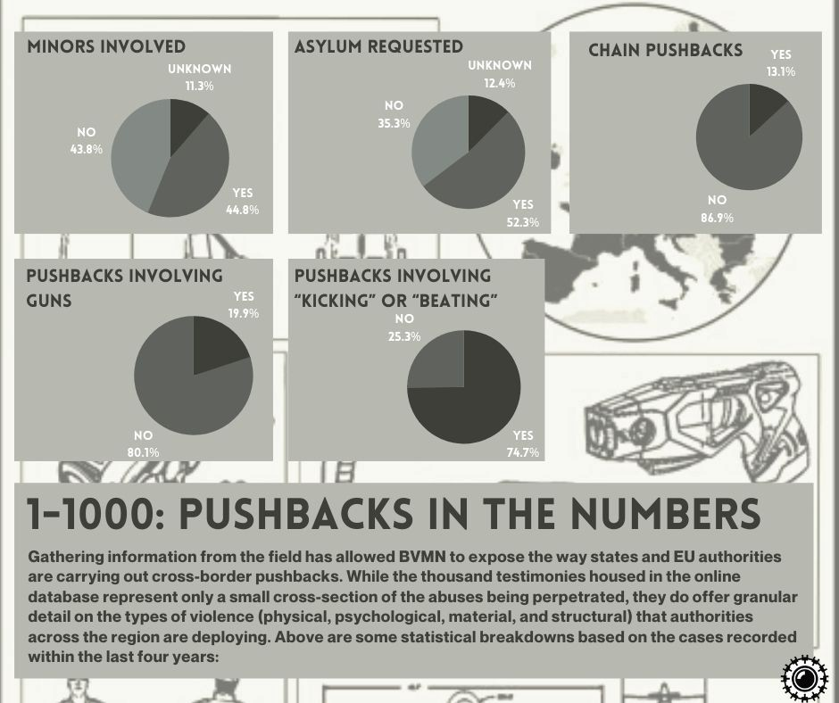

### AYS Weekend Digest 3\-4/4/2021: Another Easter Tragedy Narrowly Avoided

Alan Kurdi court case // Kos coroner report // Updates from Lesvos and Chios // Corona cases in Ritsona camp // New Social Centre in Athens // Rally in Paris for Requisitions Collective // Journalist at risk of deportation to Afghanistan // Syrian dies in Denmark after being told to return…

 \)](assets/7585fa10599b/1*APIT4HXnG8LfA00n90rolw.jpeg)

Protestors kneel along Patision Street in downtown Athens during a demonstration on Saturday following the death of two people on the move in Greece — Macky Diabaté, a 44 year\-old man from Guinea, and Ibrahim Ergun, a 24 year\-old Kurdish man from Turkey\. \(credit: [Gabriel Green](https://twitter.com/gggreen14/status/1378803559253299202/photo/1) \)
#### FEATURED: Another Easter tragedy narrowly avoided

Of the 270 people in 3 boats we reported as in distress in the Maltese SAR zone [in Friday’s digest](ays-daily-digest-02-04-2021-europe-dont-let-there-be-another-easter-tragedy-c7ee666a26cc) , 2 boats, carrying 60 and 110 people, were rescued by Italian Authorities and taken to Lampedusa\. However, the fate of the remaining boat carrying 100 people is less clear\.

■■■■■■■■■■■■■■ 
> **[Sea-Watch International](https://twitter.com/seawatch_intl) @ Twitter Says:** 

> > @[[alarm_phone](https://twitter.com/alarm_phone)](https://twitter.com/[alarm_phone](https://twitter.com/alarm_phone)) @[Armed_Forces_MT](https://twitter.com/Armed_Forces_MT) Today #Moonbird searched in vain for ~100 people spotted yesterday after @[[alarm_phone](https://twitter.com/alarm_phone)](https://twitter.com/[alarm_phone](https://twitter.com/alarm_phone))'s SOS and of whom there is no more news.
Yesterday the #NordicStar was instructed to move away after the arrival of a Maltese patrol boat but there is no news of any people disembarked in Malta. https://t.co/ECSATJOGTF 

> **Tweeted at [2021-04-03 19:08:31](https://twitter.com/seawatch_intl/status/1378424191381352448).** 

■■■■■■■■■■■■■■ 

Sea Watch believe they could also have been evacuated to Italy:

■■■■■■■■■■■■■■ 
> **[Sea-Watch International](https://twitter.com/seawatch_intl) @ Twitter Says:** 

> > @[alarm_phone](https://twitter.com/alarm_phone) @[Armed_Forces_MT](https://twitter.com/Armed_Forces_MT) We assume the people on board of the third boat sighted yesterday, have been brought to safety in Lampedusa, as the #Moonbird crew spotted an empty boat equal to the one they saw yesterday.
Again the pressure of the civil society was needed to push states to do their duty. https://t.co/clJt3i8MIx 

> **Tweeted at [2021-04-03 19:09:06](https://twitter.com/seawatch_intl/status/1378424336458072067).** 

■■■■■■■■■■■■■■ 

Local NGOs are accusing the [Maltese Government of criminal behaviour](https://twitter.com/seawatch_intl/status/1378424191381352448) as they purposefully refused to intervene, once again putting people’s lives at risk\.

SEA
#### **Alan Kurdi court case**

[Sea\-eye report that](https://sea-eye.org/en/systematic-attacks-on-sea-rescuers-continue/?fbclid=IwAR0HbWxcus5vLnEF4k0u2Y6as1zbL_ii0-q6R3aNhMJzNj-2S4Hk3WZzvLE) , on April 7, 2021, the court hearing for the release of the rescue ship Alan Kurdi will take place in Cagliari, Sardinia\.

> The Italian coast guard had the ship detained on October 9, 2020 in Olbia, Sardinia, after it had rescued 133 people, including 62 minors, in three successful rescue operations\. 

GREECE
#### Updates from Kos

A coroner’s report confirmed that Macky Diabaté died of intestinal obstruction on Thursday in the detention centre \(PRO\.KE\.KA\) on Kos island\. [According to](https://www.efsyn.gr/node/288439) Greek media, Diabaté had previously undergone surgery on his abdomen, which created adhesions, resulting in his intestinal obstruction and his death in the early hours of Thursday\. As we reported, Diabaté had asked to be taken to an hospital many times in the previous days because of acute pain, but this never happened and he was given painkillers by the PRO\.KE\.KA staff\.

Despite appearing less in the news, conditions at Kos hotspots have not improved\. [According to](https://infocrisis.gov.gr/12765/apotyposi-tis-ethnikis-eikonas-katastasis-gia-to-prosfygiko-metanasteftiko-zitima-tin-01-04-2021/) government data, 106 people still live inside the camp\. A video from a tent in the camp shows a scorpion found near a family’s living space\.

■■■■■■■■■■■■■■ 
> **[أيهاالعالم نحن هنا .. 00:00👇](https://twitter.com/NAHNO___HONA) @ Twitter Says:** 

> > #صور_من_حياة_اللاجئين
#اليونان 
عقرب في الخيمة .. قصة سأكتب عنها يوما ما .
تخيل كيف هي الحياة في مثل هذه الظروف ..
النوم اصبح عندي شيء من العذاب .
لك أن تتخيل أن تنام في خيمة يسكن معك فيها عقرب .. https://t.co/JEU7SqTUIV 

> **Tweeted at [2021-04-04 11:47:56](https://twitter.com/nahno___hona/status/1378675703214964740).** 

■■■■■■■■■■■■■■ 

#### Updates from Chios

A local activist [reports](https://twitter.com/Theurgia_Goetia/status/1378621776180224003) that on Saturday night, a person on the move was taken to the island’s hospital, after having been attacked and kicked by the passenger of a motorbike\.
#### Updates from Lesvos

Moria2\.0 workers complained that mass testing of camp’s residents has been [halted](https://www.politikalesvos.gr/choris-mazika-test-o-kara-tepe/?fbclid=IwAR1G6hBm6tiWV6VTd1NljBydG4Pv9az5GMGGydiHe2UvH4-ftAOfLDvFMBI) without notice, local media report\. A test facility had been operated by the WHO, but they left in March, following an agreement for which Greek National Public Health Organisation \(EODY\) would continue the mass testing of all residents\. According to local workers, who announced a protest, this never happened\.
#### Updates from Ritsona

■■■■■■■■■■■■■■ 
> **[Parwana Amiri پروانه اميري](https://twitter.com/parwana_amiri) @ Twitter Says:** 

> > More number of positive #coronavirus cases is getting recognised in #ritsonacamp ,everyone is worry as infected ones are not isolated and two families are living together.
Last night two and yesterday more...
What will happen to us?
Will we be next ones?
#vaccination https://t.co/tR4LrFHKFy 

> **Tweeted at [2021-04-03 05:54:13](https://twitter.com/parwana_amiri/status/1378224297173483521).** 

■■■■■■■■■■■■■■ 

#### Updates from Athens

 \)](assets/7585fa10599b/1*oxzOKms9xjeJA6MsKDneGw.jpeg)

New squatted social centre Zizania, in the Viktoria area in Athens \(credit: [Anti\-Covid19 — Δίκτυο Αλληλοβοήθειας και Αγώνα](https://www.facebook.com/AntiCovidAidNetwork/?__cft__[0]=AZUj4JL3PxoEOJU8fW4JesIxhtBGs2urU8n4kNmKxCQEpzQ-yfgG-hpN0ArhebPEqslHBjva4njuWv4HHdq9yzTPg2bCvNICgo4XSmfvft8yCM5ouo0UfdiChIDN_ECyFXumoXAvjXtUh871JKBVvKbU&__tn__=-UC*F) \)

> Viktoria has a new squatted social centre — Ζιζάνια\. May it be a neighbourhood space for self\-organisation, social interventions, collective resistance and community building\. 

> …We envision a space of interaction and exchange between people of different backgrounds, origins, identities and ages, who speak different languages and have different opinions\. These are conditions we must create and concretise together, through meeting each other, strengthening relationships inside and between our communities and connecting our struggles\. 

> … We have called ourselves Ζιζάνια because like weeds, we grow and flourish amidst the chaos, against all control, time and time again\. \( [Indymedia Athens](https://athens.indymedia.org//post/1611757/) \) 

The new space was taken on Saturday and [activities will take place throughout the week](https://www.facebook.com/ViktoriaSolidarity/photos/a.105437107900790/254228716354961/) :

> Tuesday 6/4, h17\.00: movie screening: Police Identities 

> Wednesday 7/4, h15\.00: free\-shop 

> Thursday 8/4, h18\.00: cafe 

> Friday 9/4, h17\.00: discussion with housing union from Barcelona 

> Saturday 10/4, h13\.00: discussion for the creation of a translation group in the neighbourhood 

> Sunday 11/4, h13\.00: Opening of the Zizania\-Library, offers of books, brochures, materials welcome\! \+ h15\.00: General assembly\. 

Check out an article [HERE](https://journals.sagepub.com/doi/full/10.1177/0042098021997009) on the important claims of the _right to the city_ raised by newly arrived people on the move in Athens\. “Although most refugees reside in overcrowded state\-run camps on the outskirts of the city, there are many cases in which refugees enact the production of collective common spaces, occupying abandoned buildings in the urban core and claiming the right to the centre of the city\.”
#### Updates from Fylakio in Evros

Researcher Lena K\. [reports](https://twitter.com/lk2015r/status/1378303519053205505) that the president of the Ainisio Delta association filed a legal complaint calling for the hotspot and detention centre to be closed as it doesn’t have a biological waste processing plant, so it pollutes nearby fields and ‘degrades the environment’\.

SPAIN
#### The Red Cross accused of ignoring medical requests at Las Raices, Tenerife\.

The Tenerife Migrant Support Assembly is [holding](https://twitter.com/AsambleaMigraTF/status/1378734795337961472/photo/1) a protest against the “criminal management of the Red Cross of the most vulnerable people: women and children\.”

[Reportedly](https://twitter.com/AsambleaMigraTF/status/1378734125197234177) , the activists had to take several children with fever to the hospital after the Red Cross workers refused to do so\.

> There are women in the red cross facility who are pregnant who are not being monitored for their delivery\. The red cross does not attend to them\. There are people with epilepsy and the red cross does not give them their medication\. [_\(source\)_](https://twitter.com/AsambleaMigraTF/status/1378734283708375041) 

People in Las Raices have been [protesting](https://twitter.com/AsambleaMigraTF/status/1378734621018439683) for weeks now against poor food, poor health care, lack of leisure activities and lack of schooling for children in the camp\.

BOSNIA
#### **Corona cases in Miral camp**

At the Miral refugee camp in Velika Kladua, [135 people out of approximately 800](https://www.istraga.ba/u-kampu-miral-kod-velike-kladuse-virusom-korona-zarazeno-135-migranata/) have tested positive for the coronavirus\. [They are isolated in the camp, there are currently no serious cases](https://l.facebook.com/l.php?u=https%3A%2F%2Ftwitter.com%2FSrdjanGovedrica%2Fstatus%2F1378349665616330754%3Ffbclid%3DIwAR2bMF854D1h203Bctq8sBF1qBMaUY1afJMONxy42Ju0ch2CK-rRhwz0cV0&h=AT3T-1K6jDunjUTECuodvRE1Vi2U0bfSP56oHgUUCXO3tr3Y-huzVi7DFbl5FGiSEsCFabENVS3JQ4XPBbQQndagMpDYnIByKzXNoSqKtpj9nD-SL2Si9aSqQdyB8TMbhw&__tn__=R]-R&c[0]=AT30gQ6vojGukBl8847Y07w3jHEzAA_2EcK9ve5zwNGfFi8aVUHnN8a5V1AIWKHhGYyW21RVIUkRten3-VDOre3iDmwBNfrXJO8P6IEWyVd0zqnL7zoQTnHIRSWIgK3ccky9qDXJlSZzABZKUXPcFH92m3we2oeqlYWaccsgfNXc4CB_aHUHLnYwTUafLI8Mhww-mtmFuPQ) , according to the immigration office in Sarajevo\.

[According to the IOM](https://bih.iom.int/sites/default/files/2021/Sitrep/IOM%20BiH%20External%20Sitrep_27%20March%202%20April_Final%20version_0.pdf) , which runs the camp, the situation is under control\. Those infected are under medical supervision, the camp staff are adequately equipped with protective clothing, the camp residents with protective masks\.

Humanitarian workers and activists have been warning for some time about terrible conditions in the camp and the risks this poses:

> It has been more than a year since this [\#pandemic](https://twitter.com/hashtag/pandemic?src=hashtag_click) is known\. We know that it kills people and we know that one of the best ways to avoid \[contagion\] is social distancing and hygiene\. European Union knows clearly that the [\#RefugeeCamps](https://twitter.com/hashtag/RefugeeCamps?src=hashtag_click) cannot assure a decent live standards — [_NNK_](https://twitter.com/NoNameKitchen1/status/1378329469535059969) 

TRC Miral and Sedra in Una\-Sana Canton \(USC\) are now under a 14 day quarantine\.

GERMANY
#### **38th deportation flight to Afghanistan**

■■■■■■■■■■■■■■ 
> **[Bayerischer Flüchtlingsrat](https://twitter.com/BFR_089) @ Twitter Says:** 

> > Am Dienstag soll der 38. Sammelabschiebeflug nach Afghanistan gehen. Bundesweit gibt es in einigen Städten Proteste dagegen. Stoppt die Abschiebungen nach Afghanistan! #afghanistannotsafe https://t.co/EKzNUw4UOw 

> **Tweeted at [2021-04-02 07:06:33](https://twitter.com/bfr_089/status/1377880112272662528).** 

■■■■■■■■■■■■■■ 

FRANCE
#### **Rally in support of the Requisitions collective**

[8 activists and officials of the Collective](https://www.parisdexil.org/post/rassemblement-de-soutien-au-collectif-r%C3%A9quisitions?fbclid=IwAR1vZM_-IAY9igoA3g1v-t9BKt4UdapwUz3kMFI-d6qkJaOs2DiTUzT9u-E) are summoned by the police for alleged _“violence and degradation during the manifestation of occupation of the Hôtel Dieu”_ which they requisitioned to house homeless people during winter\.

The Rally in support of the collective will be held on Thursday, April 8 at 9am in front of the 14th precinct, 15 General Leclerc Avenue, Denfert\-Rochereau\. Bring your breakfast\.
#### **Journalist as Risk of Deportation**

27\-year\-old Elyaas Ehsas, an Afghan journalist, left his home country in 2015 after serving as a war reporter for the Rah\-e\-Farda television channel\.

> As a journalist, I was threatened with death by the Taliban\. 

And now he is threatened by the French state with deportation\. Sign the petition [HERE](https://www.change.org/p/le-journaliste-afghan-elyaas-ehsas-ne-doit-pas-%C3%AAtre-expuls%C3%A9-non-%C3%A0-l-expulsion-dur) \.

■■■■■■■■■■■■■■ 
> **[Mortaza](https://twitter.com/mortazabehboudi) @ Twitter Says:** 

> > Protégeons les journalistes, protégeons la liberté de la presse et la démocratie en France ! Signons. https://t.co/AkMP76KvAG 

> **Tweeted at [2021-04-03 09:10:24](https://twitter.com/mortazabehboudi/status/1378273669613551619).** 

■■■■■■■■■■■■■■ 

#### **Case against activist dismissed**

[Refugee rights activist Loan Torondel](https://france3-regions.francetvinfo.fr/hauts-de-france/pas-calais/calais/calais-le-militant-coupable-de-diffamation-en-2018-mis-hors-de-cause-apres-la-relaxe-de-la-cour-de-cassation-2028469.html?fbclid=IwAR22x-GZ6m0SnrWpX_BnijlHCyqTg4S2Gl09EaNgFnv5j1_Nt1UWzJc5EF4) was convicted in September 2018 for defamation after an ironic tweet aimed at CRS\. The Court of Cassation on Tuesday \(March 30th\) overturned the 24\-year\-old’s conviction\.

DENMARK
#### **Syrian dies after being told to return**

 \)](assets/7585fa10599b/1*p0ysc6S14r-H9A9ajKb1fg.jpeg)

\(Akram\. Photo Credit: [Ghassan Abrahem](https://www.facebook.com/ghassan.abrahem?__cft__[0]=AZVxa8oGfguk2rmlxB3QODhd9dFD968RB6grXB0CZZQJIW10A3q6t5vI2wrS3LfCygZ3hIc8wwu4nH3mEvwsjNuVxLqnQy6H2x9FiYmjfQx9pp5hAedTMUS0YEdcYnsHxKk&__tn__=-UC%2CP-R) \)

Akram, a Syrian refugee living in Denmark died of a heart attack on Friday after receiving a letter from the immigration board saying that he can no longer stay in Denmark, and that he has to return to Syria\. As [Ghassan Abrahem](https://www.facebook.com/ghassan.abrahem?__cft__[0]=AZVxa8oGfguk2rmlxB3QODhd9dFD968RB6grXB0CZZQJIW10A3q6t5vI2wrS3LfCygZ3hIc8wwu4nH3mEvwsjNuVxLqnQy6H2x9FiYmjfQx9pp5hAedTMUS0YEdcYnsHxKk&__tn__=-UC%2CP-R) writes:

> Sorry friend, I couldn’t do anything, I still can’t\! RIP\. 

EU
#### **BVMN records 1000th pushback**

Read full report [HERE](https://www.borderviolence.eu/violence-in-numbers-1000th-pushback-recorded-by-bvmn/?fbclid=IwAR1Ix788ggMduzdPK-Lgp7eCXSJDt8fOydABjxKrt6usdr3blp63TEABeoc) \.

UK
#### Glasgow: One year of hotel accommodation

April 3rd marked the anniversary of when asylum seekers were first moved from flats to hotels in the city\. Almost 400 people still live in budget hotel rooms managed by the Home Office contractor Mears — and living on just over £1 per day — despite concerns about the “devastating” impact of “institutional” accommodation on their mental and physical health\. Read more [HERE](https://theferret.scot/hundreds-of-asylum-seekers-still-housed-in-hotels/) \.
#### **“New power to deport rough sleepers may discriminate”**

A government Equality Impact Assessment, [released](https://libertyinvestigates.org.uk/articles/new-power-to-deport-rough-sleepers-may-discriminate-home-office-admits-in-new-doc/) by the campaigners of Liberty Investigates, recognises that homeless people with disabilities “may experience greater disadvantage” if deported to countries with poor access to support services\.

> Disability affects a large section of the UK’s homeless population, with Scottish figures showing more than half those seeking help for homelessness were also in need of support for conditions such as mental health issues, substance dependencies and learning disabilities\. 

#### WORTH READING
- [**Greece’s Right\-Wing Government Is Massively Expanding Police Powers**](https://jacobinmag.com/2021/04/greece-special-forces-police-university-nd) **\.** Since the end of the dictatorship, Greece’s police have remained a deeply authoritarian institution with a strong fascist presence\. Yet the breakup of the neo\-Nazi Golden Dawn hasn’t changed much — and the right\-wing government’s creation of new special units is encouraging police to crack down on their political enemies\.
- [Frontex and the Use of Force](https://digit.site36.net/2021/04/03/frontex-and-the-use-of-force/?fbclid=IwAR01XVfShlMys-bzsFdaJ125tnsL2_SH70gLsFxhmoGpsCUjBAsrltgsvRI) by [Matthias Monroy](https://digit.site36.net/) : Find out what Frontex intends to do with the **2,500 firearms and 3\.6 million bullets** they have on order\.
- [I have massive nightmares](https://www.freitag.de/autoren/gefaehrdetes-leben/ich-habe-massive-alptraeume) : Ali Mohammadi on his life with disabilities in Moria, the fear after arriving in Germany to be deported back to Greece and the Corona situation

**Find daily updates and special reports on our [Medium page](https://medium.com/are-you-syrious) \.**

**If you wish to contribute, either by writing a report or a story, or by joining the info gathering team, please let us know\.**

**We strive to echo correct news from the ground through collaboration and fairness\. Every effort has been made to credit organisations and individuals with regard to the supply of information, video, and photo material \(in cases where the source wanted to be accredited\) \. Please notify us regarding corrections\.**

**If there’s anything you want to share or comment, contact us through Facebook, Twitter or write to: areyousyrious@gmail\.com**

_Converted [Medium Post](https://medium.com/are-you-syrious/ays-weekend-digest-3-4-4-2021-another-easter-tragedy-narrowly-avoided-7585fa10599b) by [ZMediumToMarkdown](https://github.com/ZhgChgLi/ZMediumToMarkdown)._
