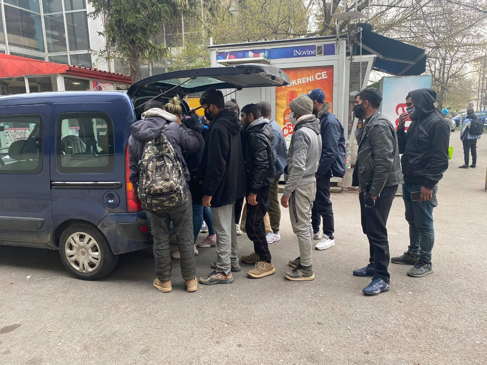
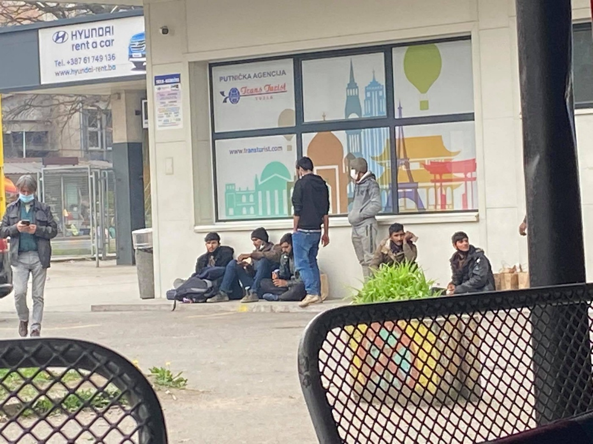
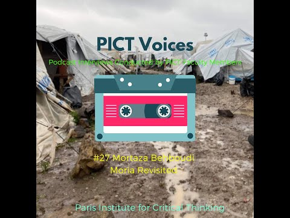

### AYS Daily Digest 06/04/2021: Spotlight on Tuzla, forgotten city along on the Balkan Route
#### Protests against conditions in Libya // Landings in Italy, Spain // Police crackdown on the Canaries // Deportation protests in Germany // Stories of Syrians in Denmark
### FEATURE — Tuzla: A little\-known way\-station in Bosnia\-Herzegovina

Photo credit: volunteers from Tuzla

Ušivak, Borići, Lipa, Velika Kladuša, Bihać… These names of Bosnian places are becoming more and more familiar in foreign news coverage about the situation for people\-on\-the\-move\. The first three places are camps, the last two are cities in the northwest of the country, where many people on the move are concentrated\.

In comparison, Tuzla, Bosnia’s third largest city, gets scant attention, and ordinary locals — by now, seasoned in their daily tasks — have long carried the burden of feeding, clothing and providing other aid to the hundreds of people on the move who pass through their city\.

Many of these volunteers don’t think of their jobs as a burden\. This digest writer has personally met numerous PoM, who speak of Tuzla with stars in their eyes, remembering the generosity and outpouring of support they received there\. In the dark days of winter 2020–21, a number of them even returned to Tuzla from places like Velika Kladuša and Bihać because they felt they would be better welcomed\.

However, now in the fourth year of Bosnia’s “border crisis,” the people of Tuzla are perhaps losing some of their steam, as they continue to receive little or merely performative support from authorities whose actual job it is to handle the situation\.

Thus, in this feature we hope to shed some light on the good work of the people of Tuzla, an under\-reported way\-station along the Balkan route, and express our support for them and their efforts\.

According to local volunteers and NGOs, more than 200 people on the move are currently staying in Tuzla, the first station in Bosnia and Herzegovina after entering from the eastern side, from Serbia\. It’s the fourth year that the same modus operandi continues\.

Most of the people arriving in recent weeks are from Pakistan, Afghanistan, Bangladesh, Morocco, Algeria, Tunisia and Iraq\. Families are mostly from Afghanistan, Iraq and Iran, with several couples from Morocco\. The majority are staying in abandoned houses, at the bus and train station, and all around the city\.

The volunteer efforts continue to the best of their capacities, although their demand for a proper support system and setting up of a reception system has not faded, as currently the people receive one meal a day \(and a number of uncoordinated distributions by the big organisations abundantly documenting their projects are occasionally taking place in a reportedly disorderly manner\) \.

The Daily Centre is used for showering, and those deemed “vulnerable” by the “system” in most cases receive accommodation\. Families with children are staying in two safehouses\. Those who are wounded or wish to try and stay permanently in BiH reportedly also have a chance to receive accommodation from the volunteer organisations\.

On top of the mentioned 200 people on the move, around 50 people are staying for longer periods of time in Tuzla in this way\. According to those active on a daily basis in the reception system and providing direct support, the authorities and other big stake\-holders are either still acting primarily as bystanders, not taking any responsibility for the ongoing situation, or keeping their own statistics and drawing up reports that may be important for their organizations but do not address crucial issues important for people\-on\-the\-move\.

Medical care is still only partially addressed\. For instance, after being directed to the doctor, people are left on their own to find ways of getting to medical facilities\. Naturally, mistrust is growing among PoM, regarding organisations such as the Danish Refugee Council, Save the Children and other actors who took up the responsibility for particular areas like health protection\. \(For an example of this problem, check out [this link](https://www.ombudsmen.gov.ba/Novost.aspx?newsid=1791&lang=BS&fbclid=IwAR0HRYmdvkjfC3-QwxhDWgJyiKbAjeoZlGKx5GoYleGz471iQHSccfLYxJY) , which you can Google translate\. \) When it comes to finding someone to translate the essential information people need \(such as health information\), this is also generally done by volunteers, even if it is beyond their capacities\.

Ongoing distress among the citizens is caused by the \(expected\) occasional clashes between people on the move, particularly those who should be receiving psychological support or treatment for substance abuse or mental health issues\. Their “acting out” in the midst of this hopeless situation excerbates the existing fear, stigma and discrimination\. People have a lack of legal options when they come into contact with the law, even for simple misdemeanors\.

Volunteers on the ground say the different support groups, from self\-organised initiatives to independent volunteers to local NGOs, would benefit from a clearer focus and stronger coordination\. Greater cooperation would have the potential to decrease the number of mishandled cases, unwanted reactions and mutual misunderstandings\.

But in the meantime, there is no word from local, cantonal, federal or international officials on when the government will step up and open a proper reception system in the area\. The situation can only grow more complicated in months to come\.
### LIBYA

■■■■■■■■■■■■■■ 
> **[Sally Hayden](https://twitter.com/sallyhayd) @ Twitter Says:** 

> > Sudanese refugees protest in Tripoli today. They are calling for assistance, to be taken to a safe place, &amp; to not be confused with mercenaries.
"We are victims of the system of genocide in Sudan &amp; the ethnic cleansing of Darfur. South of the Blue Nile, Nuba Mountains &amp; Kordofan" https://t.co/757gn3pmw8 

> **Tweeted at [2021-04-06 16:38:20](https://twitter.com/sallyhayd/status/1379473559748231173).** 

■■■■■■■■■■■■■■ 

Statement from the protestors:

> We are victims of violations and human rights\. 

> We are victims of mass destruction\. 

> We demand international protection by all human rights and humanitarian organizations\. 

> We are not well\. 

### TURKEY

■■■■■■■■■■■■■■ 
> **[Sinan Birdal 🏳️‍🌈🏳️‍⚧️](https://twitter.com/sinanbirdal1) @ Twitter Says:** 

> > 4 Iranian asylum seekers are being deported for criticizing TR’s pull out of İstanbul Agreement. And EU is concerned about the agreement and keeps feeding cash to TR government to keep asylum seekers at bay. Reality couldn’t be more real.  [gazeteduvar.com.tr/iranli-4-multe…](https://www.gazeteduvar.com.tr/iranli-4-multeciye-istanbul-sozlesmesi-gerekcesiyle-sinirdisi-karari-haber-1518427) 

> **Tweeted at [2021-04-06 17:36:07](https://twitter.com/sinanbirdal1/status/1379488102721318915).** 

■■■■■■■■■■■■■■ 

### SEA

■■■■■■■■■■■■■■ 
> **[aditus foundation](https://twitter.com/aditusNGO) @ Twitter Says:** 

> > The 110 are safe! We thank Italy for allowing their disembarkation and urge Malta to be open about SAR: "It is only in such a spirit of transparency that mutual cooperation towards ensuring safety of lives at sea may be secured." [buff.ly/39PQavvż](https://buff.ly/39PQavvż)

#DontLetThemDrown https://t.co/kHaLekLBlg 

> **Tweeted at [2021-04-06 17:19:07](https://twitter.com/aditusngo/status/1379483823382085634).** 

■■■■■■■■■■■■■■ 

A BIG follow\-up from the rescue over Easter weekend from News from the Med \( [full text here](https://www.facebook.com/NewsfromtheMed/posts/1187406445046283) \):

> Contrary to Sunday’s announcement from The Malta Independent that all 270 were rescued to Lampedusa over Easter in the Maltese SAR zone, the fate of the approx\. 110 people who were on the last, third boat, unclear\. 

> In a statement published today, more than 35 Maltese civil society organizations demand information about where they are and the publication of the information regarding their case\. 

> ‘We are extremely concerned about the fate of over 100 men, women and children who have fallen into distress\. We know they have been in distress in Malta’s search and rescue zone in the past few days\. We also know that a ship was ready to rescue them but that Malta was prevented from doing so\. We can’t tell where they are now, if they were brought back to Libya or if they are even alive\. It is unacceptable that Malta gives up its duty to coordinate the rescue of those in need in its search and rescue zone\. It is also undemocratic and reprehensible that Malta has repeatedly refused to disclose its decisions and actions\.’ 

#### Rescues at sea

Thirty people, twenty\-five men and five women, were rescued off the coast of Fuerteventura, one of Spain’s Canary Islands, yesterday morning, April 6, [media reported](https://www.eldia.es/sucesos/2021/04/06/rescatan-neumatica-30-inmigrantes-sur-46119559.html?fbclid=IwAR2Rr2JjM6PZQe6jUl3jWDPMRTUGYTNSP2We_Usmhl8r6ZaxMtS_2zGlak8) \.

Seven people from Morocco were also rescued from a small boat about 12 miles off the coast of Granada by the maritime force of the Spanish Civil Guard, [media reported](https://www.cope.es/emisoras/andalucia/granada-provincia/motril/noticias/rescatados-siete-marroquies-que-viajaban-una-pequena-embarcacion-frente-costa-granadina-20210406_1223419?fbclid=IwAR2Rr2JjM6PZQe6jUl3jWDPMRTUGYTNSP2We_Usmhl8r6ZaxMtS_2zGlak8) \.
#### Moonbird and Seabird February 2021 roundup

Sea Watch has published a monthly factsheet for February 2021 detailing the distress cases witnessed by their airborne mission, the planes Moonbird and Seabird\.

In February 2021 Sea Watch flew 14 missions, with a total flight time of 78 hours and 37 minutes\. They spotted around 2,344 persons in distress in 29 different boats\.

Check out the full factsheet [here](https://sea-watch.org/airborne-monthly-factsheet-february-2021/?fbclid=IwAR3X4Un6gZNhfWY7qJULM04uYO3hO9nAThPAkOOmbU8lE3px5aRaPHOva_E) \.
### GREECE
#### Launch of new mechanism to identify unaccompanied minors

Greek migration authorities in collaboration with UNHCR and several non\-profits have launched a new national tracing and protection mechanism to identify unaccompanied minors \(UAMs\) entering the country, UNHCR wrote in a [press release](https://www.unhcr.org/gr/en/18899-greece-launches-national-tracing-and-protection-mechanism-for-unaccompanied-children-in-precarious-conditions.html?fbclid=IwAR1Ew8DEK33zrsCZos4Gkz8fZwi6cUnc2JOnQQHvOSZlPcxJ4RTC6vQuGOg) \.

The system includes a 24/7 telephone hotline available in six languages that can be used to reach UAMs and swiftly match them with emergency accommodation services\. Children will also receive material and psychological support, interpretation, and “safe accompaniment” to help them access asylum services, the press release says\.
#### Turkey facilitating migration to Greece, Mitarachi says

More propaganda from the Greek government this week\. Migration and Asylum Minister Notis Mitarachi wrote a letter on Monday addressed to the European Commission saying that “it is a well\-established fact that these migrants departed the Turkish coast, and given that they were under close observation and escort by Turkish vessels, the conclusion is that they were not being persecuted, and their lives were not in danger,” according to [media](https://www.keeptalkinggreece.com/2021/04/06/turkey-escorts-migrants-boats-eu-greece/) \.

Mitarachi said that Hellenic Coast Guard data backs up his claims, and that the EU should “react in a coordinated way”\.
### ITALY
#### “Wedding agency” unmasked

Authorities in Sicily have uncovered a criminal organization operating a “wedding agency” that matched single women in need of money with foreign men who needed to be married in order to legally remain in Italy, [media reported](https://www.infomigrants.net/en/post/31338/italian-police-uncover-a-wedding-agency-for-migrants-needing-residency-permits?fbclid=IwAR3-q6VHu1tQtZgkTxve7RapeOva2lc-4GcKKAc2iottNIwjz-kjAEFZlLI) \. Women were offered 5,000 euros in exchange for marrying a migrant\.

Three people are now under investigation, including a police officer\.
#### Landings in Lampedusa

Seventy people landed in Lampedusa early this week, bringing the number of people on the hotspot to 469\. 74 of them were unaccompanied minors, [media reported](https://www.ansa.it/sicilia/notizie/2021/04/06/migranti-sbarcati-in-70-a-lampedusa-469-in-hotspot_44252d8b-b272-42d1-a2c6-6388de585852.html?fbclid=IwAR1hl1y8KeardlwAbqgE_Hyj7aGaLOW3mCslpMZKTGhO2RbmesbJObT2DG0) \.
### SERBIA

An update from Info Park in Belgrade:

> According to Serbian Commissariat for Refugees and Migration \(SCRM\) 4,473 people are currently accommodated in 18 reception and asylum centers in Serbia\. Out of them 3,804 are men, 248 women and 421 are children: 350 children travelling with families and 71 unaccompanied and separated ones\. The majority are from Afghanistan \(39%\), Syria \(20%\), Pakistan \(7%\), Somalia \(4,4%\) and Bangladesh \(4,2%\) \. It is estimated that between 150 and 200 persons enter Serbia daily, mostly from Kosovo and North Macedonia, while high number of people on the move leaves Serbia and continues their journey to Romania, Hungary, Bosnia and Croatia\. Additionally, warmer weather leads to more people getting out of the government\-run center sand residing outside\. 

According to its mobile team in Belgrade, Info Park estimates that more than 150 people are staying in the parks, including families with young children, all of whom stated that they are planning to go on “game\.”

> Despite the fact that the number of people has significantly decreased in almost all reception centers, SCRM in Belgrade continues to insist on sending all new arrivals to only two reception centers in the south: Divljana RC for single men near the Bulgarian border, and Bujanovac RC for families, on the border with North Macedonia\. Therefore, none of the new arrivals accept accommodation in these circumstances and risk sleeping rough or going to other reception centers such as Šid and Kikinda in the north, or Asylum Center in Belgrade, and try to enter them without referrals and documents\. 

### BOSNIA AND HERZEGOVINA

An update from the No Name Kitchen team in Bihać \(full text [here](https://www.facebook.com/NoNameKitchenBelgrade/posts/1212892812442334) \):

> In the past week, we have witnessed an increase in reports of pushbacks from Croatia\. We have met many boys who have told us about being violently pushed back by the Croatian police, some in groups of 30 or even 100 people\. Some have said they were beaten by the police, who took their belongings and their money\. In several cases, dogs were used in their arrest, and at least one person was bitten\. 

> One such group of approximately 30 people was intercepted by some 13 Croatian police officers, beaten and forced to strip naked\. Among them was a boy of about 15, who was forced to take off all his clothes, while the others remained in their underwear\. 

Incidentally, the UN in BiH released a [statement](https://bosniaherzegovina.un.org/en/123914-un-bosnia-and-herzegovina-concerned-violent-pushback-migrants-asylum-seekers-and-refugees?fbclid=IwAR0dBagghLTKG5i5Z0sIbhCtgTEqSIeckDbROiJB_zeS_FMLjeCfb3P7MLQ) on Monday expressing their “concern” about violent pushbacks from Croatia\.

> Pushbacks and collective expulsions are prohibited under international and EU law, and the UN condemns in the strongest terms the use of violence against migrants, asylum\-seekers and refugees at any border\. 

> … 

> This alarming and recurrent situation highlights the need to improve migration and asylum policy and governance and implement humane and integrated rights\-based practices, not least during the COVID\-19 pandemic\. The UN is supporting BiH and partners towards this goal\. 

These words, of course, are too little, and come too late\.
### SPAIN
#### Brutal crackdown after protest on Tenerife

Riot police used rubber bullets and violence to disperse people\-on\-the\-move protesting conditions in the Las Raices camp in San Cristobal de la Laguna on the Canary Island of Tenerife\. Eight PoM were injured and at least 15 were arrested\.

Read more and watch videos taken by protestors [here](https://www.canarias7.es/canarias/tenerife/tension-dispara-raices-20210406145508-nt.html?fbclid=IwAR0PHmutt0IeSaxFU79gTePKNDsL5Dfyvvgykbaa-qGqWJYRwYC4QmAFYS0) \.

■■■■■■■■■■■■■■ 
> **[Tuitero del Teide](https://twitter.com/TeideTweet) @ Twitter Says:** 

> > Les encierran, les dejan sin comida, les dejan sin atención médica, les tratan como animales; y cuando protestan: les montan una carnicería. https://t.co/NhWbe37GpB 

> **Tweeted at [2021-04-06 13:00:55](https://twitter.com/teidetweet/status/1379418844981297152).** 

■■■■■■■■■■■■■■ 

### FRANCE
#### More expulsions in Calais

■■■■■■■■■■■■■■ 
> **[Human Rights Observers](https://twitter.com/HumanRightsObs) @ Twitter Says:** 

> > Cet après-midi, des #opérations #d’expulsion de grandes échelles ont eu lieu à #Calais.
Les personnes #exilé.es passeront la nuit sans tentes, sans couvertures malgré la #grêle.
Au moins 126 tentes, dont 76 pleines d’effets personnels, 170 bâches, 77 couvertures ont  été saisies. https://t.co/IYb4BSZgnQ 

> **Tweeted at [2021-04-06 19:39:45](https://twitter.com/humanrightsobs/status/1379519212713086977).** 

■■■■■■■■■■■■■■ 

### GERMANY
#### Deportation alert\!

A deportation charter plane will leave Berlin on April 7 and land in Afghanistan the following morning, according to a [rights group](https://www.facebook.com/AmasoAfg/posts/4229626770400908) \.

There is a protest planned:

■■■■■■■■■■■■■■ 
> **[DunyaCollective](https://twitter.com/DunyaCollective) @ Twitter Says:** 

> > 1. @[AntiRA_Netzwerk](https://twitter.com/AntiRA_Netzwerk) zufolge könnte es morgen zu einer Sammelabchiebung nach Afghanistan kommen. @[sfr_ev](https://twitter.com/sfr_ev) &amp; der "Dresdner Verein Afghanistan e.V." rufen für morgen 17 Uhr zu einer Kundgebung unter dem Motto #AfghanistanNotSafe auf. Treffpunkt: Dresden am Altmarkt

#LeaveNoOneBehind https://t.co/X72WJN05Kr 

> **Tweeted at [2021-04-06 18:57:20](https://twitter.com/dunyacollective/status/1379508541019598851).** 

■■■■■■■■■■■■■■ 

Ahmad Muhebbi from the Dresden Assocation of Afghanistan [explains](https://www.saechsischer-fluechtlingsrat.de/de/2021/04/01/presseinfo-afghanistannotsafe-kundgebung-am-07-04-2021-17-uhr-altmarkt-dresden/?fbclid=IwAR27hUNAfwB-ay7TPmIwAzx2c9uk_TcqRwrMjQ6f_5L23SaWpp_eW7xoOi8) :

> Afghanistan is not safe\! While the third wave of the COVID\-19 pandemic is rolling over Germany and all movement is to be restricted, the federal government is continuing to deport to Afghanistan\. The protection of human life during a global pandemic of unique proportions cannot stop at national borders and depend on residence status or nationality\. We call on the federal government to immediately stop any deportations to Afghanistan and to protect human lives\! 

#### Vaccinations for those living in Berlin’s asylum\-seeker centers

Meanwhile, in the German capital, the Berlin state Office for Refugee Affairs \(LAF\) says it hopes to begin COVID\-19 vaccinations in asylum\-seeker centers this month, as people living in communal facilities are considered “high priority,” [media](https://www.infomigrants.net/en/post/31344/asylum-seekers-in-berlin-to-start-receiving-covid-vaccine-this-month?fbclid=IwAR2gauINLWMHYacOxElw5cDj9N1Igq58eOliJNHoxepnuCCvLpwV2gGuAPQ) reported\.

Since the pandemic began, around 1,300 people in asylum centers in Berlin have tested positive for coronavirus — this is as of the end of March, according to the LAF\. Four people have also died from the virus\. There are currently 18,500 asylum seekers living in nearly 80 centers in Berlin\.
### DENMARK

We include here a series of personal stories of those Syrians whose residency permits are being revoked by Danish authorities\.

One of them was a 61\-year\-old man who died of a heart attack after being notified he would face deportation to Damascus\. More on this man’s life [here](https://www.bt.dk/samfund/61-aarige-akram-fik-besked-om-udvisning-af-danmark-nu-er-han-doed?fbclid=IwAR01ki5j_GIhtqW6hn_hsTxFaJktTXH0jHSvUWsAHuJsmUjoomb7YKaH66M) \.

More stories of the individuals affected:

### EU/FRONTEX

Big surprise here: in an [exclusive interview](https://www.ekathimerini.com/opinion/interviews/1158496/turkey-must-resume-returns-eu-commissioner-johansson-tells-kathimerini/?fbclid=IwAR0dBagghLTKG5i5Z0sIbhCtgTEqSIeckDbROiJB_zeS_FMLjeCfb3P7MLQ) with the Greek newspaper Kathimerini on Sunday, European Commissioner for Home Affairs Ylva Johansson said that Turkey must fulfill its commitments under the 2016 EU\-Turkey deal\. Johansson was in the country on a two\-day trip to visit the camps on Lesvos and Samos\.

This of course means more pushbacks to Turkey, although Johansson also expressed strong criticism of Frontex’s handling of pushback claims\.

Johansson said in the interview:

> Turkey has to resume returns from Greece\. I’ve been very clear on that directly in my talks with the minister of foreign affairs, Mr \[Mevlut\] Cavusoglu, and also publicly\. It is clearly part of the EU\-Turkey statement, and I do hope it will be a part of the talks between presidents \[Ursula\] von der Leyen and \[Charles\] Michel and President \[Recep Tayyip\] Erdogan — although that’s for the two presidents to decide\. But both the prevention of departures and the resumption of the reception of returnees are extremely important signals of Turkey’s willingness to comply with the statement and show good will for further discussions\. 

On Frontex, she said:

> In my view it’s obvious from the report that there is a bigger problem\. The report says there is a lack of a proper reporting system \[of incidents concerning potential violations of fundamental rights\] \. It also says that there is a need for a new culture to address the shortcomings that have been found\. There has been significant delay in deploying their fundamental rights officer — they only took the decision now\. According to the regulation, there should have been 40 fundamental rights monitors in place by the beginning of December and there are still zero; there should have been three deputy executive directors appointed and there is still none\. There is a huge risk that these delays in deployments and appointments have affected the efficiency in clarifying these kinds of issues\. 

### WORTH READING
#### New investigative tool

A group of journalists have developed a new tool with the support of the International Press Institute, [http://opensecuritydata\.eu](http://opensecuritydata.eu) , to search for recipients of European Union security funding, for specific projects or for data by topic or country\.
#### German journalists document Greek Coast Guard on the Aegean

The German TV channel ZDF accompanied the Turkish Coast Guard and documented how the Hellenic Coast Guard did not react to a dinghy arriving\. They waited until it drifted back into Turkish waters\.

#### Podcast with journalist reporting on Lesvos

From the Paris Institute for Critical Thinking, a new podcast episode, “Moria Revisited,” featuring French\-Afghan journalist Mortaza Behboudi who has long reported on the situation on Lesvos\.

**Find daily updates and special reports on our [Medium page](https://medium.com/are-you-syrious) \.**

**If you wish to contribute, either by writing a report or a story, or by joining the info gathering team, please let us know\.**

**We strive to echo correct news from the ground through collaboration and fairness\. Every effort has been made to credit organisations and individuals with regard to the supply of information, video, and photo material \(in cases where the source wanted to be accredited\) \. Please notify us regarding corrections\.**

**If there’s anything you want to share or comment, contact us through Facebook, Twitter or write to: areyousyrious@gmail\.com**

_Converted [Medium Post](https://medium.com/are-you-syrious/ays-daily-digest-06-04-2021-spotlight-on-tuzla-forgotten-city-along-on-the-balkan-route-1994f57a9f95) by [ZMediumToMarkdown](https://github.com/ZhgChgLi/ZMediumToMarkdown)._
