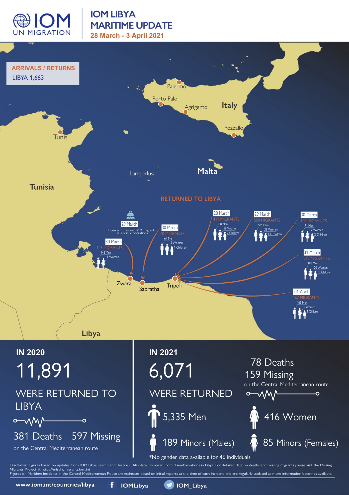
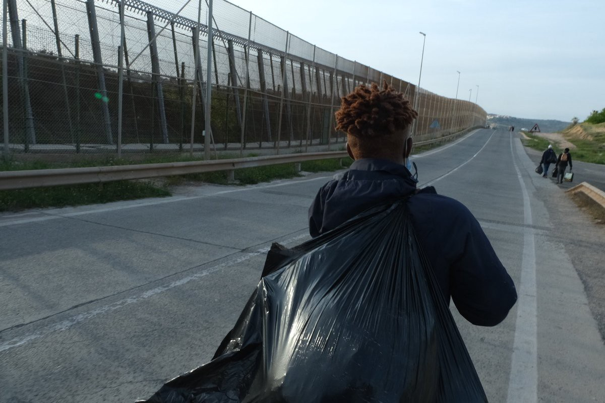
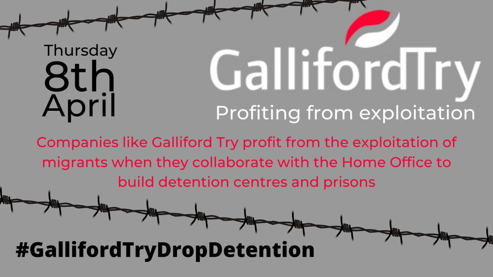
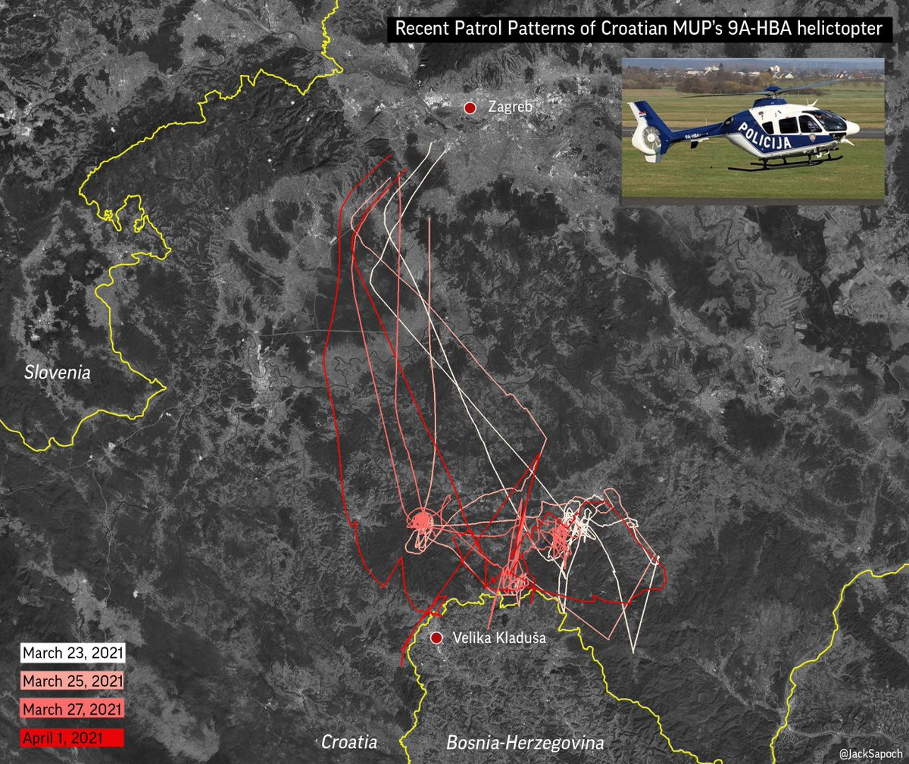

### AYS Daily Digest 07/04/2021 — The EU and Italy funnel more money towards Turkey and Libya, disregarding human rights violations
#### The UK Home Office has been reported to plan on moving people in the Napier Barracks, after earlier this year they were declared unfit to host migrants // More shocking reports of police violence, sexual abuse and harassment in Croatia, and more…
### EU

After yesterday’s much discussed “Sofagate” meeting between EU Commissioner Von Der Leyen, President of the European Council Michel, and Turkey’s president Erdogan, the EU has once again a [greed to give Turkey more funds to stop migration to Europe](https://www.thetimes.co.uk/article/eu-offers-erdogan-more-money-to-halt-migrant-surge-from-turkey-kz3z5l3hh?fbclid=IwAR3oBHFXXrHW_prm-TwGwShsusZmNGiujc5bmx4LtcVJb-BGoP-3zzb96rE) \.

The leaders “agreed that a five\-year\-old deal under which Turkey was given €6 billion to stop the flow of migrants to Greece would be extended, with more money being provided\. Exact details have yet to be made public, but an EU financing package that will help Turkey, Lebanon and Jordan to care for refugees will be announced soon\.”

The EU is also financing “ [Operation Irini](http://The EU operation monitoring the arms embargo against Libya, named Irini, is entering its second year. Despite being active in the Mediterranean, it has not rescued any migrants.  Operation Irini is named after the Greek word for peace. In its first year, the EU mission "investigated more than 2,400 ships and has monitored 200 suspect flights," according to its website. It has also conducted "100 consensual visits onboard merchant vessels and nine inspections. It has seized one illegal cargo."  Using navy ships, planes, satellites and drones, Operation Irini is busy monitoring "16 Libyan ports and oil facilities, 25 airports and landing strips," and its members have "shared more than 22 classified reports with the UN panel of experts on Libya." However, it has not participated in any rescue of migrants from boats in the central Mediterranean.) ”, which enters its second year and is expected to be extended until 2023\. The operation monitors the arms embargo against Libya and is active in the Mediterranean\.

> Using navy ships, planes, satellites and drones, Operation Irini is busy monitoring “16 Libyan ports and oil facilities, 25 airports and landing strips,” and its members have “shared more than 22 classified reports with the UN panel of experts on Libya\.” However, it has not participated in any rescue of migrants from boats in the central Mediterranean\. 

### ITALY

The Italian Prime Minister Mario Draghi [met his Libyan counterpart](http://www.ansamed.info/ansamed/en/news/nations/libya/2021/04/06/draghi-in-libya-says-unique-time-for-rebuilding-friendship_ecda8e25-ca9d-479a-b657-ae37de04ff8f.html?fbclid=IwAR0wmlPlMcXovgwCYtWgA_7pv2QNPSMRtRXJGc8zQZq4r1hsE8uPEReWl_A) two days ago \(6 April\) in his first official visit abroad\. He has thanked the Libyan coast guard, expressed satisfaction with Libya’s operations in the Mediterranean, and committed to assist the country further in its efforts to curb illegal migration\.

The Italian Prime Minister, well known in the country for his rather sparse public interventions, was silent also on the human rights violations that occur in Libya’s detention centers, not far from where the summit was held\.

He received [much criticism from NGOs in Italy\.](https://www.avvenire.it/attualita/pagine/sono-un-caso-le-frasi-sui-salvataggi-coro-di-proteste-parole-inaccettabili?fbclid=IwAR2AxLColGDkvK6isFupmx933GEs3azgapLL3uNRLahyf5d41U3P3ZIiNYs)

> A sea rescue ends only upon arrival in a safe harbor\. If migrants and refugees are brought back to Libya — recalls Doctors Without Borders — it is a condemnation of violence and brutality in the detention centers\. There is little to be satisfied \. 

Mario Draghi’s government is also grappling with much\-debated news that emerged recently:

> The Italian newspaper Domani [revealed on Friday](https://www.theguardian.com/world/2021/apr/06/italy-investigates-call-wiretapping-linked-to-migration-reporting-sicily?fbclid=IwAR2Wpo9lJ9x-oCWMRHNzmKJ09nLBOWSXhV1ScHp1NYXueGX1BPaJ4WgohUo) that magistrates in Trapani who were investigating sea rescue NGOs and charities for alleged complicity in people smuggling had wiretapped reporters’ phone calls with rescuers and allegedly exposed the journalists’ sources\. 

Journalists are particularly indignant that “ [the criminalization of solidarity and the defense](https://www.editorialedomani.it/fatti/giornalisti-intercettati-sea-watch-draghi-confonde-respingimenti-illegali-con-soccorsi-mare-qyux2g7h?fbclid=IwAR3xlhuc5ZJOO8HnbzmkIENLewkJPaECfc6Ep1UFCz_ONX5sTXz3eXk8_ko) of human rights, carried out by the Italian authorities, would stop at nothing\.”

The justice minister will be sending inspectors to Sicily, to investigate reports that at least 15 journalists were wiretapped, and hundreds of their conversations on migration in the central Mediterranean were recorded illicitly\.

On top of wiretapping journalists, lawyers were also spied on by Italian prosecutors in their crackdown on sea rescue NGOs\.

In an interview, [migration lawyer Serena Romano](https://www.ildubbio.news/2021/04/06/trapani-spiavano-pure-noi-avvocati-ormai-e-un-assedio/?fbclid=IwAR13pQWPrwI-q2TssE8Q8BUbn__oH4WlvCtdjH8gzHc90slt3iOEwCtFcJk) comments:

> The case of \[journalist\] Nancy Porsia is very serious and has all my solidarity, because the profiles and implications of such a thing are macroscopic, even in terms of exposure of people who thought they were safe in conversations with a journalist, because the secret professional is also an instrument of reliability and credibility of the same\. Equally serious is the profile of the violation of our freedom to exercise the profession, because now I know that I am not free, that this can happen, that while I speak on the phone about my trial what I say can be intercepted, transcribed and used, formally or informally\. Because the cognitive element comes from the other side and I cannot know where it is going\. But the point is, this step just doesn’t have to be there\. You cannot enter our professional sphere\. 

### SEA

Further news on Libya has been reported [by the IOM](https://twitter.com/IOM_Libya/status/1379805010616270849?fbclid=IwAR0oQ2vUlasCPRoaCSkXrCdsb8YcVouzxU_zHsunEWdQNg3-PxONtkaT6J8) \.

[**A court on the island of Sardinia**](https://www.n-tv.de/ticker/Anhoerung-vor-italienischem-Gericht-nach-monatelanger-Blockade-article22475251.html?fbclid=IwAR2nhlFm9Hu0C6whgySXkmaBJBI03adiVojCYtRXILx4NMZQhuqKm0CwOqw) **should soon adjudicate on the six\-month blockade of the German aid ship the _Alan Kurdi_ by the Italian authorities\.**

> A lawyer for the operating organization Sea\-Eye said on Wednesday after a hearing in Cagliari\. The sea rescuers from Sea\-Eye want to obtain a provisional clearance for their ship in an urgent decision before the case is fundamentally further negotiated later\. On Wednesday, the judge heard the parties to the dispute, and will issue their decision in a few days\. 

### SPAIN

This photo documents three young men [being kicked out](https://twitter.com/PalazonOsma/status/1379562565882241024?fbclid=IwAR33o-NxLmIBcmvPyYlJWR7Y6eEJISgkdVSvTWb19QMWayWQl1jfLUjbKDU) of a centre for unaccompanied minors after being assessed that they are not minors, near Melilla\.

We received this report from the Canary Islands, where the [Assembly of Support to Migrants in Tenerife released this communiqué](https://asambleadeapoyoamigrantesentenerife.blogspot.com/2021/04/siguen-los-menores-en-los-campamentos.html?m=1&fbclid=IwAR2uRAoH1abK0UCBij37YWFRyKdpuKpstjGsTPzeYSpWz7e305Lo1cXjFkc) :

> On 6 April 2021, a list of minors who remain in the Las Raíces and Las Canteras centers was sent to the Prosecutor’s Office\. We understand that the situation in the camps is unsustainable and that it is seriously affecting the integral development of the children, who have been there for several months\. The information available indicates that there are approximately 58 minors in the Las Canteras camp and 77 in the Las Raíces camp\. We understand that some 48 minors have left the camps and 24 have not entered since the complaint by the Tenerife Migrants Support Assembly began in defense of the best interests of minors and accompanying them in their legitimate claims to be treated as such\. The latest violent events in the camps make it urgent for minors to go to centers that guarantee their custody and guardianship, avoid the serious consequences that the current situation may have on their development, guarantee their right to education, to the adequate use of leisure, to its cultural promotion, to its social integration and to live in decent conditions\. We demand the closure of the camps and the free movement of the adults who are there\. 

Violence towards migrants has increased in Tenerife\. Migrants protesting the vile conditions they’re held in have been [met by rubber bullets fired by the Spanish police](https://twitter.com/alarm_phone/status/1379758769459056648?fbclid=IwAR3zetS98-DdochOi4aV2Xf07qF6J_A2B98pk-DafxK0D3x-AKT5UZ3CJh0) \. This is only an extension of the violence they already suffer, as the Spanish state refuses to meet even their most basic needs\.

Tenerife will also hold [a demonstration on Saturday](https://twitter.com/alarm_phone/status/1379758769459056648?fbclid=IwAR3zetS98-DdochOi4aV2Xf07qF6J_A2B98pk-DafxK0D3x-AKT5UZ3CJh0) to protest the situation in which migrants are being held hostage by European migration politics and are demanding freedom of movement\. We wish to express our solidarity to the protest\!
### UK

After much debate over the inhumane conditions faced by migrants at the Napier Barracks, the [Home Office is expected to send more asylum seekers](https://www.theguardian.com/politics/2021/apr/07/home-office-to-send-more-asylum-seekers-to-unsuitable-napier-barracks?fbclid=IwAR33o-NxLmIBcmvPyYlJWR7Y6eEJISgkdVSvTWb19QMWayWQl1jfLUjbKDU) to ‘unsuitable’ Napier barracks\. Although the former military site was emptied after evidence that it was unsuitable for accommodation\.

> The whole Home Office machine is hell\-bent on ensuring that the life for people seeking refuge is as miserable as possible in the hope that it will put off others from applying for refugee status\. The use of these dilapidated barracks is shocking and shameful — but it is consistent with everything else the Home Office is doing\. 

> Earlier this year, the High Court heard that the Home Office ignored Public Health England advice that the dormitory\-style accommodation at Napier barracks, which holds up to 28 men in a single block, was not suitable during the pandemic\. 

Tomorrow is a day of action against a contractor developing a new detention centre\. Follow it [_here_](https://twitter.com/wallsmustfall/status/1379747307802013699?fbclid=IwAR2YN8gXucJ0gxF6MXN3z8-Gh9FKxhUIvDJywBKqVOvJVkPQI7pIgDx6GII) \.

Further, it has emerged that the Home Office has a shady database of 650 million people, including information on “ethnicity, immigration status, nationality, criminal record history, and biometrics”\. The database is used by law enforcement agencies via the “warnings index” and “status checking project”\. Read more about this shocking practice [here\.](https://www.wired.co.uk/article/home-office-immigration-data?fbclid=IwAR227EMud1DgORsEnbR3p1NMYKzZ7vkOOEgEkjtQVSMrKKCfacPmOmkAw9w)

The Home Office has also been found to be implementing a particularly problematic practice: over half of the people removed by the Home Office on specially arranged charter flights over the summer did not have a lawyer on record\.

> The Home Office has repeatedly criticised “activist lawyers” for frustrating its ability to remove people\. But new findings raise fears that a significant percentage of the people being removed do not have access to adequate legal representation\. 

Find out more about this important investigation [here](https://www.lbc.co.uk/news/asylum-seekers-removed-from-britain-without-having-cases-properly-heard/?fbclid=IwAR0wLOYYF-hg0CCOXayX3UySOl1eqLyFLWQQ3EhbmQ5j_UMQwmwzKmnrKKc) \.
### FRANCE

The Prefect of Calais [has extended the current ban on NGOs](https://france3-regions.francetvinfo.fr/hauts-de-france/pas-calais/calais/calais-le-prefet-interdit-de-nouveau-les-maraudes-dans-le-centre-ville-par-les-associations-2032825.html?fbclid=IwAR2VcGXIEBw_75cgdPHHOqlxzxGJpiTbQuKA6WMAgu8pBhf5aRh0yWU7XKY) from distributing food to migrants in Calais— a decision motivated, according to him, by “disturbances to public order _”_ and to avoid crowds due to the health crisis\.

An [Afghan journalist in France](https://www.20minutes.fr/societe/3015775-20210407-rennes-journaliste-afghan-entre-clandestinite-eviter-expulsion?utm_term=Autofeed&xtref=twitter.com&utm_medium=Social&utm_source=Twitter&fbclid=IwAR3aoWfQM-bBL6Bw4yBQUdOC_X0GkPys5lBXEvbCo_IngtLOg53Qpekatvo#Echobox=1617782124) has decided to go into hiding to avoid deportation:

> “I decided not to obey the law to save my life\.” Under house arrest in a home for asylum seekers in Rennes, the Afghan journalist Elyaas Ehsas has decided to go into hiding to avoid deportation to his country where he has been threatened with death by the Taliban \. “I will disappear for eighteen months and then I will ask for asylum in France,” he said\. 

> Elyaas Ehsas, who worked in his country for a television station, belongs to the Hazara community, a Shiite community discriminated against and targeted by the Sunni Taliban\. The prefecture had asked him to carry out a PCR test on Monday, which suggested deportation to Sweden , where he is on the verge of a deportation order to Afghanistan\. He was also to report Tuesday afternoon to the border police but decided not to go there for fear of being placed in a detention center and then deported\. 

### GREECE

The Samos Advocacy Collective has compiled an important report on the mental health situation on the island\.

> Thousands of people on the move in the Aegean “hotspots” face a mental toll that is a result of the cumulative exposure to inhumane living conditions, instability, discrimination and violence\. 

Find the full report [here](https://static1.squarespace.com/static/58e2b73fb3db2bb2904ca55b/t/606cbee84151794618454821/1617739499896/REPORT_Mental+health+in+Samos_+the+invisible+emergency.pdf?fbclid=IwAR3xlhuc5ZJOO8HnbzmkIENLewkJPaECfc6Ep1UFCz_ONX5sTXz3eXk8_ko) \.

The EU has announced €250,000,000 in funding for five new refugee camps on the Greek islands, including on Lesvos\.

The construction of [this new camp](https://www.pri.org/stories/2021-04-06/island-prison-migrants-say-plan-refugee-camp-lesbos-too-isolating?fbclid=IwAR0ry7u6NNKsR6EaX0Yf7KrpKb6bdx6S3rwVOS4FRogQuQmZ5BMiXQwXvnU) has started in an area that is very isolated and difficult to reach\.

> Officials say the new facility will improve conditions for migrants and locals on the island\. But some migrants and other observers say that the remote locale, so far from any services and businesses, will make it even harder for refugees to find help — and stability\. 

[An electronic surveillance network](https://www.keeptalkinggreece.com/2021/04/07/greece-evros-electornic-surveillance-turkey-migrants/) has been put in place to

> safeguard Greece’s borders to Turkey at the region of Evros\. Equipped with radars and cameras, the network installation is underway and will include 11 pillars along the Evros river in Greece’s North\-East\. 

> The 11 pillars are along the river and the cameras have a range of 15 km within Turkish territory, reported private Open TV in its exclusive Evros Surveillance report\. 

### DENMARK

Like many others, a Syrian family in Denmark [is being threatened with return to Syria](https://www.facebook.com/permalink.php?story_fbid=10159368761097299&id=536777298&__cft__[0]=AZUPu6y0QJh6GXiWVIRKAJ8q-xABnpFLP8bBUl66a_qNd8kTEvxD9DgZUvyfGwjkmboqzkokLtloNskR_0uV2_YK79iHdhbr8QTTz-ODBV8RN-BnA276vAbjCE_kPfQ8lqdbv0LehK5Efjp_GSYzDZhYC9kAMlllqogq3Kk0aQu17lwSGiQBdLE1lHkcE4vYtCI&__tn__=R]-R) after they received a letter from the Danish Immigration Service, deeming Syria to be safe enough for them to return home\.

> Denmark apparently finds that it is perfectly okay to send this mother and her girls back to their land of horrors\. To poverty, to dictatorship, to homelessness, to the fear of violence\. 

> Denmark finds that it is perfectly okay to separate a family\. Despite everything they have been through\. Or let them rot in a departure center without the opportunity to educate themselves or to earn their own wages because they dare not to travel and cannot be separated from their loved ones\. 

> It is remarkable to see that Denmark, which in its own self\-understanding puts a high value on ​​women’s rights, is letting the rights of Syrian women count for so little\. After all, it is often they who suffer first of all\. 

A [thread on the use of detention for Syrian refugees](https://twitter.com/AlysiaAlexndra/status/1379719787044089859?fbclid=IwAR33o-NxLmIBcmvPyYlJWR7Y6eEJISgkdVSvTWb19QMWayWQl1jfLUjbKDU) :

> As of February 2021, there are 59 Syrians \(including 10 minors\) who are being held in three of Denmark’s deportation camps, Avnstrup, Sjælsmark and Kærshovedgård\. These centers are described as being “prison\-like environments”\. 

### **BALKAN ROUTE**

Helicopters are in use along Croatia’s EU borders, as recent data suggests\.These are used for border\-area securitization efforts: read — pushbacks\.

Another [shocking violation](https://www.theguardian.com/global-development/2021/apr/07/croatian-border-police-accused-of-sexually-assaulting-afghan-migrant?fbclid=IwAR2uRAoH1abK0UCBij37YWFRyKdpuKpstjGsTPzeYSpWz7e305Lo1cXjFkc) has occurred at the Croatian border: an Afghani asylum seeker says she was threatened at knifepoint, humiliated, and sexually abused in the latest of a series of reports of violent pushbacks on the Bosnia–Croatia border\. This is, unfortunately, not the first time that the Croatian police is accused of sexual violence towards people entering Croatian through the Balkan route\.

There is a trial underway after a man claimed to have been a victim of a chain pushback from Austria to Bosnia\. [This article explains the case](https://prozess.report/prozesse/pushback/?fbclid=IwAR0U81vqqGL0SZS5GJItatOh3N_wTwiUIRE5bno6UM1JA20bw8ukpaDRQkM) , his testimony and the context of pushbacks\.

Refugee Rights Europe has issued a new report on the deteriorating shelter situation in Bosnia and Herzegovina\. Read it in full [here\.](https://refugee-rights.eu/wp-content/uploads/2021/04/RRE_TransitCountryInCrisis.pdf?fbclid=IwAR0MfC3yFwbF7Qxv0Aosr8nwpizypLPpvXRJ6dC2k7FeMuQOd3m_WdXMBZo)
### WORTH READING

Interview with the [Assembly of Support for Migrants in Tenerife](https://www.todoporhacer.org/asamblea-migrantes-tenerife/?fbclid=IwAR0wmlPlMcXovgwCYtWgA_7pv2QNPSMRtRXJGc8zQZq4r1hsE8uPEReWl_A) : “The living conditions in the centers are terrible and there is a high risk to life”\.

[COVID vaccine passports could be bad news](https://l.facebook.com/l.php?u=https%3A%2F%2Fleftfootforward.org%2F2021%2F04%2Fvaccine-passports-and-the-threat-to-undocumented-migrants%2F%3Ffbclid%3DIwAR2txG9bjMezsnozMyeqPYXhSIvWlxsg11pGvmS2Gcn5ifsCdPMeSCka73Q&h=AT30iFGUmE4vCpx3unU3kLizR83Ot1mfNvRpYl_H4PLFeNbh_ghfjzj3HTePoi8XFMFhFJ6-) for undocumented migrants and their freedom in general\.

This shocking report has c [ollected information](https://twitter.com/MissingMigrants/status/1379713054775054339?fbclid=IwAR0kuS79sQlqVn3p2gWFkG71d7CLCJMdFl5-mmWtFlpsIVjaE_bs_b1_nHE) that 3900 people have died worldwide while migrating since the beginning of the pandemic\.
### WORTH WATCHING

8 April: [the release of a documentary](https://twitter.com/ManifestoXXI/status/1379125698502266882?fbclid=IwAR37ZyufUzOQBgFHqy7N-UW2RKlb5aRm8GFF7U15IS5Y-xIhYUB_qxzYLhg) following Utopia 56 in Calais & Grande Synthe

Last week’s webinar from Lighthouse Reports — on how journalists managed to investigate Frontex — is now online and available [here](https://www.lighthousereports.nl/investigating-frontex-how-a-reporting-team-put-an-eu-super-agency-in-the-spotlight/?fbclid=IwAR1x1TT-2vpIBqJJOSbeMrSf8a4c-K4fZ8K4zR2lS0n0Qqn1UR1aONIEvgo) \.
### WORTH ATTENDING

8 April: Leah Cowan and Emily Kenway in conversation with Aliya Yule on “Border Nation and The Truth About Modern Slavery”, a talk about the myth and violence of borders and the manipulation of modern slavery legislation to reinforce them\. Find it [here\.](https://twitter.com/La_Cowan/status/1377977136951263234?fbclid=IwAR1xcZUqw_1l6sHD1Pu0Nlalnn0tQ6R75ArrPpDXUiX7Hj3j9Zpt_ZjqZq4)

**Find daily updates and special reports on our [Medium page](https://medium.com/are-you-syrious) \.**

**If you wish to contribute, either by writing a report or a story, or by joining the info gathering team, please let us know\.**

**We strive to echo correct news from the ground through collaboration and fairness\. Every effort has been made to credit organisations and individuals with regard to the supply of information, video, and photo material \(in cases where the source wanted to be accredited\) \. Please notify us regarding corrections\.**

**If there’s anything you want to share or comment, contact us through Facebook, Twitter or write to: areyousyrious@gmail\.com**

_Converted [Medium Post](https://medium.com/are-you-syrious/ays-daily-digest-07-04-2021-the-eu-and-italy-funnel-more-money-towards-turkey-and-libya-6852ab245a16) by [ZMediumToMarkdown](https://github.com/ZhgChgLi/ZMediumToMarkdown)._
