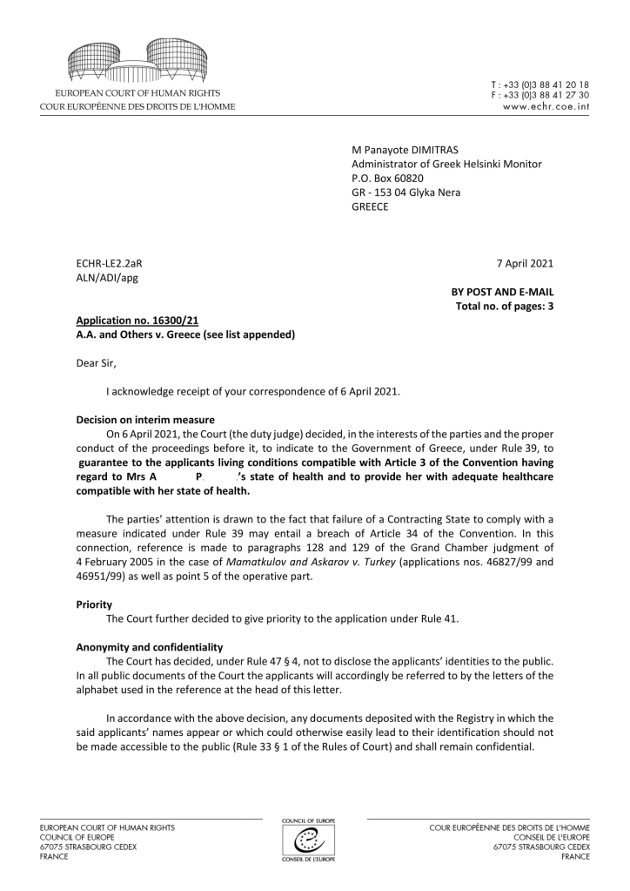
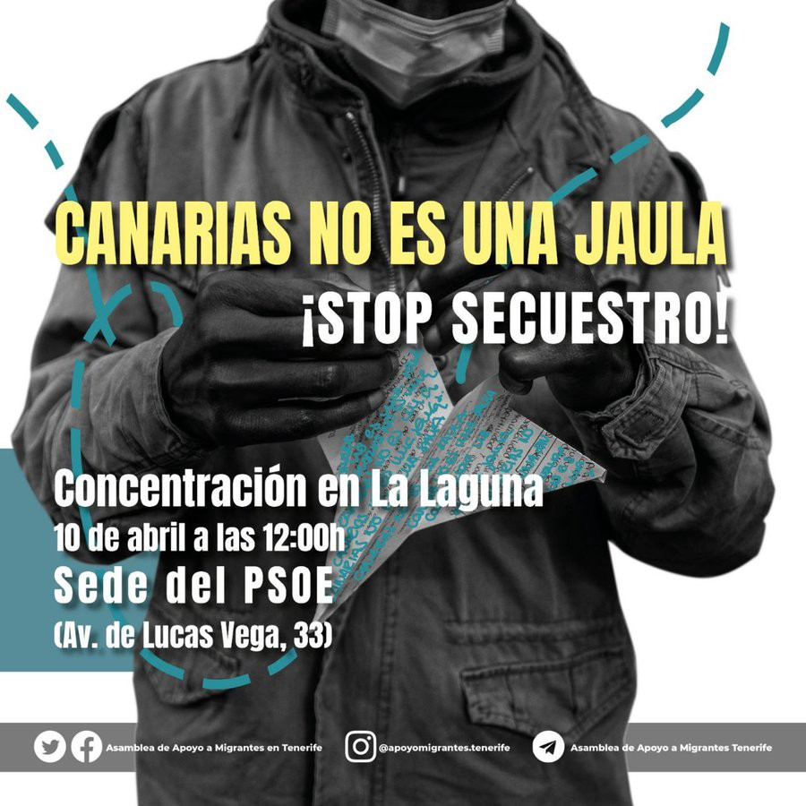
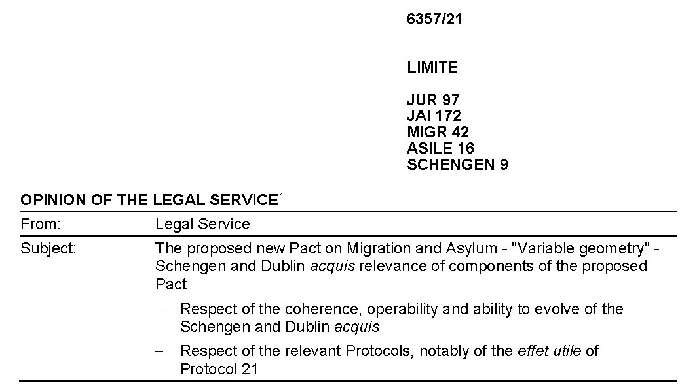

### AYS Daily Digest 8/4/21:The fight against deportations continues
#### Greece won’t comply with ECtHR ruling on providing a vulnerable family with better interim living conditions / Spain: hygienic and sanitary conditions in Las Raíces raising concerns / Decision: Ombudsman found no maladministration in Frontex’s refusal to provide the required documents / recommended reads and more

Protesters assembled at Berlin airport’s Terminal 5 late Wednesday to speak out against a deportation flight of asylum\-seekers whose claims were denied to Afghanistan that evening
#### FEATURED

Europe is increasingly speeding up deportations, opening up new ways of leaving people without protection and putting people in unimaginable positions of either flying off to danger and constant fear, or staying in permanent deportation detention\. More and more voices are rising against this\.
#### Germany resuming deportations

Around 350 people showed up to the protest at Berlin airport as people attempted to block the deportation charterflight\.
Despite blockades at the Schönefeld deportation prison and the road leading to the airport, the flight could not be prevented, [NoBorder Assembly Berlin](https://twitter.com/NoBorder_Berlin) reported\. It was the 38th deportation flight to Afghanistan since December 2016 when the policy began\.

■■■■■■■■■■■■■■ 
> **[PRO ASYL](https://twitter.com/ProAsyl) @ Twitter Says:** 

> > Morgen findet die nächste Sammelabschiebung nach #Afghanistan statt - obwohl sich die desaströse Sicherheitslage dort in jüngster Zeit noch weiter verschärft hat. Diese Abschiebungen müssen endlich gestoppt werden! 

#AfghanistanIsNotSafe

[proasyl.de/pressemitteilu…](https://www.proasyl.de/pressemitteilung/erneut-drohende-sammelabschiebung-nach-afghanistan-am-07-04-2021/) https://t.co/nVpx06FvQI 

> **Tweeted at [2021-04-06 11:01:22](https://twitter.com/proasyl/status/1379388759280586755).** 

■■■■■■■■■■■■■■ 

#### “Denmark’s designation of Syria as ‘safe’ is dangerous, inhumane, and illegal”

We have already been reporting about the gravity of the situation in Denmark, the country that decided Syria was no longer a dangerous place for millions who fled their homes due to war and persecution\. In spite of the [report](https://www.ohchr.org/EN/HRBodies/HRC/IICISyria/Pages/Detention-report.aspx) of the UN Commission of Inquiry on Syria demonstrating how the country is still ravaged by war and serious human rights’ violations, Denmark claims the protection they gave to the Syrians was temporary and they now call on the right to revoke it\.

Calling Denmark to immediately reconsider this dangerous announcement, Euro\-Med Human Rights Monitor issued a statement saying they “ [are gravely concerned by Denmark’s decision to declare parts of Syria as a safe place to send refugees back](http://twitter.com/intent/tweet?text=We%20are%20gravely%20concerned%20by%20Denmark%E2%80%99s%20decision%20to%20declare%20parts%20of%20Syria%20as%20a%20safe%20place%20to%20send%20refugees%20back%20https://euromedmonitor.org/a/4303%20@EuroMedHR%20%20) despite the indisputable clear\-cut conclusions that war\-torn **Syria is still witnessing war crimes, crimes against humanity and dire living conditions** ”\.
As in many other cases along the so called Balkan Route, where translators \(or better said, people who were engaged as translators by the police, and were linguistically lowest of the low, but politically very spiked\) ultimately decided on people’s futures and had great role in many being _dublined_ to Croatia’s infamous detention Sector 3, as it turns out, in Denmark the situation was similar to some point\. Some of the translators during this process made it clear to the refugees they did not support the Syrian revolution while there might have been errors in translations during the interview process\.

> _Once the authorities withdraw their residence permits, they will end up in limbo at the deportation centre, indefinitely basically, without work permits, and without the normal rights of people with residence permits in Denmark\._ 

— the head of Danish Refugee Council’s Asylum and Refugee Rights Division said\.

As Denmark refuses to negotiate and cooperate with the regime of al\-Assad and can’t forcibly send Syrian refugees back, **if they refuse to return voluntarily, they could end up living in [deportation camps](https://www.youtube.com/watch?v=XLlwXIZrWPQ&ab_channel=Channel4News) in Denmark for years** \. However, the state refuses to believe some people are anti\-regime and could face persecution if they would come back\. Many of them, aware about the consequences their political expressions and public statements might have for their family members and friends back home, don’t have the luxury of excercising the freedom of \(anti\-establishment\) speech, even if they are thousands of kilometres away, in the north of Europe\. That distance might dangerously quickly become short\. One such case was supposed to be that of Akram, the man who sadly died some days ago, but was destined to be deported back to Syria\.

“My father explained that he has proof of being detained but they \(the authorities\) did not give importance to it and he tried to explain it through a lawyer, but in vain, even though we were able to bring my father’s file that he was in detention,” says Ziyad Battahish to [Immigrants now](https://www.facebook.com/Immigrantsnow/posts/268229285022051?__cft__[0]=AZXy9th4rSD5MnR2OdoHIzzlBQ_IvBOzpatFSHellB2K2jaRJAgIstVXlg1wOhjGccNsjiXa6JCNmTOeOPmCQbNwh1utUpSM6gI45wG9FPfEhW_5I6ibXiv-M46rTJ40VNZUyOt74OI37MPESrbAaUXGF50-eGOmfwZ96ZmD4_ivVOoQlMF7waYPLXmODqirO5I&__tn__=R]-R) , the son of the man who died of heart attack ahead of being deported back to Syria, as we [reported earlier](ays-weekend-digest-3-4-4-2021-another-easter-tragedy-narrowly-avoided-7585fa10599b) \.

■■■■■■■■■■■■■■ 
> **[Alysia Alexandra](https://twitter.com/AlysiaAlexndra) @ Twitter Says:** 

> > These are siblings Dania and Hussam.
They also received news that their residencies in Denmark have been revoked and they must return to Syria or go to a deportation camp. 
Dania is supposed to graduate from high school in June and Hussam would finish next year. https://t.co/ZSjru4Voxc 

> **Tweeted at [2021-04-05 14:17:43](https://twitter.com/alysiaalexndra/status/1379075785827434501).** 

■■■■■■■■■■■■■■ 

> “I have not been to school for a week and spend my time writing posts on newspaper sites about our situation to spread awareness about it,” 

— one of the young people in fear of deportation said forthe [media](https://english.alaraby.co.uk/english/indepth/2021/4/8/syria-insight-fears-grow-for-syrian-refugees-in-denmark?fbclid=IwAR1zhabKfqvBUBnrFzSwYNmc9Py-vUrsnqHGqr9ZHXzUYkMtX61WzC8QjC8) \.
#### GREECE
### Growing number of people trying to leave

It is reported from several sides that people are surging to the northern border of the country, mainly arriving with trains and taxis, trying to leave Greece and cross into Northern Macedonia, from where they are reportedly pushed back in most cases\.

■■■■■■■■■■■■■■ 
> **[Giorgos Christides](https://twitter.com/g_christides) @ Twitter Says:** 

> > #Greece’s north border experiencing huge spike of #migrants trying to cross to North Macedonia and reach western Europe. I am told close to 400% monthly increase recorded in March alone. And these are only detections, actual No is much higher. Tents reappeared near Idomeni 1/3 https://t.co/aCGT2Hmlba 

> **Tweeted at [2021-04-08 12:11:39](https://twitter.com/g_christides/status/1380131223402643458).** 

■■■■■■■■■■■■■■ 

Many people resort to this because they are running out of options, they are losing housing, or the system itself is pushing them towards such \(dangerous\) decisions\.

Desperation grows as thousands are left on their own to protect theemselves in the midst of a hostile environment and not many solutions\. To illustrate the futility of the currrent system, apart from those who are sometimes directly suggested to travel on, those who are evicted from official accomodation, are also [cases](https://l.facebook.com/l.php?u=https%3A%2F%2Fwww.infomigrants.net%2Fen%2Fpost%2F31305%2Ffranck-s-story-i-was-granted-refugee-status-but-i-m-still-stuck-in-this-camp%3Ffbclid%3DIwAR2GfpubW51wUjOgnTgHSGwtHT6dHndG24eR2dy1EJuNNZcvU2sv4nT1uJk&h=AT1YYe-sjL0QvvXPtEPu9zqhiFy76k8J2Msry6JrtrIQUr5LDPQHnshVFqjBx2kXnmTWbKm9PNxIlrE0oUA-Dzjjr5iMxEEMOEWK894GEJkUh4XbJMaYv7b7MXj5GhIBuVXdM1mTOisE6Q&__tn__=R]-R&c[0]=AT1iNMklxsemqNKp1a9vVIxM6wkSi1n5ZeqJV2_ceznPGBaaHH7AWCoDRAAYEY78VHJxreNen8nf6CNSqOT7P5CcTHpQ6oLSO3Ca2jZpWlOA8Iy_H9ry4MMMRczj0E-MhrGHblr0XmkqbCXd2rdGHPMRGnn9ctSI16Dp5RhkNboD0FaTWYqKrvbgBBJDwjbwovXnqlmLwdUhDduKIw) like that of a man who waited for more than a year for his first interview, then for several more months for a response and four more for the first appointment to finalize the status, only to be told the camp can’t take proper care about him and his family\. Instead of resting for a bit now that they were to receive full protection, he sais it was then that “the real hell began, the camp did not want to take care of us anymore\. We were told that my wife, who gave birth to a baby boy on February 12, would have to leave the container where she was staying\. She was forced to move with the baby into the tent we have occupied since our arrival in November 2019 with our two daughters”\.
### Greece won’t comply with ECtHR ruling

Greece has failed to implement the interim measure decided on 6 April 2021 by the European Court of Human Rights \(ECtHR\) to guarantee an applicant Afghan family living conditions compatible with Article 3 of the Convention having regard to the wife’s health\.

ECtHR letter

The family lives in a tent in the Kara Tepe/Mavrovouni Lesbos EU\-financed “Moria 2\.0 camp\.” The wife is 9\-month pregnant with the Mytilini hospital having asked on 25 March 2021 that she makes promptly an appointment for a caesarean section, RCW [writes](https://racistcrimeswatch.wordpress.com/2021/04/08/1-1175/?fbclid=IwAR3EOgxIjzp2TIoslOS5fLjODXj6_DhzG3FCQZsXioyWK4ElN8E3AbOZb9s) \.

#### ITALY — FRANCE
### Aftermath of the closing of Casa Cantoniera

Activists report an increased number of pushbacks and militarization of the border area after the closing of Casa Cantoniera\.

> Since the [eviction of the Casa Cantoniera on the 23rd of March](https://enoughisenough14.org/2021/03/24/susa-valley-self-managed-shelter-chezjesoulx-evicted/) , the situation has worsened on the border for people attempting to cross it\. There is no longer an option of resting or reflecting free of police controls or the prying regulations of associations and NGOs in the upper Susa Valley; without the availability of a place to meet, rest, fuel up, or have a minimum of access to material things, the possibility of organizing has become much more scattered to say the least\. 

The police are allegedly spreading different misinformation to the people, for example, saying that if they stay in the border area for more than 2 days they must register with the police\. Others were prevented from taking the bus to Claviere by being told that in case they are pushed back they would receive a paper that bans them from all of Europe\. Attempting to prevent people from going to the border areas, some were placed in remote areas, “placing families and single persons in structures in the middle of nowhere with little availability of public transport\.” People have little to no information on the area, so their attempts to go further end up with them walking along the state roads that spread all across the mountain area\. This is the only way for some to move along as they are more often than not prevented from taking the buses, as Chez Jesoulx team [reported](https://enoughisenough14.org/2021/04/07/the-situation-on-the-french-italian-border-after-the-eviction-of-the-casa-cantoniera-in-oulx-post-eviction-update-april-2021/) \.

### Two Italian journalists detained by the gendarmerie

_“They put us in two different security cells, then in the morning, after 4, they questioned us separately, they wanted to know if we had taken money from the migrants\.”_

Without being given a document on what had occurred, two Italian journalists were released after they spoke to the French police to explain why they crossed into France together with a group of Afghans and Iranians who were [reportedly](https://www.infomigrants.net/en/post/31395/two-italian-photojournalists-detained-in-france?fbclid=IwAR0nZPEe5kGCV7wOua_cwhGisi4IL4XaG71aaFPtgi9KvRm7UkvKIoAuEzU) trying to cross the border with France from Claviere
#### SPAIN
### Las Raíces camp’s sanitary conditions raise concerns

A report after the inspection by the Municipal Health Service of the City Council of La Laguna of the largest emergency reception facility in the Canary Islands states that the hygienic and sanitary conditions “worrying”\.
About 1,500 people are staying there, according to data from the Government Delegation\. The Covid\-19 measures are poorly organised and the food is insufficient, the report also states\. The cold water from the showers has also been one of the main causes of [conflicts within the facility](https://l.facebook.com/l.php?u=https%3A%2F%2Fdiariodeavisos.elespanol.com%2F2021%2F04%2Fbatalla-campal-en-las-raices-con-carga-policial-y-8-detenidos%2F%3Ffbclid%3DIwAR08c-X-HpxLTPbNXcMUu6WUxOOF7D7Wvka_blOvfYg7nIepR2t6XDeyWL0&h=AT3bJYYPd0nUiNnacFR2z8L0vMYSZwHGxJLeaU4OWKO2mFtuNMNCbLT7DMqeJasXe_mBOSXnyv8KX9UKaDXohdJDi107mJu93Y_jwUI9_5f3AzTOQ83m7Z_Jkb9KhCOm3WEYA-b5ZMH4SQ&__tn__=R]-R&c[0]=AT0dXqHgcZvjOy6R813IULD-zVeRibGX8y4QQ6xQgfMiKzJBv7dqj4mVrKJHCGpVwEk4KpO3ujHMbSvu00N0lwbCX9r7iFSehdrSw3v7yxHL_l2Jhoc6I3svi0Z20HDzo3ualFVa7eofTAur-INmng_qMbS4tOC7aFoOIuV2M8R53DyyDjzxgoI-r9ENKwffITvH5RqKIjK2HclUwQ) \. The conclusions point to the direction that the system generates more problems than benefits to the people there\.

> People spend up to three hours in line waiting for their turn to eat breakfast, lunch and dinner\. 

This Saturday:

#### EU

The Council Legal Service has been busy assessing measures proposed as part of the EU’s Pact on Migration and Asylum and has identified a number of issues that need to be resolved if EU law is to be respected, according to a document obtained by [Statewatch](https://www.statewatch.org/news/2021/april/eu-tracking-the-pact-council-legal-service-identifies-problems-with-asylum-and-migration-proposals/?fbclid=IwAR0eRO9hgWpzAgTsdMq5Tf6oSSAfCtY8GWQ6SQVquZ5hAoEoPscsSErFxow) \.

### Frontex free to continue with no accountability

Frontex refused to disclose access to documents containing tracking data regarding specific vessels used in their maritime operations, as well as detailed information on the technical equipment deployed on a request by a Member of the European Parliament, saying that disclosure would “undermine the protection of the public interest as regards public security”\. They claim they did not hold any documents containing the specific data requested by the complainant, namely AIS and LRIT data\.
The documents could also disclose the information that might support the claims they are directly or/and indirectly involved in human rights violations, refoulement by proxy and other horrid things taking place, now sadly being blessed by the EU’s Ombudsperson as well\.

> The EU Ombudsman found no maladministration in Frontex’s refusal to provide the documents\. 

#### UK

On Sunday evening, April 4, the emergency services in the British county of Kent were called to the port of Dover after reports emerged of five stowaways found on board a vessel docking in the port\. The people found reportedly included one child and five adults, InfoMigrants [reported](https://www.infomigrants.net/en/post/31397/migrant-stowaways-discovered-on-ship-bound-for-uk?fbclid=IwAR32YkI1R15P7NOWtGAxjwVxzboKzLythm9ypqmXeU5qEDa1Vn9jezd-4nw) \.
#### WORTH READING
- As Greece closes down on civil society organisations, their implementation of NGO register leaves NGOs in legal vacuum:

- Many Syrian refugees have found a place of safety in Germany\. But escaping from trauma, anxiety and guilt can still be a long and difficult journey, as psychotherapist Maria Prochazkova explains:

[](https://l.facebook.com/l.php?u=https%3A%2F%2Fwww.infomigrants.net%2Fen%2Fpost%2F31386%2Fsafe-but-not-sound-syrian-refugees-on-a-hard-road-to-mental-health%3Ffbclid%3DIwAR3lIXc5W1ombwfVb8UEYOqtGXpQ-TvDSSGIUY1MRWuFGUa7RNnjYpKwJ2I&h=AT2iiZs7m9rQalIqpDMVj0DZosAwqJ0RVlqGnTyf7rPClfUO079iWoOcYQX1MhZ7S4-XbBxUvuZPDcQO8zKvkKkDkqtz-LKzerQPTFDAjJb6KlqQls6Nb212OtuvNv75kQ&__tn__=%2CmH-R&c[0]=AT1iNMklxsemqNKp1a9vVIxM6wkSi1n5ZeqJV2_ceznPGBaaHH7AWCoDRAAYEY78VHJxreNen8nf6CNSqOT7P5CcTHpQ6oLSO3Ca2jZpWlOA8Iy_H9ry4MMMRczj0E-MhrGHblr0XmkqbCXd2rdGHPMRGnn9ctSI16Dp5RhkNboD0FaTWYqKrvbgBBJDwjbwovXnqlmLwdUhDduKIw)

- First Comprehensive Global Analysis of COVID\-19 Travel Restrictions, Border Closures Weighs Future Impacts on Mobility:

**Find daily updates and special reports on our [Medium page](https://medium.com/are-you-syrious) \.**

**If you wish to contribute, either by writing a report or a story, or by joining the info gathering team, please let us know\.**

**We strive to echo correct news from the ground through collaboration and fairness\. Every effort has been made to credit organisations and individuals with regard to the supply of information, video, and photo material \(in cases where the source wanted to be accredited\) \. Please notify us regarding corrections\.**

**If there’s anything you want to share or comment, contact us through Facebook, Twitter or write to: areyousyrious@gmail\.com**

_Converted [Medium Post](https://medium.com/are-you-syrious/ays-daily-digest-8-4-21-the-fight-against-deportations-continues-3f5b8befbb2e) by [ZMediumToMarkdown](https://github.com/ZhgChgLi/ZMediumToMarkdown)._
