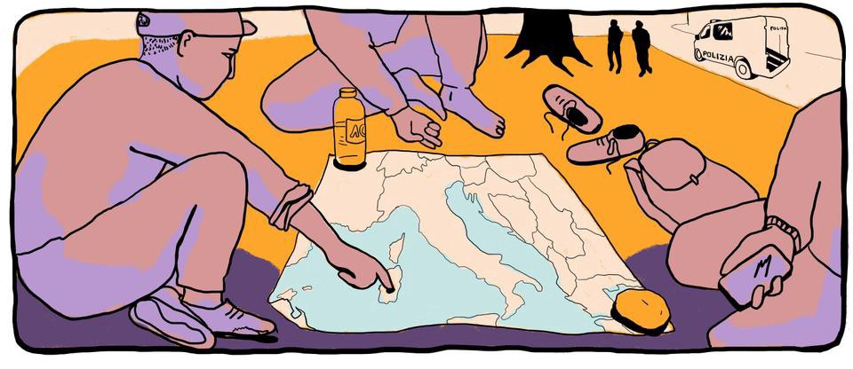
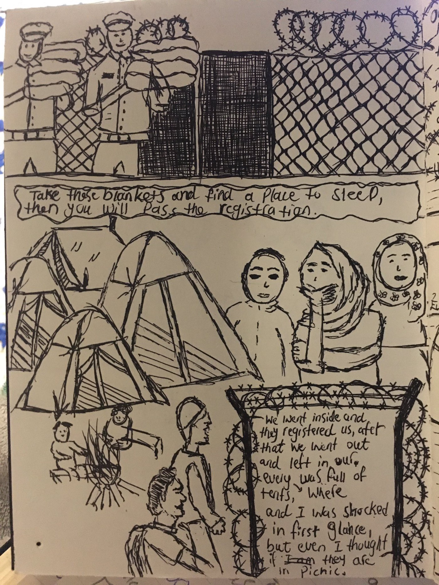
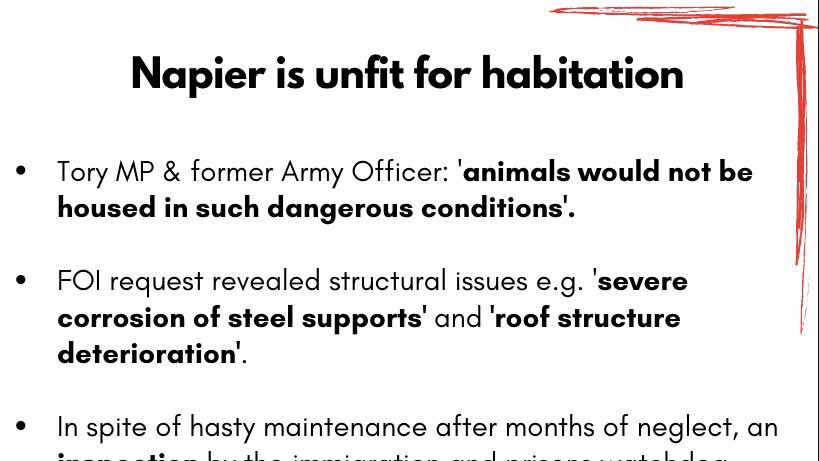
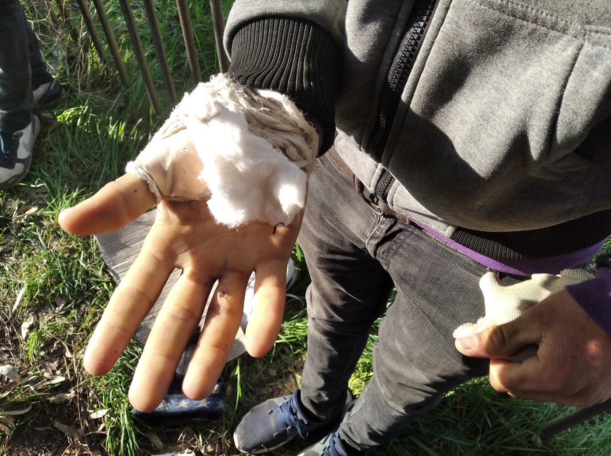

### AYS Daily Digest 09/04/2021 — Young Man Drowned Off the Coast of Melilla
### New rescue vessel coming to the Mediterranean//New integration scheme in Greece//The Balkan route during the pandemic

[Are You Syrious?](?source=post_page-----99962ea8f51e--------------------------------)

[Apr 10](ays-daily-digest-09-04-2021-young-man-drowned-off-the-coast-of-melilla-99962ea8f51e?source=post_page-----99962ea8f51e--------------------------------) · 10 min read

### FEATURE
### Another young person drowns off the coast of Melilla

In the past month and a half, [seven people](https://www.publico.es/sociedad/migrantes-ahogados-melilla-expulsado-centro-acogida-18-anos-extutelado-m-septimo-migrante-ahogado-mes-medio-melilla-septimo-migrante-ahogado-aparece-melilla-mes-medio-joven-extutelado.html?fbclid=IwAR26J1Wbjy8SVgng5tEv4BwJhWn_Elkxbsdw8gl3P5pbPivM_iiFx9eXxuc) have drowned off the coast of Melilla\. Tragically, the most recent victim was barely 18\. He had recently been expelled from the reception centre upon his 18th birthday\.

MS came to Melilla from Morocco when he was still a child\. Like many other minors, he started out in a reception centre, then slept in the Plaza de Toros after he was kicked out\. His friends and companions are grieving his death even as they themselves face many dangers sleeping rough in Melilla\. Those who knew him describe him as a quiet young man who even earned a letter of good conduct from the juvenile centre he stayed at\. Although some speculate he died stowing away on a ferry to the mainland, which he had been trying to reach for a long time, others doubt this story\.

There is a strong possibility that his body cannot even be returned to his mother in Morocco due to border closures\.

The legal limbo that many people, including minors, who come to Melilla get stuck in push many to try desperate methods such as stowing away on a ferry to the mainland\. The Immigration Relations authorities often delay processing residency permits for months and even years\. Other desperate people try to swim to the fortified enclaves of Ceuta and Melilla from Morocco\. The crossing is short but deceptively dangerous thanks to a [strong current](https://www.infomigrants.net/en/post/31341/swimming-to-melilla-migrants-think-it-s-faster-but-above-all-it-s-very-dangerous?preview=1617957858409&fbclid=IwAR3itOaOCiYqMHQ1FvL8EZDI5SAzrnyHPb6IPv9_9cdT-5Nqp_nskHqmy44) \.

The death of M not only exposes the dangerous routes to and from Melilla but the overall dangers of Spanish sea crossings\. Another frequent route, the crossing to the Canary Islands, is also dangerous\. Last month, people were shocked to learn about a two\-year\-old Malian girl who died in a hospital after the crossing\. Authorities have since learned that [nine others](https://www.efe.com/efe/canarias/sociedad/nueve-companeros-de-la-nina-mali-murieron-en-el-mar-tres-ellos-menores/50001312-4507694?fbclid=IwAR3cTDSuESYvrlEQ5NwajNbZoeCy8LFeQ_NutaK1g4DTDqrTuiKo5nc-oJA) from that same group died on the crossing, including three children\. Authorities are investigating the “bosses” from this crossing\. In an unrelated operation, authorities detained [fifteen people](https://www.eldiario.es/canariasahora/migraciones/macrooperacion-gran-canaria-desmantela-red-trafico-migrantes_1_7394234.html?fbclid=IwAR3JsZwie3mPjyqpvk3TG2SmhEad8OOBcHS7DUSTRVOFODC-MAaM9YH5OIY) accused of smuggling\.

Even though the Canary Islands are safer than the sea, the situation on the archipelago is still bad for people on the move\. The Spanish government is effectively using the islands to implement a [containment policy](https://www.infomigrants.net/en/post/31419/cear-says-canary-islands-used-for-political-containment?fbclid=IwAR1XO1mXYvX6a1lnmBkYVa14PnkOBdG9V3EozKmIXRx9yB430z48sKa6Ilw) , similar to the Aegean islands\. People are suffering from [racism](https://www.rtve.es/noticias/20210401/canarias-via-crucis-migrantes/2084142.shtml?fbclid=IwAR23MJPavQL5vSU25hHfujhl5KmqgjIAvY49enlkLQ7j707VAEupfFjIOcU) and a lack of institutional support\.
### LIBYA
### Shooting in detention centre, one dead and two injured

Two teenagers were hurt during a [shooting in the Al\-Mabani](https://www.msf.org/people-dead-and-injured-following-libya-detention-centre-shooting?fbclid=IwAR3N7jqWvyfdep7g8BchAyoiQa2-5JoFmGgHK1ZXal1w1j-6rrXWnIRO5Wc) Detention Centre located in Tripoli\. Due to overcrowding, tensions have been rising in the centre for months\. Reports said that guards fired at random into cells in order to “control” the tension\.

When European authorities work with the so\-called Libyan Coast Guard to push people back to Libya, this is what they are forcing people to return to\.
### SEA
### New rescue vessel in the Mediterranean

A new ship, the [_Rise Above_](https://twitter.com/SEENOTRETTUNG/status/1380553532097634308) _,_ will join the vessels patrolling the Mediterranean\. The ship is funded by Mission Lifeline, and you can support their work [here](https://mission-lifeline.de/spenden) \.

Civilian rescue ships must patrol the Mediterranean because authorities, including those involved in [Operation IRINI](https://twitter.com/seawatchcrew/status/1380544028224065538) , do not conduct rescues\.
### GREECE
### New integration programmes

Earlier this week, Greek authorities announced a plan for [new integration programmes](https://www.kathimerini.gr/society/561317578/camp-entaxis-prosfygon-me-mathimata-ellinikon-kai-chrisis-i-y/?fbclid=IwAR1XO1mXYvX6a1lnmBkYVa14PnkOBdG9V3EozKmIXRx9yB430z48sKa6Ilw) in some mainland camps such as Eleonas, which will be the pilot\. The scheme would host people with recognized refugee status and provide them with Greek language classes, computer courses, career counseling, and other support\. About 1,000 people chosen on criteria that are yet to be determined would kick off the programme\.

This programme, if enacted according to plan, should provide people with much\-needed resources\. However, it is a shame that after so many years there is no existing integration programme besides the underfunded HELIOS\. There are also concerns about the details of the plan and the fact that potentially some people [may have to leave Eleonas](https://www.facebook.com/europemustact/posts/275245164088185) \.
### Updates from around Greece

_Northern Greece:_

More and more people are attempting to cross the northern Greek border with North Macedonia on their path to Europe\. Some days, [over 100 people](https://twitter.com/g_christides/status/1380131223402643458?fbclid=IwAR3EME11I_Nn7UKEwcbHIIMOBC7FthFvV6oJrMEsr2ubXdcyLZKckz2DpEM) are caught attempting the crossing, and there are no clear figures on the number who make it\.

_Evros:_

Local media in Evros continues to publish [fear\-mongering content](https://www.evros-news.gr/2021/04/09/%ce%bf%cf%81%ce%b5%cf%83%cf%84%ce%b9%ce%ac%ce%b4%ce%b1-%cf%86%cf%84%ce%b9%ce%ac%cf%87%ce%bd%ce%b5%ce%b9-%ce%bf-%ce%ba%ce%b1%ce%b9%cf%81%cf%8c%cf%82-%ce%ba%ce%b1%ce%b9-%ce%bf%ce%b9-%ce%bb%ce%b1%ce%b8/) about people on the move\. Now, apparently, people are being threatening by — [sitting in the sun](https://twitter.com/lk2015r/status/1380536223337484290?s=20&fbclid=IwAR3zU_MaTDE2GlPZU1wt5vGmbED4pAechEDeBQ7zhCYJI0nM2amAr_EPuKk) \. This time they directly published a video taken by a former Golden Dawn party candidate, showing the troubling connections between media and Greek fascists\.

_Ritsona:_

There are [1,290 children](https://www.facebook.com/lighthouserelief/posts/3823540144435165) in Ritsona camp, and they are not allowed to learn\. [This video](https://www.youtube.com/watch?v=83igYK_Lg7Q) highlights some of their stories and their dreams that they can continue with school\. As [this report](https://rsaegean.org/en/excluded-and-segregated-the-vanishing-education-of-refugee-children-in-greece/?fbclid=IwAR1NGOIsEW9p69fSL32SrNZ-jVbNfdkEraLs-g1wuG-p0S5yPlY0W2X54K4) from RSAegean shows, the exclusion of children on the move from school has only gotten worse during the pandemic\.

_Lesvos:_

A group of 70 people contacted [Aegean Boat Report](https://www.facebook.com/AegeanBoatReport/posts/1061941890995581) for support after landing near Tsonia on the island of Lesvos\. Thankfully, nobody was hurt, although many small children were packed into the small dinghy\. The people were probably taken to the quarantine camp in Megala Therma\.

_Aegean Islands_

UNHCR have published their weekly snapshot of the population on the islands, which you can find [here](https://data2.unhcr.org/en/documents/details/85886) \.

_General:_

Since the beginning of 2021, [almost 3,000 people](https://twitter.com/Malichudis/status/1380603813254590471?s=20&fbclid=IwAR3P6Ghf9gapVDrTD2HYjpV_RZ6pKfqyXPURYFkpxkEnfvCrKjIX_N0Jiz4) with recognized refugee status have already left Greece to reapply for asylum in Germany, leading many to speculate that pushing people out is the national government’s unofficial policy\. In fact, earlier this year a German court ruled that people could not be sent back to Greece because of the awful conditions and “ [extreme material hardship\.](https://www.spiegel.de/politik/deutschland/asyl-tausende-fluechtlinge-fliehen-aus-griechenland-nach-deutschland-a-5d85f9e9-0002-0001-0000-000177062059-amp?fbclid=IwAR28CGy01r2swhM9dF_oNwUdUrXo1KSci1VX1OXiM-b2m3UTfC6D-UCO_3A) ”

The crime reporter Giorgos Karaivas was [gunned down](https://ipi.media/mfrr-shocking-murder-of-greek-tv-journalist-demands-immediate-response/?fbclid=IwAR1n8MX78e9XWaiHmEkdgAtox_wI3-bLq8vwkfKpcvVmmTLTJMUDgHhylKc) in broad daylight today\. The suspects have not been found yet, but people are speculating that Karaivas was targeted for his work as a journalist\. Our thoughts are with his family and colleagues\. Unfortunately, this incident shows just how dangerous dissent has become in Greece\.

Support families on the move dealing with poor camp rations by donating to Choose Love’s Ramadan fundraiser\. More information [here](https://twitter.com/chooselove/status/1380451344499273729?fbclid=IwAR3qiSEdvtjc_Gm69d96nfET_rD-qWG3NENrcBDeFT9ZxmbJ21xGfCTNe08) \.
### BALKAN
### The Balkan route during the pandemic

We would like to highlight a special report written by David L\. Suber and Roshan De Stone, “Torture and Pushbacks: Stories of Migration to Europe During Covid\-19,” published in [TRT World](https://www.trtworld.com/magazine/torture-and-pushbacks-stories-of-migration-to-europe-during-covid-19-45421) \. Their story follows the violence along the Balkan route, specifically illegal pushbacks conducted by Italian, Slovenian, and Croatian police\. Our fellow members of the [Border Violence Monitoring Network](https://www.borderviolence.eu/torture-covid-19-and-border-pushbacks/?fbclid=IwAR1D52c61HH3xacxeUdAZSJmP55wR_CKYkE7VNY6_emLbri4LZzWT0no3EY) , Centre for Peace Studies, No Name Kitchen, & Info Kolpa, were interviewed for this article\.

Although the militarized situation along the Balkan route has been going on for some time, it has only been exacerbated by the COVID\-19 pandemic\. Harsh lockdowns have trapped many people on the move in camps or other transit points\. Many European states are using the pandemic as an excuse to increase militarization of borders and to use military force to patrol border areas\. The pandemic seems to have emboldened law enforcement, as reports of brutality and torture, especially along the Croatian border, are growing\.

The pandemic has also made it easier for misinformation to spread\. Locals began blaming people on the move for spreading COVID\-19, even though many people in camps are actually at high risk of contracting the disease due to the awful conditions they are kept in \(cases are [currently rising](https://www.infomigrants.net/en/post/31430/bosnia-covid-19-infections-rising-in-migrant-camps?fbclid=IwAR1XO1mXYvX6a1lnmBkYVa14PnkOBdG9V3EozKmIXRx9yB430z48sKa6Ilw) in the Bosnian & Herzegovinian camps\) \.

Miha from _Info Kolpa_ says:

> _What Europe is ignoring is that this is a system of coordinated chain\-pushbacks, designed to send people back from Europe to Bosnia, a non\-European Union country\. And adding to the breach of human rights, no one is worrying about the high risk of contagion\._ 

You can read the full article [here](https://www.trtworld.com/magazine/torture-and-pushbacks-stories-of-migration-to-europe-during-covid-19-45421) \. It is a comprehensive overview of the way in which the situation on the Balkan route has worsened over the past year or so, featuring the perspectives of many of our colleagues\.

The article is accompanied by illustrations from Hannah Kirmes Daly, also a member of the [Brush & Bow](https://brushandbow.com/) artistic collective\. A high resolution version of the illustrations can be found [here](https://www.borderviolence.eu/wp-content/uploads/PUSHBACKS-COMIC-.jpg) \.
### BOSNIA & HERZEGOVINA
### Uighur man detained at Sarajevo Airport

Wumaier Aerbati, a young Uighur man, was [detained at the Sarajevo airport](https://radiosarajevo.ba/metromahala/teme/ujgur-zadrzan-na-aerodromu-sarajevo-strahuje-za-zivot-zbog-moguce-deportacije-u-kinu/413105?fbclid=IwAR3JsZwie3mPjyqpvk3TG2SmhEad8OOBcHS7DUSTRVOFODC-MAaM9YH5OIY) and threatened with deportation to China\. If returned, he could be in serious danger of imprisonment or torture\. When contacted, local authorities did not give a clear reason for his detention\.

Later, Aerbati was told that he would be deported [back to Turkey](https://twitter.com/SalihHudayar/status/1380547095258660867) instead of China\. However, Turkey also has a history of deporting Uighurs, so advocates are still fearful for the man’s fate\. Advocates have since lost contact with him\.
### ITALY
### Protests against policy denying rights to “illegal home occupiers”

Advocates are calling for the [abolition of Article 5](http://www.martabonafoni.it/news/aderisco-allappello-contro-piano-casa-renzi-e-lupi/?fbclid=IwAR1NGOIsEW9p69fSL32SrNZ-jVbNfdkEraLs-g1wuG-p0S5yPlY0W2X54K4) , informally called the “House Plan\.” This law excludes anyone who has “illegally” lived in a home from accessing residency and effectively bans them from any other social services\.

Also in Italy, labor unions in Tuscany [expressed concern](https://www.infomigrants.net/en/post/31423/italy-labor-union-reports-gangmaster-violence-in-tuscany-farming?fbclid=IwAR20gtl4pROVe-PfeTF9AeqCC__ecdbfBQAU1LCk1dZipj6H_e28OLoU6RI) after receiving reports of the exploitation of foreign workers\. Workers reported punishingly long work days, low wages, and threats if they tried to organize\.
### FRANCE
### Ridiculous persecution of activists

When the charges do not stick, make up new ones\.

At least, that seems to be the official governmental policy against eight [activists from Collectif Requisition](https://www.facebook.com/permalink.php?story_fbid=1698618093672289&id=598228360377940) who participated in the occupation of Hotel Dieu in Paris back in February\. Initially summoned for imaginary violent acts, they were then charged with organizing a demonstration on a public highway\! The new court procedures will be in May\. There will not be a public trial initially, only a “composition penale,” where the prosecutor will put forward a penalty and the defendants can recognize their crimes and pay a fine\.

Lawyers are hard at work to create a strategy to deal with this latest intimidation tactic\. Until then, all our solidarity with our French comrades\. On Lache Rien\!
### GERMANY
### Remembering deportations on International Romani Day

Yesterday was International Romani Day\. Activists in Germany took that opportunity to remind authorities that [most deportations from Berlin](https://twitter.com/fluchtlingsratB/status/1380438617215152131?s=20&fbclid=IwAR20gtl4pROVe-PfeTF9AeqCC__ecdbfBQAU1LCk1dZipj6H_e28OLoU6RI) target Roma people fleeing persecution in Moldova or the Balkans, showing that anti\-Roma racism is unfortunately still a foundation of European legal policy\.
### NETHERLANDS
### Technical analysis of racism

A Dutch group launched the _Racism and Technology Center_ which will study the way digital technologies in the Netherlands perpetuate racism\. You can read more about their work [here](https://www.statewatch.org/news/2021/april/netherlands-racism-and-technology-center-launches-to-highlight-racism-in-dutch-society/?fbclid=IwAR3qiSEdvtjc_Gm69d96nfET_rD-qWG3NENrcBDeFT9ZxmbJ21xGfCTNe08) \.
### DENMARK
### Danish deportation threats draw criticism from UNHCR

The UNHCR [has criticized](https://news.un.org/en/audio/2021/04/1089432?fbclid=IwAR0Oaou4dk3YCPw2dNcl1JR5-gQ3ZoCbaHgtN2ODoPEnQNdqoctXpg1egf0) the Danish decision to take away residency permits from Syrians\. The agency maintains that Syria is not safe for any returns and that all governments need to continue protection\.

Families are still reeling from the news that their loved ones could be returned to an area that is not safe at all\. Some of the Syrians that have had their residencies revoked are children [as young as 10](https://www.thelocal.dk/20210409/my-mother-risks-going-to-jail-why-is-denmark-sending-refugees-back-to-syria/?fbclid=IwAR0x7cWODnwEdNZry6g-nKOnor-ehjGyybvNnmtuKstIkddvMPOfnEmyemc) \. Advocates are also questioning the validity of the report that the Danish government based its decision on\. The most recent report was based only on written correspondence and Skype conversations, with no visits on the ground\.

Family members who are deported might never see their loved ones again as Denmark does not give Syrians visas to visit\.
### SWEDEN
### Bill to limit permanent residency to those who can speak Swedish

Sweden’s ostensibly centre\-left government has proposed a bill to [further restrict immigration](https://news.yahoo.com/sweden-proposes-bill-giving-citizenship-173737713.html?soc_src=social-sh&soc_trk=tw&tsrc=twtr&guccounter=1&guce_referrer=aHR0cHM6Ly90LmNvLw&guce_referrer_sig=AQAAANKzh1Dd4hVEqpWMWAIp9Ri2bZm5cmJKXXNsjClg84oYiJ62UIknAJy--o46VKCLnFgzKFAhGT6UY2TJgzzz0LRlFvT-4lFdXQz-f4g1pUHTxiqGKlqXVxp8FzjCTl6qFeUHMFeQz3b2h58LjLJ1fN-glQ3F5B8-Ja84P2nnPFlE) to the Scandinavian country\. Among other provisions, the bill would only grant permanent residency to applicants who could prove they can speak Swedish and support themselves\. Asylum seekers will also no longer receive permanent residency by default\.
### UK
### Arrivals continue at Napier Barracks despite condemnation

For months, people on the move, advocates, and even Tory MPs have called on the Home Office to close the Napier Barracks because of the awful conditions there\. Instead of closing the barracks, the Home Office is planning to move people [from hotel accommodation](https://twitter.com/Care4Calais/status/1380551491015036928?fbclid=IwAR0aw4uCP_YFIPaWvO0T3i_eMrKFQNKZHG4p2140iVwNAzWJurOJIumh7oM) into the barracks\. The first new arrivals \(unclear if they are from hotel accommodation or somewhere else\) have already [arrived today](https://twitter.com/andyaitchison/status/1380488777047683074?s=20&fbclid=IwAR1TnGtDZnTGffpGWkgCbrGo2b7FuCxJ-Kdt-l6XpsOopIHkvU8U542Yx2U) \. Men recently released from the barracks have also [been returned](https://twitter.com/RefugeesAtHome/status/1380234189736398853?s=20&fbclid=IwAR3_lDxJX3KndgPhbry12as4um-u-n3KcbKUMUgCWIubK_huXuRRpwfSDSs) to the place that they thought they had escaped\.

More of the Home Office’s usual care for human rights:
### EU/FRONTEX
### More bizarre Frontex PR

Frontex has previously made some baffling attempts at cleaning up its image\. For example, [this blog](https://blogs.lse.ac.uk/wps/2021/03/31/securityhasnogender-frontex-border-security-and-the-politics-of-gender-neutrality/?fbclid=IwAR0aw4uCP_YFIPaWvO0T3i_eMrKFQNKZHG4p2140iVwNAzWJurOJIumh7oM) unpacks the agency’s \#SecurityHasNoGender campaign, which tried to whitewash its repeated violations of human rights with the facade of gender equality\.

Now, they are launching a [Frontex photo contest](https://frontex.europa.eu/media-centre/news/news-release/frontex-photo-competition-europe-day-PxeK4e?fbclid=IwAR2lHXW5FhFrJGH8Hz1-YSgV7ObP-F-vi6yuRkrYTULKQ-J6-YRsBGByiY8) among officers to celebrate Europe Day on May 9th\. Categories include “cooperation with national authorities,” “Frontier landscapes,” and most ironically, “a helping hand at the border\.”

### GENERAL

Kosovo 2\.0 is hiring a senior editor\! Check out the posting [here](https://kosovotwopointzero.com/en/we-are-hiring-senior-editor/?fbclid=IwAR3H9UHGuDETFqnkKc_m_x9mRbytxeW3GLwIF7cAJ3-gZtNHDiUjixnsRfY) \.
### WORTH READING:

It’s Friday, which means that for many organizations, it’s newsletter day\. Check out the ECRE Weekly Bulletin [here](https://mailchi.mp/ecre/ecre-weekly-bulletin-09042021?fbclid=IwAR1hAtAuGLnm3ik2uQoCmD4XRlcZstwUU9REEPd7se0OF6r3uFcCVT7tybs) and the Institute of Race Relations newsletter [here](https://preview.mailerlite.com/m1h2a7?fbclid=IwAR26J1Wbjy8SVgng5tEv4BwJhWn_Elkxbsdw8gl3P5pbPivM_iiFx9eXxuc) \.

Where does the border industry make its money? Learn more about one of the most powerful industries in the world [here](https://www.tni.org/en/financingborderwars?fbclid=IwAR2HbBLLwjhkh6yiYWXKKKznFg0haHBJdvGJVivpVwQilwqVNhfLNbNuJCg) \.

With the UK’s new migration policy, asylum is effectively dead\. Learn more about the dangerous implications of this plan [here](https://discoversociety.org/2021/04/07/the-death-of-asylum-and-the-search-for-alternatives/?fbclid=IwAR07BljPzW8q18a3RD2JSlockHFBfjBnr9TgSb06PTjX_qee2vfVx1NDjIE) \.

**Find daily updates and special reports on our [Medium page](https://medium.com/are-you-syrious) \.**

**If you wish to contribute, either by writing a report or a story, or by joining the info gathering team, please let us know\.**

**We strive to echo correct news from the ground through collaboration and fairness\. Every effort has been made to credit organisations and individuals with regard to the supply of information, video, and photo material \(in cases where the source wanted to be accredited\) \. Please notify us regarding corrections\.**

**If there’s anything you want to share or comment, contact us through Facebook, Twitter or write to: areyousyrious@gmail\.com**

_Converted [Medium Post](https://medium.com/are-you-syrious/ays-daily-digest-09-04-2021-young-man-drowned-off-the-coast-of-melilla-a58e2bffc984) by [ZMediumToMarkdown](https://github.com/ZhgChgLi/ZMediumToMarkdown)._
