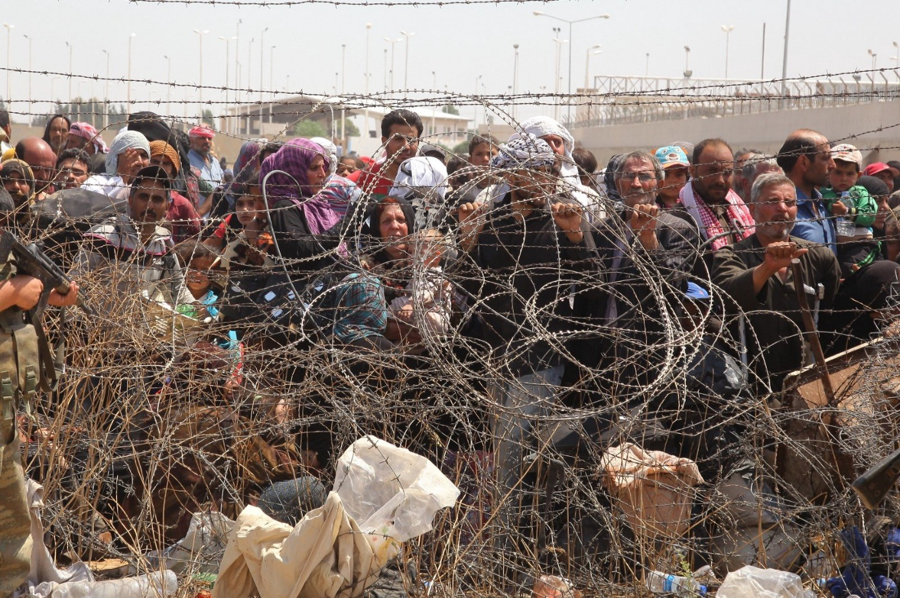
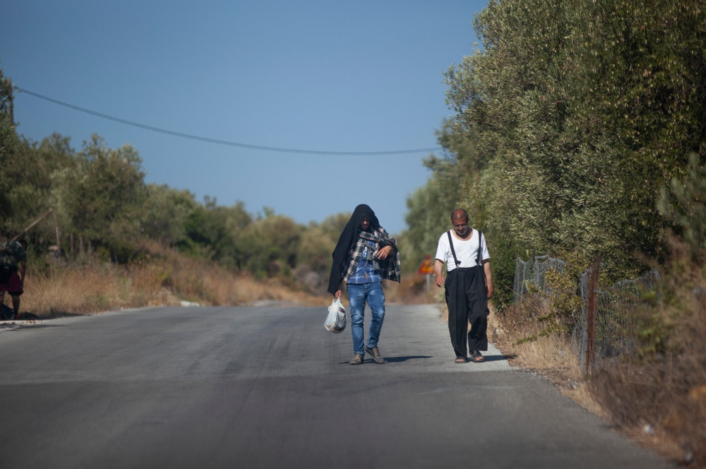
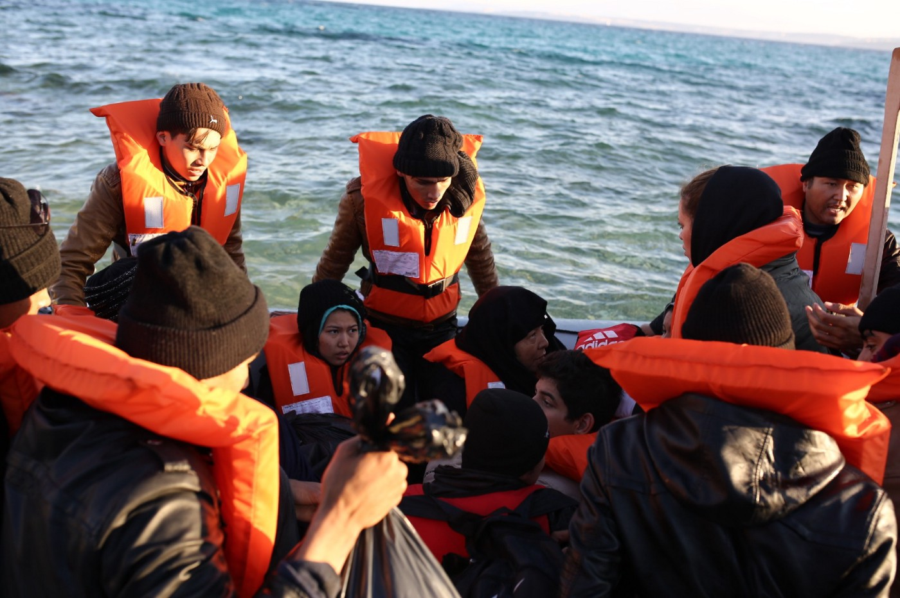
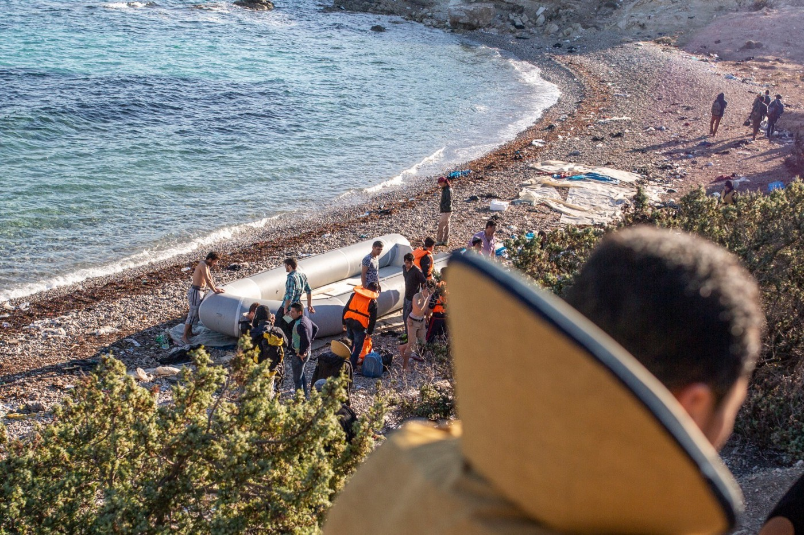

### AYS Special from Turkey — **The Panorama of Refugee Rights during the pandemic**

_The world has been turned upside\-down by Covid\-19 while people are still struggling with climate crisis, racism and global poverty\. As in every global crisis, the most affected groups are the most disadvantaged\. Covid\-19 is having a powerful and negative impact on unemployment, violence against women, poverty and human rights all over the world\. In Turkey, people on the move have been one the most affected groups, as happens far too often\._

 \)](assets/f83509fabbd1/1*nHQNTIcojbxf3Ri_653BWQ.jpeg)

\(Photo Credit: [Bianet](https://bianet.org/english/law/240964-police-officer-sentenced-to-prison-over-killing-of-festus-okey) \)

After the first Covid\-19 case in March 2020, Turkey began implementing prevention measures\. The situation for people on the move has become even more ‘fragile’ during the pandemic due to a lack of coordinated policies designed to support them\. The following headlines can summarise some of the developments in the country since then\.
#### **Opening the border with Greece**

On February 27 2020, 33 Turkish troops [lost their live](https://www.theguardian.com/world/2020/feb/28/tensions-rise-between-turkey-and-russia-after-killing-of-troops-in-syria) s in İdlib, Syria\. After this, the Turkish government ‘ [opened](https://www.nytimes.com/2020/02/28/world/europe/turkey-refugees-Geece-erdogan.html) ’ the Greek land border at Edirne\-Pazarkule, as they had threatened to do on many previous occasions\.

\(Photo credit: Mert Çakır\)

People on the move were used as a trump card: thousands of people from various cities [made their way](https://multecihaklari.org/?p=779) to the border, and were forced to [stay](https://gocarastirmalaridernegi.org/tr/yayinlar/analizler/160-turkiye-yunanistan-sinirinda-neler-oldu) on the Turkish side for weeks during an extraordinarily cold winter and in conditions against human dignity\. While trying to cross the border, they faced harsh interventions from Greek authorities, showing again the inhuman nature of the EU’s border policies\.

> The ‘opening’ of the Greek border has been a clear example of the instability and harmfulness of Turkey’s migration policy\. Despite this, in the aftermath of the events, no initiative to protect human rights has been taken by the EU\. On the contrary, it has started negotiations to extend the EU\-Turkey deal\. 

After the first cases of Covid\-19 in Turkey, people stuck at the border had to return to the cities where they had lived previously\.

\(Photo credit: Mert Çakır\)
#### **Covid\-19 Pandemic**

In Turkey as all over the world, Covid\-19 multiplied inequality, disproportionally affecting disadvantaged groups such as poor people, women, children and people on the move\. There were no pandemic\-related policies addressing the specific situation of people on the move in the country, meaning, among other things, that undocumented people could not access free health care\.

The first reaction of companies experiencing financial duress due to the pandemic was to fire unregistered refugee employees\. In such conditions, it became impossible to maintain or to find a job, increasing poverty and precariousness in people’s lives\.

Education continued through online learning, but this was impossible to access for those students who did not have internet and digital equipment\. On top of this, deep poverty made it difficult for children to continue their education\. As many studies have showed, children in poor economic situations quit their education early to start working\.

> For children on the move, the impossibility of accessing online learning, combined with poverty as well as language barriers and discriminatory policies meant that they entered working life earlier than their age\-mates\. With Covid\-19, cheap child labour has become widespread\. 

For more info, read the report ‘ [**Impacts of Covid\-19 on Refugees Daily Life in Turkey**](https://media.ifrc.org/ifrc/document/impact-covid-19-daily-life-refugees-turkey/) **’** by IFRC and the Turkish Red Crescent\.
#### **Removal Centres, Rape and Torture Allegations**

With each passing day, the removal centres where refugees are kept under administrative detention have become more like prisons for people on the move\. News about violations of human rights in these centres has only increased, despite them being closed to monitoring by non\-governmental organisations\.

In July 2020, reports about the rape of an Iranian woman by security guards in the Removal Centre in Van [came out](https://m.bianet.org/english/women/234468-woman-sexually-assaulted-in-van-removal-center) \. But it was not until November that two security guards were charged with ‘aggravated sexual assault’ and sent to prison\.

In February 2021, one man from Afghanistan detained in Aydın Removal Centre [hanged himself](https://www.gazeteduvar.com.tr/aydin-geri-gonderme-merkezi-savastan-kacip-cehenneme-dustuler-haber-1515887) as a result of torture and abuse\. Only then did multiple reports of allegations of violence and torture surface\. Detainees reported being unable to access water and hygiene and that they were beaten by the authorities\.
#### **Ali El Hemdan, a young man killed by the police**

With the increasing racism, discrimination and lack of socialisation and integration, refugees have become the most disregarded and stigmatised group in Turkey\.

Covid\- 19 related curfew measures were applied only to people under 20\-years\-old\. In July 2020, 18\-year\-old Ali El Hemdan left his home to go to work, despite the ban, because he had to work\. He was stopped by a police patrol\. He did not want to give his identity because he was a refugee under 18 who had not complied with the ban\. When he started to turn back in the opposite direction a policeman followed him\. As the policeman was shouting at him to stop, he did so and turned towards the policeman, who shot the young man in the heart\.

Ali El Hemdan died at the scene\.

> The killing of Ali El Hamdan is engraved in our memory as paradigmatic of the perception of people on the move in Turkey\. 

#### **Ongoing Border Crossings and Loss of Lives**

Thanks to the border policies financed and implemented by the European Union in the last 5 years, millions of people are trying to survive in Turkey, despite a substantial lack of rights\. For people who can’t see any future for themselves in the country, irregular crossings are a way out\.

Although they know that crossings are getting much more [difficult](https://www.dw.com/tr/egede-s%C4%B1%C4%9F%C4%B1nmac%C4%B1lar%C4%B1-ta%C5%9F%C4%B1yan-tekne-batt%C4%B1/a-55540218) and that people are living in inhumane conditions in the Greek islands, despair forces them to take this decision regardless\.

\(Photo credit: Mert Çakır\)

Increasing security policies against people on the move in Turkey have made it impossible for them to move freely in the country, forcing them to resort to smugglers and dangerous routes in order to move from one city to another\. Tragically, in July 2020, 18 people [lost their lives](https://gazetekarinca.com/2020/07/van-golunde-batan-tekne-dort-multecinin-daha-cansiz-bedenine-ulasildi/) when their boat sank while crossing lake Van, in the east of the country\.
#### **Festus Okey Case**

In March this 2021 we can look to one progressive case in terms of police accountability and refugee rights in Turkey — the [sentencing](https://bianet.org/english/law/240964-police-officer-sentenced-to-prison-over-killing-of-festus-okey) of the policeman who killed Festus Okey, a Nigerian refugee, in a police station in 2007\. The fact that the criminal did not go unpunished was the result of a 15\-year\-long campaign by refugee rights activists and can be seen as an important development for the rights of people on the move in Turkey\.

Yet, though it is gratifying that the perpetrator of Festus Okey’s death was indeed punished, the fact that it took 15 years to get justice — and that the case was drawn out for so long — still raises concerns about refugee rights in general\. Whether this decision is positive in terms of refugee rights in Turkey in the long run will only be clear when we see the results of future cases\.

**By Dilan Taşdemir, r** efugee rights activist\. Co\-founder and general coordinator of the [Media and Migration Association](https://l.facebook.com/l.php?u=https%3A%2F%2Fmedyavegoc.org%2Fen%2F%3Ffbclid%3DIwAR1eSoISaT9baRGbhpS0yBYeMUNGMTzhKkzuThgCBWGRlH7BoGJqqkjVVU8&h=AT0Aw8VrDDD_oErSRBUReMFVitqmEZeSHyvyn_eOnD5e8Fx-nLzGnf8kGT0LDmU_GS_RjoHnaBQgZcTH6AlCppDfjptrnXDWLoibQRreswiFFv-A0BZOZNtxGJSiYLlN1l0) , which works on combating hate speech against refugees in the media\.

**Find daily updates and special reports on our [Medium page](https://medium.com/are-you-syrious) \.**

**If you wish to contribute, either by writing a report or a story, or by joining the info gathering team, please let us know\.**

**We strive to echo correct news from the ground through collaboration and fairness\. Every effort has been made to credit organisations and individuals with regard to the supply of information, video, and photo material \(in cases where the source wanted to be accredited\) \. Please notify us regarding corrections\.**

**If there’s anything you want to share or comment, contact us through Facebook, Twitter or write to: areyousyrious@gmail\.com**

_Converted [Medium Post](https://medium.com/are-you-syrious/draft-ays-special-from-turkey-the-panorama-of-refugee-rights-during-the-pandemic-f83509fabbd1) by [ZMediumToMarkdown](https://github.com/ZhgChgLi/ZMediumToMarkdown)._
