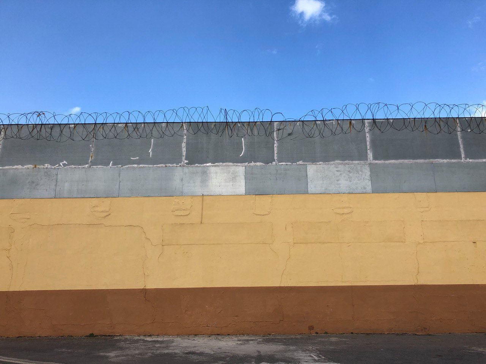

### AYS Weekend Digest 10\-11/4/2021 — Bans on Protests and Criminalisation in the Canaries

More pushbacks involving Bulgarian, Greek and Turkish authorities\. Sea\-Eye’s Alan Kurdi is free again\. Attempted breakout from Milan’s CPR\. Continued evictions in Calais and Grande\-Synthe and much more…

 \)](assets/6dc9ca48f0f/1*ox1sua-eOythT3wW1IuDKA.jpeg)

“If migrating is a crime, ours is indifference” \(Photo via: [Amayra Garcia](https://twitter.com/Amayra_gc/status/1380849177115115521/photo/1) \)
#### Featured — Bans on Protests and Criminalisation in the Canaries

This weekend [protests were planned](https://asambleadeapoyoamigrantesentenerife.blogspot.com/2021/04/convocatoria-10-de-abril.html?fbclid=IwAR17HVaIsiWpdvO8GvtWEk580aiFXmAJxaBrngbO4xFS0ecIiPOpmVxoOBg) in the Canary islands\. On Friday, however, local authorities [banned](https://asambleadeapoyoamigrantesentenerife.blogspot.com/2021/04/concentracion-cancelada.html) the demonstration organised for the following day in Tenerife, the island that hosts more than 1,000 people in the largest camp of the archipelago, Las Raices\.

People in Las Raices have been protesting against living conditions, unhealthy food and lack of medical care since the beginning of the year\. Dozens of people have been on hunger strike, while many spontaneous protests took place in the camp\. As we reported, the security company guarding the camp has often [responded violently](https://twitter.com/AsambleaMigraTF/status/1380840149861404673) and requested the support of riot police to crush these legitimate demands\.

This is an [open letter](https://asambleadeapoyoamigrantesentenerife.blogspot.com/2021/04/mensaje-de-los-companeros-migrantes.html) from the camps’ residents to the inhabitants of the islands:

> Dear Canarian People\. 

> Today we wanted to demonstrate for the situation we have been experiencing for months\. Since we arrived, we have been held hostage on the islands as if the Canary Islands were a prison\. But for us it is only a place of passage in the migratory process\. We protest because we are fed up with the lack of answers, because they prevent us from continuing our journey to reunite with our families or find a job\. 

> We have been forced to travel because the situation in our countries is unsustainable, there are only hunger and hardships left\. We have risked our lives looking for a better future\. We have seen comrades die on the way\. 

> We did not come here to eat and sleep, we want to continue our journey to work, because there are entire families that depend on us, the people who migrate\. 

On Saturday, the Tenerife Migrants Support Assembly held a press conference in front of the local authorities’ office, to protest against the ban on the demonstration and to demand the closure of the camps and the end of geographical restrictions, which prevent people from leaving the islands to reach the Spanish mainland\. Their campaign \#StopSecustroMigrantes — Stop migrant kidnapping — stands against the [containment policies](https://www.infomigrants.net/en/post/31419/cear-says-canary-islands-used-for-political-containment?preview=1617957487388&fbclid=IwAR3e0hILg_0EtFk4wDIuaDml0DizSgajdSxPlGTGGl3Zq1GC5_vO_ZY7Vdc) that are turning the Canary Islands into open\-air prisons, and has received support from many solidarity groups in Spain and beyond\.

> … we call this [press conference](https://asambleadeapoyoamigrantesentenerife.blogspot.com/2021/04/comunicado-de-la-asamblea-de-apoyo.html) to show our absolute rejection of the untimely refusal by the Government Sub\-delegation to the act planned this morning to denounce the serious events that have been occurring since they decided to convert to the Canary Islands in a prison for migrants, thus violating article 13 of the Universal Declaration of Human Rights which reads as follows: 

> 1\. Everyone has the right to move freely and to choose his residence in the territory of a State\. 

> 2\. Everyone has the right to leave any country, including his own, and to return to his country\. 

> The Government of the Spanish State of the PSOE and Unidas Podemos has built a war scene in the Canary Islands, a cemetery of human beings where the lives of these people lack value and dignity\. A place where time devours them, held them back, full of despair and anguish\. A place where humiliation, indignity and laziness have been normalised to an unsustainable point\. 

 \)](assets/6dc9ca48f0f/1*zT709cQzV39TnsQjimal1A.jpeg)

“Stop police abuse in Las Raices” \( [Photo by Tenerife Students’ platform](https://twitter.com/pestudiantestnf/status/1380837936942481408/photo/1) \)

In Tenerife city centre, on Saturday, police [stopped and identified](https://twitter.com/AsambleaMigraTF/status/1380842923311370241?fbclid=IwAR17HVaIsiWpdvO8GvtWEk580aiFXmAJxaBrngbO4xFS0ecIiPOpmVxoOBg) activists of the assembly before their press conference\. On Sunday, they carried on their intimidatory actions in front of the camp, [identifying](https://twitter.com/AsambleaMigraTF/status/1381237247803019264?fbclid=IwAR3g3Og0bfUM5MtfapNJEfybX5-jQEKceDtIplIk2hjUxrQVhStJF35ebZ8) people who were there to express their solidarity and to [distribute food and NFI](https://twitter.com/Yendy_Hernandez/status/1380803063431192578/photo/3) \. The local government delegate of Tenerife has blamed volunteers for the mistreatment of people living in Las Raices and “preventing the camp from functioning normally\.”

In Gran Canaria a solidarity demonstration took place on Saturday\.

■■■■■■■■■■■■■■ 
> **[Javier Bauluz](https://twitter.com/javierbauluz) @ Twitter Says:** 

> > Ahora. Cientos de personas gritando “Libertad” y “Canarias NO es una Jaula” en manifestación convocada por @[SolidariaSomos](https://twitter.com/SolidariaSomos) en Las Palmas #LaRutaCanaria https://t.co/lHwNfUuOJQ 

> **Tweeted at [2021-04-10 12:11:30](https://twitter.com/javierbauluz/status/1380855957920620544).** 

■■■■■■■■■■■■■■ 

Next weekend, [two days of actions](https://twitter.com/AsambleaMigraTF/status/1381256694710288390?fbclid=IwAR2jQkM8r7O03MTNAUrVp6Aolq72mv0EQxX04S3Y-vuCAWYd01k8bA1kf2U) have been called against mega\-centres and migrant detention and calling for a new migratory model\.

The Spanish government, which dubbed itself as the “most progressive in history,” is carrying out policies that we have already witnessed in the Greek Aegean islands: geographical restrictions, large super\-structures for containment, limitation of movement, detention, deportations\. The failure of the hotspot policy in Greece \(and Italy\) is there for all to see, but serves the interest of national and European institutions\.

Similar policies are in place in the Spanish enclaves in Northern Africa, Ceuta and Melilla\. No Name Kitchen [wrote a post](https://www.facebook.com/NoNameKitchenBelgrade/posts/1215364352195180) on how Ceuta has become a real cage for many people on the move, “on the one hand, there are the 8 kilometres long and 10 metres high fences that divides Spain and Morocco, on the other, the Mediterranean Sea creates its own natural border\.”

 \)](assets/6dc9ca48f0f/1*Q0NPyNv0aGcIc2igYImWig.jpeg)

Ceuta, a border city enclosed by barriers \(Photos by [No Name Kitchen](https://www.facebook.com/NoNameKitchenBelgrade/posts/1215364352195180) \)

Ceuta, like Melilla, is not part of the Schengen area, meaning that “once people in transit arrive in the autonomous city, although they are technically inside Spain and Europe, they do not have freedom of movement to travel to the peninsula, remaining trapped inside it\.”

Over the same days, the Spanish prime minister was on his first visit to Senegal and other West African countries\. According to media [reports](https://www.elsaltodiario.com/tribuna/el-plan-de-espana-en-senegal-extractivismo-para-empobrecer-pero-migracion-criminalizada) , Spanish and Senegalese authorities signed agreements and Memorandums of Understanding on circular migration and management of migration flows\.

Such agreements have been [criticised](https://www.elsaltodiario.com/tribuna/el-plan-de-espana-en-senegal-extractivismo-para-empobrecer-pero-migracion-criminalizada?fbclid=IwAR2ImUt0dnJXtZLJ7c3C1v9f1xfx8kHOV44nDWp70KHi15pSQqOLPg938Zc) as they don’t seem to address the main issues regarding safe and legal routes to Spain: “the impossibility of applying for a visa that allows legal travel, but also the difficulties in processing family reunification procedures\.”

Reportedly, Spanish authorities [failed to secure](https://www.eldiario.es/politica/espana-senegal-sellan-renovada-alianza-inmigracion-irregular_1_7394572.html?fbclid=IwAR2c9eaxwIIPQoMmBpNtDdRdFsq6pw_qJtP3rXqCwTOCJEHSLU9qbJexgPw) a deal for the reactivation of deportation flights, which have been halted since 2018 despite Spanish attempts to restart them in 2021 and earlier this year\. Around 70,000 people from Senegal are living in Spain\.
- Read more on the connection between fishing rights and migration and on the [situation in the Canaries](https://www.todoporhacer.org/canarias-carcel-mas-grande-del-estado/?fbclid=IwAR2sJL9BEEzJf__6-eqeLZgmTzZ_mgDJgsj8xur-LUlYde8KY7bjJ8ovODY) \.

SEA
#### **More deaths in the Atlantic**

Although there have been reports of [up to 11 people](https://twitter.com/alarm_phone/status/1381258574047891459) losing their lives yesterday in a boat south of El Heirro, only [4 have been confirmed](https://twitter.com/TilleyMarc/status/1381382874323161091) \. At least 16 people have been airlifted to safety \(some reports state 19 or 20\), but survivors have said [a further 69 people are missing](https://twitter.com/txemita/status/1381267197666951176) \.
#### **Alarmphone SOS**

[57 people were at risk](https://twitter.com/alarm_phone/status/1381169159640395779) in the Alboran Sea yesterday\. They had been at sea for over 24 hours and could no longer be contacted raising concerns about their safety especially as the weather was worsening\. [Salvamento Maritimo](https://twitter.com/hashtag/SalvamentoMaritimo?src=hashtag_click) carried out a search for them but they were eventually [picked up by the Moroccan navy](https://twitter.com/alarm_phone/status/1381508821131141126) and taken back to Morocco\.

GREECE
#### **Pushbacks continue in the Aegean**

■■■■■■■■■■■■■■ 
> **[Mare Liberum e.V.](https://twitter.com/teammareliberum) @ Twitter Says:** 

> > In the first 3 months of 2021, we have already counted 55 illegal &amp; in many cases extremely brutal #pushbacks in the #Aegean involving 1,479 ppl. At the same time, 820 ppl arrived on the islands.

For more infos, check out our Pushback Quarterly Report.
[mare-liberum.org/en/news/pushba…](https://mare-liberum.org/en/news/pushback-quarterly-continuous-pushbacks-and-escalation-in-violence-in-the-aegean/) 

> **Tweeted at [2021-04-10 17:04:18](https://twitter.com/teammareliberum/status/1380929643579113476).** 

■■■■■■■■■■■■■■ 

#### **Lesvos Solidarity Update**

Since the eviction of PIKPA Lesvos Solidarity have continued to support people with online learning, workshops, housing and much more\. You can find out more about their current work and how to support them in [their newsletter](https://mailchi.mp/lesvossolidarity/a-letter-to-you-who-keep-up-the-fight-for-dignity?fbclid=IwAR1RCBTQtZKWegqd2Me-dUC9fBwRmhASZUEmTvfT_V0Lgu7FJhHMTB12YCI) \.
#### **New Laundry on Samos**

[Samos Volunteers report](https://www.facebook.com/samosvolunteers/posts/1895213237323494) that the new laundry has finally been able to open\.

> With 10 new washing machines and 10 new drying machines, for a capacity of 120 kg of clothing \(~264 lbs\) we will now be able to double up, and even more, our outreach\. 

They are hoping to be able to wash up to 5000 bags of clothes per month\!
#### **33 stranded in Evros River now detained in Turkey**

Over the weekend Jasoor [reported that](https://www.josoor.net/post/breaking-33-people-currently-stranded-on-island-possible-death?fbclid=IwAR18cpclQYYWGD_4yK7fcmp9R3wEMkLpXGUEAwkNuUdpfKdKPWIx5Vzj0-E) 33 people, including six children and four women, were stranded on an island in the Evros/Meriç river since Friday after another illegal pushback from Greece\.

> Border forces on both the Greek and Turkish sides are preventing them from crossing, with both of them shooting whenever the people try to cross\. One person who attempted to cross has been reported to have been swept away by the current of the river\. Last night, a body was found on the Turkish shore\. Although it is not clear whether the body is from the missing group member, this news only added to the stress and terror for the people still stranded on the island\. 

Further updates were published this morning:

> **Update Monday, 12\.4\., 9am local time** : Josoor got back in touch with the group\. They tell us that Greek police came back for them on Sunday, took them to Greek territory — not without again searching and beating them — and then pushed them back on a different spot, again to an island\. On this second island, “many people” had already been gathered for several days as well\. Our contact now estimates there to be around 120 people in total\.‍ 

> **Update Monday, 12\.4\., 10am local time** : Turkish authorities just arrived on the island and said they will take all of the ~120 people to a detention facility\. 

BULGARIA
#### **Pushbacks Report**

[Jasoor report that](https://twitter.com/JosoorNet/status/1381201222301024259) a chain pushback took place last week from Bulgaria to Greece and then to Turkey\.

> We supported the 4 Tunisian men who were pushed back, aged between 21 & 40\. They were apprehended by civilian\-clothed officers in Bulgaria where they were threatened by police dogs and had their money \+ food stolen & beaten by officers before being pushed back to [\#GR](https://twitter.com/hashtag/GR?src=hashtag_click) \. In [\#GR](https://twitter.com/hashtag/GR?src=hashtag_click) , they were apprehended by police\. Officers kicked, punched & hit them with tree branches \+ batons\. Finally, they were pushed back to [\#TR](https://twitter.com/hashtag/TR?src=hashtag_click) from [\#GR](https://twitter.com/hashtag/GR?src=hashtag_click) by masked officers wearing either plain sage green uniforms, civilian clothes or black clothing\. “We lost everything in Bulgaria” explained the respondent\. 

ITALY
#### Protest and attempted breakout in the detention centre in Milan

3 people fell from the roof of one of the structures within the detention centre \(CPR\) in Milan after a protest about the living conditions in the centre turned into an attempted breakout, media [report](https://milano.corriere.it/notizie/cronaca/21_aprile_11/via-corelli-rivolta-tentativo-fuga-3-feriti-cpr-la-caduta-tetti-7daa387a-9a4d-11eb-b5ec-e2a937afbc0d.shtml) \. Three young men, between 25 and 32 years old, have been transported to the hospital, none of them in life threatening conditions\. They fell while trying to reach the metal barriers that surround the detention site\.
#### Sea\-Eye’s Alan Kurdi vessel is free again

On Friday, the judge in Cagliari’s court \(in Sardinia\) ruled that the Alan Kurdi must no longer be detained, as Sea\-Eye suffers “ _severe financial damage from the detention_ ” and “ _further damage of a complex nature_ ” can result if Sea\-Eye is not allowed to transfer the ship to Spain to undergo its scheduled bi\-yearly inspection and maintenance works in a timely manner, Sea\-Eye [report](https://sea-eye.org/en/alan-kurdi-is-free-again/) \. The trial date in the main matter, where a decision will be made on the legality of the detention, was set for November 3, 2021\.

> During the negotiation, a representative of the Italian Ministry of Transport stated that the flag state of Germany would not live up to its responsibility if stricter rules were not laid down for German ships that are used to rescue people in the central Mediterranean\. Sea\-Eye’s lawyers, however, submitted that both the German and the Spanish competent authorities, as well as an internationally recognized ship classification society, had fully certified the required ship safety of ALAN KURDI\. 

#### Updates on Sea Rescue criminalisation

■■■■■■■■■■■■■■ 
> **[iuventa-crew](https://twitter.com/IuventaCrew) @ Twitter Says:** 

> > Wir dachten in den Akten mehr Lügen zu finden. Aber sie waren voller Beweise, dass Verbrechen begangen wurden.
Nicht von uns. Von den Ermittlern.
Jedes einzelne beweist, ihre Gesetze sind ihnen egal.
Und vor Europas Toren wachsen die Leichenberge.

#NotMyEU
#FuckFortressEurope
B! https://t.co/tBA26L6kGr 

> **Tweeted at [2021-04-11 06:49:19](https://twitter.com/iuventa10/status/1381137267968860160).** 

■■■■■■■■■■■■■■ 

An interesting video report aired on an Italian channel regarding anomalies in the investigations against NGOs\. Watch it [HERE](https://www.rainews.it/dl/rainews/media/Spotlight-Intercettati-Le-anomalie-nell-inchiesta-sulle-Ong-2f5af3c4-487e-4f29-be1f-7405e5ce8a21.html) \(in Italian\) \. The new Italian government seems to be following the footsteps of its predecessors, with current ministers defending the actions of former interior minister Matteo Salvini, with PM Draghi visiting Libya to declare Italy’s support for the Libyan Coast Guard and with renovated attacks against NGOs\. Read more [HERE](https://jacobinmag.com/2021/04/italy-mario-draghi-pro-european-war-on-migrant-rescue/) \.

DENMARK
#### **Threats of detention and deportation continue for Syrians**

As we reported throughout last week, fear is growing among Syrians with international protection as the government continues to revoke resident permits\. Read the story of Heba Alrejleh and Radwan Jomaa and their children Aya, 11, Lilian, 4, and Mohamed, 10, [HERE](https://www.npr.org/2021/04/11/983620732/in-denmark-fears-grow-among-syrian-asylum-seekers-as-residence-permits-are-revok?t=1618178132769&fbclid=IwAR34axQge1s49nPejZsRLG1_Tbc_JZInJo3OZAUPiZBkw9CUHG0pCdcCJQw) \.

> “The words ‘to send us back to Syria’ means to destroy our lives,” says Jomaa\. 

FRANCE
#### **Yet more evictions in Grand\-Synthe, Calais**

Two evictions took place on Friday with destruction of tents and theft of personal possessions\.

■■■■■■■■■■■■■■ 
> **[Human Rights Observers](https://twitter.com/HumanRightsObs) @ Twitter Says:** 

> > Hier matin, 2 #expulsions de lieux de vie ont eu lieu au centre-ville de #Calais. Les personnes #exilé.es ont été #ré[veillé.es](http://xn--veill-fsa.es) et #amené.es dans des bus sans être #informé.es
Au moins 61 tentes dont 46 pleines d’effets personnels, #volées et #détruites par les FDO https://t.co/GY8hD86kYs 

> **Tweeted at [2021-04-10 18:09:38](https://twitter.com/humanrightsobs/status/1380946088413298688).** 

■■■■■■■■■■■■■■ 

■■■■■■■■■■■■■■ 
> **[Human Rights Observers](https://twitter.com/HumanRightsObs) @ Twitter Says:** 

> > Hier matin, une expulsion de lieu de vie informel s'est déroulée à Grande-Synthe. 10 fourgons de CRS ont été déployés pour expulser les exilé.e.s. 
Au moins 61 tentes/ 20 Bâches saisies et jetées dans la benne.
Les droits fondamentaux ne sont toujours pas respectés à la frontière https://t.co/20NADRyBYz 

> **Tweeted at [2021-04-10 18:30:11](https://twitter.com/humanrightsobs/status/1380951258245238787).** 

■■■■■■■■■■■■■■ 

IRELAND
#### **Ireland to abandon 28 unaccompanied children?**

[According to Irish media](https://www.rte.ie/news/coronavirus/2021/0411/1209120-covid-safety-concerns/?fbclid=IwAR2WFmLEh8pkH1P74spGZuEEaFwnU-ek6hBmUEwa9vg0oKKzPEfRIEWi2iI) , a government plan to bring 28 unaccompanied children to Ireland is in doubt because the police may not be allowed to travel to Greece due to COVID\-19\. The children were originally chosen for relocation after the Moria fire in September 2020 and have now been waiting for seven months\. To make matters worse the current refugee relocation programme finishes this month, and according to the Department of Children, “unless the mission goes ahead before its conclusion the children will not be relocated to Ireland\.”

They will be forced to remain in inhumane conditions, at risk and without adequate education\.
#### WORTH ATTENDING
- [**Refugees: Forced to Flee**](https://www.iwm.org.uk/events/refugees-forced-to-flee?fbclid=IwAR3S6XFG6u_BGr8viCauabsaqUDQlKp477Z6IljnNBTEjWtZJwr0NDDCsX0) — an exhibition that “confronts common perceptions by focussing on deeply personal experiences of people who have been forced to flee their homes and the challenges they face in making their journey to safety and re\-settling\. The exhibition also highlights the UK’s response to refugee crises over the last 100 years\.” — at IWM London until 23rd of May\.
- [**Borders and Justice: Oxford migration conference 2021**](https://www.routedmagazine.com/omc2021?fbclid=IwAR1XsefGagqj93fmIZ4gnqQhOwA6Ag0a2G5M8m7OGjtov3cVREEI__9Fhjc) — “We invite academics, researchers, activists, artists, practitioners, and other stakeholders to join this conversation on the moral foundations of borders, notions of exclusion and inclusion, mechanisms of border control and forms of resistance, in a collective and collaborative attempt to challenge the current border regime\(s\) and imagine future realities\.” — Online from May 10–15\.

#### CALLS
- [**Border Abolition 2021**](https://www.borderabolition2021.com/) — “A two\-day online conference aimed at connecting organising, campaigning, activist research and academic work around border violence, incarceration, abolitionism, racism and other interlocking forms of racialisation\.” Open for contributions until April 15, taking place June 18 and 19\.

#### WORTH READING
- [**Families of Missing Migrants in Ethiopia: Stories of Absence in Many Forms**](https://storyteller.iom.int/stories/families-missing-migrants-ethiopia-stories-absence-many-forms?fbclid=IwAR34axQge1s49nPejZsRLG1_Tbc_JZInJo3OZAUPiZBkw9CUHG0pCdcCJQw) — “While precise numbers do not exist, [estimates](https://publications.iom.int/books/families-missing-migrants-their-search-answers-impacts-loss-and-recommendations-improved) from Ethiopia’s Bureau of Labour and Social Affairs suggest that nearly 6,000 Ethiopians died or went missing along the migration route towards South Africa between 2012 and 2019 alone\.”
- [**Structural Crisis: Asylum Seeker Housing in Scotland\.**](https://cb6b0911-6c7c-4f72-908f-bc658ce53348.filesusr.com/ugd/a2805c_25dae959d6ed41fb918982831e0fd05a.pdf) — Report and [discussion on May 25](https://buchananoffice1.wixsite.com/website-4?fbclid=IwAR2kQ8rCyJ5Cp-wk_ho8fQlWRmj0RokBfDgiN8Jt7pPXuBGgBdIbBk_nVuM) seeking to critically discuss strategies for change\-making\.

**Find daily updates and special reports on our [Medium page](https://medium.com/are-you-syrious) \.**

**If you wish to contribute, either by writing a report or a story, or by joining the info gathering team, please let us know\.**

**We strive to echo correct news from the ground through collaboration and fairness\. Every effort has been made to credit organisations and individuals with regard to the supply of information, video, and photo material \(in cases where the source wanted to be accredited\) \. Please notify us regarding corrections\.**

**If there’s anything you want to share or comment, contact us through Facebook, Twitter or write to: areyousyrious@gmail\.com**

_Converted [Medium Post](https://medium.com/are-you-syrious/ays-weekend-digest-10-11-4-2021-bans-on-protests-and-criminalisation-in-the-canaries-6dc9ca48f0f) by [ZMediumToMarkdown](https://github.com/ZhgChgLi/ZMediumToMarkdown)._
