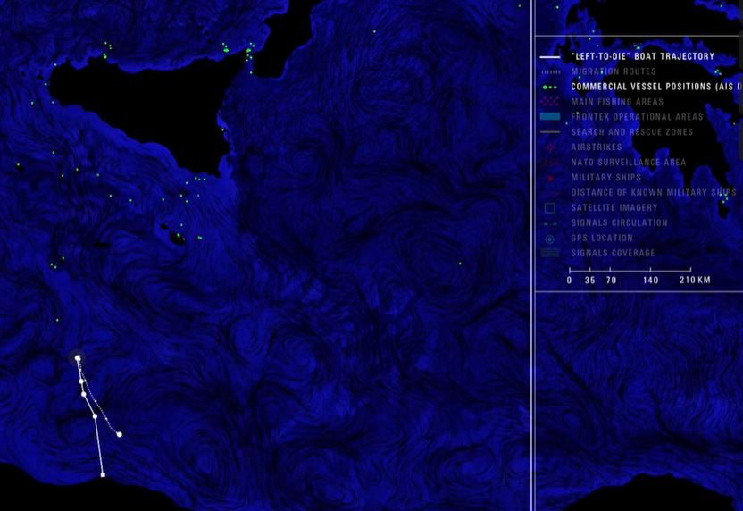

### AYS Daily Digest 12/04/2021 — Libyan authorities release its most wanted human trafficker
#### Harrassment of activist in Spain and Italy // Greece to close yet another camp // UK’s dangerous precedent for breach of refugee laws// and more…
### LIBYA

Libyan authorities have released one of the country’s most wanted human traffickers less than four months after his arrest in Tripoli\.

Abdel\-Rahman Milad, who was sanctioned by the U\.N\. Security Council, walked free on Sunday, following a decision by prosecutors late last month, [they said](https://apnews.com/article/libya-middle-east-tripoli-united-nations-83ad345278cc4d6add49ad01f420c3f5?fbclid=IwAR3hYKaP58t4bKfa7XWt-kSxcKHrFlbXXJmUNFs2HQLhbTyHWNJWAu0j2fM) \.

> Milad, better known by his alias Bija, was seen after his release in his hometown of Zawiya in western Libya, where he had commanded a coast guard unit\. 

> The officials did not reveal more details\. They spoke on condition of anonymity because they were not authorized to brief the media\. 

Abdelrahman Milad \(Al\-Bidja\) returned to Al\-Zawiya city where he was [received with celebrations](https://twitter.com/nelloscavo/status/1381289927787343880?fbclid=IwAR1CEaYIrqhxe2saLVy6HieogVWJvwetN1ZHRIJ-MGB8np_gYFO3sivCpZE) \.

The [Italian journalist Nancy Porsia](https://twitter.com/nancyporsia/status/1381571225391136768?fbclid=IwAR1OVM9VyDwCHP4I94N_nVEhNyGa9a2p9sjq5Z0ZCPkv_d-78nJCA0se86I) , who investigated Abd Rahaman Al Milad Bidja about his involvement in human trafficking and denounced him, fears for her safety after receiving direct threats to her family, with little support from Italian authorities\.

Meanwhile, [the Interior Minister of the Government of National Accord Fathi Bashagha](https://www.libyaobserver.ly/news/libya-receive-10-airbus-helicopters-soon-interior-minister-says?fbclid=IwAR33OwyRjSlw0j4B8JmQLnicRWCPw2FityN9MREIeUpjg6lSQkZAWtXoaMQ) said he would

> boost the capabilities of the Ministry after signing a partnership with France’s Airbus Helicopters, adding that the Ministry would soon receive ten state\-of\-the\-art helicopters\. 

> Bashagha said on Twitter Saturday that the helicopters would be used in combating organized crime, terrorism, and in search and rescue operations as well as in monitoring the coast and borders and human trafficking routes\. 

Follow [this podcast](https://twitter.com/scandura/status/1381626520259674113?fbclid=IwAR1M2xssKLXxIs7OmKndcT9j1aBBzu11AJjl6JNrgUvlGMCmQYjrejjGMVc) \(in Italian\) to know more about the current situation in Libya:

> From the militia attack a couple of days ago on the interior ministry to the electoral temptations: the various ‘Parlemitans’ and ‘Corleoneses’ who hold Libya in their hands \(thanks also to Italian shortcuts\) \. 

### SEA

As Italy and other EU countries continue to deal with the Libyan government as a legitimate and credible partner for its migration policy, we would like to commemorate ten years since 10th April 2011, when 11 people were [trapped on an inflatable boat near Zlitan on the Libyan coast](https://www.asgi.it/notizie/left-to-die-boat-10-anni/?fbclid=IwAR1FAnbD7Ljss7AczFnIqWRFMQv8nReoegjS_ORjqXSXwc9eOvYATr-UZOU) \.

> After 14 days adrift in the Mediterranean Sea, the survivors were barely conscious\. One woman died on the beach\. One man failed to make it a few days later to the prison where he and his fellow survivors had been thrown by the Libyan military\. 

> The nine survivors were part of a group of 72 people crammed by Libyan smugglers into a Zodiac boat that had left Tripoli on 27 March for the island of Lampedusa in Italy, whose fuel reserves had run out halfway through the journey\. Sixty three of them perished a slow death after a long wandering of the boat, which had become their coffin, finally pushed by winds and currents towards Libya, the country they had fled\. 

As we already reported, many EU agencies have found the arms embargo on Libya [totally ineffective](https://www.ejiltalk.org/drowning-in-the-mediterranean-time-to-think-and-act-regionally/?fbclid=IwAR0zeiwCsiISg8Xm8kZqbIHKEy6XTdSdSkt6MXRM8U2LarngWazdFR4k9lk) \.

> On 26 March, the EU Common Security and Defence Policy military operation in the Mediterranean — EUNAVFOR MED IRINI — was extended for two years, tasked with continuing to secure the implementation of the UN arms embargo to Libya and disrupting human smuggling and trafficking operations\. But just two weeks before, the UN’s Panel of Experts on Libya noted that the embargo ‘remains totally ineffective’\. Moreover, human rights violations continue to affect migrants and asylum seekers, while most of those brought back ‘end up in facilities rife with human rights abuses, hundreds of them remain unaccounted for\.’ 

### EU and FRONTEX

The European border protection [agency Frontex has been](https://www.faz.net/aktuell/politik/staat-und-recht/pushbacks-in-der-aegaeis-17282003.html?fbclid=IwAR2Ft7jeUHWy90EhJ7N1NxNJZEOnsZtNbMkpbetCTa0VyJJCzVNZNg9cupE) criticized for months because of its role in illegal pushbacks in the Aegean Sea\.

> The Greek coast guard prevented inflatables carrying migrants and refugees from reaching the Greek islands and is said to have escorted a few boats back into Turkish waters\. Frontex ships and aircraft are said to have been marginally involved in these pushbacks\. 

> Frontex Executive Director Leggeri launched a counterattack after the Commission in Brussels and the border protection agency in Warsaw had previously relied on a mixture of education and appeasement\. If illegal entry and human trafficking are suspected, “Greece can instruct the boats to change course” and, if necessary, force them to change course\. 

Dutch MEP Tineke Strik is investigating alleged human rights violations by the European border protection agency Frontex\. [In this interview,](https://www.woz.ch/-b606?fbclid=IwAR2UWTeoXiOsLYXD9Wf1Epv7Mpk9jxuSj58yOA_JlmLo30TpvBkiceW_I2Y) she explains how this could become a police force with almost no supervision\.

The impressive use of resources from the EU’s side to patrol its borders and contain migration keeps on growing\.

As reported by [StateWatch,](https://www.statewatch.org/news/2021/april/eu-artificial-intelligence-forecasting-and-early-warning-tool-for-migration-and-data-spaces-in-law-enforcement/?fbclid=IwAR3E3nHd78qB8_8neDDNTXoK7I-o0-Dhv2Xeup7en4PCKSzD8exbwwWkvZc)

> Two studies contracted by the European Commission on potential applications of “artificial intelligence” in home affairs were recently published: one concerning “a forecasting and early warning tool for migration”; and the other on “technical requirements for data spaces in law enforcement”\. 

### UK

As we previously reported, the UK Home Office unveiled [plans last month](https://www.independent.co.uk/news/uk/home-news/asylum-plan-refugees-priti-patel-b1821290.html) that will see [refugees](https://www.independent.co.uk/topic/refugees) who arrive in Britain via unauthorised routes denied an automatic right to [asylum](https://www.independent.co.uk/topic/asylum) \. Instead, they will be regularly reassessed for removal from the country, as well as having their family reunion rights and access to benefits limited\.

As [The Independent](https://www.independent.co.uk/news/uk/home-news/refugees-immigration-plans-priti-patel-b1825756.html?fbclid=IwAR1CkOoRnYvfShDUUKwlYbZmRLiK8jgEw5yN8g5B6UB7_bJ1SeClT2ioN3w) shows,

> The majority of people granted refugee status in the UK arrive via unauthorised routes\. In 2019, only around one in five grants of protection arrived through the government’s designated resettlement schemes\. 

### SPAIN

[Helena Maleno](https://twitter.com/HelenaMaleno/status/1381493097574567936?fbclid=IwAR2j_9GTptdRF5Ju3wEUG8_hKw_x3Wt14O2kANzQPBgTQPdUug_nxpiQHhE) , an activist for migrants’ rights in Spain and Morocco, has accused authorities in both countries of trying to silence her by barring her from returning to the northern African country where she has worked for two decades\.

She is the founder of the Walking Borders group that has been alerting rescuers when boats carrying African migrants fall into distress in the Mediterranean Sea\.

> Maleno [accused the government in Rabat](https://apnews.com/article/madrid-mediterranean-sea-africa-morocco-migration-7a3ad494e285ca60f283d0ab62c54c63?fbclid=IwAR0Jf6c694QSITnEwiSQWYeKWZGwo_AHgJnX2a_MwW9_SuNTRyTcvvlbGjQ) of launching an administrative offensive against her following the failure of a judicial probe for alleged involvement in human trafficking two years ago\. 

Sign a petition letter to support her struggle [here\.](https://caminandofronteras.org/justicia-para-helena-maleno/?fbclid=IwAR1CKvq-rWxVzTZ3s1XzS3Rzs5zTif9BoB_umcby38NOWaOh9MtbK4t4P-U)
### GREECE

The government plans to [close the Scaramanga camp\.](https://www.elaliberta.gr/%CE%BA%CE%B9%CE%BD%CE%AE%CE%BC%CE%B1%CF%84%CE%B1/%CE%B5%CE%B9%CE%B4%CE%AE%CF%83%CE%B5%CE%B9%CF%82/7222-%CF%83%CF%85-%CF%80%CF%81%CE%BF-%CE%BC%CE%B5-%CE%B7-%CE%BA%CF%85%CE%B2%CE%AD%CF%81%CE%BD%CE%B7%CF%83%CE%B7-%CF%80%CF%81%CE%BF%CE%B3%CF%81%CE%B1%CE%BC%CE%BC%CE%B1%CF%84%CE%AF%CE%B6%CE%B5%CE%B9-%CE%BA%CE%BB%CE%B5%CE%AF%CF%83%CE%B9%CE%BC%CE%BF-%CF%84%CE%BF%CF%85-%CE%BA%CE%B1%CE%BC%CF%80-%CF%84%CE%BF%CF%85-%CF%83%CE%BA%CE%B1%CF%81%CE%B1%CE%BC%CE%B1%CE%B3%CE%BA%CE%AC-%CF%83%CF%84%CE%BF%CE%BD-%CE%B1%CE%AD%CF%81%CE%B1-%CE%BF%CE%B9-%CF%80%CF%81%CF%8C%CF%83%CF%86%CF%85%CE%B3%CE%B5%CF%82-%CE%BA%CE%B1%CE%B9-%CE%BF%CE%B9-%CE%B5%CF%81%CE%B3%CE%B1%CE%B6%CF%8C%CE%BC%CE%B5%CE%BD%CE%BF%CE%B9?fbclid=IwAR3fpP78fPq3Ixe4vQcyYkkx2t_ZnzIiJvPT8sbWNYlBuf54EuipxxH9tJ0) Like many other camps in Greece, this one is completely unsuitable for people to live in\. The living conditions are inhumane and unsafe, and have brought many to live in a ghetto\-ised situation\. The Greek government, through its Migration Minister Mitarakis, has announced that

> it wants to reduce the areas where refugees live and plans to enclose them by enlarging camps away from residential areas, in the model of Malakasa, Ritsona, Klidi\. 

It is once again shocking how blatantly obvious the government’s lack of care for the condition of people in migrants’ centers in the country is\. The closure of the camp, in fact, has nothing to do with the appalling situation of its residents, but it is a cosmetic reaction to remove migrants away from the public eye\.
### ITALY

Demonstrations all over Italy d [emanding documents for all\.](https://twitter.com/CampagneinLotta/status/1380889408354811904?fbclid=IwAR1gOA3W-6oJkgY_fS1l8mEJdk3xOapM40XkjGnV9qYxjcx5HeFRd34To_whttps://twitter.com/Campagnein.../status/1380889408354811904)
### WORTH READING/FOLLOWING

Collection for the Ile Saint Denis squat: [https://www\.cotizup\.com/ramadanrefugies](https://www.cotizup.com/ramadanrefugies?fbclid=IwAR3-xSA9B3I0Lt2pPj2zx1eB_4fMyyEFj8p-VF_EsgJdPYOgdastxcF1N00)

> “For several months, over 250 exiled people have been living in a very precarious squat at [\#IleSaintDenis](https://www.facebook.com/hashtag/ilesaintdenis?__eep__=6&__cft__[0]=AZUVmyJYd-SrGdh_hTpWoaTW5ZAIJjn9lwQmTDvLkaPahl2Eok76UTkCwjdjx35SF3qJR8LadJk-u5NFqEVPRHXWgzGrpZHHfBWw1WMHTtVGrhb1Yme2_g5VHsDX_ir7wS6Pb6hxKywfYGKYoUCvsDX87EuYZaT9g4roJbTQkSCZF9n9iXxSwt4KFcn56IBQbJHGZBbaOI9gqNJHXVYA54Bg&__tn__=*NK-y-R) \(93\) \. This collection aims to help them fund food packages for all 250 people\. So they can cook during this month and allow them to break their fast\. Food parcels will be distributed so each group can cook their own meals\.” 

They thank you in advance for your generosity and support\.

[**Balibar — What is a Border? \(Zones: Topologies of Power Reading Group\)**](https://www.facebook.com/events/182446876850105/)

“The idea of a simple definition of what constitutes a border is, by definition, absurd: to mark out a border is, precisely, to define a territory, to delimit it, and so to register the identity of that territory, or confer one upon it\.” — Etienne Balibar “What is a border?”

Today at 7 PM UTC\+02–9 PM UTC\+02
### WORTH WATCHING

A great documentary by RTSinfo \(in French\) about the horrific conditions in the refugee camp on Samos\.

We were also able to give an interview about the situation for women in this camp and several women from our community share stories about the difficulties they face every day\!
- please watch and share [HERE](https://www.facebook.com/GlocalRoots/posts/1986756151487548) \*

**Find daily updates and special reports on our [Medium page](https://medium.com/are-you-syrious) \.**

**If you wish to contribute, either by writing a report or a story, or by joining the info gathering team, please let us know\.**

**We strive to echo correct news from the ground through collaboration and fairness\. Every effort has been made to credit organisations and individuals with regard to the supply of information, video, and photo material \(in cases where the source wanted to be accredited\) \. Please notify us regarding corrections\.**

**If there’s anything you want to share or comment, contact us through Facebook, Twitter or write to: areyousyrious@gmail\.com**

_Converted [Medium Post](https://medium.com/are-you-syrious/ays-daily-digest-12-04-2021-libyan-authorities-release-its-most-wanted-human-trafficker-4ee97d4fe6fa) by [ZMediumToMarkdown](https://github.com/ZhgChgLi/ZMediumToMarkdown)._
