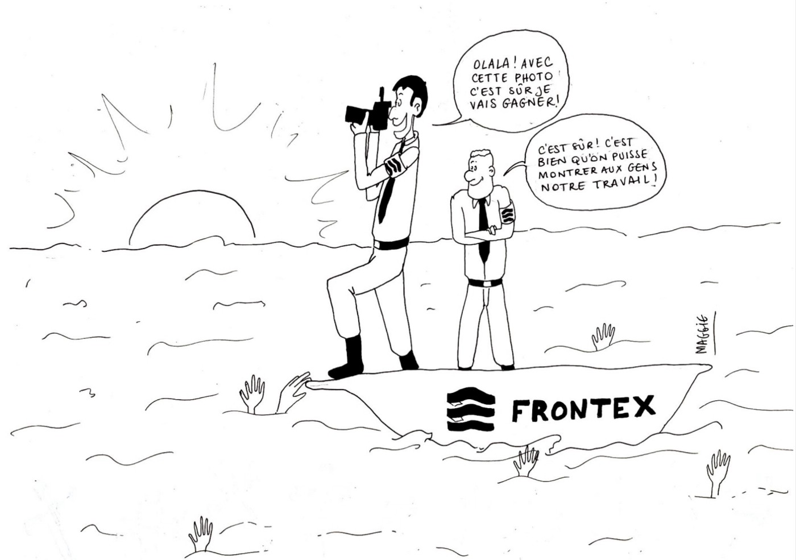

### AYS Daily Digest 13/04/2021: Frontex Photo Competition and Counter\-Measures
#### Frontex started a photo competition for its staff — BAAM is organizing a counter\-competition // Evictions in Rhodos // Updates from the planned new camp on Lesbos // Report on Pushbacks by Greek Coast Guard // Hot return from Ceuta // Open Letter to protect Helena Maleno // UK: inquiry against Home Office // Protests in Iceland

“With this photo I surely will win\!” “That’s for sure\! It’s great that we can show people our work\!” Copyright: BAAM
### FEATURE: Not a belated April Fools: Frontex organizes Photo Competition\. We recommend joining the Counter\-Competition\!

Our friends from Frontex constantly come up with great new ideas to polish up their — let’s say ‘damaged’ — image, and it is very very hard to stay serious\.

Latest idea: A photo contest\!

Frontex officers and staff are invited to send in pictures to “showcase how people from all around Europe work together at EU external borders for the benefit of European citizens”\. The pictures are meant to accompany Europe Day on May 9, “a celebration of peace and unity across the EU”\.

We strive to report on important and serious information only in this Digest — however, we couldn’t help but share this shamefully ridiculous content with you\. There are the three categories in the competeition: this is their description, as published on the [Frontex webpage](https://frontex.europa.eu/media-centre/news/news-release/frontex-photo-competition-europe-day-PxeK4e?fbclid=IwAR37hRZTpO3DrphCrX_Bx5rj9Y9D_dNFr-iT1MFfj2Niup6s0p-M-ncpPD4) \.

> “Cooperation with national authorities — show us how you or your team work together with colleagues from the host member state\. It can be a photo of joint activities, training, and equipment, anything that represents the good cooperation\. 

> Frontier landscapes — Show us the beautiful view from a patrol boat or the sunset over the field during a land patrol\. Photos taken from up in the air count, too\! 

> A helping hand at the border — Perhaps the widest category\. Show us how EU solidarity works in practice\. It can be an action with the local community, your Frontex team, photo from a rescue operation\.” 

Although we would love for you to receive “a set of Frontex gifts” \(we guess: a baton, two eye patches and maybe even a little drone??\) as a price, we recommend you to join the counter\-competition instead, organized by the French NGO BAAM\. According to their statement:

> “We propose to keep also three categories, the same ones in a non hypocritical version: 

> \- Collaboration with local dictatorships 

> \- Nature and barbed wire 

> \- Persecution at the border 

> We count on you to post on social networks with the [\#contreconcours](https://www.facebook.com/hashtag/contreconcours?__eep__=6&__cft__%5b0%5d=AZU_LaL55o479H72NcSkGMUaHDI_tssI0Lz8_4tvKGPbfo4JR3g5yavI3zkUVgr3MvkvFf9jfkGHoBqeyp3BXNBy0Ztnl3Tp1xip_Mj6WpWLem7PEV6KCZYbbXfLkdD1rLOKMODVLCWr1-2teAKj73I6&__tn__=*NK-R) and [\#stopFrontex](https://www.facebook.com/hashtag/stopfrontex?__eep__=6&__cft__%5b0%5d=AZU_LaL55o479H72NcSkGMUaHDI_tssI0Lz8_4tvKGPbfo4JR3g5yavI3zkUVgr3MvkvFf9jfkGHoBqeyp3BXNBy0Ztnl3Tp1xip_Mj6WpWLem7PEV6KCZYbbXfLkdD1rLOKMODVLCWr1-2teAKj73I6&__tn__=*NK-R) , to tag us on your posts or to send us your best productions by mail \(baam\.asso@gmail\.com\) and even by post if you are a purist of the paper format\. A subjective jury composed of BAAM members will choose the winner of the contest\. And as it would be a pity to let them spread their security and murderous propaganda without answering them, we invite you to also let Frontex benefit from your creations by sending them your participation to [photo\.competition@frontex\.europa\.eu](mailto:photo.competition@frontex.europa.eu) \.” 

We are looking forward to see a lot of good stuff on Social Media in the days to come\!

■■■■■■■■■■■■■■ 
> **[BAAM](https://twitter.com/BAAMasso) @ Twitter Says:** 

> > ⬇️CONTRE CONCOURS FRONTEX DU BAAM ⬇️
#contreconcours #stopFrontex https://t.co/6ttEQPTmZ5 

> **Tweeted at [2021-04-09 16:24:07](https://twitter.com/baamasso/status/1380557146283184136).** 

■■■■■■■■■■■■■■ 

### GREECE
#### Eviction of informal structure on Rhodos

Early in the morning on 13 April, people who lived in an informal settlement on Rhodos were evicted\. The former slaughterhouse was inhabited by people on the move, among them families with children\.

According to [newspapers](https://www.rodiaki.gr/article/456126/symbainei-twra-se-exelixh-epixeirhsh-ekkenwshs-ths-atyphs-domhs-poy-diamenoyn-metanastes-sta-sfageia-rodoy?fbclid=IwAR2CSTNhFA7s9embGVYb2LTIe2GGXGOMPf2r2LOpAUdlb57-nq5jFQXwSFw) , three buses waited to take the people first to registration and Covid\-19 testing in Rhodos port and then to various structures across the island\. The eviction was carried out in the presence of Regional Governor of the South Aegean Mr\. G\. Chatzimarkou\.
#### New Camp on Lesvos — location unclear

The Municipal Council of Mytilene convened over the last weekend over the issue of the new closed facility on Lesvos\. According to [media](https://www.infomigrants.net/en/post/31482/greece-new-lesbos-migrant-camp-given-green-light?fbclid=IwAR0EvsIY7r_X7aS3E8ZuE80owzPhzphaLfOJmKM8_QtHzWDPzIDXUqGin4Q) , the Council did not vote for the option of building the camp in remote location of Vastria\. Instead, while the creation of the new facility was confirmed, no location is indicated yet\. The location is to be confirmed at a later date\. However, it is assumed it will be again established in a remote part of the island, far away from villages and towns\.
#### Moria Corona Awareness Team collected nearly 3 million plastic bottles for recycling last year

■■■■■■■■■■■■■■ 
> **[Moria White Helmets](https://twitter.com/MWHGreece) @ Twitter Says:** 

> > Moria Corona Awareness Team collected nearly 3 million plastic bottles for recycling last year! 
[standbymelesvos.gr/support-us/](https://standbymelesvos.gr/support-us/) https://t.co/eM2oA0zD5D 

> **Tweeted at [2021-04-13 11:46:24](https://twitter.com/moriamediateam/status/1381936805952491520).** 

■■■■■■■■■■■■■■ 

#### Report on the educational situation of refugee children

[Refugee Support Aegean published a new report](https://rsaegean.org/en/excluded-and-segregated-the-vanishing-education-of-refugee-children-in-greece/?fbclid=IwAR12kSZGsAWJZ22moaBintmwjT1f8y1UGNK3rQmPNchfyYshXC2VreCAY6Y) on the situation of refugee children in Greece and their access to education\.

> “The exclusion of refugee children\[1\] from the Greek education system reached record levels during the COVID\-19 pandemic, prompting reactions from across the education sector, Μembers of Parliament and civil society\. \[2\] Many children have been unable to attend school for over a year, while others have never managed to enrol\. At the same time, worrying emerging discourse promotes education of refugee children solely through non\-formal education inside Reception and Identification Centres \(RIC\) and camps\.” 

#### BVMN observes increased employment of joint border controls and bilateral deployments

From the testimonies collected by BVMN, many indicate an increased employment of joint border controls\. According to respondents, Czech and Hungarian officers were involved in pushbacks from North Macedonia to Greece\. See this thread:

■■■■■■■■■■■■■■ 
> **[Border Violence Monitoring Network](https://twitter.com/Border_Violence) @ Twitter Says:** 

> > Joint border controls and bilateral deployments are a growing part of #pushback regimes across the #Balkans, and define processes of #externalisation which allow national authorities to engage in violent deterrence beyond their borders. https://t.co/OWGjrAO6UC 

> **Tweeted at [2021-04-13 10:30:03](https://twitter.com/border_violence/status/1381917590554083328).** 

■■■■■■■■■■■■■■ 

#### Report published on situation of recognized refugees in Greece

Pro Asyl together with Refugee Support Aegean published a report on the situation of recognized refugees in Greece\. Recognized refugees receive no support from the Greek state\.

> “Immediately after recognition, refugees are thrown from the accommodations and refugee camps in which they were housed during the asylum procedure\. All services are discontinued\. \[…\] There is no state accommodation for recognized people, even short\-term accommodation in a homeless shelter is not possible\. The result: massive homelessness\.” 

For the report \(in German\) see:

#### Aegean Boat Report publishes detailed investigation and report on puhsbacks

On 2 April, more than 200 people in five boats were pushed back by the Hellenic Coat Guard when they tried to cross to the Aegean Islands\. ABR published a detailed report on the incident, bringing together the video material from various sources\.

The report includes two more worrying observations: a group of 28 people arrived on Lesvos the same day, and contacted ABR\. However, those people were not officially registered\. It is unclear what happened to them, but it is possible that they became victims of a pushback upon arrival\. Videos further show “mysterious rubber boats carrying masked men who have been reported to have violently attacked boats with refugees in the Aegean Sea for years”\. Although the government denies it, journalists have shown that these boats belong to the Hellenic Coast Guard\. See the full report here:

#### Action against Authoritarianism in Greece

A pan\-European weekend against authoritarianism in Greece is planned for the coming weekend, 17–18 April\. It is organized by Greek migrants and solidarity networks all over Europe\.

Find a [map with planned events here](https://www.zeemaps.com/view?group=4077206&x=16.303491&y=48.481831&z=13&fbclid=IwAR2XJ21iw9u2eczbUbYxzBpEAly7uzSU1VTBaWrwe6y-wG0JBDs2MIgUrp0) \.

See [this facebook event](https://fb.me/e/4pgk9h3zg) \.
### SPAIN
#### Hot return from Ceuta

On Tuesday morning, [according to media](https://elforodeceuta.es/espana-y-marruecos-frenan-un-nuevo-salto-a-la-valla-en-ceuta-y-devuelven-al-menos-a-un-joven-subsahariano/?fbclid=IwAR0BhgpSn5VjHdD5wJdI2e-686whvzjmnPjEEMjfxKIk478cu4nLcpwvN9M) , a group of 250 people collectively attempted to reach Ceuta by climbing the three section fence surrounding the Spanish enclave\.

Almost all of them were apprehended by Moroccan police before reaching Spanish soil\. Only one man made it to the other side and was then subject to a so called “hot return”, a return without due process and possibility to apply for asylum even though he reached Spanish soil\. The practice of hot returns has been affirmed by a highly criticised ruling of the European Court of Human Rights in February 2020\. Human Rights activists and lawyers condemn the practice as being illegal and a breach of the ban of collective expulsions as enshrined in Art\. 4 Protocol 4 of the European Convention on Human Rights\.

More on the critique of hot returns:

#### Attempts to swim to Ceuta

[According to media](https://elfarodeceuta.es/guardia-civil-rescata-extremis-dos-inmigrantes-marroquies-tarajal/?fbclid=IwAR0UWPixMs1gjTTTJhKOt1nvAEKV3zC7OP_5ap5YfqCrgK_qOWaFr6u5VIA) , two men were rescued by the Spanish civil guard when they tried to swim from Morocco to Ceuta\. A third man did not make it into Spanish waters due to the state of the sea\.
#### Open letter to protect Helena Maleno, human rights activist

Caminando Fronteras \(Walking Borders\) the NGO founded by Helena Maleno, published an open letter calling for the Spanish government to publicly recognise the positive impact of her work as a human rights defender, an end to criminalisation and harassment, the protection of Maleno and her family, and reparations for the damages caused to them\.

■■■■■■■■■■■■■■ 
> **[Helena Maleno Garzón](https://twitter.com/HelenaMaleno) @ Twitter Says:** 

> > Soy Helena Maleno, defensora de Derechos Humanos, y quiero denunciar que mi vida y la de mi familia están en peligro. Exijo a los Gobiernos de España y Marruecos que me protejan.

#JusticiaParaHelenaMaleno https://t.co/dZLQhzze2l 

> **Tweeted at [2021-04-12 06:23:16](https://twitter.com/helenamaleno/status/1381493097574567936).** 

■■■■■■■■■■■■■■ 

The letter can be signed here:

#### Closure of Las Raices camp on Tenerife rejected

[According to media reports](https://www.eldiario.es/canariasahora/migraciones/delegado-gobierno-canarias-rechaza-cierre-raices-asegura-tensiones-acabaran-limando_1_7800762.html?fbclid=IwAR2V84ucU4Xu4wjfZ9ssBK-ZCLD4XaF_5N19xpAYPar1VXYWHxFK_kiFfYU) , the government delegate in the Canary Islands, Anselmo Pestana, has rejected the closure of the Las Raices migrant camp in Tenerife, as requested by some public administrations, political parties and NGOs\.
#### Boat with 25 people on board rescued

[As reported by El Diario](https://www.eldiario.es/canariasahora/migraciones/salvamento-rescata-veintena-migrantes-sur-gran-canaria-nino_1_7802500.html?fbclid=IwAR2xcyd2Sxj0OIOEq-hXETh6ebJkI0IPjjAIIroFbGeCwhwAOT83Wh-2bA4) , maritime rescue has rescued a boat with 25 people on board from 20 kilometers off the coast of Gran Canaria\. The boat contains the same number of passengers as a boat that has been the subject of a search in the last few days, after leaving Dakhla in West\-Sahara\.
### DENMARK
#### News from the people with withdrawn residents permits

We have repeatedly been reporting on the situation of about 500 Syrian refugees in Denmark, who had their resident permits withdrawn due to government claims that the Damascus area is safe for refugees to return to\.

However, Denmark does not cooperate with Assad’s Syria\. This means that the concerned people either have to return to Syria voluntarily or will be moved to Danish detention centres where they will remain for an unknown period of time\. Various articles focus on the people behind the number of 500\. They can’t go back to Syria as many of them face persecution by Assad’s government\.

Also see this informative thread from Amnesty International EU Director:

■■■■■■■■■■■■■■ 
> **[Eve Geddie](https://twitter.com/evegeddie) @ Twitter Says:** 

> > 1/ Denmark plans to deport Syrian refugees, claiming there are 'safe' areas of Damascus.

Areas in and around Damascus where @[amnesty](https://twitter.com/amnesty) continues to document the risk of persecution, torture, forced conscription and other human rights violations for Syrians. 

> **Tweeted at [2021-04-14 08:33:44](https://twitter.com/evegeddie/status/1382250706254626816).** 

■■■■■■■■■■■■■■ 

Further articles on this topic:

### UK
#### Critique of refugee accommodation in military barracks gets louder

As [The Guardian reported](https://www.theguardian.com/politics/2021/apr/13/home-office-faces-inquiry-into-use-of-barracks-to-house-asylum-seekers?fbclid=IwAR2Rr-Y0-GNkDKzeMnl32ZfF-FfS3q-EC-MKsPSrS7f-9yuWkhw8ObEr7Yc) , the UK Home Office will be subjected to an inquiry into its practice of using military barracks as refugee accommodations\. A cross\-party group called the camps a “quasi\-detention” that shares many features of immigration detention, such as isolation from the wider community and difficulties in accessing medical and legal aid, the use of patrols and barbed wire, a reduced level of privacy and restriction of movement\. The legal actions against the Home Office further focus on claims that the Home Office has failed to carry out vulnerability assessments\.
#### Being an asylum seeker in the UK today dramatically increases the risk of having mental health needs

The Refugee Council published an informative thread on mental health and on how the British asylum system dramatically worsens the situation of people in need of support\. On 13 April, the British members of parliament debated the asylum system and the mental health of asylum seekers\.

■■■■■■■■■■■■■■ 
> **[Refugee Council 🧡](https://twitter.com/refugeecouncil) @ Twitter Says:** 

> > Today MPs debated the asylum system and the mental health of asylum seekers. They raised concerns that Govt's new plans on asylum will exacerbate mental health problems - in a context where asylum seekers are 5 times more likely than others to have mental health needs (THREAD) 

> **Tweeted at [2021-04-13 16:51:49](https://twitter.com/refugeecouncil/status/1382013666074185731).** 

■■■■■■■■■■■■■■ 

### Petition calls for a stop to plans for a new detention centre for women

Almost 12,000 people already signed a petition organized by Agnes Tanoh, calling on the Home Office to stop the plans for building a new detention centre for women\. The centre is scheduled to be opened in autumn in Hassockfield in County Durham\.

Agnes Tanoh was herself locked up in Yarl’s Wood, another detention centre for women in 2012\. She has now received refugee status and dedicates her time to supporting other women:

> “I know how detention destroys a woman\. Women become depressed and suicidal in detention\. I don’t want to see this happen to any of my sisters who are looking for safety\. “ 

You can sign the petition here:

#### Critique of Sewell Report

The Sewell Report, published by the United Kingdom’s Commission on Ethnic and Racial Disparities, has been criticised by various actors for claiming institutional racism to be an overused concept\. We recommend reading this piece by Eddie Bruce\-Jones, who arrives at the conclusion that:

> “the Sewell Report demonstrates wilfully incorrect analysis of race and racism in British society, and European countries would do wise not to emulate this line of reasoning\.” 

### ICELAND
#### Protests against deportations to Greece

In Iceland, a protest took place on Monday in front of the Icelandic Parliament\. Around 150 protesters called on the government to stop deportations to Greece\. Iceland halted deportations one year ago due to the Covid\-19 pandemic, but now plans to restart them, even though the pandemic situation in Greece is much worse than one year ago\.

Some 25 people are planned to be deported to Greece in the upcoming week\. For more information, visit “Refugees in Iceland” on Facebook\.

### WORTH READING

Migreurope published a report on the use of AI in border surveillance\.

**Data and new technologies, the hidden face of mobility control**

**What’s behind the rising violence in Sudan’s Darfur?**

‘The violence is not tribal, it is political\.’

**Find daily updates and special reports on our [Medium page](https://medium.com/are-you-syrious) \.**

**If you wish to contribute, either by writing a report or a story, or by joining the info gathering team, please let us know\.**

**We strive to echo correct news from the ground through collaboration and fairness\. Every effort has been made to credit organisations and individuals with regard to the supply of information, video, and photo material \(in cases where the source wanted to be accredited\) \. Please notify us regarding corrections\.**

**If there’s anything you want to share or comment, contact us through Facebook, Twitter or write to: areyousyrious@gmail\.com**

_Converted [Medium Post](https://medium.com/are-you-syrious/ays-daily-digest-13-04-2021-frontex-photo-competition-and-counter-measures-434f9a80511a) by [ZMediumToMarkdown](https://github.com/ZhgChgLi/ZMediumToMarkdown)._
