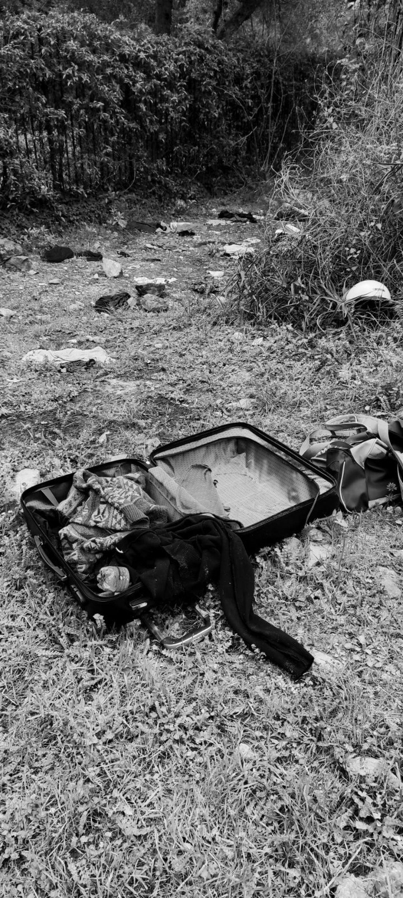

### AYS Daily Digest 14/4/21: Racist attacks on Rhodes
#### / Malta: 93 received treatment for self\-harm at Mount Carmel Hospital / UK: Home Office acted illegally by not gathering medical evidence for torture claim for detainees held in prison / recommended reads & more

Ventimiglia Photo: Proggeto20k
#### FEATURED

The island of Rhodes, a popular tourist destination, has witnessed racist attacks against the people on the move who have been living in the camp at the “old slaughterhouse”\. An island that welcomed 189 tourists from the Netherlands just a few days ago, once again showed how “Greek hospitality” is something that can be bought if you have the right passport\. Aligned with the racist instincts of the locals, the mayor of Rhodes \(Antonis Kampourakis\), filed a lawsuit against the people who were squatting\. “Of course, the mayor seems to forget that the slaughterhouse was in fact provided as a temporary solution for the migrants arriving on the island”, say the activists\.

> This finally led to the sudden eviction of the 160 people currently living at the slaughterhouse on 13 April 2021, the first day of Ramadan\. Needless to say that no one informed the people that they would be moved, no explanations were given, no time to prepare and no information about the plans\. 

On the occasion of the transfer to Kos, the Mayor of Kos, Theodosis Nikitaras, [took an open position on the issue](https://www.kostv.gr/nea/topika/5509-dimarxos-ko-i-dimotiki-arxi-alla-kai-i-koaki-koinonia-den-borei-na-apodextei-tin-metafora-metanaston-apo-alles-perioxes-tis-epikrateias-sto-nisi-mas?fbclid=IwAR0nk4gyFjs5Tk0JG0gqWPWPGm6RFKdTUp0xYadWtlrw2qxJ5PgXwd_y6A4) noting that it “cannot and will not be accepted by the local community and the municipal authority that uncontrolled migrants are to be transferred from other parts of the territory on our island”, also emphasizing that Kos and the other islands should “get off the immigration map soon”\.
#### MALTA

> _Not only did we fail to protect them, but we inflicted so much pain and misery on men, women and children_ 

The mishandling of the pandemic at detention centres across Malta has aggravated the already terrible conditions, so that the number of detainees treated for self\-harm or suicide attempts rose significantly last year, it is reported\. We have been reporting about the hardships of people on the move who got stuck on Malta, but now reports of abuse are mounting\. Mobile phones were confiscated in detention centres and many detainees had limited access to phones, if any, so this exacerbated the already difficult mental state of many\.

> A [Council of Europe report](https://timesofmalta.com/articles/view/unsafe-inhumane-illegal-inside-maltas-migrant-centres-during-a.857119) recently laid bare the inhumane conditions in the centres, where migrants were unlawfully held and “forgotten for months”, and COVID\-19 patients were left to mingle with other detainees\. 

#### ITALY

The local solidarity group, Proggeto20k, reports on the militarisation of the Ventimiglia city centre and controls on the railway network throughout Italy to stop people attempting to cross the French border:

> Despite the presence of many Italian, French and European solidarity groups, the police continue their intimidating work, prohibiting support activities if not at the times and places they themselves indicate\. Furthermore, despite activities that are being carried out in compliance with anti\-contagion measures, police are threatening to close the only spaces where people in transit enjoy a minimum of refreshments\. 

> At this time, the prevailing route still seems to be the one arriving from Sub\-Saharan Africa, passing across the Central Mediterranean\. Several nationalities are present: Sudan, Eritrea, Mali, Mauritania, although arrivals continue also from the Balkan route\. The flows seem to be strongly influenced by the long preventive detention that people undergo on ships or in other centers set up for COVID quarantine — this method of imprisonment has been contested by numerous associations and organizations in support of human rights, primarily ASGI \(Italian Association of Legal Studies on Immigration\), which denounces a deprivation of personal freedom, as well as a radicalization of the hotspot approach\. We have collected various testimonies of people detained on ships in Sicily even for a month and a half\. 

> The decrease in the number of pushbacks mainly derives from the now perpetual militarization of the Ventimiglia station, where mixed teams made up of State Police, Carabinieri, Vigile, French Police and Army soldiers, are controlling all non\-white people, using racial profiling practices, effectively preventing any attempt to cross the border by train\. 

> Thanks to continuous, thoough difficult, monitoring activities, we have seen how the trains for France remain closed until departure, with the exception of a single door through which all the passengers are obliged to pass after a careful check of their documents\. Those who manage to pass this first filter are obviously rejected at the Menton Garavan station, where some witnesses tell us that the French police have repeatedly stopped \(and detained in containers\) even people with valid travel documents, but without a valid COVID test\. 

> The new agreement between the French and Italian police, which began in December 2020, has a legal basis in the Schengen and Chambéry Agreements, and has as its ultimate goal “to increase the fight against illegal immigration”, but in reality it manifests itself in an increasing militarization of the border, the criminalizing of people in transit, pushing them back, detaining them or arresting them\. 

> The strong militarization and great pressure of the controls means that the migrants themselves are forced to contact passeurs in order to “pierce” the border\. It is certainly not new that more and more women are victims of trafficking and abuse in exchange for the hope of crossing the border\. We find it very difficult to approach them, whether it is for medical, legal support or simply to give them shelter in a safe place\. 

> The control device put in place daily at the station discourages most migrants who choose riskier and rash alternatives, such as mountain trails, often hiked at night and without equipment\. The risk of falling, of getting lost and of perishing is always very high\. 

> In the last few days, the Undersecretary of Defense, Giorgio Mulè, visited the city of Ventimiglia\. Both the undersecretary and Mayor Scullino have repeatedly boasted that the drop in rejections is due to a targeted policy of “triage” and control along the railway network, between the provinces of Genoa, Savona and up to Imperia\. This practice not only denies people’s freedom of movement, but is used purely for propaganda purposes in support of a dominant narrative about the border town’s need for security\. In Ventimiglia, as mentioned, despite the decrease in rejections at the border, the number of people stuck does not decrease, but the instrumental use of data serves to deny the need to create health and reception facilities for people in transit\. 

> The lack of institutional housing solutions spills over to the solidarity of individuals who for a few days welcome into their homes people in transit exhausted by the journey\. Many people have returned to live on the beach, and others find shelter and temporary housing solutions, often in abandoned houses or on the street\. 

#### FRANCE
### Humanitarian corridors reopening

The Community of St Egidio [formalises](https://www.vaticannews.va/en/church/news/2021-04/humanitarian-corridors-protocol-france-st-egidio-refugees.html?fbclid=IwAR1_13j-T1AVjAepqvKazPgbCiDEsMUUr7J98EX2Use__kNJByRagD6e-tU) an agreement with the French Government and the Semains Sociales de France to renew the “Humanitarian Corridors” protocol\. It grants people in “vulnerable conditions” \(victims of persecution, torture and violence, families with children, elderly, infirm, people with disabilities\) legal entry into Europe through humanitarian visas and the opportunity for asylum application thereafter\.

It also provides guarantees to the host State as the processing of humanitarian visas implies necessary checks run by authorities\.
#### GERMANY
### Officials angry at Greece as thousands arrive

Although many of the people who arrive in Germany have already been recognized by the Greek authorities as entitled to protection, they have been arriving in Germany in large numbers in recent months\. 
More than 300 people, mostly of Afghan origin, arrived at German airports with scheduled flights on the Easter weekend and immediately applied for asylum, it was reported\.
At the same time, a court in Münster decided that deportations to Greece can’t happen because of the conditions there\.

■■■■■■■■■■■■■■ 
> **[Seebrücke](https://twitter.com/_Seebruecke_) @ Twitter Says:** 

> > Das OVG Münster hat entschieden,dass aktuell nicht nach Griechenland abgeschoben werden darf, da keine Versorgung der Grundbedürfnisse gegeben ist. Seitdem haben ca.3000 Menschen Asyl in Deutschland beantragt, die bereits als "schutzbedürftig" in 🇬🇷 anerkannt wurden.
Foto:Reuters https://t.co/yBXlDN57fJ 

> **Tweeted at [2021-04-14 10:11:41](https://twitter.com/_seebruecke_/status/1382275360281219072).** 

■■■■■■■■■■■■■■ 

The Greek authorities are expected to “meet minimum standards” for refugees, the German Federal officials say\. The European Commission is reportedly also examining an infringement procedure against Greece\.
#### UK
### The start of the Napier trial

A recent report by the fire safety inspectorate of Napier Barracks in [Kent](https://www.independent.co.uk/topic/kent) found that the measures in place to reduce the risk of fire at the site did not ensure residents were “appropriately protected from serious risk”\.

> The [Ministry of Defence](https://www.independent.co.uk/topic/ministry-defence) site was repurposed into asylum accommodation in September and around 400 individuals were subsequently moved in\. 

**The Court of Appeal finds that the Secretary of State for the Home Department acted unlawfully in failing to obtain medical evidence regarding the torture claims of individuals detained under immigration powers in prison\.**

On 14 and 15 April 2021, a High Court judge, the Honourable Mr Justice Linden, will consider whether the Home Secretary acted unlawfully in housing asylum\-seekers at Napier Barracks in Kent\. Because of social distancing, the judge and lawyers will be in Court and the public may attend by video link\. As [reported](https://dpglaw.co.uk/napier-barracks-trial-starts-on-14-april-2021/?fbclid=IwAR0Zehga-1g8FY69EUGNenjSgmN3QcBLVSKOASPHKi4i0x8kf657ssTIt4M) , the Home Office has announced that it will continue using the barracks as asylum accommodation until at least September 2021\.

■■■■■■■■■■■■■■ 
> **[DuncanLewisPublicLaw](https://twitter.com/DLPublicLaw) @ Twitter Says:** 

> > Wider policy challenge dismissed &amp; we’re considering appeal to Supreme Court. However, still important decision as shows SSHD’s legal obligations when detaining vulnerable people in prison under imm powers

Read more: [duncanlewis.co.uk/news/Court_of_…](https://www.duncanlewis.co.uk/news/Court_of_Appeal_finds_SSHD_acted_unlawfully_in_failing_to_obtain_medical_evidence_regarding_the_torture_claims_of_individuals_detained_under_immigration_powers__(14_April_2021).html)

1 more important judgment to follow! 

> **Tweeted at [2021-04-14 10:15:41](https://twitter.com/dlpubliclaw/status/1382276363319709696).** 

■■■■■■■■■■■■■■ 

#### WORTH READING AND LISTENING
- This new article from independent Syrian platform Enab Baladi gives a really useful overview of recent practices regarding residence and deportation for Syrians:

- This report seeks to address the gap and join the dots between Europe’s outsourcing of migrant detention to third countries and the notorious conditions within the migrant detention centres:

- European authorities affirm cooperation with Libya on migration while interceptions and violence against migrants and refugees continue — 2\-week report from the Med:

- Podcast interviews:

**Find daily updates and special reports on our [Medium page](https://medium.com/are-you-syrious) \.**

**If you wish to contribute, either by writing a report or a story, or by joining the info gathering team, please let us know\.**

**We strive to echo correct news from the ground through collaboration and fairness\. Every effort has been made to credit organisations and individuals with regard to the supply of information, video, and photo material \(in cases where the source wanted to be accredited\) \. Please notify us regarding corrections\.**

**If there’s anything you want to share or comment, contact us through Facebook, Twitter or write to: areyousyrious@gmail\.com**

_Converted [Medium Post](https://medium.com/are-you-syrious/ays-daily-digest-14-4-21-racist-attacks-on-rhodes-8bb03386aee4) by [ZMediumToMarkdown](https://github.com/ZhgChgLi/ZMediumToMarkdown)._
