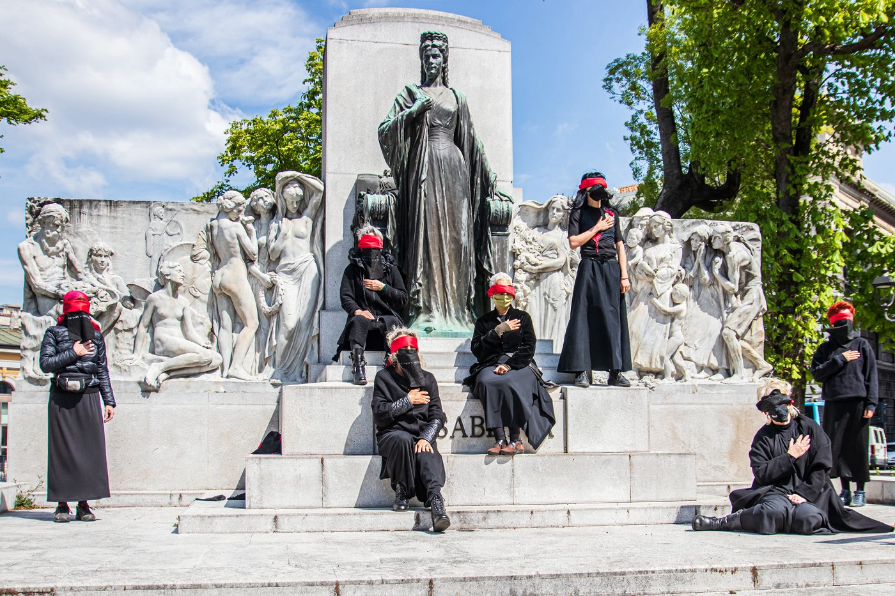

### AYS Weekend Digest 17–18/4/2021: Gaïa, abandoned building occupied in Lille, France

Sea\-Eye 4 en route to the Med\. Homelessness in Greece\. 43 people evicted and brought to reception structures in BiH\. Frontex inflating legal expenses against activists\.

 \)](assets/dcb71bacc0f0/1*OXoACZ3-QJv8XS8vBd35qA.jpeg)

Trieste, 17/4/2021, Balkan Route Calling Day of Action \(photo by: [Valentina Belluno / Campagna Lesvos Calling](https://www.facebook.com/lesvoscalling/photos/a.296258295337354/296257555337428) \)
#### Featured — Gaïa: Abandoned building occupied in Lille, France

Utopia 56 [report](http://www.utopia56.com/fr/actualite/lille-collectif-gaia-revendique-loccupation-batiment-situe-86-rue-meuniers) that on Sunday the Gaïa collective occupied an abandoned building in Lille, in northern France\.

Lille, occupation of Gaïa \(Photo by Utopia56\)

Named Gaïa house, it will be “a self\-managed inter\-association living space, which will address questions of integration, culture, ecology, solidarity and inclusion for all\.”

> The Gaïa house will allow around ten non\-housed people to find a roof over their heads, have access to a solidarity canteen, showers and a laundry, and will promote the emergence of inter\-association projects for the organisation of daily multidisciplinary activities\. 

The building, empty for a decade, is owned by the municipality and was one of the thousands vacant homes in the country, which make up the 8\.3% of the French housing stock\. More than 3,000 homeless people live in the Lille metropolitan area, this building, empty for a decade, is part of the 8\.3% of vacant housing in the French housing stock\.

Lille, occupation of Gaïa \(Photo by Utopia56\)

The occupiers demand:

> The signing of a precarious tenancy agreement for a mixed site including the possibility of housing homeless people and the exercise of certain cultural, artistic and associative activities\. 

> The free support for utilities and insurance by the municipality in return for the maintenance of the place 

> Respect for everyone’s fundamental rights, including the right to decent, stable and affordable housing\. 

SEA
#### Sea\-Eye 4 en route for the Mediterranean

The new rescue ship SEA\-EYE 4 [left its Rostock shipyard](https://sea-eye.org/wir-schicken-noch-ein-schiff/) , in northern Germany, on Saturday morning, 17th of April, and set out to cross into the Mediterranean\.

 \)](assets/dcb71bacc0f0/1*TaSlR8scQHPaijP6tY9dwQ.jpeg)

Sea\-Eye 4 \(Photo by [sea\-eye](https://www.facebook.com/seaeyeorg/photos/a.730635527042347/3518979178207954/) \)

For six months, the rescue ship was rebuilt by around 250 volunteers and prepared for its first mission\. A few days ago the SEA\-EYE 4 received the German flag and the German flag state administration gave the green light for operation\. The arrival of the SEA\-EYE 4 in Spain is planned for the end of April, from there it will leave for the first rescue mission as soon as possible\.

At times where authorities look into every possible excuse to seize non\-governmental rescue ships, the Sea\-Eye 4 “is very well suited for sea rescue missions and offers a lot of space for the first aid of rescued people\.” 53 metres long, it will carry out its missions with up to 26 crew members\. It has a modern hospital ward, set up for Covid\-19 patients, and is equipped with two cranes, to lower the two rescue rafts quickly into the water\.

GREECE
#### Age Assessments re\-start on Samos

\(Photo Credit: @PHupfen\)

[Age assessments have restarted on Samos](https://twitter.com/PHupfen/status/1383779183260696581?fbclid=IwAR230rDiQ-f0-k3M7101CIjvYdtaNDvAeqo2etcPxWCLGA8iup8Wy8wTOik) having been stalled for a year\. During this time many young people have had to live with unrelated adults and some have “aged out”, turned 18, and are no longer eligible for family reunification\.
#### Where do people transferred from islands end up?

 \)](assets/dcb71bacc0f0/1*G9YaazPyfCIqasJ8OOyB4g.jpeg)

\(Photo Credit: [@isabelschayani](https://twitter.com/isabelschayani) \)

The answer? Mainland camps where the conditions are just as bad but the situation is invisible to the public\. [There are 33 camps](https://twitter.com/isabelschayani/status/1383882475428978691) on the mainland with limited access to outside actors, often far from urban centres\.
#### Small protest at Malakasa

■■■■■■■■■■■■■■ 
> **[Solidarity with migrants](https://twitter.com/MigrantsSoli) @ Twitter Says:** 

> > Παρέμβαση στο καμπ της Μαλακάσας

Intervention at the #Malakasa camp

No more dead migrants and locals.
Freedom and healthcare for all.

#antireport #RefugeesGR https://t.co/H93qDugLuh 

> **Tweeted at [2021-04-18 12:40:18](https://twitter.com/migrantssoli/status/1383762311987400705).** 

■■■■■■■■■■■■■■ 

#### Mitarakis continues his battle with reality

 \)](assets/dcb71bacc0f0/1*Rui-tnVmMnEBE_AzURKcpA.jpeg)

\(Photo Credit: [@teammareliberum](https://twitter.com/teammareliberum) \)

[Mare Liberum report](https://twitter.com/teammareliberum/status/1383761711702843395) that Mitarakis has made another attempt to legalize pushbacks: In a letter to EU commissioner [Johansson](https://twitter.com/YlvaJohansson) , he asked if the Geneva Conventions still apply in the [Aegean](https://twitter.com/hashtag/Aegean?src=hashtag_click) despite Greece being a signatory\.

> This is not the first attempt by Greece to officially suspend human rights\. 

#### Attempt to evict Notara 26

[Notara 26](https://www.alerta.gr/archives/17878?fbclid=IwAR1uA_MAPYQbXZHVJy5sG1mZJ1F14-bR36C7WbcIdnx7YrwNS3GMR20e7ro) , one of the few remaining solidarity housing structures in Athens, which has been been active since 2016, has faced another attempted eviction\. On the 17th the electricity was cut again making the lives of people who live there, including families and young children, incredibly difficult\. These tactics are an attempt to force people to leave\.
#### Children homeless in Thessaloniki

[The Press Project reports](https://thepressproject.gr/olo-kai-perissotera-asynodefta-anilika-stous-dromous-tin-teleftaia-dietia/?fbclid=IwAR3lvkW7pqz6hb_ZgU1b_ie9mZwvVy5b8-pukKYhqK8KmZ-IHb07oKbVEWw) that “in the first quarter of 2021, 53 unaccompanied minors were found to be living on the streets of Thessaloniki, many of them aged between 11 and 14\. Most of them belong to vulnerable categories, having suffered violence, forced separation from family members, exploitation while suffering from physical and psycho\-emotional problems\.” 15% of these children are girls\.

ITALY
#### 17 hours inspections for Open Arms

In a new episode of the Italian authorities’ low intensity war against sea rescuers, [Open Arms](https://www.facebook.com/NewsfromtheMed/posts/1196053190848275) has now been held in Pozzallo \(Sicily\) after an unwarranted 14\-day quarantine and 17 h of extremely severe inspection on board\.
#### Salvini on Trial for Kidnap

[On September 15 Salvini will appear in court](https://kurier.at/politik/ausland/freiheitsberaubung-prozess-gegen-salvini-beschlossene-sache/401354648?fbclid=IwAR2vIItInKUniXowaAkdhIr-_E8k9hSTXo2wCVzyGhUB8WTIDqfcCW6bVSY) for accused of deprivation of liberty and abuse of office\. In August 2019, he refused to allow Open Arms to dock and left 147 people at sea for 19 days\.
#### Balkan Route Calling\. Day of action in Trieste

On Saturday, A day of action was held in Trieste against pushbacks and containment policy on the Balkan Route\.

 \)](assets/dcb71bacc0f0/1*J7nNrpFay5ZcoB56545bzA.jpeg)

Trieste, 17/4/2021 \(Photos by [Valentina Belluno, Campagna Lesvos Calling](https://www.facebook.com/lesvoscalling/posts/296261782003672) \)

Activists arrived to the border town from Ventimiglia, Como and other Italian cities\. Among them, those hit by repressive attacks by Italian authorities, like Linea d’Ombra and Mediterranea\. Other groups, such as [InfoKolpa](https://www.facebook.com/infokolpa) from Ljubljana and [Uber Grenzen Kollektiv](https://www.facebook.com/uebergrenzenkollektiv/) sent solidarity messages and held sister events\.

SPAIN
#### First refugee\-led digital news portal launched in Madrid

Today’s positive news — At the beginning of April, [Banyana\.es](https://baynana.es/) was launched\. It means ‘Between us’ and it’s a refugee\-led bilingual \(Spanish and Arabic\) news portal, founded by four young journalists from Deraa, in Syria, who arrived in Spain over the past years, fleeing regime repression and the civil war\.

Read more [HERE](https://www.ibtimes.com/syria-reporters-start-spains-first-refugee-led-news-site-3181328) \.

BOSNIA AND HERZEGOVINA
#### Families evicted from abandoned building and brought to Borici and Sedra reception structures

Bosnian media [report](https://www.oslobodjenje.ba/vijesti/bih/migrantske-porodice-s-19-djece-iz-napustenih-kuca-prebacene-u-kampove-648811) that a group of 43 people on the move were found living in an abandoned house in Bosanska Bojna, near the Croatian border\. Bosnian authorities, with the support of IOM, evicted the families and brought them to the reception centres in Borici and Sedra\. Among the group, 19 are children\.

GERMANY
#### Afghan nationals who supported German military to receive protection?

German Defence Minister calls for the country to take in Afghan nationals who helped German military forces during the Afghan war, media [report](https://www.dw.com/en/nato-allies-agree-to-leave-afghanistan-following-us-move/a-57206514) \.

Following the announcement of the withdrawal of 10'000 NATO and US troops from Afghanistan by next September, the minister has asked for the streamlining of the process which is, in theory, already in place\.

Similar announcements have been made in the past by several national authorities, often they’ve never been followed by actions\. What will happen this time?

FRANCE
#### New shelter for Calais’ Refugee Info Bus

■■■■■■■■■■■■■■ 
> **[Refugee Info Bus](https://twitter.com/RefugeeInfoBus) @ Twitter Says:** 

> > Here's our Calais team with a new shelter to protect people from the rain when they visit us to charge their phones &amp; access WiFi. Staying warm &amp; dry is a constant struggle for people on the move - we're so pleased to have a shelter to keep people dry when they use our services https://t.co/AK1kzjQtsp 

> **Tweeted at [2021-04-18 07:38:04](https://twitter.com/refugeeinfobus/status/1383686249550995466).** 

■■■■■■■■■■■■■■ 

DENMARK
#### EU governments closely follow developments of the Danish decision to strip Syrians of protection

The latest policy of the Danish government, which we reported over the past weeks, has received wide [international coverage](https://www.wsj.com/articles/syrians-are-stripped-of-refugee-protection-in-denmark-now-you-are-telling-us-to-go-11618660800) and has been criticised by solidarity groups and international organisations\.

Reportedly, Austrian authorities are instead closely following the developments of this policy\. Given their precedents, they are probably looking for inspiration\.

It is important to note that this policy is only the last in a series of xenophobic and anti\-migrant policies and statements, started by previous governments\. The supposedly left\-wing social democratic party has since started “ [apeing the far right in a race to the bottom\.](https://www.theguardian.com/commentisfree/2021/apr/18/by-demonising-asylum-seekers-denmark-reflects-a-panic-in-social-democracy) ”

■■■■■■■■■■■■■■ 
> **[Jeff Crisp](https://twitter.com/JFCrisp) @ Twitter Says:** 

> > Let's not forget that the former Danish Prime Minister ran (unsuccessfully) on a xenophobic electoral platform, then tried (unsuccessfully) to become the UN High Commissioner for Refugees and ended up as CEO of Save the Children.
Nice work if you can get it. https://t.co/fwQcSNQIRK 

> **Tweeted at [2021-04-18 09:30:01](https://twitter.com/jfcrisp/status/1383714422632312833).** 

■■■■■■■■■■■■■■ 

FRONTEX/EU
#### Frontex found guilty of inflating legal fees against transparency activists

As we previously reported, in December 2020, Arne Semsrott and Luisa Izuzquiza, of Frag den Staat transparency platform, were [taken to court](https://fragdenstaat.de/en/blog/2020/12/02/frontex-costs-court-transparency/) by Frontex, which wanted them to pay legal fees after having lost a court case over the publication of internal documents\. Frontex requested €23,700 of legal costs\. Now, [the EU court has ruled](https://fragdenstaat.de/en/blog/2021/04/19/frontex-costs-eu-court/) that only €10,000 are justified expenses\. Frontex had already been exposed for spending difficult\-to\-justify amounts for reception costs during the Border Guards Days events\. The court [ruled](https://curia.europa.eu/juris/document/document.jsf?text=&docid=239744&pageIndex=0&doclang=en&mode=lst&dir=&occ=first&part=1) that the work hours put forward by Frontex’s lawyers “do not appear to be objectively necessary for the purpose of the proceedings before the Court” and that the agency had claimed more than €2,000 of travel expenses, “without, however, providing the slightest explanation as to its purpose or why it was necessary\.”
#### Seehofer obstructing Frontex investigation

[An email, leaked this weekend](https://www.spiegel.de/politik/ausland/griechenland-wie-horst-seehofer-die-aufklaerung-im-frontex-skandal-behindert-a-042669cd-5d44-4060-a7ca-62efb60355fc?fbclid=IwAR2LBSWxXlfOfMihTcOhVZSvln1bFWwHgwn7pSeoJGufqnXky2t0_zj5BUE) , from the German Interior Ministry to the Management board of Frontex, states that Seehofer’s office do not believe a new EU working group designed to investigate Frontex’s involvement in pushbacks and other human rights abuses is necessary\.

 \)](assets/dcb71bacc0f0/1*DN_UrdZmwR-ifUfdfQuwKw.jpeg)

\(Photo Credit: [@ErikMarquardt](https://twitter.com/ErikMarquardt) \)

Once again Frontex has been tasked with overseeing and evaluating itself\. Luckily, [Fabrice Leggeri has assured people](https://www.rainews.it/dl/rainews/media/Fortezza-Europa-tra-pandemia-libera-circolazione-e-flussi-migratori-280160d0-6997-4a27-9123-58d8bbf9c2e2.html?fbclid=IwAR1AWAwTu0IW-SQ1jJSUc8BTn4S4EXM1bFVnO3PU7lHnb4lEfczkocbzDxY) that “respect for human rights is implicit in every type of approach we \[Frontex\] choose”\. So we won’t worry too much then…
#### Missing Children

 \)](assets/dcb71bacc0f0/1*7OONpm2VvE64qkE53WW1mA.png)

\(Photo credit: [Lost in Europe](https://www.facebook.com/LostinEurope.org/photos/a.440052760125663/898648584266076/) \)

[Lost in Europe](https://lostineurope.eu/?fbclid=IwAR0WNzt55LXtEKYWLcitz3A_9hf3aVmXqCfyRTH5up_SASq5Fu3zqBaMRXY) report that more than 18,000 children have gone missing since arriving in Europe between 2018–2020 based on data collected in 30 European countries\.
#### Underwater drones to be used in border surveillance

Although underwater drones for border surveillance are [currently a rarity](https://twitter.com/matthimon/status/1383850812321853445) they are being used along with side scan sonar in a new EU funded trial in Tunisia\. Contracted by the International Centre for Migration Policy Development \(ICMPD\) based in Vienna [the tech will cost 194,217\.00 Euros\.](https://ted.europa.eu/udl?uri=TED:NOTICE:536538-2020:TEXT:EN:HTML)

The drones will be used by the Tunisian National Guard\.

UK
#### Witnesses to Detention Deaths Deported

[On Wednesday 14 a court](https://www.theguardian.com/uk-news/2021/apr/17/witnesses-to-deaths-in-detention-deliberately-deported-from-the-uk?fbclid=IwAR3NHrx1sUlChaszTLlfr2BDk5sztnEs8b0jT1cV-9fu7y4dB-2riZ2tick) in the UK held Home Secretary Priti Patel accountable for failures in ensuring that deaths in immigration detention centres were properly investigated\. The Home Office has routinely deported witnesses to detention deaths despite appeals from lawyers and charities leading some to say that they do not see “people as people” and are institutionally racist\. Statements with which we can only agree\.

WORTH READING
- [**Life torn apart: Return from Austria to Afghanistan\.**](https://www.infomigrants.net/en/post/31488/life-torn-apart-return-from-austria-to-afghanistan) With Austria restarting deportations to Afghanistan, InfoMigrants publishes a testimony on the consequences of such a barbaric policy\.

**Find daily updates and special reports on our [Medium page](https://medium.com/are-you-syrious) \.**

**If you wish to contribute, either by writing a report or a story, or by joining the info gathering team, please let us know\.**

**We strive to echo correct news from the ground through collaboration and fairness\. Every effort has been made to credit organisations and individuals with regard to the supply of information, video, and photo material \(in cases where the source wanted to be accredited\) \. Please notify us regarding corrections\.**

**If there’s anything you want to share or comment, contact us through Facebook, Twitter or write to: areyousyrious@gmail\.com**

_Converted [Medium Post](https://medium.com/are-you-syrious/ays-weekend-digest-17-18-4-2021-gai%CC%88a-abandoned-building-occupied-in-lille-france-dcb71bacc0f0) by [ZMediumToMarkdown](https://github.com/ZhgChgLi/ZMediumToMarkdown)._
