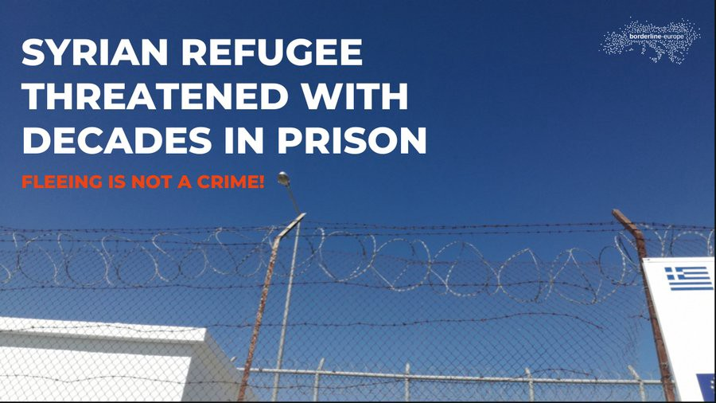
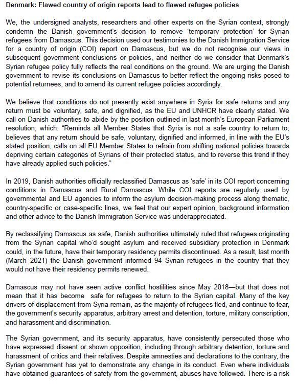
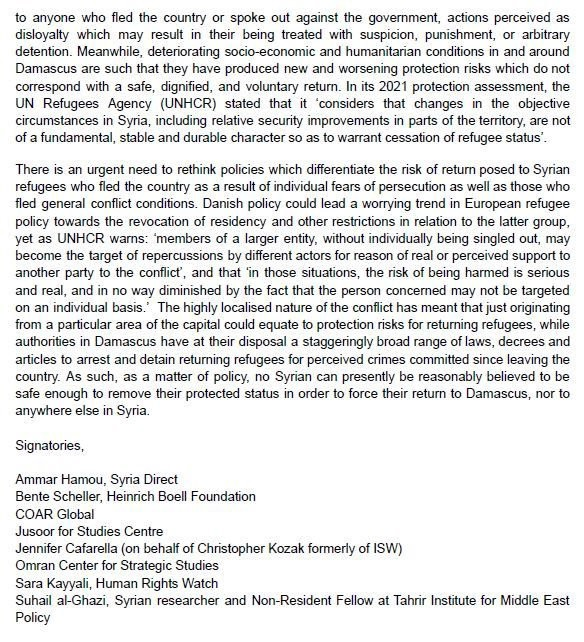

### AYS Daily Digest 20/4/21: With every step, proof that people are not meant to settle, feel at home, or ‘integrate’
#### Montenegro centre deprives people of food, Croatian banks still don’t allow people under international protection from certain countries to hold bank accounts, Denmark widens the range of options to deny people the right to stay, while Spain keeps people in permanent “statelessness” // German court decides two Syrian sisters can’t be “ _doublined”_ back to Greece due to conditions there // Recommended reads & more

](assets/7dd10c292879/0*cphOHqUVsSYGsuzq)

Lesvos photo by: [**Isabel Schayani**](https://twitter.com/isabelschayani)
#### FEATURED
#### Montenegro — People not provided food for iftar because “they refuse breakfast and dinner”

It has come to our attention that people staying at the reception centre in Spuž are not being supported to practice their religious fasting during the Muslim month of Ramadan\. According to a contact AYS spoke to, as well as several other sources, the director of the reception centre in Spuž, located near Montenegro’s largest prison, is refusing to provide food for iftar\. The director is reportedly saying that if people refuse to eat at the regular meal times, they can’t be served iftar\. She has refused to give any official comments to the media, referring them to the Ministry of Interior\.

A person’s faith is one of the few things they may have to hang on to while living in an overcrowded and unsanitary refugee camp\. Respect for the religious rights of people on the move is also part of the obligations the state took over as a EU candidate country, particularly that of Chapter 24, which covers asylum and migration\-related issues\. The EU has been financing Montenegro’s reception and asylum system, and the centres are very well equipped to even provide the people with the option to prepare their own meals, as well as to provide them with the meals as required during the month of Ramadan, observed by many of the residents\. In an earlier country [report](https://www.refworld.org/pdfid/5b0819d54.pdf) , it was noted that “the Committee is concerned that members of national and ethnic minorities, refugees, displaced persons, Roma, persons with disabilities, and members of other marginalized groups continue to face discrimination with regard to the enjoyment of their economic, social and cultural rights”\.

The reception centres of Spuž and Božuj in Montenegro currently have over 140 residents\. Most of them come from predominantly Muslim countries and in spite of the many international and national regulations, it once again turns out that across the Balkans, the humane treatment of people on the move comes down to the whims of camp management\.
#### Croatia resuming ‘Dublin’ to Greece, while German courts oppose it

There have been several recent cases of refused asylum claims in Croatia, part of a recent surge in decisions of returns from Croatia to Greece based on the Dublin Regulation\. In many of these cases, Greece very quickly answered positively to the demands of Croatia and accepted to take the people back in\. The decisions, of course, do not mention reception conditions in Greece and the individual circumstances of each person but insist on a fast relocation of people back to Greece\.

At the same time, in Germany **,** a series of positive court decisions is addressing the impoverishment and endangerment of refugees in Greece and pointing in the direction of abolishing the so called “Dublin returns” to Greece\. In January, the state of North Rhine\-Westphalia was [stopped from deporting ‘recognized refugees’ to Greece](https://www.ovg.nrw.de/behoerde/presse/pressemitteilungen/09_210126/index.php) , and a [second groundbreaking judgment has now appeared from the court in Lower Saxony](https://oberverwaltungsgericht.niedersachsen.de/aktuelles/presseinformationen/in-griechenland-anerkannte-fluchtlinge-durfen-derzeit-nicht-dorthin-ruckuberstellt-werden-199562.html) in Lüneburg\.
The Senate stated that the plaintiffs were “very likely to become homeless after being transferred back to Greece, that in practice they would not have access to elementary benefits and that they could otherwise not hope for adequate support from the state or non\-state side\. That is why they are threatened with impoverishment and life under conditions that violate human rights within a very short time\.”

The judgment is also based on the most recent report published a few days ago by PRO ASYL and our Greek partner organization Refugee Support Aegean \(RSA\), which collates findings on the situation of those entitled to international protection in Greece and explicitly sheds light on the circumstances of those entitled to protection after deportation\.

[Read more here\.](https://www.proasyl.de/pressemitteilung/nach-ovg-nrw-nun-auch-olg-niedersachsen-abschiebungen-nach-griechenland-sind-rechtswidrig/?fbclid=IwAR0TxgO0MdVTDNA0rRobS_MjnDhJTq_PgZJ9CoEkfH-9VLMy3dv8SA4xpdY)
#### GREECE

People are claiming that asylum officials and police officials are asking asylum seekers for sums of 700 to 800 Euro to process their asylum applications faster, this source says, publishing [a video](https://fb.watch/4-XmntIrT6/) that documents the mistreatment of people in front of one of the asylum centres\.

On Lesvos, at the infamous “Moria2” camp, people are protesting poor and insufficient food distributed at the camp, reportedly refusing to eat it and withdrawing to tents instead\.

Also, as Franziska Grillmeier reports, most of the newly arrived people on Lesvos are transferred to the quarantine camp of Megala Therma in the north of the island\. In the south, 6,050 are staying in Mavrovouni camp\.

### On trial

A young man from Syria is on trial today in Lesvos, threatened with decades in prison\. Because the man, known as K\.S\., fled to Greece together with his wife & children on a rubber boat, he is now accused of “illegal entry”, “facilitating illegal entry” and “provoking a shipwreck”\.

The Greek state had unlawfully suspended the right to asylum as part of a political dispute between Turkey and the EU, and systematically brought criminal charges of “illegal entry” against migrants seeking protection in Europe, Borderline Europe writes, [reporting](https://www.borderline-europe.de/unsere-arbeit/drohende-verurteilung-eines-syrischen-gefl%C3%BCchteten-auf-lesbos-zu-jahrzehntelanger-haft) about the case\.

**Event announcement — Coordination against evictions:**

#### CROATIA
### Still no changes in the treatment of asylum seekers by the banks

As we reported earlier, in November last year AYS collected a number of testimonies from people who had lost the right to a bank account, were forced to change their bank account to the most simple account \(with few options\) or had their bank cards and accounts taken away\. Together with other organisations gathered in the Coordination for Integration in Croatia, we demanded action from the Ombudswoman, who in turn reached out to the banks in February this year\.

Since we have not received any news since this comunication, and things have not changed, AYS is now demanding a concrete answer from both the Ombudswoman and the Bank Union\. We hope for a change in the approach to the people under international protection who until now have been treated as “people from third countries” and are deprived of financial independence, just because they come from Iran, Afghanistan, Syria, Iraq or other countries “labeled” by the banks\. This serious lack of judgment is affecting many people in a vulnerable position who are receiving state and other kinds of financial support\.
#### ITALY
### 45 people land in Lampedusa

The media are reporting on the first landing after last Thursday’s group of 17\.
Now, a group of 45 people originally from Tunisia landed in Italy; after the initial health check done directly on the Favarolo pier in Lampedusa, they were reportedly taken to the hotspot\.

In the meantime, Alarm Phone has reported about being alerted by approximately 42 people in distress off Zuwara, Libya, as the plight of many people continues\.
#### SPAIN
### New arrivals in the south

According to local reports, the Spanish Civil guard and Maritime rescue teams rescued people who were on board a small boat in the high seas near to Alborán\. Leaving Bouyafart in Morocco on Monday, the group arrived at the port of Motril in Granada the next day\. All 33 people were reported to be in a good state and after having taken Covid\-19 tests, they will be placed in the reception facilities\.

Meanwhile, [**Morocco is buying drones** and other border equipment **from Turkey**](https://www.thedefensepost.com/2021/04/20/morocco-buys-turkish-bayraktar-drones/?fbclid=IwAR1HdzyrZ__1oA00mj90jcHXSKfhLz8Xau5SpfuV1fYyzn3oL7q2MMJ4Ajs) \. By definition, this is a “medium\-altitude, long\-endurance unmanned aerial vehicle \(UAV\) capable of remotely controlled and autonomous operation”\. They can fly up to 220 km/h and can stay in the air for up to 27 hours\.
### Paperless — Stateless — Deprived of a decent life

**News from the No Name Kitchen team in Ceuta: “Stateless\* in the city where you were born”**

Many Moroccans are trapped in the Spanish territory of Ceuta without documentation or rights\. When the land border between Ceuta and Morocco was open, people living in Castillejos and Benzú, Moroccan municipalities very close to Ceuta, could enter and leave without a visa, as it is not possible to register in Ceuta without a visa, No Name Kitchen explain\.

> **What does not being registered mean? Not being registered in your place of residence means not being able to access education, not being able to send your children to school, not having access to social services and unemployment benefits, and not being entitled to public health care\. In times of global pandemic, it also means not having the right to receive the covid\-19 vaccine\.** 

This is made more difficult by the fact that the land border with Morocco has been closed indefinitely since March 2020, leaving many undocumented or irregular Moroccans trapped in Ceuta and without the possibility of returning to their country to receive the rights they are deprived of in Spain\. In this way, many people remain stateless in their hometowns\. Without registering their residence, it seems impossible their situation will change, keeping the rights to which they are entitled permanently outside of their reach\.

 about one such family who are deprived of chances to have a decent life where they live and were born, documented by the local NNK team\. \(Photo: Irina Samy, via NNK\)](assets/7dd10c292879/0*GEf-4egK4eJ48NQM)

Read [the story](https://www.facebook.com/NoNameKitchenBelgrade/posts/1222069071524708) about one such family who are deprived of chances to have a decent life where they live and were born, documented by the local NNK team\. \(Photo: Irina Samy, via NNK\)
#### GERMANY
### Protests as deportations continue

A protest is planned on Sunday before the deportation prison in Darmstadt after a decision to deport 40 Pakistani nationals on Tuesday\. Four of them have partly fulfilled the conditions for their right to stay, it is reported\.

> Not far from Darmstadt, Adeel P lived in the district of Darmstadt\-Dieburg with his wife, with whom he was married even before fleeing Pakistan\. Her asylum procedure had not yet been completed, as she had only arrived later than her husband\. In these cases, the spouse’s asylum procedure is always awaited\. “Despite this, Adeel was arrested,” says Timmo Scherenberg, managing director of the Hessian Refugee Council\. 

The space for civil society and p [ublic and critical debates in Pakistan is also shrinking](https://www.fr.de/rhein-main/landespolitik/abschiebung-pakistan-von-den-familien-getrennt-bleiberecht-90466439.html?fbclid=IwAR1umv_-fPY8_qu-RnuvIVFgC3Hv3VTmr3UQZ_S2N0OtW-949hKBmqRFCFc) \. Religious conflicts continue to lead to deaths, and religious minorities are systematically persecuted, but European continues to send people back there\.
#### DENMARK
### Experts are against the “safe Syria” grounds for deportations & new legislation

A parliamentary majority in Denmark has agreed to back the Liberal party’s [proposal](https://www.thelocal.dk/20210209/citizenship-applicants-should-attend-interviews-to-test-danish-values-proposal/) that formed a series of legislation changes on naturalisation of new Danish citizens, including the measures focused on making it easy for the naturalization to be “revoked as broadly as possible”\.

Foreign nationals applying to become Danish citizens could [reportedly](https://l.facebook.com/l.php?u=https%3A%2F%2Fwww.thelocal.dk%2F20210420%2Fdenmark-announces-new-tightening-of-citizenship-rules%2F%3Ffbclid%3DIwAR3s1HY-mOth0zPZTAWpPwQdv1dFb7JUuJJww2QTIEF7AuhxsEwKQrDhEiU&h=AT0IJxANmQGQkkqae5xuS8yYVDeo93wtHc4qoMhOM9SXEA4WsA6fYNgeBh5-9UDyIQj5Axyz6REj_fJdggUyABaEmaZ_cvDw_AFiEafxJqoHgGw6N8uGDfvjM8tD0R8gdw&__tn__=R]-R&c[0]=AT2K1rQsI6zuibKQZSKVqnkjKAm6JLqrIS5RetvW0y187QWH5lZG9JmzFIbuBx8RHh3jc1rdy7bQ-bUtt6SkHwK5o0KPDrf544Q7LQZ32Hpp0oq5CRp5s4T543QeveaJHpd2d1ApgrzYsYmE721YTIwtzme8gVDo8x3P62yYdQzBkDrOFlFth3KHqE-bOdNCuwjwQVOR5QLrrhKrWw) face individual interviews designed to test whether they have “Danish values”\.

■■■■■■■■■■■■■■ 
> **[Benjamin Holst](https://twitter.com/BenjaminHolst) @ Twitter Says:** 

> > @[mattiastesfaye](https://twitter.com/mattiastesfaye) refused to appear on our news item for @[tv2newsdk](https://twitter.com/tv2newsdk) tonight. So this is a photo from Jobar in Damascus, which he believe is safe for #refugees @[LHreports](https://twitter.com/LHreports) @[mediabridge_](https://twitter.com/mediabridge_) #dkpol https://t.co/61cjXcpRPT 

> **Tweeted at [2021-04-19 20:17:43](https://twitter.com/benjaminholst/status/1384239808789114882).** 

■■■■■■■■■■■■■■ 

In a line of accusations, critique and opposition to the Danish government’s decision to deport people back to Syria, marking it a safe place to return to, a number of experts are now sharing their insights in the latest of critical letters addressing the decision of the official Denmark:

■■■■■■■■■■■■■■ 
> **[🌻@___adn@mastodon.world🌻](https://twitter.com/___adn) @ Twitter Says:** 

> > Millions of displaced people in Europe, already vulnerable &amp; traumatized, don't get to rest even for a single day. They look at the situation in 🇩🇰 &amp; know they could be next
That's the whole point. They're not meant to settle, feel at home or 'integrate'. It's just racist sadism 

> **Tweeted at [2021-04-20 17:02:16](https://twitter.com/___adn/status/1384553012778225669).** 

■■■■■■■■■■■■■■ 

#### WORTH READING
- Our world is becoming more walled due to the influence of private profiteers on governments — and increasingly displaced people pay the price:

[](https://l.facebook.com/l.php?u=https%3A%2F%2Fwww.theguardian.com%2Fglobal-development%2F2021%2Fapr%2F20%2Fi-was-alone-i-had-nothing-from-child-refugee-to-student-nurse%3Ffbclid%3DIwAR3ilPuliZiEW5PitwfRKOCVWFYStauX7n8ozEZgukBhaX-rOBBPLxovnIA&h=AT0EraYEKzQ0V300mcAPV21vRU9WcmbJEzm_fNZx1ab8e50jY2o451AwMYebVJtCSc1MiFeNi9mNCsJW_uuBsJ9s3JcEuzrd6jylur-2Ko9UEgfbz-AEYSp3uNjREoPGag&__tn__=%2CmH-R&c[0]=AT3_hbDer-bTKCGjcGX3W4lwquvzy78_T1Tzlrpi6OqjlKWLVLg_qHVG109lEAEFIEPBMgmIAKpReSf65QH12tLoJbDlEFAuBeM56J7sXrxSWdxjng8U9V8-BrLeeDqeGifOAip2Tr9572BAdC_eTbgVpD_V3NAZqU4fxSoF2J093vz4Wtmw-mQ49oDXAx4YcEQThhlYBRwwx970KA)

**Find daily updates and special reports on our [Medium page](https://medium.com/are-you-syrious) \.**

**If you wish to contribute, either by writing a report or a story, or by joining the info gathering team, please let us know\.**

**We strive to echo correct news from the ground through collaboration and fairness\. Every effort has been made to credit organisations and individuals with regard to the supply of information, video, and photo material \(in cases where the source wanted to be accredited\) \. Please notify us regarding corrections\.**

**If there’s anything you want to share or comment, contact us through Facebook, Twitter or write to: areyousyrious@gmail\.com**

_Converted [Medium Post](https://medium.com/are-you-syrious/ays-daily-digest-20-4-21-on-every-step-a-proof-people-are-not-meant-to-settle-feel-at-home-or-7dd10c292879) by [ZMediumToMarkdown](https://github.com/ZhgChgLi/ZMediumToMarkdown)._
