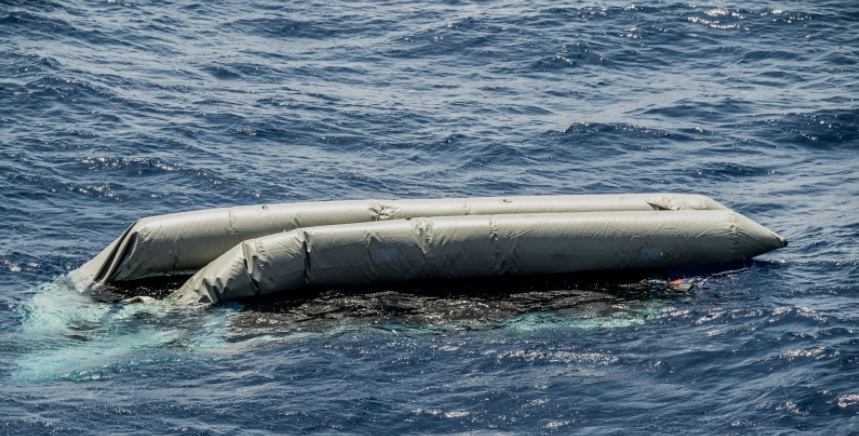

### AYS Daily Digest 22/4/21: Croatian court says human rights of people\-on\-the\-move were violated
#### 130 lives lost at sea // Reports on pushbacks from Greece // Mobilizations in Italy // On\-the\-ground report from Serbia // Last relocation flight from Greece lands in Germany
### FEATURE: Constitutional Court of Croatia rules in favor of family of little girl killed by train, saying their human rights were violated

 \)](assets/975966326cb7/1*SXUuCMd5n7tTngumiGX68w.jpeg)

A comic depicting the events that led to Madina’s death on the night of November 21, 2017 \( [Center for Peace Studies](http://welcome.cms.hr/index.php/2020/11/20/poziv-dan-madine-hussiny-pravdazamadinu/) \)

The Constitutional Court of Croaita [issued its first verdict](https://sljeme.usud.hr/usud/praksaw.nsf/fOdluka.xsp?action=openDocument&documentId=C12570D30061CE54C125868F002CFA0E&fbclid=IwAR0DgzPmbhrd-JjjHrR_fGyg5FcGDz9HawhJ4xO7y7OREShAplm1JqPSiUg) on Wednesday in the case of the family of Madina Hussiny, a six\-year\-old Afghan girl who was killed in late 2017 in Croatian territory as she and her family were being pushed back into Serbia\.

Wednesday’s ruling overturns a previous decision from lower courts that rejected Madina’s family’s request for international protection after the courts judged that Serbia was a safe ‘third country\.’

The Center for Peace Studies \(CPS\), a Zagreb\-based NGO, celebrated the ruling in a [Facebook post](https://www.facebook.com/CentarzaMirovneStudije/posts/3901812513246689) , and said that, “This decision also clearly points to the importance of the work of non\-governmental organizations, both in Serbia and Croatia and the importance of taking into account reports in evaluating individual cases — which is important not only for this one but also for thousands of other cases of violations of refugee rights and other migrants\.”

[The tragic death of Madina Hussiny](https://www.theguardian.com/world/2017/dec/08/they-treated-her-like-a-dog-tragedy-of-the-six-year-old-killed-at-croatian-border) at the hands of the EU’s border policies unfolded on the dark railway tracks along the Serbia\-Croatian border, near the Serbian town of Šid\.

Madina’s mother, Muslima Hussiny, decided to set off for Croatia with six of her 10 children on the night of November 21, 2017, according to media\. The mother and children crossed into the EU safely, but were found some hours later in a park by Croatian police, who ordered them to walk back to Serbia\.

The family did as they were told, but on the way back, little Madina was struck by a train in the dark as her mother scrambled to locate and collect the six children, four of them under the age of 10\.

The family carried the six year old’s body back to the police in Croatia, begging for help\. The police brought the family in a van to an ambulance, and Muslima was separated from her daughter\. The rest of the family was sent back to Serbia that night, and Muslima didn’t see her daughter again until several days later, when her body had already grown cold\.

The family was then forced by authorities to immediately bury Madina in a municipal graveyard with no marker, and without a proper Muslim ceremony\.

The case of Madina Hussiny and the subsequent treatment of her family created an uproar among Croatian civil society and activist groups, who have staged [numerous protests](https://www.h-alter.org/vijesti/pravda-za-madinu-hussiny-ldquomadina-dobrodosla-u-srediste-zagrebardquo) and [days of rememberance](http://welcome.cms.hr/index.php/2020/11/20/poziv-dan-madine-hussiny-pravdazamadinu/) over the years since the little girl died\.

Madina’s case was [raised in European Parliament](https://www.europarl.europa.eu/doceo/document/E-8-2018-001012_SL.html?redirect) several months after her death\. Dimitris Avramopoulos, a Greek politican from the centre\-right New Democracy party and the EU Commissioner for Migration, Home Affairs and Citizenship at the time, wrote the response on behalf of the Commission:

> The Commission is aware of this terrible incident in which a little girl died when train hit her as her family made their way back to Serbia from the Croatian border\. 

> Croatia is responsible for the management of its border with Serbia at an external border\. Under Union law, the external borders may be crossed only at border crossing points and the borders between the border crossing points are under constant surveillance\. Any measures taken in this context must be proportionate and in full respect of fundamental rights\. The Member States are also bound by the principle of non\-refoulement and required to provide asylum\-seekers the possibility to reach a border crossing point in order to allow effective access to the asylum procedure\[…\] 

> In order to prevent such incidents to be repeated the Commission is working on replacing such irregular routes with safe and legal pathways, such as resettlement\. 

Of course, in the years since Avramopoulos’ response, not much has changed, and increasingly violent pushbacks are recorded regularly from Croatian territory—not to mention from other EU countries, such as Greece, as well\. The Commission has _not_ made good on its promise to “replac\[e\] such irregular routes with safe and legal pathways” for people\-on\-the\-move, meaning that tragedies such as Madina’s death will continue to occur\.
### SEA
#### 130 human lives lost in the Central Mediterranean

Flavio Gasperini / SOS MEDITERRANEE

One hundred and thirty human lives were extinguished yesterday in the Central Mediterranean\.

SOS Mediterranee’s Ocean Viking found the capsized rubber boat after a long search following a nighttime storm\.

■■■■■■■■■■■■■■ 
> **[Emmanuelle Chaze](https://twitter.com/EmmanuelleChaze) @ Twitter Says:** 

> > After a terrible night racing through a storm, hours of search, the Ocean Viking found the capsized rubber boat that @[alarm_phone](https://twitter.com/alarm_phone)  signaled yesterday. 

There was no assistance from any authorities.

None of the 130 people on board survived.

📷© Flavio Gasperini @[gasperiniflavio](https://twitter.com/gasperiniflavio) https://t.co/DBFK82mpxn 

> **Tweeted at [2021-04-22 18:29:26](https://twitter.com/emmanuellechaze/status/1385299723993718787).** 

■■■■■■■■■■■■■■ 

A statement from Luisa Albera, the SAR coordinator onboard the Ocean Viking:

> Today, after hours of search, our worst fear has come true\. The crew of the Ocean Viking had to witness the devastating aftermath of the shipwreck of a rubber boat north east of Tripoli\. This boat had been reported in distress with around 130 people onboard on Wednesday morning\. 

> In the past 48 hours, civil hotline Alarm Phone alerted us to a total of three boats in distress in international waters off Libya\. All of them were at least ten hours from our position at the time of reception of the alerts\. We searched for two of these boats, one after the other, in a race against time and in very rough seas, with up to 6\-metre waves\. In the absence of effective State\-led coordination, three merchant vessels and the Ocean Viking cooperated to organise the search in extremely difficult sea conditions\. 

> Today, while we searched relentlessly without receiving support from the responsible maritime authorities, three dead bodies were spotted in the water by merchant ship MY ROSE\. A Frontex airplane spotted the wreck of a rubber boat soon after\. Since we arrived on scene today, we have not found any survivors while we could see at least ten bodies in the vicinity of the wreck\. 

> **We are heartbroken\. We think of the lives that have been lost and of the families who might never have certainty as to what happened to their loved ones\.** 

### GREECE
#### Aegean Boat Report statement: Pushbacks are now just ‘normal’

Read this [statement](https://aegeanboatreport.com/2021/04/21/pushbacks-is-no-longer-even-the-new-normal-it-is-just-normal/?fbclid=IwAR0Nfx-mojb6gP7zvhSk6XlV8SGpV_0hkynPiXu95U0DPN5nZpWhckhTgUU) from Aegean Boat Report, detailing a pushback from the north of Lesvos on April 14 \(with pictures, videos, satellite imagery, and GPS coordinates\) \.

ABR writes:

> This is no longer even the “new normal”: it is just “normal”\. There can be few more damning indictments of Europe and its people than that this is how we behave: risking and causing people to die, by attacking them, and denying them their fundamental human rights\. 

> It is an attack on us all: when a government strips a Somali teen, a Syrian child, an Iraqi man, an Afghan woman of their human rights, you have to know that they are reserving the right to do the same to you, to your son, daughter, brother, sister, parents, grandfather and grandmother\. 

> Those rights belong to us all: once they are taken from one of us, they can be taken from us all\. It must stop\. We cannot simply turn a blind eye to this — the disgrace of Europe\. Instead, we must stand, together, and demand better: from our governments, from the EU, from the international community\. 

#### 7000 people, 147 pushbacks and deportations from March\-December 2020

Using published material from media reports and NGOs, the [Racist Crimes Observatory](https://racistcrimeswatch.wordpress.com/) program of the [Hellenic Observatory of the Helsinki Accords](https://greekhelsinki.wordpress.com/) \(GHM\) has recorded 147 cases of illegal, violent, racist repatriation \(pushbacks at sea\) or deportation \(from the islands or from the mainland\) in the period of March to December 2020\. More than 7,000 people were affected\.

[At this link](https://racistcrimeswatch.wordpress.com/2021/04/21/1-1180/?fbclid=IwAR2gN0HddEGPGNKT6BiEvwK4S-R9cHAjMKGkcadZKBGQJI_kIJTONjMoF9g) you can find the recordings of all 147 of these incidents\.
#### A wall goes up around Nea Kavala camp

The construction of a three\-meter\-high concrete wall around Nea Kavala camp in northern Greece has begun, according to [local media](https://www.eidisis.gr/politiki/teixos-trion-metron-kyklonei-ti-domi-filoksenias-neas-kabalas.html?fbclid=IwAR1ySjWldEq8rekDwKSUJxaliPN1kF3xznWYrdgptmmDuykt2WrHuKHVrYc) \. The project is set to be completed in a month’s time\.

The intention is clearly to make Nea Kavala into a closed prison\. Entry and exit will only be allowed by an electronic card system, which will track people’s movements\.

Currently 1,319 people live in Nea Kavala, according to media\.
### ITALY
#### Call for Mobilization in Italy on April 24

Several Italian organizations are calling for people to participate in mobilization actions that will be held on April 24 in various Italian cities to protest chain pushbacks and administrative detention centers\.

More information can be found [here](https://www.meltingpot.org/Alla-fine-c-e-il-CPR-giornata-di-mobilitazione-diffusa.html?fbclid=IwAR3uBYzoKWWNsvKaWrPfCuAAFdjhBWXAHKOtiToDaJiU6uQYRv5aZGTCqE0#.YIKLVigvPmW) \.
#### Donations needed in Ventimiglia

Kesha Niya, a grassroots organization in Ventimiglia, is sending out a call for donations of the following items to support people\-on\-the\-move: tents, blankets, sleeping bags, warm clothes \(jackets, hoodies, trousers, socks, boxershorts, shoes\), unregistered SIM cards, working smartphones, headtorches, and power banks\.

More information on how to support can be found [here](https://www.facebook.com/KeshaNiyaProject/posts/1499742430370619) \.
### SPAIN

An important Twitter thread from Solidarity Wheels on the latest police roundup in Melilla\.

■■■■■■■■■■■■■■ 
> **[Solidary Wheels](https://twitter.com/SolidaryW) @ Twitter Says:** 

> > Early this morning, @PoliciaNacional (the Spanish National Police) entered the "shelter" set up in Melilla's "Plaza de Toros" (bull fighting ring), waking up the people sleeping there, putting them handcuffed inside vans and taking them to the police station. https://t.co/finGCD4sn8 

> **Tweeted at [2021-04-22 13:47:27](https://twitter.com/solidaryw/status/1385228759041728514).** 

■■■■■■■■■■■■■■ 

### SERBIA
#### On\-the\-ground report: Info Park Belgrade weekly update

> During last week Info Park noted an increased number of people reporting violence during the pushbacks from Romania\. On 13 April, Info Park assisted a group of five boys from Afghanistan, aged 16–18, who were violently pushed back from Romania\. All of the boys reported the police beating them, stealing their mobile phones, money, bags and jackets, and using excessive force while expelling them to Serbia\. Three days later, on 16 April, a pushed\-back family from Iran travelling with a 2\-year\-old toddler, reported to Info Park that the Romanian police stole their personal belongings and took their shoes before ordering them to walk back to Serbia\. In the following days, several Info Park’s beneficiaries, including a 15\-year\-old boy from Afghanistan and four young women from Somalia, came forward with testimonies of such treatment which serves a goal to scare the refugees and other migrants away and discourage them from trying to enter Romania\[…\] 

> Representatives of Narodna patrola \(People’s Patrol\) detained\. Last week, a newly established fraction of the so\-called People’s Patrol started operating in Sombor, North\-West Serbia\. The new fraction was encouraged by the members of Belgrade to extend their anti\-migrant “work” which includes patrolling the city areas where refugees and migrants reside, interrogating them, threatening them and restricting them freedom of movement\. On several anti\-migrant groups on social media videos and photos calling for an “uprising” and “liberation” were shared, while the content showed refugees as criminals and a safety threat\. Such videos gained popularity over a short period of time\. However, on 18 April, several members of People’s Patrol in Sombor were apprehended by the police and held in police custody at the time being, after bringing a group of Afghan refugees to a reception center\. Info Park supports MoI’s changed policy toward anti\-migrant groups whose activities are an example of intimidating and abusive treatment of people on the move\[…\] 

> On 18 April, two Kurdish families from Iraq, with three children under the age of six, came to Belgrade after being pushed back from Romanian territory\. The families arrived in Serbia three months ago and were accommodated in a reception center in the south of Serbia\. They made a decision to leave the RC in order to try luck and get accommodation in another RC in the North, however the Serbian Commissariat for Refuges and Migration \(SCRM\) did not allow them to enter\. The group made the decision to go directly to the Romanian border and continue they journey further on foot\. The group shared with the Info Park’s team that they were intercepted by full\-face masked police who stole their money and personal belongings before pushing them back\. Despite the fact that the group was observed in an obvious state of exhaustion, they did not want to return to their reception center, instead they will try to find a hostel in Belgrade\. Info Park team provided women with the available services in safe space and shared with them SOS phone number in case of an emergency\. 

### FRANCE
#### Calais updates

A valuable thread on the continued barring of support to people around Calais:

■■■■■■■■■■■■■■ 
> **[Calais Food Collective](https://twitter.com/CalaisFoodCol) @ Twitter Says:** 

> > We are currently in the middle of a food distribution, and the Gendarmerie have arrived for their new rounds of afternoon eviction cycles in Calais.

Our team saw tents being taken, with belongings still inside. https://t.co/taaPlCJmB7 

> **Tweeted at [2021-04-21 14:47:38](https://twitter.com/calaisfood/status/1384881516849815555).** 

■■■■■■■■■■■■■■ 

And more evictions:

■■■■■■■■■■■■■■ 
> **[Human Rights Observers](https://twitter.com/HumanRightsObs) @ Twitter Says:** 

> > Cet après-midi à #Calais, 5 lieux de vie expulsés sur la base de la flagrance, alors qu'ils étaient habités depuis plus de 48h. 37 tentes et 33 bâches ont été volées par les #FDO. Les personnes #exilé.e.s sont contraintes de dormir sans abris ce soir. https://t.co/lqdToL7bYd 

> **Tweeted at [2021-04-21 19:53:58](https://twitter.com/humanrightsobs/status/1384958609176551426).** 

■■■■■■■■■■■■■■ 

#### LGBT support association

Finally, a positive story\. Read about [“Famille au grand cœur,”](https://www.infomigrants.net/en/post/31584/france-association-welcomes-young-lgbt-migrants?fbclid=IwAR0CyfSkgpVJl0JpUnNK1Pr4uZW-FMQmAUz4UnIQU0r5UulDQHBf5iphL4E) an association run by a group of refugees and asylum seekers in Montpellier, which aims to offer welcome and support to young new arrivals who are gay, lesbian, bisexual or transgender\.
### GERMANY
#### Last relocation flight from Greece lands

103 recognized refugees landed in Germany from the Greek islands this week, completing Germany’s relocation program, [media reported](https://www.infomigrants.net/en/post/31701/last-refugee-flight-from-greek-islands-lands-in-germany?fbclid=IwAR3Z8Bm1TQGFh_p7DWyhVfmnTewtAqx_GSCDBj6ZZzeZiCQjuL_prLK95vQ) \.

Oh, the irony\! It took Germany a full year to fly 2,765 people from Greece—in that same span of time, how many people have been pushed back from the Aegean Islands, with EU support?

According to the Racist Crimes Observatory report, which we quoted earlier in this digest, more than 7,000\.

But good job, Germany, good job\.
### WORTH READING
#### Europe Must Act: Alternatives to camps: caring for unaccompanied and separated children on the move

This article is the first of a series of blog posts examining viable alternatives to refugee camps on Greece’s Aegean Islands\. The focus of this post is on receiving and accommodating unaccompanied and separated children\.

#### UNHCR data visualization reveals impacts of climate change on displacement

#### Protecting human rights for people affected by climate\-change\-induced migration

#### Drought\-hit Somalia faces record displacements

#### Samos Raging: blog post on policing in Samos

**Find daily updates and special reports on our [Medium page](https://medium.com/are-you-syrious) \.**

**If you wish to contribute, either by writing a report or a story, or by joining the info gathering team, please let us know\.**

**We strive to echo correct news from the ground through collaboration and fairness\. Every effort has been made to credit organisations and individuals with regard to the supply of information, video, and photo material \(in cases where the source wanted to be accredited\) \. Please notify us regarding corrections\.**

**If there’s anything you want to share or comment, contact us through Facebook, Twitter or write to: areyousyrious@gmail\.com**

_Converted [Medium Post](https://medium.com/are-you-syrious/ays-daily-digest-22-4-21-croatian-court-says-human-rights-of-people-on-the-move-were-violated-975966326cb7) by [ZMediumToMarkdown](https://github.com/ZhgChgLi/ZMediumToMarkdown)._
