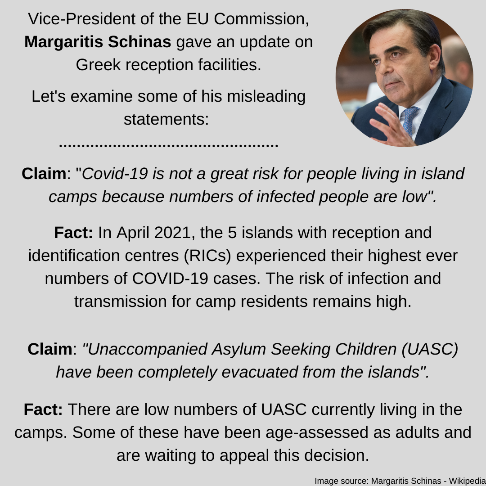
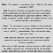
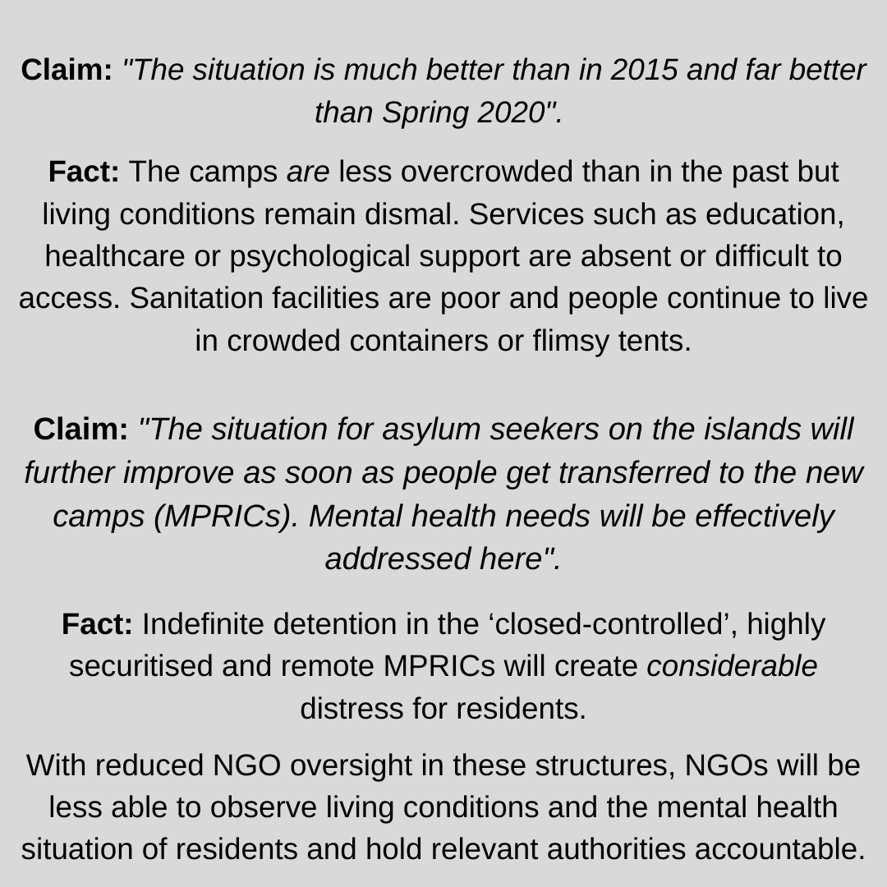
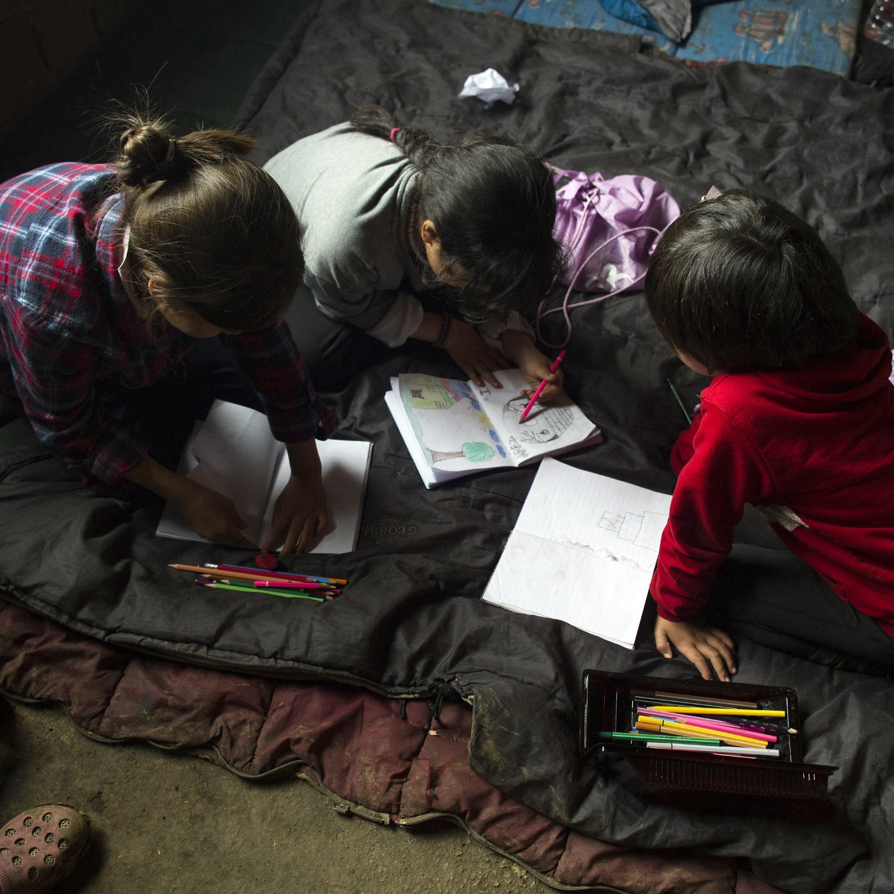

### AYS Daily Digest 23/4/2021: More Walls in Greece

[Are You Syrious?](?source=post_page-----854685814820--------------------------------)

[Apr 24](ays-daily-digest-23-4-2021-more-walls-in-greece-854685814820?source=post_page-----854685814820--------------------------------) · 11 min read

_130 people drowned in the Central Med\. Dangerous routes through east Turkey\. Danish ‘Syrian policy’ is disproportionately impacting women\. UK Home Office faces another lawsuit over its ‘hostile environment’\._

One of the new walls in Greek camps\. Photo via [EfSyn](https://www.efsyn.gr/ellada/dikaiomata/291264_teihi-tis-ntropis-se-prosfygikes-domes)
### FEATURED — Walls around mainland camps in Greece, creating de\-facto closed camps

The Greek government’s plan of enclosing camps for people on the move is expanding\. People in Ritsona, Polykastro, and Diavata camps on the mainland have reported that [construction is beginning on fencing](https://www.efsyn.gr/ellada/dikaiomata/291264_teihi-tis-ntropis-se-prosfygikes-domes) around the camps\. The construction includes concrete walls\.

Previously, the government had promised that fencing would pop up only at the borders and around island camps\. However, it is clear now that camps on the mainland will also become enclosed\. By building these walls, the message is clear: people are supposed to feel like prisoners and they will be treated as such\. Never mind that the camps are not even detention centres but open accommodation structures that are supposed to provide housing for people on the move\.

The IOM is complicit in this construction\. In fact, they were the ones that sent out an [invitation to bid](https://twitter.com/maledictus/status/1385569768443457544/photo/2) on the construction of perimeter fencing in Malakasa, Ritsona, Polykastro, and Diavata camps, all the way back in January\. While initially the construction was supposed to be a three\-meter\-high wire fence, the plans have clearly evolved to include concrete walls\.

These walls are more than just walls\. They are just the latest step in the Greek government’s move to treat people on the move like criminals\. By limiting their freedom of movement, their right to live freely, and even their ability to look out onto the horizon without the interference of concrete and fencing, the government is looking to demoralise them, and to create a permanent division between Greek citizens and people on the move in the country\.
### TURKEY
### Dangerous route through eastern Turkey

More and more people are trying to reach Europe by crossing Turkey’s mountainous eastern border with Iran, despite the ongoing border wall construction and dangerous conditions\. Unfortunately, many die along the way and are buried in unmarked graves in the city of Van\. Learn more about this route in [this video reportage](https://www.dw.com/en/europes-forgotten-refugee-crisis/av-57308487?fbclid=IwAR0L0GoftsLXfcCr6XZh5WFMAu1oAZA1l5sD4y9oQ7NKfg54VYa-Sqr_tok) from DW\.

Many people on the move in Turkey depend on charity for support\. However, this year donations are down by [as much as 90%](https://www.voanews.com/europe/hungry-ramadan-refugees-turkey-see-steep-decline-holiday-charity?fbclid=IwAR0kx7Wtr7eNlk_B4SQzmh4o2lCZZd2BeDPRBp3HwBs8PjfR6CZIkiv0F3g) \. Many Turkish people have also been hit hard by the pandemic and economic collapse, so people that normally would donate no longer have the funds to do so\.

Many are not able to support themselves in Turkey, so they continue trying to cross the border into Europe despite the pushbacks\.
### SEA
### Grief after 130 people died off the coast of Libya

Sadly, 130 people have died in the Central Mediterranean because no authorities came to their rescue\. The people perished in [a terrible storm](https://sosmediterranee.com/log/log-entry-91-our-120-dead-or-130/?fbclid=IwAR2o1MfPovdJwb6KrsUjBn0m8WwKwFXZ8PB3c-F3f81C3KH9biSyeBRJlE8) that wrecked the small, overcrowded dinghy they were traveling on\. The Italian government, Maltese authorities, and Frontex knew about the people in distress, who had contacted Alarm Phone for help, but the [authorities remained silent all night](https://twitter.com/France24_fr/status/1385540069302448130?fbclid=IwAR14tmINr-lGd2H4IM9QbPBxhGQJf2idGS8BtwzJsh6lygw-yhVwgGVkhCQ) \. A search by the [Ocean Viking and several merchant ships](https://www.zeit.de/gesellschaft/zeitgeschehen/2021-04/mittelmeer-fluechtlinge-ertrunken-libyen-sos-mediterranee-ocean-viking?fbclid=IwAR0VayCENNuiWBkeiiviAjKo0HeOyzZuH0CzwnrxO6N1MUsL2h810YkSloU&utm_referrer=https%3A%2F%2Fl.facebook.com%2F) was unsuccessful in finding survivors\. Instead, they only uncovered the saddening remains of the rubber dinghy where so many people lost their lives\. “We literally found ourselves navigating among the corpses,” Alessandro Porro, a rescuer from the Ocean Viking [said](https://www.repubblica.it/cronaca/2021/04/23/news/migranti_la_foto_choc_dell_ultima_strage_noi_soccorritori_in_mezzo_a_un_mare_di_cadaveri_-297709835/) \.

Luisa Albera, the ship’s Search and Rescue coordinator issued [a statement](https://sosmediterranee.com/press/statement-ocean-viking-witnesses-aftermath-of-deadly-shipwreck-off-libya/?fbclid=IwAR0PemQ97G-x4MkpIPA87xesdAhmqXVOt1_-W_04U05qsyYHju1oQYSRsDo) :

> _This is the reality in the central Mediterranean: More than 350 people have already lost their lives in this stretch of sea this year, not counting dozens who perished in the shipwreck we witnessed today\. States abandon their responsibility to coordinate Search and Rescue operations, leaving private actors and civil society to fill the deadly void they leave behind\. We can see the result of this deliberate inaction in the sea around our ship\._ 

The fate of [another 40 people](https://www.facebook.com/NewsfromtheMed/posts/1199510430502551) in the Central Mediterranean is still uncertain\.

The European Union’s officials don’t seem to share in this grief\. In a statement [on Twitter](https://twitter.com/YlvaJohansson/status/1385650905241071626?fbclid=IwAR3FqlZI0UXNV3x0cCp6n_iGFolSUBjSYUky-YDg9DJu29RxWnzKcwhL6qw) , Ylva Johansson expressed sadness about the deaths, but ended her statement with “But we also have to stop criminal smugglers profiting on people’s hope\.” What about criminal EU officials profiting from people’s deaths to spread fear about smugglers which has no basis in fact? Discussing a wreck that [EU authorities were complicit in](https://twitter.com/MayordomoAlbert/status/1385657526578974724) , a wreck that claimed over one hundred lives, is not the time nor the place to talk about smuggling\.

IOM and UNHCR [issued a statement](https://www.iom.int/news/mounting-death-toll-central-mediterranean-calls-urgent-action?fbclid=IwAR2zwULrLsLa7hO0jHR7gOvfJlFuFRPZyzMkSqtvE3ZEjODPloG5tB-68v8) calling on governments to prevent any further loss of life by resuming search and rescue operations, ending returns to unsafe places such as Libya, and allowing rescue ships to disembark\. However, most likely Europe will continue to close its eyes while people drown, while going on about how smugglers are the real killers\.

Read the comments and analyses by [The Civil Fleet](https://thecivilfleet.wordpress.com/2021/04/23/rescuers-outraged-by-state-authorities-failure-to-at-least-try-to-save-refugee-lives-after-130-people-die-in-shipwreck/) and [Alarm Phone](https://alarmphone.org/en/2021/04/22/coordinating-a-maritime-disaster-up-to-130-people-drown-off-libya/) on this last maritime massacre in the Mediterranean\.

The [Sea\-Watch 4](https://www.facebook.com/NewsfromtheMed/posts/1199667750486819) is back on patrol after leaving the Spanish port of Burriana\. Before departing, the crew held a moment’s silence to commemorate the over a hundred people that lost their lives in the Mediterranean early this week\.
### GREECE
### Something is not right in Hellenic Coast Guard’s numbers
### Thousands of people in danger of dire poverty due to end of cash assistance

The Greek government’s decision to end cash assistance for people on the move who are not living in official structures by July 1st could affect about [25,000 people\.](https://www.facebook.com/lighthouserelief/posts/3866791186776727) This will especially be problematic for people on the move who are homeless\. Many have been evicted from their official housing as programs have shut down, and cutting off cash assistance would make it even harder to secure housing\. Although the ministry told people among the “urban population” they could submit a housing request if they think they will require cash assistance, the fact of the matter is that there is not enough government\-provided housing for everyone\. People victimized by previous cuts to assistance, such as those who were evicted from Filoxenia, have had trouble accessing housing through HELIOS [because of the complex bureaucracy](https://twitter.com/f_grillmeier/status/1385659377336606721) \.

Already there are many homeless people on the move in Athens in particular, which will only increase if people lose one of the few forms of assistance they have\. Many people have little food and have to [scavenge clothes](https://twitter.com/f_grillmeier/status/1385488332860370944) and other goods from rubbish\.

There are several organizations helping people, such as the ones on [this list](https://www.facebook.com/permalink.php?story_fbid=1116066325568360&id=281582645683403) , but private individuals and small groups of persecuted NGOs cannot replace a government safety net\.

In Orestiada in Evros, a local teacher, journalist, and critic of border violence [was arrested](https://twitter.com/lk2015r/status/1385527158127353857?fbclid=IwAR2wDxRglBhpHYn7bleIQ4MvWaGoEbf-4GqRL3DYojG69dgYl5tQuTdKHdw) \. There are still few details about this incident, but allegedly he was arrested after calling the police during an interaction with two Frontex officers, who subsequently refused to identify themselves\.
### SPAIN
### More on the arrests in Melilla

Yesterday, we briefly [shared the story](ays-daily-digest-22-4-21-croatian-court-says-human-rights-of-people-on-the-move-were-violated-975966326cb7) of arbitrary roundups in Melilla\. Today, Solidary Wheels had more details about the arrests\. Police dressed in riot gear entered the Plaza de Toros, arrested people from a list of names, then held them in conditions that violate COVID regulations before serving them with a removal notice\.

Many people were coerced into signing the removal notices by interpreters who claimed that they were documents giving them permission to travel to the mainland\. They were also not informed about their right to an attorney\.

This raid was only the latest example of collective punishment that the police in Melilla undertake against people on the move, such as random evictions and destruction of shelters\.

Read more about this awful event in [this press release](https://www.facebook.com/NoNameKitchenBelgrade/photos/pcb.1224041564660792/1224039567994325) , prepared by No Name Kitchen and Solidary Wheels\.
### FRANCE
### How to help people on the move in France

If you are in France and looking for ways to help people on the move, [this article](https://www.globalcitizen.org/en/content/how-to-help-welcome-refugees-france-integration/?fbclid=IwAR2CgYjOyhpR50tQK6cEOenLzBO53RCYz9tphZvFT2K_2YIMz2v8Qq7P-hs) offers a list of organizations to get in touch with\. If you have a spare room, you can house people through Réfugiés Bienvenue\. If you have your own business, you can hire a person on the move through Action Emploi Réfugiés\. Other ways you can help is by becoming a mentor through SINGA or La Fabrique Nomade, volunteering with Emmaus Roya, or supporting the sports initiative Ovale Citoyen\.
### DENMARK
### The cruelty of Denmark’s “Return to Syria” policy

In and of itself, the Danish government’s insistence that Syria is safe for returns, and its decision to strip some Syrians of their residency without a care, is cruel\. However, upon closer examination, the policy becomes even more draconian in its details\.

[Family separation](https://apnews.com/article/europe-denmark-immigration-coronavirus-pandemic-damascus-aa93d96de496bcde3fab9cadae2a7857?fbclid=IwAR1yyEDIxJkUvtOT_NiKdT0eh4z3p8EQ0MQN7oTd8iQJEqkPtn-_PB_irzA) is an all\-too\-common aspect of the policy\. Children have received deportation orders while parents are allowed to stay, close siblings have been ripped apart\.

The policy particularly targets vulnerable populations like women and older people\. While Syrian men often receive asylum because they are fleeing forced conscription, women do not\. However, just because women cannot be conscripted into the army, that does not mean they are safe from other dangers\. The situation in general in Syria is unsafe for people, particularly women, who are often victims of gender\-based violence\. Female returnees could be targeted for their relationships to men who avoided the draft and arrested by the regime\.

For all its reputation as a bastion of progressive values, Denmark has refused to protect women\. Instead, some women have been told [that they must marry](https://thesyriacampaign.medium.com/denmarks-decision-to-revoke-the-residencies-of-syrian-refugees-is-disproportionately-impacting-ad4b20cc68d2) if they want to receive permanent residency\.

The women cannot even be deported because there are no diplomatic relations between the two countries\. Instead, the hundreds who lost their residency permits will probably be forced into deportation centers indefinitely\.

The Danish case is also worrying because it potentially sets a precedent for other European states to revoke protection for Syrians\. Journalists have uncovered that the German government is also [exploring ways to deport](https://www.proasyl.de/news/daenemark-entzieht-syrischen-fluechtlingen-den-schutzstatus-schiebt-auch-deutschland-bald-ab/?fbclid=IwAR2t6m22p4_bboPhIUvoq6HpY6K1hYWgufp1A7tn5PfRoniZAztKqq_uzbM) Syrian people\. The government so far is only compiling lists of Syrian people in legal custody and claims that only people accused of crimes will be deported as an alternative to a long prison sentence\. The government is only considering deportations to [Kurdish\-controlled areas](https://www.welt.de/politik/deutschland/article230561817/Bundesregierung-bereitet-moegliche-Abschiebungen-nach-Syrien-vor.html?fbclid=IwAR32wp6EyYDzO6TfCATrmTN8qPWcwHPPl_K3WilNYjSF93eIa5d0vg6cUHQ) , not ones held by Assad’s government\. However, nobody deserves to be deported to such an unsafe situation, and once the precedent is set that people can be deported to Syria, what is to stop the German government from expanding the program like their Danish counterparts?

The fact that the German Foreign Office wrote a damning report of the regime as recently as March 2021 is no cause for comfort\. The Danish government’s decision to start revoking permits happened against the advice of [11 out of 12 experts](https://www.ecre.org/denmark-experts-contributing-to-coi-reports-condemn-decision-to-deem-damascus-safe-for-return-as-unhcr-reconfirms-its-position-on-returns-to-syria/?fbclid=IwAR0x9Uj8ucpJfJn8xPzvAFiGkWvBdsuA7-MwJZkCzZK1B1o22jMV70OIUWE) who contributed to their report\. Facts do not matter in this situation, only xenophobic politics\.

Fifty families offered to take unaccompanied children from the Greek island camps\. Finally, the initiative was raised in the [Danish parliament](https://www.facebook.com/michael.graversen.568/posts/10160983019208677) \. Showing his trademark tact and consideration for humanity, Migration Minister Tesfaye claimed that taking in vulnerable children would embolden human traffickers\.
### UK
### Home Office faces lawsuit from woman whose baby died in its care

In the spring of 2020, a heavily pregnant woman from Angola began experiencing back pain and bleeding while living in asylum\-support\-accommodation in Croydon\. Despite her repeated requests and obvious pain, staff refused to call an ambulance for her for several hours\. By the time another resident was able to call for help, it was too late and her baby died\.

Now, she is [suing the Home Office](https://www.theguardian.com/global-development/2021/apr/23/home-office-sued-by-asylum-seeker-over-babys-death?fbclid=IwAR0bQ4aefN-m4zijJIE3klDS1y9pv-WQSJPH7Dag8hRIu9_11dMKo5Hk5Ho) for negligence and discrimination\. Her lawyers are arguing that her case would never have happened if it were not for the hostile environment that empowers employees to treat asylum seekers poorly\.

> _Our client has experienced a catalogue of mistreatment, all linked to her being a woman, pregnant and black\._ 

The hope is that this case will lead to a change in how pregnant women are treated by the asylum system\. Pregnant women are among the vulnerable populations [placed in inadequate accommodation](https://mailchi.mp/ecre/ecre-weekly-bulletin-23042021?e=1fd2db1ebf&fbclid=IwAR2XCWWWzG3vXfUHItOUrE4-xf-W-12t_phFQ3LUw0VQdogm2m76pFEvMwE) such as filthy hotel rooms and group accommodation centers\. Besides the physical effects of this treatment, which often makes people fall ill, the Royal College of Psychiatrists argues that vulnerable groups are at an increased risk of depression and suicide due to the Home Office’s housing\.

In more legal trouble for the Home Office, the High Court ruled that its restrictive approach to Windrush citizenship applications is “ [irrational\.](https://dpglaw.co.uk/high-court-finds-that-home-offices-restrictive-approach-to-windrush-citizenship-applications-is-irrational/?fbclid=IwAR3KMHveHToijQ-vDUgyfhb_-G1WzWBCAPyO7w6utqib1GHc8CgSduzmxB0) ” The Court particularly struck down the “good character” clause, which only became part of UK law many years after most of the Windrush generation was already in the country, and was used to deny people citizenship for minor violations\. People who have been rejected under the “good character” clause should reapply\.

The Home Office’s deportations to Vietnam have also come [under legal scrutiny\.](https://www.theguardian.com/uk-news/2021/apr/22/home-office-breaches-own-rules-deporting-vietnamese-migrants?fbclid=IwAR3SPyLZb-9GVRPpDqIE1_1qZPwh4jmHiHhLFzPC24uygMl2XzPEdRiKZ0A) Several passengers on this week’s deportation flight may not have had adequate access to legal advice, and some may have been victims of trafficking\.
### EU/FRONTEX
### An edited vision of the situation on the Greek islands

During the meeting of the LIBE Committee, EU Commission Vice President Margaritis Schinas made [several untruthful statements](https://www.facebook.com/europemustact/photos/pcb.284522963160405/284515876494447) about conditions for people on the move on the Greek islands\. His claims included the idea that COVID\-19 is not a risk for people in camps, despite their crowded conditions\. He also said that there are no more unaccompanied minors on the islands, that the situation has improved since 2015, and that people’s mental health will improve once they are transferred to the new closed facilities\.

When politicians are emboldened to lie about such things that are easily disproved, in as important a stage as the LIBE Committee, what do they do when we are not watching?

Read [HERE](https://05cd942b-77f4-4d21-b3ea-797e75ad39b3.filesusr.com/ugd/0d6197_ec32a14581f044499e32a3f8dca9775f.pdf?fbclid=IwAR0CbuTjetSSalpNhQzrq0XbL7HsqNihkSR_xymqyS9T_ecNQPWNVsGxP4I) the February update of Europe Must Act’s ‘No More Camps,’ a monthly update which tracks the construction of closed camps on the Aegean\.
### GENERAL
### Today is World Book Day

### WORTH READING
- [The ECRE Weekly Bulletin is out\.](https://mailchi.mp/ecre/ecre-weekly-bulletin-23042021?e=1fd2db1ebf) Stories include the effects of eliminating cash allowances in Greece, which will cause thousands of people living outside of government structures to become destitute\. The report also talks about continued Italian\-Libyan relationships, despite disturbing transcripts of the Libyan Coast Guard refusing rescues, legal action against the Home Office, and more\.
- [The ELENA Weekly Legal Update is also out\.](https://mailchi.mp/ecre/elena-weekly-legal-update-23-april-2021) This week’s update includes two communicated cases against the Netherlands, and other cases\.

### WORTH ATTENDING:

The Oxford Migration Studies Society is hosting a conference on “Borders and Justice” this May\. One of our Border Violence Monitoring Network partners, Disinfaux Collective, will be participating\. Learn more and register [here](https://www.eventbrite.co.uk/e/oxford-migration-conference-2021-borders-justice-tickets-151378510199?utm-medium=discovery&utm-campaign=social&utm-content=attendeeshare&aff=estw&utm-source=tw&utm-term=listing&fbclid=IwAR1SFnDp8m-w2lCCFfypTYaK6iqRgPxAgc1eu_Yh0HolwdFWffaab_msLu8) \.

**Find daily updates and special reports on our [Medium page](https://medium.com/are-you-syrious) \.**

**If you wish to contribute, either by writing a report or a story, or by joining the info gathering team, please let us know\.**

**We strive to echo correct news from the ground through collaboration and fairness\. Every effort has been made to credit organisations and individuals with regard to the supply of information, video, and photo material \(in cases where the source wanted to be accredited\) \. Please notify us regarding corrections\.**

**If there’s anything you want to share or comment, contact us through Facebook, Twitter or write to: areyousyrious@gmail\.com**

_Converted [Medium Post](https://medium.com/are-you-syrious/ays-daily-digest-23-4-2021-more-walls-in-greece-f08d8cc1b628) by [ZMediumToMarkdown](https://github.com/ZhgChgLi/ZMediumToMarkdown)._
